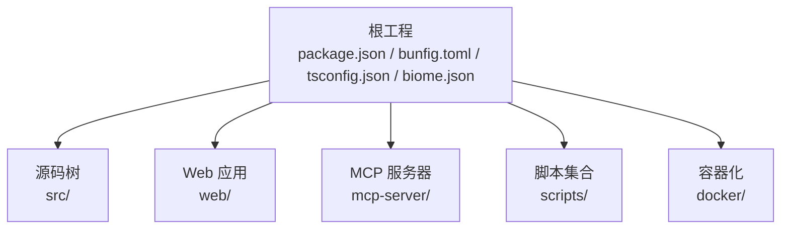
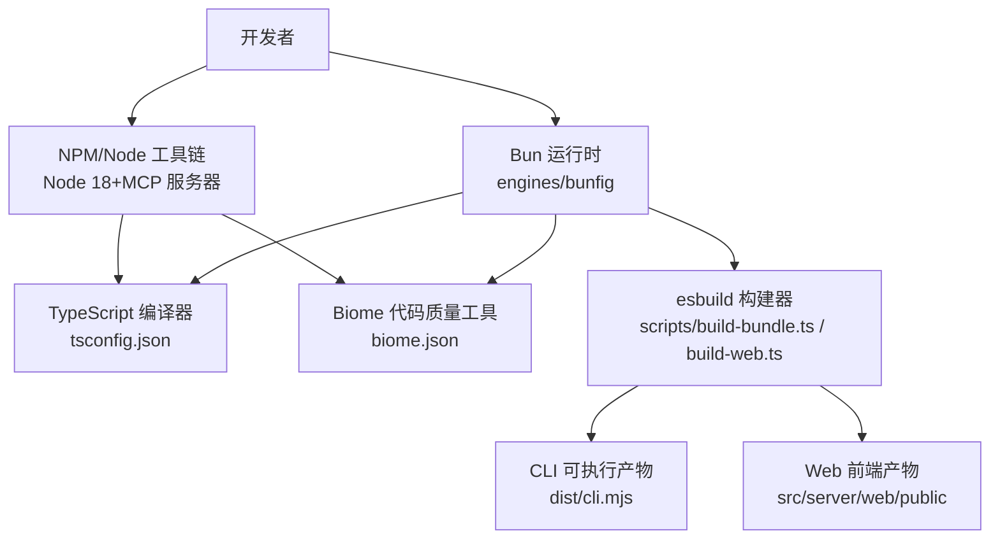
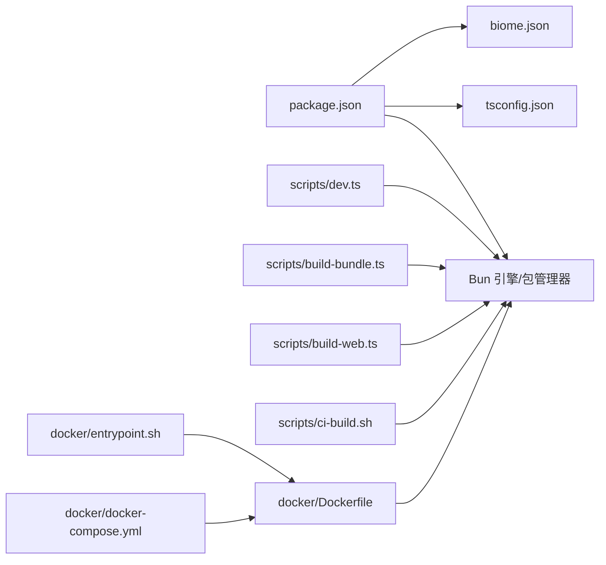

# 开发环境搭建

<cite>
**本文引用的文件**
- [package.json](file://package.json)
- [bunfig.toml](file://bunfig.toml)
- [biome.json](file://biome.json)
- [tsconfig.json](file://tsconfig.json)
- [README.md](file://README.md)
- [CONTRIBUTING.md](file://CONTRIBUTING.md)
- [scripts/dev.ts](file://scripts/dev.ts)
- [scripts/build-bundle.ts](file://scripts/build-bundle.ts)
- [scripts/build-web.ts](file://scripts/build-web.ts)
- [scripts/build.sh](file://scripts/build.sh)
- [scripts/ci-build.sh](file://scripts/ci-build.sh)
- [docker/Dockerfile](file://docker/Dockerfile)
- [docker/docker-compose.yml](file://docker/docker-compose.yml)
- [docker/entrypoint.sh](file://docker/entrypoint.sh)
</cite>

## 目录
1. [简介](#简介)
2. [项目结构](#项目结构)
3. [核心组件](#核心组件)
4. [架构总览](#架构总览)
5. [详细组件分析](#详细组件分析)
6. [依赖关系分析](#依赖关系分析)
7. [性能考虑](#性能考虑)
8. [故障排查指南](#故障排查指南)
9. [结论](#结论)
10. [附录](#附录)

## 简介
本指南面向希望在本地搭建并开发 Claude Code 的工程师与研究者。文档基于仓库中的配置与脚本，系统性说明系统要求、前置条件、项目克隆与初始化、开发工具链配置（Bun 运行时、TypeScript 编译器、Biome 代码质量工具），以及跨平台（Windows、macOS、Linux）的环境差异与注意事项，并提供常见问题排查与解决方案。

## 项目结构
该仓库采用“根工程 + 多子系统”的组织方式：
- 根工程：使用 Bun 作为包管理器与运行时，提供统一的构建与开发脚本。
- 源码目录：src/ 为核心业务源码，包含 CLI、工具系统、命令系统、桥接层、服务层等。
- Web 前端：web/ 为 Next.js 应用（独立于主 CLI，用于探索用途）。
- MCP 服务器：mcp-server/ 提供交互式源码探索能力。
- 脚本与工具：scripts/ 下包含打包、开发启动、Web 构建等脚本。
- 容器化：docker/ 提供多阶段构建与运行时镜像。

图表来源
- [package.json:1-95](file://package.json#L1-L95)
- [tsconfig.json:1-28](file://tsconfig.json#L1-L28)
- [biome.json:1-50](file://biome.json#L1-L50)
- [bunfig.toml:1-5](file://bunfig.toml#L1-L5)

章节来源
- [package.json:1-95](file://package.json#L1-L95)
- [tsconfig.json:1-28](file://tsconfig.json#L1-L28)
- [biome.json:1-50](file://biome.json#L1-L50)
- [bunfig.toml:1-5](file://bunfig.toml#L1-L5)

## 核心组件
- 包管理与运行时：Bun（引擎与包管理器版本在 engines 与 packageManager 中声明）
- 类型检查：TypeScript（严格模式）
- 代码质量：Biome（格式化与静态检查）
- 构建工具：esbuild（CLI 打包）、内联脚本（Web 前端打包）
- 开发入口：scripts/dev.ts（直接通过 Bun 运行 CLI 入口）
- 质量门禁：scripts/build.sh 与 scripts/ci-build.sh（安装、类型检查、Lint、构建与校验）

章节来源
- [package.json:76-94](file://package.json#L76-L94)
- [tsconfig.json:2-26](file://tsconfig.json#L2-L26)
- [biome.json:1-50](file://biome.json#L1-L50)
- [scripts/dev.ts:1-16](file://scripts/dev.ts#L1-L16)
- [scripts/build.sh:1-59](file://scripts/build.sh#L1-L59)
- [scripts/ci-build.sh:1-50](file://scripts/ci-build.sh#L1-L50)

## 架构总览
下图展示了从开发者到 CLI 运行、构建与验证的关键路径，以及与 Biome、TypeScript、esbuild 的协作关系。

图表来源
- [package.json:76-94](file://package.json#L76-L94)
- [tsconfig.json:1-28](file://tsconfig.json#L1-L28)
- [biome.json:1-50](file://biome.json#L1-L50)
- [scripts/build-bundle.ts:66-145](file://scripts/build-bundle.ts#L66-L145)
- [scripts/build-web.ts:25-38](file://scripts/build-web.ts#L25-L38)

## 详细组件分析

### 系统要求与前置条件
- Bun 运行时与包管理器
  - 引擎要求：engines.bun >= 1.1.0
  - 包管理器锁定：packageManager = bun@1.1.0
- Node.js 18+
  - 用于 MCP 服务器开发与部分 Node 工具链
- Git
  - 用于克隆与版本控制
- 可选：Docker（如需容器化部署或调试）

章节来源
- [package.json:90-94](file://package.json#L90-L94)
- [CONTRIBUTING.md:24-28](file://CONTRIBUTING.md#L24-L28)

### 项目克隆与初始化
- 克隆仓库
  - 使用 Git 克隆主仓库
- 初始化依赖
  - 推荐使用 Bun 安装依赖（自动读取 package.json 与 bun.lock）
  - 若无 Bun，脚本会回退到 npm
- 验证与检查
  - 一键安装、类型检查与 Lint：./scripts/build.sh 或 ./scripts/build.sh all
  - CI 流水线示例：./scripts/ci-build.sh

章节来源
- [scripts/build.sh:14-34](file://scripts/build.sh#L14-L34)
- [scripts/ci-build.sh:13-20](file://scripts/ci-build.sh#L13-L20)

### 开发工具链配置

#### Bun 运行时与预加载
- 预加载插件：bunfig.toml 指定 preload，确保在开发时加载 bun:bundle 的 shim
- 开发启动：scripts/dev.ts 直接导入 CLI 入口，自动读取项目根的 .env 文件
- 版本约束：engines 与 packageManager 明确 Bun 版本要求

章节来源
- [bunfig.toml:1-5](file://bunfig.toml#L1-L5)
- [scripts/dev.ts:1-16](file://scripts/dev.ts#L1-L16)
- [package.json:90-94](file://package.json#L90-L94)

#### TypeScript 编译器
- 严格模式：tsconfig.json 启用 strict、skipLibCheck 等
- 模块解析：bundler 模式，baseUrl 与 paths 配置支持 src/ 别名
- JSX：react-jsx，目标 ESNext
- 仅编译检查：不输出 JS（noEmit），配合 esbuild 产出最终可执行文件

章节来源
- [tsconfig.json:1-28](file://tsconfig.json#L1-L28)

#### Biome 代码质量工具
- 导入整理、Linter 规则、格式化策略均在 biome.json 中定义
- 忽略目录：node_modules、dist、*.d.ts
- 与脚本集成：npm run lint、lint:fix、format、check

章节来源
- [biome.json:1-50](file://biome.json#L1-L50)
- [package.json:20-24](file://package.json#L20-L24)

#### esbuild 构建管线
- CLI 打包：scripts/build-bundle.ts
  - 单文件输出（bundle），目标 Node 20+，外部化 Node 内置与原生模块
  - 定义宏常量与环境变量，生成可执行文件并输出元数据
- Web 前端打包：scripts/build-web.ts
  - 面向浏览器，按需最小化与内联 sourcemap

章节来源
- [scripts/build-bundle.ts:66-145](file://scripts/build-bundle.ts#L66-L145)
- [scripts/build-web.ts:25-38](file://scripts/build-web.ts#L25-L38)

### 不同操作系统下的环境配置方案

#### Windows
- 运行时与包管理
  - 推荐使用 Bun（engines 与 packageManager 已明确版本）
  - 若无法使用 Bun，脚本会回退到 npm（见 build.sh）
- 原生模块与依赖
  - node-pty 等原生模块可能需要额外编译工具链；Dockerfile 展示了在容器中安装 Python3、make、g++ 的流程
- 终端与权限
  - 以非管理员用户运行，避免权限问题
- 开发体验
  - 使用 WSL2 可获得更接近 Linux 的开发体验，便于编译与调试

章节来源
- [scripts/build.sh:16-23](file://scripts/build.sh#L16-L23)
- [docker/Dockerfile:17-20](file://docker/Dockerfile#L17-L20)

#### macOS
- 运行时与包管理
  - 使用 Bun，确保版本满足 engines.bun
- 原生模块
  - Xcode Command Line Tools 与系统编译链通常已就绪
- 开发体验
  - 可直接使用 scripts/dev.ts 启动 CLI
  - 如需容器化，docker-compose 可直接使用

章节来源
- [package.json:90-94](file://package.json#L90-L94)
- [docker/docker-compose.yml:1-29](file://docker/docker-compose.yml#L1-L29)

#### Linux
- 运行时与包管理
  - 使用 Bun；若不可用回退 npm
- 原生模块
  - 安装 Python3、make、g++ 等编译工具（参考 Dockerfile）
- 权限与用户
  - 容器运行建议使用非 root 用户，遵循 Dockerfile 中的用户与权限设置
- 开发体验
  - 可直接使用 scripts/dev.ts 启动 CLI
  - 使用 docker-compose 快速启动 Web 终端服务

章节来源
- [scripts/build.sh:16-23](file://scripts/build.sh#L16-L23)
- [docker/Dockerfile:17-20](file://docker/Dockerfile#L17-L20)
- [docker/docker-compose.yml:1-29](file://docker/docker-compose.yml#L1-L29)

### 开发工作流与质量门禁

#### 本地开发启动
- 直接运行 CLI：bun scripts/dev.ts [args...]
- 预加载：bunfig.toml 自动注入 bun:bundle shim
- 环境变量：项目根的 .env 将被自动读取

章节来源
- [bunfig.toml:1-5](file://bunfig.toml#L1-L5)
- [scripts/dev.ts:1-16](file://scripts/dev.ts#L1-L16)

#### 构建与验证
- 生产构建：bun run build:prod（调用 build-bundle.ts）
- 开发构建：bun run build（watch 模式）
- Web 前端：bun scripts/build-web.ts（支持 watch 与 minify）
- CI 校验：./scripts/ci-build.sh（安装、类型检查、Lint、构建与产物校验）

章节来源
- [package.json:12-18](file://package.json#L12-L18)
- [scripts/build-bundle.ts:147-192](file://scripts/build-bundle.ts#L147-L192)
- [scripts/build-web.ts:40-53](file://scripts/build-web.ts#L40-L53)
- [scripts/ci-build.sh:22-47](file://scripts/ci-build.sh#L22-L47)

#### 代码质量与格式化
- Lint：npm run lint / lint:fix
- 格式化：npm run format
- 全量检查：npm run check（Biome + TypeScript）

章节来源
- [package.json:20-24](file://package.json#L20-L24)
- [biome.json:1-50](file://biome.json#L1-L50)

## 依赖关系分析

图表来源
- [package.json:1-95](file://package.json#L1-L95)
- [tsconfig.json:1-28](file://tsconfig.json#L1-L28)
- [biome.json:1-50](file://biome.json#L1-L50)
- [scripts/dev.ts:1-16](file://scripts/dev.ts#L1-L16)
- [scripts/build-bundle.ts:1-198](file://scripts/build-bundle.ts#L1-L198)
- [scripts/build-web.ts:1-59](file://scripts/build-web.ts#L1-L59)
- [scripts/ci-build.sh:1-50](file://scripts/ci-build.sh#L1-L50)
- [docker/Dockerfile:1-84](file://docker/Dockerfile#L1-L84)
- [docker/docker-compose.yml:1-29](file://docker/docker-compose.yml#L1-L29)
- [docker/entrypoint.sh:1-29](file://docker/entrypoint.sh#L1-L29)

章节来源
- [package.json:1-95](file://package.json#L1-L95)
- [tsconfig.json:1-28](file://tsconfig.json#L1-L28)
- [biome.json:1-50](file://biome.json#L1-L50)
- [scripts/dev.ts:1-16](file://scripts/dev.ts#L1-L16)
- [scripts/build-bundle.ts:1-198](file://scripts/build-bundle.ts#L1-L198)
- [scripts/build-web.ts:1-59](file://scripts/build-web.ts#L1-L59)
- [scripts/ci-build.sh:1-50](file://scripts/ci-build.sh#L1-L50)
- [docker/Dockerfile:1-84](file://docker/Dockerfile#L1-L84)
- [docker/docker-compose.yml:1-29](file://docker/docker-compose.yml#L1-L29)
- [docker/entrypoint.sh:1-29](file://docker/entrypoint.sh#L1-L29)

## 性能考虑
- 构建性能
  - 使用 esbuild 进行快速打包，单文件输出减少运行时模块解析开销
  - watch 模式支持增量构建，提升迭代效率
- 运行时性能
  - Bun 作为运行时具备更快的启动与执行速度
  - TypeScript 严格模式与 noEmit 配置降低运行时负担
- 容器化优化
  - 多阶段构建分离编译与运行时，减小镜像体积
  - 非 root 用户运行，提升安全性与稳定性

章节来源
- [scripts/build-bundle.ts:147-192](file://scripts/build-bundle.ts#L147-L192)
- [docker/Dockerfile:12-84](file://docker/Dockerfile#L12-L84)

## 故障排查指南

### 1) Bun 版本不满足要求
- 症状：安装或运行时报错，提示 Bun 版本过低
- 解决：升级到满足 engines.bun 的版本（>= 1.1.0），或更新 packageManager 指定的 bun@1.1.0

章节来源
- [package.json:90-94](file://package.json#L90-L94)

### 2) 未安装 Node.js 18+
- 症状：MCP 服务器开发或 Node 工具链报错
- 解决：安装 Node.js 18+，确保 npm 可用

章节来源
- [CONTRIBUTING.md:26-28](file://CONTRIBUTING.md#L26-L28)

### 3) 依赖安装失败（Bun 与 npm 回退）
- 症状：PATH 中找不到 bun 或 npm
- 解决：安装 Bun 或使用 npm；脚本会在缺失时给出错误提示

章节来源
- [scripts/build.sh:16-23](file://scripts/build.sh#L16-L23)

### 4) 原生模块编译失败（node-pty 等）
- 症状：安装依赖时报错，涉及原生模块
- 解决：在宿主机安装 Python3、make、g++ 等编译工具；或使用 Docker 容器进行构建

章节来源
- [docker/Dockerfile:17-20](file://docker/Dockerfile#L17-L20)

### 5) Web 前端构建异常
- 症状：构建失败或样式/资源加载错误
- 解决：确认 Node.js 与 esbuild 可用；使用 scripts/build-web.ts 的 watch 模式定位问题

章节来源
- [scripts/build-web.ts:40-53](file://scripts/build-web.ts#L40-L53)

### 6) CI 构建产物缺失或不可执行
- 症状：ci-build.sh 校验失败，dist/cli.mjs 不存在或无法执行
- 解决：检查 Bun 版本、依赖安装与生产构建命令；验证 Node 与 Bun 均可执行产物

章节来源
- [scripts/ci-build.sh:25-47](file://scripts/ci-build.sh#L25-L47)

### 7) 容器启动失败（缺少 API Key）
- 症状：entrypoint.sh 报错，提示未设置 ANTHROPIC_API_KEY
- 解决：通过环境变量传入 ANTHROPIC_API_KEY；或在 docker-compose 中通过 .env 文件注入

章节来源
- [docker/entrypoint.sh:4-13](file://docker/entrypoint.sh#L4-L13)
- [docker/docker-compose.yml:8-12](file://docker/docker-compose.yml#L8-L12)

## 结论
通过以上步骤，您可以在 Windows、macOS、Linux 上完成 Claude Code 的开发环境搭建。建议优先使用 Bun 作为运行时与包管理器，并结合 Biome 与 TypeScript 实现高质量的开发体验。如需快速验证与部署，可参考 Dockerfile 与 docker-compose.yml 的多阶段构建与运行时配置。

## 附录

### 常用命令速查
- 安装依赖：bun install 或 ./scripts/build.sh install
- 类型检查：bun run typecheck 或 ./scripts/build.sh check
- Lint：bun run lint / lint:fix / format / check
- CLI 开发启动：bun scripts/dev.ts [args...]
- 生产构建：bun run build:prod
- Web 前端构建：bun scripts/build-web.ts --minify
- CI 校验：./scripts/ci-build.sh

章节来源
- [package.json:12-24](file://package.json#L12-L24)
- [scripts/build.sh:36-54](file://scripts/build.sh#L36-L54)
- [scripts/ci-build.sh:8-20](file://scripts/ci-build.sh#L8-L20)
- [scripts/dev.ts:1-16](file://scripts/dev.ts#L1-L16)
- [scripts/build-web.ts:1-8](file://scripts/build-web.ts#L1-L8)