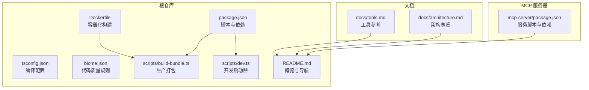
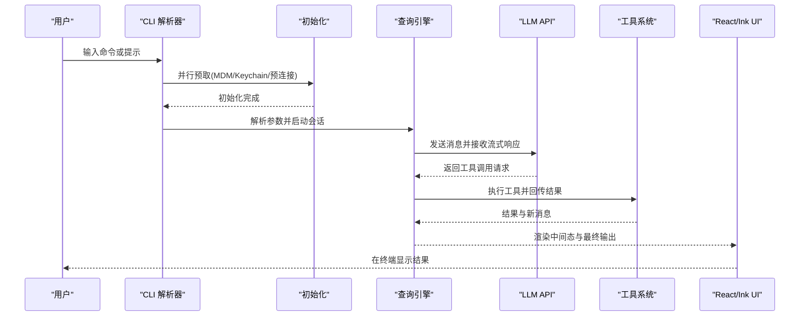
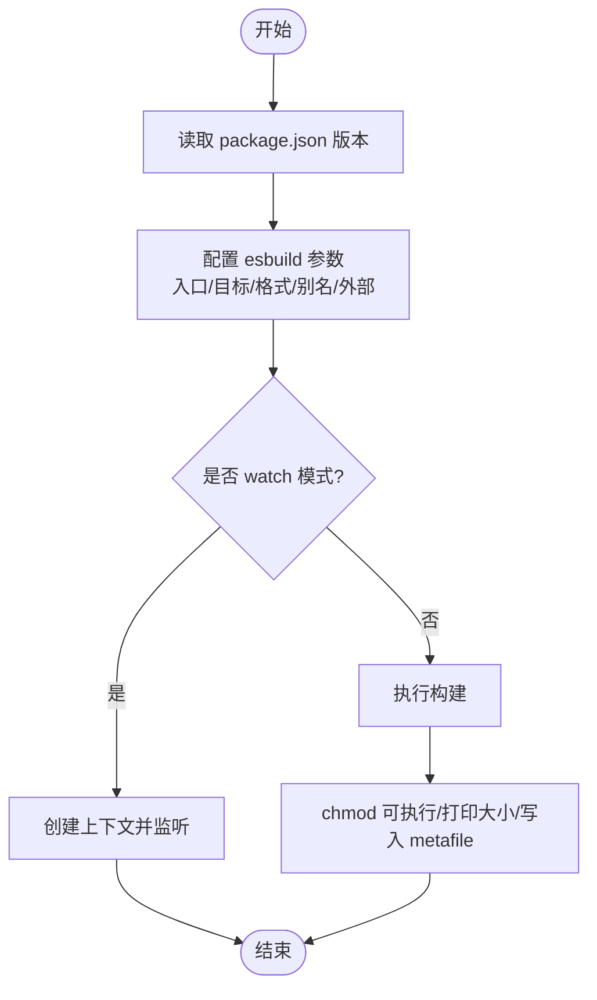
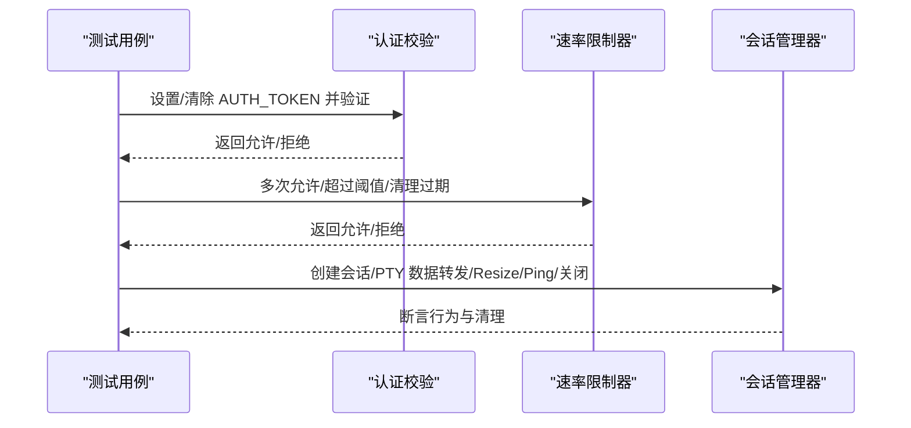
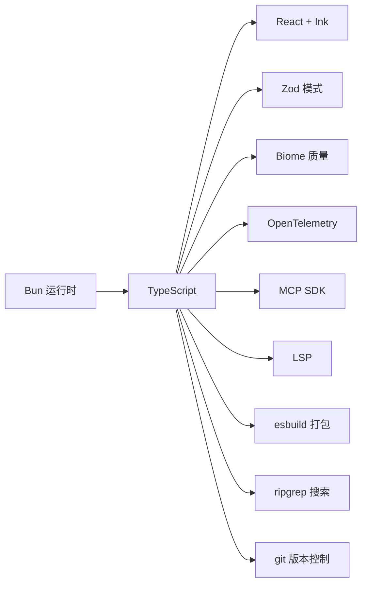

# 开发者指南

<cite>
**本文引用的文件**
- [README.md](file://README.md)
- [CONTRIBUTING.md](file://CONTRIBUTING.md)
- [package.json](file://package.json)
- [tsconfig.json](file://tsconfig.json)
- [biome.json](file://biome.json)
- [Dockerfile](file://Dockerfile)
- [scripts/build-bundle.ts](file://scripts/build-bundle.ts)
- [scripts/dev.ts](file://scripts/dev.ts)
- [mcp-server/package.json](file://mcp-server/package.json)
- [docs/architecture.md](file://docs/architecture.md)
- [docs/tools.md](file://docs/tools.md)
- [src/server/web/__tests__/auth.test.ts](file://src/server/web/__tests__/auth.test.ts)
- [src/server/web/__tests__/session-manager.test.ts](file://src/server/web/__tests__/session-manager.test.ts)
</cite>

## 目录
1. [简介](#简介)
2. [项目结构](#项目结构)
3. [核心组件](#核心组件)
4. [架构总览](#架构总览)
5. [详细组件分析](#详细组件分析)
6. [依赖分析](#依赖分析)
7. [性能考虑](#性能考虑)
8. [故障排查指南](#故障排查指南)
9. [结论](#结论)
10. [附录](#附录)

## 简介
本指南面向希望参与 Claude Code 探索与开发的工程师，聚焦于以下目标：
- 快速搭建开发环境（依赖安装、配置设置、工具链准备）
- 明确代码贡献流程（分支策略、提交规范、代码审查要求）
- 掌握调试与测试方法（单元测试、集成测试、端到端测试）
- 性能优化要点（内存管理、并发处理、资源优化）
- 构建与打包流程（TypeScript 编译、代码分割、产物优化）
- 代码质量工具（Biome、ESLint、Prettier）的使用
- 常见开发场景的最佳实践与解决方案

## 项目结构
该项目由三部分组成：
- 核心 CLI 应用：位于根目录的源码与脚本，负责命令行交互、工具系统、权限控制、UI 渲染等
- MCP 探索服务器：独立子项目，提供模型上下文协议（MCP）服务以探索源码
- 文档与分析：docs/ 提供架构、工具、命令等参考文档

图表来源
- [package.json:12-24](file://package.json#L12-L24)
- [tsconfig.json:1-28](file://tsconfig.json#L1-L28)
- [biome.json:1-50](file://biome.json#L1-L50)
- [Dockerfile:1-46](file://Dockerfile#L1-L46)
- [scripts/build-bundle.ts:1-198](file://scripts/build-bundle.ts#L1-L198)
- [scripts/dev.ts:1-16](file://scripts/dev.ts#L1-L16)
- [mcp-server/package.json:1-34](file://mcp-server/package.json#L1-L34)
- [docs/architecture.md:1-225](file://docs/architecture.md#L1-L225)
- [docs/tools.md:1-174](file://docs/tools.md#L1-L174)

章节来源
- [README.md:193-236](file://README.md#L193-L236)
- [package.json:1-95](file://package.json#L1-L95)
- [tsconfig.json:1-28](file://tsconfig.json#L1-L28)
- [biome.json:1-50](file://biome.json#L1-L50)
- [Dockerfile:1-46](file://Dockerfile#L1-L46)
- [scripts/build-bundle.ts:1-198](file://scripts/build-bundle.ts#L1-L198)
- [scripts/dev.ts:1-16](file://scripts/dev.ts#L1-L16)
- [mcp-server/package.json:1-34](file://mcp-server/package.json#L1-L34)
- [docs/architecture.md:1-225](file://docs/architecture.md#L1-L225)
- [docs/tools.md:1-174](file://docs/tools.md#L1-L174)

## 核心组件
- CLI 入口与初始化：通过入口脚本加载宏常量、启动 CLI 并进入 REPL
- 查询引擎：负责流式响应、工具调用循环、重试与令牌计费
- 工具系统：每个能力作为自包含模块，具备输入校验、权限模型、执行逻辑与 UI 组件
- 命令系统：用户在 REPL 中通过“/”前缀触发的命令集合
- UI 层：基于 React + Ink 的终端 UI，支持屏幕模式、组件与钩子
- 配置与模式：Zod 模式校验、迁移、特性开关（死代码消除）

章节来源
- [docs/architecture.md:21-78](file://docs/architecture.md#L21-L78)
- [docs/tools.md:7-50](file://docs/tools.md#L7-L50)
- [README.md:341-350](file://README.md#L341-L350)

## 架构总览
下图展示从用户输入到终端渲染的整体数据流。

图表来源
- [docs/architecture.md:9-15](file://docs/architecture.md#L9-L15)
- [docs/architecture.md:41-63](file://docs/architecture.md#L41-L63)
- [docs/architecture.md:96-125](file://docs/architecture.md#L96-L125)

## 详细组件分析

### 构建与打包系统
- 使用 esbuild 进行单文件打包，目标平台为 Node.js，输出为 ESM（.mjs），启用外部映射与死代码消除
- 通过 define 注入版本与包信息，并按是否压缩决定 NODE_ENV
- 支持 watch 与元数据分析，便于体积优化与依赖洞察
- Docker 多阶段构建：先在 builder 阶段安装依赖并构建，再复制到最小运行时镜像

图表来源
- [scripts/build-bundle.ts:66-145](file://scripts/build-bundle.ts#L66-L145)
- [scripts/build-bundle.ts:147-192](file://scripts/build-bundle.ts#L147-L192)
- [Dockerfile:12-44](file://Dockerfile#L12-L44)

章节来源
- [scripts/build-bundle.ts:1-198](file://scripts/build-bundle.ts#L1-L198)
- [Dockerfile:1-46](file://Dockerfile#L1-L46)

### 开发启动与本地运行
- 开发启动器自动加载宏常量并在 Bun 环境中直接运行 CLI 入口
- 通过 .env 文件支持环境变量注入
- MCP 服务器可使用 tsx 开发模式热启动

章节来源
- [scripts/dev.ts:1-16](file://scripts/dev.ts#L1-L16)
- [mcp-server/package.json:19-19](file://mcp-server/package.json#L19-L19)

### 测试体系
- Node 内置测试框架用于编写单元测试
- 覆盖认证校验、速率限制与会话管理等关键路径
- 使用 mock 对外部依赖进行隔离，确保测试稳定可靠

图表来源
- [src/server/web/__tests__/auth.test.ts:10-40](file://src/server/web/__tests__/auth.test.ts#L10-L40)
- [src/server/web/__tests__/auth.test.ts:42-76](file://src/server/web/__tests__/auth.test.ts#L42-L76)
- [src/server/web/__tests__/session-manager.test.ts:49-160](file://src/server/web/__tests__/session-manager.test.ts#L49-L160)

章节来源
- [src/server/web/__tests__/auth.test.ts:1-77](file://src/server/web/__tests__/auth.test.ts#L1-L77)
- [src/server/web/__tests__/session-manager.test.ts:1-160](file://src/server/web/__tests__/session-manager.test.ts#L1-L160)

### 权限与工具系统
- 工具定义遵循统一模式：输入校验、权限检查、并发安全声明、只读属性、系统提示注入、UI 渲染
- 权限模式支持默认、计划、绕过、自动等策略，规则采用通配符匹配
- 工具分组为不同上下文的预设集合

章节来源
- [docs/tools.md:19-50](file://docs/tools.md#L19-L50)
- [docs/tools.md:140-160](file://docs/tools.md#L140-L160)

### UI 与状态管理
- 基于 React + Ink 的组件体系，提供屏幕模式、设计系统与大量钩子
- 状态管理采用上下文 + 自定义存储模式，支持派生状态与变更观察

章节来源
- [docs/architecture.md:96-125](file://docs/architecture.md#L96-L125)
- [docs/architecture.md:81-93](file://docs/architecture.md#L81-L93)

## 依赖分析
- 运行时：Bun（非 Node.js），支持原生 JSX/TSX、特性开关死代码消除、ESM
- 语言与类型：TypeScript（严格模式）、Zod（模式校验）
- UI：React + Ink（终端渲染）
- 协议：MCP SDK、LSP
- 分析与质量：Biome（格式化/导入整理/规则）、OpenTelemetry（遥测）
- 工具链：esbuild（打包）、ripgrep（搜索）、git（版本控制）

图表来源
- [README.md:352-367](file://README.md#L352-L367)
- [package.json:25-88](file://package.json#L25-L88)
- [tsconfig.json:2-22](file://tsconfig.json#L2-L22)

章节来源
- [README.md:352-367](file://README.md#L352-L367)
- [package.json:1-95](file://package.json#L1-L95)
- [tsconfig.json:1-28](file://tsconfig.json#L1-L28)

## 性能考虑
- 单线程事件循环：I/O 异步化，UI 使用并发渲染；CPU 密集任务通过子进程或 Web Worker 处理
- 延迟加载：对大型依赖（如 OpenTelemetry、gRPC）采用动态 import，按需加载
- 死代码消除：通过特性开关在构建时剔除未使用分支
- 打包优化：esbuild 单文件输出、Tree Shaking、外部化原生模块与内部包
- 容器化：多阶段构建减少镜像体积，仅拷贝必要二进制与运行时依赖

章节来源
- [docs/architecture.md:208-216](file://docs/architecture.md#L208-L216)
- [docs/architecture.md:180-187](file://docs/architecture.md#L180-L187)
- [scripts/build-bundle.ts:88-107](file://scripts/build-bundle.ts#L88-L107)
- [Dockerfile:12-44](file://Dockerfile#L12-L44)

## 故障排查指南
- 认证与速率限制
  - 当设置了全局访问令牌时，未携带正确令牌的连接会被拒绝
  - 速率限制器按 IP 粒度统计，在时间窗口内超过阈值会被阻断
- 会话管理
  - PTY 启动失败时会优雅关闭 WebSocket 并返回空会话
  - 会话生命周期内支持 Resize、Ping/Pong、数据转发与清理
- 常见问题定位
  - 使用测试用例覆盖的关键路径快速定位问题边界
  - 通过构建元数据与体积分析识别潜在的冗余依赖

章节来源
- [src/server/web/__tests__/auth.test.ts:21-39](file://src/server/web/__tests__/auth.test.ts#L21-L39)
- [src/server/web/__tests__/auth.test.ts:42-76](file://src/server/web/__tests__/auth.test.ts#L42-L76)
- [src/server/web/__tests__/session-manager.test.ts:138-147](file://src/server/web/__tests__/session-manager.test.ts#L138-L147)
- [src/server/web/__tests__/session-manager.test.ts:149-158](file://src/server/web/__tests__/session-manager.test.ts#L149-L158)

## 结论
本指南围绕开发环境搭建、贡献流程、调试测试、性能优化、构建打包与质量工具等方面，结合仓库现有脚本与文档，给出了可操作的实践建议。建议在开发过程中优先遵循 Biome 规则与 TypeScript 严格模式，利用 esbuild 与 Docker 保障构建一致性，并通过单元测试与会话测试覆盖关键路径。

## 附录

### 开发环境搭建步骤
- 克隆仓库并安装依赖
- 使用 Bun 作为运行时，确保版本满足 engines 要求
- 通过脚本运行开发与构建流程
- 使用 Biome 进行格式化与检查

章节来源
- [CONTRIBUTING.md:29-51](file://CONTRIBUTING.md#L29-L51)
- [package.json:90-94](file://package.json#L90-L94)
- [biome.json:1-50](file://biome.json#L1-L50)

### 贡献流程与规范
- 仅对文档、MCP 服务器与探索工具进行贡献，不修改原始源码
- 使用清晰的提交信息，遵循分支命名与 PR 流程
- 保持 TypeScript 严格模式与统一缩进风格

章节来源
- [CONTRIBUTING.md:1-73](file://CONTRIBUTING.md#L1-L73)

### 代码质量工具使用
- Biome：组织导入、格式化、规则检查与修复
- TypeScript：严格模式与类型检查
- ESLint/Prettier：可在本地配合使用，但仓库默认以 Biome 为主

章节来源
- [biome.json:1-50](file://biome.json#L1-L50)
- [package.json:19-23](file://package.json#L19-L23)