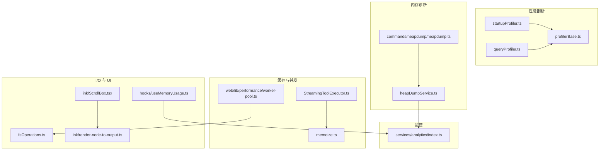
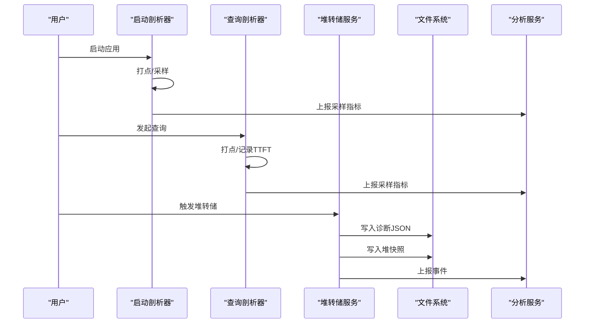
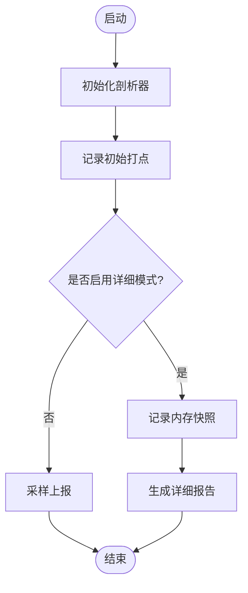
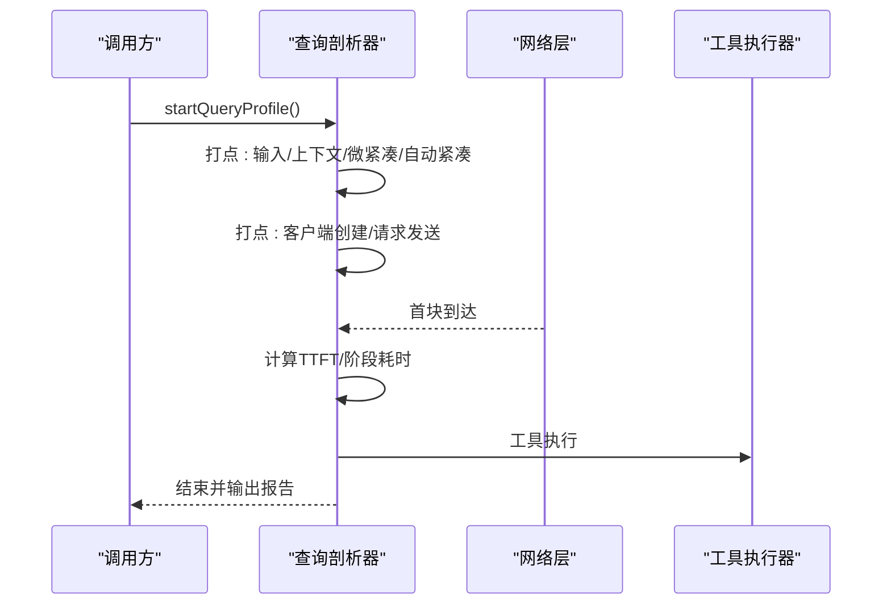
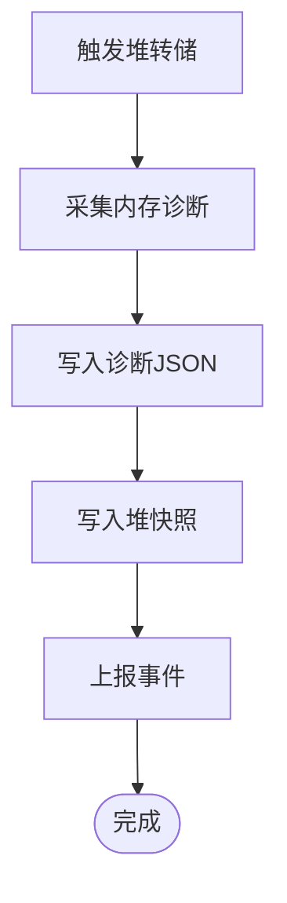
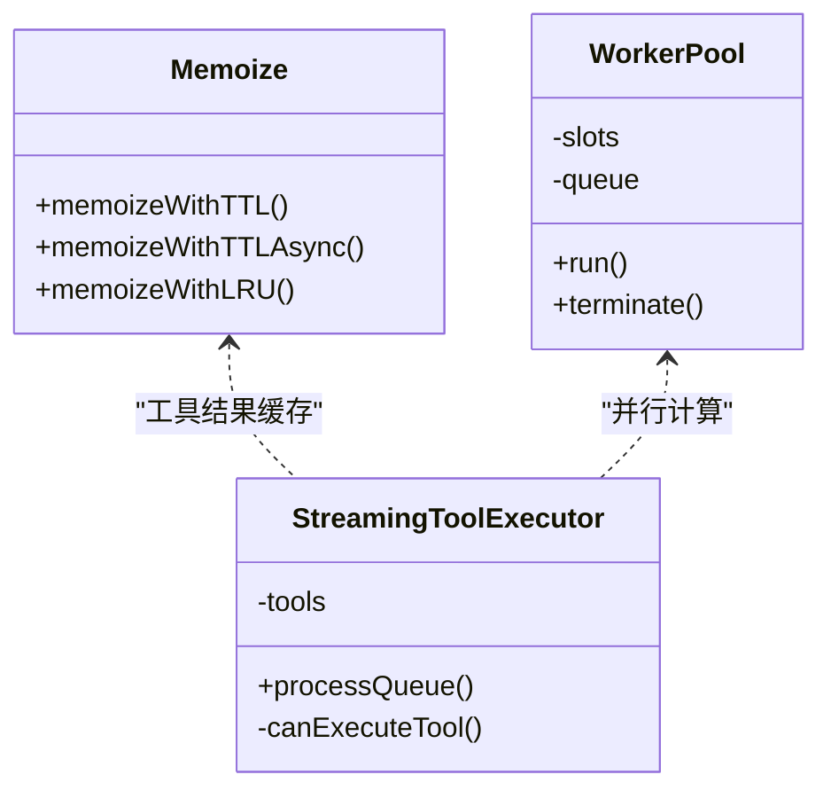
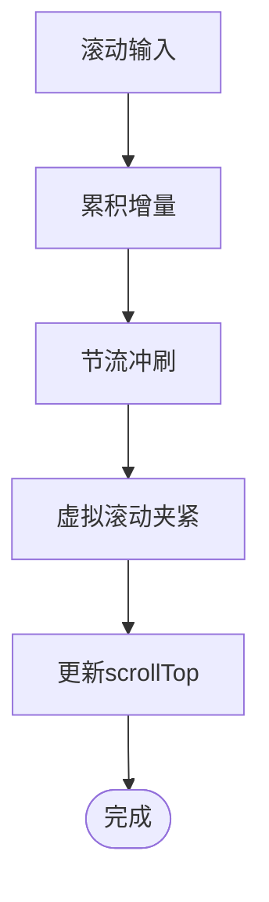
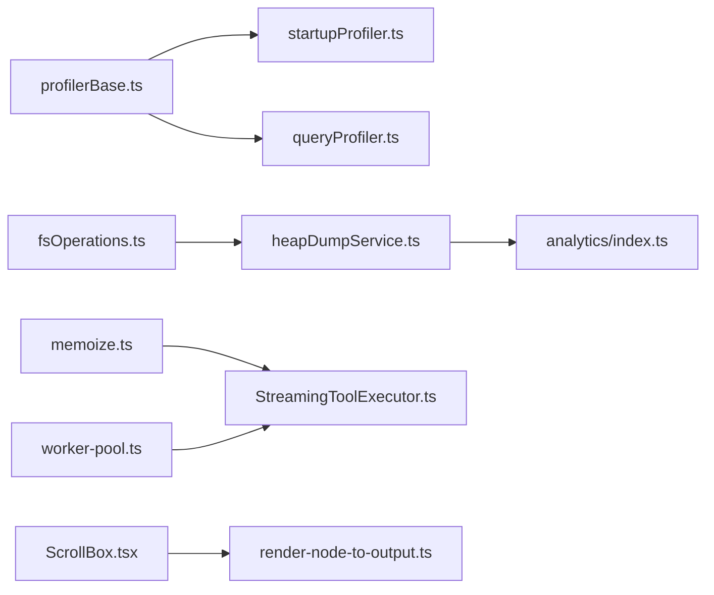

# 性能优化

<cite>
**本文引用的文件**   
- [src/utils/startupProfiler.ts](file://src/utils/startupProfiler.ts)
- [src/utils/queryProfiler.ts](file://src/utils/queryProfiler.ts)
- [src/utils/profilerBase.ts](file://src/utils/profilerBase.ts)
- [src/utils/heapDumpService.ts](file://src/utils/heapDumpService.ts)
- [src/commands/heapdump/heapdump.ts](file://src/commands/heapdump/heapdump.ts)
- [src/utils/memoize.ts](file://src/utils/memoize.ts)
- [src/services/tools/StreamingToolExecutor.ts](file://src/services/tools/StreamingToolExecutor.ts)
- [src/utils/fsOperations.ts](file://src/utils/fsOperations.ts)
- [src/services/analytics/index.ts](file://src/services/analytics/index.ts)
- [web/lib/performance/worker-pool.ts](file://web/lib/performance/worker-pool.ts)
- [src/hooks/useMemoryUsage.ts](file://src/hooks/useMemoryUsage.ts)
- [src/ink/components/ScrollBox.tsx](file://src/ink/components/ScrollBox.tsx)
- [src/ink/render-node-to-output.ts](file://src/ink/render-node-to-output.ts)
</cite>

## 目录
1. [简介](#简介)
2. [项目结构](#项目结构)
3. [核心组件](#核心组件)
4. [架构总览](#架构总览)
5. [详细组件分析](#详细组件分析)
6. [依赖关系分析](#依赖关系分析)
7. [性能考量](#性能考量)
8. [故障排除指南](#故障排除指南)
9. [结论](#结论)
10. [附录](#附录)

## 简介
本指南面向 Claude Code 的性能优化与监控，聚焦以下目标：
- 性能分析方法：内存使用监控、CPU 性能分析、I/O 操作优化
- 关键指标测量与监控：查询响应时间（含首 token 到达时间 TTFT）、工具执行效率、内存占用
- 优化策略与技术：缓存机制、并发处理、资源管理
- 瓶颈识别与解决：慢查询优化、工具执行优化、UI 渲染优化
- 生产环境监控与故障排除最佳实践

## 项目结构
围绕性能优化的关键模块分布如下：
- 启动与查询阶段的性能剖析器：启动阶段与查询阶段的时间线记录与报告生成
- 内存诊断与堆转储：采集进程内存与 V8 堆统计，生成诊断与堆快照
- 缓存与并发：通用记忆化与 LRU 缓存、工具执行并发控制、Web Worker 并行池
- 文件系统与 I/O：统一的文件操作封装与慢操作日志
- UI 渲染与滚动：虚拟滚动与节流，降低大列表渲染成本
- 监控与采样：事件采样与队列化，避免阻塞主流程

**图表来源**
- [src/utils/startupProfiler.ts:1-196](file://src/utils/startupProfiler.ts#L1-L196)
- [src/utils/queryProfiler.ts:1-303](file://src/utils/queryProfiler.ts#L1-L303)
- [src/utils/profilerBase.ts:1-48](file://src/utils/profilerBase.ts#L1-L48)
- [src/utils/heapDumpService.ts:1-305](file://src/utils/heapDumpService.ts#L1-L305)
- [src/commands/heapdump/heapdump.ts:1-17](file://src/commands/heapdump/heapdump.ts#L1-L17)
- [src/utils/memoize.ts:1-271](file://src/utils/memoize.ts#L1-L271)
- [src/services/tools/StreamingToolExecutor.ts:123-151](file://src/services/tools/StreamingToolExecutor.ts#L123-L151)
- [web/lib/performance/worker-pool.ts:1-116](file://web/lib/performance/worker-pool.ts#L1-L116)
- [src/utils/fsOperations.ts:440-615](file://src/utils/fsOperations.ts#L440-L615)
- [src/hooks/useMemoryUsage.ts:1-41](file://src/hooks/useMemoryUsage.ts#L1-L41)
- [src/ink/components/ScrollBox.tsx:135-174](file://src/ink/components/ScrollBox.tsx#L135-L174)
- [src/ink/render-node-to-output.ts:813-836](file://src/ink/render-node-to-output.ts#L813-L836)
- [src/services/analytics/index.ts:125-173](file://src/services/analytics/index.ts#L125-L173)

**章节来源**
- [src/utils/startupProfiler.ts:1-196](file://src/utils/startupProfiler.ts#L1-L196)
- [src/utils/queryProfiler.ts:1-303](file://src/utils/queryProfiler.ts#L1-L303)
- [src/utils/profilerBase.ts:1-48](file://src/utils/profilerBase.ts#L1-L48)
- [src/utils/heapDumpService.ts:1-305](file://src/utils/heapDumpService.ts#L1-L305)
- [src/commands/heapdump/heapdump.ts:1-17](file://src/commands/heapdump/heapdump.ts#L1-L17)
- [src/utils/memoize.ts:1-271](file://src/utils/memoize.ts#L1-L271)
- [src/services/tools/StreamingToolExecutor.ts:123-151](file://src/services/tools/StreamingToolExecutor.ts#L123-L151)
- [web/lib/performance/worker-pool.ts:1-116](file://web/lib/performance/worker-pool.ts#L1-L116)
- [src/utils/fsOperations.ts:440-615](file://src/utils/fsOperations.ts#L440-L615)
- [src/hooks/useMemoryUsage.ts:1-41](file://src/hooks/useMemoryUsage.ts#L1-L41)
- [src/ink/components/ScrollBox.tsx:135-174](file://src/ink/components/ScrollBox.tsx#L135-L174)
- [src/ink/render-node-to-output.ts:813-836](file://src/ink/render-node-to-output.ts#L813-L836)
- [src/services/analytics/index.ts:125-173](file://src/services/analytics/index.ts#L125-L173)

## 核心组件
- 启动性能剖析器：基于 Node perf_hooks 的时间线打点，支持采样上报与详细报告输出，并可选记录内存快照
- 查询性能剖析器：记录从用户输入到首块返回的完整链路，计算 TTFT 及各阶段耗时，输出阶段汇总
- 共享剖析基座：统一格式化输出、时间换算与内存格式化
- 堆转储与内存诊断：采集进程内存、V8 统计、句柄/请求数等，先写诊断再写堆快照，保障崩溃场景下仍可分析
- 缓存与并发：提供 TTL 记忆化、异步去重与 LRU 记忆化；工具执行按并发安全策略串并结合；Web Worker 池限制并发上限
- 文件系统与 I/O：统一抽象与慢操作日志，避免阻塞主线程
- UI 渲染：虚拟滚动与节流，减少大列表重排与绘制
- 监控与采样：事件队列化与动态采样，避免阻塞

**章节来源**
- [src/utils/startupProfiler.ts:1-196](file://src/utils/startupProfiler.ts#L1-L196)
- [src/utils/queryProfiler.ts:1-303](file://src/utils/queryProfiler.ts#L1-L303)
- [src/utils/profilerBase.ts:1-48](file://src/utils/profilerBase.ts#L1-L48)
- [src/utils/heapDumpService.ts:1-305](file://src/utils/heapDumpService.ts#L1-L305)
- [src/utils/memoize.ts:1-271](file://src/utils/memoize.ts#L1-L271)
- [src/services/tools/StreamingToolExecutor.ts:123-151](file://src/services/tools/StreamingToolExecutor.ts#L123-L151)
- [web/lib/performance/worker-pool.ts:1-116](file://web/lib/performance/worker-pool.ts#L1-L116)
- [src/utils/fsOperations.ts:440-615](file://src/utils/fsOperations.ts#L440-L615)
- [src/ink/components/ScrollBox.tsx:135-174](file://src/ink/components/ScrollBox.tsx#L135-L174)
- [src/ink/render-node-to-output.ts:813-836](file://src/ink/render-node-to-output.ts#L813-L836)
- [src/services/analytics/index.ts:125-173](file://src/services/analytics/index.ts#L125-L173)

## 架构总览
性能优化体系由“观测—度量—优化—反馈”闭环构成：
- 观测：启动与查询剖析器、内存诊断命令、UI 内存状态钩子
- 度量：TTFT、阶段耗时、内存增长速率、句柄/请求数
- 优化：缓存、并发调度、I/O 流水化、UI 虚拟化
- 反馈：事件采样上报、报告落盘与调试日志

**图表来源**
- [src/utils/startupProfiler.ts:159-194](file://src/utils/startupProfiler.ts#L159-L194)
- [src/utils/queryProfiler.ts:298-301](file://src/utils/queryProfiler.ts#L298-L301)
- [src/utils/heapDumpService.ts:221-278](file://src/utils/heapDumpService.ts#L221-L278)
- [src/services/analytics/index.ts:133-164](file://src/services/analytics/index.ts#L133-L164)

## 详细组件分析

### 启动性能剖析器
- 功能要点
  - 支持两类模式：采样上报（Statsig）与详细报告（启用环境变量）
  - 使用 perf_hooks 记录时间线，必要时记录内存快照
  - 将阶段耗时转换为可读报告，必要时落盘至配置目录
- 关键指标
  - 导入耗时、初始化耗时、设置加载耗时、总启动耗时
- 使用建议
  - 开发/回归：开启详细模式定位瓶颈
  - 生产：保持采样率可控，避免对用户造成额外开销

**图表来源**
- [src/utils/startupProfiler.ts:56-75](file://src/utils/startupProfiler.ts#L56-L75)
- [src/utils/startupProfiler.ts:81-119](file://src/utils/startupProfiler.ts#L81-L119)
- [src/utils/startupProfiler.ts:123-145](file://src/utils/startupProfiler.ts#L123-L145)

**章节来源**
- [src/utils/startupProfiler.ts:1-196](file://src/utils/startupProfiler.ts#L1-L196)
- [src/utils/profilerBase.ts:1-48](file://src/utils/profilerBase.ts#L1-L48)

### 查询性能剖析器
- 功能要点
  - 记录从输入到首块到达的完整链路，包含上下文加载、微紧凑、自动紧凑、客户端创建、网络 TTFB、工具执行等阶段
  - 输出相对时间线、阶段汇总、TTFT 统计
- 关键指标
  - TTFT、预请求开销占比、网络延迟占比、各阶段耗时
- 使用建议
  - 设置环境变量启用后复现问题，结合阶段汇总定位瓶颈

**图表来源**
- [src/utils/queryProfiler.ts:50-93](file://src/utils/queryProfiler.ts#L50-L93)
- [src/utils/queryProfiler.ts:129-211](file://src/utils/queryProfiler.ts#L129-L211)
- [src/utils/queryProfiler.ts:216-293](file://src/utils/queryProfiler.ts#L216-L293)

**章节来源**
- [src/utils/queryProfiler.ts:1-303](file://src/utils/queryProfiler.ts#L1-L303)

### 共享剖析基座
- 功能要点
  - 统一时间格式化、内存格式化、时间线行格式化
  - 惰性加载 perf_hooks，避免无谓开销
- 使用建议
  - 在所有剖析器中复用该基座，确保报告一致性

**章节来源**
- [src/utils/profilerBase.ts:1-48](file://src/utils/profilerBase.ts#L1-L48)

### 堆转储与内存诊断
- 功能要点
  - 先写诊断 JSON（包含内存、V8 统计、句柄/请求、平台信息），再写堆快照，保证崩溃场景仍可分析
  - 提供手动与自动触发（如达到阈值）
- 关键指标
  - heapUsed/heapTotal/external/rss、detachedContexts、activeHandles/Requests、native 内存占比、内存增长速率
- 使用建议
  - 出现内存异常时优先检查诊断 JSON 中的泄漏指示项

**图表来源**
- [src/utils/heapDumpService.ts:221-278](file://src/utils/heapDumpService.ts#L221-L278)
- [src/utils/heapDumpService.ts:88-212](file://src/utils/heapDumpService.ts#L88-L212)

**章节来源**
- [src/utils/heapDumpService.ts:1-305](file://src/utils/heapDumpService.ts#L1-L305)
- [src/commands/heapdump/heapdump.ts:1-17](file://src/commands/heapdump/heapdump.ts#L1-L17)

### 缓存与并发
- 记忆化与 TTL
  - 同步/异步函数的记忆化，支持过期刷新与去重，避免重复计算
  - LRU 记忆化防止无限增长
- 工具执行并发
  - 通过并发安全标记与队列顺序控制，非并发工具需串行，安全工具可并行
- Web Worker 并行池
  - 固定数量 Worker，任务排队与消息传递，限制最大并发避免过度线程化

**图表来源**
- [src/utils/memoize.ts:40-107](file://src/utils/memoize.ts#L40-L107)
- [src/utils/memoize.ts:120-220](file://src/utils/memoize.ts#L120-L220)
- [src/utils/memoize.ts:234-271](file://src/utils/memoize.ts#L234-L271)
- [src/services/tools/StreamingToolExecutor.ts:123-151](file://src/services/tools/StreamingToolExecutor.ts#L123-L151)
- [web/lib/performance/worker-pool.ts:18-101](file://web/lib/performance/worker-pool.ts#L18-L101)

**章节来源**
- [src/utils/memoize.ts:1-271](file://src/utils/memoize.ts#L1-L271)
- [src/services/tools/StreamingToolExecutor.ts:123-151](file://src/services/tools/StreamingToolExecutor.ts#L123-L151)
- [web/lib/performance/worker-pool.ts:1-116](file://web/lib/performance/worker-pool.ts#L1-L116)

### 文件系统与 I/O
- 统一抽象与慢操作日志
  - 对常用同步/异步读写进行包装，统一接口与慢操作追踪
  - 大文件读取采用分段读取，避免一次性分配大缓冲
- 建议
  - 优先使用异步接口，配合流式处理与背压控制

**章节来源**
- [src/utils/fsOperations.ts:440-615](file://src/utils/fsOperations.ts#L440-L615)

### UI 渲染与滚动优化
- 虚拟滚动与节流
  - 通过累积滚动增量与节流冲刷，避免长列表频繁重排
  - 边界追赶与滑动上限控制，保证交互流畅
- 建议
  - 大列表场景启用虚拟滚动，减少 DOM 节点与重绘

**图表来源**
- [src/ink/components/ScrollBox.tsx:141-161](file://src/ink/components/ScrollBox.tsx#L141-L161)
- [src/ink/render-node-to-output.ts:813-836](file://src/ink/render-node-to-output.ts#L813-L836)

**章节来源**
- [src/ink/components/ScrollBox.tsx:135-174](file://src/ink/components/ScrollBox.tsx#L135-L174)
- [src/ink/render-node-to-output.ts:813-836](file://src/ink/render-node-to-output.ts#L813-L836)

### 内存监控与告警
- 进程内存钩子
  - 定时轮询 heapUsed，超过阈值才暴露状态，避免高频重渲染
- 建议
  - 结合堆转储与诊断，定位泄漏来源（V8 堆 vs 原生内存）

**章节来源**
- [src/hooks/useMemoryUsage.ts:1-41](file://src/hooks/useMemoryUsage.ts#L1-L41)

## 依赖关系分析
- 剖析器依赖共享基座，确保格式一致
- 堆转储依赖文件系统与分析服务，事件上报与落盘解耦
- 缓存与并发在工具执行与 Web Worker 中复用
- UI 渲染依赖虚拟滚动与输出渲染管线

**图表来源**
- [src/utils/profilerBase.ts:1-48](file://src/utils/profilerBase.ts#L1-L48)
- [src/utils/startupProfiler.ts:1-196](file://src/utils/startupProfiler.ts#L1-L196)
- [src/utils/queryProfiler.ts:1-303](file://src/utils/queryProfiler.ts#L1-L303)
- [src/utils/heapDumpService.ts:1-305](file://src/utils/heapDumpService.ts#L1-L305)
- [src/services/analytics/index.ts:125-173](file://src/services/analytics/index.ts#L125-L173)
- [src/utils/fsOperations.ts:440-615](file://src/utils/fsOperations.ts#L440-L615)
- [src/utils/memoize.ts:1-271](file://src/utils/memoize.ts#L1-L271)
- [src/services/tools/StreamingToolExecutor.ts:123-151](file://src/services/tools/StreamingToolExecutor.ts#L123-L151)
- [web/lib/performance/worker-pool.ts:1-116](file://web/lib/performance/worker-pool.ts#L1-L116)
- [src/ink/components/ScrollBox.tsx:135-174](file://src/ink/components/ScrollBox.tsx#L135-L174)
- [src/ink/render-node-to-output.ts:813-836](file://src/ink/render-node-to-output.ts#L813-L836)

**章节来源**
- [src/utils/startupProfiler.ts:1-196](file://src/utils/startupProfiler.ts#L1-L196)
- [src/utils/queryProfiler.ts:1-303](file://src/utils/queryProfiler.ts#L1-L303)
- [src/utils/profilerBase.ts:1-48](file://src/utils/profilerBase.ts#L1-L48)
- [src/utils/heapDumpService.ts:1-305](file://src/utils/heapDumpService.ts#L1-L305)
- [src/services/analytics/index.ts:125-173](file://src/services/analytics/index.ts#L125-L173)
- [src/utils/fsOperations.ts:440-615](file://src/utils/fsOperations.ts#L440-L615)
- [src/utils/memoize.ts:1-271](file://src/utils/memoize.ts#L1-L271)
- [src/services/tools/StreamingToolExecutor.ts:123-151](file://src/services/tools/StreamingToolExecutor.ts#L123-L151)
- [web/lib/performance/worker-pool.ts:1-116](file://web/lib/performance/worker-pool.ts#L1-L116)
- [src/ink/components/ScrollBox.tsx:135-174](file://src/ink/components/ScrollBox.tsx#L135-L174)
- [src/ink/render-node-to-output.ts:813-836](file://src/ink/render-node-to-output.ts#L813-L836)

## 性能考量
- 时间度量
  - 启动阶段：导入、初始化、设置加载、总耗时
  - 查询阶段：上下文加载、微紧凑、自动紧凑、客户端创建、网络 TTFB、工具执行
- 内存度量
  - heapUsed/heapTotal/external/rss、V8 统计（detachedContexts、nativeContexts）、句柄/请求、native 内存占比、增长速率
- I/O 优化
  - 异步读写、分段读取、流式处理、避免阻塞主线程
- 并发优化
  - 工具执行并发安全控制、Web Worker 并发上限、缓存去重与刷新
- UI 优化
  - 虚拟滚动、节流冲刷、边界追赶、减少 DOM 节点

[本节为通用指导，不直接分析具体文件]

## 故障排除指南
- 启动卡顿
  - 启用详细启动剖析，查看导入与初始化阶段耗时，定位慢模块
  - 关注内存快照变化，排查异常增长
- 查询延迟高
  - 查看查询剖析报告，关注预请求开销与网络延迟占比
  - 检查工具执行阶段耗时，必要时启用缓存或并行化
- 内存异常
  - 使用堆转储命令生成诊断与快照，结合诊断 JSON 分析泄漏来源
  - 关注 detachedContexts、activeHandles、native 内存占比与增长速率
- UI 卡顿
  - 检查虚拟滚动与节流参数，确认长列表是否正确启用
  - 降低渲染频率，避免不必要的重渲染

**章节来源**
- [src/utils/startupProfiler.ts:123-145](file://src/utils/startupProfiler.ts#L123-L145)
- [src/utils/queryProfiler.ts:129-211](file://src/utils/queryProfiler.ts#L129-L211)
- [src/utils/heapDumpService.ts:221-278](file://src/utils/heapDumpService.ts#L221-L278)
- [src/commands/heapdump/heapdump.ts:1-17](file://src/commands/heapdump/heapdump.ts#L1-L17)
- [src/ink/components/ScrollBox.tsx:141-161](file://src/ink/components/ScrollBox.tsx#L141-L161)
- [src/ink/render-node-to-output.ts:813-836](file://src/ink/render-node-to-output.ts#L813-L836)

## 结论
通过启动与查询剖析器、内存诊断与堆转储、缓存与并发控制、I/O 与 UI 优化，以及事件采样与队列化监控，Claude Code 形成了完整的性能优化与监控体系。建议在开发与回归中启用详细剖析，在生产中维持低采样率以平衡可观测性与性能。

[本节为总结，不直接分析具体文件]

## 附录
- 环境变量与开关
  - 启动剖析：启用详细报告
  - 查询剖析：启用查询报告
- 常用命令
  - 堆转储：触发生成诊断与堆快照
- 监控与采样
  - 事件采样与队列化，避免阻塞主流程

**章节来源**
- [src/utils/startupProfiler.ts:24-36](file://src/utils/startupProfiler.ts#L24-L36)
- [src/utils/queryProfiler.ts:34-36](file://src/utils/queryProfiler.ts#L34-L36)
- [src/commands/heapdump/heapdump.ts:1-17](file://src/commands/heapdump/heapdump.ts#L1-L17)
- [src/services/analytics/index.ts:133-164](file://src/services/analytics/index.ts#L133-L164)