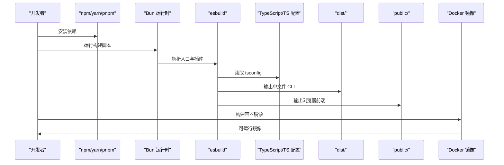
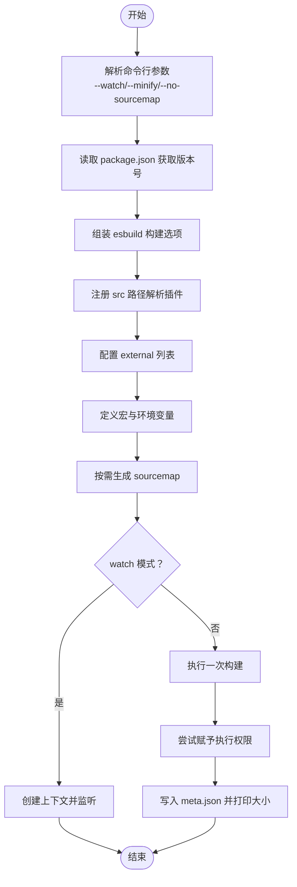
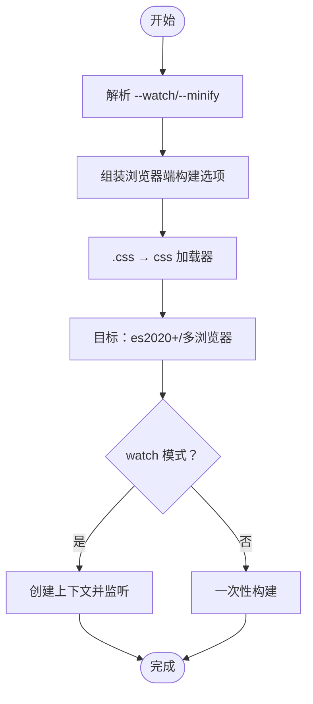
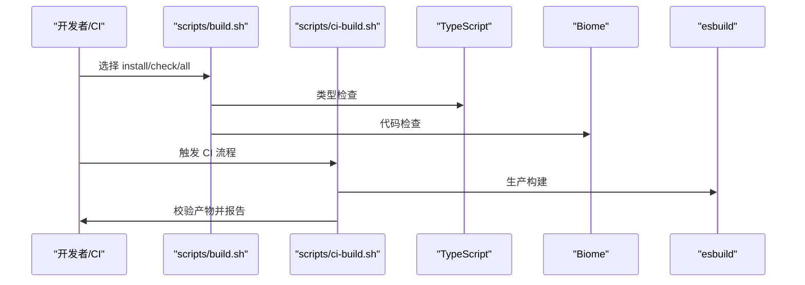
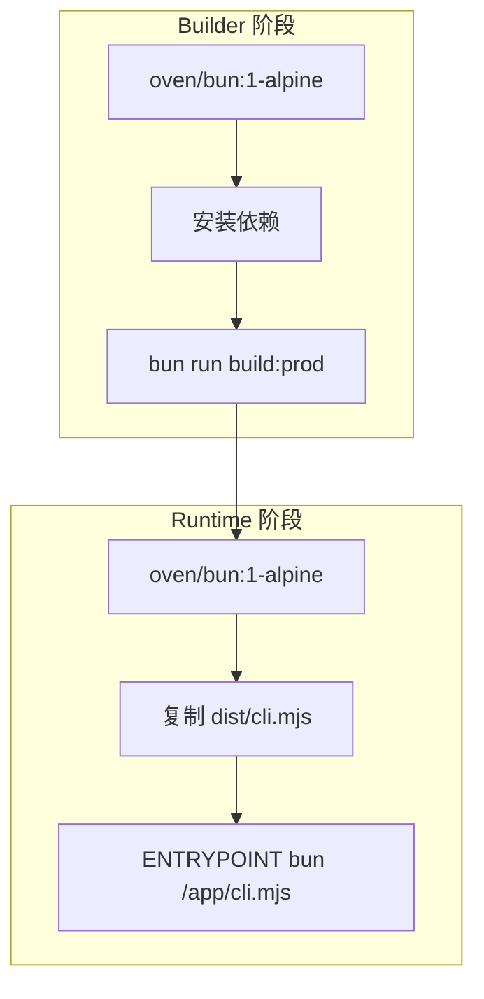
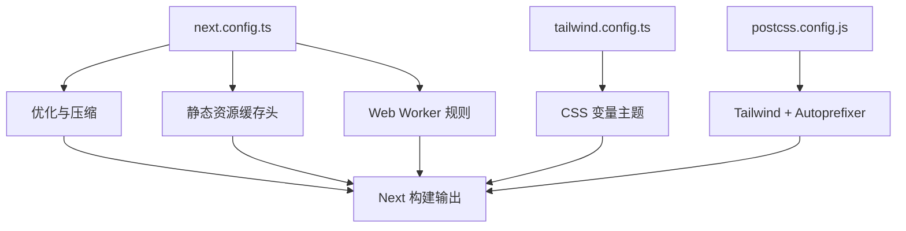
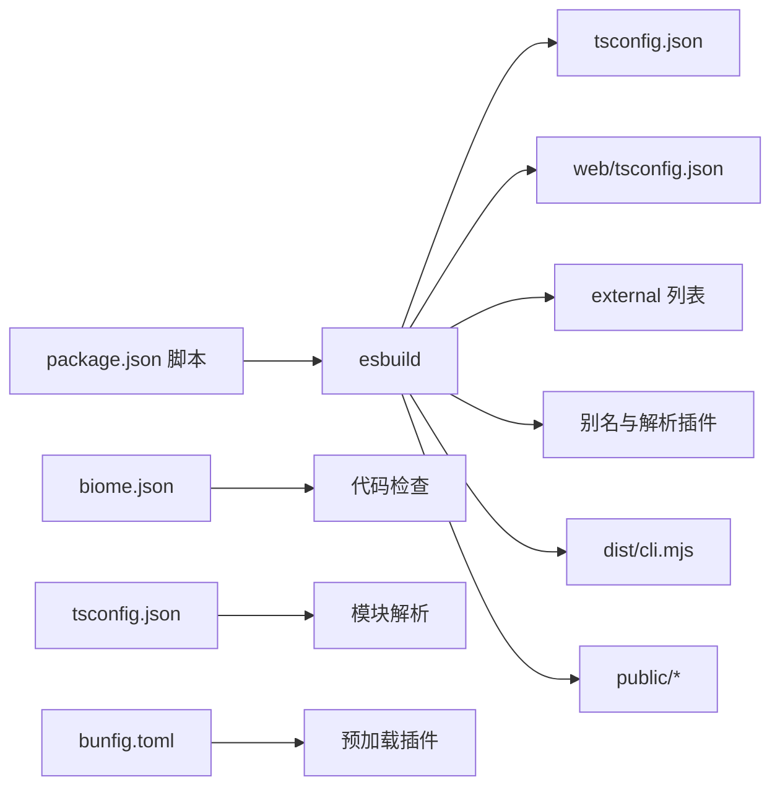

# 构建与打包

<cite>
**本文引用的文件**
- [package.json](file://package.json)
- [scripts/build-bundle.ts](file://scripts/build-bundle.ts)
- [scripts/build-web.ts](file://scripts/build-web.ts)
- [scripts/build.sh](file://scripts/build.sh)
- [scripts/ci-build.sh](file://scripts/ci-build.sh)
- [tsconfig.json](file://tsconfig.json)
- [scripts/tsconfig.json](file://scripts/tsconfig.json)
- [Dockerfile](file://Dockerfile)
- [docker/Dockerfile](file://docker/Dockerfile)
- [docker/entrypoint.sh](file://docker/entrypoint.sh)
- [web/next.config.ts](file://web/next.config.ts)
- [web/tailwind.config.ts](file://web/tailwind.config.ts)
- [web/postcss.config.js](file://web/postcss.config.js)
- [bunfig.toml](file://bunfig.toml)
- [biome.json](file://biome.json)
</cite>

## 目录
1. [简介](#简介)
2. [项目结构](#项目结构)
3. [核心组件](#核心组件)
4. [架构总览](#架构总览)
5. [详细组件分析](#详细组件分析)
6. [依赖关系分析](#依赖关系分析)
7. [性能考量](#性能考量)
8. [故障排查指南](#故障排查指南)
9. [结论](#结论)
10. [附录](#附录)

## 简介
本指南面向 Claude Code 的构建与打包体系，覆盖以下主题：
- 构建流程：TypeScript 编译、代码分割与资源优化
- 环境差异：开发、测试、生产三类环境的差异化配置
- 打包策略：CLI 可执行文件、Docker 容器化、Web 应用打包
- 构建脚本：使用方法与可选参数
- 优化技巧：增量构建、并行编译、产物压缩
- 跨平台与部署：注意事项与最佳实践

## 项目结构
该仓库采用多入口、多目标的构建布局：
- CLI 可执行文件：通过 esbuild 单文件打包，输出到 dist/cli.mjs
- Web 前端（终端）：浏览器端打包，输出到 src/server/web/public
- Docker 容器：提供 CLI 生产镜像与 Web 终端运行时镜像
- 开发工具链：Biome 格式与检查、TypeScript 配置、Bun 预加载插件

```mermaid
graph TB
subgraph "源代码"
SRC["src/"]
WEB["web/"]
end
subgraph "构建脚本"
B_CLI["scripts/build-bundle.ts"]
B_WEB["scripts/build-web.ts"]
SH1["scripts/build.sh"]
SH2["scripts/ci-build.sh"]
end
subgraph "产物"
DIST["dist/"]
PUB["src/server/web/public/"]
end
subgraph "容器"
D1["Dockerfile (CLI)"]
D2["docker/Dockerfile (Web)"]
EP["docker/entrypoint.sh"]
end
SRC --> B_CLI --> DIST
SRC --> B_WEB --> PUB
B_CLI -. 使用 . -> TS["tsconfig.json"]
B_WEB -. 使用 . -> WTS["web/tsconfig.json"]
SH1 --> B_CLI
SH2 --> B_CLI
D1 --> DIST
D2 --> SRC
D2 --> EP
```

图表来源
- [scripts/build-bundle.ts:1-198](file://scripts/build-bundle.ts#L1-L198)
- [scripts/build-web.ts:1-59](file://scripts/build-web.ts#L1-L59)
- [Dockerfile:1-46](file://Dockerfile#L1-L46)
- [docker/Dockerfile:1-84](file://docker/Dockerfile#L1-L84)
- [tsconfig.json:1-28](file://tsconfig.json#L1-L28)

章节来源
- [package.json:12-24](file://package.json#L12-L24)
- [scripts/build-bundle.ts:66-145](file://scripts/build-bundle.ts#L66-L145)
- [scripts/build-web.ts:25-38](file://scripts/build-web.ts#L25-L38)

## 核心组件
- CLI 构建器：负责将 CLI 入口打包为单文件 ESM 可执行文件，支持 watch、minify、sourcemap 控制，并注入宏常量与环境变量
- Web 构建器：针对浏览器端的终端前端进行打包，支持 watch、minify、内联 sourcemap
- 脚本工具：本地安装、类型检查、代码检查与 CI 流水线
- 容器镜像：多阶段构建，分离构建与运行时，确保最小化体积与安全默认

章节来源
- [scripts/build-bundle.ts:147-192](file://scripts/build-bundle.ts#L147-L192)
- [scripts/build-web.ts:40-53](file://scripts/build-web.ts#L40-L53)
- [scripts/build.sh:14-54](file://scripts/build.sh#L14-L54)
- [scripts/ci-build.sh:13-49](file://scripts/ci-build.sh#L13-L49)
- [Dockerfile:12-44](file://Dockerfile#L12-L44)
- [docker/Dockerfile:12-84](file://docker/Dockerfile#L12-L84)

## 架构总览
下图展示从源码到产物与容器的完整路径，以及关键配置点。



图表来源
- [package.json:12-24](file://package.json#L12-L24)
- [scripts/build-bundle.ts:66-145](file://scripts/build-bundle.ts#L66-L145)
- [scripts/build-web.ts:25-38](file://scripts/build-web.ts#L25-L38)
- [Dockerfile:12-44](file://Dockerfile#L12-L44)
- [docker/Dockerfile:12-84](file://docker/Dockerfile#L12-L84)

## 详细组件分析

### CLI 构建器（scripts/build-bundle.ts）
- 目标：将 CLI 入口打包为单文件 ESM 可执行文件，便于直接运行或容器分发
- 关键特性
  - 单文件输出：禁用代码分割，适合 CLI 工具
  - 外部化策略：排除 Node 内置模块与无法打包的原生库
  - 别名与解析：对 bun:bundle 进行别名映射；通过插件解析 src/ 路径别名
  - 宏注入：在构建期注入版本号、包名、问题反馈链接等常量
  - 环境变量：根据是否生产模式设置 NODE_ENV
  - 源图：生产默认外部 .map 文件，可通过参数关闭
  - 可执行权限：构建后尝试赋予执行权限
  - 分析元数据：输出 meta.json 用于进一步分析
- 参数
  - --watch：监听变更并增量重建
  - --minify：启用压缩
  - --no-sourcemap：不生成 sourcemap
- 入口与输出
  - 入口：src/entrypoints/cli.tsx
  - 输出：dist/cli.mjs（带 shebang）



图表来源
- [scripts/build-bundle.ts:147-192](file://scripts/build-bundle.ts#L147-L192)
- [scripts/build-bundle.ts:66-145](file://scripts/build-bundle.ts#L66-L145)

章节来源
- [scripts/build-bundle.ts:1-198](file://scripts/build-bundle.ts#L1-L198)
- [tsconfig.json:19-22](file://tsconfig.json#L19-L22)
- [bunfig.toml:1-5](file://bunfig.toml#L1-L5)

### Web 构建器（scripts/build-web.ts）
- 目标：浏览器端终端前端打包，输出到 public 目录
- 特性
  - 浏览器平台与现代目标（es2020+）
  - 自动内联 CSS 加载器
  - 支持 watch 与 minify
  - 按需内联 sourcemap（开发）
- 入口与输出
  - 入口：src/server/web/terminal.ts
  - 输出：src/server/web/public/



图表来源
- [scripts/build-web.ts:25-53](file://scripts/build-web.ts#L25-L53)

章节来源
- [scripts/build-web.ts:1-59](file://scripts/build-web.ts#L1-L59)

### 开发与质量工具（scripts/build.sh、scripts/ci-build.sh）
- scripts/build.sh
  - 支持 install、check、all 三种步骤
  - 自动检测并使用 bun 或 npm 安装依赖
  - 类型检查与 Biome 代码检查
- scripts/ci-build.sh
  - CI 专用流水线：安装 → 类型检查 → 代码检查 → 生产构建 → 校验产物
  - 校验 dist/cli.mjs 是否存在、打印大小、验证在 Node/Bun 下运行



图表来源
- [scripts/build.sh:14-54](file://scripts/build.sh#L14-L54)
- [scripts/ci-build.sh:13-49](file://scripts/ci-build.sh#L13-L49)

章节来源
- [scripts/build.sh:1-59](file://scripts/build.sh#L1-L59)
- [scripts/ci-build.sh:1-50](file://scripts/ci-build.sh#L1-L50)

### 容器化（Dockerfile 与 docker/Dockerfile）
- CLI 生产镜像（Dockerfile）
  - 多阶段：builder 阶段安装依赖并构建生产包，runtime 阶段仅复制 dist/cli.mjs
  - 运行时基础镜像：oven/bun:1-alpine
  - 安装必要系统依赖（git、ripgrep）
  - 可直接以 bun 执行 dist/cli.mjs
- Web 终端镜像（docker/Dockerfile）
  - 构建阶段：安装系统构建工具，编译 node-pty 原生模块，构建 CLI 并复制 node_modules、dist、src/server
  - 运行阶段：非 root 用户 claude，健康检查，暴露端口，入口脚本启动 PTY 服务器
  - 提供 thin wrapper 将 claude 作为可执行命令



图表来源
- [Dockerfile:12-44](file://Dockerfile#L12-L44)
- [docker/Dockerfile:12-84](file://docker/Dockerfile#L12-L84)
- [docker/entrypoint.sh:18-28](file://docker/entrypoint.sh#L18-L28)

章节来源
- [Dockerfile:1-46](file://Dockerfile#L1-L46)
- [docker/Dockerfile:1-84](file://docker/Dockerfile#L1-L84)
- [docker/entrypoint.sh:1-29](file://docker/entrypoint.sh#L1-L29)

### Web 应用打包（Next.js 配置）
- Next 配置
  - 启用 bundle analyzer（ANALYZE=true）
  - React 严格模式、Typed Routes、包导入优化
  - 响应压缩、图片格式与缓存头
  - Web Worker 支持与浏览器端忽略 node 模块
- Tailwind 与 PostCSS
  - Tailwind 配置基于 CSS 变量的主题系统
  - PostCSS 使用 Tailwind 与 Autoprefixer



图表来源
- [web/next.config.ts:8-71](file://web/next.config.ts#L8-L71)
- [web/tailwind.config.ts:1-203](file://web/tailwind.config.ts#L1-L203)
- [web/postcss.config.js:1-7](file://web/postcss.config.js#L1-L7)

章节来源
- [web/next.config.ts:1-72](file://web/next.config.ts#L1-L72)
- [web/tailwind.config.ts:1-203](file://web/tailwind.config.ts#L1-L203)
- [web/postcss.config.js:1-7](file://web/postcss.config.js#L1-L7)

## 依赖关系分析
- 构建工具链
  - esbuild：核心打包器，分别用于 CLI 与 Web
  - TypeScript：类型检查与模块解析
  - Biome：格式化与静态检查
  - Bun：运行时与预加载插件
- 外部依赖与打包策略
  - Node 内置模块与特定原生库被标记为 external，避免打包失败或体积膨胀
  - 通过别名与解析插件处理 src/ 路径与 bun:bundle 导入
- 容器层
  - 构建阶段安装所有依赖（含 devDependencies），运行阶段仅保留必要二进制与产物



图表来源
- [package.json:12-24](file://package.json#L12-L24)
- [scripts/build-bundle.ts:88-107](file://scripts/build-bundle.ts#L88-L107)
- [tsconfig.json:19-22](file://tsconfig.json#L19-L22)
- [bunfig.toml:1-5](file://bunfig.toml#L1-L5)
- [biome.json:1-50](file://biome.json#L1-L50)

章节来源
- [scripts/build-bundle.ts:88-107](file://scripts/build-bundle.ts#L88-L107)
- [tsconfig.json:1-28](file://tsconfig.json#L1-L28)
- [biome.json:1-50](file://biome.json#L1-L50)
- [bunfig.toml:1-5](file://bunfig.toml#L1-L5)

## 性能考量
- 增量构建与监听
  - CLI：--watch 模式使用 esbuild 上下文，自动监听并增量重建
  - Web：--watch 模式监听入口文件变化
- 并行编译
  - esbuild 默认并发处理，结合 watch 模式可显著缩短反馈周期
- 产物压缩
  - 生产模式启用 --minify，减少体积与传输时间
  - Web 构建在生产模式关闭 sourcemap，降低体积
- 体积分析
  - CLI 构建输出 meta.json，可用于进一步分析与优化
- 资源优化
  - Next.js 图片格式与缓存头、响应压缩、包导入优化
  - Tailwind 主题系统减少重复样式，提升渲染效率

章节来源
- [scripts/build-bundle.ts:148-151](file://scripts/build-bundle.ts#L148-L151)
- [scripts/build-web.ts:41-44](file://scripts/build-web.ts#L41-L44)
- [web/next.config.ts:15-16](file://web/next.config.ts#L15-L16)
- [web/next.config.ts:18-22](file://web/next.config.ts#L18-L22)
- [web/next.config.ts:10-13](file://web/next.config.ts#L10-L13)

## 故障排查指南
- 构建失败
  - 检查 esbuild 错误输出，确认入口路径与别名解析是否正确
  - 确认 external 列表未遗漏必要外部依赖
- 权限问题
  - CLI 构建后尝试赋予执行权限，若失败可在目标平台手动 chmod
- 容器运行
  - Web 镜像需要设置 ANTHROPIC_API_KEY 环境变量，否则启动会报错
  - 健康检查默认使用 curl 访问 /health，确保服务正常
- 质量门禁
  - 本地与 CI 均需通过类型检查与代码检查，避免提交失败

章节来源
- [scripts/build-bundle.ts:156-167](file://scripts/build-bundle.ts#L156-L167)
- [docker/entrypoint.sh:4-13](file://docker/entrypoint.sh#L4-L13)
- [scripts/ci-build.sh:25-31](file://scripts/ci-build.sh#L25-L31)
- [scripts/build.sh:26-29](file://scripts/build.sh#L26-L29)
- [scripts/build.sh:31-34](file://scripts/build.sh#L31-L34)

## 结论
本项目的构建与打包体系围绕 esbuild 实现了高效率的单文件 CLI 与浏览器前端打包，并通过 Docker 多阶段构建实现了最小化运行时镜像。配合 Biome 与 TypeScript 的质量控制，以及 Next.js 的前端优化，整体具备良好的开发体验与生产可用性。建议在团队中统一使用脚本与配置，确保跨平台一致性与可重复构建。

## 附录

### 环境与脚本速查
- 本地开发
  - 安装依赖：./scripts/build.sh install
  - 类型检查与代码检查：./scripts/build.sh check
  - 全流程：./scripts/build.sh all
- 生产构建
  - CLI：bun run build:prod
  - Web：bun run build:web:prod
- 监听开发
  - CLI：bun run build:watch
  - Web：bun run build:web:watch
- CI 流水线
  - ./scripts/ci-build.sh

章节来源
- [scripts/build.sh:12-54](file://scripts/build.sh#L12-L54)
- [package.json:12-24](file://package.json#L12-L24)
- [scripts/ci-build.sh:1-50](file://scripts/ci-build.sh#L1-L50)

### 配置要点清单
- CLI
  - 入口：src/entrypoints/cli.tsx
  - 输出：dist/cli.mjs
  - external：Node 内置与特定原生库
  - 宏注入：版本号、包名、问题反馈链接
  - 环境变量：NODE_ENV 根据是否生产模式设置
- Web
  - 入口：src/server/web/terminal.ts
  - 输出：src/server/web/public/
  - 目标：es2020+/多浏览器
  - sourcemap：生产关闭，开发内联
- Next.js
  - bundle analyzer：ANALYZE=true
  - 压缩与缓存头：开启
  - Web Worker：配置规则
  - Tailwind：基于 CSS 变量的主题
  - PostCSS：Tailwind + Autoprefixer

章节来源
- [scripts/build-bundle.ts:66-145](file://scripts/build-bundle.ts#L66-L145)
- [scripts/build-web.ts:25-38](file://scripts/build-web.ts#L25-L38)
- [web/next.config.ts:4-71](file://web/next.config.ts#L4-L71)
- [web/tailwind.config.ts:1-203](file://web/tailwind.config.ts#L1-L203)
- [web/postcss.config.js:1-7](file://web/postcss.config.js#L1-L7)