# 测试与调试

<cite>
**本文引用的文件**
- [package.json](file://package.json)
- [biome.json](file://biome.json)
- [scripts/build.sh](file://scripts/build.sh)
- [scripts/test-auth.ts](file://scripts/test-auth.ts)
- [scripts/test-commands.ts](file://scripts/test-commands.ts)
- [scripts/test-mcp.ts](file://scripts/test-mcp.ts)
- [src/server/web/__tests__/auth.test.ts](file://src/server/web/__tests__/auth.test.ts)
- [src/server/web/__tests__/session-manager.test.ts](file://src/server/web/__tests__/session-manager.test.ts)
- [src/utils/debug.ts](file://src/utils/debug.ts)
- [src/utils/log.ts](file://src/utils/log.ts)
- [src/utils/env.ts](file://src/utils/env.ts)
- [src/utils/fsOperations.ts](file://src/utils/fsOperations.ts)
- [src/utils/telemetry/perfettoTracing.ts](file://src/utils/telemetry/perfettoTracing.ts)
- [src/entrypoints/init.ts](file://src/entrypoints/init.ts)
- [src/services/analytics/index.ts](file://src/services/analytics/index.ts)
- [src/commands/init-verifiers.ts](file://src/commands/init-verifiers.ts)
</cite>

## 目录
1. [简介](#简介)
2. [项目结构](#项目结构)
3. [核心组件](#核心组件)
4. [架构总览](#架构总览)
5. [详细组件分析](#详细组件分析)
6. [依赖分析](#依赖分析)
7. [性能考虑](#性能考虑)
8. [故障排查指南](#故障排查指南)
9. [结论](#结论)
10. [附录](#附录)

## 简介
本指南面向 Claude Code 的开发者与维护者，系统性地介绍测试与调试方法论与实操步骤，覆盖：
- 测试框架与工具：单元测试、集成测试与端到端测试的编写与运行方式
- 调试技术：断点调试、日志记录、性能分析与追踪
- 代码质量保障：Biome 代码检查、TypeScript 类型检查与静态分析
- 测试用例最佳实践：覆盖率目标与测试数据准备策略
- 常见调试场景：权限问题、工具执行异常、会话管理错误等

## 项目结构
该项目采用多子项目与多语言混合架构（TypeScript、React、Node.js），测试与调试相关的关键位置如下：
- 根级脚本与配置：构建、类型检查、代码格式化与检查
- 子项目 mcp-server：独立的 MCP 协议服务，用于端到端测试
- 源码目录 src：包含命令系统、Web 服务器、桥接层、工具与服务等模块
- 测试目录：src/server/web/__tests__ 下存在基于 Node:test 的单元/集成测试

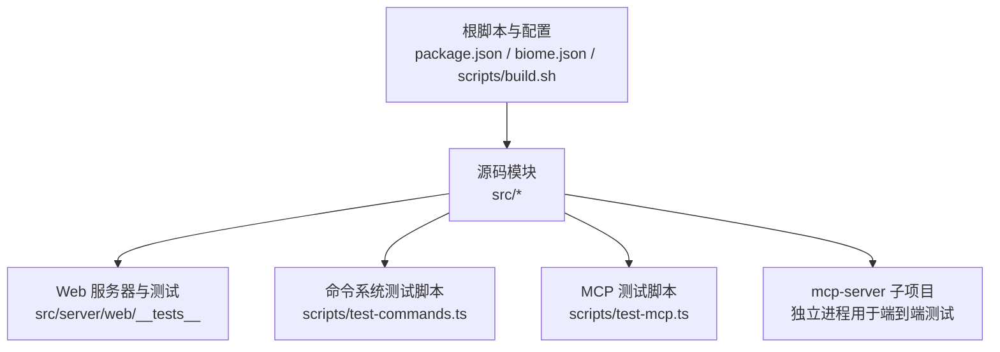

**图表来源**
- [package.json:12-24](file://package.json#L12-L24)
- [biome.json:1-50](file://biome.json#L1-L50)
- [scripts/build.sh:1-56](file://scripts/build.sh#L1-L56)
- [src/server/web/__tests__/auth.test.ts:1-77](file://src/server/web/__tests__/auth.test.ts#L1-L77)
- [src/server/web/__tests__/session-manager.test.ts:1-160](file://src/server/web/__tests__/session-manager.test.ts#L1-L160)
- [scripts/test-commands.ts:1-65](file://scripts/test-commands.ts#L1-L65)
- [scripts/test-mcp.ts:1-181](file://scripts/test-mcp.ts#L1-L181)

**章节来源**
- [package.json:12-24](file://package.json#L12-L24)
- [biome.json:1-50](file://biome.json#L1-L50)
- [scripts/build.sh:1-56](file://scripts/build.sh#L1-L56)

## 核心组件
- 构建与质量门禁
  - 类型检查：通过根脚本调用 tsc 进行全量类型检查
  - 代码检查：通过 Biome 对 src/ 执行 lint 与格式化
  - 快速构建脚本：scripts/build.sh 提供安装依赖、类型检查、代码检查的组合流程
- 测试脚本
  - API 认证连通性测试：scripts/test-auth.ts
  - 命令系统加载测试：scripts/test-commands.ts
  - MCP 客户端-服务端连通性测试：scripts/test-mcp.ts
- 单元/集成测试
  - Web 服务器认证与连接限流：src/server/web/__tests__/auth.test.ts
  - 会话管理器：src/server/web/__tests__/session-manager.test.ts
- 日志与调试
  - 统一日志与错误处理：src/utils/log.ts
  - 调试写入器与符号链接更新：src/utils/debug.ts
  - 性能追踪（Perfetto）：src/utils/telemetry/perfettoTracing.ts
  - 初始化 Telemetry（含远程设置）：src/entrypoints/init.ts
- 工具与环境
  - 文件系统抽象接口：src/utils/fsOperations.ts
  - 环境探测与 IDE 列表：src/utils/env.ts
  - 验证器初始化建议：src/commands/init-verifiers.ts

**章节来源**
- [scripts/test-auth.ts:1-27](file://scripts/test-auth.ts#L1-L27)
- [scripts/test-commands.ts:1-65](file://scripts/test-commands.ts#L1-L65)
- [scripts/test-mcp.ts:1-181](file://scripts/test-mcp.ts#L1-L181)
- [src/server/web/__tests__/auth.test.ts:1-77](file://src/server/web/__tests__/auth.test.ts#L1-L77)
- [src/server/web/__tests__/session-manager.test.ts:1-160](file://src/server/web/__tests__/session-manager.test.ts#L1-L160)
- [src/utils/log.ts:158-203](file://src/utils/log.ts#L158-L203)
- [src/utils/debug.ts:153-196](file://src/utils/debug.ts#L153-L196)
- [src/utils/telemetry/perfettoTracing.ts:696-763](file://src/utils/telemetry/perfettoTracing.ts#L696-L763)
- [src/entrypoints/init.ts:240-268](file://src/entrypoints/init.ts#L240-L268)
- [src/utils/fsOperations.ts:18-51](file://src/utils/fsOperations.ts#L18-L51)
- [src/utils/env.ts:96-132](file://src/utils/env.ts#L96-L132)
- [src/commands/init-verifiers.ts:27-82](file://src/commands/init-verifiers.ts#L27-L82)

## 架构总览
下图展示测试与调试在系统中的位置与交互关系。

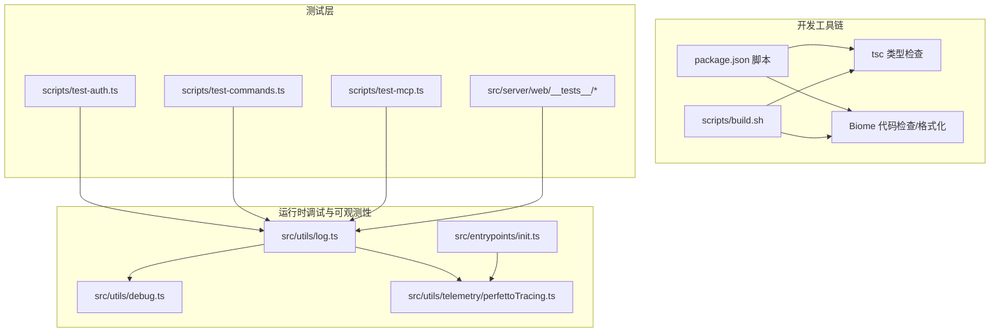

**图表来源**
- [package.json:12-24](file://package.json#L12-L24)
- [scripts/build.sh:26-34](file://scripts/build.sh#L26-L34)
- [scripts/test-auth.ts:1-27](file://scripts/test-auth.ts#L1-L27)
- [scripts/test-commands.ts:1-65](file://scripts/test-commands.ts#L1-L65)
- [scripts/test-mcp.ts:1-181](file://scripts/test-mcp.ts#L1-L181)
- [src/server/web/__tests__/auth.test.ts:1-77](file://src/server/web/__tests__/auth.test.ts#L1-L77)
- [src/server/web/__tests__/session-manager.test.ts:1-160](file://src/server/web/__tests__/session-manager.test.ts#L1-L160)
- [src/utils/log.ts:158-203](file://src/utils/log.ts#L158-L203)
- [src/utils/debug.ts:153-196](file://src/utils/debug.ts#L153-L196)
- [src/utils/telemetry/perfettoTracing.ts:696-763](file://src/utils/telemetry/perfettoTracing.ts#L696-L763)
- [src/entrypoints/init.ts:240-268](file://src/entrypoints/init.ts#L240-L268)

## 详细组件分析

### 组件一：构建与质量门禁
- 目标
  - 在本地与 CI 中统一执行类型检查与代码检查，确保提交前质量门槛
- 关键点
  - 根脚本提供 typecheck、lint、format、check 等命令
  - scripts/build.sh 将安装依赖、类型检查、代码检查串联为一键流程
  - biome.json 启用 linter、formatter，并忽略 node_modules、dist、*.d.ts
- 最佳实践
  - 优先使用 npm run check 或 scripts/build.sh check
  - 修改代码后先运行 npm run format 再执行 npm run lint

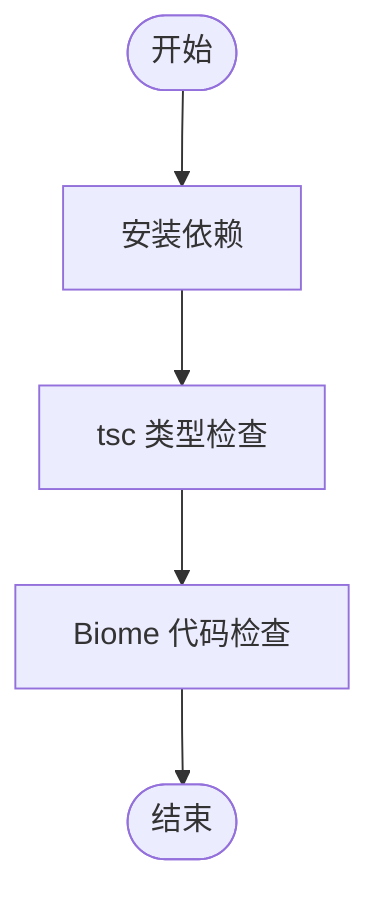

**图表来源**
- [package.json:19-23](file://package.json#L19-L23)
- [scripts/build.sh:14-34](file://scripts/build.sh#L14-L34)
- [biome.json:6-47](file://biome.json#L6-L47)

**章节来源**
- [package.json:19-23](file://package.json#L19-L23)
- [scripts/build.sh:14-34](file://scripts/build.sh#L14-L34)
- [biome.json:6-47](file://biome.json#L6-L47)

### 组件二：认证连通性测试（API）
- 目标
  - 快速验证 API 密钥配置正确且可访问上游服务
- 行为
  - 读取 ANTHROPIC_API_KEY，创建客户端并发送简短消息请求
  - 成功打印响应内容；失败输出错误并退出非零状态码
- 使用方式
  - 在具备有效密钥的环境中运行 scripts/test-auth.ts

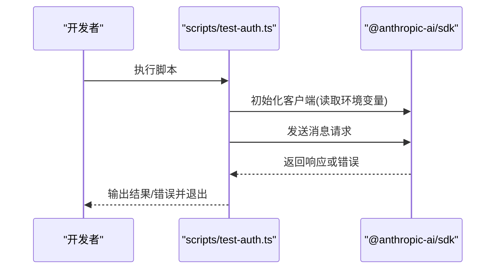

**图表来源**
- [scripts/test-auth.ts:7-24](file://scripts/test-auth.ts#L7-L24)

**章节来源**
- [scripts/test-auth.ts:1-27](file://scripts/test-auth.ts#L1-L27)

### 组件三：命令系统加载测试
- 目标
  - 确保命令系统在启动时可完整加载，关键命令可用
- 行为
  - 加载所有命令，按类型分组显示
  - 校验必要命令是否存在（如 help、config、init、commit、review）
  - 检查迁移到插件的提示类命令是否仍可加载
- 使用方式
  - 直接运行 scripts/test-commands.ts

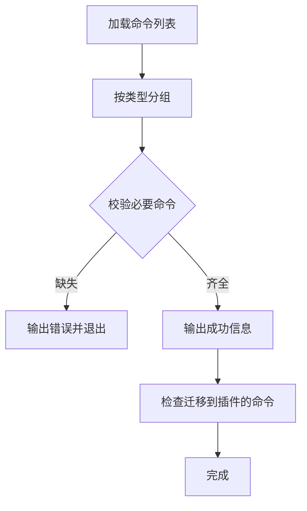

**图表来源**
- [scripts/test-commands.ts:10-58](file://scripts/test-commands.ts#L10-L58)

**章节来源**
- [scripts/test-commands.ts:1-65](file://scripts/test-commands.ts#L1-L65)

### 组件四：MCP 客户端-服务端端到端测试
- 目标
  - 验证 MCP 客户端与 mcp-server 子项目之间的协议连通性
- 行为
  - 以子进程方式启动 mcp-server/dist/index.js
  - 使用 @modelcontextprotocol/sdk 建立连接
  - 列出工具、调用 list_tools 与 read_source_file
  - 列出资源并读取首个资源
  - 打印结果并关闭连接
- 使用方式
  - 先在 mcp-server 目录安装依赖并构建，再在仓库根目录运行 scripts/test-mcp.ts

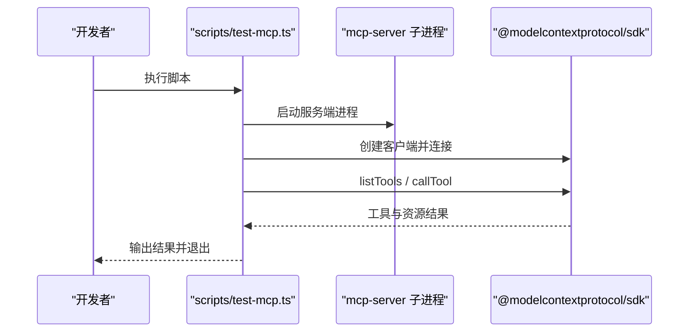

**图表来源**
- [scripts/test-mcp.ts:43-175](file://scripts/test-mcp.ts#L43-L175)

**章节来源**
- [scripts/test-mcp.ts:1-181](file://scripts/test-mcp.ts#L1-L181)

### 组件五：Web 服务器认证与连接限流单元测试
- 目标
  - 验证认证令牌校验逻辑与连接速率限制器行为
- 行为
  - 当未设置 AUTH_TOKEN 时允许所有连接
  - 设置 AUTH_TOKEN 时必须携带正确 token 才放行
  - 速率限制器按 IP 独立计数，窗口过期后清理
- 使用方式
  - 使用 Node:test 运行 src/server/web/__tests__/auth.test.ts

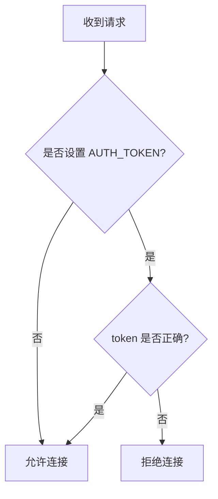

**图表来源**
- [src/server/web/__tests__/auth.test.ts:10-40](file://src/server/web/__tests__/auth.test.ts#L10-L40)

**章节来源**
- [src/server/web/__tests__/auth.test.ts:1-77](file://src/server/web/__tests__/auth.test.ts#L1-L77)

### 组件六：会话管理器单元测试
- 目标
  - 验证会话创建、并发限制、PTY/WS 数据转发、resize、ping/pong、关闭清理与异常处理
- 行为
  - 限制最大活跃会话数
  - 将 PTY 输出转发至 WebSocket，将 WS 输入转发至 PTY
  - 处理 resize 与 ping/pong
  - PTY 启动失败时优雅关闭 WS
  - destroyAll 清理全部会话
- 使用方式
  - 使用 Node:test 运行 src/server/web/__tests__/session-manager.test.ts

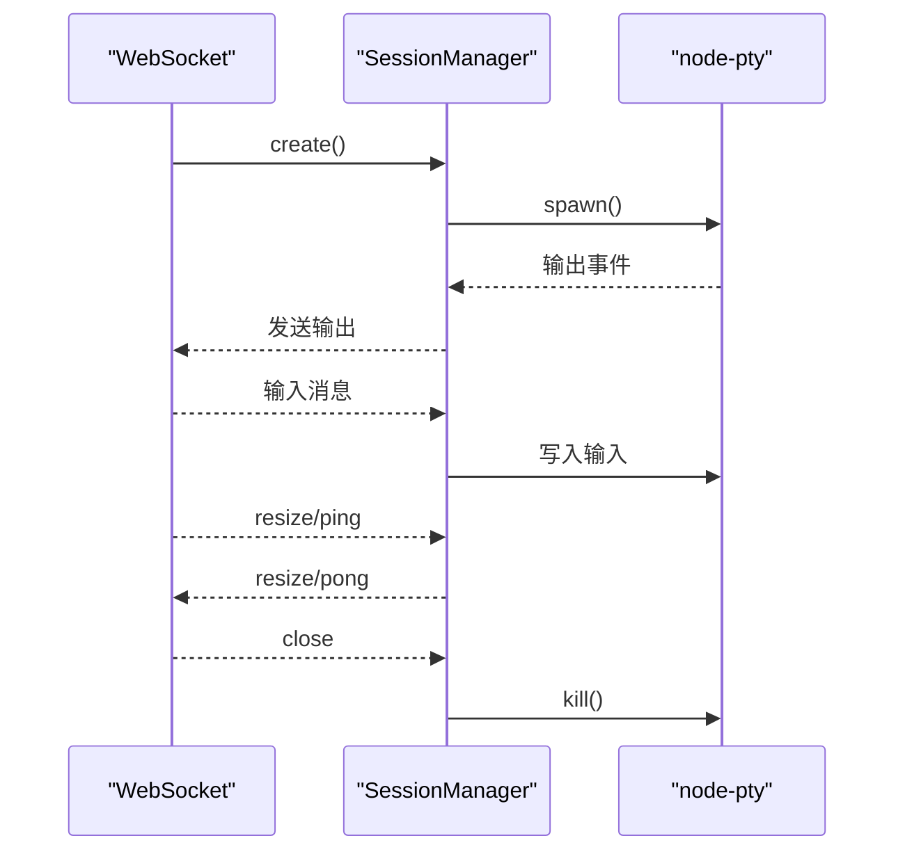

**图表来源**
- [src/server/web/__tests__/session-manager.test.ts:50-136](file://src/server/web/__tests__/session-manager.test.ts#L50-L136)

**章节来源**
- [src/server/web/__tests__/session-manager.test.ts:1-160](file://src/server/web/__tests__/session-manager.test.ts#L1-L160)

### 组件七：日志与调试
- 日志与错误处理
  - 统一错误入口，支持硬失败模式、内存内错误队列、sink 可插拔
  - 支持在无 sink 时进行队列缓存，待 sink 就绪后自动冲刷
- 调试写入器
  - 支持调试模式下的同步写入与缓冲模式下的异步写入
  - 自动创建目录并维护最新调试日志符号链接
- 使用建议
  - 开发阶段启用调试模式以获得更详尽日志
  - 在 CI 中避免过度日志导致磁盘压力

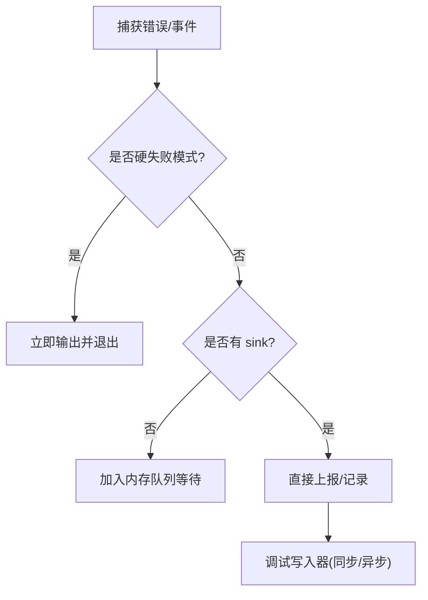

**图表来源**
- [src/utils/log.ts:158-203](file://src/utils/log.ts#L158-L203)
- [src/utils/debug.ts:153-196](file://src/utils/debug.ts#L153-L196)

**章节来源**
- [src/utils/log.ts:158-203](file://src/utils/log.ts#L158-L203)
- [src/utils/debug.ts:153-196](file://src/utils/debug.ts#L153-L196)

### 组件八：性能分析与追踪
- Perfetto Tracing
  - 工具执行生命周期追踪：开始/结束事件、持续时间、结果令牌数、错误信息
  - 与当前 Agent 信息关联，便于跨组件定位性能瓶颈
- Telemetry 初始化
  - 在获取信任后初始化遥测，对远程托管设置进行等待与重应用
- 使用建议
  - 在关键工具执行前后打点，结合日志定位慢路径
  - 在头等舱（headless）或 Beta 追踪场景下提前初始化以减少冷启动

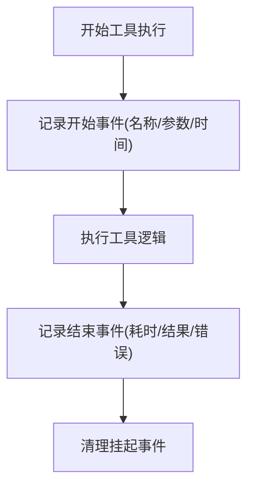

**图表来源**
- [src/utils/telemetry/perfettoTracing.ts:696-763](file://src/utils/telemetry/perfettoTracing.ts#L696-L763)
- [src/entrypoints/init.ts:240-268](file://src/entrypoints/init.ts#L240-L268)

**章节来源**
- [src/utils/telemetry/perfettoTracing.ts:696-763](file://src/utils/telemetry/perfettoTracing.ts#L696-L763)
- [src/entrypoints/init.ts:240-268](file://src/entrypoints/init.ts#L240-L268)

### 组件九：文件系统抽象与环境探测
- 文件系统抽象
  - 通过 FsOperations 接口封装常用同步/异步文件操作，便于测试替身与虚拟实现
- 环境探测
  - 平台与 IDE 类型识别，辅助调试与兼容性判断
- 使用建议
  - 在测试中注入替身 FsOperations 实现，隔离外部依赖

**章节来源**
- [src/utils/fsOperations.ts:18-51](file://src/utils/fsOperations.ts#L18-L51)
- [src/utils/env.ts:96-132](file://src/utils/env.ts#L96-L132)

### 组件十：验证器初始化建议
- 目标
  - 基于项目结构与现有工具，推荐合适的 UI 验证方案（Playwright、Chrome DevTools MCP、Claude Chrome 扩展等）
- 行为
  - 检测多语言/多栈项目区域
  - 推荐浏览器自动化工具并提供安装命令
- 使用建议
  - 在新项目或重构时参考该建议生成验证器配置

**章节来源**
- [src/commands/init-verifiers.ts:27-82](file://src/commands/init-verifiers.ts#L27-L82)

## 依赖分析
- 脚本与工具链
  - package.json 提供统一脚本入口，Biome 与 tsc 分别负责格式化与类型检查
  - scripts/build.sh 将上述流程整合为一键命令
- 测试与被测模块
  - scripts/test-commands.ts 与 scripts/test-auth.ts 作为快速自检脚本
  - scripts/test-mcp.ts 依赖 mcp-server 子项目作为被测服务端
  - src/server/web/__tests__ 直接测试 Web 层逻辑
- 调试与可观测性
  - src/utils/log.ts 与 src/utils/debug.ts 为日志与调试基础设施
  - src/utils/telemetry/perfettoTracing.ts 与 src/entrypoints/init.ts 提供性能追踪与初始化

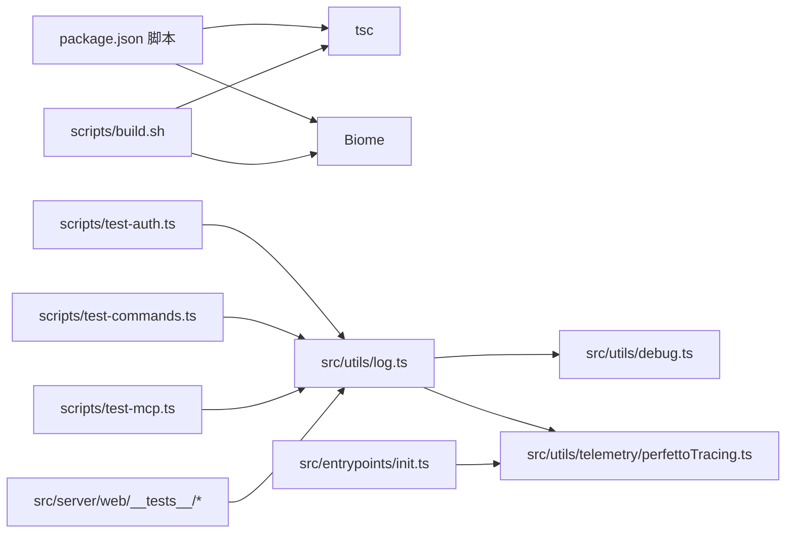

**图表来源**
- [package.json:12-24](file://package.json#L12-L24)
- [scripts/build.sh:26-34](file://scripts/build.sh#L26-L34)
- [scripts/test-auth.ts:1-27](file://scripts/test-auth.ts#L1-L27)
- [scripts/test-commands.ts:1-65](file://scripts/test-commands.ts#L1-L65)
- [scripts/test-mcp.ts:1-181](file://scripts/test-mcp.ts#L1-L181)
- [src/server/web/__tests__/auth.test.ts:1-77](file://src/server/web/__tests__/auth.test.ts#L1-L77)
- [src/server/web/__tests__/session-manager.test.ts:1-160](file://src/server/web/__tests__/session-manager.test.ts#L1-L160)
- [src/utils/log.ts:158-203](file://src/utils/log.ts#L158-L203)
- [src/utils/debug.ts:153-196](file://src/utils/debug.ts#L153-L196)
- [src/utils/telemetry/perfettoTracing.ts:696-763](file://src/utils/telemetry/perfettoTracing.ts#L696-L763)
- [src/entrypoints/init.ts:240-268](file://src/entrypoints/init.ts#L240-L268)

**章节来源**
- [package.json:12-24](file://package.json#L12-L24)
- [scripts/build.sh:26-34](file://scripts/build.sh#L26-L34)
- [scripts/test-auth.ts:1-27](file://scripts/test-auth.ts#L1-L27)
- [scripts/test-commands.ts:1-65](file://scripts/test-commands.ts#L1-L65)
- [scripts/test-mcp.ts:1-181](file://scripts/test-mcp.ts#L1-L181)
- [src/server/web/__tests__/auth.test.ts:1-77](file://src/server/web/__tests__/auth.test.ts#L1-L77)
- [src/server/web/__tests__/session-manager.test.ts:1-160](file://src/server/web/__tests__/session-manager.test.ts#L1-L160)
- [src/utils/log.ts:158-203](file://src/utils/log.ts#L158-L203)
- [src/utils/debug.ts:153-196](file://src/utils/debug.ts#L153-L196)
- [src/utils/telemetry/perfettoTracing.ts:696-763](file://src/utils/telemetry/perfettoTracing.ts#L696-L763)
- [src/entrypoints/init.ts:240-268](file://src/entrypoints/init.ts#L240-L268)

## 性能考虑
- 追踪粒度
  - 在工具执行前后打点，记录耗时、结果令牌数与错误信息，便于定位热点
- 初始化策略
  - 在头等舱或 Beta 场景下提前初始化遥测，减少首次查询延迟
- 日志与 IO
  - 调试模式下使用同步写入，避免进程退出导致日志丢失；生产环境使用缓冲写入降低开销
- 并发与限流
  - Web 会话与连接限流需结合实际负载压测，合理设置上限与窗口

[本节为通用指导，无需特定文件引用]

## 故障排查指南
- 权限问题
  - 确认运行环境具备访问 MCP 服务、文件系统与网络所需的最小权限
  - 若涉及浏览器自动化，确认扩展或驱动安装与权限授予
- 工具执行异常
  - 使用 scripts/test-auth.ts 验证 API 凭据与连通性
  - 使用 scripts/test-mcp.ts 验证 MCP 服务端可用性
  - 结合 src/utils/log.ts 与 src/utils/debug.ts 的日志定位错误上下文
- 会话管理错误
  - 通过 src/server/web/__tests__/session-manager.test.ts 的用例对照，检查 PTY 启动、WS 事件、resize 与 ping/pong处理
  - 关注 src/utils/telemetry/perfettoTracing.ts 的工具执行耗时与错误字段
- 环境与平台差异
  - 使用 src/utils/env.ts 的平台/IDE 识别辅助判断兼容性问题
  - 在 Windows 或 WSL 环境下注意 npm 可执行路径与路径分隔符差异

**章节来源**
- [scripts/test-auth.ts:1-27](file://scripts/test-auth.ts#L1-L27)
- [scripts/test-mcp.ts:1-181](file://scripts/test-mcp.ts#L1-L181)
- [src/server/web/__tests__/session-manager.test.ts:1-160](file://src/server/web/__tests__/session-manager.test.ts#L1-L160)
- [src/utils/log.ts:158-203](file://src/utils/log.ts#L158-L203)
- [src/utils/debug.ts:153-196](file://src/utils/debug.ts#L153-L196)
- [src/utils/telemetry/perfettoTracing.ts:696-763](file://src/utils/telemetry/perfettoTracing.ts#L696-L763)
- [src/utils/env.ts:96-132](file://src/utils/env.ts#L96-L132)

## 结论
本指南提供了从质量门禁、测试脚本、单元/集成测试到调试与性能分析的完整方法论。建议在日常开发中：
- 坚持 npm run check 与 scripts/build.sh check 的前置校验
- 使用 scripts/test-auth.ts 与 scripts/test-commands.ts 进行快速回归
- 通过 scripts/test-mcp.ts 与 src/server/web/__tests__ 覆盖关键路径
- 在调试与性能优化中充分利用日志、调试写入器与 Perfetto 追踪

[本节为总结，无需特定文件引用]

## 附录
- 测试覆盖率建议
  - 关键模块（命令系统、Web 会话、MCP 客户端/服务端）应达到高覆盖率
  - 对错误分支与边界条件（如 PTY 启动失败、连接超限、token 错误）单独断言
- 测试数据准备
  - 使用 FsOperations 抽象替换真实文件系统，便于构造边界场景
  - 使用 mock 事件发射器模拟 WebSocket 与 PTY 事件序列
- 常用命令
  - npm run typecheck、npm run lint、npm run format、npm run check
  - scripts/build.sh install/check/all

**章节来源**
- [package.json:19-23](file://package.json#L19-L23)
- [scripts/build.sh:14-56](file://scripts/build.sh#L14-L56)
- [src/utils/fsOperations.ts:18-51](file://src/utils/fsOperations.ts#L18-L51)
- [src/server/web/__tests__/session-manager.test.ts:10-47](file://src/server/web/__tests__/session-manager.test.ts#L10-L47)