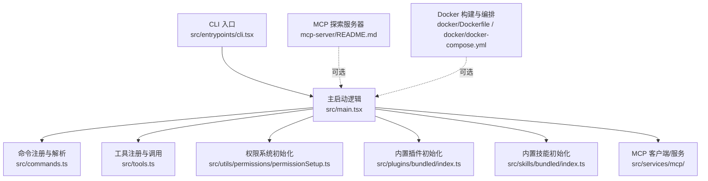
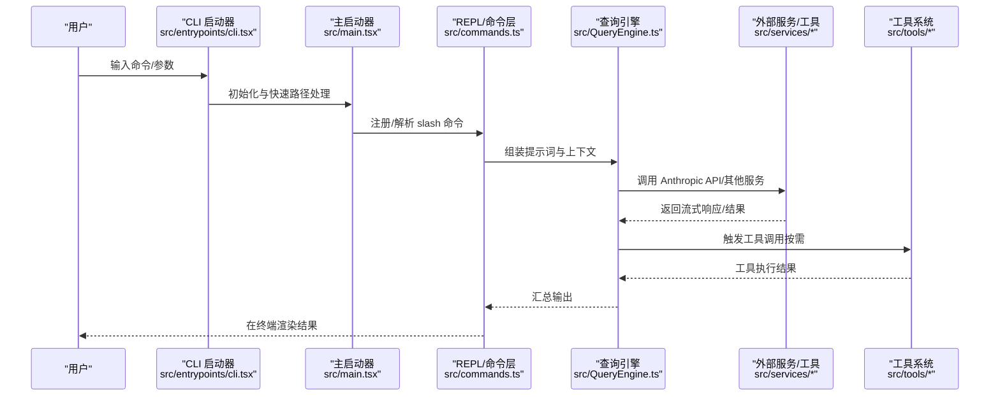

# 快速开始

<cite>
**本文引用的文件**
- [README.md](file://README.md)
- [package.json](file://package.json)
- [scripts/build.sh](file://scripts/build.sh)
- [docker/Dockerfile](file://docker/Dockerfile)
- [docker/docker-compose.yml](file://docker/docker-compose.yml)
- [src/entrypoints/cli.tsx](file://src/entrypoints/cli.tsx)
- [src/main.tsx](file://src/main.tsx)
- [docs/commands.md](file://docs/commands.md)
- [docs/tools.md](file://docs/tools.md)
- [docs/exploration-guide.md](file://docs/exploration-guide.md)
- [src/utils/permissions/permissionSetup.ts](file://src/utils/permissions/permissionSetup.ts)
- [src/plugins/bundled/index.ts](file://src/plugins/bundled/index.ts)
- [src/skills/bundled/index.ts](file://src/skills/bundled/index.ts)
- [mcp-server/README.md](file://mcp-server/README.md)
</cite>

## 目录
1. [简介](#简介)
2. [项目结构](#项目结构)
3. [核心组件](#核心组件)
4. [架构总览](#架构总览)
5. [详细组件分析](#详细组件分析)
6. [依赖分析](#依赖分析)
7. [性能考虑](#性能考虑)
8. [故障排除指南](#故障排除指南)
9. [结论](#结论)
10. [附录](#附录)

## 简介
本指南面向首次接触 Claude Code 的用户，帮助你在约 15 分钟内完成安装与首次体验。你将学会：
- 使用多种方式安装与部署：npm 发布包、从源码构建、Docker 容器化部署
- 配置系统要求与前置依赖
- 启动 CLI、执行第一个命令、进行简单文件操作
- 理解基础概念：slash 命令、工具系统、权限模型
- 解决常见问题与排障建议

Claude Code 是由 Anthropic 官方发布的终端 CLI 工具，支持在终端中直接编辑文件、运行命令、搜索代码库、管理 Git 流程等。该仓库为泄露的源码版本，保留了完整的目录结构与文档。

## 项目结构
- 核心入口与启动流程位于 src/entrypoints/cli.tsx 与 src/main.tsx
- 命令系统（以 / 开头的 slash 命令）集中在 src/commands/，参考文档见 docs/commands.md
- 工具系统（可被 LLM 调用的原子能力）集中在 src/tools/，参考文档见 docs/tools.md
- MCP 探索服务器位于 mcp-server/，可用于在任意 MCP 客户端中探索源码
- Docker 部署位于 docker/，包含多阶段构建与 compose 编排

图表来源
- [src/entrypoints/cli.tsx](file://src/entrypoints/cli.tsx)
- [src/main.tsx](file://src/main.tsx)
- [docs/commands.md](file://docs/commands.md)
- [docs/tools.md](file://docs/tools.md)
- [src/utils/permissions/permissionSetup.ts](file://src/utils/permissions/permissionSetup.ts)
- [src/plugins/bundled/index.ts](file://src/plugins/bundled/index.ts)
- [src/skills/bundled/index.ts](file://src/skills/bundled/index.ts)
- [mcp-server/README.md](file://mcp-server/README.md)
- [docker/Dockerfile](file://docker/Dockerfile)
- [docker/docker-compose.yml](file://docker/docker-compose.yml)

章节来源
- [README.md](file://README.md)
- [docs/exploration-guide.md](file://docs/exploration-guide.md)

## 核心组件
- CLI 启动器：负责解析参数、快速路径优化、桥接远程模式、守护进程、会话管理等
- 主启动器：加载上下文、策略限制、遥测、插件与技能、权限上下文等
- 命令系统：以 / 开头的交互式命令，覆盖 Git、代码质量、会话、配置、MCP/插件、认证、任务/代理、诊断等
- 工具系统：LLM 可调用的原子能力，如文件读写、搜索、Shell 执行、MCP、LSP、任务管理等
- 权限系统：对工具调用进行审批或自动决策，支持多种模式（默认、计划、绕过、自动）
- 插件与技能：扩展功能与可复用工作流
- MCP 探索：可在 MCP 客户端中探索源码的服务器

章节来源
- [src/entrypoints/cli.tsx](file://src/entrypoints/cli.tsx)
- [src/main.tsx](file://src/main.tsx)
- [docs/commands.md](file://docs/commands.md)
- [docs/tools.md](file://docs/tools.md)
- [src/utils/permissions/permissionSetup.ts](file://src/utils/permissions/permissionSetup.ts)
- [src/plugins/bundled/index.ts](file://src/plugins/bundled/index.ts)
- [src/skills/bundled/index.ts](file://src/skills/bundled/index.ts)
- [mcp-server/README.md](file://mcp-server/README.md)

## 架构总览
下图展示了从用户输入到 API 调用再到工具执行的端到端流程：

图表来源
- [src/entrypoints/cli.tsx](file://src/entrypoints/cli.tsx)
- [src/main.tsx](file://src/main.tsx)
- [docs/exploration-guide.md](file://docs/exploration-guide.md)

## 详细组件分析

### 安装与部署方式
- 从 npm 安装（推荐）
  - 使用包名与二进制入口，参见 package.json 中的 bin 字段
  - 参考：[README.md](file://README.md) 中“Explore with MCP Server”部分的 npm 安装说明
- 从源码构建
  - 使用脚本一键安装依赖、类型检查与代码规范检查
  - 参考：[scripts/build.sh](file://scripts/build.sh)
- Docker 部署
  - 多阶段构建，包含 node-pty 原生模块编译与运行时瘦身
  - 支持 compose 编排与健康检查
  - 参考：[docker/Dockerfile](file://docker/Dockerfile)、[docker/docker-compose.yml](file://docker/docker-compose.yml)

章节来源
- [README.md](file://README.md)
- [package.json](file://package.json)
- [scripts/build.sh](file://scripts/build.sh)
- [docker/Dockerfile](file://docker/Dockerfile)
- [docker/docker-compose.yml](file://docker/docker-compose.yml)

### 系统要求与前置依赖
- 运行时：Bun（版本要求见 package.json engines）
- 语言：TypeScript（严格模式）
- 终端 UI：React + Ink
- 其他依赖：详见 package.json 的 dependencies 与 devDependencies
- Docker 环境：若使用容器部署，需具备 Docker 与 docker-compose

章节来源
- [package.json](file://package.json)
- [README.md](file://README.md)

### 基本使用示例
- 启动 CLI
  - 直接运行二进制入口（来自 package.json 的 bin），或通过 Bun 运行入口文件
  - 参考：[src/entrypoints/cli.tsx](file://src/entrypoints/cli.tsx)
- 执行第一个命令
  - 在 REPL 中输入以 / 开头的命令，例如 /help 查看可用命令
  - 参考：[docs/commands.md](file://docs/commands.md)
- 简单文件操作
  - 使用文件相关工具（如 FileReadTool、FileWriteTool、FileEditTool）进行读取、创建/覆盖、部分修改
  - 参考：[docs/tools.md](file://docs/tools.md)

章节来源
- [src/entrypoints/cli.tsx](file://src/entrypoints/cli.tsx)
- [docs/commands.md](file://docs/commands.md)
- [docs/tools.md](file://docs/tools.md)

### slash 命令
- 命令类型与定义模式：命令分为 PromptCommand、LocalCommand、LocalJSXCommand 等
- 常用命令类别：Git/版本控制、代码质量、会话/上下文、配置/设置、内存/知识、MCP/插件、认证、任务/代理、诊断/状态、安装/设置、IDE/桌面集成、远程/环境、杂项等
- 命令实现位置：src/commands/ 下的各子目录或文件；注册在 src/commands.ts

章节来源
- [docs/commands.md](file://docs/commands.md)

### 工具系统
- 工具定义模式：每个工具自包含输入模式、权限模型、执行逻辑、UI 组件、并发安全等
- 工具分类：文件系统、Shell/执行、代理/编排、任务管理、Web、MCP、集成、调度/触发、实用工具等
- 工具实现位置：src/tools/<ToolName>/ 下的实现文件、UI 与提示贡献

章节来源
- [docs/tools.md](file://docs/tools.md)

### 权限模型
- 权限模式：default（默认逐项确认）、plan（一次性计划确认）、bypassPermissions（绕过权限，危险）、auto（基于分类器的自动决策）
- 规则与通配符：支持 Bash(git *)、FileEdit(/src/*)、FileRead(*) 等规则
- 危险规则检测：对可能绕过分类器的规则（如 Bash(*)、PowerShell(*)、Agent(*) 等）进行识别与清理
- 自动模式切换：进入/退出 auto 模式时，会剥离/恢复危险规则，并更新上下文

章节来源
- [src/utils/permissions/permissionSetup.ts](file://src/utils/permissions/permissionSetup.ts)
- [docs/tools.md](file://docs/tools.md)

### 插件与技能
- 插件系统：内置插件初始化入口，用于可显式启用/禁用的功能
- 技能系统：内置技能初始化入口，注册一系列可复用工作流与辅助能力

章节来源
- [src/plugins/bundled/index.ts](file://src/plugins/bundled/index.ts)
- [src/skills/bundled/index.ts](file://src/skills/bundled/index.ts)

### MCP 探索服务器
- 作用：在任意 MCP 客户端中探索 Claude Code 源码，提供工具、资源与提示模板
- 支持传输：STDIO、Streamable HTTP、SSE
- 常用工具：列出工具/命令、读取特定实现、搜索源码、列出目录、架构概览等
- 部署：支持本地运行、HTTP 模式、Docker 部署、平台发布

章节来源
- [mcp-server/README.md](file://mcp-server/README.md)

## 依赖分析
- 运行时与语言：Bun、TypeScript
- 终端 UI：React + Ink
- CLI 解析：Commander.js
- 模式协议：MCP SDK、LSP
- API：Anthropic SDK
- 遥测：OpenTelemetry + gRPC
- 特性开关：GrowthBook
- 认证：OAuth 2.0、JWT、macOS Keychain
- 代码搜索：ripgrep（经 GrepTool）

章节来源
- [README.md](file://README.md)
- [package.json](file://package.json)

## 性能考虑
- 并行预取：启动阶段并行读取 MDM 设置、钥匙串数据，减少冷启动时间
- 延迟加载：重模块（如 OpenTelemetry、gRPC）仅在需要时动态导入
- 启动优化：快速路径处理（如 --version、--dump-system-prompt 等）避免全量模块加载
- 背压与延迟预取：非关键任务在首屏渲染后延迟执行，避免阻塞事件循环

章节来源
- [src/entrypoints/cli.tsx](file://src/entrypoints/cli.tsx)
- [src/main.tsx](file://src/main.tsx)
- [README.md](file://README.md)

## 故障排除指南
- 无法找到可执行文件
  - 确认已正确安装依赖并构建产物可用（参考 scripts/build.sh）
  - 若使用 Docker，请确认镜像构建与卷挂载正确
- 权限相关错误
  - 检查权限模式与规则是否允许目标工具；必要时调整规则或切换模式
  - 对于危险规则（如 Bash(*)），在自动模式下会被剥离
- MCP 连接失败
  - 确认 MCP 服务器地址、凭据与传输方式（STDIO/HTTP/SSE）
  - 如使用 HTTP，检查端口与 API Key 配置
- Docker 健康检查失败
  - 检查容器日志与端口映射，确认健康检查端点可达

章节来源
- [scripts/build.sh](file://scripts/build.sh)
- [docker/Dockerfile](file://docker/Dockerfile)
- [docker/docker-compose.yml](file://docker/docker-compose.yml)
- [src/utils/permissions/permissionSetup.ts](file://src/utils/permissions/permissionSetup.ts)
- [mcp-server/README.md](file://mcp-server/README.md)

## 结论
通过本快速开始指南，你已经完成了 Claude Code 的安装与部署，并掌握了 CLI 启动、slash 命令与工具系统的基本使用方法。结合权限模型与 MCP 探索服务器，你可以进一步深入理解系统架构与扩展能力。建议在实际项目中优先使用默认权限模式，谨慎开启自动/绕过模式，并通过插件与技能提升开发效率。

## 附录

### 常用命令速查
- 查看帮助：/help
- 查看版本：/version
- 切换模型：/model
- 查看/修改设置：/config
- 查看会话统计：/stats
- 查看/导出会话：/export
- 诊断环境：/doctor
- 登录/登出：/login、/logout
- 管理 MCP 服务器：/mcp
- 管理插件：/plugin
- 管理技能：/skills
- Git 相关：/commit、/branch、/diff、/rewind
- 代码质量：/review、/security-review
- 任务/代理：/tasks、/agents、/plan、/ultraplan

章节来源
- [docs/commands.md](file://docs/commands.md)