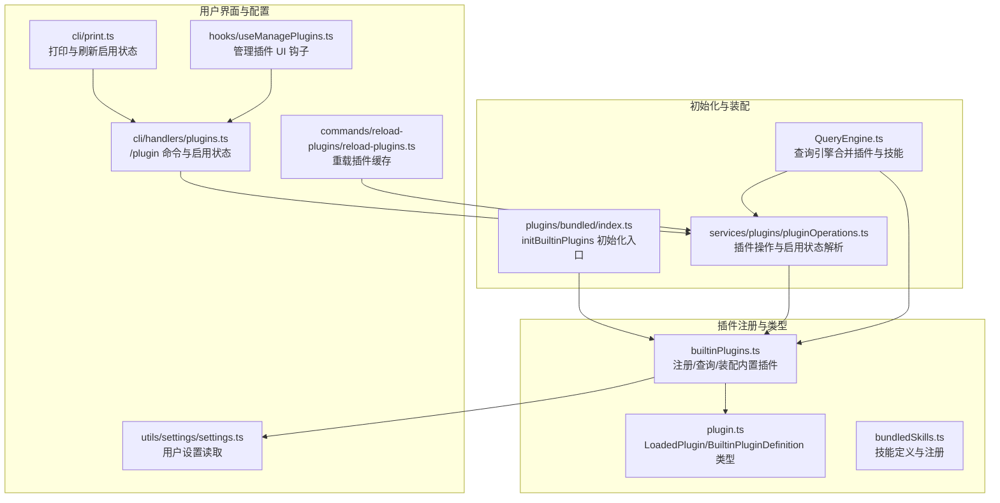
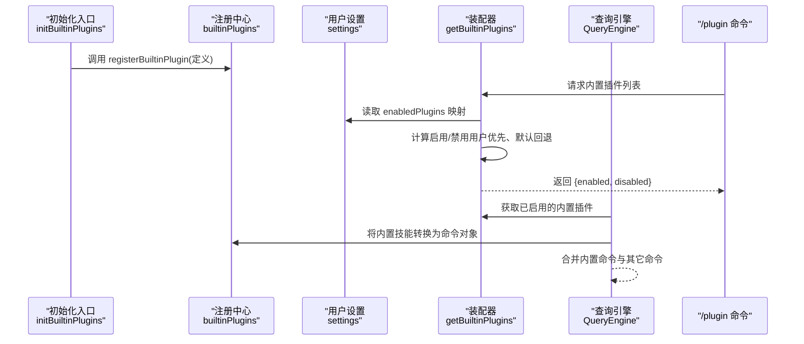
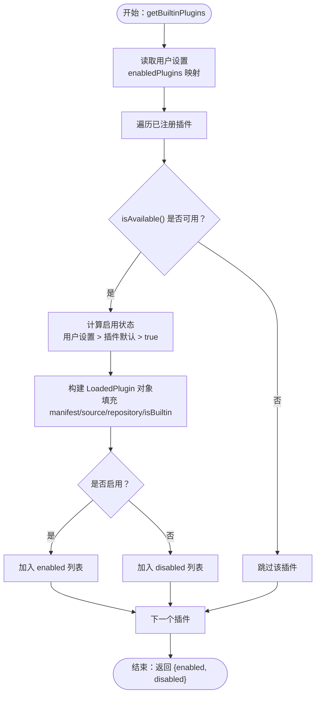
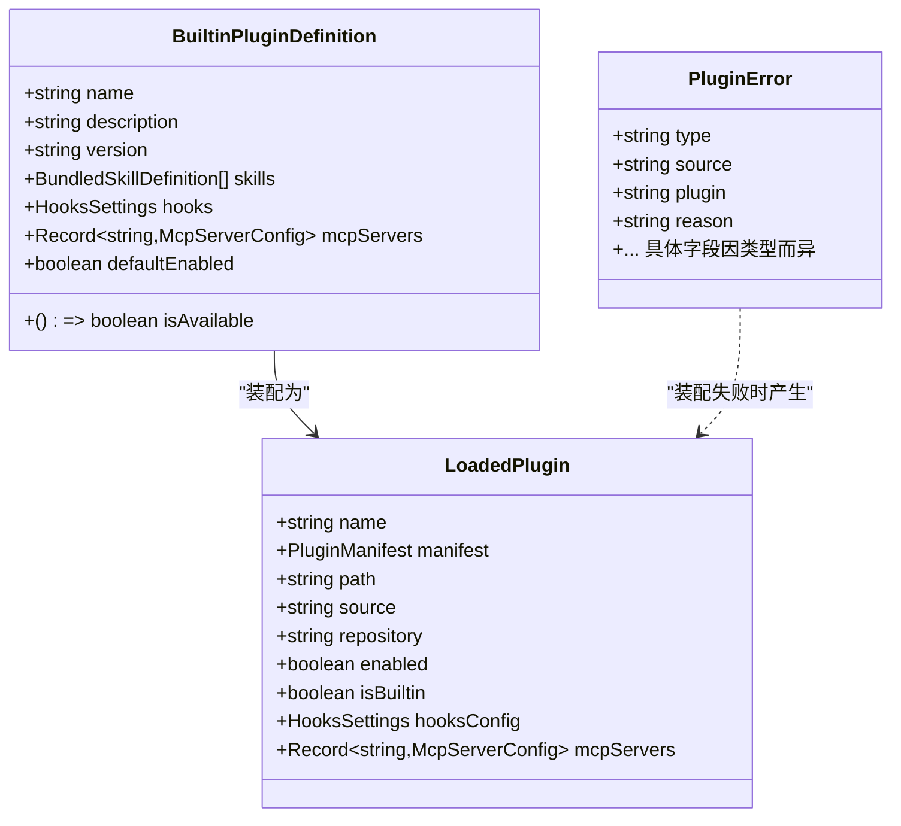
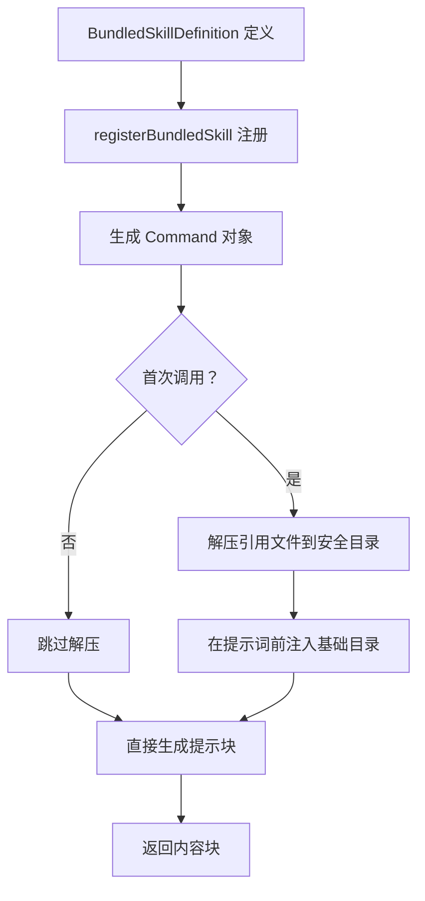
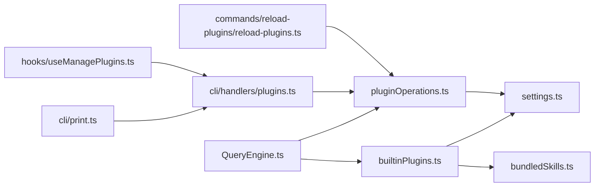

# 内置插件系统

<cite>
**本文引用的文件**
- [builtinPlugins.ts](file://src/plugins/builtinPlugins.ts)
- [plugin.ts](file://src/types/plugin.ts)
- [bundledSkills.ts](file://src/skills/bundledSkills.ts)
- [bundled/index.ts](file://src/plugins/bundled/index.ts)
- [pluginOperations.ts](file://src/services/plugins/pluginOperations.ts)
- [plugins.ts](file://src/cli/handlers/plugins.ts)
- [QueryEngine.ts](file://src/QueryEngine.ts)
- [print.ts](file://src/cli/print.ts)
- [reload-plugins.ts](file://src/commands/reload-plugins/reload-plugins.ts)
- [settings.ts](file://src/utils/settings/settings.ts)
- [hooks.ts](file://src/hooks/useManagePlugins.ts)
</cite>

## 目录
1. [简介](#简介)
2. [项目结构](#项目结构)
3. [核心组件](#核心组件)
4. [架构总览](#架构总览)
5. [详细组件分析](#详细组件分析)
6. [依赖关系分析](#依赖关系分析)
7. [性能考量](#性能考量)
8. [故障排查指南](#故障排查指南)
9. [结论](#结论)
10. [附录](#附录)

## 简介
本文件面向 Claude Code 的内置插件系统，聚焦以下主题：
- 注册机制：如何在启动时注册内置插件，以及插件定义的数据结构。
- 生命周期与状态控制：插件可用性检查、默认启用状态、用户配置持久化与读取。
- 与技能系统的集成：内置插件如何提供技能（命令），以及技能命令的转换与执行路径。
- 标识符格式、版本管理与更新：插件 ID 规范、版本字段、市场来源与更新策略。
- 开发与维护指南：新增内置插件的步骤、修改现有插件的方法。
- 性能与资源管理：内存与磁盘使用优化建议。
- 典型内置插件示例：调试工具、配置管理、系统集成等。

## 项目结构
内置插件系统由“注册中心”“类型定义”“初始化入口”“运行期装配”“CLI/UI 集成”等模块组成。下图展示了与内置插件相关的核心文件及其交互关系：

图表来源
- [builtinPlugins.ts:1-161](file://src/plugins/builtinPlugins.ts#L1-L161)
- [plugin.ts:1-365](file://src/types/plugin.ts#L1-L365)
- [bundledSkills.ts:1-222](file://src/skills/bundledSkills.ts#L1-L222)
- [bundled/index.ts:1-25](file://src/plugins/bundled/index.ts#L1-L25)
- [pluginOperations.ts:120-200](file://src/services/plugins/pluginOperations.ts#L120-L200)
- [plugins.ts:160-250](file://src/cli/handlers/plugins.ts#L160-L250)
- [print.ts:3060-3080](file://src/cli/print.ts#L3060-L3080)
- [reload-plugins.ts:1-20](file://src/commands/reload-plugins/reload-plugins.ts#L1-L20)
- [QueryEngine.ts:530-550](file://src/QueryEngine.ts#L530-L550)
- [settings.ts:1-50](file://src/utils/settings/settings.ts#L1-L50)
- [hooks.ts:1-50](file://src/hooks/useManagePlugins.ts#L1-L50)

章节来源
- [builtinPlugins.ts:1-161](file://src/plugins/builtinPlugins.ts#L1-L161)
- [plugin.ts:1-365](file://src/types/plugin.ts#L1-L365)
- [bundledSkills.ts:1-222](file://src/skills/bundledSkills.ts#L1-L222)
- [bundled/index.ts:1-25](file://src/plugins/bundled/index.ts#L1-L25)

## 核心组件
- 注册中心与装配器：负责注册内置插件、按用户设置与可用性装配为 LoadedPlugin，并将内置技能转换为命令对象供查询引擎使用。
- 类型系统：统一描述插件定义、加载后的插件对象、错误类型与消息。
- 初始化入口：在 CLI 启动时调用，注册所有内置插件。
- 运行期装配：从用户设置中读取启用状态，结合默认值与可用性过滤，生成启用/禁用列表。
- CLI/UI 集成：/plugin 命令展示内置插件，支持切换启用状态；重载命令刷新缓存；打印模块在必要时重新拉取设置以同步启用状态。

章节来源
- [builtinPlugins.ts:25-121](file://src/plugins/builtinPlugins.ts#L25-L121)
- [plugin.ts:18-70](file://src/types/plugin.ts#L18-L70)
- [bundled/index.ts:18-23](file://src/plugins/bundled/index.ts#L18-L23)
- [pluginOperations.ts:120-200](file://src/services/plugins/pluginOperations.ts#L120-L200)
- [plugins.ts:160-250](file://src/cli/handlers/plugins.ts#L160-L250)
- [print.ts:3060-3080](file://src/cli/print.ts#L3060-L3080)

## 架构总览
下图展示了内置插件从注册到装配、再到查询引擎使用的完整流程：

图表来源
- [bundled/index.ts:18-23](file://src/plugins/bundled/index.ts#L18-L23)
- [builtinPlugins.ts:25-121](file://src/plugins/builtinPlugins.ts#L25-L121)
- [pluginOperations.ts:120-200](file://src/services/plugins/pluginOperations.ts#L120-L200)
- [QueryEngine.ts:530-550](file://src/QueryEngine.ts#L530-L550)
- [plugins.ts:160-250](file://src/cli/handlers/plugins.ts#L160-L250)

## 详细组件分析

### 组件一：内置插件注册与装配（builtinPlugins.ts）
- 注册机制
  - 使用全局映射保存插件定义，键为插件名。
  - 提供注册函数用于在启动时登记插件定义。
- 可用性检查
  - 插件定义可包含 isAvailable 回调；若返回 false，则该插件不会出现在装配结果中。
- 默认启用状态与用户配置
  - 从用户设置中读取 enabledPlugins 映射；若未设置则回退到插件定义的 defaultEnabled（默认 true）。
- 装配为 LoadedPlugin
  - 生成插件 ID（name@builtin），填充 manifest、source、repository、isBuiltin 等字段。
  - 按启用状态分组返回 enabled/disabled 列表。
- 技能命令转换
  - 将内置插件中的技能定义转换为 Command 对象，用于查询引擎合并与执行。

图表来源
- [builtinPlugins.ts:52-102](file://src/plugins/builtinPlugins.ts#L52-L102)

章节来源
- [builtinPlugins.ts:25-121](file://src/plugins/builtinPlugins.ts#L25-L121)

### 组件二：类型系统（plugin.ts）
- BuiltinPluginDefinition：内置插件定义，包含 name、description、version、skills、hooks、mcpServers、isAvailable、defaultEnabled 等字段。
- LoadedPlugin：运行期装配后的插件对象，包含 manifest、source、repository、enabled、isBuiltin、hooksConfig、mcpServers 等。
- PluginError：统一的错误类型与消息生成函数，覆盖路径、网络、清单、市场、MCP/LSP 配置、依赖等场景。

图表来源
- [plugin.ts:18-70](file://src/types/plugin.ts#L18-L70)
- [plugin.ts:48-70](file://src/types/plugin.ts#L48-L70)
- [plugin.ts:101-284](file://src/types/plugin.ts#L101-L284)

章节来源
- [plugin.ts:1-365](file://src/types/plugin.ts#L1-L365)

### 组件三：内置技能定义与转换（bundledSkills.ts）
- BundledSkillDefinition：内置技能定义，包含名称、描述、别名、提示词生成函数、工具限制、模型选择、是否允许用户调用、钩子、上下文模式、代理、启用条件、引用文件等。
- 注册与提取：首次调用时惰性解压引用文件到安全目录，确保路径不越界；随后在提示词前注入“基础目录”以便模型读写。
- 转换为命令：内置插件装配时将技能转换为 Command 对象，保留用户可调用性、工具限制、钩子、上下文与代理等元数据。

图表来源
- [bundledSkills.ts:15-41](file://src/skills/bundledSkills.ts#L15-L41)
- [bundledSkills.ts:53-100](file://src/skills/bundledSkills.ts#L53-L100)
- [bundledSkills.ts:131-145](file://src/skills/bundledSkills.ts#L131-L145)
- [bundledSkills.ts:208-220](file://src/skills/bundledSkills.ts#L208-L220)

章节来源
- [bundledSkills.ts:1-222](file://src/skills/bundledSkills.ts#L1-L222)

### 组件四：初始化入口与迁移准备（bundled/index.ts）
- 初始化入口：在 CLI 启动时调用，用于注册内置插件。
- 当前状态：尚未注册任何内置插件，作为未来迁移“可切换内置技能”的基础设施。

章节来源
- [bundled/index.ts:1-25](file://src/plugins/bundled/index.ts#L1-L25)

### 组件五：运行期装配与启用状态解析（pluginOperations.ts）
- 启用状态解析：从不同来源（用户/项目设置）读取 enabledPlugins 映射，支持多源合并与覆盖。
- 插件操作：在启用/禁用、重载、缓存清理等场景中使用该映射进行决策。

章节来源
- [pluginOperations.ts:120-200](file://src/services/plugins/pluginOperations.ts#L120-L200)
- [pluginOperations.ts:450-512](file://src/services/plugins/pluginOperations.ts#L450-L512)
- [pluginOperations.ts:583-661](file://src/services/plugins/pluginOperations.ts#L583-L661)
- [pluginOperations.ts:722-791](file://src/services/plugins/pluginOperations.ts#L722-L791)

### 组件六：CLI/UI 集成（plugins.ts、print.ts、reload-plugins.ts）
- /plugin 命令：列出内置插件，显示启用状态，支持切换。
- 打印刷新：在某些情况下重新拉取设置，确保启用状态与 UI 一致。
- 重载插件：清理缓存后重新装配，使用户变更立即生效。

章节来源
- [plugins.ts:160-250](file://src/cli/handlers/plugins.ts#L160-L250)
- [plugins.ts:370-380](file://src/cli/handlers/plugins.ts#L370-L380)
- [print.ts:3060-3080](file://src/cli/print.ts#L3060-L3080)
- [reload-plugins.ts:1-20](file://src/commands/reload-plugins/reload-plugins.ts#L1-L20)

## 依赖关系分析
- builtinPlugins.ts 依赖：
  - 用户设置读取（settings.ts）用于 enabledPlugins 映射。
  - 技能定义（bundledSkills.ts）用于将内置技能转换为命令。
- pluginOperations.ts 依赖：
  - 用户设置读取（settings.ts）用于解析启用状态。
  - 查询引擎（QueryEngine.ts）用于合并内置插件与其它组件。
- CLI/UI（plugins.ts、print.ts、reload-plugins.ts）依赖：
  - pluginOperations.ts 提供启用状态与操作接口。
  - hooks/useManagePlugins.ts 提供前端管理插件的钩子。

图表来源
- [builtinPlugins.ts:19-20](file://src/plugins/builtinPlugins.ts#L19-L20)
- [bundledSkills.ts:1-10](file://src/skills/bundledSkills.ts#L1-L10)
- [pluginOperations.ts:120-200](file://src/services/plugins/pluginOperations.ts#L120-L200)
- [QueryEngine.ts:530-550](file://src/QueryEngine.ts#L530-L550)
- [plugins.ts:160-250](file://src/cli/handlers/plugins.ts#L160-L250)
- [print.ts:3060-3080](file://src/cli/print.ts#L3060-L3080)
- [reload-plugins.ts:1-20](file://src/commands/reload-plugins/reload-plugins.ts#L1-L20)
- [hooks.ts:1-50](file://src/hooks/useManagePlugins.ts#L1-L50)

章节来源
- [builtinPlugins.ts:19-20](file://src/plugins/builtinPlugins.ts#L19-L20)
- [pluginOperations.ts:120-200](file://src/services/plugins/pluginOperations.ts#L120-L200)
- [QueryEngine.ts:530-550](file://src/QueryEngine.ts#L530-L550)
- [plugins.ts:160-250](file://src/cli/handlers/plugins.ts#L160-L250)
- [print.ts:3060-3080](file://src/cli/print.ts#L3060-L3080)
- [reload-plugins.ts:1-20](file://src/commands/reload-plugins/reload-plugins.ts#L1-L20)
- [hooks.ts:1-50](file://src/hooks/useManagePlugins.ts#L1-L50)

## 性能考量
- 启动时注册：内置插件注册集中在 initBuiltinPlugins，避免在运行期频繁注册。
- 惰性解压：内置技能的引用文件仅在首次调用时解压，减少冷启动开销与磁盘占用。
- 安全写入：使用安全标志写入文件，避免竞态与符号链接风险，降低 IO 异常概率。
- 设置读取与缓存：通过 settings.ts 读取用户设置，配合重载命令清理缓存，避免陈旧状态影响性能。
- 合并与查询：QueryEngine 合并内置插件命令与其它命令，建议在 UI 层做去重与懒加载，减少渲染压力。

[本节为通用性能建议，无需特定文件来源]

## 故障排查指南
- 启用状态异常
  - 现象：/plugin 中显示的启用状态与实际不符。
  - 排查：确认用户设置中的 enabledPlugins 映射；必要时执行重载插件命令刷新缓存。
- 插件不可见
  - 现象：内置插件未出现在 /plugin 列表。
  - 排查：检查插件定义的 isAvailable 回调是否返回 true；确认已在 initBuiltinPlugins 中注册。
- 技能命令缺失
  - 现象：内置插件提供的技能未出现在命令列表。
  - 排查：确认 getBuiltinPluginSkillCommands 已被查询引擎使用；检查技能定义的 userInvocable 字段。
- 错误信息定位
  - 使用统一的错误类型与消息生成函数，快速定位路径、网络、清单、市场、MCP/LSP 配置等问题。

章节来源
- [plugin.ts:295-363](file://src/types/plugin.ts#L295-L363)
- [pluginOperations.ts:450-512](file://src/services/plugins/pluginOperations.ts#L450-L512)
- [reload-plugins.ts:1-20](file://src/commands/reload-plugins/reload-plugins.ts#L1-L20)

## 结论
内置插件系统通过清晰的注册与装配流程、强类型的定义与错误处理、以及与 CLI/UI 的紧密集成，实现了用户可切换、可管理、可扩展的内置能力。未来随着更多内置插件的注册与迁移，系统将继续演进，保持良好的可维护性与用户体验。

[本节为总结性内容，无需特定文件来源]

## 附录

### 开发与维护指南
- 新增内置插件
  - 在初始化入口中调用注册函数登记插件定义。
  - 在插件定义中提供 description、version、defaultEnabled、isAvailable 等字段。
  - 若插件包含技能，提供技能定义并确保 userInvocable 正确设置。
- 修改现有插件
  - 更新插件定义中的字段（如 description、version、defaultEnabled）。
  - 如需隐藏插件，提供 isAvailable 并返回 false。
  - 如需调整技能行为，修改技能定义或其提示词生成函数。
- 验证与测试
  - 使用 /plugin 命令查看插件状态。
  - 执行重载插件命令验证变更生效。
  - 在查询引擎层确认命令合并与执行路径正确。

章节来源
- [bundled/index.ts:12-23](file://src/plugins/bundled/index.ts#L12-L23)
- [builtinPlugins.ts:25-39](file://src/plugins/builtinPlugins.ts#L25-L39)
- [bundledSkills.ts:15-41](file://src/skills/bundledSkills.ts#L15-L41)

### 标识符格式、版本管理与更新
- 标识符格式
  - 内置插件 ID 使用 name@builtin，以区别于市场插件（name@marketplace）。
- 版本管理
  - 插件定义可包含 version 字段；装配时填充到 manifest。
- 更新机制
  - 内置插件随 CLI 升级更新；用户可通过重载插件命令刷新缓存。

章节来源
- [builtinPlugins.ts:12-13](file://src/plugins/builtinPlugins.ts#L12-L13)
- [plugin.ts:23-35](file://src/types/plugin.ts#L23-L35)
- [builtinPlugins.ts:78-88](file://src/plugins/builtinPlugins.ts#L78-L88)
- [reload-plugins.ts:1-20](file://src/commands/reload-plugins/reload-plugins.ts#L1-L20)

### 典型内置插件实现示例
- 调试工具
  - 可通过内置插件提供调试命令与钩子，便于问题定位与日志输出。
- 配置管理
  - 可通过内置插件暴露 MCP 服务器或钩子，实现配置读取与变更。
- 系统集成
  - 可通过内置插件提供系统级能力（如文件读写、进程调用等），并受用户启用状态控制。

[本节为概念性示例说明，无需特定文件来源]