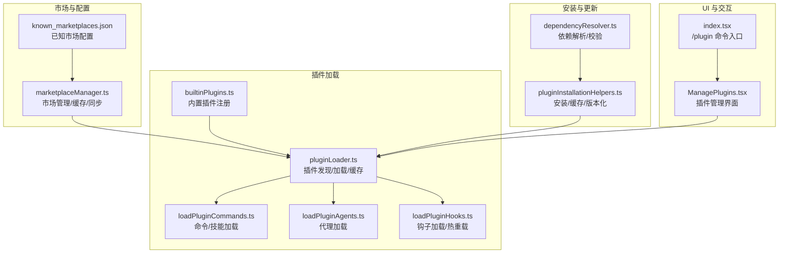
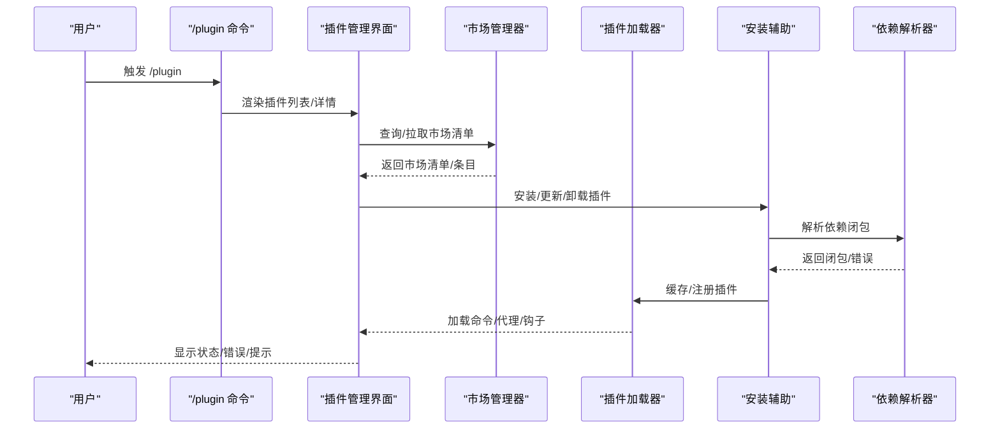
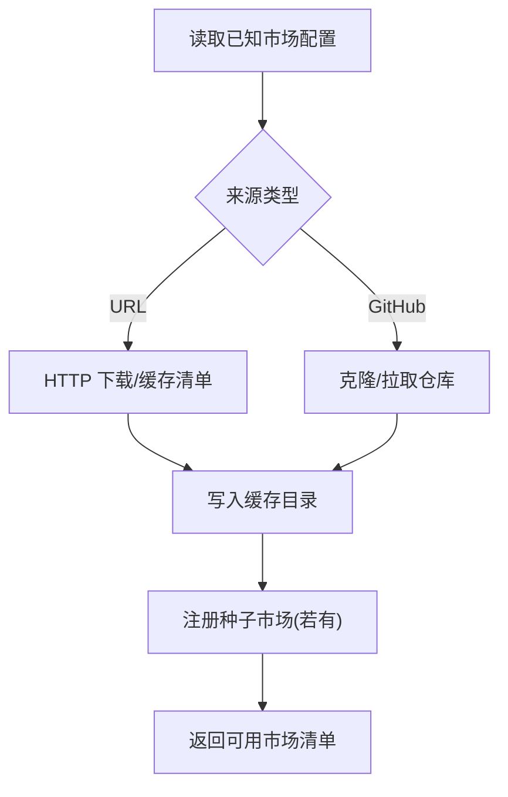
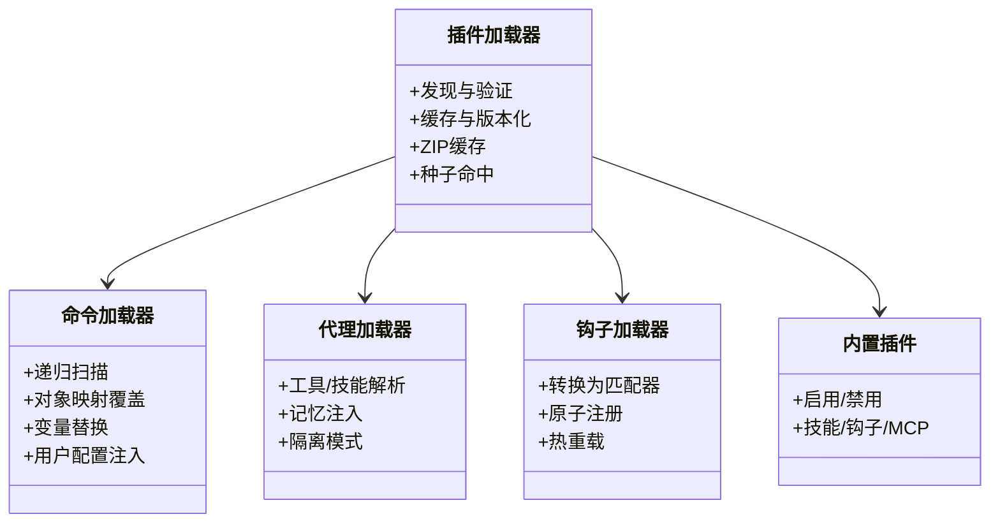
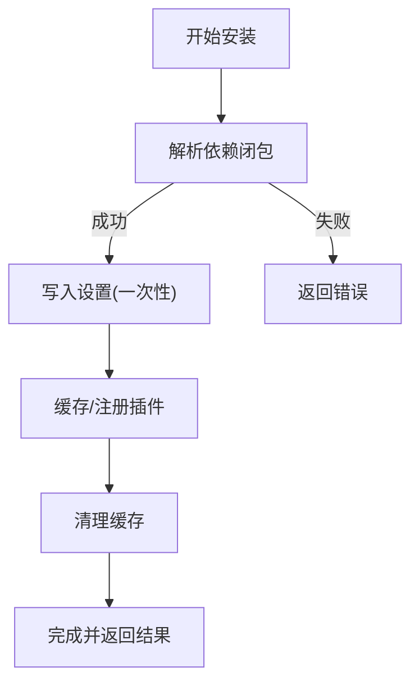
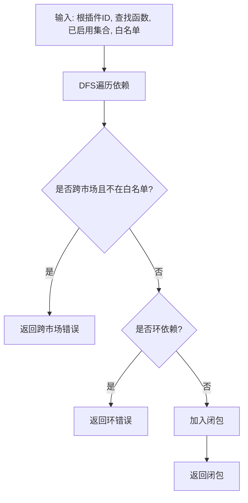
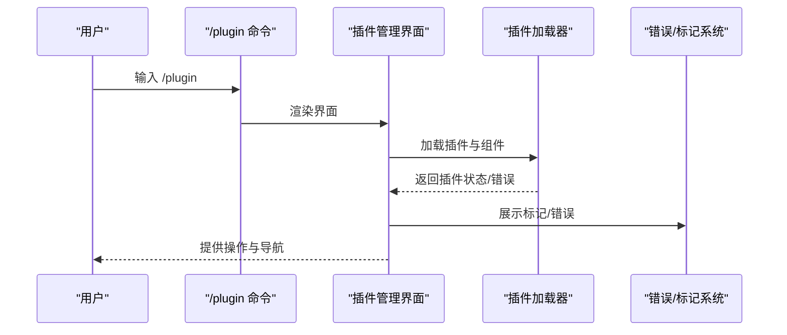
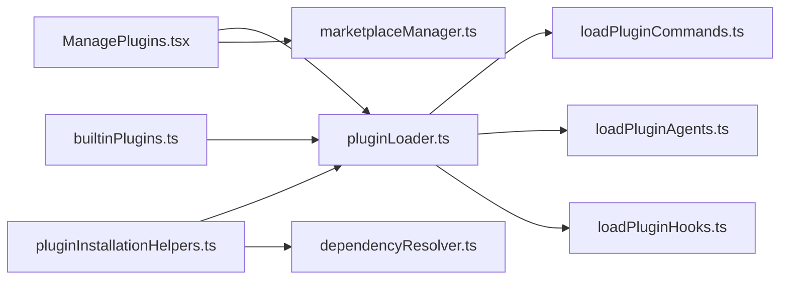

# 插件市场管理

<cite>
**本文引用的文件**
- [useManagePlugins.ts](file://src/hooks/useManagePlugins.ts)
- [plugin.ts](file://src/types/plugin.ts)
- [builtinPlugins.ts](file://src/plugins/builtinPlugins.ts)
- [pluginLoader.ts](file://src/utils/plugins/pluginLoader.ts)
- [loadPluginCommands.ts](file://src/utils/plugins/loadPluginCommands.ts)
- [loadPluginAgents.ts](file://src/utils/plugins/loadPluginAgents.ts)
- [loadPluginHooks.ts](file://src/utils/plugins/loadPluginHooks.ts)
- [index.tsx](file://src/commands/plugin/index.tsx)
- [ManagePlugins.tsx](file://src/commands/plugin/ManagePlugins.tsx)
- [marketplaceManager.ts](file://src/utils/plugins/marketplaceManager.ts)
- [pluginInstallationHelpers.ts](file://src/utils/plugins/pluginInstallationHelpers.ts)
- [dependencyResolver.ts](file://src/utils/plugins/dependencyResolver.ts)
</cite>

## 目录
1. [简介](#简介)
2. [项目结构](#项目结构)
3. [核心组件](#核心组件)
4. [架构总览](#架构总览)
5. [详细组件分析](#详细组件分析)
6. [依赖关系分析](#依赖关系分析)
7. [性能考量](#性能考量)
8. [故障排查指南](#故障排查指南)
9. [结论](#结论)
10. [附录](#附录)

## 简介
本运营文档面向 Claude Code 插件市场的管理与运维，系统化梳理官方市场与第三方市场的管理机制、插件发布与安装流程、版本与依赖管理、安全与合规、UI 交互与使用指南，并给出可操作的运营建议与排障路径。文档以仓库现有实现为依据，结合代码级可视化图示，帮助开发者与平台运营人员高效理解与维护插件生态。

## 项目结构
插件市场相关能力主要分布在以下模块：
- 市场管理：已知市场源配置、缓存、拉取与同步（含种子目录）
- 插件加载：统一加载器、命令/代理/钩子加载、内置插件注册
- 安装与更新：安装辅助、版本化缓存、依赖解析与校验
- UI 与交互：/plugin 命令入口、插件管理界面、错误与标记提示
- 类型与错误模型：插件定义、错误类型、显示消息映射

**图表来源**
- [marketplaceManager.ts:1-200](file://src/utils/plugins/marketplaceManager.ts#L1-L200)
- [pluginLoader.ts:1-200](file://src/utils/plugins/pluginLoader.ts#L1-L200)
- [loadPluginCommands.ts:1-200](file://src/utils/plugins/loadPluginCommands.ts#L1-L200)
- [loadPluginAgents.ts:1-120](file://src/utils/plugins/loadPluginAgents.ts#L1-L120)
- [loadPluginHooks.ts:1-120](file://src/utils/plugins/loadPluginHooks.ts#L1-L120)
- [builtinPlugins.ts:1-120](file://src/plugins/builtinPlugins.ts#L1-L120)
- [pluginInstallationHelpers.ts:1-120](file://src/utils/plugins/pluginInstallationHelpers.ts#L1-L120)
- [dependencyResolver.ts:1-120](file://src/utils/plugins/dependencyResolver.ts#L1-L120)
- [index.tsx:1-13](file://src/commands/plugin/index.tsx#L1-L13)
- [ManagePlugins.tsx:1-120](file://src/commands/plugin/ManagePlugins.tsx#L1-L120)

**章节来源**
- [marketplaceManager.ts:1-200](file://src/utils/plugins/marketplaceManager.ts#L1-L200)
- [pluginLoader.ts:1-200](file://src/utils/plugins/pluginLoader.ts#L1-L200)
- [loadPluginCommands.ts:1-200](file://src/utils/plugins/loadPluginCommands.ts#L1-L200)
- [loadPluginAgents.ts:1-120](file://src/utils/plugins/loadPluginAgents.ts#L1-L120)
- [loadPluginHooks.ts:1-120](file://src/utils/plugins/loadPluginHooks.ts#L1-L120)
- [builtinPlugins.ts:1-120](file://src/plugins/builtinPlugins.ts#L1-L120)
- [pluginInstallationHelpers.ts:1-120](file://src/utils/plugins/pluginInstallationHelpers.ts#L1-L120)
- [dependencyResolver.ts:1-120](file://src/utils/plugins/dependencyResolver.ts#L1-L120)
- [index.tsx:1-13](file://src/commands/plugin/index.tsx#L1-L13)
- [ManagePlugins.tsx:1-120](file://src/commands/plugin/ManagePlugins.tsx#L1-L120)

## 核心组件
- 市场管理器：负责已知市场的读写、缓存、拉取与同步；支持种子目录注入；提供市场清单与条目查询。
- 插件加载器：统一发现、验证与加载插件，支持内置插件、会话插件与市场插件；处理缓存、ZIP 缓存、版本化路径与种子命中。
- 组件加载器：分别加载命令/技能、代理与钩子，支持对象映射元数据覆盖、内联内容、变量替换与用户配置注入。
- 安装辅助：封装安装核心逻辑，执行依赖闭包解析、设置写入、缓存与注册、清理缓存；输出结构化结果与分析事件。
- 依赖解析器：安装时进行 DFS 闭包解析，阻断跨市场依赖；加载时进行固定点校验与降级，生成错误信息。
- 内置插件注册：内置插件在 /plugin UI 中可见，用户可启用/禁用，支持技能、钩子与 MCP 服务器。
- UI 与交互：/plugin 命令入口与插件管理界面，支持搜索、分页、错误与标记提示、MCP 详情与工具浏览。

**章节来源**
- [marketplaceManager.ts:264-350](file://src/utils/plugins/marketplaceManager.ts#L264-L350)
- [pluginLoader.ts:123-287](file://src/utils/plugins/pluginLoader.ts#L123-L287)
- [loadPluginCommands.ts:169-213](file://src/utils/plugins/loadPluginCommands.ts#L169-L213)
- [loadPluginAgents.ts:37-63](file://src/utils/plugins/loadPluginAgents.ts#L37-L63)
- [loadPluginHooks.ts:88-157](file://src/utils/plugins/loadPluginHooks.ts#L88-L157)
- [pluginInstallationHelpers.ts:128-226](file://src/utils/plugins/pluginInstallationHelpers.ts#L128-L226)
- [dependencyResolver.ts:95-159](file://src/utils/plugins/dependencyResolver.ts#L95-L159)
- [builtinPlugins.ts:25-102](file://src/plugins/builtinPlugins.ts#L25-L102)
- [index.tsx:1-13](file://src/commands/plugin/index.tsx#L1-L13)
- [ManagePlugins.tsx:397-450](file://src/commands/plugin/ManagePlugins.tsx#L397-L450)

## 架构总览
下图展示了从“用户触发”到“插件生效”的端到端流程，涵盖官方市场与第三方市场的差异、依赖解析与版本化缓存的关键节点。

**图表来源**
- [index.tsx:1-13](file://src/commands/plugin/index.tsx#L1-L13)
- [ManagePlugins.tsx:397-450](file://src/commands/plugin/ManagePlugins.tsx#L397-L450)
- [marketplaceManager.ts:264-350](file://src/utils/plugins/marketplaceManager.ts#L264-L350)
- [pluginInstallationHelpers.ts:348-481](file://src/utils/plugins/pluginInstallationHelpers.ts#L348-L481)
- [dependencyResolver.ts:95-159](file://src/utils/plugins/dependencyResolver.ts#L95-L159)
- [pluginLoader.ts:365-465](file://src/utils/plugins/pluginLoader.ts#L365-L465)

## 详细组件分析

### 市场管理与缓存
- 已知市场配置：通过 known_marketplaces.json 管理市场名称到来源与安装位置的映射，支持本地 JSON 与 GitHub 仓库两种来源。
- 缓存策略：市场清单缓存在本地目录，支持按名称或 URL 源缓存；种子目录注入后优先于用户配置，且自动更新关闭。
- 同步与更新：提供 git pull 封装，增强 SSH/认证/网络错误提示；子模块更新确保子目录源一致性。
- 种子目录：多阶段构建场景下，通过运行时定位种子市场位置，避免绝对路径漂移导致的失效。

**图表来源**
- [marketplaceManager.ts:264-350](file://src/utils/plugins/marketplaceManager.ts#L264-L350)
- [marketplaceManager.ts:380-434](file://src/utils/plugins/marketplaceManager.ts#L380-L434)
- [marketplaceManager.ts:528-582](file://src/utils/plugins/marketplaceManager.ts#L528-L582)

**章节来源**
- [marketplaceManager.ts:264-350](file://src/utils/plugins/marketplaceManager.ts#L264-L350)
- [marketplaceManager.ts:380-434](file://src/utils/plugins/marketplaceManager.ts#L380-L434)
- [marketplaceManager.ts:528-582](file://src/utils/plugins/marketplaceManager.ts#L528-L582)

### 插件加载与组件集成
- 统一加载器：支持内置插件、会话插件与市场插件；处理缓存命中、版本化路径、ZIP 缓存与种子目录探测；对 .git 目录进行清理。
- 组件加载：
  - 命令/技能：从 commands/skills 目录递归扫描，支持对象映射元数据覆盖、内联内容、变量替换与用户配置注入。
  - 代理：从 agents 目录加载，支持工具/技能/记忆/隔离等前端解析与自动内存工具注入。
  - 钩子：将插件钩子转换为匹配器并原子性注册，支持热重载与裁剪。
- 内置插件：在 /plugin UI 中可见，用户可启用/禁用，支持技能、钩子与 MCP 服务器。

**图表来源**
- [pluginLoader.ts:123-287](file://src/utils/plugins/pluginLoader.ts#L123-L287)
- [loadPluginCommands.ts:169-213](file://src/utils/plugins/loadPluginCommands.ts#L169-L213)
- [loadPluginAgents.ts:37-63](file://src/utils/plugins/loadPluginAgents.ts#L37-L63)
- [loadPluginHooks.ts:88-157](file://src/utils/plugins/loadPluginHooks.ts#L88-L157)
- [builtinPlugins.ts:52-102](file://src/plugins/builtinPlugins.ts#L52-L102)

**章节来源**
- [pluginLoader.ts:123-287](file://src/utils/plugins/pluginLoader.ts#L123-L287)
- [loadPluginCommands.ts:169-213](file://src/utils/plugins/loadPluginCommands.ts#L169-L213)
- [loadPluginAgents.ts:37-63](file://src/utils/plugins/loadPluginAgents.ts#L37-L63)
- [loadPluginHooks.ts:88-157](file://src/utils/plugins/loadPluginHooks.ts#L88-L157)
- [builtinPlugins.ts:52-102](file://src/plugins/builtinPlugins.ts#L52-L102)

### 安装、更新与卸载
- 安装核心：解析依赖闭包（阻断跨市场依赖），一次性写入设置，缓存每个成员并注册，最后清理缓存；返回结构化结果与分析事件。
- 版本化缓存：生成版本化路径，支持目录与 ZIP 缓存；对同名插件（市场名等于插件名）采用临时移动规避重命名冲突。
- 更新策略：通过市场清单与 git pull 实现；增强 SSH/认证/网络错误提示；子模块更新确保子目录源一致性。
- 卸载与清理：移除安装记录与数据目录，必要时清理选项与标记。

**图表来源**
- [pluginInstallationHelpers.ts:348-481](file://src/utils/plugins/pluginInstallationHelpers.ts#L348-L481)
- [pluginInstallationHelpers.ts:128-226](file://src/utils/plugins/pluginInstallationHelpers.ts#L128-L226)
- [dependencyResolver.ts:95-159](file://src/utils/plugins/dependencyResolver.ts#L95-L159)

**章节来源**
- [pluginInstallationHelpers.ts:348-481](file://src/utils/plugins/pluginInstallationHelpers.ts#L348-L481)
- [pluginInstallationHelpers.ts:128-226](file://src/utils/plugins/pluginInstallationHelpers.ts#L128-L226)
- [dependencyResolver.ts:95-159](file://src/utils/plugins/dependencyResolver.ts#L95-L159)

### 依赖解析与兼容性检查
- 安装期解析：DFS 遍历依赖闭包，跳过已启用依赖，阻断跨市场依赖（仅允许根市场白名单），检测环依赖；返回闭包或错误链路。
- 加载期校验：固定点迭代，若启用插件声明的依赖未满足则降级为禁用，并生成错误类型（未启用/未找到），用于诊断与提示。
- 反向依赖查找：用于卸载/禁用前提示“被哪些插件依赖”，避免破坏性操作。

**图表来源**
- [dependencyResolver.ts:95-159](file://src/utils/plugins/dependencyResolver.ts#L95-L159)
- [dependencyResolver.ts:177-234](file://src/utils/plugins/dependencyResolver.ts#L177-L234)

**章节来源**
- [dependencyResolver.ts:95-159](file://src/utils/plugins/dependencyResolver.ts#L95-L159)
- [dependencyResolver.ts:177-234](file://src/utils/plugins/dependencyResolver.ts#L177-L234)

### 安全与合规机制
- 政策拦截：安装与依赖均受组织策略拦截，阻止黑名单插件与被策略禁用的依赖。
- 路径校验：严格限制路径逃逸，防止恶意相对路径访问。
- 错误类型化：统一的插件错误类型（如网络/解析/配置无效/依赖不满足等），便于 UI 展示与诊断。
- 标记与清理：对下架/违规插件进行标记与自动卸载，支持用户查看与清理。

**章节来源**
- [pluginInstallationHelpers.ts:361-367](file://src/utils/plugins/pluginInstallationHelpers.ts#L361-L367)
- [pluginInstallationHelpers.ts:418-427](file://src/utils/plugins/pluginInstallationHelpers.ts#L418-L427)
- [plugin.ts:101-283](file://src/types/plugin.ts#L101-L283)

### 用户界面与交互流程
- 命令入口：/plugin 命令加载 JSX 组件，提供统一入口。
- 插件管理界面：支持搜索、分页、按作用域（用户/项目/本地/企业/托管/内置）分组展示；内置插件与市场插件组件列表动态加载；支持 MCP 详情与工具浏览。
- 错误与标记：对加载失败与标记插件进行提示与引导；支持一键刷新与重新加载。

**图表来源**
- [index.tsx:1-13](file://src/commands/plugin/index.tsx#L1-L13)
- [ManagePlugins.tsx:397-450](file://src/commands/plugin/ManagePlugins.tsx#L397-L450)
- [useManagePlugins.ts:51-180](file://src/hooks/useManagePlugins.ts#L51-L180)

**章节来源**
- [index.tsx:1-13](file://src/commands/plugin/index.tsx#L1-L13)
- [ManagePlugins.tsx:397-450](file://src/commands/plugin/ManagePlugins.tsx#L397-L450)
- [useManagePlugins.ts:51-180](file://src/hooks/useManagePlugins.ts#L51-L180)

## 依赖关系分析
- 组件耦合：插件加载器是核心枢纽，被命令/代理/钩子加载器依赖；安装辅助依赖加载器与依赖解析器；UI 依赖加载器与市场管理器。
- 外部依赖：Axios（HTTP）、git（拉取/子模块）、缓存与 ZIP 工具、分析事件上报。
- 循环依赖：当前实现通过模块职责划分避免循环依赖；依赖解析器纯函数化，不涉及 I/O。

**图表来源**
- [ManagePlugins.tsx:397-450](file://src/commands/plugin/ManagePlugins.tsx#L397-L450)
- [pluginLoader.ts:123-287](file://src/utils/plugins/pluginLoader.ts#L123-L287)
- [loadPluginCommands.ts:169-213](file://src/utils/plugins/loadPluginCommands.ts#L169-L213)
- [loadPluginAgents.ts:37-63](file://src/utils/plugins/loadPluginAgents.ts#L37-L63)
- [loadPluginHooks.ts:88-157](file://src/utils/plugins/loadPluginHooks.ts#L88-L157)
- [pluginInstallationHelpers.ts:348-481](file://src/utils/plugins/pluginInstallationHelpers.ts#L348-L481)
- [dependencyResolver.ts:95-159](file://src/utils/plugins/dependencyResolver.ts#L95-L159)
- [builtinPlugins.ts:52-102](file://src/plugins/builtinPlugins.ts#L52-L102)

**章节来源**
- [ManagePlugins.tsx:397-450](file://src/commands/plugin/ManagePlugins.tsx#L397-L450)
- [pluginLoader.ts:123-287](file://src/utils/plugins/pluginLoader.ts#L123-L287)
- [loadPluginCommands.ts:169-213](file://src/utils/plugins/loadPluginCommands.ts#L169-L213)
- [loadPluginAgents.ts:37-63](file://src/utils/plugins/loadPluginAgents.ts#L37-L63)
- [loadPluginHooks.ts:88-157](file://src/utils/plugins/loadPluginHooks.ts#L88-L157)
- [pluginInstallationHelpers.ts:348-481](file://src/utils/plugins/pluginInstallationHelpers.ts#L348-L481)
- [dependencyResolver.ts:95-159](file://src/utils/plugins/dependencyResolver.ts#L95-L159)
- [builtinPlugins.ts:52-102](file://src/plugins/builtinPlugins.ts#L52-L102)

## 性能考量
- 缓存与压缩：版本化缓存与 ZIP 缓存显著减少重复下载与解压开销；种子目录命中避免网络请求。
- 并行加载：命令/代理/钩子加载采用并行处理，提升启动速度；缓存命中后避免重复 I/O。
- 路径与网络优化：git 浅克隆与稀疏检出降低大仓库下载量；超时与错误增强减少无效重试。
- 内存与稳定性：依赖解析器与加载器均采用记忆化与原子注册，避免竞态与重复计算。

[本节为通用指导，无需特定文件引用]

## 故障排查指南
- 常见错误类型与处理
  - 网络/认证/主机密钥：增强错误消息，提供 SSH/HTTPS 切换与已知主机处理建议。
  - 依赖不满足：区分“未启用/未找到”，提示先安装依赖或添加市场。
  - 跨市场依赖：默认阻断，需在根市场清单中配置白名单。
  - 路径逃逸：严格校验，拒绝越界路径。
- 诊断与日志
  - 使用 /doctor 查看插件错误列表与来源。
  - 关注 tengu_plugins_loaded 事件与调试日志，定位加载失败原因。
- 操作建议
  - 先 /reload-plugins 应用变更；对内置插件修改需重启会话。
  - 对标记插件执行卸载与清理；对失败插件查看具体错误并修复。

**章节来源**
- [plugin.ts:101-283](file://src/types/plugin.ts#L101-L283)
- [marketplaceManager.ts:649-709](file://src/utils/plugins/marketplaceManager.ts#L649-L709)
- [pluginInstallationHelpers.ts:304-327](file://src/utils/plugins/pluginInstallationHelpers.ts#L304-L327)
- [useManagePlugins.ts:223-266](file://src/hooks/useManagePlugins.ts#L223-L266)

## 结论
该插件市场体系以“市场管理—插件加载—安装更新—依赖解析—UI 交互”为主线，形成闭环的官方与第三方市场协同机制。通过严格的策略拦截、路径校验与错误类型化，保障安全性与可观测性；通过缓存、并行与原子注册提升性能与稳定性。运营侧可围绕“市场清单治理、依赖白名单、错误监控与用户提示”持续优化，确保生态健康与用户体验。

[本节为总结，无需特定文件引用]

## 附录

### 运营最佳实践
- 市场治理
  - 定期同步与校验市场清单，启用种子目录注入以统一企业市场。
  - 对第三方市场实施白名单与阻断策略，避免跨市场自动依赖。
- 发布与审核
  - 强制要求 manifest 与最小化权限；对敏感 MCP/钩子进行额外审查。
  - 通过 CI 校验依赖闭包与组件元数据，避免运行期失败。
- 质量保证
  - 建立失败率与错误类型监控，定期复盘常见问题（网络/认证/依赖）。
  - 对标记插件建立自动卸载与用户通知机制。
- 用户体验
  - 在 UI 中突出“被依赖”提示，提供一键安装依赖与快速卸载指引。
  - 优化搜索与分页，支持按作用域筛选与错误高亮。

[本节为通用指导，无需特定文件引用]