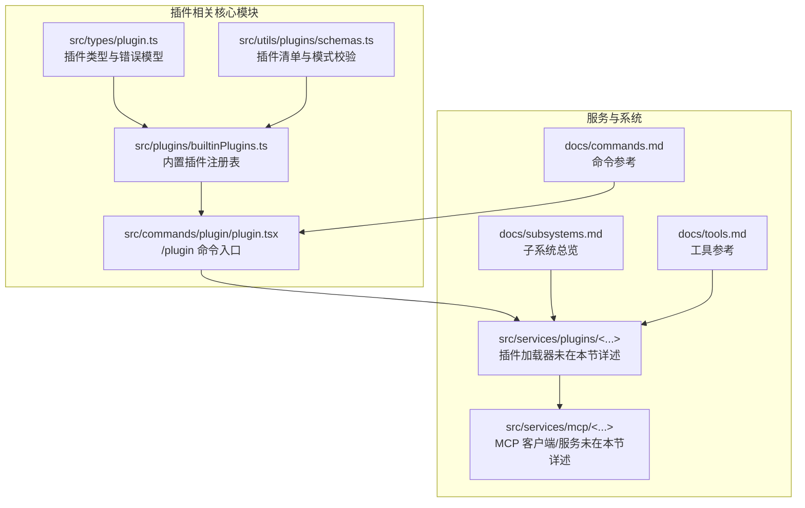
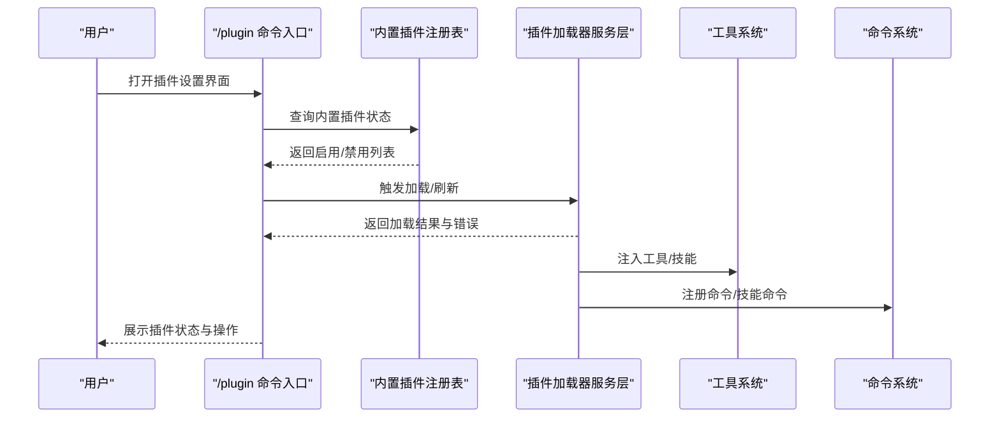
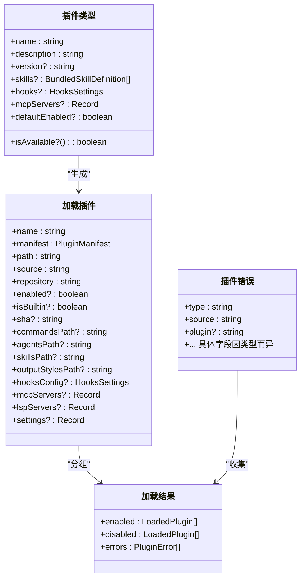
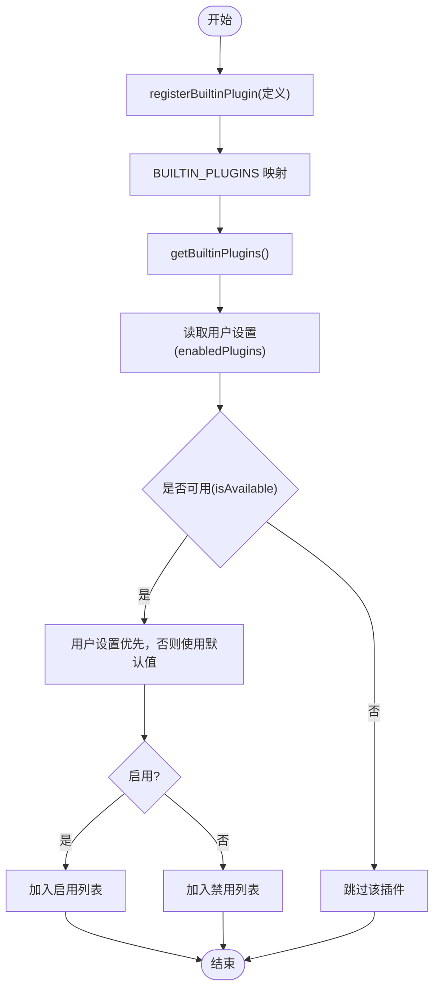
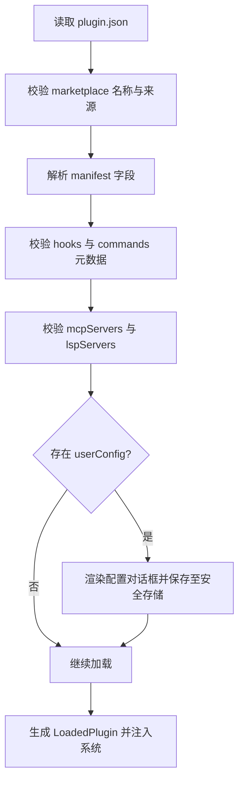
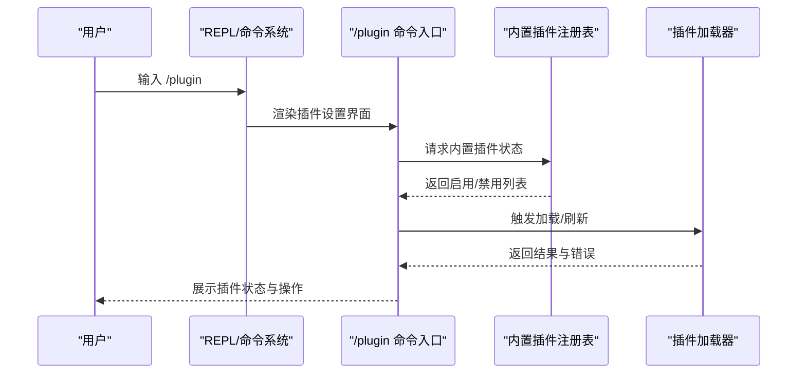
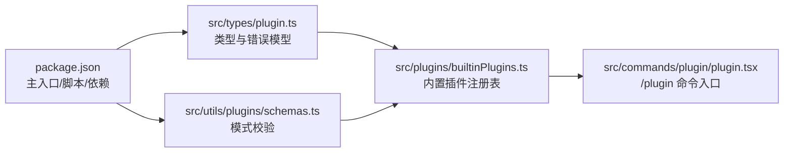

# 插件开发指南

<cite>
**本文引用的文件**
- [README.md](file://README.md)
- [package.json](file://package.json)
- [src/types/plugin.ts](file://src/types/plugin.ts)
- [src/plugins/builtinPlugins.ts](file://src/plugins/builtinPlugins.ts)
- [src/utils/plugins/schemas.ts](file://src/utils/plugins/schemas.ts)
- [src/commands/plugin/plugin.tsx](file://src/commands/plugin/plugin.tsx)
- [docs/subsystems.md](file://docs/subsystems.md)
- [docs/tools.md](file://docs/tools.md)
- [docs/commands.md](file://docs/commands.md)
- [mcp-server/README.md](file://mcp-server/README.md)
</cite>

## 目录
1. [简介](#简介)
2. [项目结构](#项目结构)
3. [核心组件](#核心组件)
4. [架构总览](#架构总览)
5. [详细组件分析](#详细组件分析)
6. [依赖分析](#依赖分析)
7. [性能考虑](#性能考虑)
8. [故障排查指南](#故障排查指南)
9. [结论](#结论)
10. [附录](#附录)

## 简介
本指南面向希望在 Claude Code 中开发与扩展插件能力的开发者，基于已泄露源码仓库中的插件系统实现，系统讲解插件的结构规范、API 接口、命令注册、工具扩展、钩子系统、MCP 服务器集成、最佳实践、打包与验证流程、调试与测试方法以及与核心系统的集成与兼容性要求。文档同时提供从简单工具插件到复杂工作流插件的开发示例路径，并给出可直接定位到源码的参考片段。

## 项目结构
Claude Code 的插件体系由“内置插件注册表”“插件类型与错误模型”“插件清单与模式校验”“命令入口与 UI 集成”等模块构成，配合服务层的插件加载器与市场机制，形成可安装、可启用/禁用、可自动更新的插件生态。

图示来源
- [src/types/plugin.ts:1-365](file://src/types/plugin.ts#L1-L365)
- [src/plugins/builtinPlugins.ts:1-161](file://src/plugins/builtinPlugins.ts#L1-L161)
- [src/utils/plugins/schemas.ts:1-800](file://src/utils/plugins/schemas.ts#L1-L800)
- [src/commands/plugin/plugin.tsx:1-9](file://src/commands/plugin/plugin.tsx#L1-L9)
- [docs/subsystems.md:150-180](file://docs/subsystems.md#L150-L180)
- [docs/tools.md:1-174](file://docs/tools.md#L1-L174)
- [docs/commands.md:1-212](file://docs/commands.md#L1-L212)

章节来源
- [README.md:193-236](file://README.md#L193-L236)
- [package.json:1-95](file://package.json#L1-L95)
- [docs/subsystems.md:150-180](file://docs/subsystems.md#L150-L180)

## 核心组件
- 插件类型与错误模型：定义插件生命周期中使用的数据结构、错误类型与消息映射，确保加载、配置、MCP/LSP 启动等环节的错误可诊断与用户友好提示。
- 内置插件注册表：管理随 CLI 发行的内置插件，支持按用户设置启用/禁用、默认可用性检查与技能命令转换。
- 插件清单与模式校验：对插件清单、钩子、命令元数据、MCP/LSP 配置进行严格校验，保障插件来源可信与配置合法。
- /plugin 命令入口：作为插件管理 UI 的入口组件，承载插件设置、选项流程与信任警告等交互。

章节来源
- [src/types/plugin.ts:1-365](file://src/types/plugin.ts#L1-L365)
- [src/plugins/builtinPlugins.ts:1-161](file://src/plugins/builtinPlugins.ts#L1-L161)
- [src/utils/plugins/schemas.ts:1-800](file://src/utils/plugins/schemas.ts#L1-L800)
- [src/commands/plugin/plugin.tsx:1-9](file://src/commands/plugin/plugin.tsx#L1-L9)

## 架构总览
插件系统在启动时扫描内置与市场插件，解析清单与配置，注入命令、技能、钩子与 MCP/LSP 服务器；运行期通过工具系统与命令系统暴露给用户，权限系统贯穿执行前的授权决策。

图示来源
- [src/commands/plugin/plugin.tsx:1-9](file://src/commands/plugin/plugin.tsx#L1-L9)
- [src/plugins/builtinPlugins.ts:57-102](file://src/plugins/builtinPlugins.ts#L57-L102)
- [docs/subsystems.md:150-180](file://docs/subsystems.md#L150-L180)

## 详细组件分析

### 组件一：插件类型与错误模型
- 关键点
  - 插件定义：名称、描述、版本、技能、钩子、MCP/LSP 服务器、默认启用状态、可用性检查等。
  - 加载结果：分别记录启用/禁用插件与错误集合，便于 UI 与日志展示。
  - 错误类型：覆盖路径不存在、网络错误、清单解析/校验失败、市场不可用/策略阻断、MCP/LSP 配置无效或启动失败等。
  - 错误消息映射：统一将错误类型转为人类可读提示，辅助快速定位问题。

图示来源
- [src/types/plugin.ts:18-70](file://src/types/plugin.ts#L18-L70)
- [src/types/plugin.ts:48-70](file://src/types/plugin.ts#L48-L70)
- [src/types/plugin.ts:101-289](file://src/types/plugin.ts#L101-L289)
- [src/types/plugin.ts:285-289](file://src/types/plugin.ts#L285-L289)

章节来源
- [src/types/plugin.ts:1-365](file://src/types/plugin.ts#L1-L365)

### 组件二：内置插件注册表
- 关键点
  - 注册内置插件：以名称为键存储定义，支持可用性检查与默认启用状态。
  - 获取内置插件：根据用户设置与默认值拆分为启用/禁用两组，用于 UI 展示与技能命令注入。
  - 技能命令转换：将内置插件中的技能定义转换为命令对象，供命令系统识别与调用。

图示来源
- [src/plugins/builtinPlugins.ts:28-32](file://src/plugins/builtinPlugins.ts#L28-L32)
- [src/plugins/builtinPlugins.ts:61-102](file://src/plugins/builtinPlugins.ts#L61-L102)
- [src/plugins/builtinPlugins.ts:108-121](file://src/plugins/builtinPlugins.ts#L108-L121)

章节来源
- [src/plugins/builtinPlugins.ts:1-161](file://src/plugins/builtinPlugins.ts#L1-L161)

### 组件三：插件清单与模式校验
- 关键点
  - 市场名安全：保留官方市场名、阻止仿冒命名、限制非 ASCII 字符、校验来源组织。
  - 清单字段：名称、版本、描述、作者、主页、仓库、许可证、关键词、依赖等。
  - 钩子与命令：支持外部文件或内联定义，命令元数据支持覆盖描述、参数提示、默认模型与允许工具集。
  - MCP/LSP：支持本地相对路径、远程 URL、MCPB 包、内联配置；对 LSP 提供严格的字段校验与默认值。
  - 用户配置：声明可配置项（字符串/数字/布尔/目录/文件），支持敏感信息存储于安全位置。

图示来源
- [src/utils/plugins/schemas.ts:19-58](file://src/utils/plugins/schemas.ts#L19-L58)
- [src/utils/plugins/schemas.ts:274-320](file://src/utils/plugins/schemas.ts#L274-L320)
- [src/utils/plugins/schemas.ts:328-340](file://src/utils/plugins/schemas.ts#L328-L340)
- [src/utils/plugins/schemas.ts:429-452](file://src/utils/plugins/schemas.ts#L429-L452)
- [src/utils/plugins/schemas.ts:543-572](file://src/utils/plugins/schemas.ts#L543-L572)
- [src/utils/plugins/schemas.ts:708-788](file://src/utils/plugins/schemas.ts#L708-L788)
- [src/utils/plugins/schemas.ts:632-654](file://src/utils/plugins/schemas.ts#L632-L654)

章节来源
- [src/utils/plugins/schemas.ts:1-800](file://src/utils/plugins/schemas.ts#L1-L800)

### 组件四：/plugin 命令入口与 UI 集成
- 关键点
  - /plugin 命令入口组件负责渲染插件设置界面，接收完成回调并在 UI 中展示插件状态与操作。
  - 与内置插件注册表协作，提供启用/禁用切换与技能命令列表。
  - 与插件加载器交互，触发加载/刷新与错误展示。

图示来源
- [src/commands/plugin/plugin.tsx:1-9](file://src/commands/plugin/plugin.tsx#L1-L9)
- [src/plugins/builtinPlugins.ts:57-102](file://src/plugins/builtinPlugins.ts#L57-L102)

章节来源
- [src/commands/plugin/plugin.tsx:1-9](file://src/commands/plugin/plugin.tsx#L1-L9)
- [docs/commands.md:95-102](file://docs/commands.md#L95-L102)

### 组件五：工具扩展与钩子系统
- 工具扩展
  - 插件可通过清单提供额外命令与技能，工具系统在加载后将其纳入可用工具集。
  - 参考工具参考文档了解工具定义模式与输入/权限/并发特性。
- 钩子系统
  - 插件可提供钩子配置，通过模式校验后注入系统，在特定生命周期事件中生效。
  - 钩子配置支持外部文件或内联定义，便于维护与复用。

章节来源
- [docs/tools.md:1-174](file://docs/tools.md#L1-L174)
- [src/utils/plugins/schemas.ts:328-340](file://src/utils/plugins/schemas.ts#L328-L340)
- [src/utils/plugins/schemas.ts:429-452](file://src/utils/plugins/schemas.ts#L429-L452)

### 组件六：MCP 服务器集成
- 插件可声明 MCP 服务器，支持本地 JSON 文件、远程 URL 或 MCPB 包；也可通过 channels 在助手模式下提示用户配置。
- MCP 服务器配置需通过模式校验，避免重复与冲突；加载失败时返回具体错误类型以便诊断。

章节来源
- [src/utils/plugins/schemas.ts:543-572](file://src/utils/plugins/schemas.ts#L543-L572)
- [src/utils/plugins/schemas.ts:670-703](file://src/utils/plugins/schemas.ts#L670-L703)
- [src/types/plugin.ts:163-175](file://src/types/plugin.ts#L163-L175)

## 依赖分析
- 运行时与构建
  - 主入口与二进制入口位于 package.json，脚本涵盖构建、类型检查、格式化与 lint。
  - 依赖包括 Anthropic SDK、MCP SDK、React/Ink、Zod、OpenTelemetry 等。
- 插件系统依赖
  - 类型与模式校验依赖 Zod；错误消息映射依赖类型守卫与 switch 分支。
  - 内置插件注册表依赖用户设置模块以持久化启用状态。

图示来源
- [package.json:1-95](file://package.json#L1-L95)
- [src/types/plugin.ts:1-365](file://src/types/plugin.ts#L1-L365)
- [src/utils/plugins/schemas.ts:1-800](file://src/utils/plugins/schemas.ts#L1-L800)
- [src/plugins/builtinPlugins.ts:1-161](file://src/plugins/builtinPlugins.ts#L1-L161)
- [src/commands/plugin/plugin.tsx:1-9](file://src/commands/plugin/plugin.tsx#L1-L9)

章节来源
- [package.json:1-95](file://package.json#L1-L95)

## 性能考虑
- 懒加载与延迟初始化：插件加载器按需加载组件，避免一次性初始化所有插件导致的冷启动延迟。
- 并发与去重：对重复 MCP 服务器声明进行抑制，减少资源浪费与冲突风险。
- 缓存与回退：对缺失缓存的插件返回明确错误提示，引导用户刷新插件列表。
- UI 响应：/plugin 命令入口采用 React 组件，结合状态与错误集合，保证界面响应与可读性。

章节来源
- [src/types/plugin.ts:170-175](file://src/types/plugin.ts#L170-L175)
- [src/types/plugin.ts:273-277](file://src/types/plugin.ts#L273-L277)
- [src/commands/plugin/plugin.tsx:1-9](file://src/commands/plugin/plugin.tsx#L1-L9)

## 故障排查指南
- 常见错误类型与定位
  - 路径不存在、Git 认证失败、网络错误、清单解析/校验失败、市场不可用/策略阻断、MCP/LSP 配置无效或启动失败等。
- 错误消息映射
  - 使用统一的消息映射函数将错误类型转为人类可读提示，便于日志与 UI 展示。
- 处理建议
  - 对于清单校验失败，检查字段与路径；对于网络错误，确认代理与 DNS；对于 MCP/LSP 启动失败，查看超时与崩溃原因。

章节来源
- [src/types/plugin.ts:101-289](file://src/types/plugin.ts#L101-L289)
- [src/types/plugin.ts:295-363](file://src/types/plugin.ts#L295-L363)

## 结论
Claude Code 的插件系统以类型安全、模式校验与错误模型为核心，结合内置插件注册表与命令入口，实现了可安装、可启用/禁用、可自动更新的扩展生态。通过工具系统与钩子系统，插件能够无缝融入核心功能；借助 MCP/LSP 配置，插件可扩展外部能力。遵循本文的结构规范、API 接口与最佳实践，开发者可以高效地构建从简单工具插件到复杂工作流插件的高质量扩展。

## 附录

### 开发示例路径（不展示代码内容）
- 简单工具插件
  - 定义插件清单字段与命令元数据：[插件清单字段校验:274-320](file://src/utils/plugins/schemas.ts#L274-L320)、[命令元数据校验:385-416](file://src/utils/plugins/schemas.ts#L385-L416)
  - 将命令注入工具系统：[工具参考模式:19-39](file://docs/tools.md#L19-L39)
- 复杂工作流插件
  - 声明技能与钩子：[钩子配置校验:328-340](file://src/utils/plugins/schemas.ts#L328-L340)、[技能目录扩展:484-499](file://src/utils/plugins/schemas.ts#L484-L499)
  - MCP/LSP 集成：[MCP 服务器配置:543-572](file://src/utils/plugins/schemas.ts#L543-L572)、[LSP 服务器配置:708-788](file://src/utils/plugins/schemas.ts#L708-L788)
- 插件管理与 UI
  - /plugin 命令入口组件：[/plugin 命令入口:1-9](file://src/commands/plugin/plugin.tsx#L1-L9)
  - 内置插件注册与状态：[内置插件注册表:1-161](file://src/plugins/builtinPlugins.ts#L1-L161)

### MCP 服务器集成与市场机制
- MCP 服务器作为客户端与服务端均可运行，插件可声明 MCPB 包或内联配置；市场机制支持自动更新与策略阻断。
- 参考：[子系统总览（MCP）:72-104](file://docs/subsystems.md#L72-L104)、[MCP 服务器 README](file://mcp-server/README.md)