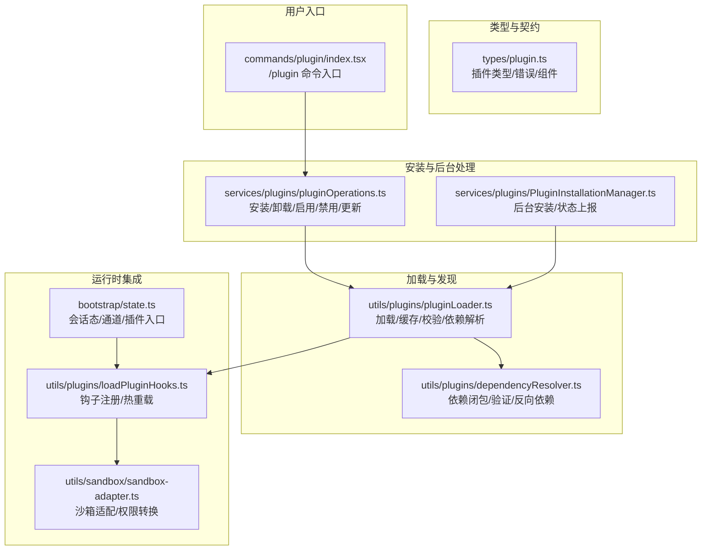
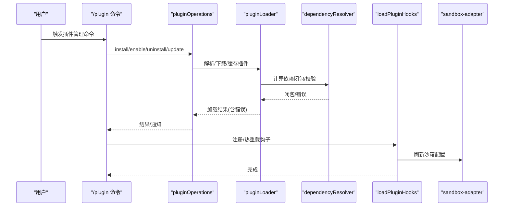
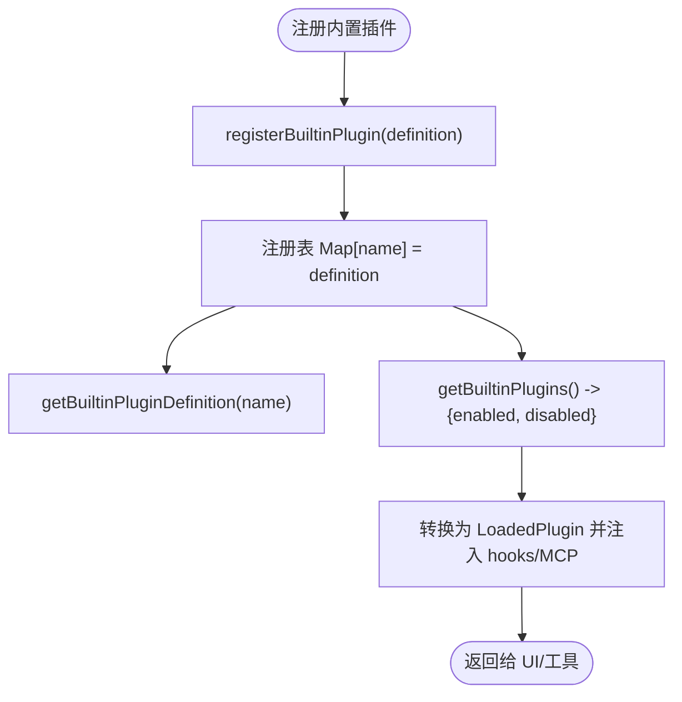
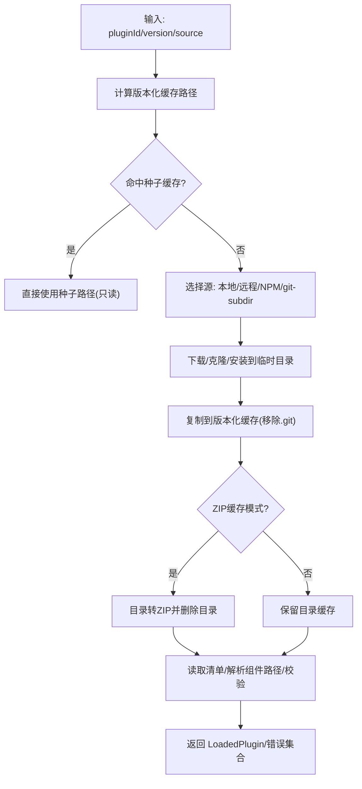
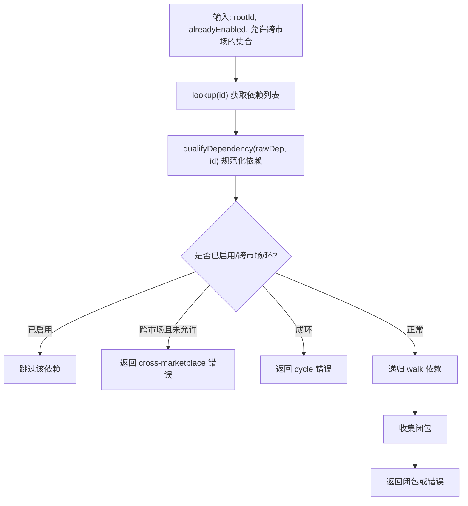
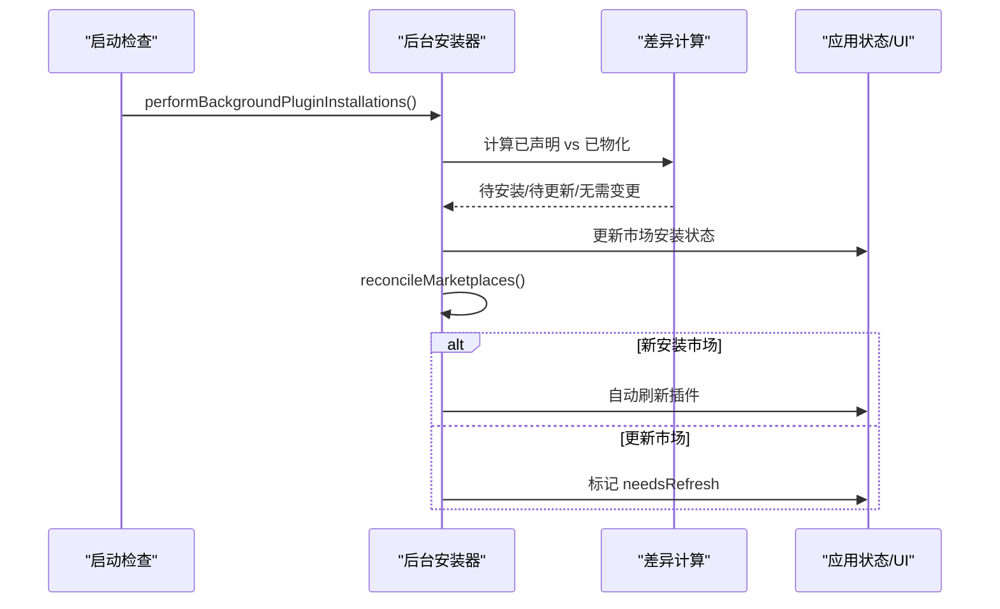
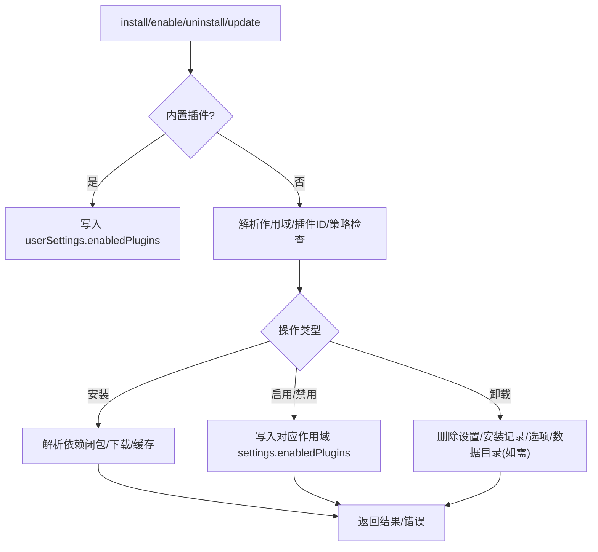
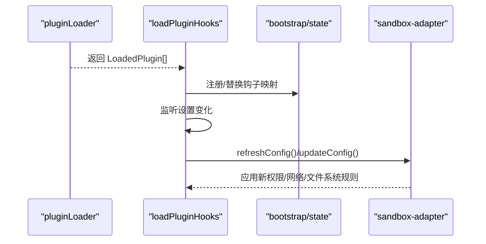
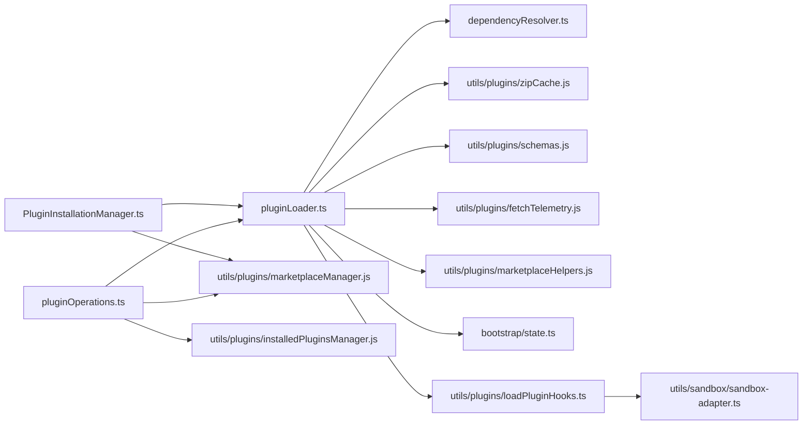

# 插件架构设计

<cite>
**本文档引用的文件**
- [builtinPlugins.ts](file://src/plugins/builtinPlugins.ts)
- [plugin.ts](file://src/types/plugin.ts)
- [state.ts](file://src/bootstrap/state.ts)
- [PluginInstallationManager.ts](file://src/services/plugins/PluginInstallationManager.ts)
- [pluginOperations.ts](file://src/services/plugins/pluginOperations.ts)
- [pluginLoader.ts](file://src/utils/plugins/pluginLoader.ts)
- [dependencyResolver.ts](file://src/utils/plugins/dependencyResolver.ts)
- [loadPluginHooks.ts](file://src/utils/plugins/loadPluginHooks.ts)
- [sandbox-adapter.ts](file://src/utils/sandbox/sandbox-adapter.ts)
- [index.tsx](file://src/commands/plugin/index.tsx)
</cite>

## 目录
1. [简介](#简介)
2. [项目结构](#项目结构)
3. [核心组件](#核心组件)
4. [架构总览](#架构总览)
5. [详细组件分析](#详细组件分析)
6. [依赖关系分析](#依赖关系分析)
7. [性能考虑](#性能考虑)
8. [故障排查指南](#故障排查指南)
9. [结论](#结论)

## 简介
本文件面向 Claude Code 的插件系统，系统性阐述其架构设计、注册机制、加载流程与生命周期管理，明确插件定义结构、接口规范与依赖解析策略，区分内置插件与第三方插件，说明插件标识符格式与版本管理机制，并解释启用/禁用状态管理、配置持久化与热重载机制。同时，给出插件隔离、沙箱执行与安全边界的设计原理，辅以架构图与组件交互示意，帮助开发者快速理解并高效扩展插件体系。

## 项目结构
插件系统围绕“类型定义—加载器—安装器—操作器—运行时集成”五层展开，关键模块分布如下：
- 类型与契约：插件元数据、错误类型、组件类型等统一在类型定义中声明
- 加载器：负责发现、缓存、校验、依赖解析与错误收集
- 安装器：后台自动安装市场与插件，支持增量更新与失败回退
- 操作器：提供 CLI/UI 友好的安装/卸载/启用/禁用/更新能力
- 运行时集成：钩子注册、热重载、沙箱权限与安全边界

图表来源
- [plugin.ts:1-365](file://src/types/plugin.ts#L1-L365)
- [pluginLoader.ts:1-800](file://src/utils/plugins/pluginLoader.ts#L1-L800)
- [dependencyResolver.ts:1-307](file://src/utils/plugins/dependencyResolver.ts#L1-L307)
- [PluginInstallationManager.ts:1-186](file://src/services/plugins/PluginInstallationManager.ts#L1-L186)
- [pluginOperations.ts:1-800](file://src/services/plugins/pluginOperations.ts#L1-L800)
- [loadPluginHooks.ts:1-215](file://src/utils/plugins/loadPluginHooks.ts#L1-L215)
- [sandbox-adapter.ts:1-200](file://src/utils/sandbox/sandbox-adapter.ts#L1-L200)
- [index.tsx:1-13](file://src/commands/plugin/index.tsx#L1-L13)

章节来源
- [plugin.ts:1-365](file://src/types/plugin.ts#L1-L365)
- [pluginLoader.ts:1-800](file://src/utils/plugins/pluginLoader.ts#L1-L800)
- [PluginInstallationManager.ts:1-186](file://src/services/plugins/PluginInstallationManager.ts#L1-L186)
- [pluginOperations.ts:1-800](file://src/services/plugins/pluginOperations.ts#L1-L800)
- [loadPluginHooks.ts:1-215](file://src/utils/plugins/loadPluginHooks.ts#L1-L215)
- [sandbox-adapter.ts:1-200](file://src/utils/sandbox/sandbox-adapter.ts#L1-L200)
- [index.tsx:1-13](file://src/commands/plugin/index.tsx#L1-L13)

## 核心组件
- 插件类型与契约
  - 插件清单、加载结果、错误类型、组件类型等在类型定义中集中声明，确保编译期约束与运行期一致性
- 内置插件注册中心
  - 提供注册、查询、可用性过滤、默认启用状态与 UI 展示所需字段
- 插件加载器
  - 负责版本化缓存、种子缓存探测、拷贝/解压、清单校验、组件路径解析、错误收集
- 依赖解析器
  - 安装期 DFS 闭包解析，加载期固定点验证与降级，反向依赖查找
- 安装器与操作器
  - 后台安装市场与插件，状态映射到 UI；提供安装/卸载/启用/禁用/更新纯库函数
- 运行时集成
  - 钩子注册与热重载、沙箱权限转换与动态刷新

章节来源
- [builtinPlugins.ts:1-161](file://src/plugins/builtinPlugins.ts#L1-L161)
- [plugin.ts:1-365](file://src/types/plugin.ts#L1-L365)
- [pluginLoader.ts:1-800](file://src/utils/plugins/pluginLoader.ts#L1-L800)
- [dependencyResolver.ts:1-307](file://src/utils/plugins/dependencyResolver.ts#L1-L307)
- [PluginInstallationManager.ts:1-186](file://src/services/plugins/PluginInstallationManager.ts#L1-L186)
- [pluginOperations.ts:1-800](file://src/services/plugins/pluginOperations.ts#L1-L800)
- [loadPluginHooks.ts:1-215](file://src/utils/plugins/loadPluginHooks.ts#L1-L215)
- [sandbox-adapter.ts:1-200](file://src/utils/sandbox/sandbox-adapter.ts#L1-L200)

## 架构总览
插件系统采用“声明式清单 + 版本化缓存 + 依赖闭包 + 运行时钩子”的分层设计。启动时通过后台安装器完成市场与插件的预热，随后加载器按优先级与策略解析插件，依赖解析器保证依赖满足，最后运行时集成模块完成钩子注册与沙箱权限转换。

图表来源
- [index.tsx:1-13](file://src/commands/plugin/index.tsx#L1-L13)
- [pluginOperations.ts:1-800](file://src/services/plugins/pluginOperations.ts#L1-L800)
- [pluginLoader.ts:1-800](file://src/utils/plugins/pluginLoader.ts#L1-L800)
- [dependencyResolver.ts:1-307](file://src/utils/plugins/dependencyResolver.ts#L1-L307)
- [loadPluginHooks.ts:1-215](file://src/utils/plugins/loadPluginHooks.ts#L1-L215)
- [sandbox-adapter.ts:1-200](file://src/utils/sandbox/sandbox-adapter.ts#L1-L200)

## 详细组件分析

### 内置插件注册中心（builtinPlugins）
- 职责
  - 维护内置插件注册表，提供注册、查询、可用性过滤、默认启用状态与 UI 展示所需字段
  - 将内置插件转换为 LoadedPlugin，注入 hooks/MCP 等配置
- 关键点
  - 插件 ID 使用 `{name}@builtin` 格式，便于与市场插件区分
  - 用户设置优先于默认值，未满足 isAvailable 条件的内置插件不参与展示
  - 内置插件技能转换为命令对象，供 UI 与工具使用

图表来源
- [builtinPlugins.ts:1-161](file://src/plugins/builtinPlugins.ts#L1-L161)

章节来源
- [builtinPlugins.ts:1-161](file://src/plugins/builtinPlugins.ts#L1-L161)

### 插件加载器（pluginLoader）
- 职责
  - 发现与加载插件，构建版本化缓存，处理种子缓存与 ZIP 缓存，解析清单与组件路径，收集错误
- 关键流程
  - 版本化缓存路径计算与探测（含种子缓存）
  - 源复制/解压（本地/远程），移除 .git，校验内容
  - 清单校验、组件路径解析、错误分类与聚合
  - 支持 NPM 包安装与 git 子目录源（偏平化下载）

图表来源
- [pluginLoader.ts:1-800](file://src/utils/plugins/pluginLoader.ts#L1-L800)

章节来源
- [pluginLoader.ts:1-800](file://src/utils/plugins/pluginLoader.ts#L1-L800)

### 依赖解析器（dependencyResolver）
- 职责
  - 安装期：DFS 闭包解析，检测环依赖与跨市场依赖，避免自动跨信任边界拉取
  - 加载期：固定点验证，对不满足依赖的插件进行降级，并生成错误信息
  - 反向依赖：查找卸载/禁用目标的依赖者，用于提示风险
- 关键点
  - 依赖规范化：裸名继承声明插件市场后缀；inline 插件的裸名依赖仅按名称匹配
  - 已启用跳过：避免对已启用依赖产生意外设置写入
  - 安全边界：跨市场依赖默认阻断，除非根市场允许特定市场

图表来源
- [dependencyResolver.ts:1-307](file://src/utils/plugins/dependencyResolver.ts#L1-L307)

章节来源
- [dependencyResolver.ts:1-307](file://src/utils/plugins/dependencyResolver.ts#L1-L307)

### 安装器与后台处理（PluginInstallationManager）
- 职责
  - 后台安装/更新市场，映射进度事件到应用状态，自动刷新插件或提示手动重载
  - 对新安装市场触发自动刷新，对更新市场清理缓存并提示重载
- 关键点
  - 通过差异计算确定待安装/更新的市场
  - 失败回退：自动刷新失败则标记 needsRefresh，引导用户手动重载

图表来源
- [PluginInstallationManager.ts:1-186](file://src/services/plugins/PluginInstallationManager.ts#L1-L186)

章节来源
- [PluginInstallationManager.ts:1-186](file://src/services/plugins/PluginInstallationManager.ts#L1-L186)

### 插件操作器（pluginOperations）
- 职责
  - 提供纯库函数实现安装/卸载/启用/禁用/更新，不直接写控制台或退出进程
  - 支持多作用域（user/project/local/managed），自动解析最具体作用域
  - 政策拦截：组织策略阻止安装/启用
- 关键点
  - 内置插件启用/禁用走用户作用域设置，不涉及安装记录
  - 卸载时清理选项与数据目录，必要时标记版本孤儿
  - 反向依赖警告：卸载/禁用前扫描依赖者，提示风险

图表来源
- [pluginOperations.ts:1-800](file://src/services/plugins/pluginOperations.ts#L1-L800)

章节来源
- [pluginOperations.ts:1-800](file://src/services/plugins/pluginOperations.ts#L1-L800)

### 运行时集成（钩子与沙箱）
- 钩子注册与热重载
  - 加载插件钩子，建立事件到匹配器的映射；支持热重载时仅保留仍启用插件的钩子
- 沙箱适配
  - 将设置转换为沙箱运行时配置，支持网络域名白名单、文件系统路径规则、敏感配置存储
  - 动态刷新：监听设置变化，实时更新沙箱配置

图表来源
- [loadPluginHooks.ts:1-215](file://src/utils/plugins/loadPluginHooks.ts#L1-L215)
- [sandbox-adapter.ts:1-200](file://src/utils/sandbox/sandbox-adapter.ts#L1-L200)
- [state.ts:1-800](file://src/bootstrap/state.ts#L1-L800)

章节来源
- [loadPluginHooks.ts:1-215](file://src/utils/plugins/loadPluginHooks.ts#L1-L215)
- [sandbox-adapter.ts:1-200](file://src/utils/sandbox/sandbox-adapter.ts#L1-L200)
- [state.ts:1-800](file://src/bootstrap/state.ts#L1-L800)

## 依赖关系分析
- 组件耦合
  - pluginOperations 依赖 pluginLoader 与 marketplace/installed 管理，是 UI/CLI 的纯库入口
  - pluginLoader 依赖依赖解析器、清单校验、缓存与 ZIP 工具
  - PluginInstallationManager 依赖 marketplace 管理与缓存清理，驱动后台安装
  - 运行时集成模块（loadPluginHooks/sandbox-adapter）依赖设置与状态
- 依赖链
  - 安装 → 缓存 → 加载 → 依赖解析 → 钩子注册 → 沙箱生效
- 循环依赖
  - 通过模块职责划分与纯函数解析器避免循环导入

图表来源
- [pluginOperations.ts:1-800](file://src/services/plugins/pluginOperations.ts#L1-L800)
- [pluginLoader.ts:1-800](file://src/utils/plugins/pluginLoader.ts#L1-L800)
- [dependencyResolver.ts:1-307](file://src/utils/plugins/dependencyResolver.ts#L1-L307)
- [PluginInstallationManager.ts:1-186](file://src/services/plugins/PluginInstallationManager.ts#L1-L186)
- [loadPluginHooks.ts:1-215](file://src/utils/plugins/loadPluginHooks.ts#L1-L215)
- [sandbox-adapter.ts:1-200](file://src/utils/sandbox/sandbox-adapter.ts#L1-L200)
- [state.ts:1-800](file://src/bootstrap/state.ts#L1-L800)

章节来源
- [pluginOperations.ts:1-800](file://src/services/plugins/pluginOperations.ts#L1-L800)
- [pluginLoader.ts:1-800](file://src/utils/plugins/pluginLoader.ts#L1-L800)
- [dependencyResolver.ts:1-307](file://src/utils/plugins/dependencyResolver.ts#L1-L307)
- [PluginInstallationManager.ts:1-186](file://src/services/plugins/PluginInstallationManager.ts#L1-L186)
- [loadPluginHooks.ts:1-215](file://src/utils/plugins/loadPluginHooks.ts#L1-L215)
- [sandbox-adapter.ts:1-200](file://src/utils/sandbox/sandbox-adapter.ts#L1-L200)
- [state.ts:1-800](file://src/bootstrap/state.ts#L1-L800)

## 性能考虑
- 缓存与增量
  - 版本化缓存与 ZIP 缓存显著降低重复下载与解压成本
  - 种子缓存优先探测，避免重复下载
- 依赖解析优化
  - 安装期 DFS 闭包解析，避免重复遍历
  - 已启用依赖跳过，减少设置写入与二次缓存
- I/O 与并发
  - 批量清理与写入合并，减少磁盘抖动
  - 后台安装器异步推进，不影响启动主流程

## 故障排查指南
- 常见错误类型
  - 路径不存在、Git 认证失败、网络错误、清单解析/校验失败、市场不可用、依赖不满足、LSP/MCP 启动/请求失败、策略阻断等
- 排查步骤
  - 查看错误消息与类型，定位来源（市场/插件/组件）
  - 若为依赖不满足，使用反向依赖查找确认影响范围
  - 若为市场策略阻断，检查策略配置与允许列表
  - 若为缓存缺失，执行重载或刷新插件
- 相关实现参考
  - 错误类型与消息映射、依赖解析与降级、后台安装与回退逻辑

章节来源
- [plugin.ts:101-283](file://src/types/plugin.ts#L101-L283)
- [dependencyResolver.ts:177-234](file://src/utils/plugins/dependencyResolver.ts#L177-L234)
- [PluginInstallationManager.ts:135-180](file://src/services/plugins/PluginInstallationManager.ts#L135-L180)

## 结论
Claude Code 插件架构以类型安全、可缓存、可解析、可运行为核心设计原则，通过“声明式清单 + 版本化缓存 + 依赖闭包 + 运行时钩子 + 沙箱安全”的完整闭环，实现了内置与第三方插件的一致体验。内置插件以用户设置为准，第三方插件通过市场与作用域管理，配合后台安装与热重载，兼顾易用性与安全性。建议在扩展时严格遵循类型契约、依赖规范与安全边界，确保插件生态的稳定与可控。