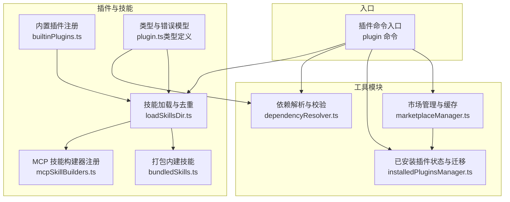
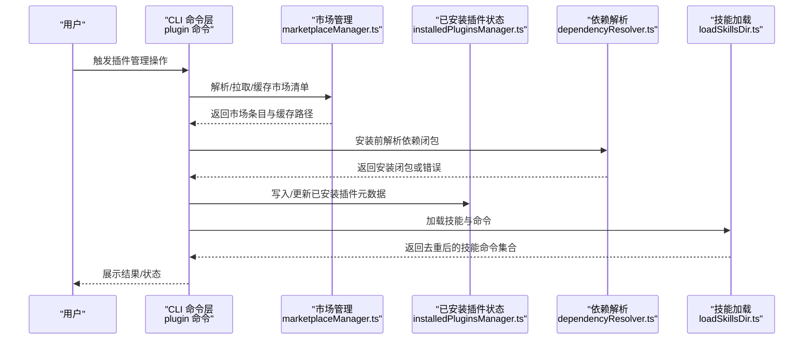
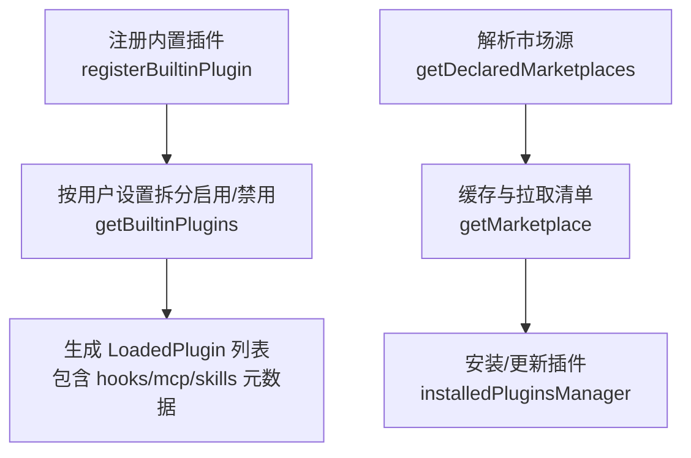
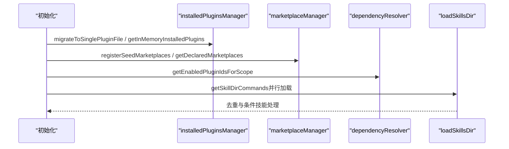
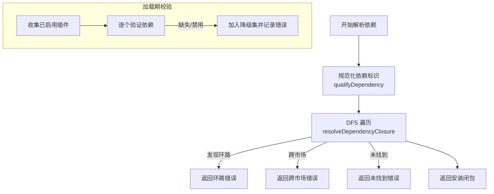
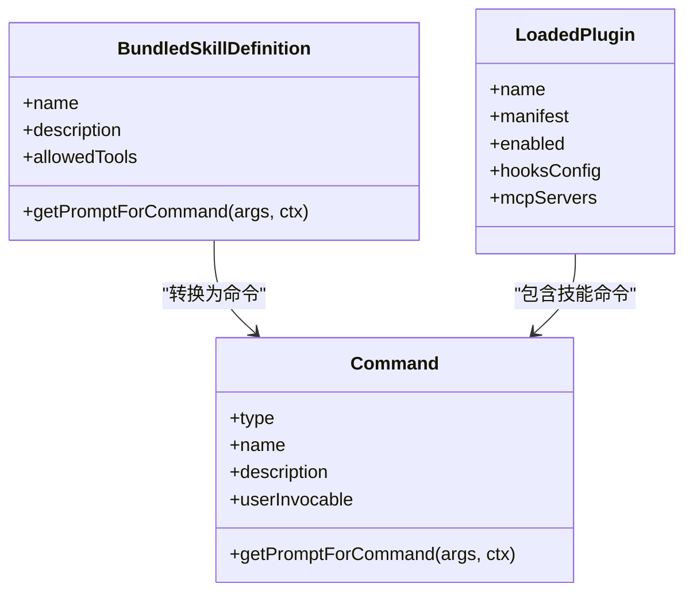
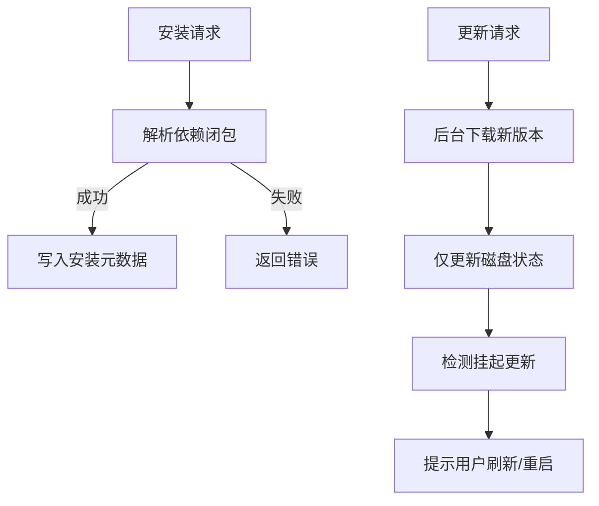
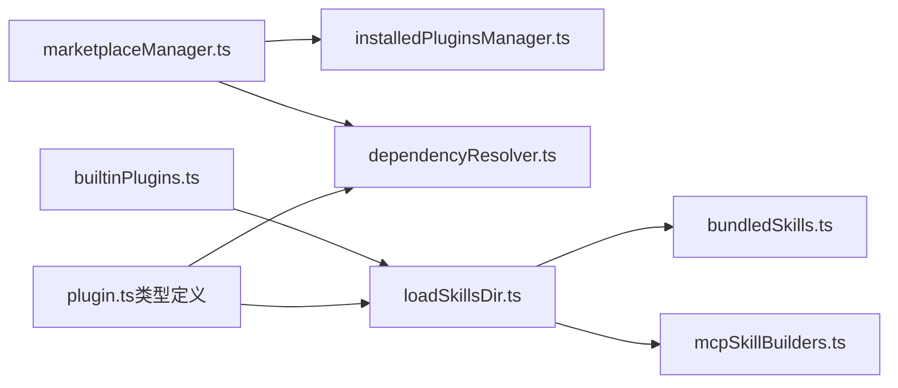

# 插件系统

<cite>
**本文引用的文件**
- [builtinPlugins.ts](file://src/plugins/builtinPlugins.ts)
- [plugin.ts（类型定义）](file://src/types/plugin.ts)
- [bundledSkills.ts](file://src/skills/bundledSkills.ts)
- [loadSkillsDir.ts](file://src/skills/loadSkillsDir.ts)
- [mcpSkillBuilders.ts](file://src/skills/mcpSkillBuilders.ts)
- [installedPluginsManager.ts](file://src/utils/plugins/installedPluginsManager.ts)
- [marketplaceManager.ts](file://src/utils/plugins/marketplaceManager.ts)
- [dependencyResolver.ts](file://src/utils/plugins/dependencyResolver.ts)
- [plugin 命令入口](file://src/commands/plugin/index.tsx)
</cite>

## 目录
1. [简介](#简介)
2. [项目结构](#项目结构)
3. [核心组件](#核心组件)
4. [架构总览](#架构总览)
5. [详细组件分析](#详细组件分析)
6. [依赖关系分析](#依赖关系分析)
7. [性能考量](#性能考量)
8. [故障排查指南](#故障排查指南)
9. [结论](#结论)
10. [附录](#附录)

## 简介
本文件面向 Claude Code 的插件与技能系统，提供从架构设计到开发实践的完整文档。内容覆盖：
- 插件加载机制、生命周期与依赖解析
- 内置插件与第三方插件的差异与管理
- 插件安装、卸载、更新流程
- 技能系统：可复用工作流的构建方式
- 插件发布与分发、市场管理、版本控制与兼容性
- 调试技巧、性能优化与安全注意事项

## 项目结构
围绕插件与技能系统的关键目录与文件：
- 插件注册与内置插件管理：src/plugins/builtinPlugins.ts
- 类型与错误模型：src/types/plugin.ts
- 技能加载与去重：src/skills/loadSkillsDir.ts
- 打包内建技能：src/skills/bundledSkills.ts
- MCP 技能构建器注册：src/skills/mcpSkillBuilders.ts
- 市场管理与缓存：src/utils/plugins/marketplaceManager.ts
- 已安装插件状态与迁移：src/utils/plugins/installedPluginsManager.ts
- 依赖解析与校验：src/utils/plugins/dependencyResolver.ts
- 插件命令入口：src/commands/plugin/index.tsx

**图表来源**
- [builtinPlugins.ts](file://src/plugins/builtinPlugins.ts)
- [plugin.ts（类型定义）](file://src/types/plugin.ts)
- [loadSkillsDir.ts](file://src/skills/loadSkillsDir.ts)
- [bundledSkills.ts](file://src/skills/bundledSkills.ts)
- [mcpSkillBuilders.ts](file://src/skills/mcpSkillBuilders.ts)
- [marketplaceManager.ts](file://src/utils/plugins/marketplaceManager.ts)
- [installedPluginsManager.ts](file://src/utils/plugins/installedPluginsManager.ts)
- [dependencyResolver.ts](file://src/utils/plugins/dependencyResolver.ts)
- [plugin 命令入口](file://src/commands/plugin/index.tsx)

**章节来源**
- [builtinPlugins.ts](file://src/plugins/builtinPlugins.ts)
- [plugin.ts（类型定义）](file://src/types/plugin.ts)
- [loadSkillsDir.ts](file://src/skills/loadSkillsDir.ts)
- [bundledSkills.ts](file://src/skills/bundledSkills.ts)
- [mcpSkillBuilders.ts](file://src/skills/mcpSkillBuilders.ts)
- [marketplaceManager.ts](file://src/utils/plugins/marketplaceManager.ts)
- [installedPluginsManager.ts](file://src/utils/plugins/installedPluginsManager.ts)
- [dependencyResolver.ts](file://src/utils/plugins/dependencyResolver.ts)
- [plugin 命令入口](file://src/commands/plugin/index.tsx)

## 核心组件
- 内置插件注册与启用状态管理：提供注册、可用性检查、按用户设置拆分启用/禁用列表，并将内建技能转换为命令对象。
- 类型与错误模型：统一 LoadedPlugin 结构、组件类型、错误分类与消息映射，支持类型安全的错误处理。
- 技能加载与去重：支持多源目录（策略/用户/项目/附加目录）、历史兼容的命令目录、路径去重与条件技能激活。
- 打包内建技能：在二进制中内嵌技能，首次调用时惰性解压参考文件，确保安全写入与路径校验。
- 市场管理与缓存：维护已知市场、缓存清单、拉取与子模块同步、网络/认证错误增强提示。
- 已安装插件状态与迁移：单文件格式迁移、全局安装元数据、内存快照与磁盘状态分离、挂起更新检测。
- 依赖解析与校验：安装期 DFS 闭包解析（含环路与跨市场限制），加载期固定点校验与降级。

**章节来源**
- [builtinPlugins.ts](file://src/plugins/builtinPlugins.ts)
- [plugin.ts（类型定义）](file://src/types/plugin.ts)
- [loadSkillsDir.ts](file://src/skills/loadSkillsDir.ts)
- [bundledSkills.ts](file://src/skills/bundledSkills.ts)
- [marketplaceManager.ts](file://src/utils/plugins/marketplaceManager.ts)
- [installedPluginsManager.ts](file://src/utils/plugins/installedPluginsManager.ts)
- [dependencyResolver.ts](file://src/utils/plugins/dependencyResolver.ts)

## 架构总览
插件系统由“声明式配置 + 运行时加载 + 市场化分发”构成，核心交互如下：

**图表来源**
- [plugin 命令入口](file://src/commands/plugin/index.tsx)
- [marketplaceManager.ts](file://src/utils/plugins/marketplaceManager.ts)
- [installedPluginsManager.ts](file://src/utils/plugins/installedPluginsManager.ts)
- [dependencyResolver.ts](file://src/utils/plugins/dependencyResolver.ts)
- [loadSkillsDir.ts](file://src/skills/loadSkillsDir.ts)

## 详细组件分析

### 内置插件与第三方插件
- 内置插件（Builtin）
  - 通过注册表集中管理，支持默认启用状态、可用性过滤、用户设置持久化。
  - 列表按启用/禁用拆分；禁用插件不参与技能命令生成。
  - 插件 ID 使用后缀区分来源，便于 UI 分类与策略控制。
- 第三方插件（Marketplace）
  - 通过市场源（URL/GitHub/本地）声明，缓存清单以支持离线访问。
  - 支持自动更新与子模块同步，失败时提供增强错误提示。
  - 已安装插件状态独立于启用状态，前者全局后者按仓库控制。

**图表来源**
- [builtinPlugins.ts](file://src/plugins/builtinPlugins.ts)
- [marketplaceManager.ts](file://src/utils/plugins/marketplaceManager.ts)
- [installedPluginsManager.ts](file://src/utils/plugins/installedPluginsManager.ts)

**章节来源**
- [builtinPlugins.ts](file://src/plugins/builtinPlugins.ts)
- [plugin.ts（类型定义）](file://src/types/plugin.ts)
- [marketplaceManager.ts](file://src/utils/plugins/marketplaceManager.ts)
- [installedPluginsManager.ts](file://src/utils/plugins/installedPluginsManager.ts)

### 插件加载机制与生命周期
- 生命周期阶段
  - 初始化：迁移安装文件、建立内存快照、加载已安装插件。
  - 安装：解析依赖闭包、跨市场限制、写入安装元数据。
  - 运行：加载技能与命令、去重、条件技能激活、错误降级。
- 关键流程
  - 已安装插件状态与内存视图分离，后台更新仅修改磁盘，保持会话稳定。
  - 挂起更新检测用于提示用户重启或刷新以应用新版本。

**图表来源**
- [installedPluginsManager.ts](file://src/utils/plugins/installedPluginsManager.ts)
- [marketplaceManager.ts](file://src/utils/plugins/marketplaceManager.ts)
- [dependencyResolver.ts](file://src/utils/plugins/dependencyResolver.ts)
- [loadSkillsDir.ts](file://src/skills/loadSkillsDir.ts)

**章节来源**
- [installedPluginsManager.ts](file://src/utils/plugins/installedPluginsManager.ts)
- [loadSkillsDir.ts](file://src/skills/loadSkillsDir.ts)

### 依赖解析与错误模型
- 依赖解析
  - 安装期：DFS 遍历依赖闭包，检测环路与跨市场依赖，避免自动安装不受信任来源。
  - 加载期：固定点校验，对缺失或禁用的依赖进行降级并记录错误。
- 错误模型
  - 统一的 PluginError 类型与消息映射，涵盖路径、Git、网络、清单、市场、MCP/LSP、策略等场景。
  - 提供 getPluginErrorMessage 用于日志与简单展示。

**图表来源**
- [dependencyResolver.ts](file://src/utils/plugins/dependencyResolver.ts)
- [plugin.ts（类型定义）](file://src/types/plugin.ts)

**章节来源**
- [dependencyResolver.ts](file://src/utils/plugins/dependencyResolver.ts)
- [plugin.ts（类型定义）](file://src/types/plugin.ts)

### 技能系统：可复用工作流
- 技能来源
  - 内置技能：编译进二进制，首次调用惰性解压参考文件，带安全写入与路径校验。
  - 文件技能：多源目录（策略/用户/项目/附加目录）与历史兼容命令目录，支持条件技能与去重。
  - MCP 技能：通过 MCP 服务器动态发现，使用构建器注册避免循环依赖。
- 去重与条件技能
  - 基于真实路径去重，避免符号链接与重复父目录导致的重复加载。
  - 条件技能在匹配文件被触及时激活，减少运行时开销。

**图表来源**
- [bundledSkills.ts](file://src/skills/bundledSkills.ts)
- [loadSkillsDir.ts](file://src/skills/loadSkillsDir.ts)
- [plugin.ts（类型定义）](file://src/types/plugin.ts)

**章节来源**
- [bundledSkills.ts](file://src/skills/bundledSkills.ts)
- [loadSkillsDir.ts](file://src/skills/loadSkillsDir.ts)
- [mcpSkillBuilders.ts](file://src/skills/mcpSkillBuilders.ts)
- [plugin.ts（类型定义）](file://src/types/plugin.ts)

### 插件安装、卸载与更新
- 安装
  - 解析依赖闭包，跨市场依赖需显式允许或手动先安装。
  - 写入安装元数据（版本、时间戳、Git 提交），支持多作用域（策略/用户/项目/本地）。
- 卸载
  - 移除指定作用域的安装条目，必要时清理空项。
  - 反向依赖提示，避免破坏其他插件。
- 更新
  - 后台下载新版本仅更新磁盘，内存保持不变；提供挂起更新检测与计数。
  - 支持市场源的 Git 拉取与子模块同步，失败时增强错误提示。

**图表来源**
- [installedPluginsManager.ts](file://src/utils/plugins/installedPluginsManager.ts)
- [dependencyResolver.ts](file://src/utils/plugins/dependencyResolver.ts)
- [marketplaceManager.ts](file://src/utils/plugins/marketplaceManager.ts)

**章节来源**
- [installedPluginsManager.ts](file://src/utils/plugins/installedPluginsManager.ts)
- [dependencyResolver.ts](file://src/utils/plugins/dependencyResolver.ts)
- [marketplaceManager.ts](file://src/utils/plugins/marketplaceManager.ts)

### 插件开发指南
- 插件结构
  - 清晰的 manifest 与组件声明（命令、代理、技能、钩子、输出样式、MCP/LSP）。
  - 依赖声明遵循“存在性担保”，避免模块图复杂度。
- API 接口
  - 使用 LoadedPlugin 统一承载插件元数据与组件配置。
  - 错误类型化，便于 UI 与日志处理。
- 最佳实践
  - 明确跨市场依赖策略，避免自动安装不受信任来源。
  - 使用条件技能与去重机制降低运行时负担。
  - 对 MCP/LSP 服务进行严格配置校验与超时控制。

**章节来源**
- [plugin.ts（类型定义）](file://src/types/plugin.ts)
- [dependencyResolver.ts](file://src/utils/plugins/dependencyResolver.ts)
- [loadSkillsDir.ts](file://src/skills/loadSkillsDir.ts)

### 发布与分发指南
- 市场管理
  - 声明市场源（URL/GitHub/本地），缓存清单以支持离线访问。
  - 支持种子目录注入与自动注册，管理员可控。
- 版本控制与兼容性
  - 使用版本化缓存路径与 Git 提交 SHA 固定版本。
  - 依赖解析与加载期校验保障兼容性与稳定性。
- 安全与合规
  - 跨市场依赖默认禁止，增强错误提示改善用户体验。
  - 策略与块名单控制市场来源，企业环境可强制限制。

**章节来源**
- [marketplaceManager.ts](file://src/utils/plugins/marketplaceManager.ts)
- [installedPluginsManager.ts](file://src/utils/plugins/installedPluginsManager.ts)
- [dependencyResolver.ts](file://src/utils/plugins/dependencyResolver.ts)

## 依赖关系分析
- 组件耦合
  - marketplaceManager 与 installedPluginsManager 协作完成安装元数据与市场缓存的协同。
  - dependencyResolver 与 marketplaceManager/installedPluginsManager 共同完成安装期依赖解析。
  - loadSkillsDir 与 bundledSkills/mcpSkillBuilders 协作完成技能加载与 MCP 技能构建。
- 外部依赖
  - Git 操作（拉取、子模块更新）与网络请求（Axios）是市场管理的关键外部依赖。
- 循环依赖规避
  - mcpSkillBuilders 作为叶子模块注册构建器，避免双向依赖。

**图表来源**
- [marketplaceManager.ts](file://src/utils/plugins/marketplaceManager.ts)
- [installedPluginsManager.ts](file://src/utils/plugins/installedPluginsManager.ts)
- [dependencyResolver.ts](file://src/utils/plugins/dependencyResolver.ts)
- [loadSkillsDir.ts](file://src/skills/loadSkillsDir.ts)
- [bundledSkills.ts](file://src/skills/bundledSkills.ts)
- [mcpSkillBuilders.ts](file://src/skills/mcpSkillBuilders.ts)
- [builtinPlugins.ts](file://src/plugins/builtinPlugins.ts)
- [plugin.ts（类型定义）](file://src/types/plugin.ts)

**章节来源**
- [marketplaceManager.ts](file://src/utils/plugins/marketplaceManager.ts)
- [installedPluginsManager.ts](file://src/utils/plugins/installedPluginsManager.ts)
- [dependencyResolver.ts](file://src/utils/plugins/dependencyResolver.ts)
- [loadSkillsDir.ts](file://src/skills/loadSkillsDir.ts)
- [bundledSkills.ts](file://src/skills/bundledSkills.ts)
- [mcpSkillBuilders.ts](file://src/skills/mcpSkillBuilders.ts)
- [builtinPlugins.ts](file://src/plugins/builtinPlugins.ts)
- [plugin.ts（类型定义）](file://src/types/plugin.ts)

## 性能考量
- 并行加载：技能目录与历史命令目录加载采用并行策略，减少启动延迟。
- 缓存与去重：已安装插件文件单文件格式与版本化缓存路径，结合真实路径去重，避免重复 I/O。
- 条件技能：仅在匹配文件被触及时激活，降低常驻内存与计算开销。
- 超时与子模块：Git 操作与子模块更新设置超时，避免长时间阻塞。

[本节为通用指导，无需特定文件来源]

## 故障排查指南
- 常见错误类型
  - 路径不存在、Git 认证失败、网络错误、清单解析/校验失败、市场不可用、MCP/LSP 配置无效或崩溃、依赖不满足、缓存缺失等。
- 定位与修复
  - 使用 getPluginErrorMessage 获取可读错误消息。
  - 检查市场源配置与网络连通性，必要时调整超时或凭证。
  - 对依赖不满足问题，优先启用所需插件或移除依赖声明。
  - 查看挂起更新并刷新界面以应用新版本。

**章节来源**
- [plugin.ts（类型定义）](file://src/types/plugin.ts)

## 结论
Claude Code 的插件系统通过“声明式市场 + 类型化错误 + 依赖解析 + 多源技能加载”的组合，实现了高扩展性与强健性。内置插件与第三方插件在统一模型下协同工作，配合严格的依赖与安全策略，既满足开发者灵活扩展的需求，也保障了企业级部署的稳定性与可审计性。

## 附录
- 命令入口：插件管理命令通过本地 JSX 命令定义，立即执行并加载具体实现。
- 市场管理：支持多种来源与缓存策略，提供增强错误提示与自动更新能力。
- 已安装插件：单文件格式迁移与内存快照机制，确保后台更新不影响当前会话。

**章节来源**
- [plugin 命令入口](file://src/commands/plugin/index.tsx)
- [marketplaceManager.ts](file://src/utils/plugins/marketplaceManager.ts)
- [installedPluginsManager.ts](file://src/utils/plugins/installedPluginsManager.ts)