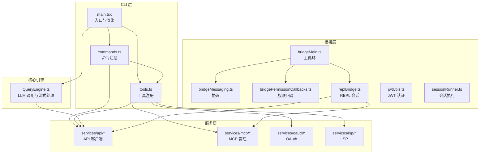
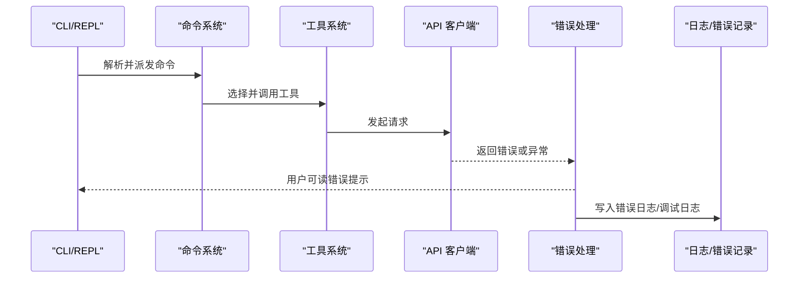
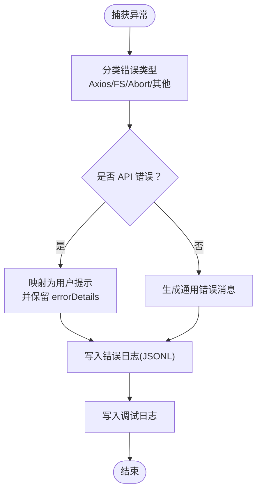
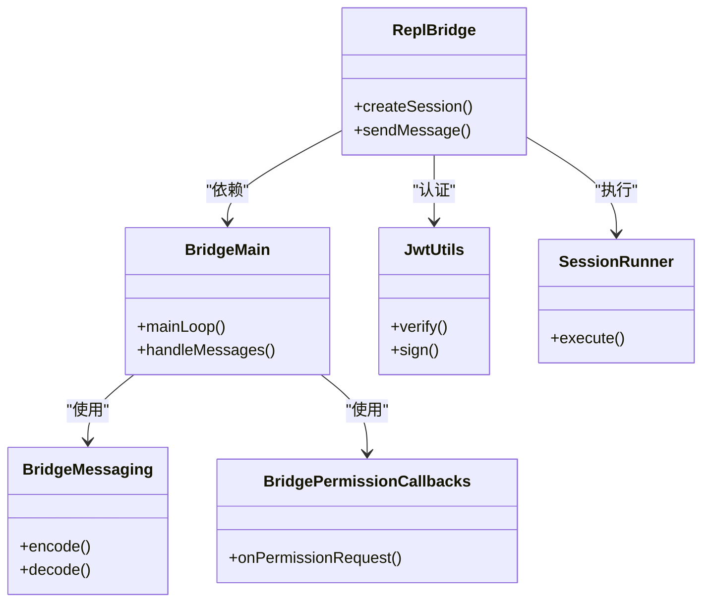
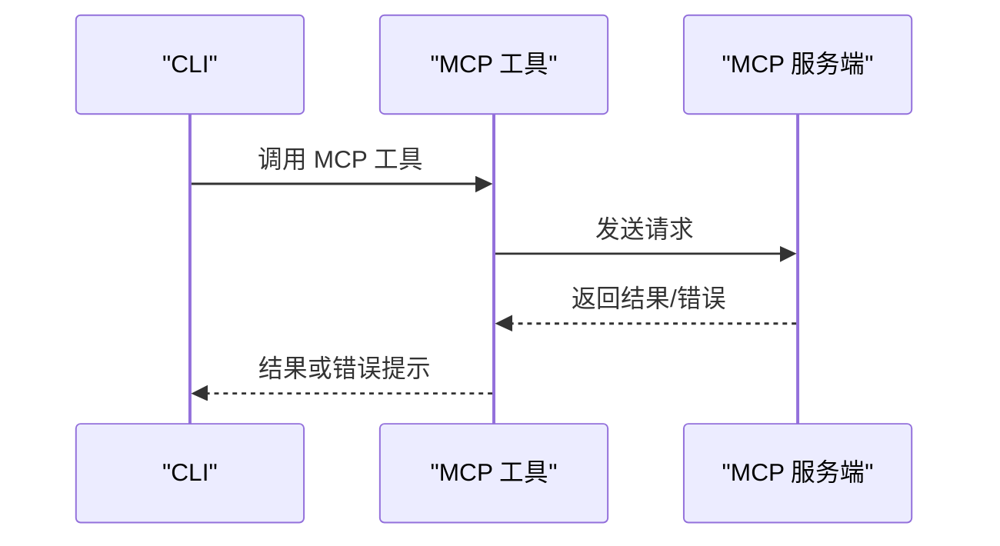
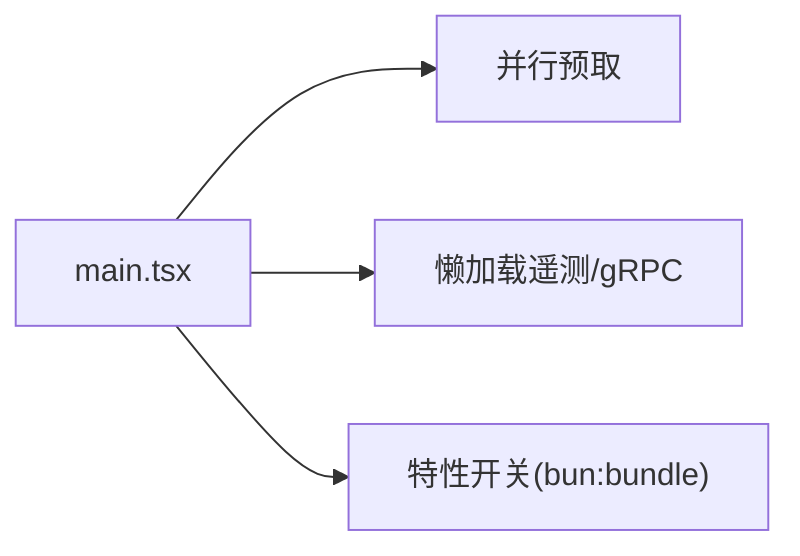

# 故障排除

<cite>
**本文引用的文件**
- [README.md](file://README.md)
- [CONTRIBUTING.md](file://CONTRIBUTING.md)
- [errorIds.ts](file://src/constants/errorIds.ts)
- [errors.ts](file://src/services/api/errors.ts)
- [errors.ts（工具）](file://src/utils/errors.ts)
- [errorLogSink.ts](file://src/utils/errorLogSink.ts)
- [debug.ts](file://src/utils/debug.ts)
- [debugUtils.ts](file://src/bridge/debugUtils.ts)
- [upstreamproxy.ts](file://src/upstreamproxy/upstreamproxy.ts)
- [proxy.ts](file://src/utils/proxy.ts)
- [performStartupChecks.tsx](file://src/utils/plugins/performStartupChecks.tsx)
- [perfettoTracing.ts](file://src/utils/telemetry/perfettoTracing.ts)
- [main.tsx](file://src/main.tsx)
- [commands.ts](file://src/commands.ts)
- [tools.ts](file://src/tools.ts)
- [QueryEngine.ts](file://src/QueryEngine.ts)
- [bridgeMain.ts](file://src/bridge/bridgeMain.ts)
- [bridgeMessaging.ts](file://src/bridge/bridgeMessaging.ts)
- [bridgePermissionCallbacks.ts](file://src/bridge/bridgePermissionCallbacks.ts)
- [replBridge.ts](file://src/bridge/replBridge.ts)
- [jwtUtils.ts](file://src/bridge/jwtUtils.ts)
- [sessionRunner.ts](file://src/bridge/sessionRunner.ts)
- [bridgeDebug.ts](file://src/bridge/bridgeDebug.ts)
- [bridgeStatusUtil.ts](file://src/bridge/bridgeStatusUtil.ts)
- [bridgeUI.ts](file://src/bridge/bridgeUI.ts)
- [capacityWake.ts](file://src/bridge/capacityWake.ts)
- [codeSessionApi.ts](file://src/bridge/codeSessionApi.ts)
- [createSession.ts](file://src/bridge/createSession.ts)
- [flushGate.ts](file://src/bridge/flushGate.ts)
- [inboundAttachments.ts](file://src/bridge/inboundAttachments.ts)
- [inboundMessages.ts](file://src/bridge/inboundMessages.ts)
- [initReplBridge.ts](file://src/bridge/initReplBridge.ts)
- [pollConfig.ts](file://src/bridge/pollConfig.ts)
- [pollConfigDefaults.ts](file://src/bridge/pollConfigDefaults.ts)
- [remoteBridgeCore.ts](file://src/bridge/remoteBridgeCore.ts)
- [replBridgeHandle.ts](file://src/bridge/replBridgeHandle.ts)
- [replBridgeTransport.ts](file://src/bridge/replBridgeTransport.ts)
- [sessionIdCompat.ts](file://src/bridge/sessionIdCompat.ts)
- [stub.ts](file://src/bridge/stub.ts)
- [trustedDevice.ts](file://src/bridge/trustedDevice.ts)
- [workSecret.ts](file://src/bridge/workSecret.ts)
- [types.ts](file://src/bridge/types.ts)
- [envLessBridgeConfig.ts](file://src/bridge/envLessBridgeConfig.ts)
- [bridgeConfig.ts](file://src/bridge/bridgeConfig.ts)
- [bridgeEnabled.ts](file://src/bridge/bridgeEnabled.ts)
- [bridgePointer.ts](file://src/bridge/bridgePointer.ts)
- [bridgeApi.ts](file://src/bridge/bridgeApi.ts)
- [bridgeMain.ts（服务端）](file://mcp-server/src/index.ts)
- [bridgeHttp.ts](file://mcp-server/src/http.ts)
- [bridgeServer.ts](file://mcp-server/src/server.ts)
- [bridgeVercelApp.ts](file://mcp-server/api/vercelApp.ts)
- [bridgeApi.ts（MCP）](file://mcp-server/api/index.ts)
</cite>

## 目录
1. [简介](#简介)
2. [项目结构](#项目结构)
3. [核心组件](#核心组件)
4. [架构总览](#架构总览)
5. [详细组件分析](#详细组件分析)
6. [依赖关系分析](#依赖关系分析)
7. [性能考量](#性能考量)
8. [故障排除指南](#故障排除指南)
9. [结论](#结论)
10. [附录](#附录)

## 简介
本指南面向使用 Claude Code 的用户与维护者，提供系统化的故障排除方法。内容覆盖安装与环境问题、运行时错误与 API 错误、性能问题诊断、网络连接排查（代理、防火墙、认证）、日志分析方法、以及预防性维护与健康检查清单。文档基于仓库中的源码与工具模块进行归纳总结，并给出可操作的排查流程与可视化图示。

## 项目结构
Claude Code 采用模块化架构：命令系统、工具系统、服务层、桥接层（IDE 集成）、权限与特性开关等。CLI 入口负责解析参数与渲染 UI；服务层封装外部集成（如 Anthropic API、MCP、OAuth 等）；桥接层负责 IDE 与 CLI 的双向通信；工具与命令模块实现具体能力。

图表来源
- [main.tsx](file://src/main.tsx)
- [commands.ts](file://src/commands.ts)
- [tools.ts](file://src/tools.ts)
- [QueryEngine.ts](file://src/QueryEngine.ts)
- [bridgeMain.ts](file://src/bridge/bridgeMain.ts)
- [bridgeMessaging.ts](file://src/bridge/bridgeMessaging.ts)
- [bridgePermissionCallbacks.ts](file://src/bridge/bridgePermissionCallbacks.ts)
- [replBridge.ts](file://src/bridge/replBridge.ts)
- [jwtUtils.ts](file://src/bridge/jwtUtils.ts)
- [sessionRunner.ts](file://src/bridge/sessionRunner.ts)

章节来源
- [README.md: 193-236:193-236](file://README.md#L193-L236)
- [README.md: 240-338:240-338](file://README.md#L240-L338)

## 核心组件
- 命令系统与工具系统：命令与工具均以模块化方式注册，便于扩展与权限控制。
- API 错误处理：统一解析与映射 API 返回的错误类型，生成用户可读提示与内部追踪信息。
- 日志与错误记录：调试日志、错误日志、MCP 日志分层输出，支持敏感信息脱敏与截断。
- 桥接层：IDE 与 CLI 的双向通信，含权限、会话、消息与传输层。
- 服务层：对外部服务（API、MCP、OAuth、LSP）的统一封装与错误分类。

章节来源
- [README.md: 277-312:277-312](file://README.md#L277-L312)
- [errors.ts](file://src/services/api/errors.ts)
- [errorLogSink.ts](file://src/utils/errorLogSink.ts)
- [debug.ts](file://src/utils/debug.ts)
- [bridgeMain.ts](file://src/bridge/bridgeMain.ts)

## 架构总览
下图展示从 CLI 到服务层与桥接层的关键交互路径，以及错误与日志的落盘位置。

图表来源
- [commands.ts](file://src/commands.ts)
- [tools.ts](file://src/tools.ts)
- [errors.ts](file://src/services/api/errors.ts)
- [errorLogSink.ts](file://src/utils/errorLogSink.ts)
- [debug.ts](file://src/utils/debug.ts)

## 详细组件分析

### 错误与日志子系统
- 错误 ID 与追踪：通过常量导出的错误 ID 用于生产环境追踪来源。
- API 错误映射：针对不同状态码与错误字符串，生成一致的用户提示与内部详情。
- 错误记录：将错误写入 JSONL 文件，包含时间戳、工作目录、会话 ID、版本号等上下文。
- 调试日志：支持级别过滤、文件输出、标准错误输出、最新日志链接等。
- 桥接层调试：对敏感字段脱敏、消息截断、HTTP 状态提取与错误详情抽取。

图表来源
- [errors.ts（工具）](file://src/utils/errors.ts)
- [errors.ts](file://src/services/api/errors.ts)
- [errorLogSink.ts](file://src/utils/errorLogSink.ts)
- [debug.ts](file://src/utils/debug.ts)
- [debugUtils.ts](file://src/bridge/debugUtils.ts)

章节来源
- [errorIds.ts](file://src/constants/errorIds.ts)
- [errors.ts](file://src/services/api/errors.ts)
- [errors.ts（工具）](file://src/utils/errors.ts)
- [errorLogSink.ts](file://src/utils/errorLogSink.ts)
- [debug.ts](file://src/utils/debug.ts)
- [debugUtils.ts](file://src/bridge/debugUtils.ts)

### 桥接层（IDE 集成）
- 主循环与消息协议：负责桥接主循环、消息编解码与权限回调。
- REPL 会话与传输：REPL 会话管理、传输层抽象、会话执行器。
- 权限与认证：权限回调、JWT 工具、信任设备与工作密钥。
- 状态与 UI：状态工具、UI 组件、容量唤醒等。

图表来源
- [bridgeMain.ts](file://src/bridge/bridgeMain.ts)
- [bridgeMessaging.ts](file://src/bridge/bridgeMessaging.ts)
- [bridgePermissionCallbacks.ts](file://src/bridge/bridgePermissionCallbacks.ts)
- [replBridge.ts](file://src/bridge/replBridge.ts)
- [jwtUtils.ts](file://src/bridge/jwtUtils.ts)
- [sessionRunner.ts](file://src/bridge/sessionRunner.ts)

章节来源
- [bridgeMain.ts](file://src/bridge/bridgeMain.ts)
- [bridgeMessaging.ts](file://src/bridge/bridgeMessaging.ts)
- [bridgePermissionCallbacks.ts](file://src/bridge/bridgePermissionCallbacks.ts)
- [replBridge.ts](file://src/bridge/replBridge.ts)
- [jwtUtils.ts](file://src/bridge/jwtUtils.ts)
- [sessionRunner.ts](file://src/bridge/sessionRunner.ts)

### MCP 服务器与客户端
- MCP 服务端：提供模型上下文协议服务，支持本地与 Vercel 部署。
- MCP 客户端：在工具与命令中使用，统一资源发现与调用。

图表来源
- [bridgeApi.ts（MCP）](file://mcp-server/api/index.ts)
- [bridgeVercelApp.ts](file://mcp-server/api/vercelApp.ts)
- [bridgeMain.ts（服务端）](file://mcp-server/src/index.ts)
- [bridgeHttp.ts](file://mcp-server/src/http.ts)
- [bridgeServer.ts](file://mcp-server/src/server.ts)

章节来源
- [README.md: 83-190:83-190](file://README.md#L83-L190)
- [bridgeApi.ts（MCP）](file://mcp-server/api/index.ts)
- [bridgeVercelApp.ts](file://mcp-server/api/vercelApp.ts)
- [bridgeMain.ts（服务端）](file://mcp-server/src/index.ts)
- [bridgeHttp.ts](file://mcp-server/src/http.ts)
- [bridgeServer.ts](file://mcp-server/src/server.ts)

## 依赖关系分析
- CLI 启动：并行预取 MDM、钥匙串与增长实验配置，降低启动延迟。
- 懒加载：仅在需要时动态导入遥测与 gRPC，减少冷启动体积。
- 特性开关：通过构建期特性标志按需裁剪死代码。

图表来源
- [README.md: 374-390:374-390](file://README.md#L374-L390)
- [README.md: 329-337:329-337](file://README.md#L329-L337)

章节来源
- [README.md: 370-412:370-412](file://README.md#L370-L412)

## 性能考量
- 启动与运行时优化：并行预取与懒加载策略已在入口处实现。
- 性能追踪：提供 Perfetto 追踪模块，可用于深入分析 CPU、I/O 与线程热点。
- 上游代理与网络：提供上游代理与通用代理工具，便于在受限网络环境中优化连接质量。
- 启动自检：提供启动阶段的健康检查插件，帮助识别潜在问题。

章节来源
- [README.md: 374-390:374-390](file://README.md#L374-L390)
- [perfettoTracing.ts](file://src/utils/telemetry/perfettoTracing.ts)
- [upstreamproxy.ts](file://src/upstreamproxy/upstreamproxy.ts)
- [proxy.ts](file://src/utils/proxy.ts)
- [performStartupChecks.tsx](file://src/utils/plugins/performStartupChecks.tsx)

## 故障排除指南

### 一、安装与环境问题
- 症状
  - 启动即崩溃或无法找到命令
  - 缺少依赖导致构建/运行失败
- 排查步骤
  - 确认 Node.js 版本满足 MCP 服务器要求
  - 清理缓存后重新安装依赖
  - 确认 CLI 可执行文件可用且路径正确
- 关联文件
  - [CONTRIBUTING.md: 24-51:24-51](file://CONTRIBUTING.md#L24-L51)
  - [README.md: 83-122:83-122](file://README.md#L83-L122)

章节来源
- [CONTRIBUTING.md: 24-51:24-51](file://CONTRIBUTING.md#L24-L51)
- [README.md: 83-122:83-122](file://README.md#L83-L122)

### 二、运行时错误与 API 错误
- 常见错误类型与含义
  - 提示过长（超过上下文限制）：触发自动压缩或提示用户精简输入
  - 媒体过大/尺寸超限：图片/PDF 超出最大页数或尺寸
  - 429 速率限制：统一映射为用户可读提示，必要时提供降级模型建议
  - 401/403 认证失败：提示登录或检查凭据
  - 请求过大（413）：提示减小文件或内容
  - 工具并发错误：tool_use 与 tool_result 不匹配，建议回滚重试
- 处理流程
  - 将原始错误映射为用户提示
  - 保留 errorDetails 以便自动压缩/降级
  - 记录到错误日志，包含时间戳、会话 ID、版本号
- 关联文件
  - [errors.ts](file://src/services/api/errors.ts)
  - [errorLogSink.ts](file://src/utils/errorLogSink.ts)

章节来源
- [errors.ts](file://src/services/api/errors.ts)
- [errorLogSink.ts](file://src/utils/errorLogSink.ts)

### 三、日志分析方法
- 日志级别与输出
  - 支持 verbose/debug/info/warn/error 级别过滤
  - 可输出至标准错误或文件，文件名包含会话 ID
  - 提供“最新日志”符号链接，便于快速定位
- 关键信息定位
  - 查找错误日志与 MCP 日志文件
  - 识别时间戳、会话 ID、版本号、工作目录
  - 对比调试日志中的上下文与堆栈
- 敏感信息处理
  - 自动脱敏敏感字段（如 token、secret）
  - 对超长消息进行截断，避免影响 JSONL 格式
- 关联文件
  - [debug.ts](file://src/utils/debug.ts)
  - [errorLogSink.ts](file://src/utils/errorLogSink.ts)
  - [debugUtils.ts](file://src/bridge/debugUtils.ts)

章节来源
- [debug.ts](file://src/utils/debug.ts)
- [errorLogSink.ts](file://src/utils/errorLogSink.ts)
- [debugUtils.ts](file://src/bridge/debugUtils.ts)

### 四、性能问题诊断
- 诊断工具
  - 启动阶段自检：检查关键依赖与配置
  - 性能追踪：启用 Perfetto 追踪，采集 CPU/线程/I/O 数据
- 优化建议
  - 并行预取与懒加载已内置，尽量避免重复初始化
  - 减少不必要的大文件/媒体输入，避免触发“过大”限制
  - 在受限网络中使用代理配置，提升连接稳定性
- 关联文件
  - [performStartupChecks.tsx](file://src/utils/plugins/performStartupChecks.tsx)
  - [perfettoTracing.ts](file://src/utils/telemetry/perfettoTracing.ts)
  - [upstreamproxy.ts](file://src/upstreamproxy/upstreamproxy.ts)
  - [proxy.ts](file://src/utils/proxy.ts)

章节来源
- [performStartupChecks.tsx](file://src/utils/plugins/performStartupChecks.tsx)
- [perfettoTracing.ts](file://src/utils/telemetry/perfettoTracing.ts)
- [upstreamproxy.ts](file://src/upstreamproxy/upstreamproxy.ts)
- [proxy.ts](file://src/utils/proxy.ts)

### 五、网络连接问题排查
- 代理配置
  - 使用通用代理工具与上游代理模块，确保网络连通性
- 防火墙与 DNS
  - 检查 403/401 等认证错误，确认凭据有效
  - 若出现连接被拒/不可达，检查本地防火墙与 DNS 设置
- 认证失败处理
  - 优先尝试重新登录或刷新令牌
  - 对于组织禁用或余额不足等场景，按提示调整账户或订阅
- 关联文件
  - [debugUtils.ts](file://src/bridge/debugUtils.ts)
  - [errors.ts（工具）](file://src/utils/errors.ts)
  - [proxy.ts](file://src/utils/proxy.ts)
  - [upstreamproxy.ts](file://src/upstreamproxy/upstreamproxy.ts)

章节来源
- [debugUtils.ts](file://src/bridge/debugUtils.ts)
- [errors.ts（工具）](file://src/utils/errors.ts)
- [proxy.ts](file://src/utils/proxy.ts)
- [upstreamproxy.ts](file://src/upstreamproxy/upstreamproxy.ts)

### 六、IDE 桥接问题
- 症状
  - 无法建立桥接会话、权限弹窗不出现、消息丢失
- 排查步骤
  - 检查桥接主循环与消息协议是否正常
  - 确认权限回调与 JWT 认证流程
  - 查看桥接调试日志与错误日志
- 关联文件
  - [bridgeMain.ts](file://src/bridge/bridgeMain.ts)
  - [bridgeMessaging.ts](file://src/bridge/bridgeMessaging.ts)
  - [bridgePermissionCallbacks.ts](file://src/bridge/bridgePermissionCallbacks.ts)
  - [jwtUtils.ts](file://src/bridge/jwtUtils.ts)
  - [sessionRunner.ts](file://src/bridge/sessionRunner.ts)
  - [errorLogSink.ts](file://src/utils/errorLogSink.ts)

章节来源
- [bridgeMain.ts](file://src/bridge/bridgeMain.ts)
- [bridgeMessaging.ts](file://src/bridge/bridgeMessaging.ts)
- [bridgePermissionCallbacks.ts](file://src/bridge/bridgePermissionCallbacks.ts)
- [jwtUtils.ts](file://src/bridge/jwtUtils.ts)
- [sessionRunner.ts](file://src/bridge/sessionRunner.ts)
- [errorLogSink.ts](file://src/utils/errorLogSink.ts)

### 七、社区支持与问题报告
- 获取帮助
  - 通过仓库说明与贡献指南了解支持渠道
  - 提交问题前先查看现有文档与常见问题
- 报告流程
  - 收集调试日志、错误日志、MCP 日志
  - 提供最小复现步骤、环境信息与期望行为
- 关联文件
  - [README.md: 435-447:435-447](file://README.md#L435-L447)
  - [CONTRIBUTING.md: 70-73:70-73](file://CONTRIBUTING.md#L70-L73)

章节来源
- [README.md: 435-447:435-447](file://README.md#L435-L447)
- [CONTRIBUTING.md: 70-73:70-73](file://CONTRIBUTING.md#L70-L73)

### 八、预防性维护与健康检查清单
- 定期检查
  - 更新 CLI 与依赖，保持版本一致
  - 清理过期日志与缓存，避免磁盘占用过高
  - 检查代理与网络配置，确保稳定连通
- 启动自检
  - 运行启动自检插件，识别潜在问题
- 关联文件
  - [performStartupChecks.tsx](file://src/utils/plugins/performStartupChecks.tsx)
  - [debug.ts](file://src/utils/debug.ts)
  - [errorLogSink.ts](file://src/utils/errorLogSink.ts)

章节来源
- [performStartupChecks.tsx](file://src/utils/plugins/performStartupChecks.tsx)
- [debug.ts](file://src/utils/debug.ts)
- [errorLogSink.ts](file://src/utils/errorLogSink.ts)

## 结论
本指南提供了从安装、运行、网络到性能与日志的全链路故障排除方法。通过统一的错误映射、分层日志与桥接调试工具，结合启动自检与性能追踪，可快速定位并解决问题。建议在日常使用中定期执行健康检查与日志清理，以维持系统稳定与高效。

## 附录
- 快速参考
  - 启动参数与调试：查看调试日志路径与级别设置
  - 错误日志：定位错误日志与 MCP 日志文件
  - 代理与网络：检查代理配置与认证状态
  - 性能：启用 Perfetto 追踪，关注 CPU/线程/I/O 热点