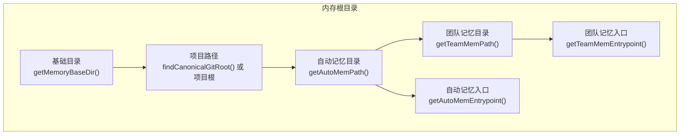
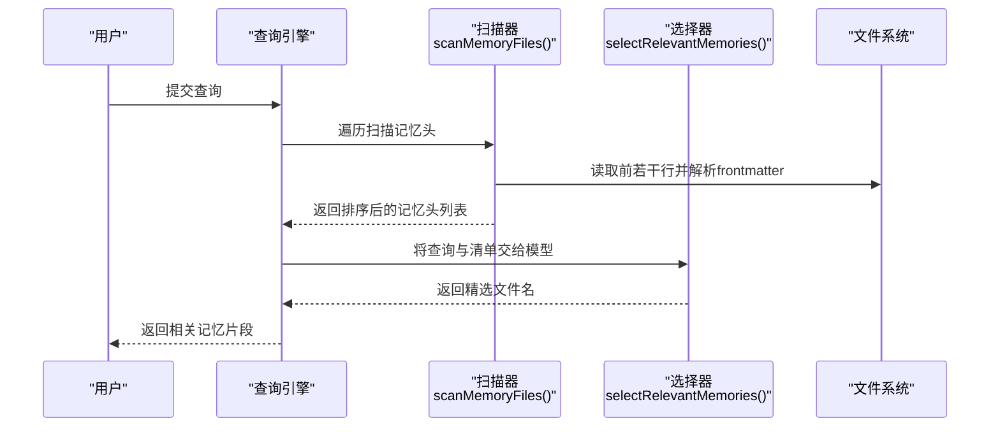
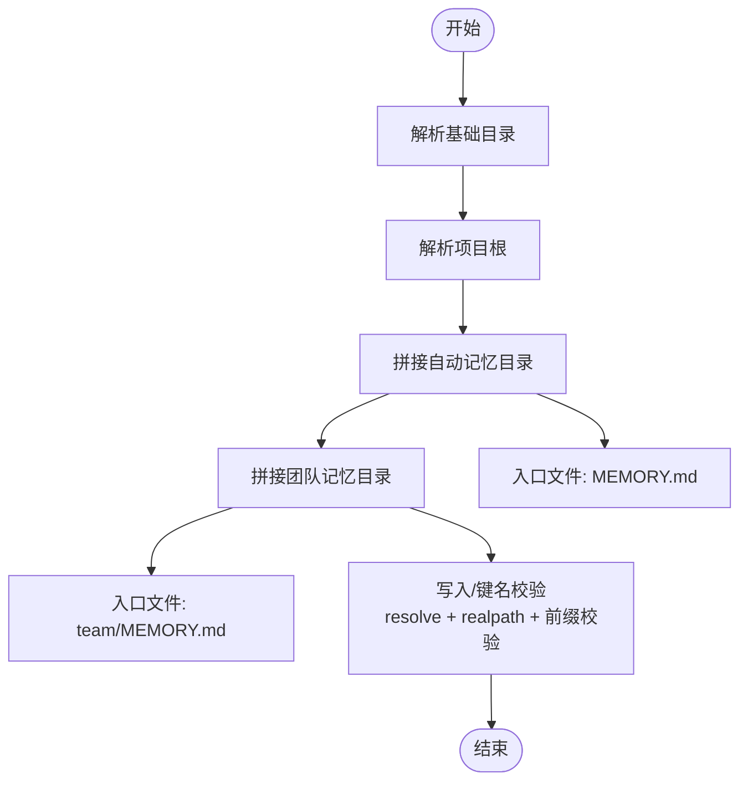
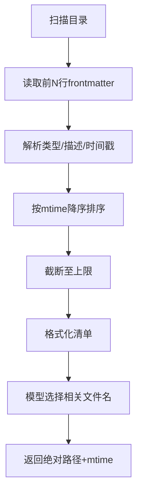
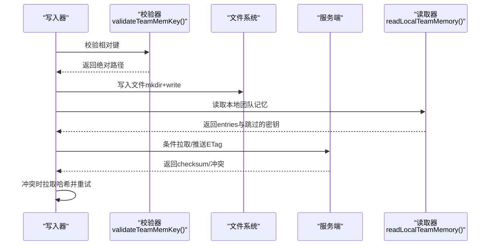
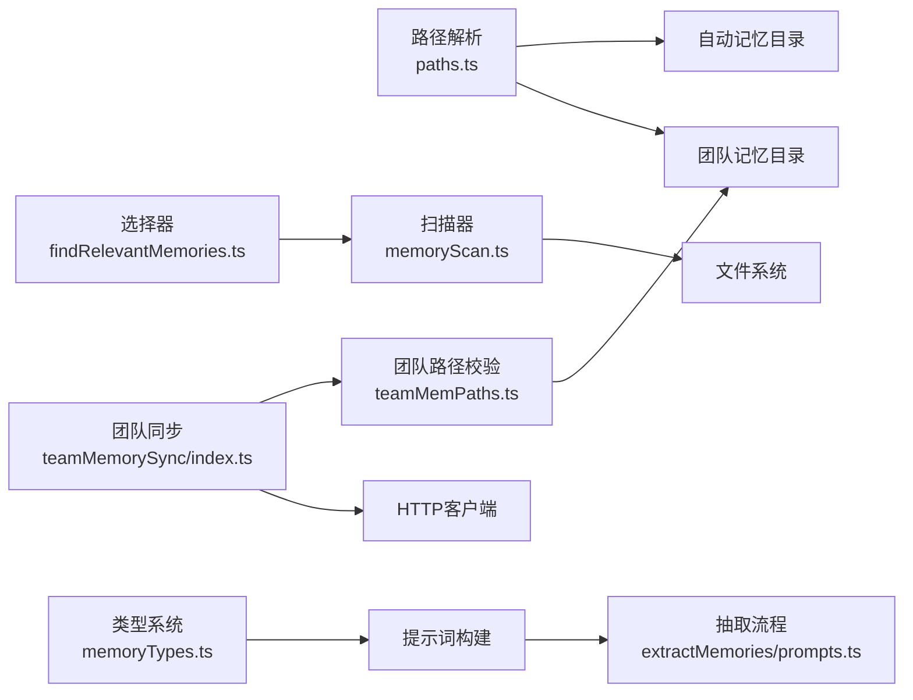

# 内存系统

<cite>
**本文引用的文件**
- [src/memdir/paths.ts](file://src/memdir/paths.ts)
- [src/memdir/teamMemPaths.ts](file://src/memdir/teamMemPaths.ts)
- [src/memdir/memoryTypes.ts](file://src/memdir/memoryTypes.ts)
- [src/memdir/memoryScan.ts](file://src/memdir/memoryScan.ts)
- [src/memdir/findRelevantMemories.ts](file://src/memdir/findRelevantMemories.ts)
- [src/memdir/memoryAge.ts](file://src/memdir/memoryAge.ts)
- [src/memdir/teamMemPrompts.ts](file://src/memdir/teamMemPrompts.ts)
- [src/services/extractMemories/prompts.ts](file://src/services/extractMemories/prompts.ts)
- [src/services/teamMemorySync/index.ts](file://src/services/teamMemorySync/index.ts)
- [src/services/settingsSync/index.ts](file://src/services/settingsSync/index.ts)
- [src/components/messages/teamMemSaved.ts](file://src/components/messages/teamMemSaved.ts)
</cite>

## 目录
1. [简介](#简介)
2. [项目结构](#项目结构)
3. [核心组件](#核心组件)
4. [架构总览](#架构总览)
5. [详细组件分析](#详细组件分析)
6. [依赖关系分析](#依赖关系分析)
7. [性能考量](#性能考量)
8. [故障排查指南](#故障排查指南)
9. [结论](#结论)
10. [附录](#附录)

## 简介
本文件系统性梳理 Claude Code 的内存系统：从目录结构（短期记忆、长期记忆与团队记忆）到扫描与召回机制，再到类型体系、权限控制与同步备份策略。文档旨在帮助开发者与使用者理解并正确使用内存系统，确保在多会话、跨设备与团队协作场景下稳定、安全且高性能地维护与检索记忆。

## 项目结构
内存系统围绕“自动记忆”（Auto Memory）与“团队记忆”（Team Memory）两大目录展开：
- 自动记忆（私有）：按项目隔离，路径由基础目录与项目根拼接而成，入口文件为 MEMORY.md；支持日志归档（按日切分）。
- 团队记忆（共享）：位于自动记忆目录之下，按项目隔离，入口文件为 team/MEMORY.md；支持与服务端同步，具备严格的路径校验与安全边界。

图表来源
- [src/memdir/paths.ts:223-235](file://src/memdir/paths.ts#L223-L235)
- [src/memdir/paths.ts:85-90](file://src/memdir/paths.ts#L85-L90)
- [src/memdir/paths.ts:203-205](file://src/memdir/paths.ts#L203-L205)
- [src/memdir/paths.ts:257-259](file://src/memdir/paths.ts#L257-L259)
- [src/memdir/teamMemPaths.ts:84-94](file://src/memdir/teamMemPaths.ts#L84-L94)

章节来源
- [src/memdir/paths.ts:223-235](file://src/memdir/paths.ts#L223-L235)
- [src/memdir/teamMemPaths.ts:84-94](file://src/memdir/teamMemPaths.ts#L84-L94)

## 核心组件
- 路径解析与安全边界
  - 自动记忆路径解析与校验，支持环境变量覆盖、设置项覆盖与项目根规范化。
  - 团队记忆路径解析与严格的安全校验（路径注入防护、符号链接检测、前缀攻击防护）。
- 类型系统与提示词
  - 统一的记忆类型（用户、反馈、项目、参考），以及针对组合模式（私有+团队）与独立模式（仅私有）的提示词构建。
- 扫描与相关性选择
  - 遍历扫描记忆文件头（frontmatter 解析、mtime 获取），生成清单并交由模型进行相关性选择。
- 年龄与新鲜度
  - 计算记忆年龄（天数/可读字符串），用于在检索结果中提示新鲜度。
- 同步与备份
  - 团队记忆与服务端同步（拉取/推送、ETag 条件请求、冲突处理、大小限制与条目上限）。
  - 设置与用户记忆的同步（settingsSync）。
- UI 展示
  - 在消息 UI 中展示团队记忆保存数量等统计信息。

章节来源
- [src/memdir/paths.ts:30-55](file://src/memdir/paths.ts#L30-L55)
- [src/memdir/teamMemPaths.ts:109-171](file://src/memdir/teamMemPaths.ts#L109-L171)
- [src/memdir/memoryTypes.ts:14-31](file://src/memdir/memoryTypes.ts#L14-L31)
- [src/memdir/memoryScan.ts:35-77](file://src/memdir/memoryScan.ts#L35-L77)
- [src/memdir/findRelevantMemories.ts:39-75](file://src/memdir/findRelevantMemories.ts#L39-L75)
- [src/memdir/memoryAge.ts:6-20](file://src/memdir/memoryAge.ts#L6-L20)
- [src/services/teamMemorySync/index.ts:188-410](file://src/services/teamMemorySync/index.ts#L188-L410)
- [src/services/settingsSync/index.ts:423-469](file://src/services/settingsSync/index.ts#L423-L469)
- [src/components/messages/teamMemSaved.ts:10-19](file://src/components/messages/teamMemSaved.ts#L10-L19)

## 架构总览
内存系统由“本地文件系统 + 模型辅助选择 + 可选服务端同步”构成。查询时先扫描本地记忆头，再通过模型选择最相关片段；写入时遵循统一 frontmatter 规范与类型约束，并在团队模式下进行路径安全校验与服务端同步。

图表来源
- [src/memdir/memoryScan.ts:35-77](file://src/memdir/memoryScan.ts#L35-L77)
- [src/memdir/findRelevantMemories.ts:77-141](file://src/memdir/findRelevantMemories.ts#L77-L141)

## 详细组件分析

### 目录与路径解析
- 自动记忆（私有）
  - 基础目录优先来自环境变量覆盖，否则使用配置主目录；项目路径优先使用 Git 仓库根，否则回退到工作目录。
  - 入口文件为 MEMORY.md；日志目录按年/月/日切分。
- 团队记忆（共享）
  - 位于自动记忆目录之下，入口文件为 team/MEMORY.md。
  - 写入与键名校验包含多层安全检查：相对键清洗、resolve 去除穿越、realpath 深度存在与符号链接检测、前缀攻击防护等。

图表来源
- [src/memdir/paths.ts:223-235](file://src/memdir/paths.ts#L223-L235)
- [src/memdir/teamMemPaths.ts:22-64](file://src/memdir/teamMemPaths.ts#L22-L64)
- [src/memdir/teamMemPaths.ts:109-171](file://src/memdir/teamMemPaths.ts#L109-L171)

章节来源
- [src/memdir/paths.ts:85-90](file://src/memdir/paths.ts#L85-L90)
- [src/memdir/paths.ts:203-205](file://src/memdir/paths.ts#L203-L205)
- [src/memdir/teamMemPaths.ts:84-94](file://src/memdir/teamMemPaths.ts#L84-L94)

### 内存类型系统与提示词
- 类型定义
  - 支持 user、feedback、project、reference 四类；类型解析对未知值降级为未定义，保证兼容旧文件。
- 提示词
  - 组合模式（私有+团队）：明确每种类型的“作用域”（私有/团队/两者皆可），并给出示例与何时保存/如何使用。
  - 独立模式（仅私有）：去除作用域标签，语言更简洁。
  - 明确禁止保存的内容（代码模式、历史、调试配方、CLAUDE.md 已有内容、临时任务细节等）。
  - 回忆使用注意事项：强调“先验证再应用”，避免过期记忆误导。

章节来源
- [src/memdir/memoryTypes.ts:14-31](file://src/memdir/memoryTypes.ts#L14-L31)
- [src/memdir/teamMemPrompts.ts:22-82](file://src/memdir/teamMemPrompts.ts#L22-L82)
- [src/services/extractMemories/prompts.ts:101-137](file://src/services/extractMemories/prompts.ts#L101-L137)

### 内存扫描与相关性选择
- 扫描
  - 递归遍历目录，过滤 .md 文件（排除入口文件），限定读取前若干行以解析 frontmatter，同时获取 mtime。
  - 结果按 mtime 降序，截断至最大文件数（防止 IO 放大）。
- 清单格式化
  - 输出“类型 标题（时间戳）：描述”的一行清单，供模型选择。
- 选择
  - 使用系统提示词引导模型挑选最相关文件名（最多 5 个），并考虑近期工具使用情况以减少噪声。
  - 失败时优雅降级为空集，支持信号中断。

图表来源
- [src/memdir/memoryScan.ts:35-94](file://src/memdir/memoryScan.ts#L35-L94)
- [src/memdir/findRelevantMemories.ts:39-75](file://src/memdir/findRelevantMemories.ts#L39-L75)

章节来源
- [src/memdir/memoryScan.ts:35-94](file://src/memdir/memoryScan.ts#L35-L94)
- [src/memdir/findRelevantMemories.ts:77-141](file://src/memdir/findRelevantMemories.ts#L77-L141)

### 新鲜度与年龄显示
- 计算距离当前的自然日数，提供“今天/昨天/N天前”的可读字符串，便于在 UI 中直观展示记忆新鲜度。

章节来源
- [src/memdir/memoryAge.ts:6-20](file://src/memdir/memoryAge.ts#L6-L20)

### 团队记忆同步（服务端）
- 同步语义
  - 拉取：服务端覆盖本地（服务端获胜）。
  - 推送：基于内容哈希差量上传（upsert），删除不传播。
- 安全与容量
  - 写入前对每个键进行路径清洗与校验，拒绝越界与符号链接逃逸。
  - 单文件大小上限与批量体积极限，避免网关/服务端拒绝。
  - 学习服务器返回的条目上限后进行截断，避免一次性 413。
- 冲突处理
  - ETag 条件请求；412 冲突时拉取哈希清单，重新计算差量并重试。
- 日志与可观测性
  - 详细的调试日志与事件上报，便于定位问题。

图表来源
- [src/services/teamMemorySync/index.ts:188-410](file://src/services/teamMemorySync/index.ts#L188-L410)
- [src/services/teamMemorySync/index.ts:556-755](file://src/services/teamMemorySync/index.ts#L556-L755)
- [src/memdir/teamMemPaths.ts:265-284](file://src/memdir/teamMemPaths.ts#L265-L284)

章节来源
- [src/services/teamMemorySync/index.ts:188-410](file://src/services/teamMemorySync/index.ts#L188-L410)
- [src/services/teamMemorySync/index.ts:556-755](file://src/services/teamMemorySync/index.ts#L556-L755)
- [src/memdir/teamMemPaths.ts:265-284](file://src/memdir/teamMemPaths.ts#L265-L284)

### 设置与用户记忆同步
- 同步范围
  - 用户全局设置与用户记忆、项目本地设置与项目本地记忆（当存在项目 ID 时）。
- 写入策略
  - 读取目标文件内容，若存在则写入对应键位；父目录不存在则自动创建。

章节来源
- [src/services/settingsSync/index.ts:423-469](file://src/services/settingsSync/index.ts#L423-L469)

### UI 展示（团队记忆保存计数）
- 当启用团队记忆功能时，系统可在消息 UI 中展示本次会话保存的团队记忆数量，便于用户感知。

章节来源
- [src/components/messages/teamMemSaved.ts:10-19](file://src/components/messages/teamMemSaved.ts#L10-L19)

## 依赖关系分析
- 路径模块
  - 自动记忆路径依赖项目根解析与配置主目录；团队记忆路径依赖自动记忆路径。
- 扫描与选择
  - 扫描依赖文件系统读取与 frontmatter 解析；选择依赖模型侧查询与 JSON Schema 输出。
- 同步
  - 团队记忆同步依赖 OAuth 凭据、HTTP 客户端、错误分类与重试策略；写入依赖路径校验模块。
- 类型与提示词
  - 类型解析与提示词构建相互独立，但共同指导写入规范与抽取流程。

图表来源
- [src/memdir/paths.ts:223-235](file://src/memdir/paths.ts#L223-L235)
- [src/memdir/teamMemPaths.ts:84-94](file://src/memdir/teamMemPaths.ts#L84-L94)
- [src/memdir/memoryScan.ts:35-77](file://src/memdir/memoryScan.ts#L35-L77)
- [src/memdir/findRelevantMemories.ts:39-75](file://src/memdir/findRelevantMemories.ts#L39-L75)
- [src/services/teamMemorySync/index.ts:188-410](file://src/services/teamMemorySync/index.ts#L188-L410)
- [src/services/extractMemories/prompts.ts:101-137](file://src/services/extractMemories/prompts.ts#L101-L137)

## 性能考量
- 扫描阶段
  - 单次遍历内完成 stat 与解析，避免双轮 stat；对常见小规模集合（≤200）显著降低系统调用次数。
  - 限定最大文件数与 frontmatter 最大行数，控制 IO 与内存占用。
- 选择阶段
  - 限制返回文件数（最多 5），并结合近期工具列表过滤噪声，提升命中质量与响应速度。
- 同步阶段
  - 条件请求（ETag）与哈希差量上传，减少带宽与服务端压力。
  - 批量按字节上限拆分，避免网关拒绝；学习服务器条目上限后进行截断，避免一次性失败。
- 缓存与复用
  - 自动记忆路径解析结果按项目根缓存，减少重复解析成本。

章节来源
- [src/memdir/memoryScan.ts:35-77](file://src/memdir/memoryScan.ts#L35-L77)
- [src/memdir/findRelevantMemories.ts:77-141](file://src/memdir/findRelevantMemories.ts#L77-L141)
- [src/services/teamMemorySync/index.ts:426-460](file://src/services/teamMemorySync/index.ts#L426-L460)
- [src/memdir/paths.ts:223-235](file://src/memdir/paths.ts#L223-L235)

## 故障排查指南
- 路径校验失败
  - 症状：写入或键名校验抛出路径穿越/符号链接/空字节等错误。
  - 排查：确认相对键是否包含 ..、/、\、%xx 等；检查是否存在悬空链接或循环链接；核对团队目录真实路径。
- 同步失败
  - 症状：拉取/推送返回 304/404/412/413/超时/网络错误。
  - 排查：确认 OAuth 凭据有效且具备必要作用域；检查网络连通性；查看服务端返回的条目上限与冲突原因；必要时禁用 ETag 缓存强制拉取。
- 选择失败
  - 症状：模型选择返回空或解析失败。
  - 排查：检查输入清单格式与长度；确认模型输出 JSON Schema 匹配；关注中断信号导致的降级行为。
- 新鲜度与过期
  - 症状：回忆内容与当前状态不符。
  - 排查：优先以当前文件与 git 为准；根据记忆年龄判断是否需要更新。

章节来源
- [src/memdir/teamMemPaths.ts:109-171](file://src/memdir/teamMemPaths.ts#L109-L171)
- [src/services/teamMemorySync/index.ts:188-410](file://src/services/teamMemorySync/index.ts#L188-L410)
- [src/memdir/findRelevantMemories.ts:131-141](file://src/memdir/findRelevantMemories.ts#L131-L141)

## 结论
该内存系统以“文件 + 前缀 + 类型 + 提示词”为核心，结合模型选择与可选服务端同步，实现了跨会话、跨设备与团队共享的持久化上下文能力。其设计在安全性（路径校验、符号链接检测）、性能（单轮扫描、条件请求、差量上传）与可用性（类型约束、新鲜度提示、提示词引导）之间取得平衡。建议在团队模式下严格遵守类型与作用域规则，定期清理过期记忆，并利用同步功能保障一致性与可恢复性。

## 附录
- 写入规范
  - 使用统一 frontmatter（name、description、type），内容结构化（规则 + Why + How to apply 对于 feedback/project）。
  - 优先保存“非可从当前项目状态派生”的信息；避免保存代码模式、历史、调试配方与临时任务细节。
- 导入导出与备份
  - 自动记忆：直接复制自动记忆目录即可备份；恢复时注意路径解析与项目根一致性。
  - 团队记忆：通过服务端同步进行备份与恢复；本地可作为增量来源参与下一次推送。
  - 设置与用户记忆：通过 settingsSync 进行跨设备同步，亦可手动备份相应文件。

章节来源
- [src/memdir/memoryTypes.ts:261-271](file://src/memdir/memoryTypes.ts#L261-L271)
- [src/services/teamMemorySync/index.ts:556-755](file://src/services/teamMemorySync/index.ts#L556-L755)
- [src/services/settingsSync/index.ts:423-469](file://src/services/settingsSync/index.ts#L423-L469)