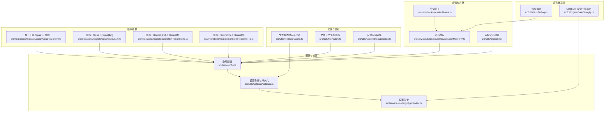
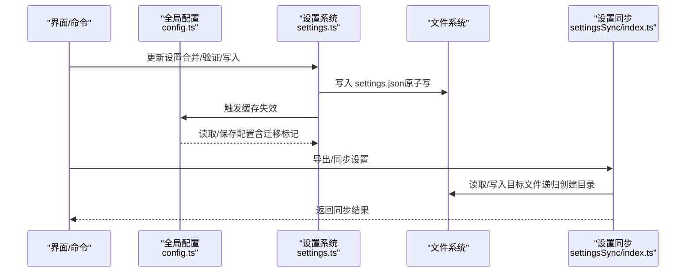
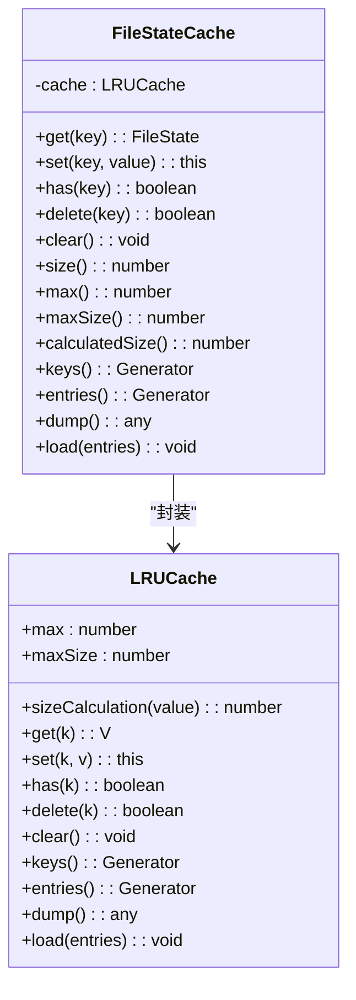
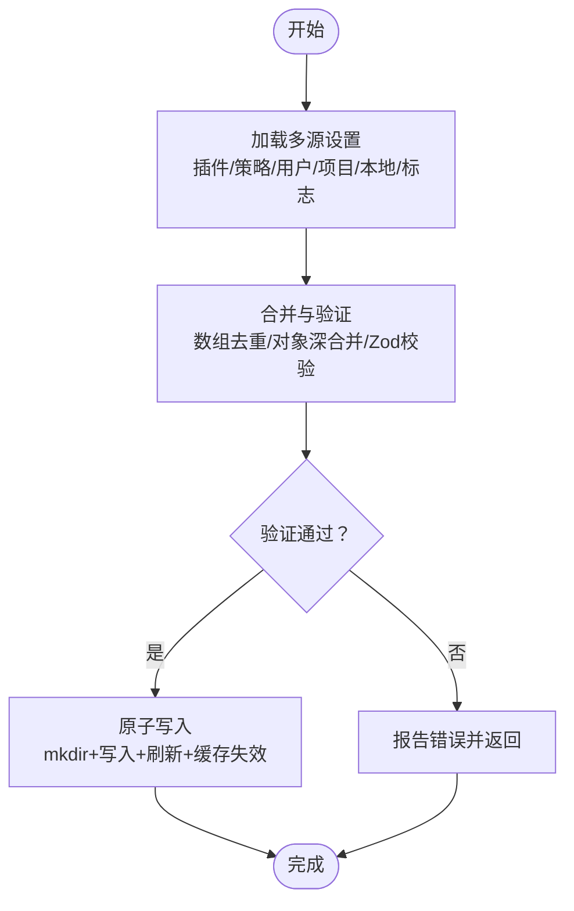
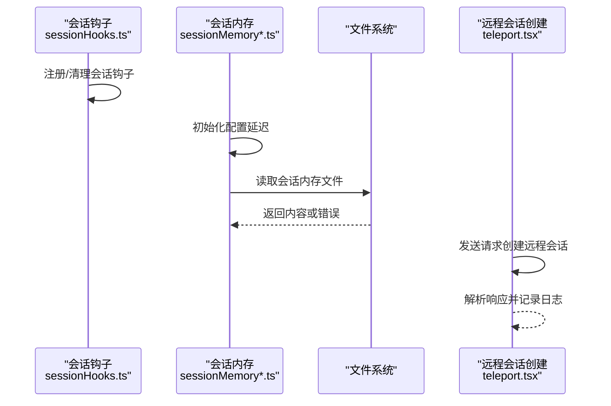
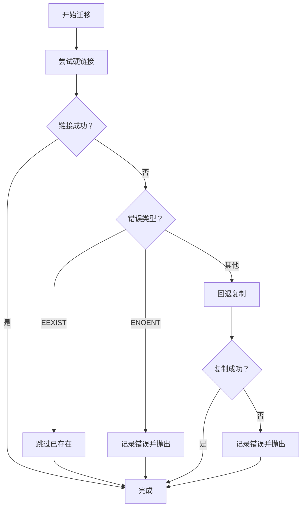
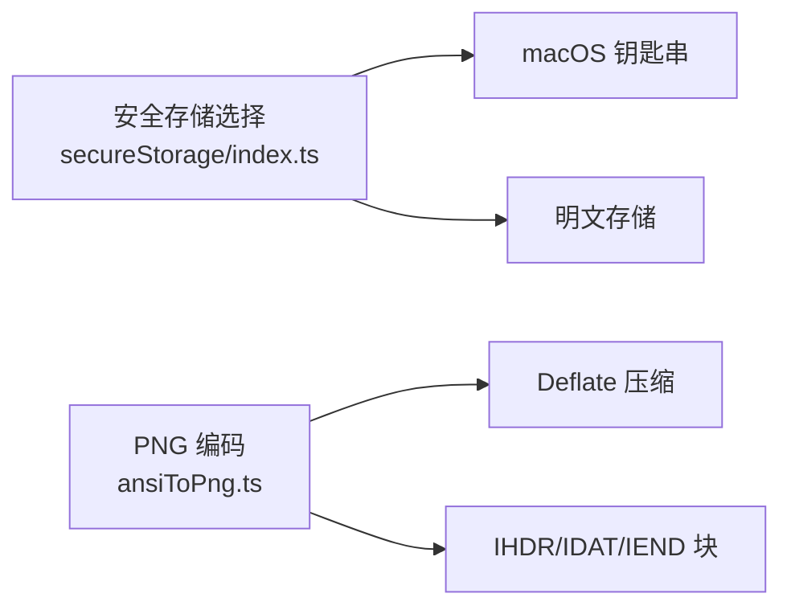
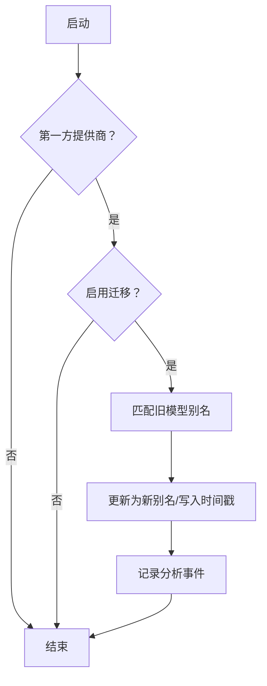
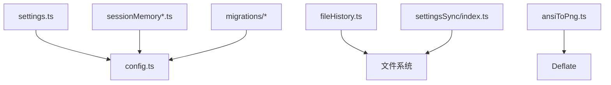

# 序列化与持久化

<cite>
**本文引用的文件**
- [src/utils/fileStateCache.ts](file://src/utils/fileStateCache.ts)
- [src/utils/config.ts](file://src/utils/config.ts)
- [src/utils/settings/settings.ts](file://src/utils/settings/settings.ts)
- [src/services/SessionMemory/sessionMemory.ts](file://src/services/SessionMemory/sessionMemory.ts)
- [src/services/SessionMemory/sessionMemoryUtils.ts](file://src/services/SessionMemory/sessionMemoryUtils.ts)
- [src/utils/fileHistory.ts](file://src/utils/fileHistory.ts)
- [src/utils/secureStorage/index.ts](file://src/utils/secureStorage/index.ts)
- [src/utils/ansiToPng.ts](file://src/utils/ansiToPng.ts)
- [src/migrations/migrateLegacyOpusToCurrent.ts](file://src/migrations/migrateLegacyOpusToCurrent.ts)
- [src/migrations/migrateOpusToOpus1m.ts](file://src/migrations/migrateOpusToOpus1m.ts)
- [src/migrations/migrateSonnet1mToSonnet45.ts](file://src/migrations/migrateSonnet1mToSonnet45.ts)
- [src/migrations/migrateSonnet45ToSonnet46.ts](file://src/migrations/migrateSonnet45ToSonnet46.ts)
- [src/services/settingsSync/index.ts](file://src/services/settingsSync/index.ts)
- [src/utils/hooks/sessionHooks.ts](file://src/utils/hooks/sessionHooks.ts)
- [src/utils/teleport.tsx](file://src/utils/teleport.tsx)
</cite>

## 目录
1. [简介](#简介)
2. [项目结构](#项目结构)
3. [核心组件](#核心组件)
4. [架构总览](#架构总览)
5. [详细组件分析](#详细组件分析)
6. [依赖关系分析](#依赖关系分析)
7. [性能考量](#性能考量)
8. [故障排查指南](#故障排查指南)
9. [结论](#结论)
10. [附录](#附录)

## 简介
本文件聚焦 Claude Code 的“序列化与持久化”体系，覆盖以下主题：
- 数据序列化：JSON 序列化、二进制格式（PNG 编码）、压缩算法（Deflate）与 NDJSON 安全字符串化
- 文件持久化策略：本地文件存储、缓存管理（LRU）、临时文件与备份迁移
- 会话存储系统：会话钩子、会话内存（Session Memory）与远程会话创建
- 数据版本控制：模型别名迁移、全局配置迁移标记与幂等写入
- 最佳实践：数据完整性校验、并发写入保护、性能优化与跨平台兼容

## 项目结构
围绕序列化与持久化的相关模块分布如下：
- 配置与设置：全局配置、项目/本地设置、策略设置与合并逻辑
- 会话与内存：会话钩子、会话内存读取与配置、远程会话创建
- 文件与缓存：文件状态缓存（LRU）、文件历史备份迁移、安全存储
- 版本迁移：模型别名迁移脚本、全局配置迁移标记
- 序列化工具：PNG 编码、NDJSON 安全字符串化

**图表来源**
- [src/utils/config.ts](file://src/utils/config.ts)
- [src/utils/settings/settings.ts](file://src/utils/settings/settings.ts)
- [src/services/settingsSync/index.ts](file://src/services/settingsSync/index.ts)
- [src/utils/hooks/sessionHooks.ts](file://src/utils/hooks/sessionHooks.ts)
- [src/services/SessionMemory/sessionMemory.ts](file://src/services/SessionMemory/sessionMemory.ts)
- [src/services/SessionMemory/sessionMemoryUtils.ts](file://src/services/SessionMemory/sessionMemoryUtils.ts)
- [src/utils/fileStateCache.ts](file://src/utils/fileStateCache.ts)
- [src/utils/fileHistory.ts](file://src/utils/fileHistory.ts)
- [src/utils/secureStorage/index.ts](file://src/utils/secureStorage/index.ts)
- [src/utils/ansiToPng.ts](file://src/utils/ansiToPng.ts)
- [src/migrations/migrateLegacyOpusToCurrent.ts](file://src/migrations/migrateLegacyOpusToCurrent.ts)
- [src/migrations/migrateOpusToOpus1m.ts](file://src/migrations/migrateOpusToOpus1m.ts)
- [src/migrations/migrateSonnet1mToSonnet45.ts](file://src/migrations/migrateSonnet1mToSonnet45.ts)
- [src/migrations/migrateSonnet45ToSonnet46.ts](file://src/migrations/migrateSonnet45ToSonnet46.ts)
- [src/utils/teleport.tsx](file://src/utils/teleport.tsx)

**章节来源**
- [src/utils/config.ts](file://src/utils/config.ts)
- [src/utils/settings/settings.ts](file://src/utils/settings/settings.ts)
- [src/services/SessionMemory/sessionMemory.ts](file://src/services/SessionMemory/sessionMemory.ts)
- [src/services/SessionMemory/sessionMemoryUtils.ts](file://src/services/SessionMemory/sessionMemoryUtils.ts)
- [src/utils/fileStateCache.ts](file://src/utils/fileStateCache.ts)
- [src/utils/fileHistory.ts](file://src/utils/fileHistory.ts)
- [src/utils/secureStorage/index.ts](file://src/utils/secureStorage/index.ts)
- [src/utils/ansiToPng.ts](file://src/utils/ansiToPng.ts)
- [src/migrations/migrateLegacyOpusToCurrent.ts](file://src/migrations/migrateLegacyOpusToCurrent.ts)
- [src/migrations/migrateOpusToOpus1m.ts](file://src/migrations/migrateOpusToOpus1m.ts)
- [src/migrations/migrateSonnet1mToSonnet45.ts](file://src/migrations/migrateSonnet1mToSonnet45.ts)
- [src/migrations/migrateSonnet45ToSonnet46.ts](file://src/migrations/migrateSonnet45ToSonnet46.ts)
- [src/services/settingsSync/index.ts](file://src/services/settingsSync/index.ts)
- [src/utils/hooks/sessionHooks.ts](file://src/utils/hooks/sessionHooks.ts)
- [src/utils/teleport.tsx](file://src/utils/teleport.tsx)

## 核心组件
- 文件状态缓存（FileStateCache）
  - 基于 lru-cache，按内容字节长度计算大小，支持 dump/load 进行序列化与恢复
  - 提供克隆、合并、键值遍历等工具函数
- 全局配置（GlobalConfig）
  - 存储用户偏好、通知开关、终端行为、迁移时间戳等；提供保存与读取、完整性保护
- 设置系统（Settings）
  - 多源合并（用户、项目、本地、策略、标志），JSON 解析与验证，原子写入与缓存失效
- 会话内存（Session Memory）
  - 按动态配置阈值增量更新，延迟初始化并记录事件指标
- 文件历史备份迁移（FileHistory）
  - 通过硬链接或复制迁移备份文件，错误回退与日志记录
- 安全存储（SecureStorage）
  - 平台适配：macOS 使用钥匙串后备，其他平台使用明文存储
- PNG 编码（ansiToPng）
  - 自定义最小 PNG 编码器（IHDR/IDAT/IEND），使用 Deflate 压缩
- 远程会话创建（teleport）
  - 发送请求并解析响应为会话资源，记录调试与错误日志

**章节来源**
- [src/utils/fileStateCache.ts](file://src/utils/fileStateCache.ts)
- [src/utils/config.ts](file://src/utils/config.ts)
- [src/utils/settings/settings.ts](file://src/utils/settings/settings.ts)
- [src/services/SessionMemory/sessionMemory.ts](file://src/services/SessionMemory/sessionMemory.ts)
- [src/services/SessionMemory/sessionMemoryUtils.ts](file://src/services/SessionMemory/sessionMemoryUtils.ts)
- [src/utils/fileHistory.ts](file://src/utils/fileHistory.ts)
- [src/utils/secureStorage/index.ts](file://src/utils/secureStorage/index.ts)
- [src/utils/ansiToPng.ts](file://src/utils/ansiToPng.ts)
- [src/utils/teleport.tsx](file://src/utils/teleport.tsx)

## 架构总览
序列化与持久化在系统中的交互路径如下：

**图表来源**
- [src/utils/config.ts](file://src/utils/config.ts)
- [src/utils/settings/settings.ts](file://src/utils/settings/settings.ts)
- [src/services/settingsSync/index.ts](file://src/services/settingsSync/index.ts)

## 详细组件分析

### 文件状态缓存（FileStateCache）
- 设计要点
  - 路径标准化（normalize）避免相对/绝对差异导致的缓存不命中
  - LRU 淘汰：基于条目数量与内容字节长度双重限制
  - 支持 dump/load 以 JSON 序列化缓存状态，便于持久化与恢复
  - 工具函数：克隆、合并、键集合导出
- 性能特性
  - 时间复杂度：get/set/has/delete 近似 O(1)，keys/entries 生成器惰性遍历
  - 空间复杂度：受 maxEntries 与 maxSizeBytes 控制
- 使用场景
  - 大文本/笔记本/可编辑内容的只读缓存，避免重复 IO
  - 与其他缓存合并时按时间戳覆盖新值

**图表来源**
- [src/utils/fileStateCache.ts](file://src/utils/fileStateCache.ts)

**章节来源**
- [src/utils/fileStateCache.ts](file://src/utils/fileStateCache.ts)

### 全局配置（GlobalConfig）与设置系统（Settings）
- 全局配置
  - 包含主题、通知、终端行为、迁移时间戳、统计缓存等字段
  - 保存时进行完整性检查，防止写入导致认证/引导状态丢失
- 设置系统
  - 多源优先级：插件基础 < 策略（远程/HKLM/文件/HKCU）< 用户/项目/本地/标志
  - 合并与验证：数组去重合并、对象深合并、Zod 校验与错误收集
  - 原子写入：mkdir + 写入 + 刷新 + 缓存失效
  - 管理设置文件：managed-settings.json 及 drop-in 目录，按字母序合并
- 设置同步
  - 读取用户设置、用户记忆、项目设置/记忆（若存在项目 ID）
  - 写入时确保父目录存在，失败回退并记录错误

**图表来源**
- [src/utils/settings/settings.ts](file://src/utils/settings/settings.ts)
- [src/services/settingsSync/index.ts](file://src/services/settingsSync/index.ts)

**章节来源**
- [src/utils/config.ts](file://src/utils/config.ts)
- [src/utils/settings/settings.ts](file://src/utils/settings/settings.ts)
- [src/services/settingsSync/index.ts](file://src/services/settingsSync/index.ts)

### 会话存储与会话内存
- 会话钩子
  - 为特定会话注册/清理钩子，用于生命周期管理与调试日志
- 会话内存
  - 动态配置：最小消息令牌数、更新间隔、工具调用间隔
  - 延迟初始化：仅在需要时加载远程配置并设置缓存值
  - 读取：异步读取内存文件，记录事件指标，异常时区分不可访问与抛错
- 远程会话创建
  - 发送 POST 请求，解析响应为会话资源，记录成功/失败与错误日志

**图表来源**
- [src/utils/hooks/sessionHooks.ts](file://src/utils/hooks/sessionHooks.ts)
- [src/services/SessionMemory/sessionMemory.ts](file://src/services/SessionMemory/sessionMemory.ts)
- [src/services/SessionMemory/sessionMemoryUtils.ts](file://src/services/SessionMemory/sessionMemoryUtils.ts)
- [src/utils/teleport.tsx](file://src/utils/teleport.tsx)

**章节来源**
- [src/utils/hooks/sessionHooks.ts](file://src/utils/hooks/sessionHooks.ts)
- [src/services/SessionMemory/sessionMemory.ts](file://src/services/SessionMemory/sessionMemory.ts)
- [src/services/SessionMemory/sessionMemoryUtils.ts](file://src/services/SessionMemory/sessionMemoryUtils.ts)
- [src/utils/teleport.tsx](file://src/utils/teleport.tsx)

### 文件历史备份迁移
- 目标
  - 在会话切换或恢复时，将上一会话的备份文件迁移到新位置
- 流程
  - 尝试硬链接（高效），失败则回退到复制
  - 对不存在/已存在等错误进行分类处理与日志记录
- 错误处理
  - EEXIST：跳过已迁移项
  - ENOENT：记录错误并抛出
  - 其他：记录错误并尝试复制

**图表来源**
- [src/utils/fileHistory.ts](file://src/utils/fileHistory.ts)

**章节来源**
- [src/utils/fileHistory.ts](file://src/utils/fileHistory.ts)

### 安全存储与序列化工具
- 安全存储
  - macOS：钥匙串后备 + 明文存储
  - 其他平台：明文存储
- PNG 编码
  - 生成 IHDR/IDAT/IEND 块，每行无滤波，单 IDAT 块
  - 使用 Deflate 压缩像素数据
- NDJSON 安全字符串化
  - CLI 层对输出进行安全字符串化，避免非安全字符导致解析问题

**图表来源**
- [src/utils/secureStorage/index.ts](file://src/utils/secureStorage/index.ts)
- [src/utils/ansiToPng.ts](file://src/utils/ansiToPng.ts)

**章节来源**
- [src/utils/secureStorage/index.ts](file://src/utils/secureStorage/index.ts)
- [src/utils/ansiToPng.ts](file://src/utils/ansiToPng.ts)

### 数据版本控制与迁移策略
- 迁移目标
  - 模型别名从旧版本平滑过渡至当前版本，保留用户设置一致性
- 迁移策略
  - 幂等写入：仅当匹配条件时才更新，避免重复迁移
  - 记录时间戳/完成标记：用于一次性提示与后续判断
  - 仅影响用户设置源，避免污染项目/本地/策略设置
- 迁移示例
  - 旧版 Opus 别名迁移至当前
  - Opus 合并至 Opus[1m]
  - Sonnet[1m] 固定到 Sonnet 4.5
  - Sonnet 4.5 迁移至 Sonnet 4.6（按订阅等级）

**图表来源**
- [src/migrations/migrateLegacyOpusToCurrent.ts](file://src/migrations/migrateLegacyOpusToCurrent.ts)
- [src/migrations/migrateOpusToOpus1m.ts](file://src/migrations/migrateOpusToOpus1m.ts)
- [src/migrations/migrateSonnet1mToSonnet45.ts](file://src/migrations/migrateSonnet1mToSonnet45.ts)
- [src/migrations/migrateSonnet45ToSonnet46.ts](file://src/migrations/migrateSonnet45ToSonnet46.ts)

**章节来源**
- [src/migrations/migrateLegacyOpusToCurrent.ts](file://src/migrations/migrateLegacyOpusToCurrent.ts)
- [src/migrations/migrateOpusToOpus1m.ts](file://src/migrations/migrateOpusToOpus1m.ts)
- [src/migrations/migrateSonnet1mToSonnet45.ts](file://src/migrations/migrateSonnet1mToSonnet45.ts)
- [src/migrations/migrateSonnet45ToSonnet46.ts](file://src/migrations/migrateSonnet45ToSonnet46.ts)

## 依赖关系分析
- 组件耦合
  - 设置系统与全局配置紧密耦合：设置变更触发配置缓存失效与写入
  - 会话内存依赖动态配置缓存，延迟初始化避免阻塞
  - 文件历史迁移依赖文件系统操作与错误码判定
- 外部依赖
  - lru-cache：LRU 缓存实现
  - Zod：设置模式校验
  - Deflate：PNG 压缩
- 循环依赖
  - 未发现直接循环依赖；模块职责清晰，通过工具函数解耦

**图表来源**
- [src/utils/settings/settings.ts](file://src/utils/settings/settings.ts)
- [src/utils/config.ts](file://src/utils/config.ts)
- [src/services/SessionMemory/sessionMemory.ts](file://src/services/SessionMemory/sessionMemory.ts)
- [src/utils/fileHistory.ts](file://src/utils/fileHistory.ts)
- [src/utils/ansiToPng.ts](file://src/utils/ansiToPng.ts)
- [src/migrations/migrateLegacyOpusToCurrent.ts](file://src/migrations/migrateLegacyOpusToCurrent.ts)
- [src/services/settingsSync/index.ts](file://src/services/settingsSync/index.ts)

**章节来源**
- [src/utils/settings/settings.ts](file://src/utils/settings/settings.ts)
- [src/utils/config.ts](file://src/utils/config.ts)
- [src/services/SessionMemory/sessionMemory.ts](file://src/services/SessionMemory/sessionMemory.ts)
- [src/utils/fileHistory.ts](file://src/utils/fileHistory.ts)
- [src/utils/ansiToPng.ts](file://src/utils/ansiToPng.ts)
- [src/migrations/migrateLegacyOpusToCurrent.ts](file://src/migrations/migrateLegacyOpusToCurrent.ts)
- [src/services/settingsSync/index.ts](file://src/services/settingsSync/index.ts)

## 性能考量
- 缓存策略
  - FileStateCache 使用字节长度作为 sizeCalculation，避免大文件导致内存膨胀
  - dump/load 支持快速序列化与恢复，适合进程重启后的状态重建
- 写入优化
  - 设置写入采用 mkdir + 写入 + 刷新 + 缓存失效的组合，减少竞态
  - 合并策略避免深层嵌套对象频繁拷贝
- I/O 优化
  - 文件历史迁移优先硬链接，失败回退复制，兼顾性能与可靠性
- 压缩与序列化
  - PNG 使用 Deflate 压缩，适合终端渲染图像的二进制序列化
  - NDJSON 安全字符串化避免解析异常，提升 CLI 输出稳定性

[本节为通用性能建议，无需具体文件分析]

## 故障排查指南
- 设置写入失败
  - 检查 JSON 语法错误与权限问题；系统会在解析失败时返回错误信息
  - 确认父目录存在与可写
- 配置完整性丢失
  - getConfig 在检测到损坏文件时可能返回默认配置，saveGlobalConfig 会阻止写回导致认证/引导状态丢失
- 会话内存读取异常
  - 区分“文件不可访问”与“其他异常”，前者返回 null，后者抛出
- 文件历史迁移失败
  - EEXIST：已迁移，忽略
  - ENOENT：源文件不存在，检查上一会话 ID 是否正确
  - 其他：记录错误并尝试复制

**章节来源**
- [src/utils/settings/settings.ts](file://src/utils/settings/settings.ts)
- [src/utils/config.ts](file://src/utils/config.ts)
- [src/services/SessionMemory/sessionMemoryUtils.ts](file://src/services/SessionMemory/sessionMemoryUtils.ts)
- [src/utils/fileHistory.ts](file://src/utils/fileHistory.ts)

## 结论
本系统通过“多源设置合并 + 原子写入 + 缓存与持久化”的组合，实现了稳定、可扩展且高性能的数据持久化能力。配合版本迁移脚本与会话内存机制，既保证了用户体验的一致性，又提供了跨平台与跨进程的可靠保障。

## 附录
- 最佳实践清单
  - 使用原子写入与缓存失效，避免中间态写入
  - 对大文件使用 LRU 缓存并限制内存占用
  - 在迁移中保持幂等与最小化写入
  - 对二进制序列化（如 PNG）使用标准压缩算法
  - 对 CLI 输出使用安全字符串化，避免解析异常

[本节为通用建议，无需具体文件分析]