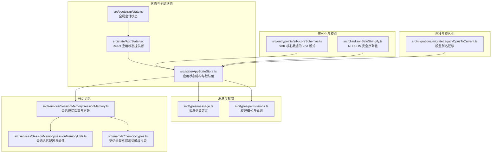
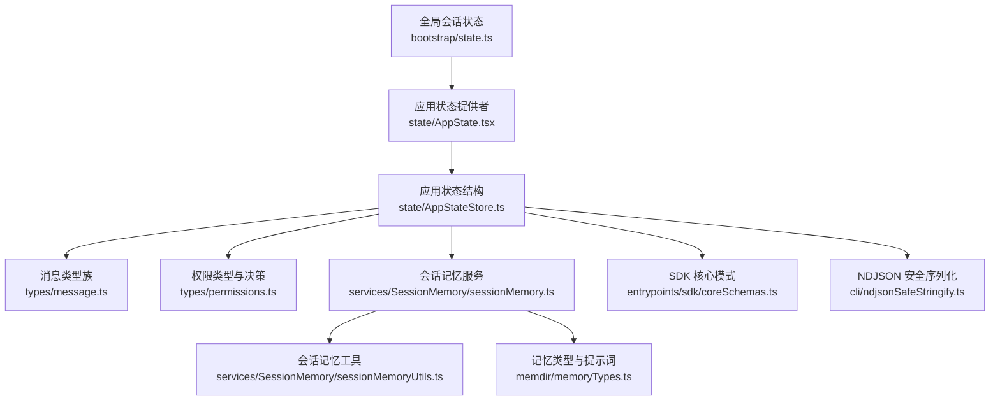
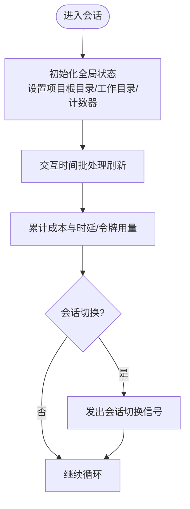
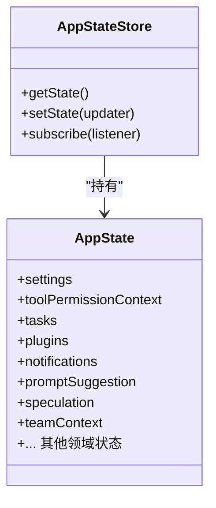
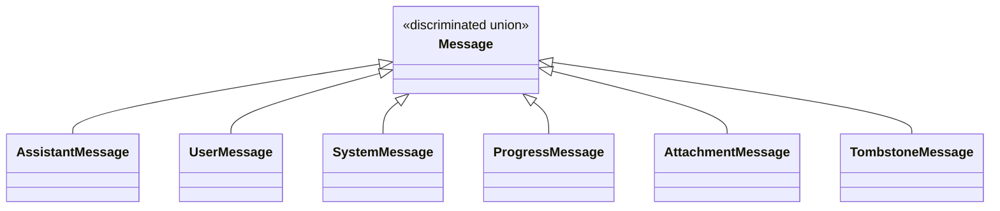
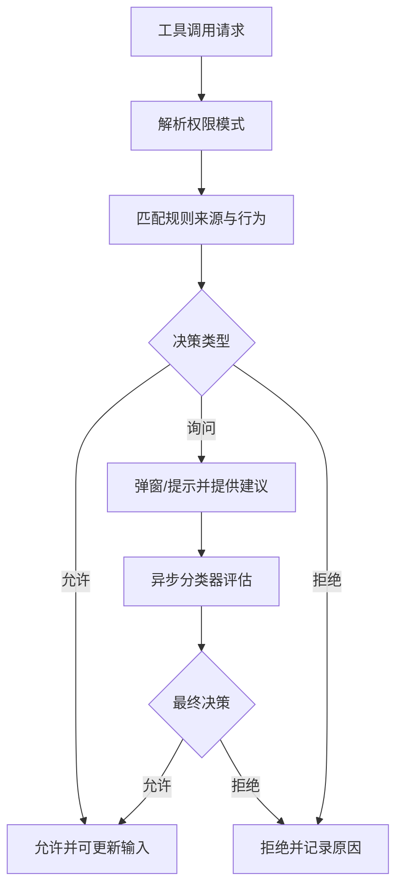
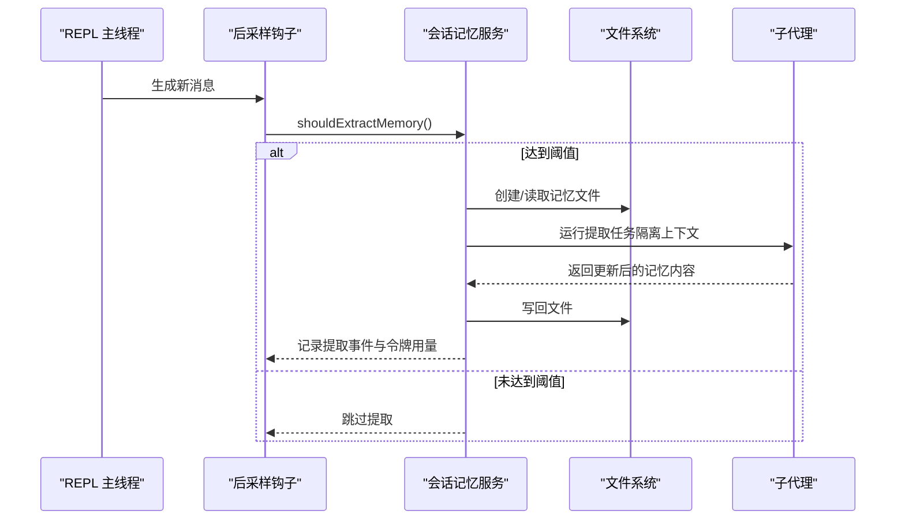
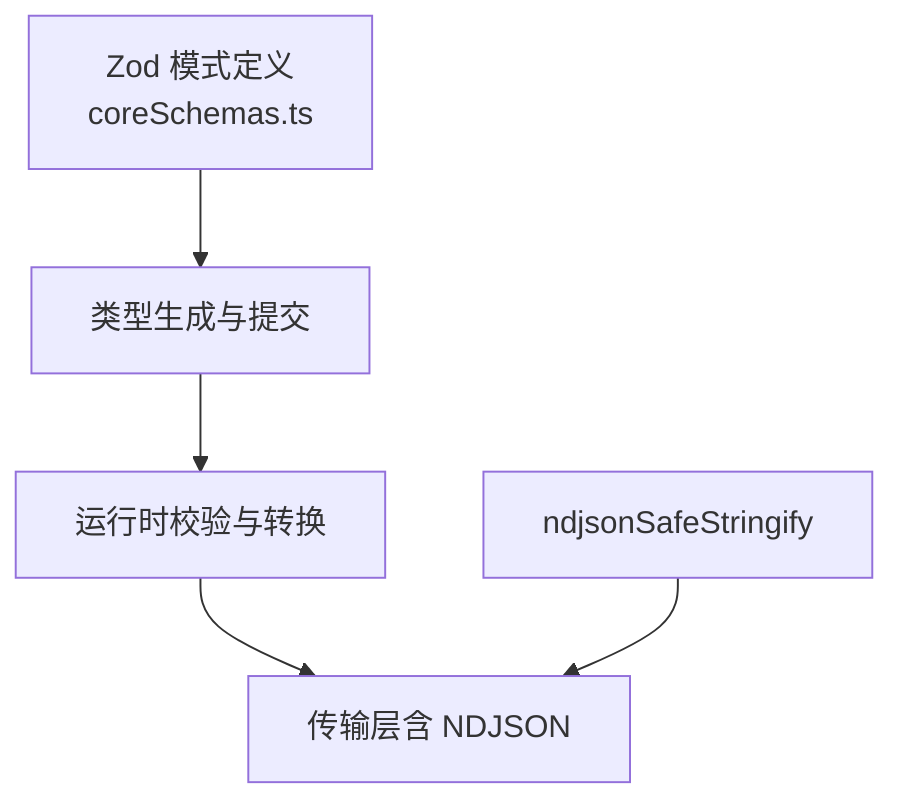
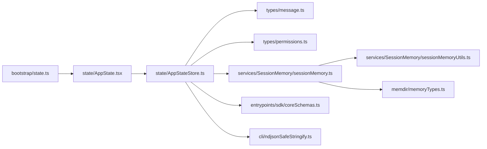

# 数据模型

<cite>
**本文引用的文件**
- [src/bootstrap/state.ts](file://src/bootstrap/state.ts)
- [src/state/AppState.tsx](file://src/state/AppState.tsx)
- [src/state/AppStateStore.ts](file://src/state/AppStateStore.ts)
- [src/types/message.ts](file://src/types/message.ts)
- [src/types/permissions.ts](file://src/types/permissions.ts)
- [src/services/SessionMemory/sessionMemory.ts](file://src/services/SessionMemory/sessionMemory.ts)
- [src/services/SessionMemory/sessionMemoryUtils.ts](file://src/services/SessionMemory/sessionMemoryUtils.ts)
- [src/memdir/memoryTypes.ts](file://src/memdir/memoryTypes.ts)
- [src/entrypoints/sdk/coreSchemas.ts](file://src/entrypoints/sdk/coreSchemas.ts)
- [src/cli/ndjsonSafeStringify.ts](file://src/cli/ndjsonSafeStringify.ts)
- [src/migrations/migrateLegacyOpusToCurrent.ts](file://src/migrations/migrateLegacyOpusToCurrent.ts)
</cite>

## 目录
1. [引言](#引言)
2. [项目结构](#项目结构)
3. [核心组件](#核心组件)
4. [架构总览](#架构总览)
5. [详细组件分析](#详细组件分析)
6. [依赖关系分析](#依赖关系分析)
7. [性能考量](#性能考量)
8. [故障排查指南](#故障排查指南)
9. [结论](#结论)
10. [附录](#附录)

## 引言
本技术文档聚焦 Claude Code 的数据模型与状态系统，围绕以下主题展开：会话状态与消息格式、权限配置与决策、内存管理与会话记忆、数据验证与序列化、状态持久化与迁移、以及扩展与最佳实践。文档旨在帮助开发者在不深入源码细节的前提下理解数据模型的设计原则与运行机制，并提供可操作的扩展与维护建议。

## 项目结构
本节概览与数据模型直接相关的模块与文件组织方式，便于定位实现位置与依赖关系。

图示来源
- [src/bootstrap/state.ts:1-800](file://src/bootstrap/state.ts#L1-L800)
- [src/state/AppState.tsx:1-201](file://src/state/AppState.tsx#L1-L201)
- [src/state/AppStateStore.ts:1-571](file://src/state/AppStateStore.ts#L1-L571)
- [src/types/message.ts:1-416](file://src/types/message.ts#L1-L416)
- [src/types/permissions.ts:1-443](file://src/types/permissions.ts#L1-L443)
- [src/services/SessionMemory/sessionMemory.ts:1-497](file://src/services/SessionMemory/sessionMemory.ts#L1-L497)
- [src/services/SessionMemory/sessionMemoryUtils.ts:85-138](file://src/services/SessionMemory/sessionMemoryUtils.ts#L85-L138)
- [src/memdir/memoryTypes.ts:1-273](file://src/memdir/memoryTypes.ts#L1-L273)
- [src/entrypoints/sdk/coreSchemas.ts:1-800](file://src/entrypoints/sdk/coreSchemas.ts#L1-L800)
- [src/cli/ndjsonSafeStringify.ts:1-35](file://src/cli/ndjsonSafeStringify.ts#L1-L35)
- [src/migrations/migrateLegacyOpusToCurrent.ts:1-59](file://src/migrations/migrateLegacyOpusToCurrent.ts#L1-L59)

章节来源
- [src/bootstrap/state.ts:1-800](file://src/bootstrap/state.ts#L1-L800)
- [src/state/AppState.tsx:1-201](file://src/state/AppState.tsx#L1-L201)
- [src/state/AppStateStore.ts:1-571](file://src/state/AppStateStore.ts#L1-L571)

## 核心组件
本节从数据模型角度拆解关键组件及其职责边界与交互方式。

- 全局会话状态（bootstrap/state）
  - 职责：集中存放与会话生命周期强相关的全局指标与上下文，如成本、时延、工具执行统计、时间戳、模型用量、桥接与远程模式状态等；提供会话切换、目录变更、计数器等原子操作接口。
  - 关键点：避免在该层引入 UI 或业务逻辑，保持“纯状态”以降低耦合。

- 应用状态（AppState/AppStateStore）
  - 职责：React 层的状态容器，承载设置、权限上下文、任务、插件、通知、提示建议、推测状态、团队与代理上下文等；提供订阅与更新能力，支持非 UI 场景下的直接访问。
  - 关键点：通过深度只读包装与选择器优化渲染；提供默认值工厂函数，保证初始化一致性。

- 消息类型（types/message）
  - 职责：定义对话历史中的消息类型族，包括用户消息、助手消息、系统消息、进度消息、附件消息、墓碑消息等；统一规范化消息形态，便于 UI 渲染与工具处理。
  - 关键点：使用判别联合类型与子类型，确保类型安全与可扩展性。

- 权限类型与决策（types/permissions）
  - 职责：定义权限模式、行为、规则、更新操作、决策结果与解释等；为工具调用前的权限检查提供统一的数据契约。
  - 关键点：区分“会话内可用”与“外部来源”的规则来源；支持异步分类器评估与挂起检查。

- 会话记忆（SessionMemory）
  - 职责：在后台周期性提取当前对话的关键信息，写入会话记忆文件，避免阻塞主线程；支持手动触发与阈值控制。
  - 关键点：基于令牌窗口增长与工具调用次数双重阈值；仅允许对特定文件进行编辑；记录提取事件与令牌用量用于追踪。

- 记忆类型与提示词（memdir/memoryTypes）
  - 职责：定义记忆类型（用户、反馈、项目、参考）与提示词片段，指导记忆的保存与召回策略。
  - 关键点：强调“不可派生信息”的边界，避免将代码结构、Git 历史等作为记忆内容。

- 序列化与校验（SDK 核心模式）
  - 职责：通过 Zod 模式定义可序列化数据结构，确保 SDK 与外部系统间的数据一致性；提供 NDJSON 安全序列化工具，规避换行符导致的消息截断。
  - 关键点：模式生成与类型绑定，保证 IDE 支持与运行时校验。

章节来源
- [src/bootstrap/state.ts:1-800](file://src/bootstrap/state.ts#L1-L800)
- [src/state/AppState.tsx:1-201](file://src/state/AppState.tsx#L1-L201)
- [src/state/AppStateStore.ts:1-571](file://src/state/AppStateStore.ts#L1-L571)
- [src/types/message.ts:1-416](file://src/types/message.ts#L1-L416)
- [src/types/permissions.ts:1-443](file://src/types/permissions.ts#L1-L443)
- [src/services/SessionMemory/sessionMemory.ts:1-497](file://src/services/SessionMemory/sessionMemory.ts#L1-L497)
- [src/memdir/memoryTypes.ts:1-273](file://src/memdir/memoryTypes.ts#L1-L273)
- [src/entrypoints/sdk/coreSchemas.ts:1-800](file://src/entrypoints/sdk/coreSchemas.ts#L1-L800)
- [src/cli/ndjsonSafeStringify.ts:1-35](file://src/cli/ndjsonSafeStringify.ts#L1-L35)

## 架构总览
下图展示数据模型在系统中的层次关系与关键交互路径。

图示来源
- [src/bootstrap/state.ts:1-800](file://src/bootstrap/state.ts#L1-L800)
- [src/state/AppState.tsx:1-201](file://src/state/AppState.tsx#L1-L201)
- [src/state/AppStateStore.ts:1-571](file://src/state/AppStateStore.ts#L1-L571)
- [src/types/message.ts:1-416](file://src/types/message.ts#L1-L416)
- [src/types/permissions.ts:1-443](file://src/types/permissions.ts#L1-L443)
- [src/services/SessionMemory/sessionMemory.ts:1-497](file://src/services/SessionMemory/sessionMemory.ts#L1-L497)
- [src/services/SessionMemory/sessionMemoryUtils.ts:85-138](file://src/services/SessionMemory/sessionMemoryUtils.ts#L85-L138)
- [src/memdir/memoryTypes.ts:1-273](file://src/memdir/memoryTypes.ts#L1-L273)
- [src/entrypoints/sdk/coreSchemas.ts:1-800](file://src/entrypoints/sdk/coreSchemas.ts#L1-L800)
- [src/cli/ndjsonSafeStringify.ts:1-35](file://src/cli/ndjsonSafeStringify.ts#L1-L35)

## 详细组件分析

### 组件一：全局会话状态（bootstrap/state）
- 设计要点
  - 使用稳定字段（如项目根目录、原始工作目录）隔离会话内变更与跨项目身份；提供会话切换信号，确保多会话场景下资源同步。
  - 集中计量指标（成本、API 时延、工具时延、令牌用量、搜索请求等），并提供快照与预算跟踪，支撑可观测性与性能分析。
  - 提供交互时间批处理刷新，减少高频事件带来的开销。
- 状态持久化
  - 该层为进程内状态，不直接负责磁盘持久化；持久化由上层应用状态或会话记忆服务承担。
- 扩展建议
  - 新增指标时，遵循现有命名与聚合模式；新增开关或标志位时，采用“粘滞”策略并在合适时机重置。

图示来源
- [src/bootstrap/state.ts:1-800](file://src/bootstrap/state.ts#L1-L800)

章节来源
- [src/bootstrap/state.ts:1-800](file://src/bootstrap/state.ts#L1-L800)

### 组件二：应用状态（AppState/AppStateStore）
- 设计要点
  - 通过 Provider 暴露订阅与更新接口，支持 React 与非 React 场景；默认值工厂确保初始化一致性。
  - 将复杂领域状态（任务、插件、通知、提示建议、推测状态、团队与代理上下文）收敛到单一结构，便于调试与持久化。
- 状态持久化
  - 默认值工厂与选择器优化渲染；持久化可通过上层存储方案完成（例如会话记忆文件或设置系统）。
- 扩展建议
  - 新增字段时，优先考虑是否属于“应用状态”范畴；若涉及全局指标，优先放入 bootstrap/state。

图示来源
- [src/state/AppStateStore.ts:1-571](file://src/state/AppStateStore.ts#L1-L571)
- [src/state/AppState.tsx:1-201](file://src/state/AppState.tsx#L1-L201)

章节来源
- [src/state/AppState.tsx:1-201](file://src/state/AppState.tsx#L1-L201)
- [src/state/AppStateStore.ts:1-571](file://src/state/AppStateStore.ts#L1-L571)

### 组件三：消息格式（types/message）
- 设计要点
  - 使用判别联合类型区分消息来源与用途（用户、助手、系统、进度、附件、墓碑），并为系统消息进一步细分子类型。
  - 规范化助手消息与用户消息形态，确保 API 处理一致性。
- 扩展建议
  - 新增消息类型时，明确其判别字段与必要元数据；避免在消息中携带 UI 特定属性。

图示来源
- [src/types/message.ts:1-416](file://src/types/message.ts#L1-L416)

章节来源
- [src/types/message.ts:1-416](file://src/types/message.ts#L1-L416)

### 组件四：权限配置与决策（types/permissions）
- 设计要点
  - 权限模式覆盖“默认、接受编辑、绕过权限、计划模式、不询问”等；规则来源包含用户/项目/本地/策略/会话等；支持添加/替换/移除规则与目录范围调整。
  - 决策结果包含允许、询问、拒绝与挂起分类器检查等，支持异步评估与自动批准。
- 扩展建议
  - 新增模式或行为时，需同步完善 SDK 模式与 UI 表达；谨慎处理“绕过权限”类模式的启用条件。

图示来源
- [src/types/permissions.ts:1-443](file://src/types/permissions.ts#L1-L443)

章节来源
- [src/types/permissions.ts:1-443](file://src/types/permissions.ts#L1-L443)

### 组件五：会话记忆（SessionMemory）
- 设计要点
  - 基于令牌窗口增长与工具调用次数双重阈值触发提取；仅在自然停顿或满足条件时进行，避免频繁写入。
  - 通过子代理（forked agent）隔离上下文，确保提取过程不影响主会话缓存与状态。
  - 严格限制工具使用范围，仅允许对会话记忆文件进行编辑；记录提取事件与令牌用量，便于追踪与优化。
- 存储结构
  - 记忆文件位于会话目录，首次创建时注入模板；每次提取后追加或更新内容。
- 扩展建议
  - 新增阈值参数时，应结合令牌估算与工具调用频率进行 A/B 测试；注意与自动压缩（compact）的协同。

图示来源
- [src/services/SessionMemory/sessionMemory.ts:1-497](file://src/services/SessionMemory/sessionMemory.ts#L1-L497)
- [src/services/SessionMemory/sessionMemoryUtils.ts:85-138](file://src/services/SessionMemory/sessionMemoryUtils.ts#L85-L138)

章节来源
- [src/services/SessionMemory/sessionMemory.ts:1-497](file://src/services/SessionMemory/sessionMemory.ts#L1-L497)
- [src/services/SessionMemory/sessionMemoryUtils.ts:85-138](file://src/services/SessionMemory/sessionMemoryUtils.ts#L85-L138)

### 组件六：记忆类型与提示词（memdir/memoryTypes）
- 设计要点
  - 明确四种记忆类型（用户、反馈、项目、参考）及其适用范围与保存策略；提供组合与独立两种模式下的提示词片段。
  - 强调“不可派生信息”的边界，避免将代码结构、Git 历史、调试配方等作为记忆内容。
- 扩展建议
  - 新增类型时，需提供清晰的“何时保存/如何使用”的说明与示例；确保与现有系统提示词一致。

章节来源
- [src/memdir/memoryTypes.ts:1-273](file://src/memdir/memoryTypes.ts#L1-L273)

### 组件七：数据验证与序列化（SDK 核心模式与 NDJSON）
- 设计要点
  - SDK 核心模式通过 Zod 定义可序列化数据结构，确保跨进程/跨组件的数据一致性；模式生成与类型绑定，便于 IDE 支持。
  - NDJSON 安全序列化规避 U+2028/U+2029 导致的消息截断问题，保证单行传输稳定性。
- 扩展建议
  - 新增可序列化字段时，同步更新模式定义与类型生成脚本；对外输出前使用 NDJSON 安全序列化。

图示来源
- [src/entrypoints/sdk/coreSchemas.ts:1-800](file://src/entrypoints/sdk/coreSchemas.ts#L1-L800)
- [src/cli/ndjsonSafeStringify.ts:1-35](file://src/cli/ndjsonSafeStringify.ts#L1-L35)

章节来源
- [src/entrypoints/sdk/coreSchemas.ts:1-800](file://src/entrypoints/sdk/coreSchemas.ts#L1-L800)
- [src/cli/ndjsonSafeStringify.ts:1-35](file://src/cli/ndjsonSafeStringify.ts#L1-L35)

## 依赖关系分析
- 组件耦合
  - bootstrap/state 与 state/AppStateStore 通过会话标识与项目目录建立弱耦合；前者提供全局指标，后者承载应用级状态。
  - 会话记忆服务依赖消息类型与工具上下文，但通过子代理隔离，避免污染主状态。
- 外部依赖
  - SDK 核心模式与 NDJSON 工具为跨模块通信提供契约与传输保障。
- 循环依赖规避
  - 类型定义前移至 types 目录，避免运行时导入循环；消息与权限类型被多个模块共享。

图示来源
- [src/bootstrap/state.ts:1-800](file://src/bootstrap/state.ts#L1-L800)
- [src/state/AppState.tsx:1-201](file://src/state/AppState.tsx#L1-L201)
- [src/state/AppStateStore.ts:1-571](file://src/state/AppStateStore.ts#L1-L571)
- [src/types/message.ts:1-416](file://src/types/message.ts#L1-L416)
- [src/types/permissions.ts:1-443](file://src/types/permissions.ts#L1-L443)
- [src/services/SessionMemory/sessionMemory.ts:1-497](file://src/services/SessionMemory/sessionMemory.ts#L1-L497)
- [src/services/SessionMemory/sessionMemoryUtils.ts:85-138](file://src/services/SessionMemory/sessionMemoryUtils.ts#L85-L138)
- [src/memdir/memoryTypes.ts:1-273](file://src/memdir/memoryTypes.ts#L1-L273)
- [src/entrypoints/sdk/coreSchemas.ts:1-800](file://src/entrypoints/sdk/coreSchemas.ts#L1-L800)
- [src/cli/ndjsonSafeStringify.ts:1-35](file://src/cli/ndjsonSafeStringify.ts#L1-L35)

章节来源
- [src/bootstrap/state.ts:1-800](file://src/bootstrap/state.ts#L1-L800)
- [src/state/AppState.tsx:1-201](file://src/state/AppState.tsx#L1-L201)
- [src/state/AppStateStore.ts:1-571](file://src/state/AppStateStore.ts#L1-L571)

## 性能考量
- 令牌估算与阈值控制
  - 会话记忆提取采用“上下文窗口增长 + 工具调用次数”双阈值，避免过度提取；建议根据项目规模与工具调用频率进行 A/B 测试微调。
- 子代理隔离
  - 通过子代理执行提取任务，隔离上下文与缓存，减少主线程阻塞与缓存污染风险。
- 批处理与去抖
  - 全局状态中的交互时间批处理与滚动去抖，降低高频事件对渲染与计算的影响。
- 传输稳定性
  - 使用 NDJSON 安全序列化规避换行符截断，提升传输可靠性。

[本节为通用性能讨论，无需具体文件分析]

## 故障排查指南
- 会话记忆未更新
  - 检查门控开关与动态配置是否生效；确认阈值是否满足；查看提取事件日志与令牌用量。
  - 参考：[shouldExtractMemory:134-181](file://src/services/SessionMemory/sessionMemory.ts#L134-L181)，[extractSessionMemory:272-350](file://src/services/SessionMemory/sessionMemory.ts#L272-L350)
- 权限弹窗频繁
  - 检查权限模式与规则来源；确认是否存在“询问”行为过多；考虑使用“允许/拒绝”规则或模式调整。
  - 参考：[权限模式与行为:16-443](file://src/types/permissions.ts#L16-L443)
- 消息截断或解析失败
  - 确认输出使用 NDJSON 安全序列化；检查换行符转义。
  - 参考：[ndjsonSafeStringify:1-35](file://src/cli/ndjsonSafeStringify.ts#L1-L35)
- 模型别名迁移
  - 首方用户若仍使用旧版 Opus 别名，迁移脚本会将其重映射为当前版本别名并记录事件。
  - 参考：[migrateLegacyOpusToCurrent:1-59](file://src/migrations/migrateLegacyOpusToCurrent.ts#L1-L59)

章节来源
- [src/services/SessionMemory/sessionMemory.ts:134-181](file://src/services/SessionMemory/sessionMemory.ts#L134-L181)
- [src/services/SessionMemory/sessionMemory.ts:272-350](file://src/services/SessionMemory/sessionMemory.ts#L272-L350)
- [src/types/permissions.ts:16-443](file://src/types/permissions.ts#L16-L443)
- [src/cli/ndjsonSafeStringify.ts:1-35](file://src/cli/ndjsonSafeStringify.ts#L1-L35)
- [src/migrations/migrateLegacyOpusToCurrent.ts:1-59](file://src/migrations/migrateLegacyOpusToCurrent.ts#L1-L59)

## 结论
本数据模型以“全局状态 + 应用状态 + 消息与权限 + 会话记忆 + 序列化与校验”为主线，形成清晰的分层与职责边界。通过严格的阈值控制、子代理隔离与模式驱动的权限决策，系统在保证一致性的同时兼顾了性能与可维护性。扩展时应遵循“类型先行、模式约束、最小侵入”的原则，确保数据的一致性与完整性。

[本节为总结性内容，无需具体文件分析]

## 附录
- 数据模型扩展指南（步骤建议）
  - 新增消息类型：在 [消息类型定义:1-416](file://src/types/message.ts#L1-L416) 中添加判别字段与必要元数据；在 UI 侧增加渲染分支。
  - 新增权限规则：在 [权限类型定义:1-443](file://src/types/permissions.ts#L1-L443) 中扩展规则来源与行为；在 SDK 模式中补充相应字段。
  - 新增会话记忆类型：在 [记忆类型定义:1-273](file://src/memdir/memoryTypes.ts#L1-L273) 中新增类型与提示词片段；在 [会话记忆服务:1-497](file://src/services/SessionMemory/sessionMemory.ts#L1-L497) 中适配提取逻辑。
  - 新增可序列化字段：在 [SDK 核心模式:1-800](file://src/entrypoints/sdk/coreSchemas.ts#L1-L800) 中添加字段与校验；在传输前使用 [NDJSON 安全序列化:1-35](file://src/cli/ndjsonSafeStringify.ts#L1-L35)。
  - 数据迁移：在 [迁移脚本:1-59](file://src/migrations/migrateLegacyOpusToCurrent.ts#L1-L59) 中编写迁移逻辑并记录事件。

章节来源
- [src/types/message.ts:1-416](file://src/types/message.ts#L1-L416)
- [src/types/permissions.ts:1-443](file://src/types/permissions.ts#L1-L443)
- [src/memdir/memoryTypes.ts:1-273](file://src/memdir/memoryTypes.ts#L1-L273)
- [src/entrypoints/sdk/coreSchemas.ts:1-800](file://src/entrypoints/sdk/coreSchemas.ts#L1-L800)
- [src/cli/ndjsonSafeStringify.ts:1-35](file://src/cli/ndjsonSafeStringify.ts#L1-L35)
- [src/migrations/migrateLegacyOpusToCurrent.ts:1-59](file://src/migrations/migrateLegacyOpusToCurrent.ts#L1-L59)