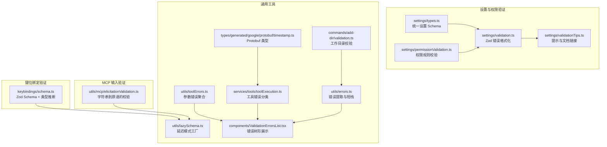
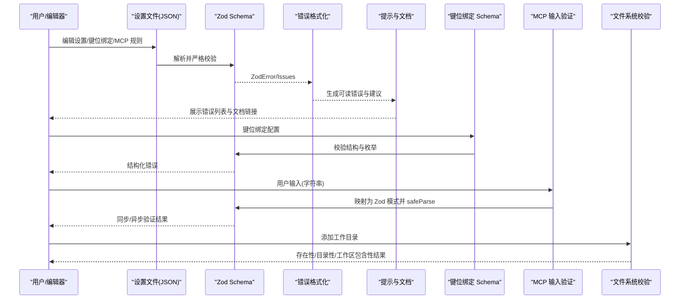
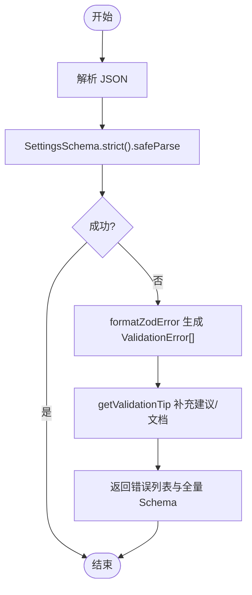
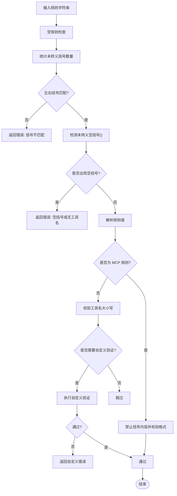
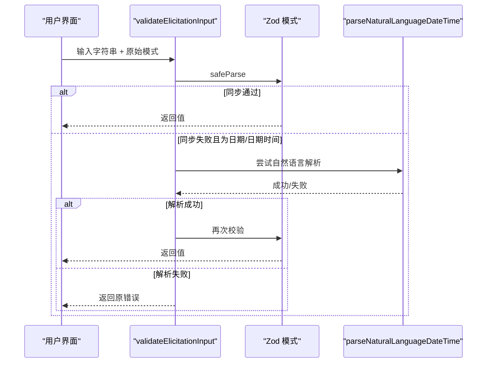
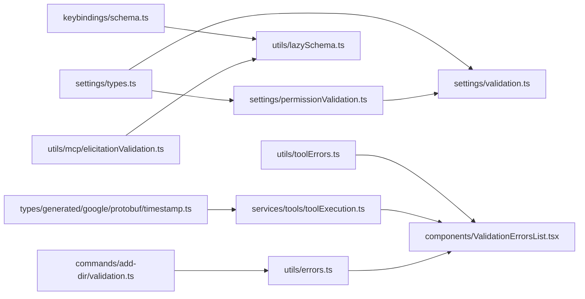

# 数据验证

<cite>
**本文引用的文件**
- [src/utils/mcp/elicitationValidation.ts](file://src/utils/mcp/elicitationValidation.ts)
- [src/utils/lazySchema.ts](file://src/utils/lazySchema.ts)
- [src/utils/settings/validation.ts](file://src/utils/settings/validation.ts)
- [src/utils/settings/validationTips.ts](file://src/utils/settings/validationTips.ts)
- [src/utils/settings/permissionValidation.ts](file://src/utils/settings/permissionValidation.ts)
- [src/utils/settings/types.ts](file://src/utils/settings/types.ts)
- [src/keybindings/schema.ts](file://src/keybindings/schema.ts)
- [src/commands/add-dir/validation.ts](file://src/commands/add-dir/validation.ts)
- [src/types/generated/google/protobuf/timestamp.ts](file://src/types/generated/google/protobuf/timestamp.ts)
- [src/services/tools/toolExecution.ts](file://src/services/tools/toolExecution.ts)
- [src/utils/toolErrors.ts](file://src/utils/toolErrors.ts)
- [src/components/ValidationErrorsList.tsx](file://src/components/ValidationErrorsList.tsx)
- [src/utils/errors.ts](file://src/utils/errors.ts)
</cite>

## 目录
1. [简介](#简介)
2. [项目结构](#项目结构)
3. [核心组件](#核心组件)
4. [架构总览](#架构总览)
5. [详细组件分析](#详细组件分析)
6. [依赖关系分析](#依赖关系分析)
7. [性能考量](#性能考量)
8. [故障排查指南](#故障排查指南)
9. [结论](#结论)
10. [附录：验证扩展指南](#附录验证扩展指南)

## 简介
本文件系统性梳理 Claude Code 的数据验证体系，覆盖类型系统架构（TypeScript 类型定义、Zod 模式验证与运行时检查）、设置验证机制（配置项校验、默认值处理与错误报告）、权限规则解析系统（权限规则格式与内容校验）、生成式类型系统（protobuf 类型转换与事件格式验证），并提供验证扩展指南、性能优化建议与调试工具实现细节。目标是帮助开发者在不深入源码的前提下理解验证流程，并安全地扩展新规则与自定义验证器。

## 项目结构
验证相关代码主要分布在以下模块：
- 设置与权限验证：settings 目录下的 schema、validation、permissionValidation、types 等文件
- 键位绑定验证：keybindings/schema.ts
- MCP 输入验证：utils/mcp/elicitationValidation.ts
- 延迟模式工厂：utils/lazySchema.ts
- 工作目录校验：commands/add-dir/validation.ts
- Protobuf 类型：types/generated/google/protobuf/timestamp.ts
- 工具执行与错误分类：services/tools/toolExecution.ts、utils/toolErrors.ts
- 错误展示组件：components/ValidationErrorsList.tsx
- 通用错误工具：utils/errors.ts

**图表来源**
- [src/utils/settings/types.ts:255-800](file://src/utils/settings/types.ts#L255-L800)
- [src/utils/settings/validation.ts:97-217](file://src/utils/settings/validation.ts#L97-L217)
- [src/utils/settings/permissionValidation.ts:58-239](file://src/utils/settings/permissionValidation.ts#L58-L239)
- [src/utils/settings/validationTips.ts:140-166](file://src/utils/settings/validationTips.ts#L140-L166)
- [src/keybindings/schema.ts:174-238](file://src/keybindings/schema.ts#L174-L238)
- [src/utils/mcp/elicitationValidation.ts:135-243](file://src/utils/mcp/elicitationValidation.ts#L135-L243)
- [src/utils/lazySchema.ts:1-10](file://src/utils/lazySchema.ts#L1-L10)
- [src/commands/add-dir/validation.ts:31-93](file://src/commands/add-dir/validation.ts#L31-L93)
- [src/types/generated/google/protobuf/timestamp.ts:116-187](file://src/types/generated/google/protobuf/timestamp.ts#L116-L187)
- [src/services/tools/toolExecution.ts:150-171](file://src/services/tools/toolExecution.ts#L150-L171)
- [src/utils/toolErrors.ts:78-132](file://src/utils/toolErrors.ts#L78-L132)
- [src/components/ValidationErrorsList.tsx:59-103](file://src/components/ValidationErrorsList.tsx#L59-L103)
- [src/utils/errors.ts:143-171](file://src/utils/errors.ts#L143-L171)

**章节来源**
- [src/utils/settings/types.ts:255-800](file://src/utils/settings/types.ts#L255-L800)
- [src/utils/settings/validation.ts:97-217](file://src/utils/settings/validation.ts#L97-L217)
- [src/utils/settings/permissionValidation.ts:58-239](file://src/utils/settings/permissionValidation.ts#L58-L239)
- [src/utils/settings/validationTips.ts:140-166](file://src/utils/settings/validationTips.ts#L140-L166)
- [src/keybindings/schema.ts:174-238](file://src/keybindings/schema.ts#L174-L238)
- [src/utils/mcp/elicitationValidation.ts:135-243](file://src/utils/mcp/elicitationValidation.ts#L135-L243)
- [src/utils/lazySchema.ts:1-10](file://src/utils/lazySchema.ts#L1-L10)
- [src/commands/add-dir/validation.ts:31-93](file://src/commands/add-dir/validation.ts#L31-L93)
- [src/types/generated/google/protobuf/timestamp.ts:116-187](file://src/types/generated/google/protobuf/timestamp.ts#L116-L187)
- [src/services/tools/toolExecution.ts:150-171](file://src/services/tools/toolExecution.ts#L150-L171)
- [src/utils/toolErrors.ts:78-132](file://src/utils/toolErrors.ts#L78-L132)
- [src/components/ValidationErrorsList.tsx:59-103](file://src/components/ValidationErrorsList.tsx#L59-L103)
- [src/utils/errors.ts:143-171](file://src/utils/errors.ts#L143-L171)

## 核心组件
- 统一设置 Schema 与类型推断：settings/types.ts 定义了 SettingsSchema 及其子 Schema（如 PermissionsSchema、AllowedMcpServerEntrySchema 等），并使用 lazySchema 延迟构建，确保模块初始化时零开销。
- Zod 错误格式化与提示：settings/validation.ts 将 Zod v4 的 issues 转换为可读的 ValidationError 列表；validationTips.ts 提供路径级提示与文档链接。
- 权限规则解析：permissionValidation.ts 对规则字符串进行语法与语义校验（括号匹配、空括号、MCP 规则约束、Bash/File 工具特定规则等），并通过自定义 Zod superRefine 注入更友好的错误信息。
- 键位绑定 Schema：keybindings/schema.ts 使用 Zod 定义键位绑定配置的结构与枚举上下文，配合 lazySchema 延迟加载。
- MCP 输入验证：elicitationValidation.ts 将 JSON Schema 风格的原始模式映射为 Zod 模式，支持字符串格式（email、uri、date、date-time）与数值范围、整数约束，并提供同步/异步验证（自然语言日期时间解析）。
- 工作目录校验：add-dir/validation.ts 在文件系统层面校验路径存在性、目录性与工作区包含关系，返回结构化结果并生成用户提示。
- Protobuf 类型与事件格式：types/generated/google/protobuf/timestamp.ts 提供 fromJSON/toJSON/create/fromPartial 等方法，用于事件或消息的序列化/反序列化。
- 工具执行错误分类与参数错误聚合：toolExecution.ts 将底层错误归类为可遥测的安全字符串；toolErrors.ts 聚合缺失、意外与类型不匹配参数，生成人类可读的错误描述。
- 错误展示组件：ValidationErrorsList.tsx 将错误按文件与路径分组，去重并以树形结构展示，同时汇总建议与文档链接。
- 通用错误工具：errors.ts 提供 errno 提取、短栈截断等能力，便于日志与错误上报。

**章节来源**
- [src/utils/settings/types.ts:255-800](file://src/utils/settings/types.ts#L255-L800)
- [src/utils/settings/validation.ts:97-217](file://src/utils/settings/validation.ts#L97-L217)
- [src/utils/settings/validationTips.ts:140-166](file://src/utils/settings/validationTips.ts#L140-L166)
- [src/utils/settings/permissionValidation.ts:58-239](file://src/utils/settings/permissionValidation.ts#L58-L239)
- [src/keybindings/schema.ts:174-238](file://src/keybindings/schema.ts#L174-L238)
- [src/utils/mcp/elicitationValidation.ts:135-243](file://src/utils/mcp/elicitationValidation.ts#L135-L243)
- [src/commands/add-dir/validation.ts:31-93](file://src/commands/add-dir/validation.ts#L31-L93)
- [src/types/generated/google/protobuf/timestamp.ts:116-187](file://src/types/generated/google/protobuf/timestamp.ts#L116-L187)
- [src/services/tools/toolExecution.ts:150-171](file://src/services/tools/toolExecution.ts#L150-L171)
- [src/utils/toolErrors.ts:78-132](file://src/utils/toolErrors.ts#L78-L132)
- [src/components/ValidationErrorsList.tsx:59-103](file://src/components/ValidationErrorsList.tsx#L59-L103)
- [src/utils/errors.ts:143-171](file://src/utils/errors.ts#L143-L171)

## 架构总览
下图展示了从“输入数据”到“可读错误”的端到端验证链路，涵盖设置文件、权限规则、键位绑定、MCP 输入与文件系统校验。

**图表来源**
- [src/utils/settings/validation.ts:97-217](file://src/utils/settings/validation.ts#L97-L217)
- [src/utils/settings/validationTips.ts:140-166](file://src/utils/settings/validationTips.ts#L140-L166)
- [src/keybindings/schema.ts:174-238](file://src/keybindings/schema.ts#L174-L238)
- [src/utils/mcp/elicitationValidation.ts:225-243](file://src/utils/mcp/elicitationValidation.ts#L225-L243)
- [src/commands/add-dir/validation.ts:31-93](file://src/commands/add-dir/validation.ts#L31-L93)

## 详细组件分析

### 设置验证与错误报告
- 统一设置 Schema：settings/types.ts 中的 SettingsSchema 通过 lazySchema 延迟构建，内部组合 PermissionsSchema、AllowedMcpServerEntrySchema、HooksSchema 等，支持 passthrough 保留未知字段，保证向后兼容。
- Zod 错误格式化：validation.ts 将 Zod v4 的 issues 转换为 ValidationError，区分 invalid_type、invalid_value、unrecognized_keys、too_small 等场景，并注入预期值、接收值、建议与文档链接。
- 提示与文档：validationTips.ts 基于路径与问题码匹配，提供针对 permissions.defaultMode、env.*、hooks、布尔值等的建议与文档链接。
- 设置文件内容校验：validateSettingsFileContent 在严格模式下对 JSON 进行 safeParse，并在失败时生成完整错误列表与 JSON Schema 文本，便于修复。

**图表来源**
- [src/utils/settings/validation.ts:179-217](file://src/utils/settings/validation.ts#L179-L217)
- [src/utils/settings/validationTips.ts:140-166](file://src/utils/settings/validationTips.ts#L140-L166)

**章节来源**
- [src/utils/settings/types.ts:255-800](file://src/utils/settings/types.ts#L255-L800)
- [src/utils/settings/validation.ts:97-217](file://src/utils/settings/validation.ts#L97-L217)
- [src/utils/settings/validationTips.ts:140-166](file://src/utils/settings/validationTips.ts#L140-L166)

### 权限规则解析系统
- 规则格式校验：validatePermissionRule 对字符串进行括号匹配、空括号检测、MCP 规则约束、工具名大小写要求等检查。
- 自定义验证：permissionValidation.ts 引入 getCustomValidation、isBashPrefixTool、isFilePatternTool 等钩子，允许针对特定工具名执行定制规则（如 Bash 的 :* 位置、File 工具的通配符边界）。
- Zod 集成：PermissionRuleSchema 使用 superRefine 将 validatePermissionRule 的结果注入 Zod 错误，使规则数组也能获得一致的报错体验。

**图表来源**
- [src/utils/settings/permissionValidation.ts:58-239](file://src/utils/settings/permissionValidation.ts#L58-L239)

**章节来源**
- [src/utils/settings/permissionValidation.ts:58-239](file://src/utils/settings/permissionValidation.ts#L58-L239)

### 键位绑定验证
- 使用 Zod 枚举与 union 定义上下文与动作集合，确保键位绑定配置的结构与取值合法。
- 采用 lazySchema 包装对象，避免模块初始化时的昂贵 Schema 构建。
- 导出 TypeScript 类型 KeybindingsSchemaType，便于上层消费。

**章节来源**
- [src/keybindings/schema.ts:174-238](file://src/keybindings/schema.ts#L174-L238)
- [src/utils/lazySchema.ts:1-10](file://src/utils/lazySchema.ts#L1-L10)

### MCP 输入验证（字符串到原语）
- 将 JSON Schema 风格的原始模式映射为 Zod 模式，支持字符串长度/格式（email、uri、date、date-time）、数值范围与整数约束、布尔强制转换。
- 支持同步与异步验证：当字符串不符合常规格式但为日期/日期时间时，尝试自然语言解析，再回退到同步校验。
- 提供格式提示 getFormatHint，辅助用户输入。

**图表来源**
- [src/utils/mcp/elicitationValidation.ts:225-336](file://src/utils/mcp/elicitationValidation.ts#L225-L336)

**章节来源**
- [src/utils/mcp/elicitationValidation.ts:135-243](file://src/utils/mcp/elicitationValidation.ts#L135-L243)
- [src/utils/mcp/elicitationValidation.ts:307-336](file://src/utils/mcp/elicitationValidation.ts#L307-L336)

### 工作目录校验
- 处理空路径、展开绝对路径、单次 stat 检查目录性，捕获 ENOENT/ENOTDIR/EACCES/EPERM 并以结构化结果返回，避免崩溃。
- 检查是否已处于现有工作目录范围内，避免重复添加。

**章节来源**
- [src/commands/add-dir/validation.ts:31-93](file://src/commands/add-dir/validation.ts#L31-L93)

### 生成式类型系统（Protobuf 与事件格式）
- Protobuf 类型：timestamp.ts 提供 fromJSON/toJSON/create/fromPartial 等方法，确保事件或消息在序列化/反序列化过程中的类型一致性。
- 事件格式验证：结合 Zod Schema 与 Protobuf 类型，可在运行时对事件载荷进行二次校验（例如字段存在性、类型匹配、范围约束）。

**章节来源**
- [src/types/generated/google/protobuf/timestamp.ts:116-187](file://src/types/generated/google/protobuf/timestamp.ts#L116-L187)

### 工具执行与错误分类
- 工具错误分类：classifyToolError 将底层错误归类为遥测安全字符串，优先使用已验证的 telemetryMessage，其次提取 Node.js errno，最后回退为通用标识。
- 参数错误聚合：toolErrors.ts 聚合缺失参数、意外参数与类型不匹配参数，生成简洁的人类可读错误描述。

**章节来源**
- [src/services/tools/toolExecution.ts:150-171](file://src/services/tools/toolExecution.ts#L150-L171)
- [src/utils/toolErrors.ts:78-132](file://src/utils/toolErrors.ts#L78-L132)

### 错误展示与调试
- 错误树形展示：ValidationErrorsList.tsx 将错误按文件与路径分组，去重并以树形结构输出，同时汇总建议与文档链接。
- 通用错误工具：errors.ts 提供 getErrnoCode、getErrnoPath、shortErrorStack 等，便于日志与错误上报。

**章节来源**
- [src/components/ValidationErrorsList.tsx:59-103](file://src/components/ValidationErrorsList.tsx#L59-L103)
- [src/utils/errors.ts:143-171](file://src/utils/errors.ts#L143-L171)

## 依赖关系分析
- settings/types.ts 作为中枢，被 settings/validation.ts 与 settings/permissionValidation.ts 间接依赖；permissionValidation.ts 通过 lazySchema 与工具函数被 settings/types.ts 引用。
- keybindings/schema.ts 依赖 lazySchema.ts；其导出类型供上层消费。
- utils/mcp/elicitationValidation.ts 依赖 lazySchema.ts 与字符串工具，提供 validateElicitationInput 与 validateElicitationInputAsync。
- commands/add-dir/validation.ts 依赖工具函数与权限工具，返回结构化结果。
- types/generated/google/protobuf/timestamp.ts 为生成类型，服务于事件/消息序列化。
- services/tools/toolExecution.ts 与 utils/toolErrors.ts、components/ValidationErrorsList.tsx、utils/errors.ts 形成错误处理闭环。

**图表来源**
- [src/utils/settings/types.ts:255-800](file://src/utils/settings/types.ts#L255-L800)
- [src/utils/settings/validation.ts:97-217](file://src/utils/settings/validation.ts#L97-L217)
- [src/utils/settings/permissionValidation.ts:58-239](file://src/utils/settings/permissionValidation.ts#L58-L239)
- [src/keybindings/schema.ts:174-238](file://src/keybindings/schema.ts#L174-L238)
- [src/utils/lazySchema.ts:1-10](file://src/utils/lazySchema.ts#L1-L10)
- [src/utils/mcp/elicitationValidation.ts:135-243](file://src/utils/mcp/elicitationValidation.ts#L135-L243)
- [src/commands/add-dir/validation.ts:31-93](file://src/commands/add-dir/validation.ts#L31-L93)
- [src/types/generated/google/protobuf/timestamp.ts:116-187](file://src/types/generated/google/protobuf/timestamp.ts#L116-L187)
- [src/services/tools/toolExecution.ts:150-171](file://src/services/tools/toolExecution.ts#L150-L171)
- [src/utils/toolErrors.ts:78-132](file://src/utils/toolErrors.ts#L78-L132)
- [src/components/ValidationErrorsList.tsx:59-103](file://src/components/ValidationErrorsList.tsx#L59-L103)
- [src/utils/errors.ts:143-171](file://src/utils/errors.ts#L143-L171)

**章节来源**
- [src/utils/settings/types.ts:255-800](file://src/utils/settings/types.ts#L255-L800)
- [src/utils/settings/validation.ts:97-217](file://src/utils/settings/validation.ts#L97-L217)
- [src/utils/settings/permissionValidation.ts:58-239](file://src/utils/settings/permissionValidation.ts#L58-L239)
- [src/keybindings/schema.ts:174-238](file://src/keybindings/schema.ts#L174-L238)
- [src/utils/lazySchema.ts:1-10](file://src/utils/lazySchema.ts#L1-L10)
- [src/utils/mcp/elicitationValidation.ts:135-243](file://src/utils/mcp/elicitationValidation.ts#L135-L243)
- [src/commands/add-dir/validation.ts:31-93](file://src/commands/add-dir/validation.ts#L31-L93)
- [src/types/generated/google/protobuf/timestamp.ts:116-187](file://src/types/generated/google/protobuf/timestamp.ts#L116-L187)
- [src/services/tools/toolExecution.ts:150-171](file://src/services/tools/toolExecution.ts#L150-L171)
- [src/utils/toolErrors.ts:78-132](file://src/utils/toolErrors.ts#L78-L132)
- [src/components/ValidationErrorsList.tsx:59-103](file://src/components/ValidationErrorsList.tsx#L59-L103)
- [src/utils/errors.ts:143-171](file://src/utils/errors.ts#L143-L171)

## 性能考量
- 延迟模式构建：通过 lazySchema 将 Zod 模式的构建推迟到首次访问，避免模块初始化时的昂贵计算，降低冷启动成本。
- 严格模式与最小化错误：settings/validation.ts 在 validateSettingsFileContent 中使用 strict 模式，快速定位问题；同时仅在失败时生成错误列表与全量 Schema，减少不必要的字符串拼接。
- 文件系统校验：add-dir/validation.ts 使用单次 stat 检查目录性，避免多次 IO；对常见错误码（ENOENT/ENOTDIR/EACCES/EPERM）进行短路处理，避免抛出异常。
- 异步自然语言解析：elicitationValidation.ts 在同步失败时才触发异步解析，避免对高频正确输入造成额外开销。

[本节为通用性能讨论，无需具体文件分析]

## 故障排查指南
- 设置文件错误：使用 validateSettingsFileContent 获取可读错误与全量 Schema，结合 validationTips.ts 的建议与文档链接快速定位问题。
- 权限规则错误：filterInvalidPermissionRules 会过滤无效规则并生成警告；validatePermissionRule 提供详细的错误与示例，便于修正。
- 键位绑定错误：KeybindingsSchema 与 KeybindingBlockSchema 提供结构化错误；结合 KEYBINDING_CONTEXTS 与 KEYBINDING_ACTIONS 的枚举值核对配置。
- MCP 输入错误：validateElicitationInput/Async 返回同步/异步结果；若为日期/时间格式，尝试自然语言表达（如“明天下午三点”）。
- 工具执行错误：classifyToolError 将底层错误归类为遥测安全字符串；toolErrors.ts 聚合参数错误，生成清晰的报错信息。
- 错误展示：ValidationErrorsList.tsx 将错误按文件与路径分组，支持去重与树形渲染，便于快速定位。

**章节来源**
- [src/utils/settings/validation.ts:179-217](file://src/utils/settings/validation.ts#L179-L217)
- [src/utils/settings/validationTips.ts:140-166](file://src/utils/settings/validationTips.ts#L140-L166)
- [src/utils/settings/permissionValidation.ts:224-265](file://src/utils/settings/permissionValidation.ts#L224-L265)
- [src/keybindings/schema.ts:174-238](file://src/keybindings/schema.ts#L174-L238)
- [src/utils/mcp/elicitationValidation.ts:225-336](file://src/utils/mcp/elicitationValidation.ts#L225-L336)
- [src/services/tools/toolExecution.ts:150-171](file://src/services/tools/toolExecution.ts#L150-L171)
- [src/utils/toolErrors.ts:78-132](file://src/utils/toolErrors.ts#L78-L132)
- [src/components/ValidationErrorsList.tsx:59-103](file://src/components/ValidationErrorsList.tsx#L59-L103)

## 结论
该验证体系以 Zod 为核心，结合 TypeScript 类型推断、延迟模式构建与丰富的错误提示，实现了从设置文件、权限规则、键位绑定到 MCP 输入与文件系统的多维度验证。通过统一的错误格式化与可视化展示，开发者与用户可以高效定位并修复配置问题；通过自定义验证钩子与扩展点，系统具备良好的可维护性与可扩展性。

[本节为总结性内容，无需具体文件分析]

## 附录：验证扩展指南
- 扩展设置 Schema 字段
  - 新增可选字段：始终使用 .optional()，保持向后兼容。
  - 新增枚举值：保留既有值，避免破坏既有配置。
  - 使用 .passthrough() 保留未知字段，确保旧配置不被清空。
  - 参考 settings/types.ts 的注释与示例。
  - 关键文件：[src/utils/settings/types.ts:255-800](file://src/utils/settings/types.ts#L255-L800)

- 添加新的权限规则校验
  - 在 permissionValidation.ts 中新增 getCustomValidation 或针对特定工具名的分支逻辑。
  - 使用 PermissionRuleSchema 的 superRefine 注入自定义错误，确保与现有错误格式一致。
  - 参考：[src/utils/settings/permissionValidation.ts:244-262](file://src/utils/settings/permissionValidation.ts#L244-L262)

- 扩展 MCP 输入验证
  - 在 elicitationValidation.ts 中扩展 getZodSchema，支持新的字符串格式或数值范围。
  - 如需自然语言解析，扩展 isDateTimeSchema 与 validateElicitationInputAsync。
  - 参考：[src/utils/mcp/elicitationValidation.ts:135-243](file://src/utils/mcp/elicitationValidation.ts#L135-L243)

- 增强键位绑定验证
  - 在 keybindings/schema.ts 中扩展 KEYBINDING_ACTIONS 或 KEYBINDING_CONTEXTS，并更新描述。
  - 使用 lazySchema 包装复杂对象，保持初始化性能。
  - 参考：[src/keybindings/schema.ts:174-238](file://src/keybindings/schema.ts#L174-L238)

- 添加工作目录校验规则
  - 在 commands/add-dir/validation.ts 中扩展 validateDirectoryForWorkspace，增加新的错误类型与提示。
  - 参考：[src/commands/add-dir/validation.ts:31-93](file://src/commands/add-dir/validation.ts#L31-L93)

- Protobuf 类型与事件格式
  - 在 types/generated/google/protobuf/timestamp.ts 所在目录新增类型文件，遵循 fromJSON/toJSON/create/fromPartial 模式。
  - 参考：[src/types/generated/google/protobuf/timestamp.ts:116-187](file://src/types/generated/google/protobuf/timestamp.ts#L116-L187)

- 错误展示与提示
  - 在 settings/validationTips.ts 中新增 TipMatcher，基于路径与问题码提供建议与文档链接。
  - 在 components/ValidationErrorsList.tsx 中调整展示逻辑（如需）。
  - 参考：[src/utils/settings/validationTips.ts:140-166](file://src/utils/settings/validationTips.ts#L140-L166)、[src/components/ValidationErrorsList.tsx:59-103](file://src/components/ValidationErrorsList.tsx#L59-L103)