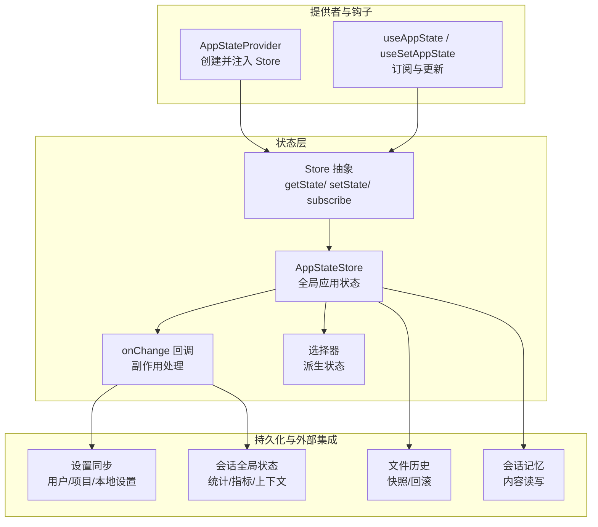
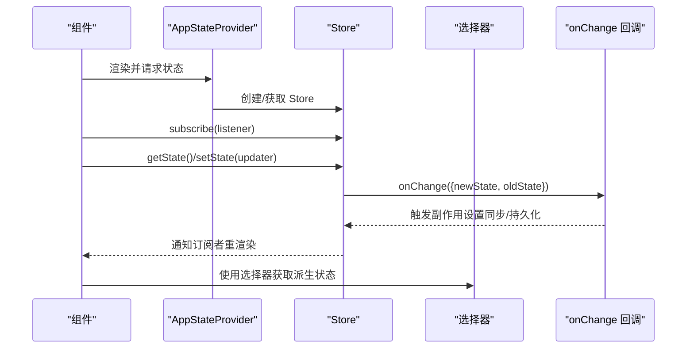
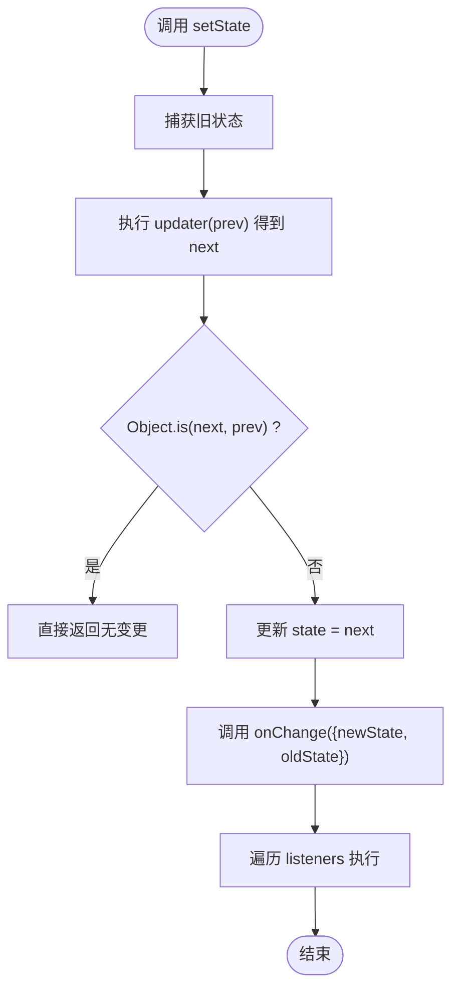
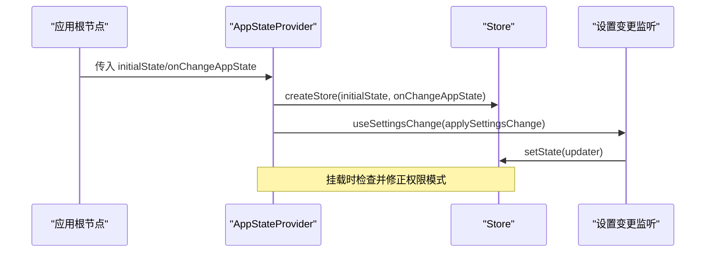
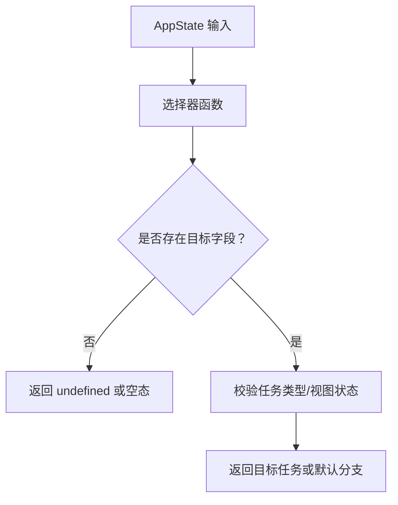
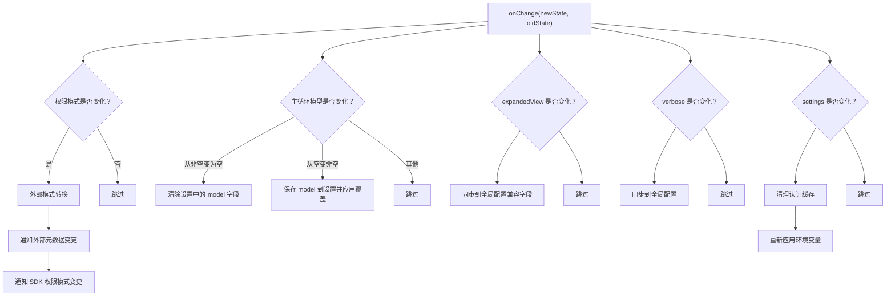
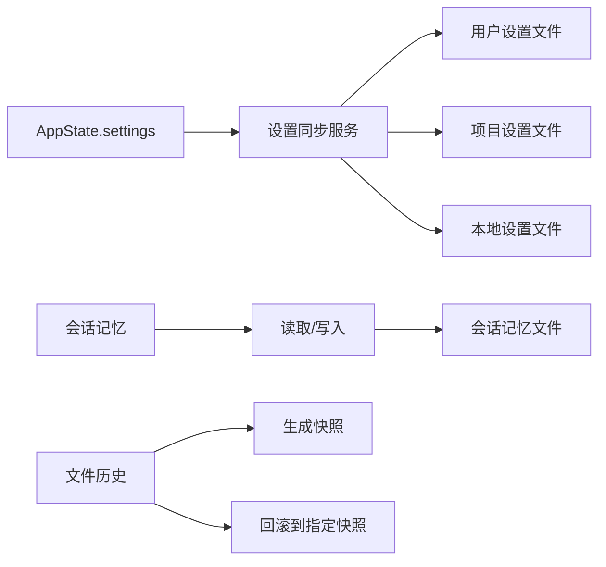
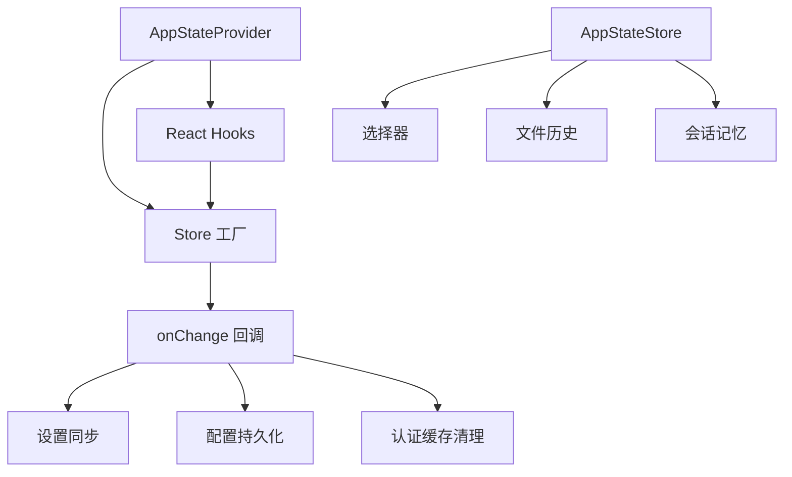

# 状态管理

<cite>
**本文引用的文件**
- [AppState.tsx](file://src/state/AppState.tsx)
- [store.ts](file://src/state/store.ts)
- [AppStateStore.ts](file://src/state/AppStateStore.ts)
- [selectors.ts](file://src/state/selectors.ts)
- [onChangeAppState.ts](file://src/state/onChangeAppState.ts)
- [state.ts](file://src/bootstrap/state.ts)
- [debug.ts](file://src/utils/debug.ts)
- [index.ts](file://src/services/settingsSync/index.ts)
- [sessionMemoryUtils.ts](file://src/services/SessionMemory/sessionMemoryUtils.ts)
- [fileHistory.ts](file://src/utils/fileHistory.ts)
</cite>

## 目录
1. [简介](#简介)
2. [项目结构](#项目结构)
3. [核心组件](#核心组件)
4. [架构总览](#架构总览)
5. [详细组件分析](#详细组件分析)
6. [依赖关系分析](#依赖关系分析)
7. [性能考量](#性能考量)
8. [故障排查指南](#故障排查指南)
9. [结论](#结论)
10. [附录](#附录)

## 简介
本文件系统性梳理 Claude Code 的状态管理系统，聚焦全局状态架构与实现细节，包括：
- AppState 类的设计模式、状态树结构与更新机制
- 状态存储与订阅模型（内存存储、变更回调）
- 状态选择器的实现原理与派生状态计算
- 变更监听与副作用处理（如设置同步、外部元数据同步）
- 持久化策略（设置、会话记忆、文件历史）
- 最佳实践（规范化、性能优化、调试技巧）
- 状态快照、回滚与时间旅行调试思路

## 项目结构
状态管理相关代码主要位于 src/state 目录，围绕一个轻量的通用 Store 抽象构建，并通过 React Hooks 提供订阅与更新能力；同时在 src/bootstrap 中维护另一套“会话级”全局状态，用于统计、指标与运行时上下文。

图表来源
- [AppState.tsx:37-110](file://src/state/AppState.tsx#L37-L110)
- [store.ts:10-34](file://src/state/store.ts#L10-L34)
- [AppStateStore.ts:454-456](file://src/state/AppStateStore.ts#L454-L456)
- [selectors.ts:18-78](file://src/state/selectors.ts#L18-L78)
- [onChangeAppState.ts:43-171](file://src/state/onChangeAppState.ts#L43-L171)
- [state.ts:428-429](file://src/bootstrap/state.ts#L428-L429)

章节来源
- [AppState.tsx:37-110](file://src/state/AppState.tsx#L37-L110)
- [store.ts:10-34](file://src/state/store.ts#L10-L34)
- [AppStateStore.ts:454-456](file://src/state/AppStateStore.ts#L454-L456)
- [selectors.ts:18-78](file://src/state/selectors.ts#L18-L78)
- [onChangeAppState.ts:43-171](file://src/state/onChangeAppState.ts#L43-L171)
- [state.ts:428-429](file://src/bootstrap/state.ts#L428-L429)

## 核心组件
- Store 抽象：提供 getState、setState、subscribe 三件套，支持 onChange 回调与订阅广播。
- AppStateStore：全局应用状态的类型与默认值，承载设置、任务、插件、通知、权限、桥接等多维信息。
- AppStateProvider：创建并注入 Store，提供 useAppState/useSetAppState/useAppStateStore 钩子。
- 选择器：纯函数从 AppState 派生派生状态，避免重复计算与不必要渲染。
- onChange 回调：集中处理模式切换、设置同步、配置持久化、缓存清理等副作用。

章节来源
- [store.ts:4-34](file://src/state/store.ts#L4-L34)
- [AppStateStore.ts:89-452](file://src/state/AppStateStore.ts#L89-L452)
- [AppState.tsx:37-110](file://src/state/AppState.tsx#L37-L110)
- [selectors.ts:18-78](file://src/state/selectors.ts#L18-L78)
- [onChangeAppState.ts:43-171](file://src/state/onChangeAppState.ts#L43-L171)

## 架构总览
AppStateProvider 负责创建 Store 并注入上下文；组件通过 useAppState 订阅状态切片，通过 useSetAppState 更新状态；onChange 回调统一处理跨模块副作用，确保外部系统（如 CCR 外部元数据、设置文件）与内部状态保持一致。

图表来源
- [AppState.tsx:37-110](file://src/state/AppState.tsx#L37-L110)
- [store.ts:10-34](file://src/state/store.ts#L10-L34)
- [onChangeAppState.ts:43-171](file://src/state/onChangeAppState.ts#L43-L171)
- [selectors.ts:18-78](file://src/state/selectors.ts#L18-L78)

## 详细组件分析

### Store 抽象与订阅模型
- 设计要点
  - setState 前后使用 Object.is 判断是否变化，避免无意义重渲染。
  - onChange 在状态变更后被调用，传入新旧状态，便于集中处理副作用。
  - subscribe 维护监听集合，返回取消订阅函数。
- 性能特性
  - 订阅粒度由选择器决定，仅当所选切片变化时触发重渲染。
  - 通过 useSyncExternalStore 与 React 协作，保证并发安全与一致性。

图表来源
- [store.ts:20-27](file://src/state/store.ts#L20-L27)

章节来源
- [store.ts:4-34](file://src/state/store.ts#L4-L34)

### AppStateProvider 与 React 集成
- 功能
  - 创建并注入 AppStateStore 上下文。
  - 在挂载时根据远程设置修正“绕过权限模式”等敏感开关。
  - 将设置变更事件桥接到 AppState.setState，确保文件监听等外部变更可传播到状态树。
- 错误处理
  - 禁止嵌套 Provider。
  - 未包裹在 Provider 内调用钩子会抛出错误。

图表来源
- [AppState.tsx:37-110](file://src/state/AppState.tsx#L37-L110)

章节来源
- [AppState.tsx:37-110](file://src/state/AppState.tsx#L37-L110)

### 状态选择器与派生状态
- 设计原则
  - 选择器必须是纯函数，只做数据提取，不做副作用。
  - 返回现有对象引用而非新建对象，避免 Object.is 总是视为不同导致的不必要渲染。
- 典型场景
  - 获取当前查看的队友任务。
  - 根据当前视图与任务状态，判断输入应路由到领导者或特定代理。

图表来源
- [selectors.ts:18-78](file://src/state/selectors.ts#L18-L78)

章节来源
- [selectors.ts:18-78](file://src/state/selectors.ts#L18-L78)

### 变更监听与副作用处理
- onChange 回调职责
  - 同步权限模式到外部系统（CCR 外部元数据、SDK 状态流）。
  - 同步主循环模型到设置与覆盖。
  - 同步 UI 展示偏好到全局配置。
  - 设置变更时清理认证相关缓存并重新应用环境变量。
- 外部元数据映射
  - 将外部元数据转换为内部状态的一部分，保证跨进程/通道的一致性。

图表来源
- [onChangeAppState.ts:43-171](file://src/state/onChangeAppState.ts#L43-L171)

章节来源
- [onChangeAppState.ts:43-171](file://src/state/onChangeAppState.ts#L43-L171)

### 状态树结构与关键域
- 关键域概览（节选）
  - settings、verbose、mainLoopModel、statusLineText、expandedView、isBriefOnly、selectedIPAgentIndex、coordinatorTaskIndex、viewSelectionMode、footerSelection、toolPermissionContext、spinnerTip、agent、kairosEnabled、remoteSessionUrl、remoteConnectionStatus、remoteBackgroundTaskCount、replBridge* 系列、mcp/plugins/todos/notifications/elicitation、promptSuggestion、speculation、sessionHooks、tungstenBagel 系列、computerUseMcpState、replContext、teamContext、inbox、workerSandboxPermissions、pendingWorkerRequest/pendingSandboxRequest、promptSuggestion、speculation、skillImprovement、authVersion、initialMessage、pendingPlanVerification、denialTracking、activeOverlays、fastMode、advisorModel、effortValue、ultraplan* 系列、权限回调等。
- 默认状态
  - getDefaultAppState 提供初始状态，含设置、任务、插件、通知、提示词建议、权限上下文、文件历史、归因、收件箱、沙箱权限队列、提示词建议、推测状态等。

章节来源
- [AppStateStore.ts:89-452](file://src/state/AppStateStore.ts#L89-L452)
- [AppStateStore.ts:456-569](file://src/state/AppStateStore.ts#L456-L569)

### 状态存储机制与持久化策略
- 内存存储
  - Store 本身为内存态，不自动落盘；适合 UI 与业务逻辑的瞬时状态。
- 设置持久化
  - 用户设置、项目设置、本地设置分别对应不同文件路径，onChange 中按需同步到磁盘。
- 会话记忆
  - 会话记忆内容可读取/写入，支持等待提取完成、超时控制与错误处理。
- 文件历史
  - 快照记录与回滚，支持基于消息 ID 的定位与恢复，包含备份文件解析、存在性探测与变更检测。

图表来源
- [index.ts:423-469](file://src/services/settingsSync/index.ts#L423-L469)
- [sessionMemoryUtils.ts:110-138](file://src/services/SessionMemory/sessionMemoryUtils.ts#L110-L138)
- [fileHistory.ts:366-560](file://src/utils/fileHistory.ts#L366-L560)

章节来源
- [index.ts:423-469](file://src/services/settingsSync/index.ts#L423-L469)
- [sessionMemoryUtils.ts:110-138](file://src/services/SessionMemory/sessionMemoryUtils.ts#L110-L138)
- [fileHistory.ts:366-560](file://src/utils/fileHistory.ts#L366-L560)

### 会话全局状态（Bootstrap）
- 作用域
  - 与 AppState 不同，bootstrap/state.ts 管理“会话生命周期”的全局状态，如成本、时延、工具耗时、交互时间、统计计数器、会话标识、计划/技能缓存、慢操作列表等。
- 特点
  - 采用单例状态对象，提供读写接口；部分字段为会话内临时状态，不持久化。
  - 与 AppState 协同：前者负责 UI/功能状态，后者负责会话统计与运行时上下文。

章节来源
- [state.ts:428-429](file://src/bootstrap/state.ts#L428-L429)
- [state.ts:258-426](file://src/bootstrap/state.ts#L258-L426)

## 依赖关系分析
- 组件耦合
  - AppStateProvider 依赖 Store 工厂与 onChange 回调；useAppState/useSetAppState/useAppStateStore 依赖上下文。
  - 选择器对 AppState 的局部依赖，避免全量重渲染。
- 外部依赖
  - onChange 回调依赖设置同步、配置持久化、认证缓存清理、外部元数据通知等模块。
- 潜在风险
  - 选择器返回新对象会导致渲染抖动；订阅粒度过细可能增加订阅数量但提升性能收益。
  - onChange 中的副作用需幂等，避免重复写入与竞态。

图表来源
- [AppState.tsx:37-110](file://src/state/AppState.tsx#L37-L110)
- [store.ts:10-34](file://src/state/store.ts#L10-L34)
- [onChangeAppState.ts:43-171](file://src/state/onChangeAppState.ts#L43-L171)
- [selectors.ts:18-78](file://src/state/selectors.ts#L18-L78)

章节来源
- [AppState.tsx:37-110](file://src/state/AppState.tsx#L37-L110)
- [store.ts:10-34](file://src/state/store.ts#L10-L34)
- [onChangeAppState.ts:43-171](file://src/state/onChangeAppState.ts#L43-L171)
- [selectors.ts:18-78](file://src/state/selectors.ts#L18-L78)

## 性能考量
- 选择器与订阅
  - 仅订阅所需切片，避免全量订阅；返回现有对象引用，减少渲染。
  - 对于复杂派生，考虑使用 useMemo 缓存中间结果，降低选择器开销。
- setState 优化
  - 使用不可变更新策略，避免深层对象频繁重建；必要时拆分状态以缩小订阅范围。
- onChange 副作用
  - 将昂贵操作异步化，批量写入磁盘或网络；对重复写入进行去重。
- 调试与可观测性
  - 使用调试日志与最小日志级别控制，避免高频输出影响性能。
  - 对慢操作进行采样与 TTL 管理，保持稳定引用以减少渲染。

[本节为通用指导，无需列出具体文件来源]

## 故障排查指南
- 常见问题
  - 嵌套 Provider：抛出错误，确保仅有一层 AppStateProvider。
  - 非 Provider 环境使用钩子：useAppState/useSetAppState 会在未找到上下文时抛错。
  - 选择器返回新对象：导致渲染抖动，应返回现有引用。
  - onChange 副作用未生效：确认 onChange 是否被调用、外部元数据通知是否成功、设置文件写入是否被拦截。
- 调试技巧
  - 启用调试日志：通过环境变量或命令行参数开启，观察状态变更轨迹。
  - 使用最小日志级别：过滤冗余输出，聚焦关键信息。
  - 分模块验证：先验证设置同步、再验证外部元数据同步，最后验证 UI 呈现。

章节来源
- [AppState.tsx:120-124](file://src/state/AppState.tsx#L120-L124)
- [AppState.tsx:186-199](file://src/state/AppState.tsx#L186-L199)
- [debug.ts:44-57](file://src/utils/debug.ts#L44-L57)
- [debug.ts:91-102](file://src/utils/debug.ts#L91-L102)

## 结论
该状态管理体系以轻量 Store 为核心，结合 React Hooks 实现高效订阅与更新；通过 onChange 回调集中处理跨模块副作用，配合设置同步、会话记忆与文件历史等持久化策略，形成从 UI 到运行时的完整闭环。遵循选择器纯函数、返回现有引用、拆分状态与异步副作用等最佳实践，可在保证性能的同时提升可维护性与可观测性。

[本节为总结，无需列出具体文件来源]

## 附录

### 状态快照、回滚与时间旅行调试
- 快照与回滚
  - 文件历史模块提供快照生成与回滚能力，支持基于消息 ID 的定位与恢复。
  - 回滚前进行备份文件解析、存在性探测与变更检测，失败时记录事件并抛出错误。
- 时间旅行调试
  - 当前实现以文件历史为主；若需 UI 级时间旅行，可在 onChange 中收集变更历史并在 UI 中提供“撤销/重做”入口（需额外实现）。

章节来源
- [fileHistory.ts:366-560](file://src/utils/fileHistory.ts#L366-L560)