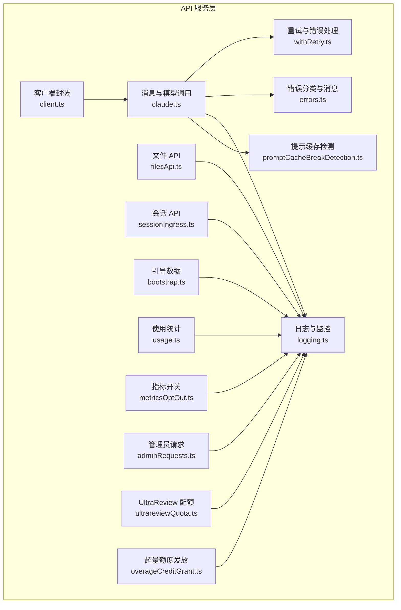
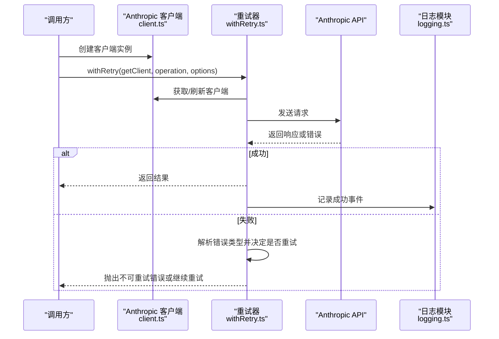
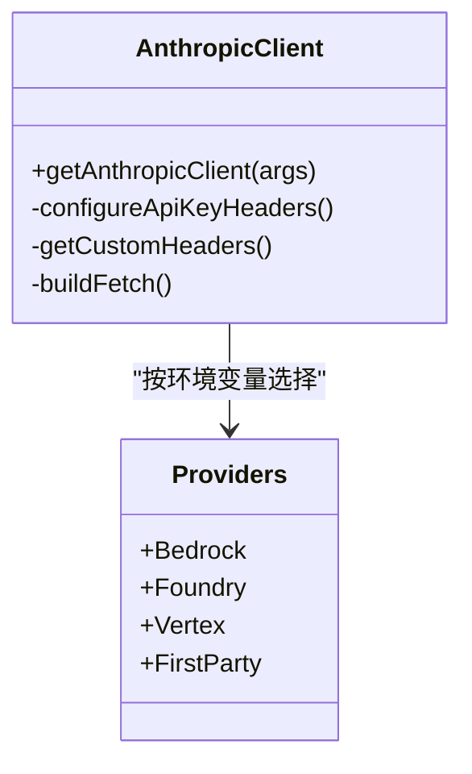
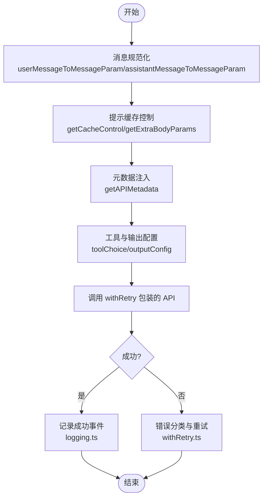
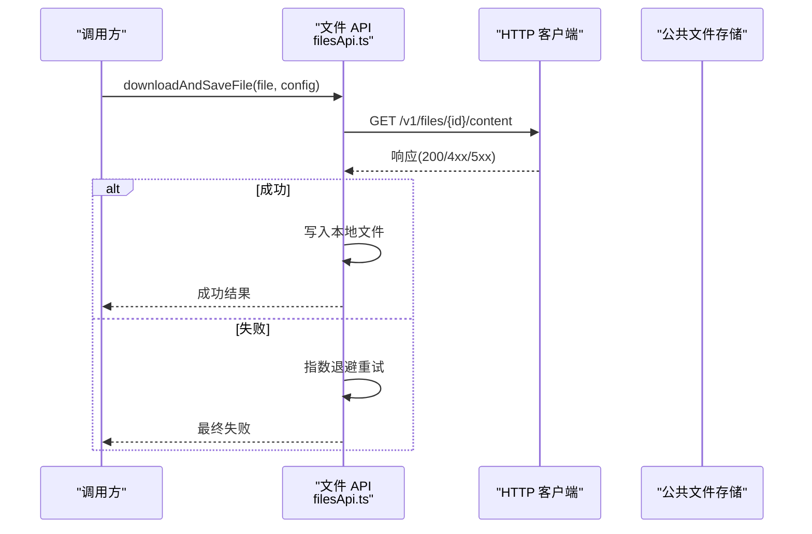
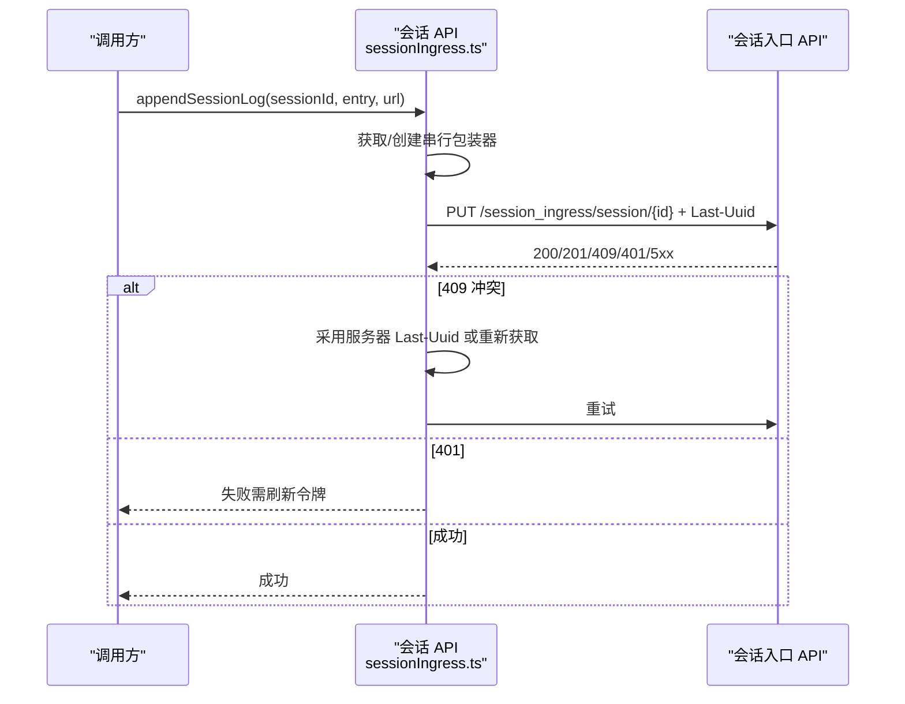
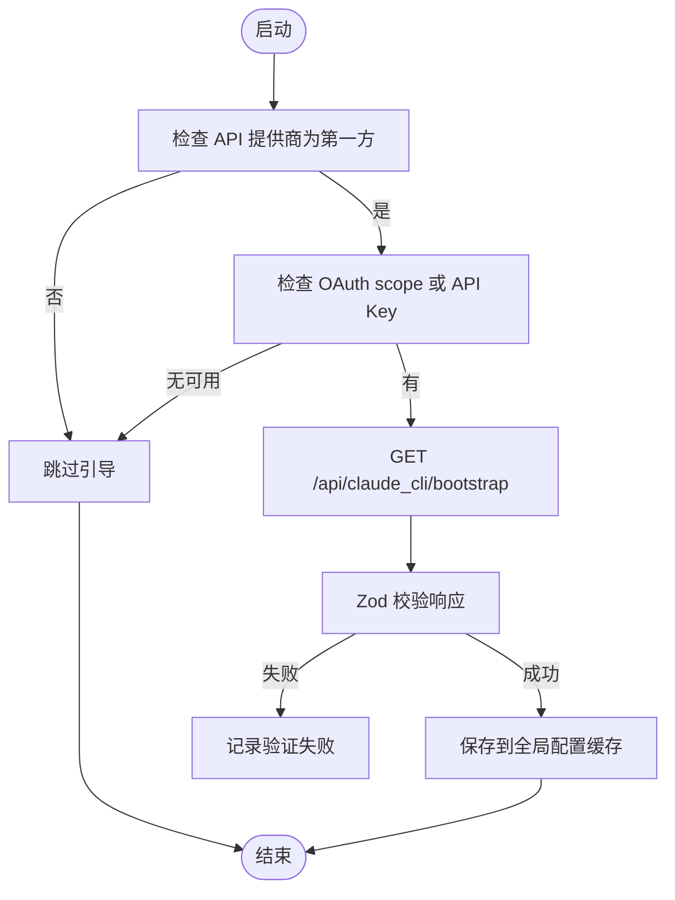
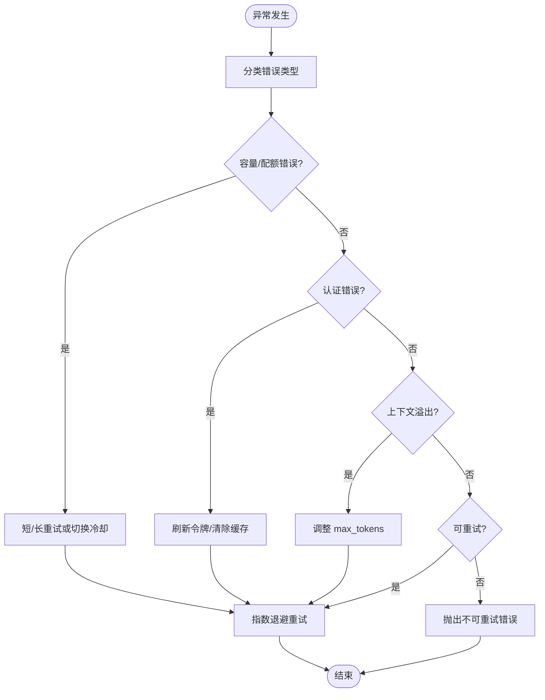
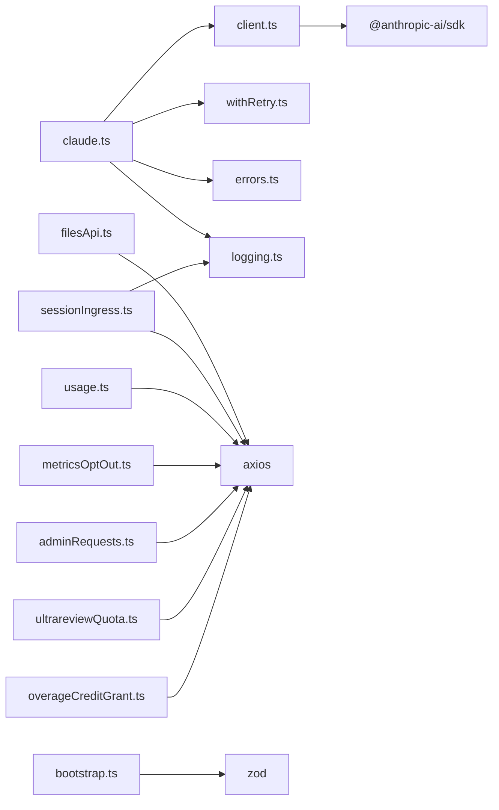

# API 服务

<cite>
**本文档引用的文件**
- [client.ts](file://src/services/api/client.ts)
- [claude.ts](file://src/services/api/claude.ts)
- [filesApi.ts](file://src/services/api/filesApi.ts)
- [sessionIngress.ts](file://src/services/api/sessionIngress.ts)
- [bootstrap.ts](file://src/services/api/bootstrap.ts)
- [usage.ts](file://src/services/api/usage.ts)
- [withRetry.ts](file://src/services/api/withRetry.ts)
- [errors.ts](file://src/services/api/errors.ts)
- [logging.ts](file://src/services/api/logging.ts)
- [emptyUsage.ts](file://src/services/api/emptyUsage.ts)
- [promptCacheBreakDetection.ts](file://src/services/api/promptCacheBreakDetection.ts)
- [metricsOptOut.ts](file://src/services/api/metricsOptOut.ts)
- [ultrareviewQuota.ts](file://src/services/api/ultrareviewQuota.ts)
- [overageCreditGrant.ts](file://src/services/api/overageCreditGrant.ts)
- [adminRequests.ts](file://src/services/api/adminRequests.ts)
</cite>

## 目录
1. [简介](#简介)
2. [项目结构](#项目结构)
3. [核心组件](#核心组件)
4. [架构总览](#架构总览)
5. [详细组件分析](#详细组件分析)
6. [依赖关系分析](#依赖关系分析)
7. [性能考虑](#性能考虑)
8. [故障排除指南](#故障排除指南)
9. [结论](#结论)
10. [附录](#附录)

## 简介
本文件为 Claude Code 的 API 服务模块提供系统化技术文档，覆盖 REST API 客户端架构、Anthropic API 客户端、文件 API、会话 API、认证机制、错误处理与重试逻辑、引导流程、会话管理与使用统计集成、速率限制与缓存策略、性能优化以及版本管理与迁移指南。文档面向不同技术背景的读者，既提供高层概览也包含代码级细节与可视化图示。

## 项目结构
API 服务模块位于 `src/services/api/` 目录下，围绕以下关键子系统组织：
- 客户端与认证：Anthropic SDK 客户端封装、多云提供商适配、OAuth/令牌刷新、自定义头部注入
- 消息与模型调用：消息规范化、工具与输出配置、思考模式、任务预算、提示缓存控制
- 文件 API：下载/上传/列出文件（含并发与指数退避）
- 会话 API：会话日志持久化、获取与并发控制、遥测事件
- 引导与使用统计：引导数据拉取、使用量查询、指标开关
- 错误处理与重试：统一错误分类、容量与配额错误处理、持久重试与心跳
- 日志与监控：API 查询/成功/失败事件、OTel 事件、Beta 追踪
- 缓存与性能：提示缓存策略、命中/未命中检测、缓存破坏分析
- 管理与配额：管理员请求、超量额度发放、UltraReview 配额

**图表来源**
- [client.ts:88-316](file://src/services/api/client.ts#L88-L316)
- [claude.ts:709-780](file://src/services/api/claude.ts#L709-L780)
- [filesApi.ts:1-120](file://src/services/api/filesApi.ts#L1-L120)
- [sessionIngress.ts:1-60](file://src/services/api/sessionIngress.ts#L1-L60)
- [withRetry.ts:170-257](file://src/services/api/withRetry.ts#L170-L257)
- [errors.ts:425-525](file://src/services/api/errors.ts#L425-L525)
- [logging.ts:171-233](file://src/services/api/logging.ts#L171-L233)
- [promptCacheBreakDetection.ts:247-430](file://src/services/api/promptCacheBreakDetection.ts#L247-L430)
- [bootstrap.ts:42-109](file://src/services/api/bootstrap.ts#L42-L109)
- [usage.ts:33-63](file://src/services/api/usage.ts#L33-L63)
- [metricsOptOut.ts:128-154](file://src/services/api/metricsOptOut.ts#L128-L154)
- [adminRequests.ts:49-92](file://src/services/api/adminRequests.ts#L49-L92)
- [ultrareviewQuota.ts:19-38](file://src/services/api/ultrareviewQuota.ts#L19-L38)
- [overageCreditGrant.ts:48-121](file://src/services/api/overageCreditGrant.ts#L48-L121)

**章节来源**
- [client.ts:1-403](file://src/services/api/client.ts#L1-L403)
- [claude.ts:1-800](file://src/services/api/claude.ts#L1-L800)
- [filesApi.ts:1-750](file://src/services/api/filesApi.ts#L1-L750)
- [sessionIngress.ts:1-516](file://src/services/api/sessionIngress.ts#L1-L516)
- [withRetry.ts:1-824](file://src/services/api/withRetry.ts#L1-L824)
- [errors.ts:1-1209](file://src/services/api/errors.ts#L1-L1209)
- [logging.ts:1-790](file://src/services/api/logging.ts#L1-L790)
- [promptCacheBreakDetection.ts:1-729](file://src/services/api/promptCacheBreakDetection.ts#L1-L729)
- [bootstrap.ts:1-143](file://src/services/api/bootstrap.ts#L1-L143)
- [usage.ts:1-65](file://src/services/api/usage.ts#L1-L65)
- [metricsOptOut.ts:1-161](file://src/services/api/metricsOptOut.ts#L1-L161)
- [ultrareviewQuota.ts:1-40](file://src/services/api/ultrareviewQuota.ts#L1-L40)
- [overageCreditGrant.ts:1-139](file://src/services/api/overageCreditGrant.ts#L1-L139)
- [adminRequests.ts:1-121](file://src/services/api/adminRequests.ts#L1-L121)

## 核心组件
- Anthropic 客户端封装：支持第一方 API、AWS Bedrock、Azure Foundry、Google Cloud Vertex；自动注入会话标识、用户代理、自定义头部；支持 x402 支付处理与客户端请求 ID 关联
- 模型调用与消息处理：消息规范化、工具与输出配置、思考模式、任务预算、提示缓存控制、元数据注入
- 文件 API：下载/上传/列出文件，带并发限制与指数退避重试，路径安全校验
- 会话 API：JWT 令牌驱动的日志追加与获取，乐观并发控制（Last-Uuid），序列化写入
- 引导与使用统计：引导数据磁盘缓存、使用量查询、指标开关
- 错误处理与重试：统一错误分类、容量/配额/上下文溢出处理、持久重试与心跳
- 日志与监控：API 查询/成功/失败事件、OTel 事件、Beta 追踪
- 缓存与性能：提示缓存策略、命中/未命中检测、缓存破坏分析与差异记录

**章节来源**
- [client.ts:88-316](file://src/services/api/client.ts#L88-L316)
- [claude.ts:676-780](file://src/services/api/claude.ts#L676-L780)
- [filesApi.ts:125-345](file://src/services/api/filesApi.ts#L125-L345)
- [sessionIngress.ts:57-186](file://src/services/api/sessionIngress.ts#L57-L186)
- [bootstrap.ts:114-141](file://src/services/api/bootstrap.ts#L114-L141)
- [usage.ts:33-63](file://src/services/api/usage.ts#L33-L63)
- [withRetry.ts:170-517](file://src/services/api/withRetry.ts#L170-L517)
- [logging.ts:171-233](file://src/services/api/logging.ts#L171-L233)
- [promptCacheBreakDetection.ts:437-666](file://src/services/api/promptCacheBreakDetection.ts#L437-L666)

## 架构总览
REST API 客户端通过统一的 Anthropic 客户端封装访问多种后端（第一方 API、Bedrock、Foundry、Vertex）。消息与工具在发送前进行规范化与缓存控制，调用过程由重试器统一处理错误与退避。文件与会话 API 分别提供附件管理与日志持久化能力，并通过日志模块记录事件与遥测。

**图表来源**
- [client.ts:88-152](file://src/services/api/client.ts#L88-L152)
- [withRetry.ts:170-257](file://src/services/api/withRetry.ts#L170-L257)
- [logging.ts:581-640](file://src/services/api/logging.ts#L581-L640)

## 详细组件分析

### Anthropic 客户端封装与认证
- 多提供商支持：根据环境变量选择第一方 API、Bedrock、Foundry 或 Vertex；自动注入区域、凭据与头部
- 自动认证：OAuth 令牌刷新、API Key 辅助、自定义头部解析；支持额外保护头与调试日志
- 请求增强：x402 支付处理包装、客户端请求 ID 注入、调试日志输出
- 会话关联：注入会话 ID、容器 ID、远程会话 ID，便于服务端关联与审计

**图表来源**
- [client.ts:88-316](file://src/services/api/client.ts#L88-L316)

**章节来源**
- [client.ts:32-71](file://src/services/api/client.ts#L32-L71)
- [client.ts:88-152](file://src/services/api/client.ts#L88-L152)
- [client.ts:318-401](file://src/services/api/client.ts#L318-L401)

### 模型调用与消息处理
- 消息规范化：用户/助手消息转换为 API 参数，支持提示缓存控制与内容克隆
- 工具与输出：工具权限上下文、输出格式、任务预算、思考模式、努力级别
- 元数据与头部：设备 ID、账户 UUID、会话 ID、Beta 头部、额外体参数
- 无流式与流式调用：分别返回完整消息与流式事件生成器

**图表来源**
- [claude.ts:588-674](file://src/services/api/claude.ts#L588-L674)
- [claude.ts:709-780](file://src/services/api/claude.ts#L709-L780)
- [logging.ts:581-640](file://src/services/api/logging.ts#L581-L640)
- [withRetry.ts:170-257](file://src/services/api/withRetry.ts#L170-L257)

**章节来源**
- [claude.ts:588-674](file://src/services/api/claude.ts#L588-L674)
- [claude.ts:676-780](file://src/services/api/claude.ts#L676-L780)
- [claude.ts:503-528](file://src/services/api/claude.ts#L503-L528)

### 文件 API（公共文件）
- 下载：支持指数退避重试、状态码区分、路径安全校验、会话目录隔离
- 并发上传：并发限制、边界构建、大小校验、非可重试错误快速失败
- 列表：分页游标、鉴权与错误处理
- 规范化：文件规格解析、路径归一化、防路径穿越

**图表来源**
- [filesApi.ts:132-180](file://src/services/api/filesApi.ts#L132-L180)
- [filesApi.ts:219-267](file://src/services/api/filesApi.ts#L219-L267)

**章节来源**
- [filesApi.ts:125-345](file://src/services/api/filesApi.ts#L125-L345)
- [filesApi.ts:347-593](file://src/services/api/filesApi.ts#L347-L593)
- [filesApi.ts:595-750](file://src/services/api/filesApi.ts#L595-L750)

### 会话 API（会话日志）
- JWT 令牌：基于会话令牌的授权与内容类型设置
- 乐观并发：Last-Uuid 头部，冲突时采用服务器最新 UUID 或重新获取
- 序列化写入：按会话串行化追加，避免竞态
- 获取与回退：支持直接获取与 OAuth 回退路径

**图表来源**
- [sessionIngress.ts:63-186](file://src/services/api/sessionIngress.ts#L63-L186)
- [sessionIngress.ts:193-212](file://src/services/api/sessionIngress.ts#L193-L212)

**章节来源**
- [sessionIngress.ts:57-186](file://src/services/api/sessionIngress.ts#L57-L186)
- [sessionIngress.ts:214-259](file://src/services/api/sessionIngress.ts#L214-L259)
- [sessionIngress.ts:280-415](file://src/services/api/sessionIngress.ts#L280-L415)

### 引导流程与使用统计
- 引导数据：仅在第一方提供商且具备 OAuth scope 时拉取，缓存到磁盘，避免重复写入
- 使用统计：订阅者且具备 profile scope 时查询使用量，过期令牌跳过以避免 401

**图表来源**
- [bootstrap.ts:42-109](file://src/services/api/bootstrap.ts#L42-L109)
- [bootstrap.ts:114-141](file://src/services/api/bootstrap.ts#L114-L141)

**章节来源**
- [bootstrap.ts:19-38](file://src/services/api/bootstrap.ts#L19-L38)
- [bootstrap.ts:42-109](file://src/services/api/bootstrap.ts#L42-L109)
- [bootstrap.ts:114-141](file://src/services/api/bootstrap.ts#L114-L141)
- [usage.ts:33-63](file://src/services/api/usage.ts#L33-L63)

### 错误处理与重试逻辑
- 统一错误分类：超时、媒体尺寸、提示过长、PDF/图像问题、工具并发、无效模型名、余额不足、组织禁用等
- 重试策略：指数退避、最大重试次数、持久重试（企业/未登录场景）、容量错误（429/529）分流
- 上下文溢出：动态调整 max_tokens，确保思考与输出空间
- 快速模式：在容量压力下切换冷却或禁用，避免缓存抖动

**图表来源**
- [errors.ts:425-525](file://src/services/api/errors.ts#L425-L525)
- [withRetry.ts:170-257](file://src/services/api/withRetry.ts#L170-L257)
- [withRetry.ts:384-427](file://src/services/api/withRetry.ts#L384-L427)

**章节来源**
- [errors.ts:425-525](file://src/services/api/errors.ts#L425-L525)
- [withRetry.ts:170-257](file://src/services/api/withRetry.ts#L170-L257)
- [withRetry.ts:384-427](file://src/services/api/withRetry.ts#L384-L427)

### 日志与监控
- 查询事件：模型、消息长度、温度、Beta 头部、权限模式、查询来源、思考/努力/快速模式
- 成功事件：输入/输出/缓存读取/创建令牌、耗时、尝试次数、停止原因、成本、网关类型
- 失败事件：错误类型、状态码、客户端请求 ID、重试次数、提示类别、网关类型
- OTel 事件：API 请求与错误事件，用于外部可观测性
- Beta 追踪：可选提取模型输出/思考输出/工具调用标记

**章节来源**
- [logging.ts:171-233](file://src/services/api/logging.ts#L171-L233)
- [logging.ts:235-396](file://src/services/api/logging.ts#L235-L396)
- [logging.ts:398-788](file://src/services/api/logging.ts#L398-L788)

### 提示缓存策略与破坏检测
- 缓存控制：按查询来源与用户资格决定 1 小时/5 分钟 TTL 与作用域（全局/组织/无）
- 破坏检测：记录上次系统/工具/模型/快模式/缓存控制/全局缓存策略/Beta/努力/额外体参数快照，比较前后缓存读取令牌变化
- 差异记录：生成 diff 文件辅助调试，标注可能的 TTL 到期或服务器侧原因

**章节来源**
- [claude.ts:358-434](file://src/services/api/claude.ts#L358-L434)
- [promptCacheBreakDetection.ts:247-430](file://src/services/api/promptCacheBreakDetection.ts#L247-L430)
- [promptCacheBreakDetection.ts:437-666](file://src/services/api/promptCacheBreakDetection.ts#L437-L666)

### 管理与配额集成
- 管理员请求：限流提升/席位升级申请，支持查询与资格检查
- 超量额度发放：组织级配额信息缓存与格式化展示
- UltraReview 配额：订阅者查看评审配额与剩余

**章节来源**
- [adminRequests.ts:49-92](file://src/services/api/adminRequests.ts#L49-L92)
- [overageCreditGrant.ts:48-121](file://src/services/api/overageCreditGrant.ts#L48-L121)
- [ultrareviewQuota.ts:19-38](file://src/services/api/ultrareviewQuota.ts#L19-L38)

## 依赖关系分析
- 组件耦合：客户端封装对认证与环境变量强依赖；模型调用依赖重试器与日志模块；文件/会话 API 独立但共享日志模块
- 外部依赖：Anthropic SDK、Axios、Google Auth、Azure Identity、Zod 校验
- 循环依赖：未发现循环导入；各模块职责清晰，通过函数/类接口交互

**图表来源**
- [client.ts:1-20](file://src/services/api/client.ts#L1-L20)
- [claude.ts:1-25](file://src/services/api/claude.ts#L1-L25)
- [filesApi.ts:10-15](file://src/services/api/filesApi.ts#L10-L15)
- [sessionIngress.ts:1-10](file://src/services/api/sessionIngress.ts#L1-L10)
- [bootstrap.ts:8-17](file://src/services/api/bootstrap.ts#L8-L17)
- [usage.ts:1-5](file://src/services/api/usage.ts#L1-L5)
- [metricsOptOut.ts:1-7](file://src/services/api/metricsOptOut.ts#L1-L7)
- [adminRequests.ts:1-4](file://src/services/api/adminRequests.ts#L1-L4)
- [ultrareviewQuota.ts:1-5](file://src/services/api/ultrareviewQuota.ts#L1-L5)
- [overageCreditGrant.ts:1-7](file://src/services/api/overageCreditGrant.ts#L1-L7)

**章节来源**
- [client.ts:1-20](file://src/services/api/client.ts#L1-L20)
- [claude.ts:1-25](file://src/services/api/claude.ts#L1-L25)
- [filesApi.ts:10-15](file://src/services/api/filesApi.ts#L10-L15)
- [sessionIngress.ts:1-10](file://src/services/api/sessionIngress.ts#L1-L10)
- [bootstrap.ts:8-17](file://src/services/api/bootstrap.ts#L8-L17)
- [usage.ts:1-5](file://src/services/api/usage.ts#L1-L5)
- [metricsOptOut.ts:1-7](file://src/services/api/metricsOptOut.ts#L1-L7)
- [adminRequests.ts:1-4](file://src/services/api/adminRequests.ts#L1-L4)
- [ultrareviewQuota.ts:1-5](file://src/services/api/ultrareviewQuota.ts#L1-L5)
- [overageCreditGrant.ts:1-7](file://src/services/api/overageCreditGrant.ts#L1-L7)

## 性能考虑
- 并发与限流：文件上传/下载默认并发 5，避免过度占用带宽与连接池
- 指数退避：API 调用与文件操作均采用指数退避，结合抖动降低同步风暴
- 缓存策略：提示缓存 TTL 与作用域按用户资格与来源动态选择，减少重复计算
- 快速模式：在容量压力下自动切换冷却或禁用，避免缓存抖动与服务端过载
- 日志与遥测：事件聚合与 OTel 输出，避免高频细粒度日志影响性能

[本节为通用指导，无需特定文件引用]

## 故障排除指南
- 认证失败：检查 OAuth 令牌刷新、API Key 辅助、自定义头部；必要时清除缓存后重试
- 速率限制：区分容量错误与配额错误，按来源与用户类型采取短/长重试或降级
- 上下文溢出：自动调整 max_tokens，确保思考与输出空间；必要时精简上下文
- 文件操作：路径校验失败、大小超限、网络错误；查看重试日志与错误详情
- 会话持久化：409 冲突时采用服务器最新 UUID；401 令牌失效需刷新

**章节来源**
- [errors.ts:425-525](file://src/services/api/errors.ts#L425-L525)
- [withRetry.ts:170-257](file://src/services/api/withRetry.ts#L170-L257)
- [filesApi.ts:125-180](file://src/services/api/filesApi.ts#L125-L180)
- [sessionIngress.ts:57-186](file://src/services/api/sessionIngress.ts#L57-L186)

## 结论
本 API 服务模块通过统一的客户端封装与完善的错误处理/重试机制，实现了对 Anthropic 多后端的稳定接入；文件与会话 API 提供了可靠的附件与日志能力；缓存与指标体系保障了性能与可观测性。建议在生产环境中结合速率限制与缓存策略，合理配置并发与重试参数，并持续关注错误分类与日志事件以优化用户体验。

[本节为总结性内容，无需特定文件引用]

## 附录

### API 调用示例与规范
- 请求格式
  - 头部：Authorization（Bearer/OAuth）、anthropic-version、anthropic-beta、User-Agent、x-app、x-client-request-id（第一方 API）
  - 体参数：messages、model、max_tokens、temperature、tools、metadata、betas、output_config、anthropic_beta 等
- 响应结构
  - 成功：包含 content、usage、model、stop_reason、request_id 等
  - 失败：错误类型、状态码、错误详情（如提示过长、媒体尺寸、工具并发等）
- 错误码处理
  - 400：无效请求（模型名、工具并发、媒体尺寸等）
  - 401/403：认证失败/令牌撤销
  - 408/409：超时/锁冲突
  - 413：请求过大
  - 429/529：速率限制/容量过载
  - 5xx：服务器内部错误

**章节来源**
- [client.ts:104-116](file://src/services/api/client.ts#L104-L116)
- [errors.ts:425-525](file://src/services/api/errors.ts#L425-L525)
- [logging.ts:235-396](file://src/services/api/logging.ts#L235-L396)

### 速率限制与缓存策略
- 速率限制：按用户类型与来源区分重试策略；新统一配额头提供更精确的配额与重置时间
- 缓存策略：按来源与用户资格选择 TTL（1 小时/5 分钟）与作用域（全局/组织/无），并记录缓存破坏原因
- 性能优化：并发限制、指数退避、上下文溢出自动调整、快速模式冷却

**章节来源**
- [withRetry.ts:696-787](file://src/services/api/withRetry.ts#L696-L787)
- [claude.ts:358-434](file://src/services/api/claude.ts#L358-L434)
- [promptCacheBreakDetection.ts:437-666](file://src/services/api/promptCacheBreakDetection.ts#L437-L666)

### 版本管理、向后兼容与迁移
- 版本管理：anthropic-version 固定；Beta 头部用于功能开关与向后兼容
- 向后兼容：统一错误分类与消息格式，保留旧字段与兼容路径
- 迁移指南：从会话入口迁移到 CCR v2 Sessions API，支持分页与回退；提示缓存 TTL 与作用域变更需评估影响

**章节来源**
- [filesApi.ts:25-28](file://src/services/api/filesApi.ts#L25-L28)
- [sessionIngress.ts:280-415](file://src/services/api/sessionIngress.ts#L280-L415)
- [claude.ts:358-434](file://src/services/api/claude.ts#L358-L434)