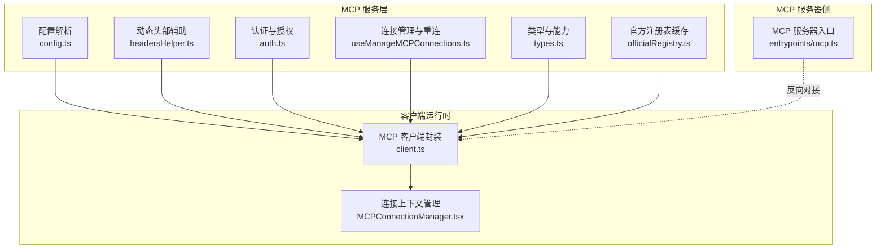
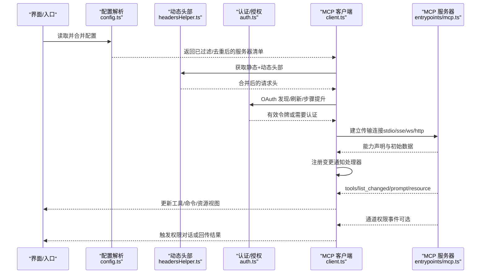
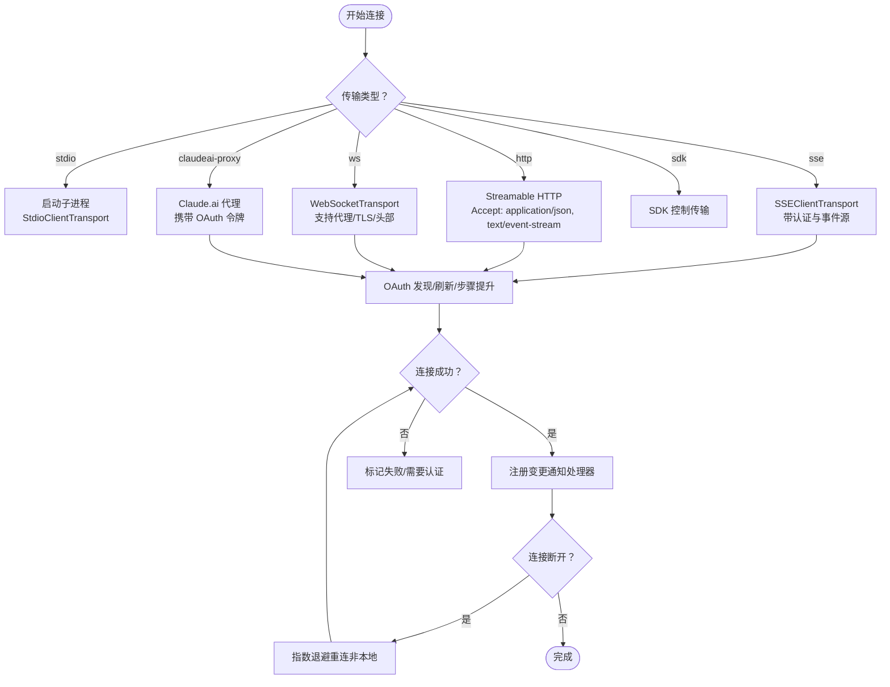
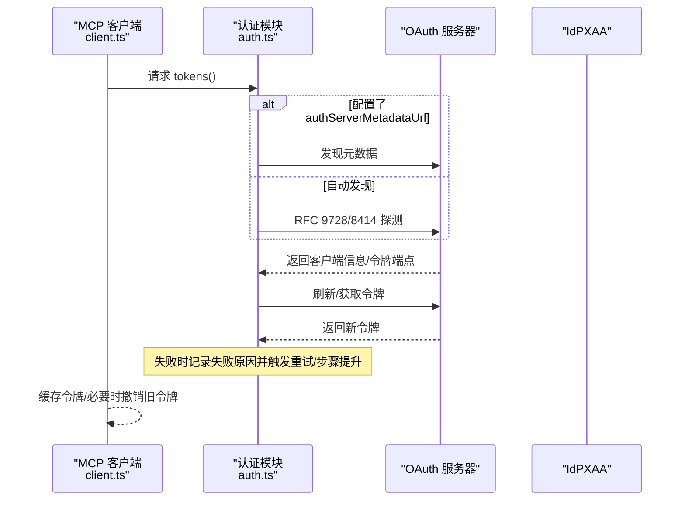
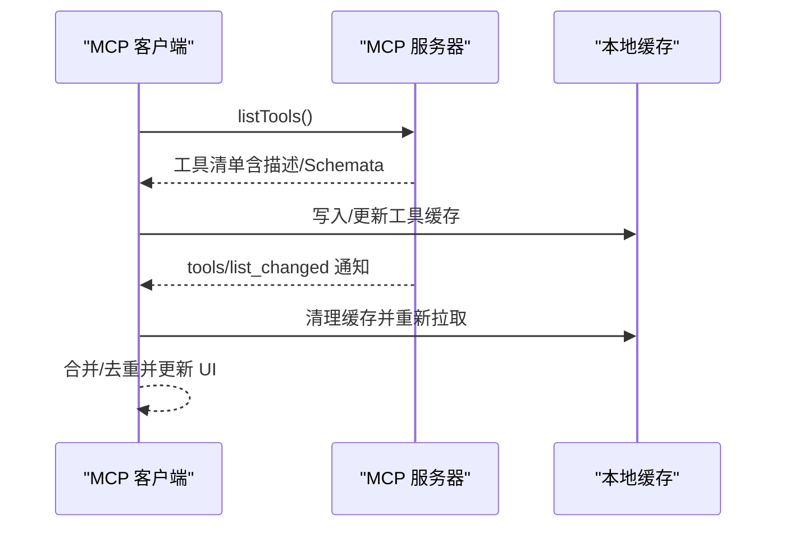
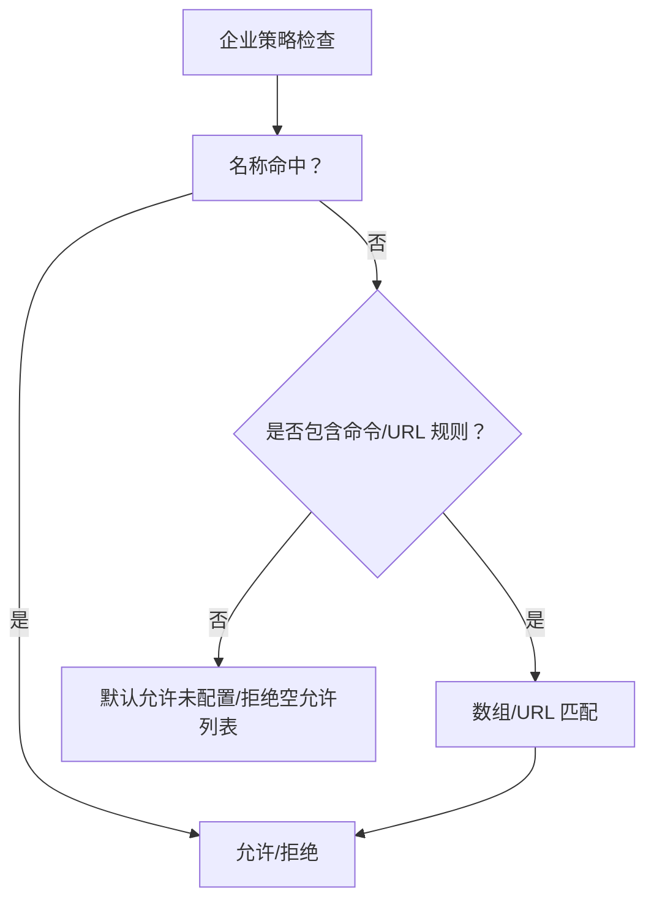
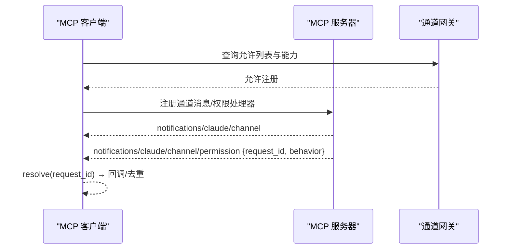
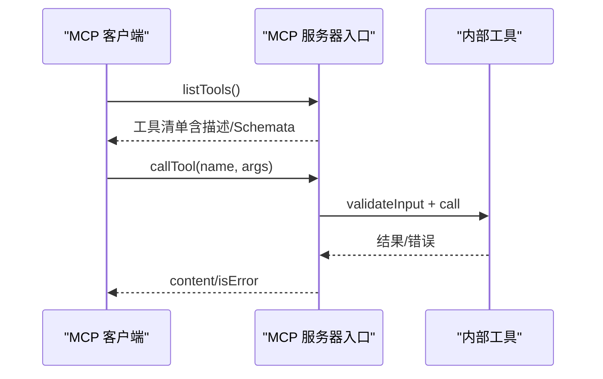
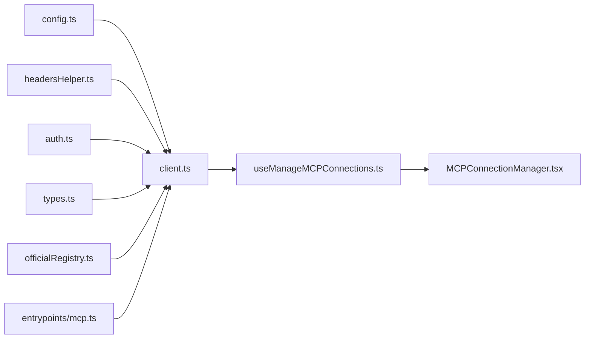

# MCP 服务

<cite>
**本文引用的文件**
- [client.ts](file://src/services/mcp/client.ts)
- [types.ts](file://src/services/mcp/types.ts)
- [MCPConnectionManager.tsx](file://src/services/mcp/MCPConnectionManager.tsx)
- [useManageMCPConnections.ts](file://src/services/mcp/useManageMCPConnections.ts)
- [config.ts](file://src/services/mcp/config.ts)
- [auth.ts](file://src/services/mcp/auth.ts)
- [headersHelper.ts](file://src/services/mcp/headersHelper.ts)
- [channelPermissions.ts](file://src/services/mcp/channelPermissions.ts)
- [officialRegistry.ts](file://src/services/mcp/officialRegistry.ts)
- [mcp.ts](file://src/entrypoints/mcp.ts)
</cite>

## 目录
1. [简介](#简介)
2. [项目结构](#项目结构)
3. [核心组件](#核心组件)
4. [架构总览](#架构总览)
5. [详细组件分析](#详细组件分析)
6. [依赖关系分析](#依赖关系分析)
7. [性能考量](#性能考量)
8. [故障排查指南](#故障排查指南)
9. [结论](#结论)
10. [附录：客户端集成与扩展指南](#附录客户端集成与扩展指南)

## 简介
本文件系统性梳理 Claude Code 中的 MCP（Model Context Protocol）服务模块，覆盖连接管理、传输层与协议实现、服务器发现与认证、工具注册与资源查询、权限与安全策略、通道通知与权限回传、以及客户端集成与扩展实践。目标是帮助开发者在理解现有实现的基础上，安全、稳定地接入 MCP 服务器，并按需扩展传输与安全能力。

## 项目结构
MCP 服务相关代码主要位于 src/services/mcp 及其子目录，同时 CLI 入口与 MCP 服务器侧入口分别位于 src/entrypoints/mcp.ts 与 src/services/mcp/client.ts 中。整体采用“配置驱动 + 运行时连接管理 + 传输抽象 + 认证与安全”的分层设计。

图示来源
- [config.ts](file://src/services/mcp/config.ts)
- [headersHelper.ts](file://src/services/mcp/headersHelper.ts)
- [auth.ts](file://src/services/mcp/auth.ts)
- [useManageMCPConnections.ts](file://src/services/mcp/useManageMCPConnections.ts)
- [types.ts](file://src/services/mcp/types.ts)
- [officialRegistry.ts](file://src/services/mcp/officialRegistry.ts)
- [client.ts](file://src/services/mcp/client.ts)
- [MCPConnectionManager.tsx](file://src/services/mcp/MCPConnectionManager.tsx)
- [mcp.ts](file://src/entrypoints/mcp.ts)

章节来源
- [config.ts](file://src/services/mcp/config.ts)
- [headersHelper.ts](file://src/services/mcp/headersHelper.ts)
- [auth.ts](file://src/services/mcp/auth.ts)
- [useManageMCPConnections.ts](file://src/services/mcp/useManageMCPConnections.ts)
- [types.ts](file://src/services/mcp/types.ts)
- [officialRegistry.ts](file://src/services/mcp/officialRegistry.ts)
- [client.ts](file://src/services/mcp/client.ts)
- [MCPConnectionManager.tsx](file://src/services/mcp/MCPConnectionManager.tsx)
- [mcp.ts](file://src/entrypoints/mcp.ts)

## 核心组件
- 配置与策略：统一解析 .mcp.json、用户/项目/企业级配置，支持去重、允许/拒绝策略、命令/URL 命中匹配、代理与路径重写等。
- 传输与连接：抽象出 stdio、sse、http、ws、sdk、claudeai-proxy 等多种传输类型；对远程传输提供自动重连与指数退避。
- 认证与授权：OAuth 发现与刷新、跨应用访问（XAA）、令牌撤销、步骤提升（step-up）状态保留、401/403 检测与重试。
- 动态头部：通过外部脚本生成动态请求头，支持工作区信任检查与安全降级。
- 工具与资源：暴露工具列表、提示词列表、资源列表，支持变更通知与增量更新。
- 通道与权限：基于实验性能力的通道消息与权限回传，支持短 ID 与隐私保护。
- 官方注册表：离线缓存官方 MCP 服务器 URL，用于风险识别与日志标注。

章节来源
- [config.ts](file://src/services/mcp/config.ts)
- [client.ts](file://src/services/mcp/client.ts)
- [auth.ts](file://src/services/mcp/auth.ts)
- [headersHelper.ts](file://src/services/mcp/headersHelper.ts)
- [useManageMCPConnections.ts](file://src/services/mcp/useManageMCPConnections.ts)
- [channelPermissions.ts](file://src/services/mcp/channelPermissions.ts)
- [officialRegistry.ts](file://src/services/mcp/officialRegistry.ts)

## 架构总览
下图展示 MCP 客户端从配置到连接、认证、工具与资源同步、以及通道权限回传的整体流程。

图示来源
- [config.ts](file://src/services/mcp/config.ts)
- [headersHelper.ts](file://src/services/mcp/headersHelper.ts)
- [auth.ts](file://src/services/mcp/auth.ts)
- [client.ts](file://src/services/mcp/client.ts)
- [mcp.ts](file://src/entrypoints/mcp.ts)

## 详细组件分析

### 连接管理与传输层
- 传输类型：支持 stdio、sse、sse-ide、ws-ide、http、ws、sdk、claudeai-proxy。不同传输在连接初始化、超时策略、代理与 TLS、头部组合等方面有差异化处理。
- 连接生命周期：连接成功后注册通知处理器（工具/提示/资源变更），断开后对非本地传输进行指数退避重连；禁用或失败状态下清理缓存并保持状态一致。
- 超时与请求包装：对 HTTP 请求使用独立的 AbortSignal 超时，避免单次信号过期导致后续请求立即失败；对 SSE/WS 传输区分长连接与短请求的超时策略。
- 批量与去重：连接批大小、去重签名（命令/URL 解析与 CCR 代理 URL 规范化）降低重复连接与资源浪费。

图示来源
- [client.ts](file://src/services/mcp/client.ts)
- [types.ts](file://src/services/mcp/types.ts)

章节来源
- [client.ts](file://src/services/mcp/client.ts)
- [types.ts](file://src/services/mcp/types.ts)

### 认证与授权机制
- OAuth 发现与刷新：支持配置元数据 URL 或按 RFC 9728/8414 自动发现；POST 错误体标准化以正确映射 invalid_grant 等语义。
- 步骤提升（Step-Up）：在刷新失败或 401 时保留 scope 与 discovery 状态，减少重复探测成本。
- XAA（跨应用访问）：一次 IdP 登录复用到所有 XAA 服务器，执行 RFC 8693+jwt-bearer 交换，最终落盘为常规 OAuth 令牌。
- 令牌撤销：优先撤销刷新令牌，再撤销访问令牌；对不合规服务器提供 Bearer 回退；撤销失败为尽力而为。
- 401/403 检测与缓存：对远端认证失败进行分类与缓存，避免批量阻塞；对 claude.ai 代理场景提供一次性强制刷新。

图示来源
- [auth.ts](file://src/services/mcp/auth.ts)
- [client.ts](file://src/services/mcp/client.ts)

章节来源
- [auth.ts](file://src/services/mcp/auth.ts)
- [client.ts](file://src/services/mcp/client.ts)

### 工具注册、资源查询与变更通知
- 工具注册：客户端向服务器查询工具列表，按 MCP 规范转换输入/输出 Schema，并注入描述与权限上下文。
- 资源与提示：支持资源列表变更通知，按需刷新；提示/技能变更时联动命令与技能索引更新。
- 变更通知：根据服务器能力声明注册对应通知处理器，避免不必要的轮询，提高响应效率。

图示来源
- [client.ts](file://src/services/mcp/client.ts)
- [useManageMCPConnections.ts](file://src/services/mcp/useManageMCPConnections.ts)

章节来源
- [client.ts](file://src/services/mcp/client.ts)
- [useManageMCPConnections.ts](file://src/services/mcp/useManageMCPConnections.ts)

### 权限与安全策略
- 企业策略：允许/拒绝列表支持名称、命令数组、URL 模式三类规则；URL 支持通配符；拒绝优先于允许。
- 动态头部安全：对项目/本地设置的 headersHelper 引入工作区信任检查，在非交互模式下跳过校验。
- 官方服务器识别：预取官方注册表 URL 并进行去噪规范化，便于日志与审计标注。
- 通道权限回传：基于实验性能力声明，将权限请求通过通道下发，服务器结构化解析用户回复并回传，避免文本误判。

图示来源
- [config.ts](file://src/services/mcp/config.ts)
- [headersHelper.ts](file://src/services/mcp/headersHelper.ts)
- [officialRegistry.ts](file://src/services/mcp/officialRegistry.ts)
- [channelPermissions.ts](file://src/services/mcp/channelPermissions.ts)

章节来源
- [config.ts](file://src/services/mcp/config.ts)
- [headersHelper.ts](file://src/services/mcp/headersHelper.ts)
- [officialRegistry.ts](file://src/services/mcp/officialRegistry.ts)
- [channelPermissions.ts](file://src/services/mcp/channelPermissions.ts)

### 通道管理与权限控制
- 通道网关：根据服务器能力、会话状态、允许列表决定是否注册通道消息与权限回传处理器。
- 权限回传：生成短 ID（字母仅 25 字母，不含 l），避免歧义；服务器解析用户“yes/no + 短 ID”后结构化回传，客户端匹配挂起请求并回调。
- 通知与日志：对通道消息与权限事件进行计数与元数据记录，便于审计与问题定位。

图示来源
- [useManageMCPConnections.ts](file://src/services/mcp/useManageMCPConnections.ts)
- [channelPermissions.ts](file://src/services/mcp/channelPermissions.ts)

章节来源
- [useManageMCPConnections.ts](file://src/services/mcp/useManageMCPConnections.ts)
- [channelPermissions.ts](file://src/services/mcp/channelPermissions.ts)

### MCP 服务器侧（CLI 入口）
- 服务器能力：声明工具能力，提供 listTools 与 callTool 处理器。
- 输入/输出 Schema：将内部工具的 Zod Schema 转换为 MCP 规范要求的 JSON Schema，过滤不兼容根级联合类型。
- 执行上下文：注入命令、工具集、主循环模型、调试与详细日志开关，确保工具调用在受控环境中执行。
- 错误处理：捕获工具执行异常，构造标准错误内容返回给客户端。

图示来源
- [mcp.ts](file://src/entrypoints/mcp.ts)

章节来源
- [mcp.ts](file://src/entrypoints/mcp.ts)

## 依赖关系分析
- 组件耦合：连接管理依赖配置、认证与传输抽象；工具/资源同步依赖通知处理器；通道权限依赖网关与能力声明。
- 外部依赖：MCP SDK（Client/Server、传输、认证）、axios、ws、锁文件与密钥链存储、平台与代理配置。
- 循环依赖规避：类型定义集中于 types.ts，连接与认证通过函数边界解耦，通知处理器注册在连接成功后进行。

图示来源
- [config.ts](file://src/services/mcp/config.ts)
- [headersHelper.ts](file://src/services/mcp/headersHelper.ts)
- [auth.ts](file://src/services/mcp/auth.ts)
- [types.ts](file://src/services/mcp/types.ts)
- [client.ts](file://src/services/mcp/client.ts)
- [useManageMCPConnections.ts](file://src/services/mcp/useManageMCPConnections.ts)
- [MCPConnectionManager.tsx](file://src/services/mcp/MCPConnectionManager.tsx)
- [officialRegistry.ts](file://src/services/mcp/officialRegistry.ts)
- [mcp.ts](file://src/entrypoints/mcp.ts)

章节来源
- [client.ts](file://src/services/mcp/client.ts)
- [useManageMCPConnections.ts](file://src/services/mcp/useManageMCPConnections.ts)
- [config.ts](file://src/services/mcp/config.ts)
- [auth.ts](file://src/services/mcp/auth.ts)
- [headersHelper.ts](file://src/services/mcp/headersHelper.ts)
- [types.ts](file://src/services/mcp/types.ts)
- [officialRegistry.ts](file://src/services/mcp/officialRegistry.ts)
- [MCPConnectionManager.tsx](file://src/services/mcp/MCPConnectionManager.tsx)
- [mcp.ts](file://src/entrypoints/mcp.ts)

## 性能考量
- 连接批处理：通过环境变量控制连接批大小，降低并发握手与认证抖动。
- 请求超时：为每个请求创建独立超时信号，避免单次超时信号过期导致后续请求失败；对 GET（SSE）与非 GET 分离策略。
- 缓存与去重：工具/资源/提示缓存配合失效策略；连接缓存键包含配置哈希，防止误复用。
- 通知驱动：变更通知替代轮询，显著降低网络与 CPU 开销。
- 代理与 TLS：统一代理与 mTLS 配置，减少连接失败与重试成本。

## 故障排查指南
- 认证失败（401/403）：检查 OAuth 元数据发现、令牌刷新与步骤提升；查看 claude.ai 代理场景的一次性强制刷新；确认缓存条目与 TTL。
- 连接断开：确认非本地传输类型；查看指数退避日志与最大尝试次数；核对服务器禁用状态。
- 工具/资源不更新：确认服务器能力声明与通知处理器注册；检查缓存清理与重新拉取逻辑。
- 通道权限未回传：确认服务器声明实验性能力；检查短 ID 生成与匹配；核对通道网关策略。
- 企业策略拦截：核对允许/拒绝列表、名称/命令/URL 命中；注意拒绝优先级与空允许列表行为。

章节来源
- [client.ts](file://src/services/mcp/client.ts)
- [useManageMCPConnections.ts](file://src/services/mcp/useManageMCPConnections.ts)
- [auth.ts](file://src/services/mcp/auth.ts)
- [config.ts](file://src/services/mcp/config.ts)
- [channelPermissions.ts](file://src/services/mcp/channelPermissions.ts)

## 结论
该 MCP 服务模块以“配置驱动 + 传输抽象 + 认证与安全 + 通知驱动更新”为核心设计，既满足多传输、多认证场景，又兼顾企业策略与通道权限控制。通过严格的超时与缓存策略、去重与批处理机制，实现了高可用与高性能的 MCP 客户端体验。建议在扩展新传输或增强安全策略时，遵循现有抽象边界与错误处理规范，确保一致性与可观测性。

## 附录：客户端集成与扩展指南

### 客户端集成要点
- 配置加载：合并用户/项目/企业/插件/动态配置，应用允许/拒绝策略与去重；读取 .mcp.json 与环境变量。
- 连接建立：选择合适传输类型，组合静态与动态头部；对远端传输启用超时与代理/TLS；处理认证失败与缓存。
- 工具与资源：注册变更通知处理器，按需刷新；注意 MCP Schema 转换与不兼容类型过滤。
- 错误处理：区分连接失败、认证失败、工具调用错误；记录日志与遥测，提供用户可见提示。

章节来源
- [config.ts](file://src/services/mcp/config.ts)
- [client.ts](file://src/services/mcp/client.ts)
- [useManageMCPConnections.ts](file://src/services/mcp/useManageMCPConnections.ts)
- [headersHelper.ts](file://src/services/mcp/headersHelper.ts)

### MCP 服务器扩展建议
- 新增传输：参考现有传输初始化与选项封装，确保超时、代理、TLS、头部组合一致；在连接成功后注册通知处理器。
- 自定义认证：在 ClaudeAuthProvider 之外提供适配器，保证 OAuth 发现、刷新、撤销与步骤提升的统一行为。
- 安全增强：引入企业策略钩子、动态头部信任检查、官方服务器识别标注；对敏感参数进行日志脱敏。

章节来源
- [client.ts](file://src/services/mcp/client.ts)
- [auth.ts](file://src/services/mcp/auth.ts)
- [config.ts](file://src/services/mcp/config.ts)
- [officialRegistry.ts](file://src/services/mcp/officialRegistry.ts)
- [headersHelper.ts](file://src/services/mcp/headersHelper.ts)