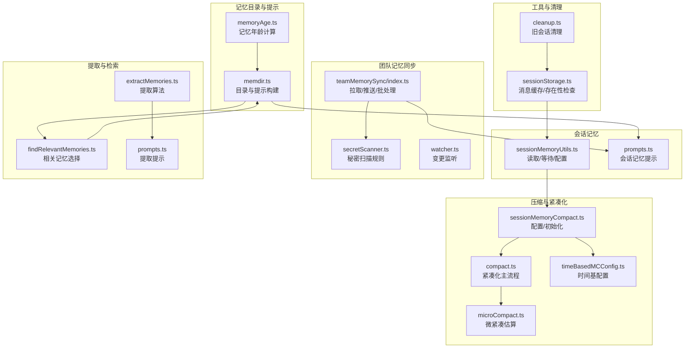
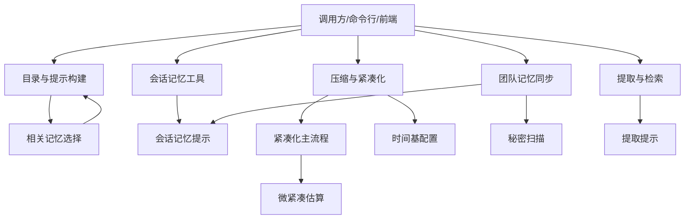
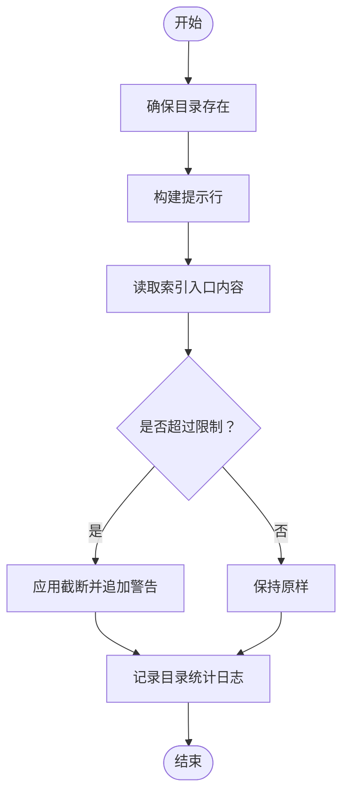
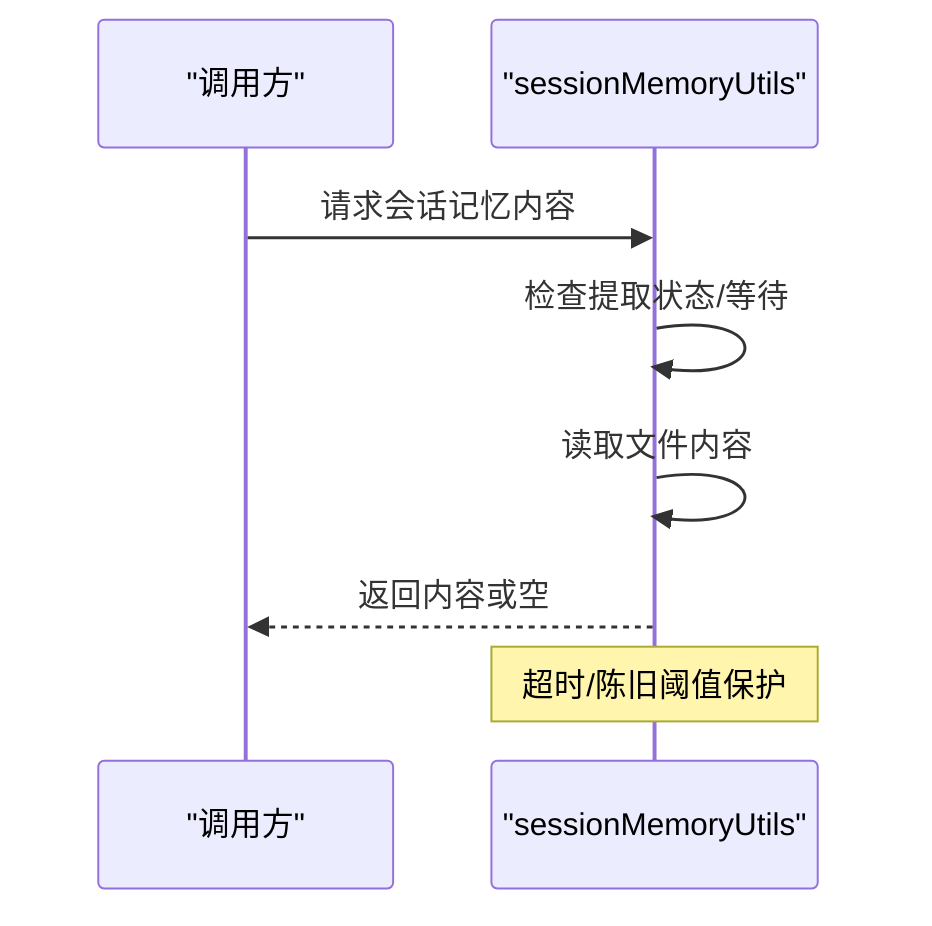
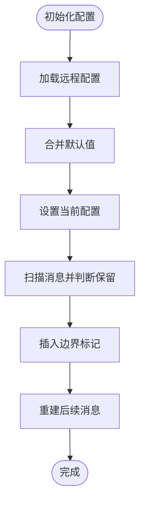
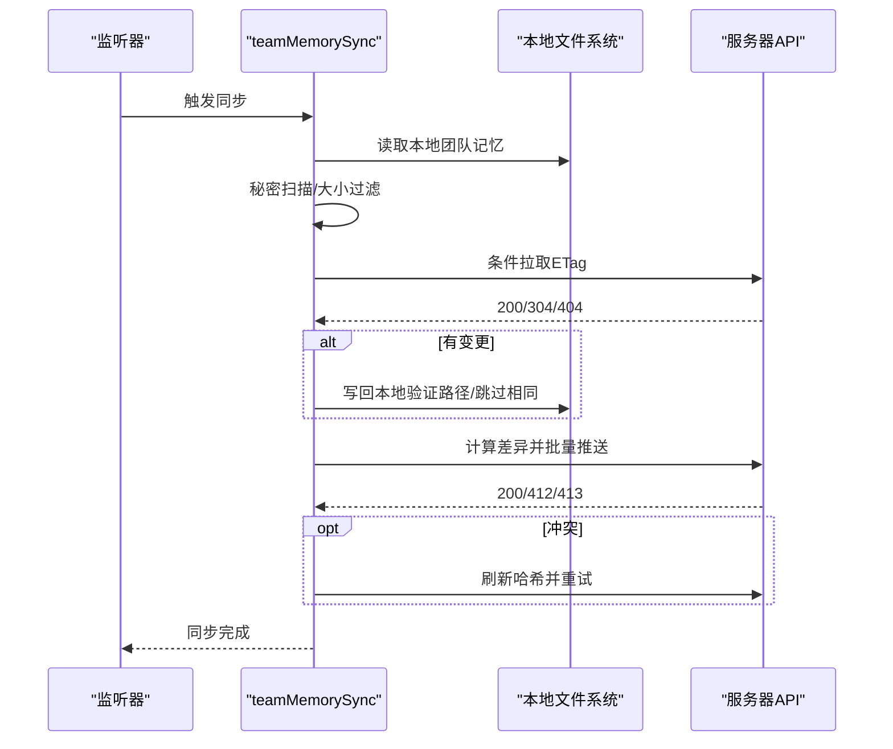
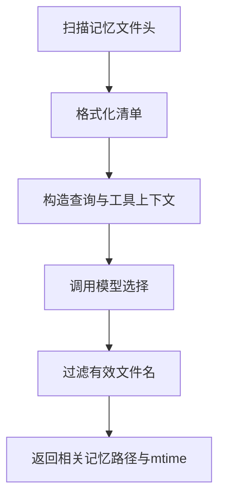
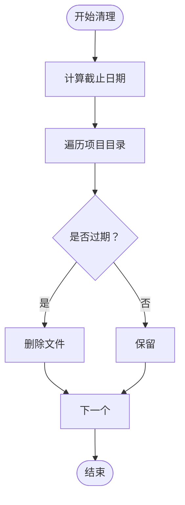
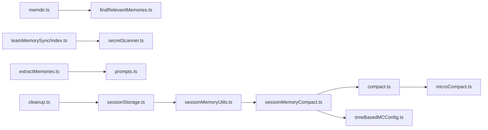

# 内存管理服务

<cite>
**本文引用的文件**
- [src/memdir/memdir.ts](file://src/memdir/memdir.ts)
- [src/memdir/findRelevantMemories.ts](file://src/memdir/findRelevantMemories.ts)
- [src/memdir/memoryAge.ts](file://src/memdir/memoryAge.ts)
- [src/services/SessionMemory/sessionMemoryUtils.ts](file://src/services/SessionMemory/sessionMemoryUtils.ts)
- [src/services/SessionMemory/prompts.ts](file://src/services/SessionMemory/prompts.ts)
- [src/services/compact/sessionMemoryCompact.ts](file://src/services/compact/sessionMemoryCompact.ts)
- [src/services/compact/compact.ts](file://src/services/compact/compact.ts)
- [src/services/compact/microCompact.ts](file://src/services/compact/microCompact.ts)
- [src/services/compact/timeBasedMCConfig.ts](file://src/services/compact/timeBasedMCConfig.ts)
- [src/services/teamMemorySync/index.ts](file://src/services/teamMemorySync/index.ts)
- [src/services/teamMemorySync/secretScanner.ts](file://src/services/teamMemorySync/secretScanner.ts)
- [src/services/teamMemorySync/watcher.ts](file://src/services/teamMemorySync/watcher.ts)
- [src/services/extractMemories/extractMemories.ts](file://src/services/extractMemories/extractMemories.ts)
- [src/services/extractMemories/prompts.ts](file://src/services/extractMemories/prompts.ts)
- [src/utils/sessionStorage.ts](file://src/utils/sessionStorage.ts)
- [src/utils/cleanup.ts](file://src/utils/cleanup.ts)
</cite>

## 目录
1. [简介](#简介)
2. [项目结构](#项目结构)
3. [核心组件](#核心组件)
4. [架构总览](#架构总览)
5. [详细组件分析](#详细组件分析)
6. [依赖关系分析](#依赖关系分析)
7. [性能考量](#性能考量)
8. [故障排查指南](#故障排查指南)
9. [结论](#结论)
10. [附录](#附录)

## 简介
本技术文档聚焦 Claude Code 的“内存管理服务”子系统，系统性阐述会话记忆（Session Memory）与自动记忆（Auto Memory）两大体系：包括记忆存储与检索、压缩与紧凑化、时间基配置与分组策略、团队记忆同步与安全扫描、记忆提取算法与上下文分析、生命周期管理与清理策略，以及可扩展的存储后端与备份恢复机制。目标是帮助开发者与高级用户理解并高效使用该能力，同时为扩展与维护提供清晰指引。

## 项目结构
内存管理服务横跨多个模块：
- 记忆目录与提示构建：负责自动记忆与团队记忆的目录结构、提示文本生成与索引入口截断。
- 会话记忆工具：负责会话记忆文件的读取、等待提取完成、配置更新等。
- 压缩与紧凑化：负责会话记忆的阈值配置、消息保留策略、边界标记与后续消息重建。
- 团队记忆同步：负责本地与服务器之间的增量上传/拉取、哈希校验、冲突处理、大小限制与安全扫描。
- 提取与检索：负责从会话中抽取关键信息、基于标题与描述选择相关记忆、上下文分析与关键信息识别。
- 工具与清理：负责会话消息缓存、旧会话文件清理、记忆年龄计算等辅助能力。

图表来源
- [src/memdir/memdir.ts:1-509](file://src/memdir/memdir.ts#L1-L509)
- [src/memdir/findRelevantMemories.ts:1-143](file://src/memdir/findRelevantMemories.ts#L1-L143)
- [src/memdir/memoryAge.ts:1-20](file://src/memdir/memoryAge.ts#L1-L20)
- [src/services/SessionMemory/sessionMemoryUtils.ts:85-138](file://src/services/SessionMemory/sessionMemoryUtils.ts#L85-L138)
- [src/services/SessionMemory/prompts.ts:1-200](file://src/services/SessionMemory/prompts.ts#L1-L200)
- [src/services/compact/sessionMemoryCompact.ts:1-200](file://src/services/compact/sessionMemoryCompact.ts#L1-L200)
- [src/services/compact/compact.ts:1-200](file://src/services/compact/compact.ts#L1-L200)
- [src/services/compact/microCompact.ts:1-200](file://src/services/compact/microCompact.ts#L1-L200)
- [src/services/compact/timeBasedMCConfig.ts:1-200](file://src/services/compact/timeBasedMCConfig.ts#L1-L200)
- [src/services/teamMemorySync/index.ts:1-800](file://src/services/teamMemorySync/index.ts#L1-L800)
- [src/services/teamMemorySync/secretScanner.ts:1-37](file://src/services/teamMemorySync/secretScanner.ts#L1-L37)
- [src/services/teamMemorySync/watcher.ts:1-200](file://src/services/teamMemorySync/watcher.ts#L1-L200)
- [src/services/extractMemories/extractMemories.ts:1-200](file://src/services/extractMemories/extractMemories.ts#L1-L200)
- [src/services/extractMemories/prompts.ts:1-200](file://src/services/extractMemories/prompts.ts#L1-L200)
- [src/utils/sessionStorage.ts:3838-3867](file://src/utils/sessionStorage.ts#L3838-L3867)
- [src/utils/cleanup.ts:102-159](file://src/utils/cleanup.ts#L102-L159)

章节来源
- [src/memdir/memdir.ts:1-509](file://src/memdir/memdir.ts#L1-L509)
- [src/services/teamMemorySync/index.ts:1-800](file://src/services/teamMemorySync/index.ts#L1-L800)

## 核心组件
- 记忆目录与提示构建：负责自动记忆与团队记忆的目录存在性保证、提示文本生成、索引入口截断与目录统计日志。
- 会话记忆工具：提供会话记忆内容读取、等待提取完成、配置更新等能力。
- 压缩与紧凑化：提供会话记忆阈值配置、消息保留策略、边界标记与后续消息重建。
- 团队记忆同步：提供本地与服务器的增量同步、哈希校验、冲突处理、大小限制与秘密扫描。
- 提取与检索：提供从会话中抽取关键信息、基于标题与描述选择相关记忆、上下文分析与关键信息识别。
- 工具与清理：提供会话消息缓存、旧会话文件清理、记忆年龄计算等辅助能力。

章节来源
- [src/memdir/memdir.ts:1-509](file://src/memdir/memdir.ts#L1-L509)
- [src/services/SessionMemory/sessionMemoryUtils.ts:85-138](file://src/services/SessionMemory/sessionMemoryUtils.ts#L85-L138)
- [src/services/compact/sessionMemoryCompact.ts:1-200](file://src/services/compact/sessionMemoryCompact.ts#L1-L200)
- [src/services/teamMemorySync/index.ts:1-800](file://src/services/teamMemorySync/index.ts#L1-L800)
- [src/services/extractMemories/extractMemories.ts:1-200](file://src/services/extractMemories/extractMemories.ts#L1-L200)
- [src/utils/sessionStorage.ts:3838-3867](file://src/utils/sessionStorage.ts#L3838-L3867)
- [src/utils/cleanup.ts:102-159](file://src/utils/cleanup.ts#L102-L159)

## 架构总览
内存管理服务由“目录与提示构建层”、“会话记忆层”、“压缩与紧凑化层”、“团队记忆同步层”、“提取与检索层”、“工具与清理层”组成，各层职责清晰、耦合度低，通过明确的接口与数据流协同工作。

图表来源
- [src/memdir/memdir.ts:1-509](file://src/memdir/memdir.ts#L1-L509)
- [src/services/SessionMemory/sessionMemoryUtils.ts:85-138](file://src/services/SessionMemory/sessionMemoryUtils.ts#L85-L138)
- [src/services/compact/sessionMemoryCompact.ts:1-200](file://src/services/compact/sessionMemoryCompact.ts#L1-L200)
- [src/services/teamMemorySync/index.ts:1-800](file://src/services/teamMemorySync/index.ts#L1-L800)
- [src/services/extractMemories/extractMemories.ts:1-200](file://src/services/extractMemories/extractMemories.ts#L1-L200)

## 详细组件分析

### 记忆目录与提示构建（memdir）
- 目录存在性保证：确保记忆目录存在，避免模型写入前反复检查。
- 提示构建：根据启用的记忆类型（自动/团队），生成行为指导、如何保存记忆、何时访问记忆、搜索过往上下文等提示。
- 索引入口截断：对 MEMORY.md 进行行数与字节数双重截断，并在必要时追加警告提示，防止超长索引影响加载。
- 目录统计日志：异步统计文件与子目录数量，用于分析与遥测。

图表来源
- [src/memdir/memdir.ts:129-185](file://src/memdir/memdir.ts#L129-L185)
- [src/memdir/memdir.ts:272-316](file://src/memdir/memdir.ts#L272-L316)
- [src/memdir/memdir.ts:57-103](file://src/memdir/memdir.ts#L57-L103)

章节来源
- [src/memdir/memdir.ts:129-185](file://src/memdir/memdir.ts#L129-L185)
- [src/memdir/memdir.ts:272-316](file://src/memdir/memdir.ts#L272-L316)
- [src/memdir/memdir.ts:57-103](file://src/memdir/memdir.ts#L57-L103)

### 会话记忆工具（SessionMemory）
- 内容读取：从会话记忆文件路径读取内容，并记录事件指标。
- 等待提取：在提取进行中时等待，支持超时与陈旧阈值控制，避免无限阻塞。
- 配置更新：动态更新会话记忆配置，如阈值、最小保留消息数等。

图表来源
- [src/services/SessionMemory/sessionMemoryUtils.ts:85-138](file://src/services/SessionMemory/sessionMemoryUtils.ts#L85-L138)

章节来源
- [src/services/SessionMemory/sessionMemoryUtils.ts:85-138](file://src/services/SessionMemory/sessionMemoryUtils.ts#L85-L138)

### 压缩与紧凑化（SessionMemoryCompact）
- 阈值配置：支持最小保留令牌数、最小保留含文本块消息数、最大保留令牌数等参数；支持远程配置注入与默认回退。
- 初始化：仅在会话内初始化一次，合并远程配置与默认值，避免零值覆盖。
- 消息保留策略：判断消息是否包含文本块、工具结果/使用块，确保配对不被切分；处理同 id 思考块与工具块的合并。
- 紧凑化流程：通过边界标记与后续消息重建，实现安全的会话记忆压缩。

图表来源
- [src/services/compact/sessionMemoryCompact.ts:102-130](file://src/services/compact/sessionMemoryCompact.ts#L102-L130)
- [src/services/compact/sessionMemoryCompact.ts:135-200](file://src/services/compact/sessionMemoryCompact.ts#L135-L200)
- [src/services/compact/compact.ts:1-200](file://src/services/compact/compact.ts#L1-200)

章节来源
- [src/services/compact/sessionMemoryCompact.ts:102-130](file://src/services/compact/sessionMemoryCompact.ts#L102-L130)
- [src/services/compact/sessionMemoryCompact.ts:135-200](file://src/services/compact/sessionMemoryCompact.ts#L135-L200)
- [src/services/compact/compact.ts:1-200](file://src/services/compact/compact.ts#L1-L200)

### 团队记忆同步（teamMemorySync）
- 拉取（Pull）：条件请求（ETag）、304/404 处理、解析响应、更新最后已知校验和。
- 推送（Push）：计算本地与服务器内容哈希差异，增量上传；冲突处理（412）与重试；网关/应用层 413 结构化解析与条目上限学习。
- 批处理：按字节上限进行贪心装箱，保证批量大小稳定；单个超限条目独立成批。
- 安全扫描：在上传前对文件内容进行秘密扫描，检测到即跳过，不离开本地机器。
- 写回本地：验证路径边界、跳过内容一致项、递归创建父目录、写入文件。

图表来源
- [src/services/teamMemorySync/index.ts:188-410](file://src/services/teamMemorySync/index.ts#L188-L410)
- [src/services/teamMemorySync/index.ts:462-553](file://src/services/teamMemorySync/index.ts#L462-L553)
- [src/services/teamMemorySync/index.ts:557-673](file://src/services/teamMemorySync/index.ts#L557-L673)
- [src/services/teamMemorySync/secretScanner.ts:1-37](file://src/services/teamMemorySync/secretScanner.ts#L1-L37)

章节来源
- [src/services/teamMemorySync/index.ts:188-410](file://src/services/teamMemorySync/index.ts#L188-L410)
- [src/services/teamMemorySync/index.ts:462-553](file://src/services/teamMemorySync/index.ts#L462-L553)
- [src/services/teamMemorySync/index.ts:557-673](file://src/services/teamMemorySync/index.ts#L557-L673)
- [src/services/teamMemorySync/secretScanner.ts:1-37](file://src/services/teamMemorySync/secretScanner.ts#L1-L37)

### 提取与检索（extractMemories / findRelevantMemories）
- 相关记忆选择：扫描记忆文件头（名称/描述/修改时间），格式化清单，调用模型选择最相关（最多 5 个）。
- 记忆提取：从会话中抽取关键信息，结合上下文分析与关键信息识别，输出结构化摘要供后续使用。

图表来源
- [src/memdir/findRelevantMemories.ts:39-75](file://src/memdir/findRelevantMemories.ts#L39-L75)
- [src/memdir/findRelevantMemories.ts:77-141](file://src/memdir/findRelevantMemories.ts#L77-L141)
- [src/services/extractMemories/extractMemories.ts:1-200](file://src/services/extractMemories/extractMemories.ts#L1-L200)

章节来源
- [src/memdir/findRelevantMemories.ts:39-75](file://src/memdir/findRelevantMemories.ts#L39-L75)
- [src/memdir/findRelevantMemories.ts:77-141](file://src/memdir/findRelevantMemories.ts#L77-L141)
- [src/services/extractMemories/extractMemories.ts:1-200](file://src/services/extractMemories/extractMemories.ts#L1-L200)

### 工具与清理（sessionStorage / cleanup）
- 会话消息缓存：基于 sessionId 的消息 UUID 集合缓存，避免重复读取；提供缓存清理以适配压缩后的 UUID 变更。
- 旧会话文件清理：按截止日期删除旧会话消息文件，清理 MCP 日志目录，避免磁盘膨胀。

图表来源
- [src/utils/cleanup.ts:155-159](file://src/utils/cleanup.ts#L155-L159)
- [src/utils/cleanup.ts:134-153](file://src/utils/cleanup.ts#L134-L153)
- [src/utils/sessionStorage.ts:3838-3867](file://src/utils/sessionStorage.ts#L3838-L3867)

章节来源
- [src/utils/cleanup.ts:155-159](file://src/utils/cleanup.ts#L155-L159)
- [src/utils/cleanup.ts:134-153](file://src/utils/cleanup.ts#L134-L153)
- [src/utils/sessionStorage.ts:3838-3867](file://src/utils/sessionStorage.ts#L3838-L3867)

## 依赖关系分析
- 组件内聚：每个模块职责单一，如 memdir 专注目录与提示，teamMemorySync 专注同步与安全，compact 专注压缩策略。
- 组件耦合：通过明确的函数接口与数据结构交互，如 sessionMemoryUtils 与 compact 的配置交互、teamMemorySync 与 secretScanner 的扫描集成。
- 外部依赖：HTTP 客户端（axios）、文件系统操作、模型推理（sideQuery）、遥测与分析（analytics）。

图表来源
- [src/memdir/memdir.ts:1-509](file://src/memdir/memdir.ts#L1-L509)
- [src/services/SessionMemory/sessionMemoryUtils.ts:85-138](file://src/services/SessionMemory/sessionMemoryUtils.ts#L85-L138)
- [src/services/compact/sessionMemoryCompact.ts:1-200](file://src/services/compact/sessionMemoryCompact.ts#L1-L200)
- [src/services/compact/compact.ts:1-200](file://src/services/compact/compact.ts#L1-L200)
- [src/services/compact/microCompact.ts:1-200](file://src/services/compact/microCompact.ts#L1-L200)
- [src/services/compact/timeBasedMCConfig.ts:1-200](file://src/services/compact/timeBasedMCConfig.ts#L1-L200)
- [src/services/teamMemorySync/index.ts:1-800](file://src/services/teamMemorySync/index.ts#L1-L800)
- [src/services/teamMemorySync/secretScanner.ts:1-37](file://src/services/teamMemorySync/secretScanner.ts#L1-L37)
- [src/services/extractMemories/extractMemories.ts:1-200](file://src/services/extractMemories/extractMemories.ts#L1-L200)
- [src/services/extractMemories/prompts.ts:1-200](file://src/services/extractMemories/prompts.ts#L1-L200)
- [src/utils/sessionStorage.ts:3838-3867](file://src/utils/sessionStorage.ts#L3838-L3867)
- [src/utils/cleanup.ts:102-159](file://src/utils/cleanup.ts#L102-L159)

## 性能考量
- 截断与估算：索引入口内容的行数与字节双重截断，减少加载开销；微紧凑估算用于快速评估压缩收益。
- 并行与批处理：团队记忆写回采用并行处理；推送按字节上限进行贪心装箱，降低网络往返。
- 缓存与去重：会话消息 UUID 缓存避免重复读取；跳过内容相同的文件写入，减少 I/O。
- 清理策略：定期清理旧会话文件与日志，释放磁盘空间，避免长期运行导致的资源膨胀。

章节来源
- [src/memdir/memdir.ts:57-103](file://src/memdir/memdir.ts#L57-L103)
- [src/services/compact/microCompact.ts:1-200](file://src/services/compact/microCompact.ts#L1-L200)
- [src/services/teamMemorySync/index.ts:426-460](file://src/services/teamMemorySync/index.ts#L426-L460)
- [src/utils/sessionStorage.ts:3838-3867](file://src/utils/sessionStorage.ts#L3838-L3867)
- [src/utils/cleanup.ts:102-159](file://src/utils/cleanup.ts#L102-L159)

## 故障排查指南
- 团队记忆同步失败
  - 认证问题：检查 OAuth 令牌与作用域；确认端点可用性与用户授权。
  - 冲突与重试：遇到 412 冲突时刷新哈希并重试；注意最大重试次数。
  - 结构化 413：当服务器返回条目过多错误时，记录并学习 max_entries，随后截断本地集合。
  - 文件大小与秘密扫描：超过大小限制或检测到秘密的文件会被跳过，检查日志与告警。
- 会话记忆提取卡顿
  - 等待提取完成：在提取进行中时等待，超时/陈旧阈值保护避免无限阻塞。
  - 配置不当：检查压缩阈值配置，确保最小保留消息数与最大保留令牌数合理。
- 相关记忆选择无效
  - 检查记忆文件头扫描与清单格式；确认模型输出解析成功。
  - 近期使用工具列表会影响选择，必要时调整过滤逻辑。
- 旧会话文件未清理
  - 检查截止日期计算与权限；确认清理任务执行频率与日志。

章节来源
- [src/services/teamMemorySync/index.ts:148-184](file://src/services/teamMemorySync/index.ts#L148-L184)
- [src/services/teamMemorySync/index.ts:495-553](file://src/services/teamMemorySync/index.ts#L495-L553)
- [src/services/teamMemorySync/index.ts:586-620](file://src/services/teamMemorySync/index.ts#L586-L620)
- [src/services/SessionMemory/sessionMemoryUtils.ts:89-105](file://src/services/SessionMemory/sessionMemoryUtils.ts#L89-L105)
- [src/services/compact/sessionMemoryCompact.ts:102-130](file://src/services/compact/sessionMemoryCompact.ts#L102-L130)
- [src/memdir/findRelevantMemories.ts:129-141](file://src/memdir/findRelevantMemories.ts#L129-L141)
- [src/utils/cleanup.ts:155-159](file://src/utils/cleanup.ts#L155-L159)

## 结论
内存管理服务通过清晰的层次化设计与严格的边界控制，实现了从记忆存储、检索、压缩到团队同步与安全扫描的完整闭环。其可配置的阈值与时间基策略、并行批处理与缓存机制，兼顾了性能与可靠性。建议在生产环境中结合监控与遥测，持续优化阈值与批处理策略，并严格执行秘密扫描与权限控制。

## 附录
- 自定义存储后端扩展
  - 会话记忆：通过替换文件系统实现与路径解析，保持 sessionMemoryUtils 接口不变即可接入新后端。
  - 团队记忆：通过替换本地文件系统读写与哈希计算，保持 teamMemorySync 的协议与批处理逻辑。
- 备份与恢复
  - 会话记忆：定期导出会话记忆文件作为备份；恢复时写回对应路径并刷新缓存。
  - 团队记忆：通过服务器端备份与恢复；本地侧可基于哈希差异进行增量恢复。
- 安全与合规
  - 秘密扫描：在上传前进行客户端扫描，确保敏感信息不出站；记录规则 ID 与告警，但不记录具体内容。
  - 权限与边界：严格校验路径边界，避免路径穿越；写回时跳过内容一致项，减少不必要的 I/O。

章节来源
- [src/services/SessionMemory/sessionMemoryUtils.ts:110-126](file://src/services/SessionMemory/sessionMemoryUtils.ts#L110-L126)
- [src/services/teamMemorySync/index.ts:557-673](file://src/services/teamMemorySync/index.ts#L557-L673)
- [src/services/teamMemorySync/secretScanner.ts:1-37](file://src/services/teamMemorySync/secretScanner.ts#L1-L37)
- [src/utils/sessionStorage.ts:3854-3856](file://src/utils/sessionStorage.ts#L3854-L3856)