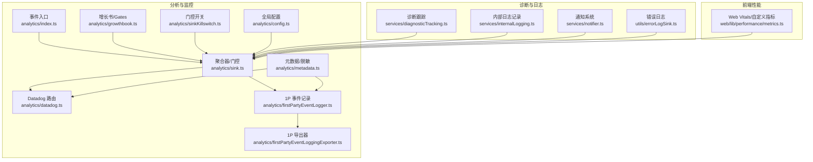
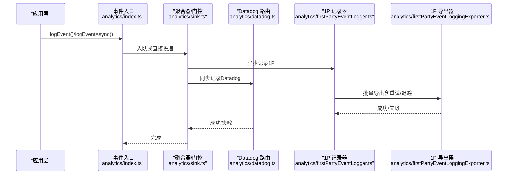
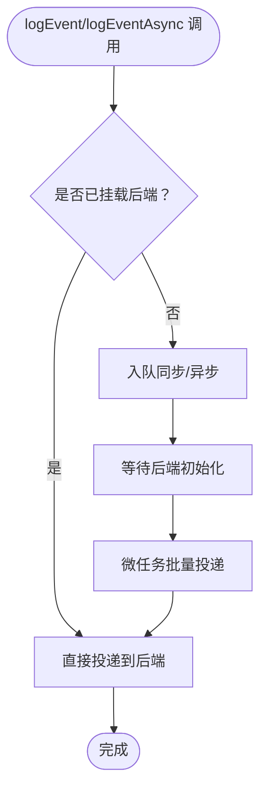
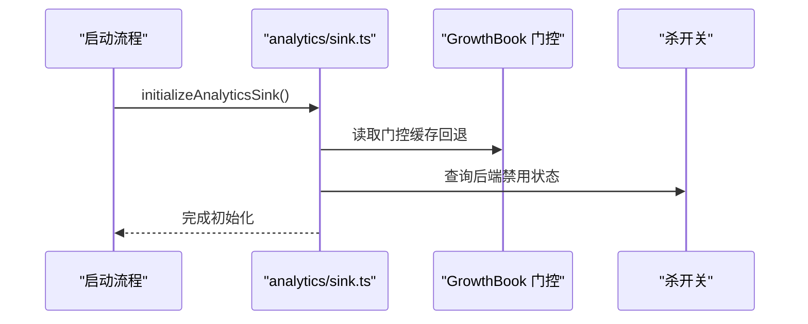
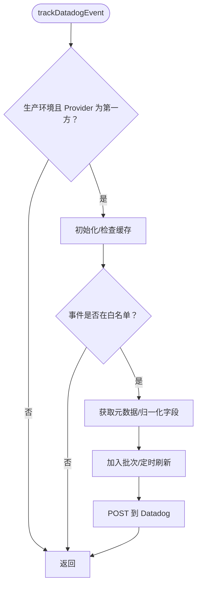
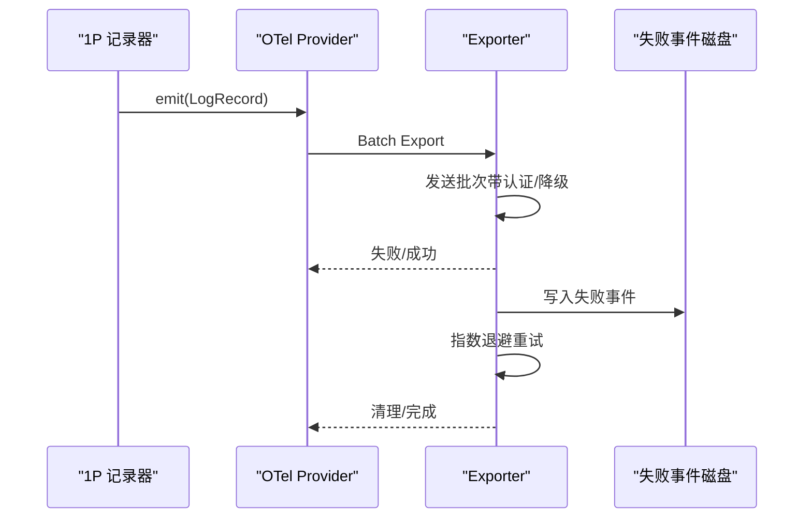
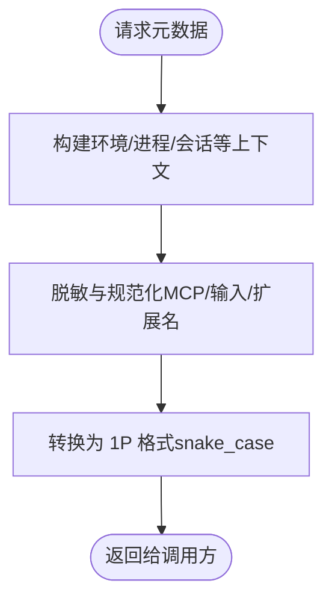
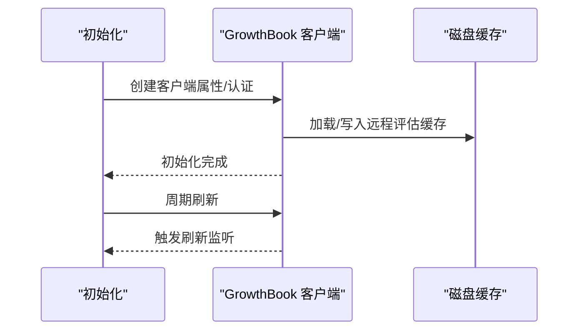
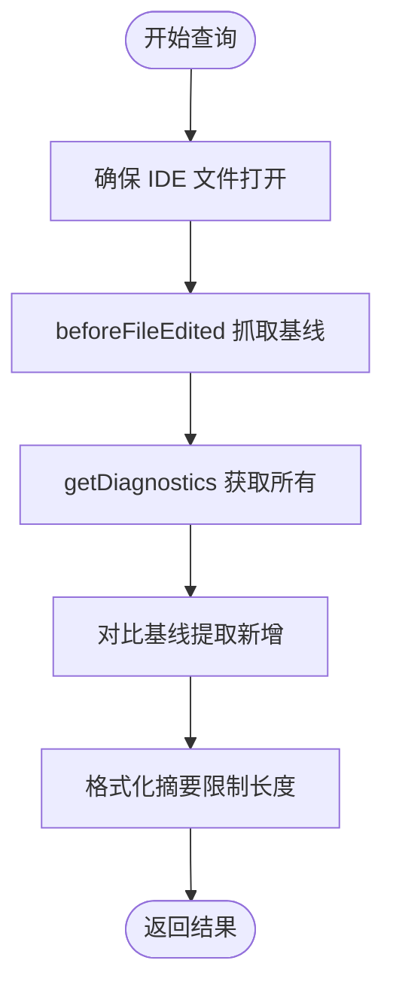
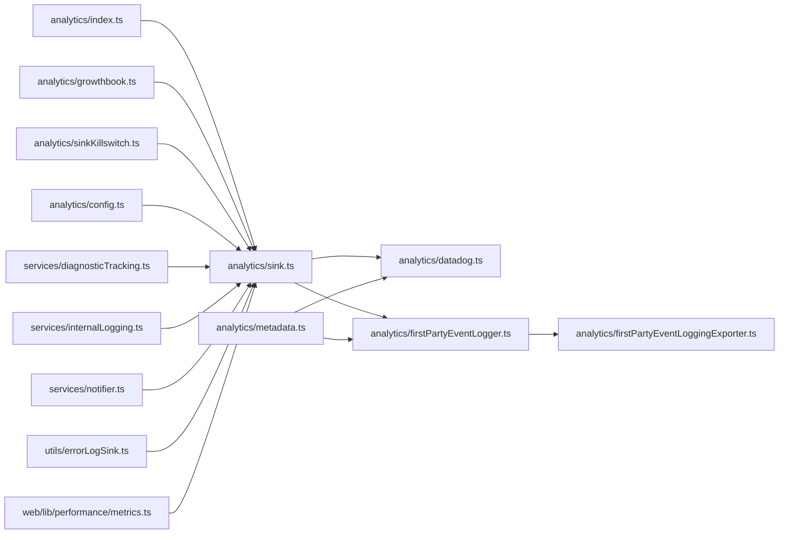

# 分析与监控

<cite>
**本文引用的文件**
- [src/services/analytics/index.ts](file://src/services/analytics/index.ts)
- [src/services/analytics/sink.ts](file://src/services/analytics/sink.ts)
- [src/services/analytics/datadog.ts](file://src/services/analytics/datadog.ts)
- [src/services/analytics/firstPartyEventLogger.ts](file://src/services/analytics/firstPartyEventLogger.ts)
- [src/services/analytics/firstPartyEventLoggingExporter.ts](file://src/services/analytics/firstPartyEventLoggingExporter.ts)
- [src/services/analytics/metadata.ts](file://src/services/analytics/metadata.ts)
- [src/services/analytics/growthbook.ts](file://src/services/analytics/growthbook.ts)
- [src/services/analytics/sinkKillswitch.ts](file://src/services/analytics/sinkKillswitch.ts)
- [src/services/analytics/config.ts](file://src/services/analytics/config.ts)
- [src/services/diagnosticTracking.ts](file://src/services/diagnosticTracking.ts)
- [src/services/internalLogging.ts](file://src/services/internalLogging.ts)
- [src/services/notifier.ts](file://src/services/notifier.ts)
- [src/utils/errorLogSink.ts](file://src/utils/errorLogSink.ts)
- [web/lib/performance/metrics.ts](file://web/lib/performance/metrics.ts)
</cite>

## 目录
1. [简介](#简介)
2. [项目结构](#项目结构)
3. [核心组件](#核心组件)
4. [架构总览](#架构总览)
5. [详细组件分析](#详细组件分析)
6. [依赖关系分析](#依赖关系分析)
7. [性能考量](#性能考量)
8. [故障排查指南](#故障排查指南)
9. [结论](#结论)
10. [附录：监控配置与最佳实践](#附录监控配置与最佳实践)

## 简介
本文件面向 Claude Code 的分析与监控服务模块，系统化梳理事件追踪（Datadog 集成、增长书实验、第一方事件记录）、诊断跟踪、内部日志与通知、性能指标采集、错误报告与用户体验监控，并给出配置示例、数据分析管道、实时监控与告警机制建议，以及数据治理与合规性要点。

## 项目结构
监控相关代码主要分布在以下位置：
- 事件追踪与分析：src/services/analytics/*
- 诊断跟踪：src/services/diagnosticTracking.ts
- 内部日志与通知：src/services/internalLogging.ts、src/services/notifier.ts
- 错误日志：src/utils/errorLogSink.ts
- 性能指标：web/lib/performance/metrics.ts

图示来源
- [src/services/analytics/index.ts:1-175](file://src/services/analytics/index.ts#L1-L175)
- [src/services/analytics/sink.ts:1-114](file://src/services/analytics/sink.ts#L1-L114)
- [src/services/analytics/datadog.ts:1-309](file://src/services/analytics/datadog.ts#L1-L309)
- [src/services/analytics/firstPartyEventLogger.ts:1-451](file://src/services/analytics/firstPartyEventLogger.ts#L1-L451)
- [src/services/analytics/firstPartyEventLoggingExporter.ts:1-808](file://src/services/analytics/firstPartyEventLoggingExporter.ts#L1-L808)
- [src/services/analytics/metadata.ts:1-975](file://src/services/analytics/metadata.ts#L1-L975)
- [src/services/analytics/growthbook.ts:1-1157](file://src/services/analytics/growthbook.ts#L1-L1157)
- [src/services/analytics/sinkKillswitch.ts:1-27](file://src/services/analytics/sinkKillswitch.ts#L1-L27)
- [src/services/analytics/config.ts:1-40](file://src/services/analytics/config.ts#L1-L40)
- [src/services/diagnosticTracking.ts:1-399](file://src/services/diagnosticTracking.ts#L1-L399)
- [src/services/internalLogging.ts:1-92](file://src/services/internalLogging.ts#L1-L92)
- [src/services/notifier.ts:1-158](file://src/services/notifier.ts#L1-L158)
- [src/utils/errorLogSink.ts:1-237](file://src/utils/errorLogSink.ts#L1-L237)
- [web/lib/performance/metrics.ts:1-177](file://web/lib/performance/metrics.ts#L1-L177)

章节来源
- [src/services/analytics/index.ts:1-175](file://src/services/analytics/index.ts#L1-L175)
- [src/services/analytics/sink.ts:1-114](file://src/services/analytics/sink.ts#L1-L114)

## 核心组件
- 事件入口与队列：提供无依赖的事件入口，支持同步/异步记录；在未挂载后端时将事件入队，待后端就绪后批量投递。
- 聚合器与门控：统一接入 Datadog 与 1P 事件记录，支持动态门控（GrowthBook）与“杀开关”（按后端独立禁用）。
- Datadog 路由：生产环境仅对特定事件放行，进行字段归一化、标签化、批处理与定时刷新。
- 第一方事件记录：基于 OpenTelemetry SDK，支持批量导出、失败重试、磁盘持久化与指数退避。
- 元数据与脱敏：统一构建环境上下文、进程指标、模型/订阅等元数据；提供工具函数对 MCP 名称、输入参数、扩展名等进行脱敏。
- 增长书（GrowthBook）：集中式特性门控与实验分配，支持本地覆盖、配置覆盖、刷新监听与曝光事件记录。
- 诊断跟踪：跨 IDE/LSP 获取诊断，对比基线，提取新增诊断并格式化摘要。
- 内部日志：在蚂蚁用户场景下记录权限上下文等内部信息。
- 通知系统：根据首选通道自动选择 iTerm2/Kitty/Ghostty/铃声等通知方式，并记录使用方法。
- 错误日志：以 JSONL 追加写入，带缓冲与目录自动创建，支持 MCP 专用日志。
- 性能指标：浏览器端 Web Vitals 与自定义聊天性能指标，可注入任意分析后端。

章节来源
- [src/services/analytics/index.ts:133-164](file://src/services/analytics/index.ts#L133-L164)
- [src/services/analytics/sink.ts:109-114](file://src/services/analytics/sink.ts#L109-L114)
- [src/services/analytics/datadog.ts:160-279](file://src/services/analytics/datadog.ts#L160-L279)
- [src/services/analytics/firstPartyEventLogger.ts:156-230](file://src/services/analytics/firstPartyEventLogger.ts#L156-L230)
- [src/services/analytics/firstPartyEventLoggingExporter.ts:73-139](file://src/services/analytics/firstPartyEventLoggingExporter.ts#L73-L139)
- [src/services/analytics/metadata.ts:693-743](file://src/services/analytics/metadata.ts#L693-L743)
- [src/services/analytics/growthbook.ts:489-664](file://src/services/analytics/growthbook.ts#L489-L664)
- [src/services/diagnosticTracking.ts:30-399](file://src/services/diagnosticTracking.ts#L30-L399)
- [src/services/internalLogging.ts:71-90](file://src/services/internalLogging.ts#L71-L90)
- [src/services/notifier.ts:18-36](file://src/services/notifier.ts#L18-L36)
- [src/utils/errorLogSink.ts:225-235](file://src/utils/errorLogSink.ts#L225-L235)
- [web/lib/performance/metrics.ts:21-31](file://web/lib/performance/metrics.ts#L21-L31)

## 架构总览
事件从应用层通过统一入口进入，经由门控与采样后，分流到 Datadog 与 1P 两条路径。Datadog 负责外部可观测性，1P 负责内部审计与分析。同时，诊断、错误、通知与性能指标分别在各自子系统内运行，形成完整的监控闭环。

图示来源
- [src/services/analytics/index.ts:133-164](file://src/services/analytics/index.ts#L133-L164)
- [src/services/analytics/sink.ts:109-114](file://src/services/analytics/sink.ts#L109-L114)
- [src/services/analytics/datadog.ts:160-279](file://src/services/analytics/datadog.ts#L160-L279)
- [src/services/analytics/firstPartyEventLogger.ts:156-230](file://src/services/analytics/firstPartyEventLogger.ts#L156-L230)
- [src/services/analytics/firstPartyEventLoggingExporter.ts:277-377](file://src/services/analytics/firstPartyEventLoggingExporter.ts#L277-L377)

## 详细组件分析

### 事件入口与队列（analytics/index.ts）
- 设计目标：零依赖、无循环导入；在后端未就绪前事件入队，就绪后微任务批量投递。
- 关键点：同步/异步两种接口；队列大小用于蚂蚁调试；类型约束防止敏感字符串进入元数据。

图示来源
- [src/services/analytics/index.ts:83-123](file://src/services/analytics/index.ts#L83-L123)
- [src/services/analytics/index.ts:133-164](file://src/services/analytics/index.ts#L133-L164)

章节来源
- [src/services/analytics/index.ts:1-175](file://src/services/analytics/index.ts#L1-L175)

### 聚合器与门控（analytics/sink.ts）
- 初始化：attachAnalyticsSink 挂载后端；initializeAnalyticsSink 在启动时调用。
- 动态门控：GrowthBook 特性门控（如 Datadog 开关），支持缓存回退。
- 杀开关：按后端独立禁用（datadog/firstParty），避免网络与资源浪费。

图示来源
- [src/services/analytics/sink.ts:96-99](file://src/services/analytics/sink.ts#L96-L99)
- [src/services/analytics/sink.ts:29-43](file://src/services/analytics/sink.ts#L29-L43)
- [src/services/analytics/sink.ts:109-114](file://src/services/analytics/sink.ts#L109-L114)
- [src/services/analytics/sinkKillswitch.ts:18-25](file://src/services/analytics/sinkKillswitch.ts#L18-L25)

章节来源
- [src/services/analytics/sink.ts:1-114](file://src/services/analytics/sink.ts#L1-L114)
- [src/services/analytics/sinkKillswitch.ts:1-27](file://src/services/analytics/sinkKillswitch.ts#L1-L27)

### Datadog 路由（analytics/datadog.ts）
- 生产环境限制：仅在生产且满足 Provider 限制时发送；白名单事件集。
- 字段归一化：模型名、MCP 工具名、版本号、HTTP 状态映射等。
- 批处理与定时刷新：批量大小、最大间隔、超时控制。
- 用户桶：对用户 ID 哈希分桶，降低基数同时保留统计能力。

图示来源
- [src/services/analytics/datadog.ts:160-180](file://src/services/analytics/datadog.ts#L160-L180)
- [src/services/analytics/datadog.ts:182-279](file://src/services/analytics/datadog.ts#L182-L279)
- [src/services/analytics/datadog.ts:281-299](file://src/services/analytics/datadog.ts#L281-L299)

章节来源
- [src/services/analytics/datadog.ts:1-309](file://src/services/analytics/datadog.ts#L1-L309)

### 第一方事件记录与导出（analytics/firstPartyEventLogger.ts、firstPartyEventLoggingExporter.ts）
- 记录：异步记录，合并核心元数据、用户元数据与事件元数据。
- 导出：OTel 批处理器驱动，支持失败事件落盘、二次重试、指数退避、批量大小与延迟控制。
- 安全：对 PII 标记字段进行脱敏，确保非特权列不泄露。

图示来源
- [src/services/analytics/firstPartyEventLogger.ts:156-230](file://src/services/analytics/firstPartyEventLogger.ts#L156-L230)
- [src/services/analytics/firstPartyEventLogger.ts:312-389](file://src/services/analytics/firstPartyEventLogger.ts#L312-L389)
- [src/services/analytics/firstPartyEventLoggingExporter.ts:277-377](file://src/services/analytics/firstPartyEventLoggingExporter.ts#L277-L377)
- [src/services/analytics/firstPartyEventLoggingExporter.ts:445-517](file://src/services/analytics/firstPartyEventLoggingExporter.ts#L445-L517)

章节来源
- [src/services/analytics/firstPartyEventLogger.ts:1-451](file://src/services/analytics/firstPartyEventLogger.ts#L1-L451)
- [src/services/analytics/firstPartyEventLoggingExporter.ts:1-808](file://src/services/analytics/firstPartyEventLoggingExporter.ts#L1-L808)

### 元数据与脱敏（analytics/metadata.ts）
- 统一构建：环境上下文、进程指标、会话/订阅/代理等。
- 脱敏策略：MCP 工具名标准化、输入参数截断/扁平化、文件扩展名长度限制、工具详情开关。
- 输出格式：支持 1P 事件导出的 snake_case 字段。

图示来源
- [src/services/analytics/metadata.ts:693-743](file://src/services/analytics/metadata.ts#L693-L743)
- [src/services/analytics/metadata.ts:796-800](file://src/services/analytics/metadata.ts#L796-L800)

章节来源
- [src/services/analytics/metadata.ts:1-975](file://src/services/analytics/metadata.ts#L1-L975)

### 增长书（GrowthBook）与门控（analytics/growthbook.ts）
- 客户端：按用户属性与信任状态创建，支持远程评估、缓存与刷新。
- 门控：支持环境变量覆盖、配置覆盖、刷新信号、实验曝光记录。
- 生命周期：初始化、周期刷新、退出清理。

图示来源
- [src/services/analytics/growthbook.ts:489-664](file://src/services/analytics/growthbook.ts#L489-L664)
- [src/services/analytics/growthbook.ts:622-664](file://src/services/analytics/growthbook.ts#L622-L664)
- [src/services/analytics/growthbook.ts:139-157](file://src/services/analytics/growthbook.ts#L139-L157)

章节来源
- [src/services/analytics/growthbook.ts:1-1157](file://src/services/analytics/growthbook.ts#L1-L1157)

### 诊断跟踪（services/diagnosticTracking.ts）
- 基线：编辑前抓取诊断，比较新旧差异，提取新增诊断。
- 多源：file://、_claude_fs_right、_claude_fs_left 协议兼容。
- 可视化：格式化摘要，限制长度并截断标记。

图示来源
- [src/services/diagnosticTracking.ts:135-182](file://src/services/diagnosticTracking.ts#L135-L182)
- [src/services/diagnosticTracking.ts:188-283](file://src/services/diagnosticTracking.ts#L188-L283)
- [src/services/diagnosticTracking.ts:352-380](file://src/services/diagnosticTracking.ts#L352-L380)

章节来源
- [src/services/diagnosticTracking.ts:1-399](file://src/services/diagnosticTracking.ts#L1-L399)

### 内部日志（services/internalLogging.ts）
- 场景：蚂蚁用户下记录命名空间、容器 ID、工具权限上下文等。
- 接口：异步记录，使用事件入口保证一致性。

章节来源
- [src/services/internalLogging.ts:1-92](file://src/services/internalLogging.ts#L1-L92)

### 通知系统（services/notifier.ts）
- 通道：自动检测终端类型，选择 iTerm2/Kitty/Ghostty/铃声等。
- 记录：记录实际使用的通道与终端类型，便于分析渠道有效性。

章节来源
- [src/services/notifier.ts:1-158](file://src/services/notifier.ts#L1-L158)

### 错误日志（utils/errorLogSink.ts）
- 结构：JSONL 追加写入，带缓冲、目录自动创建。
- 分类：通用错误与 MCP 日志分离，带时间戳、会话 ID、工作目录等上下文。

章节来源
- [src/utils/errorLogSink.ts:1-237](file://src/utils/errorLogSink.ts#L1-L237)

### 性能指标（web/lib/performance/metrics.ts）
- Web Vitals：LCP/FID/CLS/INP/TTFB/FCP。
- 自定义指标：首次交互、首条消息渲染、流式令牌延迟、滚动 FPS 监控。
- 注入：通过 setMetricSink 将观测值转发至任意分析后端。

章节来源
- [web/lib/performance/metrics.ts:1-177](file://web/lib/performance/metrics.ts#L1-L177)

## 依赖关系分析
- 低耦合：事件入口与后端通过接口解耦，避免循环依赖。
- 动态配置：GrowthBook 提供门控与采样配置，支持热更新与监听。
- 数据安全：元数据脱敏、PII 标记字段隔离、导出前再次脱敏。
- 失败韧性：1P 导出器失败落盘、指数退避、批量重试、后台恢复。

图示来源
- [src/services/analytics/index.ts:72-78](file://src/services/analytics/index.ts#L72-L78)
- [src/services/analytics/sink.ts:109-114](file://src/services/analytics/sink.ts#L109-L114)
- [src/services/analytics/datadog.ts:1-309](file://src/services/analytics/datadog.ts#L1-L309)
- [src/services/analytics/firstPartyEventLogger.ts:1-451](file://src/services/analytics/firstPartyEventLogger.ts#L1-L451)
- [src/services/analytics/firstPartyEventLoggingExporter.ts:1-808](file://src/services/analytics/firstPartyEventLoggingExporter.ts#L1-L808)
- [src/services/analytics/metadata.ts:1-975](file://src/services/analytics/metadata.ts#L1-L975)
- [src/services/analytics/growthbook.ts:1-1157](file://src/services/analytics/growthbook.ts#L1-L1157)
- [src/services/analytics/sinkKillswitch.ts:1-27](file://src/services/analytics/sinkKillswitch.ts#L1-L27)
- [src/services/analytics/config.ts:1-40](file://src/services/analytics/config.ts#L1-L40)
- [src/services/diagnosticTracking.ts:1-399](file://src/services/diagnosticTracking.ts#L1-L399)
- [src/services/internalLogging.ts:1-92](file://src/services/internalLogging.ts#L1-L92)
- [src/services/notifier.ts:1-158](file://src/services/notifier.ts#L1-L158)
- [src/utils/errorLogSink.ts:1-237](file://src/utils/errorLogSink.ts#L1-L237)
- [web/lib/performance/metrics.ts:1-177](file://web/lib/performance/metrics.ts#L1-L177)

## 性能考量
- 批量与定时：Datadog 批大小与刷新间隔、1P 导出器批量与延迟可控，减少网络开销。
- 采样与门控：事件采样配置与特性门控降低噪声与成本。
- 脱敏与裁剪：输入参数截断、扩展名限制、MCP 名称标准化降低字段基数与传输体积。
- 重试与退避：1P 导出器指数退避与失败落盘，保障稳定性与完整性。
- 前端指标：Web Vitals 与自定义指标按需启用，避免过度观测影响体验。

## 故障排查指南
- 启动顺序：错误日志后端应在分析后端之前初始化，避免早期错误丢失。
- 门控与杀开关：确认 GrowthBook 门控与后端杀开关状态，必要时临时关闭以定位问题。
- Datadog：检查生产环境判断、Provider 类型、事件白名单与字段归一化。
- 1P 导出：查看失败事件磁盘文件、重试次数、认证状态与网络错误上下文。
- 诊断跟踪：确认 IDE 连接状态、协议前缀处理与路径规范化。
- 通知：检查首选通道与终端类型，必要时切换到铃声或禁用通道。
- 错误日志：核对 JSONL 文件路径、缓冲刷新与目录权限。

章节来源
- [src/utils/errorLogSink.ts:225-235](file://src/utils/errorLogSink.ts#L225-L235)
- [src/services/analytics/sink.ts:29-43](file://src/services/analytics/sink.ts#L29-L43)
- [src/services/analytics/datadog.ts:160-180](file://src/services/analytics/datadog.ts#L160-L180)
- [src/services/analytics/firstPartyEventLoggingExporter.ts:445-517](file://src/services/analytics/firstPartyEventLoggingExporter.ts#L445-L517)
- [src/services/diagnosticTracking.ts:51-59](file://src/services/diagnosticTracking.ts#L51-L59)
- [src/services/notifier.ts:40-104](file://src/services/notifier.ts#L40-L104)

## 结论
该监控体系以统一事件入口为核心，结合 GrowthBook 门控与采样、Datadog 外部可观测性与 1P 内部审计导出，辅以内置诊断、错误日志、通知与前端性能指标，形成闭环。通过脱敏、杀开关与韧性设计，既满足业务洞察又兼顾隐私与稳定性。

## 附录：监控配置与最佳实践

### 配置示例
- 事件采样：通过 GrowthBook 动态配置事件采样率，避免高基数噪声。
- Datadog 门控：通过特性门控控制 Datadog 开关，支持缓存回退。
- 1P 导出配置：通过动态配置调整批量大小、延迟、最大尝试次数与认证策略。
- 杀开关：按后端独立禁用，避免在异常期间产生额外流量。
- 诊断跟踪：确保 IDE 连接与文件打开，正确处理多协议 URI。
- 通知通道：自动检测终端类型，必要时强制铃声或禁用。

章节来源
- [src/services/analytics/firstPartyEventLogger.ts:87-102](file://src/services/analytics/firstPartyEventLogger.ts#L87-L102)
- [src/services/analytics/sink.ts:20-43](file://src/services/analytics/sink.ts#L20-L43)
- [src/services/analytics/firstPartyEventLoggingExporter.ts:94-139](file://src/services/analytics/firstPartyEventLoggingExporter.ts#L94-L139)
- [src/services/analytics/sinkKillswitch.ts:18-25](file://src/services/analytics/sinkKillswitch.ts#L18-L25)
- [src/services/diagnosticTracking.ts:103-129](file://src/services/diagnosticTracking.ts#L103-L129)
- [src/services/notifier.ts:40-104](file://src/services/notifier.ts#L40-L104)

### 数据治理与合规
- 最小化原则：默认脱敏 MCP 名称、输入参数与扩展名，避免泄露敏感信息。
- PII 隔离：PII 标记字段仅在特权列可见，导出前再次脱敏。
- 透明度：蚂蚁用户场景下记录命名空间与容器 ID，便于审计。
- 隐私级别：遵循隐私级别设置，测试环境与第三方云提供商默认禁用分析。

章节来源
- [src/services/analytics/metadata.ts:69-88](file://src/services/analytics/metadata.ts#L69-L88)
- [src/services/analytics/metadata.ts:323-337](file://src/services/analytics/metadata.ts#L323-L337)
- [src/services/analytics/firstPartyEventLoggingExporter.ts:714-725](file://src/services/analytics/firstPartyEventLoggingExporter.ts#L714-L725)
- [src/services/internalLogging.ts:17-30](file://src/services/internalLogging.ts#L17-L30)
- [src/services/analytics/config.ts:19-27](file://src/services/analytics/config.ts#L19-L27)

### 实时监控与告警
- 指标：Web Vitals 与自定义指标通过 setMetricSink 注入分析后端。
- 事件：Datadog 白名单事件与 1P 内部事件均可用于告警。
- 建议：针对错误率、响应时间、用户桶影响度与导出失败率建立阈值告警。

章节来源
- [web/lib/performance/metrics.ts:21-31](file://web/lib/performance/metrics.ts#L21-L31)
- [src/services/analytics/datadog.ts:19-64](file://src/services/analytics/datadog.ts#L19-L64)
- [src/services/analytics/firstPartyEventLoggingExporter.ts:519-525](file://src/services/analytics/firstPartyEventLoggingExporter.ts#L519-L525)