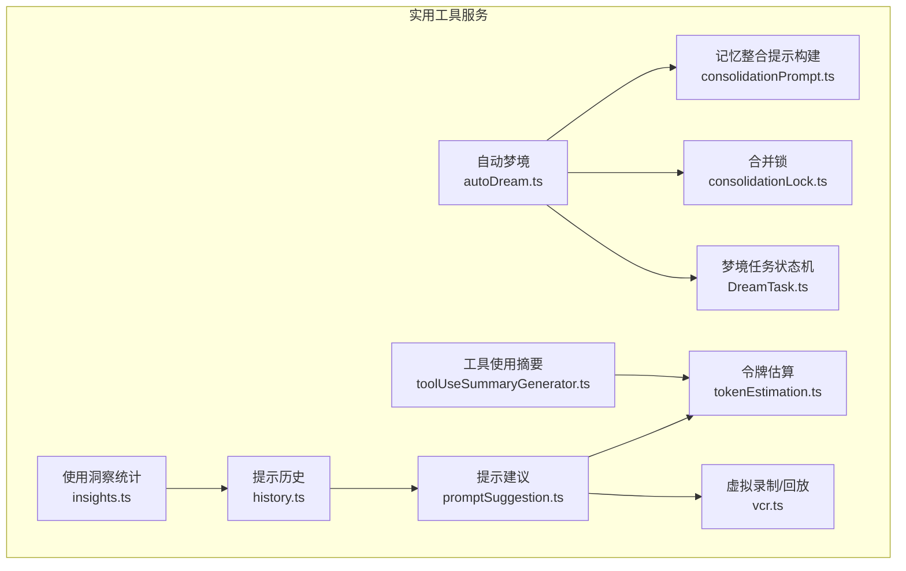
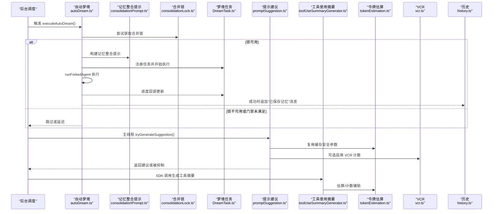
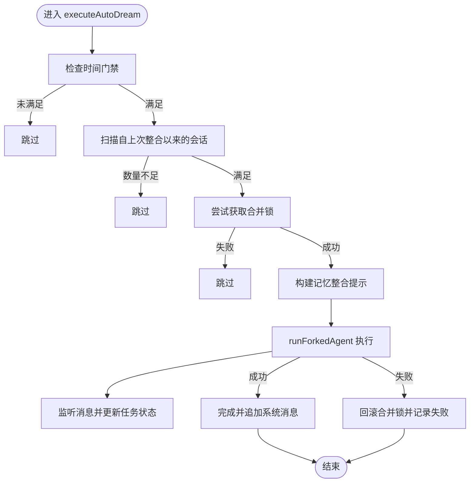
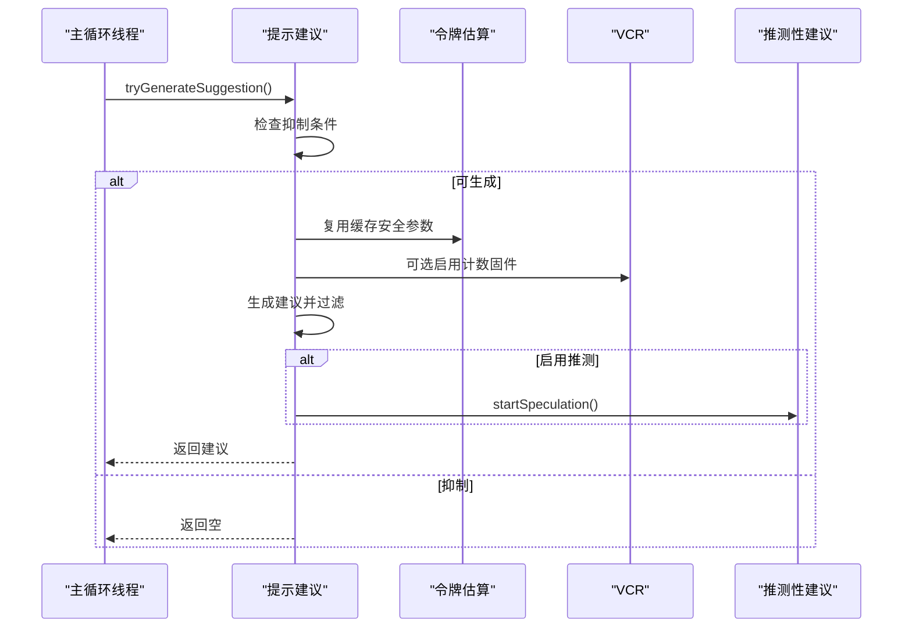
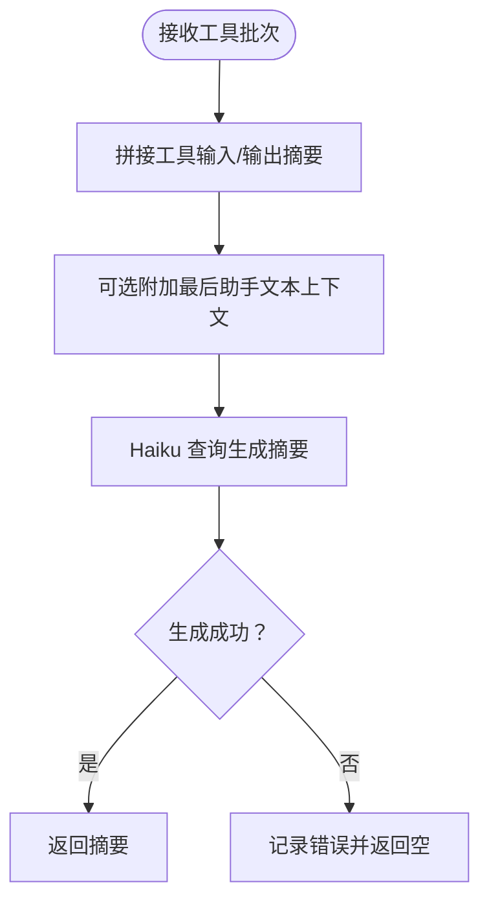
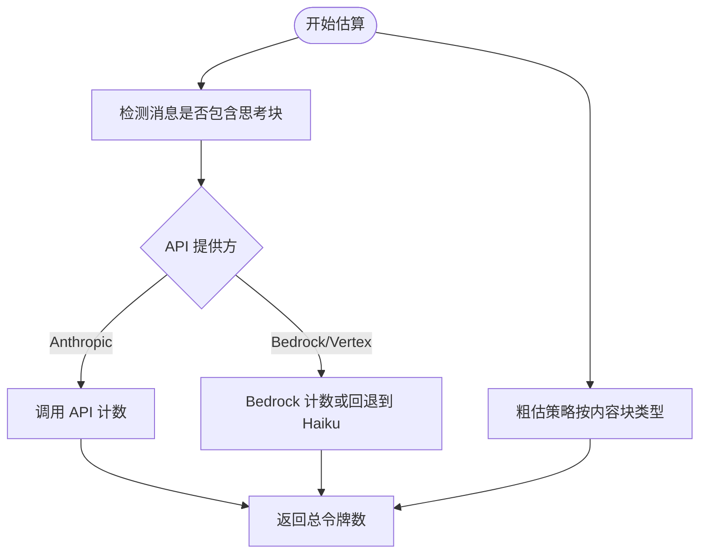
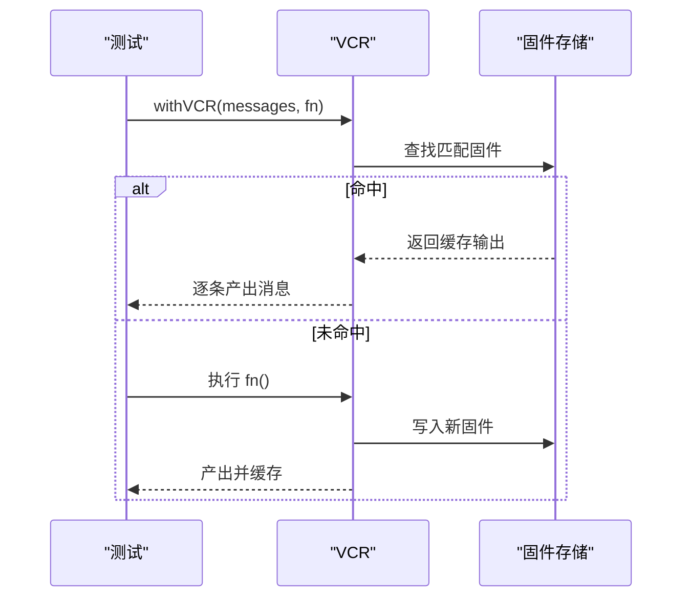
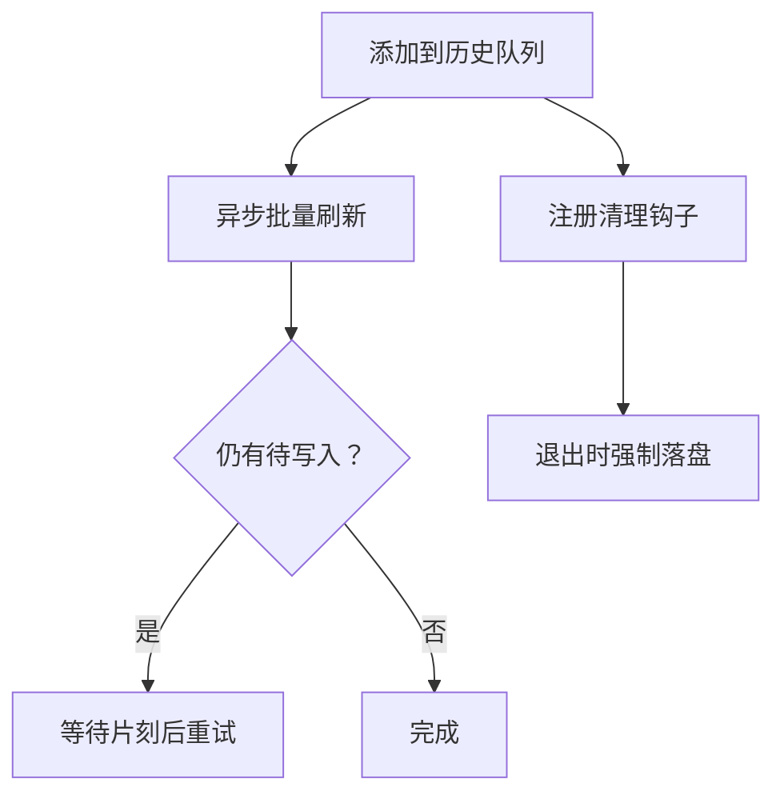
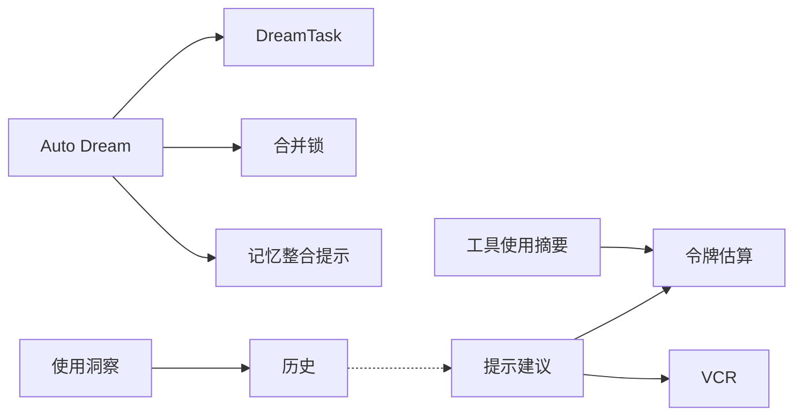

# 实用工具服务

<cite>
**本文引用的文件**
- [autoDream.ts](file://src/services/autoDream/autoDream.ts)
- [consolidationPrompt.ts](file://src/services/autoDream/consolidationPrompt.ts)
- [consolidationLock.ts](file://src/services/autoDream/consolidationLock.ts)
- [DreamTask.ts](file://src/tasks/DreamTask/DreamTask.ts)
- [promptSuggestion.ts](file://src/services/PromptSuggestion/promptSuggestion.ts)
- [toolUseSummaryGenerator.ts](file://src/services/toolUseSummary/toolUseSummaryGenerator.ts)
- [tokenEstimation.ts](file://src/services/tokenEstimation.ts)
- [vcr.ts](file://src/services/vcr.ts)
- [history.ts](file://src/history.ts)
- [insights.ts](file://src/commands/insights.ts)
</cite>

## 目录
1. [简介](#简介)
2. [项目结构](#项目结构)
3. [核心组件](#核心组件)
4. [架构总览](#架构总览)
5. [详细组件分析](#详细组件分析)
6. [依赖关系分析](#依赖关系分析)
7. [性能考量](#性能考量)
8. [故障排查指南](#故障排查指南)
9. [结论](#结论)
10. [附录](#附录)

## 简介
本技术文档聚焦 Claude Code 的“实用工具服务”模块，系统性梳理以下能力与机制：
- 提示系统：智能建议（Prompt Suggestion）的生成、过滤与展示流程
- 自动梦境生成（Auto Dream）：基于会话聚合的记忆整合与后台执行
- 工具使用摘要：对已完成工具批次进行人类可读的总结
- 历史管理：提示历史持久化与去重、清理与回放
- 调度系统：时间门禁、会话门禁与合并锁协作
- 智能建议机制：缓存安全参数、推测性建议与抑制条件
- 令牌估算：API 计数与粗估策略、思考块处理与跨平台适配
- 虚拟录制与回放：VCR 固件与流式回放、成本注入与一致性
- 扩展与集成：实用服务扩展指南、自定义工具集成要点、性能优化技巧

## 项目结构
实用工具服务主要分布在以下目录与文件中：
- 自动梦境生成：src/services/autoDream/* 与 src/tasks/DreamTask/DreamTask.ts
- 提示建议：src/services/PromptSuggestion/*
- 工具使用摘要：src/services/toolUseSummary/toolUseSummaryGenerator.ts
- 令牌估算：src/services/tokenEstimation.ts
- 虚拟录制与回放：src/services/vcr.ts
- 历史管理：src/history.ts
- 使用洞察与统计：src/commands/insights.ts

**图表来源**
- [autoDream.ts:1-326](file://src/services/autoDream/autoDream.ts#L1-L326)
- [consolidationPrompt.ts:1-35](file://src/services/autoDream/consolidationPrompt.ts#L1-L35)
- [consolidationLock.ts](file://src/services/autoDream/consolidationLock.ts)
- [DreamTask.ts:25-74](file://src/tasks/DreamTask/DreamTask.ts#L25-L74)
- [promptSuggestion.ts:1-525](file://src/services/PromptSuggestion/promptSuggestion.ts#L1-L525)
- [toolUseSummaryGenerator.ts:1-114](file://src/services/toolUseSummary/toolUseSummaryGenerator.ts#L1-L114)
- [tokenEstimation.ts:1-497](file://src/services/tokenEstimation.ts#L1-L497)
- [vcr.ts:1-408](file://src/services/vcr.ts#L1-L408)
- [history.ts:329-440](file://src/history.ts#L329-L440)
- [insights.ts:275-3200](file://src/commands/insights.ts#L275-L3200)

**章节来源**
- [autoDream.ts:1-326](file://src/services/autoDream/autoDream.ts#L1-L326)
- [promptSuggestion.ts:1-525](file://src/services/PromptSuggestion/promptSuggestion.ts#L1-L525)
- [toolUseSummaryGenerator.ts:1-114](file://src/services/toolUseSummary/toolUseSummaryGenerator.ts#L1-L114)
- [tokenEstimation.ts:1-497](file://src/services/tokenEstimation.ts#L1-L497)
- [vcr.ts:1-408](file://src/services/vcr.ts#L1-L408)
- [history.ts:329-440](file://src/history.ts#L329-L440)
- [insights.ts:275-3200](file://src/commands/insights.ts#L275-L3200)

## 核心组件
- 自动梦境生成（Auto Dream）
  - 通过时间门禁与会话门禁触发，获取合并锁后以子代理方式执行记忆整合
  - 构建专门提示，限制 Bash 写入权限，仅允许只读命令
  - 进度监听与任务状态更新，失败时回滚锁并记录事件
- 提示建议（Prompt Suggestion）
  - 基于最近对话与父请求生成自然下一步输入建议
  - 缓存安全参数复用、严格抑制条件与多轮过滤规则
  - 可选推测性建议与结果追踪
- 工具使用摘要（Tool Use Summary）
  - 对已完成工具批次生成简短标签式摘要，用于移动端或进度展示
- 令牌估算（Token Estimation）
  - 支持 API 计数与粗估策略，考虑思考块、工具搜索字段剥离与跨平台模型差异
- 虚拟录制与回放（VCR）
  - 测试环境下的消息与计数固件缓存，路径与时间戳归一化，成本注入
- 历史管理（History）
  - 提示历史持久化、批量写入与去重、清理钩子与回放支持
- 使用洞察统计（Insights）
  - 会话级聚合指标、工具使用统计、响应时间与成功率等

**章节来源**
- [autoDream.ts:122-326](file://src/services/autoDream/autoDream.ts#L122-L326)
- [promptSuggestion.ts:125-237](file://src/services/PromptSuggestion/promptSuggestion.ts#L125-L237)
- [toolUseSummaryGenerator.ts:45-96](file://src/services/toolUseSummary/toolUseSummaryGenerator.ts#L45-L96)
- [tokenEstimation.ts:124-325](file://src/services/tokenEstimation.ts#L124-L325)
- [vcr.ts:88-161](file://src/services/vcr.ts#L88-L161)
- [history.ts:355-440](file://src/history.ts#L355-L440)
- [insights.ts:275-3200](file://src/commands/insights.ts#L275-L3200)

## 架构总览
下图展示了实用工具服务的关键交互：自动梦境在后台按门禁触发；提示建议在主循环线程中生成并在必要时启动推测；工具使用摘要由 SDK 或上层调用触发；令牌估算贯穿消息与工具结果；VCR 在测试场景提供稳定回放；历史模块负责持久化与清理。

**图表来源**
- [autoDream.ts:122-326](file://src/services/autoDream/autoDream.ts#L122-L326)
- [consolidationPrompt.ts:10-35](file://src/services/autoDream/consolidationPrompt.ts#L10-L35)
- [consolidationLock.ts](file://src/services/autoDream/consolidationLock.ts)
- [DreamTask.ts:52-74](file://src/tasks/DreamTask/DreamTask.ts#L52-L74)
- [promptSuggestion.ts:125-237](file://src/services/PromptSuggestion/promptSuggestion.ts#L125-L237)
- [toolUseSummaryGenerator.ts:45-96](file://src/services/toolUseSummary/toolUseSummaryGenerator.ts#L45-L96)
- [tokenEstimation.ts:124-201](file://src/services/tokenEstimation.ts#L124-L201)
- [vcr.ts:88-161](file://src/services/vcr.ts#L88-L161)
- [history.ts:355-440](file://src/history.ts#L355-L440)

## 详细组件分析

### 自动梦境生成（Auto Dream）
- 门禁与调度
  - 时间门禁：检查上次整合至今的小时数是否达到阈值
  - 会话门禁：统计自上次整合以来的会话数量（排除当前会话）
  - 扫描节流：避免频繁扫描导致的重复触发
  - 合并锁：确保同一时刻仅有一个整合进程运行，失败时回滚时间戳
- 执行流程
  - 构建记忆整合提示，附加工具约束与会话列表
  - 以子代理方式执行，监听助手消息，提取文本与工具使用次数，收集编辑/写入文件路径
  - 完成后注册“已保存记忆”消息，记录事件指标
- 关键点
  - 工具约束：Bash 仅允许只读命令
  - 任务状态：支持中止、完成与失败状态转换
  - 事件日志：记录触发、完成与失败事件，便于观测与回溯

**图表来源**
- [autoDream.ts:122-273](file://src/services/autoDream/autoDream.ts#L122-L273)
- [consolidationPrompt.ts:10-35](file://src/services/autoDream/consolidationPrompt.ts#L10-L35)
- [consolidationLock.ts](file://src/services/autoDream/consolidationLock.ts)
- [DreamTask.ts:52-74](file://src/tasks/DreamTask/DreamTask.ts#L52-L74)

**章节来源**
- [autoDream.ts:122-326](file://src/services/autoDream/autoDream.ts#L122-L326)
- [consolidationPrompt.ts:10-35](file://src/services/autoDream/consolidationPrompt.ts#L10-L35)
- [DreamTask.ts:25-74](file://src/tasks/DreamTask/DreamTask.ts#L25-L74)

### 提示建议（Prompt Suggestion）
- 启用与抑制
  - 环境变量覆盖、功能开关、非交互模式、团队 Swarm 场景等抑制条件
  - 父请求缓存冷启动阈值、权限与计划模式、速率限制等动态抑制
- 生成与过滤
  - 复用缓存安全参数，拒绝工具使用，避免破坏缓存命中
  - 多轮过滤规则：元信息、格式、长度、语气、单复句等
  - 可选推测性建议与结果追踪（接受/忽略、相似度、耗时）
- 事件日志
  - 记录启用原因、抑制原因、生成结果与用户反馈

**图表来源**
- [promptSuggestion.ts:125-237](file://src/services/PromptSuggestion/promptSuggestion.ts#L125-L237)
- [tokenEstimation.ts:124-201](file://src/services/tokenEstimation.ts#L124-L201)
- [vcr.ts:88-161](file://src/services/vcr.ts#L88-L161)

**章节来源**
- [promptSuggestion.ts:37-94](file://src/services/PromptSuggestion/promptSuggestion.ts#L37-L94)
- [promptSuggestion.ts:125-237](file://src/services/PromptSuggestion/promptSuggestion.ts#L125-L237)
- [promptSuggestion.ts:294-352](file://src/services/PromptSuggestion/promptSuggestion.ts#L294-L352)

### 工具使用摘要（Tool Use Summary）
- 输入：工具名称、输入与输出（JSON 序列化并截断）
- 上下文：可选的最后助手文本作为意图前缀
- 输出：简洁的过去时标签式摘要（如“修复了 NPE”、“读取了配置”）
- 异常处理：失败时不中断流程，记录错误 ID 并返回空

**图表来源**
- [toolUseSummaryGenerator.ts:45-96](file://src/services/toolUseSummary/toolUseSummaryGenerator.ts#L45-L96)

**章节来源**
- [toolUseSummaryGenerator.ts:1-114](file://src/services/toolUseSummary/toolUseSummaryGenerator.ts#L1-L114)

### 令牌估算（Token Estimation）
- API 计数
  - 支持 Anthropic 与 Bedrock/Vertex，自动剥离工具搜索相关字段
  - 思考块预算与最大输出令牌保护，跨平台模型选择与 Beta 参数过滤
- 粗估策略
  - 基于字节/令牌比例的快速估算，针对 JSON 类型采用更小比例
  - 针对不同内容块类型（文本、图像、工具结果、思考块等）分别估算
- VCR 集成
  - 令牌计数固件缓存，路径与时间戳归一化，保证跨环境一致性

**图表来源**
- [tokenEstimation.ts:124-325](file://src/services/tokenEstimation.ts#L124-L325)
- [vcr.ts:382-406](file://src/services/vcr.ts#L382-L406)

**章节来源**
- [tokenEstimation.ts:124-325](file://src/services/tokenEstimation.ts#L124-L325)
- [tokenEstimation.ts:203-242](file://src/services/tokenEstimation.ts#L203-L242)
- [vcr.ts:382-406](file://src/services/vcr.ts#L382-L406)

### 虚拟录制与回放（VCR）
- 固件管理
  - 输入消息与工具序列化后生成哈希文件名，命中则直接回放
  - CI 下未开启录制时抛出缺失提示，引导补录
- 消息映射
  - 文本内容与工具输入深度映射，路径与时间戳归一化
  - 流式回放支持，保持消息 UUID 唯一性以避免会话去重误判
- 成本注入
  - 回放时注入会话成本，确保统计一致性

**图表来源**
- [vcr.ts:88-161](file://src/services/vcr.ts#L88-L161)
- [vcr.ts:349-380](file://src/services/vcr.ts#L349-L380)

**章节来源**
- [vcr.ts:23-86](file://src/services/vcr.ts#L23-L86)
- [vcr.ts:88-161](file://src/services/vcr.ts#L88-L161)
- [vcr.ts:349-380](file://src/services/vcr.ts#L349-L380)

### 历史管理（History）
- 批量写入与去重
  - 异步队列写入，避免热循环重试，最多重试若干次
  - 跳过图片粘贴内容，仅持久化文本
- 清理与回放
  - 注册清理钩子，退出时确保剩余条目落盘
  - 可配置跳过历史记录（例如测试会话）

**图表来源**
- [history.ts:355-440](file://src/history.ts#L355-L440)

**章节来源**
- [history.ts:329-440](file://src/history.ts#L329-L440)

### 使用洞察统计（Insights）
- 聚合维度
  - 会话总数、消息总数、时长、令牌用量、工具使用次数、语言分布、Git 操作、项目与目标分类、满意度与帮助度、摩擦与成功、中断与错误等
  - 用户响应时间、时段分布、多克劳德重叠事件等高级指标
- 报告结构
  - 结构化对象包含各类计数与明细数组，便于前端渲染与导出

**章节来源**
- [insights.ts:275-3200](file://src/commands/insights.ts#L275-L3200)

## 依赖关系分析
- 组件耦合
  - Auto Dream 依赖记忆目录、会话存储与合并锁，与 DreamTask 状态机强耦合
  - Prompt Suggestion 依赖令牌估算与 VCR，受环境与设置影响较大
  - Tool Use Summary 依赖轻量模型查询与令牌估算
  - VCR 与 History 分别服务于测试稳定性与数据持久化
- 外部依赖
  - API 提供方（Anthropic/Bedrock/Vertex）、模型选择与 Beta 参数
  - 文件系统（历史持久化、固件缓存）

**图表来源**
- [autoDream.ts:1-326](file://src/services/autoDream/autoDream.ts#L1-L326)
- [promptSuggestion.ts:1-525](file://src/services/PromptSuggestion/promptSuggestion.ts#L1-L525)
- [toolUseSummaryGenerator.ts:1-114](file://src/services/toolUseSummary/toolUseSummaryGenerator.ts#L1-L114)
- [tokenEstimation.ts:1-497](file://src/services/tokenEstimation.ts#L1-L497)
- [vcr.ts:1-408](file://src/services/vcr.ts#L1-L408)
- [history.ts:329-440](file://src/history.ts#L329-L440)
- [insights.ts:275-3200](file://src/commands/insights.ts#L275-L3200)

**章节来源**
- [autoDream.ts:1-326](file://src/services/autoDream/autoDream.ts#L1-L326)
- [promptSuggestion.ts:1-525](file://src/services/PromptSuggestion/promptSuggestion.ts#L1-L525)
- [toolUseSummaryGenerator.ts:1-114](file://src/services/toolUseSummary/toolUseSummaryGenerator.ts#L1-L114)
- [tokenEstimation.ts:1-497](file://src/services/tokenEstimation.ts#L1-L497)
- [vcr.ts:1-408](file://src/services/vcr.ts#L1-L408)
- [history.ts:329-440](file://src/history.ts#L329-L440)
- [insights.ts:275-3200](file://src/commands/insights.ts#L275-L3200)

## 性能考量
- Auto Dream
  - 门禁与扫描节流降低触发频率，合并锁避免并发冲突
  - 子代理执行减少主线程阻塞，进度回调按回合增量更新
- Prompt Suggestion
  - 复用缓存安全参数，避免额外 API 调用；严格过滤减少无效生成
  - 推测性建议按需启用，避免过度计算
- 令牌估算
  - API 计数优先，Bedrock/Vertex 回退到 Haiku；粗估用于工具结果上限控制
  - 思考块预算与最大输出令牌保护，防止超限
- VCR
  - 固件命中率高时显著降低测试时延；路径与时间戳归一化提升跨平台稳定性
- 历史
  - 批量写入与重试机制平衡吞吐与一致性；清理钩子保障退出时序

[本节为通用指导，无需具体文件分析]

## 故障排查指南
- Auto Dream
  - 现象：未触发或频繁跳过
  - 排查：检查时间门禁阈值、会话门禁数量、合并锁状态与扫描节流
  - 日志：关注触发、完成与失败事件指标
- Prompt Suggestion
  - 现象：建议被抑制
  - 排查：确认环境变量、功能开关、非交互模式、权限与计划模式、速率限制
  - 日志：查看抑制原因与生成结果
- 令牌估算
  - 现象：估算偏差或 API 不可用
  - 排查：检查模型与 Beta 参数、思考块存在性、工具搜索字段剥离
  - VCR：固件缺失时按提示补录
- VCR
  - 现象：测试不稳定或固件不命中
  - 排查：确认路径归一化、时间戳替换、UUID 与时间戳清理
- 历史
  - 现象：历史未落盘或重复
  - 排查：检查清理钩子、批量写入状态与去重逻辑

**章节来源**
- [autoDream.ts:130-199](file://src/services/autoDream/autoDream.ts#L130-L199)
- [promptSuggestion.ts:107-119](file://src/services/PromptSuggestion/promptSuggestion.ts#L107-L119)
- [tokenEstimation.ts:124-201](file://src/services/tokenEstimation.ts#L124-L201)
- [vcr.ts:23-86](file://src/services/vcr.ts#L23-L86)
- [history.ts:355-440](file://src/history.ts#L355-L440)

## 结论
实用工具服务通过门禁与锁机制实现稳健的后台执行，结合缓存安全参数与严格过滤保障用户体验；令牌估算与 VCR 提升了可观测性与稳定性；历史模块与使用洞察为产品优化提供了数据基础。整体设计强调可扩展性与可维护性，适合在复杂场景中持续演进。

[本节为总结，无需具体文件分析]

## 附录

### 实用服务扩展指南
- 新增后台任务
  - 定义门禁与节流策略，使用合并锁避免并发
  - 通过子代理执行，监听进度并更新任务状态
- 新增提示建议变体
  - 定义提示模板与过滤规则，复用缓存安全参数
  - 可选启用推测性建议与结果追踪
- 新增工具摘要类型
  - 设计简洁标签式摘要规则，限制长度与格式
  - 通过轻量模型生成并捕获异常

[本节为概念性指导，无需具体文件分析]

### 自定义工具集成要点
- 权限控制
  - 通过 canUseTool 回调拒绝不需要的工具，避免破坏缓存
- 令牌估算
  - 对工具输入/输出进行序列化与截断，纳入估算
- VCR 回放
  - 确保输入/输出稳定且可归一化，避免时间戳与路径抖动

[本节为概念性指导，无需具体文件分析]

### 性能优化技巧
- 减少 API 调用
  - 复用缓存安全参数，避免修改关键参数导致缓存失效
- 控制消息体量
  - 使用粗估策略与上限控制，提前拦截超大工具结果
- 降低测试开销
  - 充分利用 VCR 固件，确保跨平台一致性

[本节为通用指导，无需具体文件分析]