# 插件管理服务

<cite>
**本文引用的文件**
- [PluginInstallationManager.ts](file://src/services/plugins/PluginInstallationManager.ts)
- [pluginOperations.ts](file://src/services/plugins/pluginOperations.ts)
- [pluginCliCommands.ts](file://src/services/plugins/pluginCliCommands.ts)
- [builtinPlugins.ts](file://src/plugins/builtinPlugins.ts)
- [index.ts](file://src/plugins/bundled/index.ts)
- [pluginLoader.ts](file://src/utils/plugins/pluginLoader.ts)
- [dependencyResolver.ts](file://src/utils/plugins/dependencyResolver.ts)
- [marketplaceManager.ts](file://src/utils/plugins/marketplaceManager.ts)
- [loadPluginHooks.ts](file://src/utils/plugins/loadPluginHooks.ts)
- [plugin.tsx](file://src/commands/plugin/plugin.tsx)
- [parseArgs.ts](file://src/commands/plugin/parseArgs.ts)
</cite>

## 目录
1. [简介](#简介)
2. [项目结构](#项目结构)
3. [核心组件](#核心组件)
4. [架构总览](#架构总览)
5. [详细组件分析](#详细组件分析)
6. [依赖关系分析](#依赖关系分析)
7. [性能考量](#性能考量)
8. [故障排除指南](#故障排除指南)
9. [结论](#结论)
10. [附录](#附录)

## 简介
本文件面向 Claude Code 的插件管理服务模块，系统性阐述插件安装管理器的架构与实现，覆盖插件发现、下载与版本控制；详述安装、卸载、启用/禁用、更新与配置管理的操作流程；解释插件 CLI 命令系统、批量操作与自动化管理；并提供插件生命周期、热重载与状态同步机制，以及最佳实践、安全策略与故障排除建议。

## 项目结构
插件管理服务由“服务层”和“工具层”协同完成：
- 服务层：负责后台安装协调、CLI 命令封装与纯业务操作（安装、卸载、启用/禁用、更新）。
- 工具层：负责插件发现、加载、缓存、依赖解析、市场源管理、版本化缓存路径等。

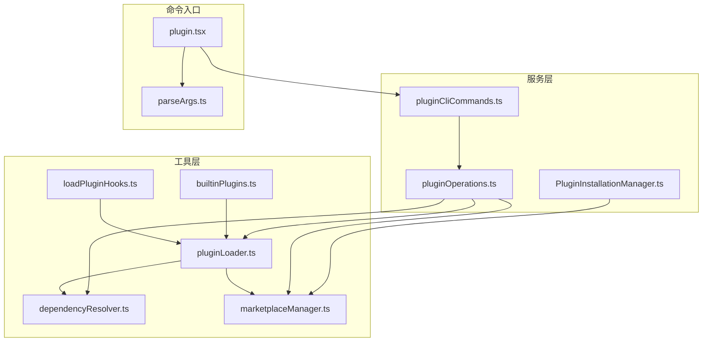

图表来源
- [PluginInstallationManager.ts:1-186](file://src/services/plugins/PluginInstallationManager.ts#L1-L186)
- [pluginOperations.ts:1-800](file://src/services/plugins/pluginOperations.ts#L1-L800)
- [pluginCliCommands.ts:1-346](file://src/services/plugins/pluginCliCommands.ts#L1-L346)
- [pluginLoader.ts:1-200](file://src/utils/plugins/pluginLoader.ts#L1-L200)
- [dependencyResolver.ts:1-200](file://src/utils/plugins/dependencyResolver.ts#L1-L200)
- [marketplaceManager.ts:1-200](file://src/utils/plugins/marketplaceManager.ts#L1-L200)
- [builtinPlugins.ts:1-161](file://src/plugins/builtinPlugins.ts#L1-L161)
- [loadPluginHooks.ts:1-215](file://src/utils/plugins/loadPluginHooks.ts#L1-L215)
- [plugin.tsx:1-9](file://src/commands/plugin/plugin.tsx#L1-L9)
- [parseArgs.ts:1-106](file://src/commands/plugin/parseArgs.ts#L1-L106)

章节来源
- [PluginInstallationManager.ts:1-186](file://src/services/plugins/PluginInstallationManager.ts#L1-L186)
- [pluginOperations.ts:1-800](file://src/services/plugins/pluginOperations.ts#L1-L800)
- [pluginCliCommands.ts:1-346](file://src/services/plugins/pluginCliCommands.ts#L1-L346)
- [pluginLoader.ts:1-200](file://src/utils/plugins/pluginLoader.ts#L1-L200)
- [dependencyResolver.ts:1-200](file://src/utils/plugins/dependencyResolver.ts#L1-L200)
- [marketplaceManager.ts:1-200](file://src/utils/plugins/marketplaceManager.ts#L1-L200)
- [builtinPlugins.ts:1-161](file://src/plugins/builtinPlugins.ts#L1-L161)
- [loadPluginHooks.ts:1-215](file://src/utils/plugins/loadPluginHooks.ts#L1-L215)
- [plugin.tsx:1-9](file://src/commands/plugin/plugin.tsx#L1-L9)
- [parseArgs.ts:1-106](file://src/commands/plugin/parseArgs.ts#L1-L106)

## 核心组件
- 安装管理器：在启动时后台执行市场源对齐与插件缓存更新，自动刷新插件并处理失败回退。
- 核心操作库：提供安装、卸载、启用/禁用、更新等纯函数式操作，返回标准化结果对象，不直接写入控制台或退出进程。
- CLI 命令封装：将核心操作包装为 CLI 行为，负责输出、错误分类与进程退出。
- 插件加载器：统一发现、加载与校验插件，支持市场源、内联目录与内置插件，维护版本化缓存路径。
- 依赖解析器：安装期进行闭包解析与环检测，加载期进行存在性验证与降级。
- 市场源管理器：管理已知市场源、缓存清单、克隆与更新，支持本地与远程来源。
- 内置插件注册：内置插件可被用户启用/禁用，区别于“捆绑技能”，具备 UI 可控性。
- 钩子热重载：监听设置变更，按需清理/重注册钩子，维持运行时一致性。

章节来源
- [PluginInstallationManager.ts:1-186](file://src/services/plugins/PluginInstallationManager.ts#L1-L186)
- [pluginOperations.ts:1-800](file://src/services/plugins/pluginOperations.ts#L1-L800)
- [pluginCliCommands.ts:1-346](file://src/services/plugins/pluginCliCommands.ts#L1-L346)
- [pluginLoader.ts:1-200](file://src/utils/plugins/pluginLoader.ts#L1-L200)
- [dependencyResolver.ts:1-200](file://src/utils/plugins/dependencyResolver.ts#L1-L200)
- [marketplaceManager.ts:1-200](file://src/utils/plugins/marketplaceManager.ts#L1-L200)
- [builtinPlugins.ts:1-161](file://src/plugins/builtinPlugins.ts#L1-L161)
- [loadPluginHooks.ts:1-215](file://src/utils/plugins/loadPluginHooks.ts#L1-L215)

## 架构总览
插件管理采用“服务层 + 工具层”的分层设计：
- 服务层通过纯函数暴露操作接口，CLI 与 UI 仅调用这些接口，保证可测试性与一致性。
- 工具层负责底层细节：缓存、依赖、市场源、加载与版本化路径计算。
- 生命周期贯穿“声明（settings）→缓存（cache）→加载（loader）→运行（hooks/commands）”。

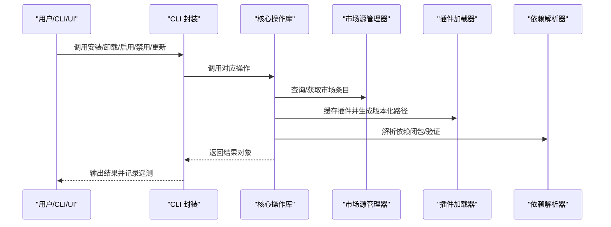

图表来源
- [pluginCliCommands.ts:1-346](file://src/services/plugins/pluginCliCommands.ts#L1-L346)
- [pluginOperations.ts:1-800](file://src/services/plugins/pluginOperations.ts#L1-L800)
- [marketplaceManager.ts:1-200](file://src/utils/plugins/marketplaceManager.ts#L1-L200)
- [pluginLoader.ts:1-200](file://src/utils/plugins/pluginLoader.ts#L1-L200)
- [dependencyResolver.ts:1-200](file://src/utils/plugins/dependencyResolver.ts#L1-L200)

## 详细组件分析

### 组件一：安装管理器（后台市场源与插件缓存协调）
职责
- 后台执行市场源对齐与插件缓存更新，避免阻塞启动。
- 将进度事件映射到应用状态，驱动 UI 展示。
- 新增市场源后自动刷新插件，更新后提示用户手动重载。

关键点
- 计算声明与已物化的市场源差异，预渲染 UI 状态。
- 使用进度回调更新市场源安装状态，区分 pending/installing/installed/failed。
- 自动刷新失败时回退至 needsRefresh 标记，引导用户手动重载。

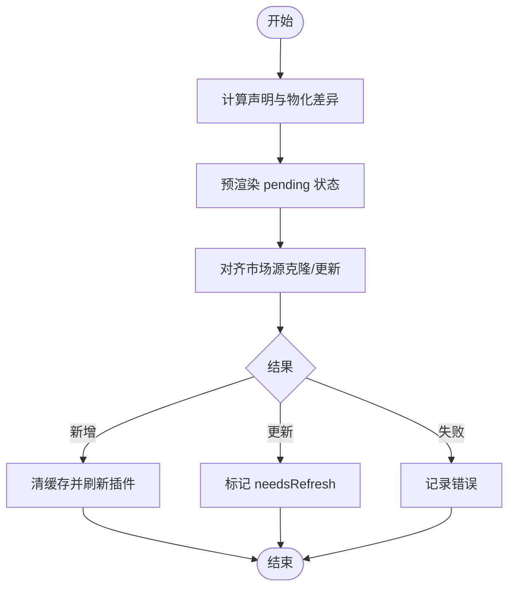

图表来源
- [PluginInstallationManager.ts:60-184](file://src/services/plugins/PluginInstallationManager.ts#L60-L184)

章节来源
- [PluginInstallationManager.ts:1-186](file://src/services/plugins/PluginInstallationManager.ts#L1-L186)

### 组件二：核心操作库（安装/卸载/启用/禁用/更新）
职责
- 提供纯函数式操作，返回标准化结果对象，便于 CLI/UI 复用。
- 支持 scope（user/project/local/managed），并进行策略与权限检查。
- 统一处理依赖解析、版本化缓存、安装路径更新与数据目录清理。

关键流程
- 安装：搜索市场条目 → 写入设置（声明意图）→ 缓存插件并记录版本提示。
- 卸载：定位安装位置 → 从设置中删除 → 清理 installed_plugins_v2.json → 最后 scope 移除时清理选项与数据目录。
- 启用/禁用：从设置中解析最具体 scope → 策略检查 → 写入设置并清除缓存。
- 更新：计算目标版本 → 版本化缓存 → 更新磁盘记录 → 处理已最新场景。

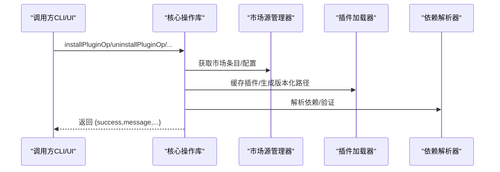

图表来源
- [pluginOperations.ts:321-418](file://src/services/plugins/pluginOperations.ts#L321-L418)
- [pluginOperations.ts:427-558](file://src/services/plugins/pluginOperations.ts#L427-L558)
- [pluginOperations.ts:573-775](file://src/services/plugins/pluginOperations.ts#L573-L775)
- [pluginOperations.ts:1010-1053](file://src/services/plugins/pluginOperations.ts#L1010-L1053)

章节来源
- [pluginOperations.ts:1-800](file://src/services/plugins/pluginOperations.ts#L1-L800)
- [pluginOperations.ts:1010-1053](file://src/services/plugins/pluginOperations.ts#L1010-L1053)

### 组件三：CLI 命令封装
职责
- 将核心操作包装为 CLI 行为，负责输出、错误分类与进程退出。
- 记录遥测事件，区分成功与失败场景。

关键点
- 错误处理统一：捕获异常 → 记录日志 → 输出人类可读消息 → 分类错误类型 → 发送遥测 → 退出进程。
- 成功事件：安装/卸载/启用/禁用/更新分别记录对应遥测字段。

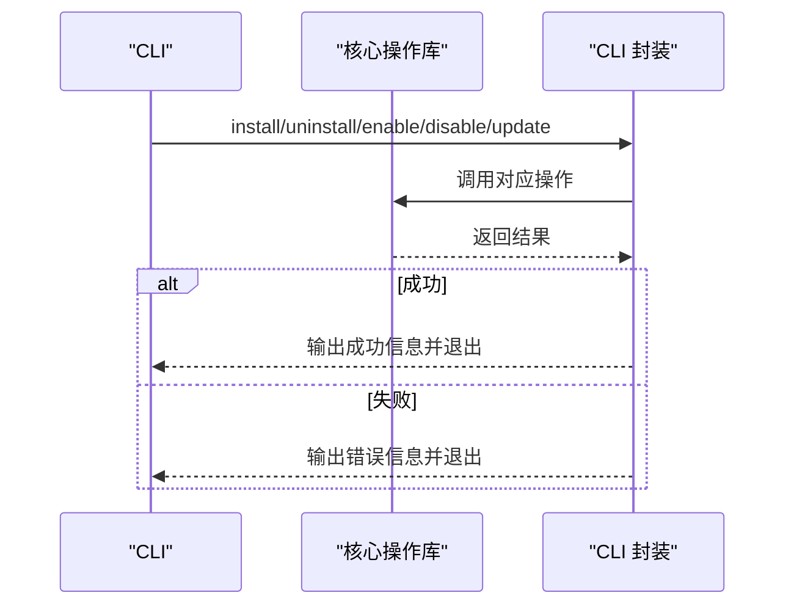

图表来源
- [pluginCliCommands.ts:103-146](file://src/services/plugins/pluginCliCommands.ts#L103-L146)
- [pluginCliCommands.ts:153-188](file://src/services/plugins/pluginCliCommands.ts#L153-L188)
- [pluginCliCommands.ts:195-229](file://src/services/plugins/pluginCliCommands.ts#L195-L229)
- [pluginCliCommands.ts:236-269](file://src/services/plugins/pluginCliCommands.ts#L236-L269)
- [pluginCliCommands.ts:275-293](file://src/services/plugins/pluginCliCommands.ts#L275-L293)
- [pluginCliCommands.ts:300-344](file://src/services/plugins/pluginCliCommands.ts#L300-L344)

章节来源
- [pluginCliCommands.ts:1-346](file://src/services/plugins/pluginCliCommands.ts#L1-L346)

### 组件四：插件加载器与版本化缓存
职责
- 统一发现与加载插件：内置插件、市场源、会话内联目录。
- 维护版本化缓存路径，支持 zip 缓存与种子目录探测。
- 校验清单、解析钩子、收集错误并报告。

关键点
- 版本化缓存路径：~/.claude/plugins/cache/{marketplace}/{plugin}/{version}/，并提供 zip 变体。
- 种子目录探测：按优先级查找已填充的版本缓存，加速加载。
- 内置插件：以 @builtin 标识，可被用户启用/禁用。

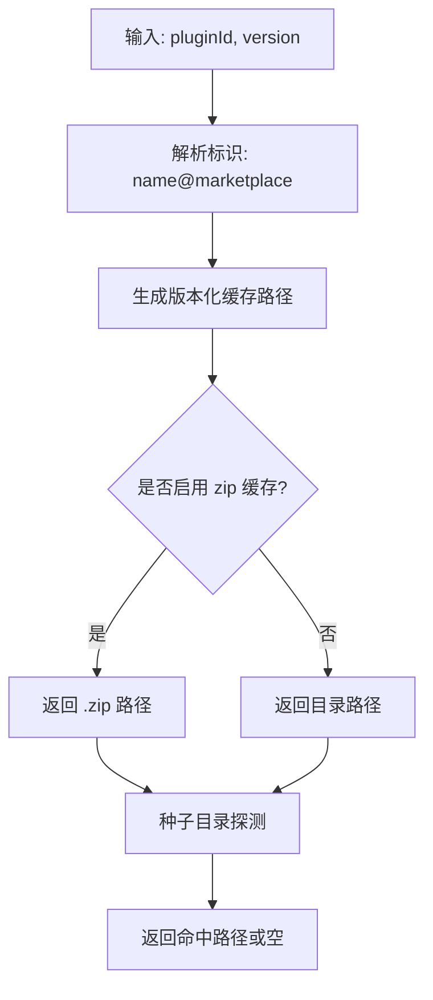

图表来源
- [pluginLoader.ts:139-188](file://src/utils/plugins/pluginLoader.ts#L139-L188)

章节来源
- [pluginLoader.ts:1-200](file://src/utils/plugins/pluginLoader.ts#L1-L200)
- [builtinPlugins.ts:1-161](file://src/plugins/builtinPlugins.ts#L1-L161)
- [index.ts:1-25](file://src/plugins/bundled/index.ts#L1-L25)

### 组件五：依赖解析与加载期验证
职责
- 安装期：通过 DFS 遍历依赖闭包，检测环与缺失，限制跨市场依赖。
- 加载期：固定点迭代验证依赖存在性，对缺失或未启用的依赖进行降级。

关键点
- 依赖规范化：裸名继承声明插件的市场源；内联插件（--plugin-dir）保留裸名以便名称匹配。
- 跨市场依赖默认禁止，可通过根市场清单中的白名单放行。
- 加载期验证：若依赖缺失，循环降级直至稳定。

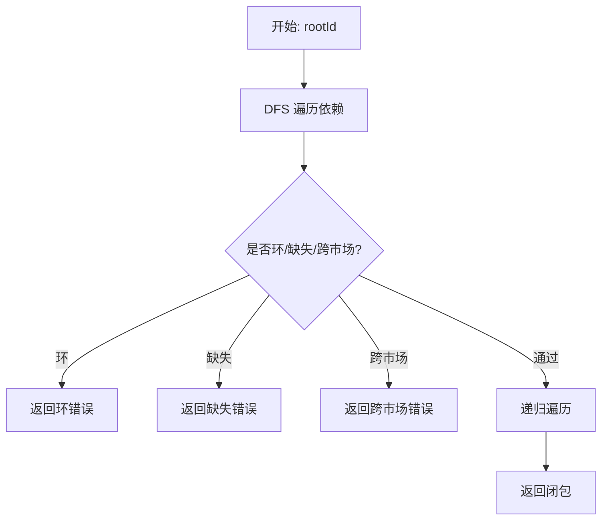

图表来源
- [dependencyResolver.ts:95-159](file://src/utils/plugins/dependencyResolver.ts#L95-L159)
- [dependencyResolver.ts:177-200](file://src/utils/plugins/dependencyResolver.ts#L177-L200)

章节来源
- [dependencyResolver.ts:1-200](file://src/utils/plugins/dependencyResolver.ts#L1-L200)

### 组件六：市场源管理与后台安装
职责
- 管理已知市场源（URL/Git/NPM/本地），缓存清单并支持更新。
- 对齐声明与物化状态，追踪差异并执行安装/更新。
- 在新安装后自动刷新插件，在更新后提示用户重载。

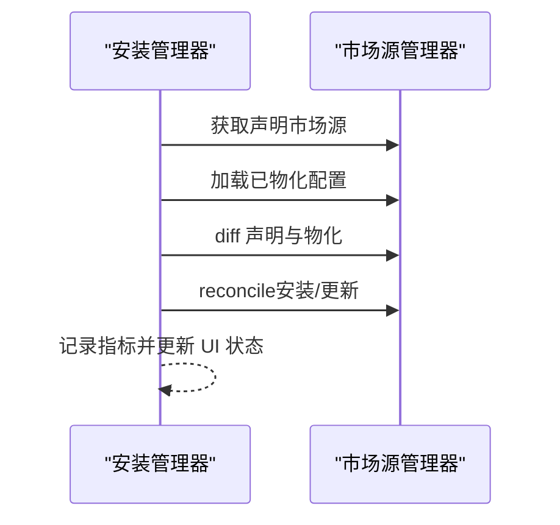

图表来源
- [PluginInstallationManager.ts:60-184](file://src/services/plugins/PluginInstallationManager.ts#L60-L184)
- [marketplaceManager.ts:161-192](file://src/utils/plugins/marketplaceManager.ts#L161-L192)

章节来源
- [marketplaceManager.ts:1-200](file://src/utils/plugins/marketplaceManager.ts#L1-L200)
- [PluginInstallationManager.ts:1-186](file://src/services/plugins/PluginInstallationManager.ts#L1-L186)

### 组件七：内置插件与 UI 入口
职责
- 内置插件注册与状态管理，支持用户启用/禁用。
- UI 入口将 /plugin 命令路由到设置界面，参数解析支持菜单、帮助、安装、管理、卸载、启用、禁用、验证与市场源管理。

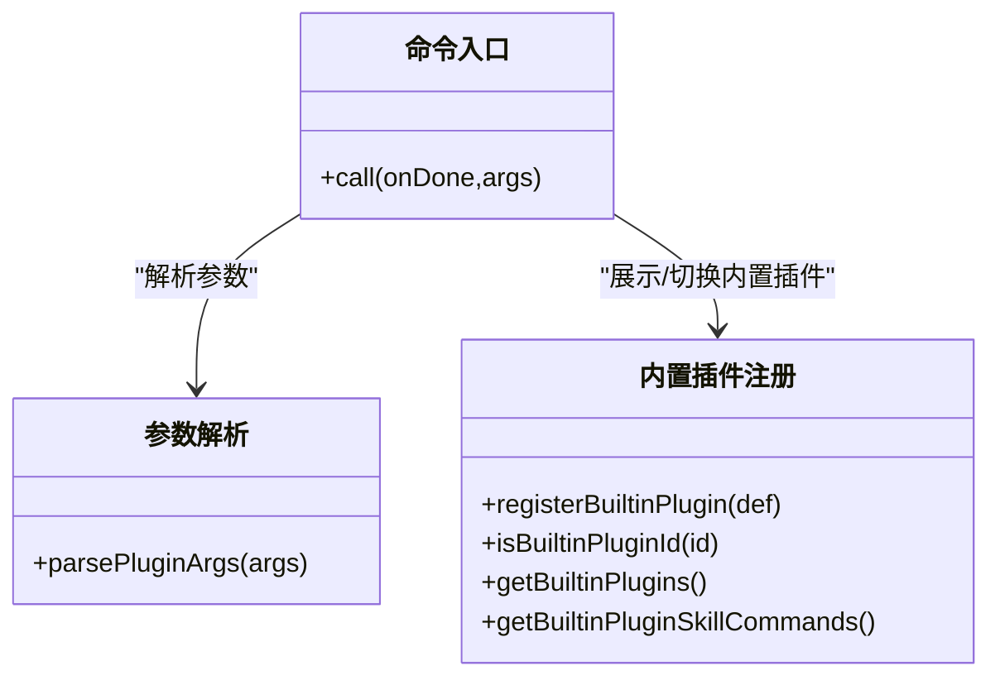

图表来源
- [builtinPlugins.ts:28-102](file://src/plugins/builtinPlugins.ts#L28-L102)
- [plugin.tsx:1-9](file://src/commands/plugin/plugin.tsx#L1-L9)
- [parseArgs.ts:17-103](file://src/commands/plugin/parseArgs.ts#L17-L103)

章节来源
- [builtinPlugins.ts:1-161](file://src/plugins/builtinPlugins.ts#L1-L161)
- [plugin.tsx:1-9](file://src/commands/plugin/plugin.tsx#L1-L9)
- [parseArgs.ts:1-106](file://src/commands/plugin/parseArgs.ts#L1-L106)

### 组件八：钩子热重载与状态同步
职责
- 监听设置变化，清理旧钩子并按当前启用插件集合重注册。
- 保持钩子回调持久化，仅重排存活匹配器，避免中断运行时行为。

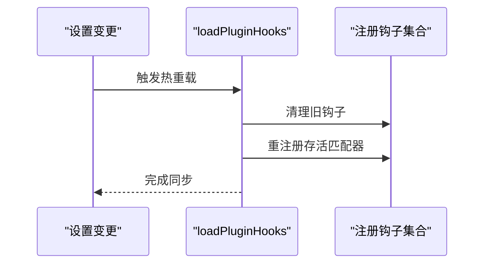

图表来源
- [loadPluginHooks.ts:1-215](file://src/utils/plugins/loadPluginHooks.ts#L1-L215)

章节来源
- [loadPluginHooks.ts:1-215](file://src/utils/plugins/loadPluginHooks.ts#L1-L215)

## 依赖关系分析
- 模块耦合
  - 服务层与工具层通过清晰的接口解耦：服务层只依赖工具层提供的纯函数与查询能力。
  - 插件加载器与依赖解析器紧密协作，前者负责发现与缓存，后者负责依赖语义与安全边界。
  - 市场源管理器为安装与加载提供统一的数据源，支持本地与远程来源。
- 外部依赖
  - 文件系统与 Git 工具用于缓存与仓库克隆。
  - HTTP 客户端用于远程市场源拉取。
- 循环依赖
  - 未见直接循环依赖；各模块职责单一并通过函数调用交互。

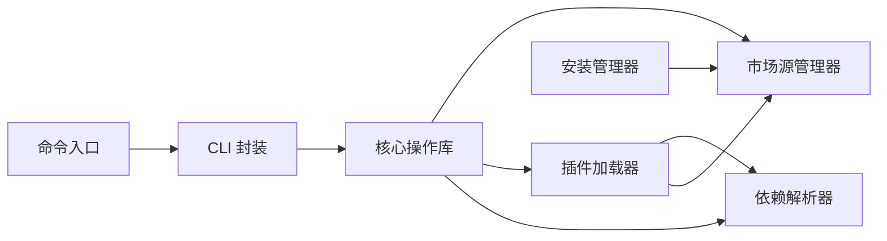

图表来源
- [pluginOperations.ts:1-800](file://src/services/plugins/pluginOperations.ts#L1-L800)
- [pluginCliCommands.ts:1-346](file://src/services/plugins/pluginCliCommands.ts#L1-L346)
- [pluginLoader.ts:1-200](file://src/utils/plugins/pluginLoader.ts#L1-L200)
- [dependencyResolver.ts:1-200](file://src/utils/plugins/dependencyResolver.ts#L1-L200)
- [marketplaceManager.ts:1-200](file://src/utils/plugins/marketplaceManager.ts#L1-L200)
- [PluginInstallationManager.ts:1-186](file://src/services/plugins/PluginInstallationManager.ts#L1-L186)
- [plugin.tsx:1-9](file://src/commands/plugin/plugin.tsx#L1-L9)

章节来源
- [pluginOperations.ts:1-800](file://src/services/plugins/pluginOperations.ts#L1-L800)
- [pluginCliCommands.ts:1-346](file://src/services/plugins/pluginCliCommands.ts#L1-L346)
- [pluginLoader.ts:1-200](file://src/utils/plugins/pluginLoader.ts#L1-L200)
- [dependencyResolver.ts:1-200](file://src/utils/plugins/dependencyResolver.ts#L1-L200)
- [marketplaceManager.ts:1-200](file://src/utils/plugins/marketplaceManager.ts#L1-L200)
- [PluginInstallationManager.ts:1-186](file://src/services/plugins/PluginInstallationManager.ts#L1-L186)
- [plugin.tsx:1-9](file://src/commands/plugin/plugin.tsx#L1-L9)

## 性能考量
- 缓存优先：版本化缓存与 zip 缓存减少重复下载与解压；种子目录探测提升冷启动速度。
- 异步后台：市场源对齐在后台执行，避免阻塞主流程；UI 状态即时反馈。
- 批量操作：卸载与禁用支持批量处理，减少多次 I/O 与设置写入。
- 依赖解析：安装期一次性构建闭包，加载期固定点验证，避免重复计算。

## 故障排除指南
常见问题与处理
- 插件未找到
  - 检查市场源是否已声明且可访问；确认插件名称与市场源格式正确。
  - 参考安装失败的错误消息，必要时使用 /reload-plugins 或重新声明市场源。
- 依赖冲突或缺失
  - 安装期会返回依赖解析错误（环/缺失/跨市场），按提示修正依赖或调整市场源。
  - 加载期验证失败会降级受影响插件，使用 /doctor 查看错误详情。
- 权限与策略拦截
  - 若组织策略阻止某插件或其依赖，启用/安装会被拒绝；联系管理员调整策略。
- 卸载后残留
  - 确认是否为最后 scope；最后 scope 移除会清理选项与数据目录；否则仅移除安装记录。
- 热重载无效
  - 检查设置变更是否触发钩子重载；如未生效，尝试手动重载插件或重启会话。

章节来源
- [pluginOperations.ts:382-409](file://src/services/plugins/pluginOperations.ts#L382-L409)
- [dependencyResolver.ts:100-159](file://src/utils/plugins/dependencyResolver.ts#L100-L159)
- [loadPluginHooks.ts:186-207](file://src/utils/plugins/loadPluginHooks.ts#L186-L207)

## 结论
该插件管理服务通过清晰的服务/工具分层、严格的依赖解析与版本化缓存策略，实现了可扩展、可观测、可恢复的插件生态。后台安装协调与热重载机制确保了用户体验与系统稳定性；CLI 与 UI 的统一接口提升了可维护性与一致性。遵循本文的最佳实践与安全策略，可有效降低风险并提升运维效率。

## 附录

### 插件 CLI 命令系统
- 安装：支持指定 scope（user/project/local），自动缓存并记录版本提示。
- 卸载：支持保留/删除数据目录，清理设置与安装记录，最后 scope 移除时清理选项与数据。
- 启用/禁用：自动解析最具体 scope，支持跨 scope 覆盖与策略检查。
- 更新：计算目标版本，更新磁盘记录，处理已最新场景。
- 批量与自动化：通过脚本组合多条命令实现批量安装/卸载/禁用；结合后台安装协调减少等待。

章节来源
- [pluginCliCommands.ts:103-146](file://src/services/plugins/pluginCliCommands.ts#L103-L146)
- [pluginCliCommands.ts:153-188](file://src/services/plugins/pluginCliCommands.ts#L153-L188)
- [pluginCliCommands.ts:195-229](file://src/services/plugins/pluginCliCommands.ts#L195-L229)
- [pluginCliCommands.ts:236-269](file://src/services/plugins/pluginCliCommands.ts#L236-L269)
- [pluginCliCommands.ts:275-293](file://src/services/plugins/pluginCliCommands.ts#L275-L293)
- [pluginCliCommands.ts:300-344](file://src/services/plugins/pluginCliCommands.ts#L300-L344)

### 插件生命周期、热重载与状态同步
- 生命周期：声明（settings）→ 缓存（cache）→ 加载（loader）→ 运行（hooks/commands）→ 卸载（清理）。
- 热重载：监听设置变化，清理并重注册钩子，保持回调持久化。
- 状态同步：安装管理器将进度映射到应用状态，驱动 UI 实时反馈。

章节来源
- [loadPluginHooks.ts:1-215](file://src/utils/plugins/loadPluginHooks.ts#L1-L215)
- [PluginInstallationManager.ts:60-184](file://src/services/plugins/PluginInstallationManager.ts#L60-L184)

### 插件管理最佳实践
- 明确 scope：优先使用 local/project 限定团队范围，避免误改共享设置。
- 依赖最小化：安装前评估依赖闭包，避免跨市场依赖与环。
- 定期更新：利用后台安装协调与更新提示，保持插件与市场源最新。
- 安全策略：遵守组织策略，避免安装被拦截的插件或依赖。

### 安全策略
- 跨市场依赖默认禁止，防止从不受信任来源拉取。
- 依赖解析阶段进行环检测与缺失校验，加载期固定点验证。
- 市场源来源白名单与黑名单控制，支持环境变量与策略开关。

章节来源
- [dependencyResolver.ts:78-132](file://src/utils/plugins/dependencyResolver.ts#L78-L132)
- [marketplaceManager.ts:59-65](file://src/utils/plugins/marketplaceManager.ts#L59-L65)