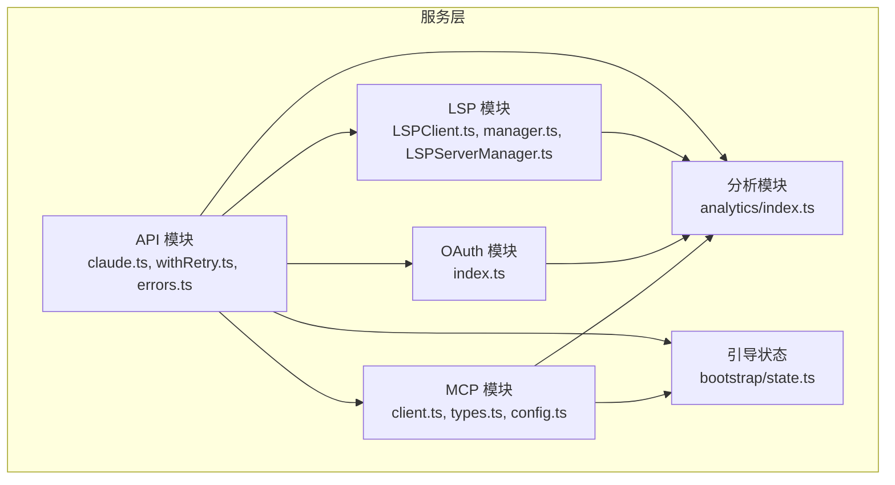
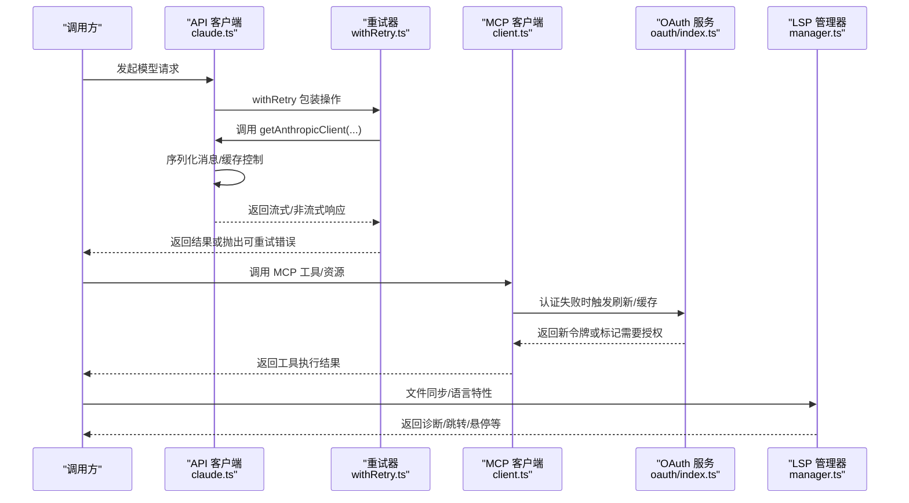
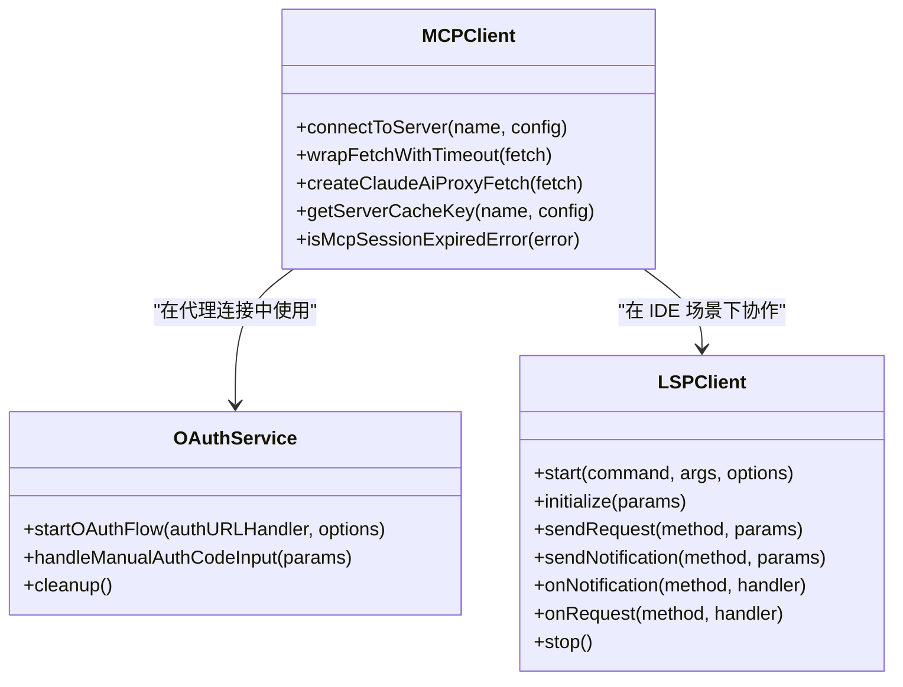
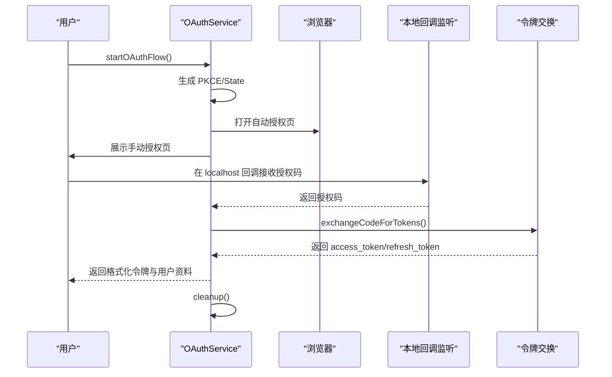
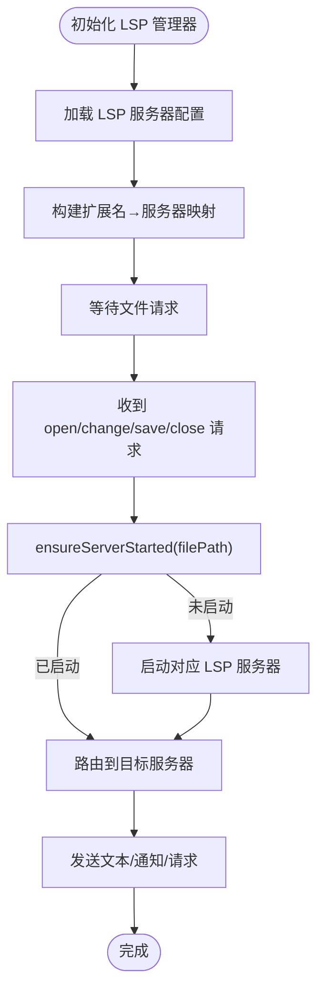
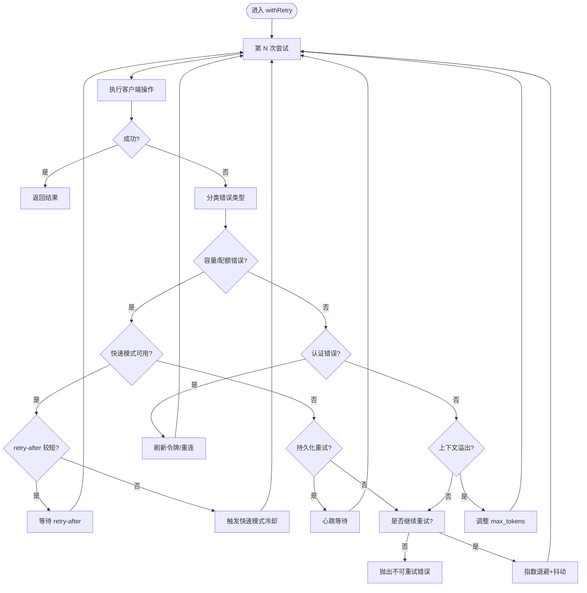
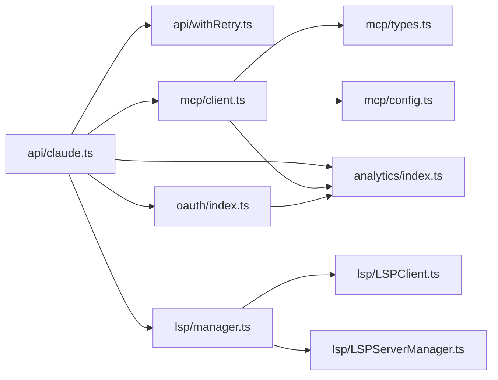

# 服务层

<cite>
**本文引用的文件**
- [src/services/mcp/MCPConnectionManager.tsx](file://src/services/mcp/MCPConnectionManager.tsx)
- [src/services/mcp/client.ts](file://src/services/mcp/client.ts)
- [src/services/mcp/types.ts](file://src/services/mcp/types.ts)
- [src/services/mcp/config.ts](file://src/services/mcp/config.ts)
- [src/services/oauth/index.ts](file://src/services/oauth/index.ts)
- [src/services/lsp/LSPClient.ts](file://src/services/lsp/LSPClient.ts)
- [src/services/lsp/manager.ts](file://src/services/lsp/manager.ts)
- [src/services/lsp/LSPServerManager.ts](file://src/services/lsp/LSPServerManager.ts)
- [src/services/api/claude.ts](file://src/services/api/claude.ts)
- [src/services/api/withRetry.ts](file://src/services/api/withRetry.ts)
- [src/services/api/errors.ts](file://src/services/api/errors.ts)
- [src/services/analytics/index.ts](file://src/services/analytics/index.ts)
- [src/bootstrap/state.ts](file://src/bootstrap/state.ts)
</cite>

## 目录
1. [引言](#引言)
2. [项目结构](#项目结构)
3. [核心组件](#核心组件)
4. [架构总览](#架构总览)
5. [详细组件分析](#详细组件分析)
6. [依赖关系分析](#依赖关系分析)
7. [性能考量](#性能考量)
8. [故障排查指南](#故障排查指南)
9. [结论](#结论)
10. [附录](#附录)

## 引言
本文件系统性梳理 Claude Code 的服务层，聚焦外部服务集成与运行时控制，涵盖以下主题：
- 外部服务集成：API 服务（Anthropic）、分析服务（事件日志与导出）、认证服务（OAuth 2.0 with PKCE）、配置管理服务（MCP 与 LSP）。
- MCP 服务：连接管理、认证与授权、传输层抽象、会话过期检测与重连策略。
- OAuth 2.0：授权码流程（含浏览器自动与手动两种模式）、状态与 PKCE 校验、令牌刷新与降级处理。
- LSP 语言服务器：进程生命周期、JSON-RPC 连接、通知与请求分发、IDE 集成与代理支持。
- 错误处理与重试：统一的 API 重试器、容量与配额错误分类、快速模式降级、持久化重试与心跳。
- 性能监控：指标采集、埋点与导出、遥测与统计存储。
- 扩展指南：新增 MCP 服务器、LSP 服务器与认证方式的接入步骤。

## 项目结构
服务层位于 src/services 下，按功能域划分模块：
- mcp：MCP 协议客户端、连接管理、配置解析与策略过滤、认证适配。
- oauth：OAuth 2.0 授权码流程（PKCE）、本地回调监听、令牌获取与用户资料查询。
- lsp：LSP 客户端封装、服务器管理器、文件同步与通知路由。
- api：API 客户端封装、消息序列化、提示缓存控制、重试与错误分类。
- analytics：事件日志公共接口、队列与后端导出。
- 其他：速率限制、诊断跟踪、内部日志等。

图表来源
- [src/services/mcp/client.ts](file://src/services/mcp/client.ts)
- [src/services/mcp/types.ts](file://src/services/mcp/types.ts)
- [src/services/mcp/config.ts](file://src/services/mcp/config.ts)
- [src/services/oauth/index.ts](file://src/services/oauth/index.ts)
- [src/services/lsp/LSPClient.ts](file://src/services/lsp/LSPClient.ts)
- [src/services/lsp/manager.ts](file://src/services/lsp/manager.ts)
- [src/services/lsp/LSPServerManager.ts](file://src/services/lsp/LSPServerManager.ts)
- [src/services/api/claude.ts](file://src/services/api/claude.ts)
- [src/services/api/withRetry.ts](file://src/services/api/withRetry.ts)
- [src/services/api/errors.ts](file://src/services/api/errors.ts)
- [src/services/analytics/index.ts](file://src/services/analytics/index.ts)
- [src/bootstrap/state.ts](file://src/bootstrap/state.ts)

章节来源
- [src/services/mcp/MCPConnectionManager.tsx](file://src/services/mcp/MCPConnectionManager.tsx)
- [src/services/mcp/client.ts](file://src/services/mcp/client.ts)
- [src/services/mcp/types.ts](file://src/services/mcp/types.ts)
- [src/services/mcp/config.ts](file://src/services/mcp/config.ts)
- [src/services/oauth/index.ts](file://src/services/oauth/index.ts)
- [src/services/lsp/LSPClient.ts](file://src/services/lsp/LSPClient.ts)
- [src/services/lsp/manager.ts](file://src/services/lsp/manager.ts)
- [src/services/lsp/LSPServerManager.ts](file://src/services/lsp/LSPServerManager.ts)
- [src/services/api/claude.ts](file://src/services/api/claude.ts)
- [src/services/api/withRetry.ts](file://src/services/api/withRetry.ts)
- [src/services/api/errors.ts](file://src/services/api/errors.ts)
- [src/services/analytics/index.ts](file://src/services/analytics/index.ts)
- [src/bootstrap/state.ts](file://src/bootstrap/state.ts)

## 核心组件
- MCP 客户端与连接管理：统一的 MCP 客户端封装、多种传输（stdio/SSE/HTTP/WebSocket/SDK）、认证提供者、超时与 Accept 头规范化、批量连接与缓存键生成、会话过期检测与清理。
- OAuth 服务：PKCE 授权码流程、本地回调监听、令牌交换与用户资料获取、自动/手动两种授权路径、错误重定向与资源清理。
- LSP 客户端与管理器：进程启动与 JSON-RPC 连接、协议追踪、通知/请求注册、文件同步（didOpen/didChange/didSave/didClose）、多服务器映射与延迟启动。
- API 封装与重试：消息序列化与缓存控制、提示缓存 TTL 策略、统一重试器 withRetry、容量/配额/上下文溢出错误处理、快速模式降级与持久化重试。
- 分析服务：事件日志公共接口、队列与后端导出、元数据清洗与采样、异步/同步事件记录。
- 引导状态：全局会话与指标、计数器、时间度量、错误日志、遥测提供者与追踪器。

章节来源
- [src/services/mcp/client.ts](file://src/services/mcp/client.ts)
- [src/services/oauth/index.ts](file://src/services/oauth/index.ts)
- [src/services/lsp/LSPClient.ts](file://src/services/lsp/LSPClient.ts)
- [src/services/lsp/manager.ts](file://src/services/lsp/manager.ts)
- [src/services/lsp/LSPServerManager.ts](file://src/services/lsp/LSPServerManager.ts)
- [src/services/api/claude.ts](file://src/services/api/claude.ts)
- [src/services/api/withRetry.ts](file://src/services/api/withRetry.ts)
- [src/services/api/errors.ts](file://src/services/api/errors.ts)
- [src/services/analytics/index.ts](file://src/services/analytics/index.ts)
- [src/bootstrap/state.ts](file://src/bootstrap/state.ts)

## 架构总览
服务层通过统一的客户端封装与中间件式错误处理，向上游工具与命令提供稳定可靠的外部服务访问能力；通过配置与策略模块实现企业级管控与安全隔离。

图表来源
- [src/services/api/claude.ts](file://src/services/api/claude.ts)
- [src/services/api/withRetry.ts](file://src/services/api/withRetry.ts)
- [src/services/mcp/client.ts](file://src/services/mcp/client.ts)
- [src/services/oauth/index.ts](file://src/services/oauth/index.ts)
- [src/services/lsp/manager.ts](file://src/services/lsp/manager.ts)

## 详细组件分析

### MCP 服务
- 连接管理
  - 支持多种传输：stdio、SSE、HTTP、WebSocket、IDE 特殊通道（sse-ide/ws-ide）、SDK 占位。
  - 统一的客户端封装与传输选择逻辑，动态注入用户代理、代理与 TLS 选项。
  - 连接缓存键生成与批量连接策略，避免重复握手。
  - 会话过期检测（HTTP 404 + JSON-RPC code -32001），触发清理并要求重新建立连接。
- 认证与授权
  - OAuth 配置内联于服务器配置，支持 clientId/callbackPort/authServerMetadataUrl。
  - Claude.ai 代理连接使用 Bearer 令牌，带一次性重试与令牌变更检测。
  - 15 分钟“需要授权”缓存，避免大规模 401 冻结。
- 工具与资源
  - 工具描述长度上限与内容截断，防止超大 OpenAPI 文档污染上下文。
  - 资源读取与二进制输出持久化，带尺寸估算与安全清理。
- 配置与策略
  - 命名空间化插件 MCP 服务器，去重策略优先级：手动配置 > 插件加载顺序。
  - 企业策略：允许/拒绝列表，支持名称、命令数组、URL 模式匹配。
  - 环境变量控制连接批大小、超时、Accept 头等。

图表来源
- [src/services/mcp/client.ts](file://src/services/mcp/client.ts)
- [src/services/oauth/index.ts](file://src/services/oauth/index.ts)
- [src/services/lsp/LSPClient.ts](file://src/services/lsp/LSPClient.ts)

章节来源
- [src/services/mcp/client.ts](file://src/services/mcp/client.ts)
- [src/services/mcp/types.ts](file://src/services/mcp/types.ts)
- [src/services/mcp/config.ts](file://src/services/mcp/config.ts)

### OAuth 2.0 认证流程
- 流程概览
  - 生成 code_verifier 与 code_challenge（PKCE），随机 state。
  - 同时准备“手动/自动”两种授权 URL，自动流程尝试打开浏览器，手动流程提供复制粘贴入口。
  - 本地启动回调监听，捕获授权码；根据是否为自动流程决定成功重定向。
  - 交换授权码为令牌，拉取用户资料（订阅类型、速率等级），格式化返回。
  - 清理资源（关闭监听、解析器复位）。
- 错误处理
  - 自动流程出现错误时发送错误重定向，确保用户体验一致。
  - 支持 skipBrowserOpen 模式，由上层控制显示与打开方式（如 SDK 控制协议）。

图表来源
- [src/services/oauth/index.ts](file://src/services/oauth/index.ts)

章节来源
- [src/services/oauth/index.ts](file://src/services/oauth/index.ts)

### LSP 语言服务器集成
- 客户端封装
  - 进程启动、stdio 读写、JSON-RPC 连接、错误与关闭事件处理。
  - 协议追踪（verbose），调试日志与 stdin/stdout 错误抑制。
  - 延迟注册通知/请求处理器，保证连接就绪后再应用。
- 管理器
  - 多服务器映射（扩展名到服务器列表），按文件类型选择首个匹配服务器。
  - 延迟启动：仅在首次需要时启动对应服务器，减少资源占用。
  - 文件同步：didOpen/didChange/didSave/didClose，维护已打开文件集合。
- IDE 集成
  - SSE-IDE 与 WS-IDE 通道，支持 IDE 名称、平台标志与鉴权头。
  - 代理与 TLS 选项透传，兼容不同运行环境。

图表来源
- [src/services/lsp/manager.ts](file://src/services/lsp/manager.ts)
- [src/services/lsp/LSPServerManager.ts](file://src/services/lsp/LSPServerManager.ts)
- [src/services/lsp/LSPClient.ts](file://src/services/lsp/LSPClient.ts)

章节来源
- [src/services/lsp/LSPClient.ts](file://src/services/lsp/LSPClient.ts)
- [src/services/lsp/manager.ts](file://src/services/lsp/manager.ts)
- [src/services/lsp/LSPServerManager.ts](file://src/services/lsp/LSPServerManager.ts)

### API 服务与重试策略
- 消息与缓存
  - 用户/助手消息序列化，支持提示缓存控制（ephemeral + TTL），按查询来源与用户资格动态调整。
  - 提示缓存 TTL 1 小时策略与 GrowthBook 允许清单，避免频繁缓存破坏。
- 重试器 withRetry
  - 统一错误分类：容量错误（529/429）、连接错误（ECONNRESET/EPIPE）、认证错误（401/403）、上下文溢出（400）等。
  - 快速模式降级：短 retry-after 使用快速模式保留缓存，长 retry-after 触发冷却并切换标准速度模型。
  - 持久化重试：在特定场景下无限重试并周期性心跳，避免被宿主环境判定为空闲。
  - 最大令牌调整：当输入+max_tokens 超过上下文限制时，动态下调 max_tokens 并重试。
- 错误分类与提示
  - 详细的错误消息生成与 UI 友好提示，区分媒体过大、PDF 密码保护、无效 PDF、图像尺寸限制、工具并发问题等。
  - 企业策略与组织禁用提示，区分环境变量与订阅用户场景。

图表来源
- [src/services/api/withRetry.ts](file://src/services/api/withRetry.ts)
- [src/services/api/errors.ts](file://src/services/api/errors.ts)

章节来源
- [src/services/api/claude.ts](file://src/services/api/claude.ts)
- [src/services/api/withRetry.ts](file://src/services/api/withRetry.ts)
- [src/services/api/errors.ts](file://src/services/api/errors.ts)

### 分析服务与监控
- 事件日志
  - 无依赖的事件接口，事件入队直到后端导出器 attach。
  - 支持同步/异步事件记录，元数据清洗（移除 _PROTO_ 前缀字段）。
- 指标与状态
  - 引导状态集中管理会话指标（成本、时延、令牌用量、慢操作等），用于诊断与性能分析。
  - 与 OpenTelemetry 提供者集成，支持计数器、指标与追踪。

章节来源
- [src/services/analytics/index.ts](file://src/services/analytics/index.ts)
- [src/bootstrap/state.ts](file://src/bootstrap/state.ts)

## 依赖关系分析
- 模块耦合
  - API 模块对 OAuth、MCP、LSP 存在运行时依赖，但通过统一客户端封装降低耦合。
  - MCP 模块对 OAuth 的依赖集中在代理连接与令牌刷新。
  - LSP 模块与 MCP 在 IDE 场景下存在协同（例如文件同步与工具调用）。
- 外部依赖
  - MCP SDK（@modelcontextprotocol/sdk）、vscode-jsonrpc、vscode-languageserver-protocol。
  - Anthropic SDK（@anthropic-ai/sdk）与错误类型。
  - ws、fetch 适配与代理库。

图表来源
- [src/services/api/claude.ts](file://src/services/api/claude.ts)
- [src/services/api/withRetry.ts](file://src/services/api/withRetry.ts)
- [src/services/mcp/client.ts](file://src/services/mcp/client.ts)
- [src/services/mcp/types.ts](file://src/services/mcp/types.ts)
- [src/services/mcp/config.ts](file://src/services/mcp/config.ts)
- [src/services/oauth/index.ts](file://src/services/oauth/index.ts)
- [src/services/lsp/manager.ts](file://src/services/lsp/manager.ts)
- [src/services/lsp/LSPClient.ts](file://src/services/lsp/LSPClient.ts)
- [src/services/lsp/LSPServerManager.ts](file://src/services/lsp/LSPServerManager.ts)
- [src/services/analytics/index.ts](file://src/services/analytics/index.ts)

章节来源
- [src/services/api/claude.ts](file://src/services/api/claude.ts)
- [src/services/mcp/client.ts](file://src/services/mcp/client.ts)
- [src/services/oauth/index.ts](file://src/services/oauth/index.ts)
- [src/services/lsp/manager.ts](file://src/services/lsp/manager.ts)

## 性能考量
- 连接与传输
  - MCP 连接缓存键与批量连接，减少握手次数；SSE/HTTP/WS 传输均设置 Accept 头以满足 MCP Streamable HTTP 规范。
  - LSP 延迟启动与文件同步，避免不必要的进程与网络开销。
- 重试与退避
  - withRetry 使用指数退避与抖动，结合 retry-after 与固定最大值，平衡恢复速度与网络压力。
  - 快速模式降级避免缓存抖动，持久化重试在长时间等待中保持宿主活跃。
- 缓存与上下文
  - 提示缓存 TTL 与允许清单，减少重复计算；上下文溢出时自动调整 max_tokens。
- 指标与可观测性
  - 引导状态中的计数器与时间度量，配合分析服务导出，支撑性能回归与容量规划。

## 故障排查指南
- API 错误
  - 529/429：检查速率限制与配额，必要时启用持久化重试或切换模型。
  - 上下文溢出：查看 withRetry 中 max_tokens 调整日志，确认输入长度与输出预算。
  - 媒体/PDF/图像限制：参考错误消息中的建议（压缩、转换、拆分）。
- MCP 连接
  - 401/403：检查 OAuth 令牌缓存与刷新逻辑，确认代理连接的 Bearer 令牌有效性。
  - 会话过期：捕获 404 + JSON-RPC -32001，清理连接缓存并重建。
  - 传输异常：检查 Accept 头、代理与 TLS 设置，确认 EventSource/WS 连接参数。
- OAuth
  - 自动流程失败：确认本地监听端口可用与回调地址正确；手动流程需核对 state 与授权码一致性。
- LSP
  - 进程崩溃：查看 stderr 日志与退出码，确认命令与工作目录；重启后重新 didOpen。
  - 协议错误：启用协议追踪，定位具体方法与参数；检查通知/请求处理器注册时机。

章节来源
- [src/services/api/errors.ts](file://src/services/api/errors.ts)
- [src/services/api/withRetry.ts](file://src/services/api/withRetry.ts)
- [src/services/mcp/client.ts](file://src/services/mcp/client.ts)
- [src/services/oauth/index.ts](file://src/services/oauth/index.ts)
- [src/services/lsp/LSPClient.ts](file://src/services/lsp/LSPClient.ts)

## 结论
服务层通过统一的客户端封装、中间件式重试与错误处理、以及严格的配置与策略管控，实现了对 API、MCP、OAuth 与 LSP 的稳健集成。其设计兼顾性能（连接缓存、延迟启动、快速模式降级）与可靠性（持久化重试、会话过期检测、协议追踪）。配合分析服务与引导状态，形成从诊断到优化的闭环。

## 附录
- 服务扩展指南
  - 新增 MCP 服务器
    - 在配置中添加服务器条目（支持 stdio/sse/http/ws/sse-ide/ws-ide/sdk/claudeai-proxy），遵循类型校验。
    - 若为 stdio，提供命令与参数；若为远程，提供 URL 与可选头部。
    - 通过企业策略允许/拒绝该服务器，避免冲突与安全风险。
  - 新增 LSP 服务器
    - 在 LSP 配置中声明命令、扩展名到语言映射，管理器按扩展名路由。
    - 如需 IDE 集成，使用 sse-ide/ws-ide 类型并提供 IDE 名称与认证信息。
  - 新增认证方式
    - 在 OAuth 模块中扩展授权端点与令牌交换逻辑，确保与现有错误处理与重定向机制兼容。
- 调试工具与监控
  - 启用协议追踪与调试日志，观察 MCP 与 LSP 的消息交互。
  - 使用分析服务事件与引导状态指标，定位性能瓶颈与错误根因。
- 运维最佳实践
  - 为远程 MCP 服务器配置代理与 TLS，确保连接稳定性。
  - 合理设置重试上限与持久化重试策略，避免放大效应。
  - 定期审查企业策略与允许/拒绝清单，确保合规与安全。