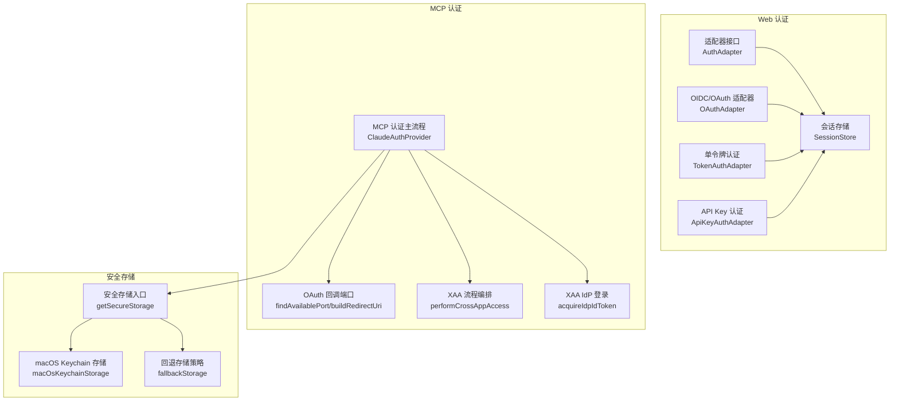
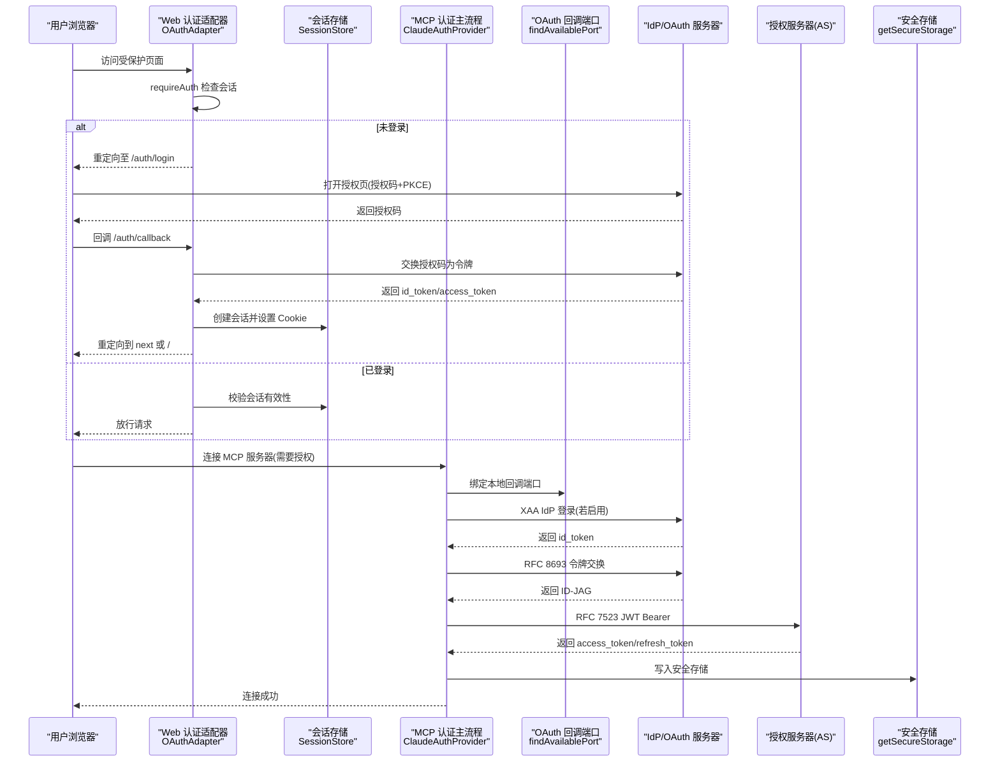
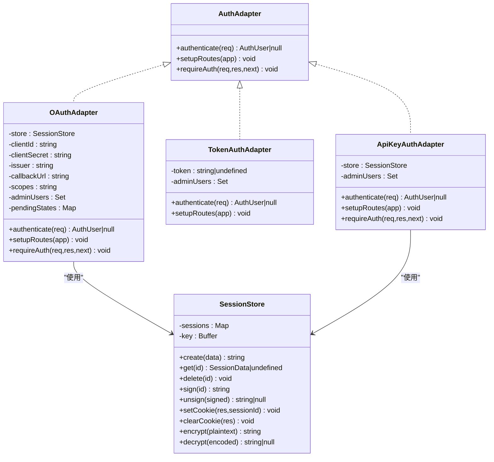
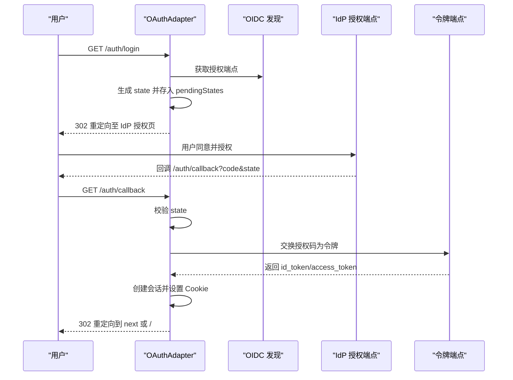
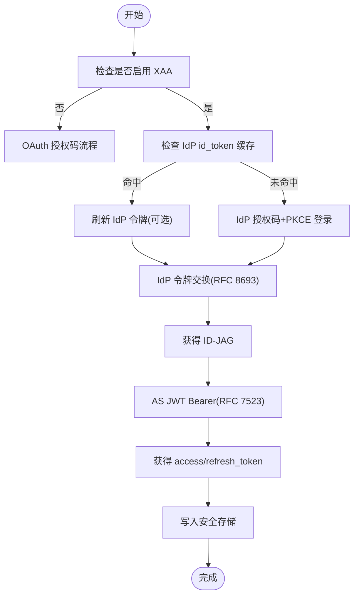
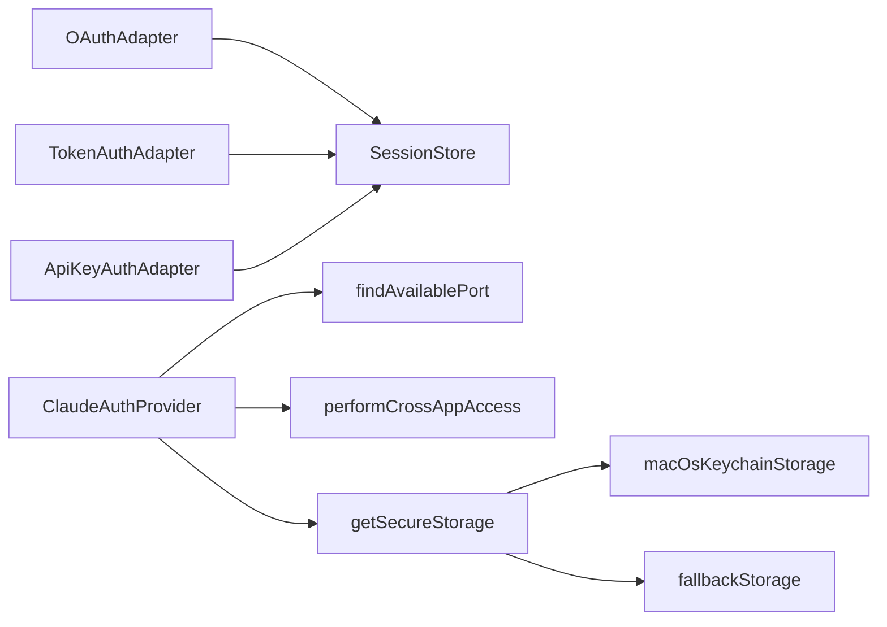

# 认证服务

<cite>
**本文引用的文件**
- [adapter.ts](file://src/server/web/auth/adapter.ts)
- [oauth-auth.ts](file://src/server/web/auth/oauth-auth.ts)
- [token-auth.ts](file://src/server/web/auth/token-auth.ts)
- [apikey-auth.ts](file://src/server/web/auth/apikey-auth.ts)
- [oauth.ts](file://src/constants/oauth.ts)
- [auth.ts](file://src/services/mcp/auth.ts)
- [oauthPort.ts](file://src/services/mcp/oauthPort.ts)
- [xaa.ts](file://src/services/mcp/xaa.ts)
- [xaaIdpLogin.ts](file://src/services/mcp/xaaIdpLogin.ts)
- [index.ts](file://src/utils/secureStorage/index.ts)
- [macOsKeychainStorage.ts](file://src/utils/secureStorage/macOsKeychainStorage.ts)
- [fallbackStorage.ts](file://src/utils/secureStorage/fallbackStorage.ts)
- [authPortable.ts](file://src/utils/authPortable.ts)
- [auth.ts（工具）](file://src/utils/auth.ts)
</cite>

## 目录
1. [简介](#简介)
2. [项目结构](#项目结构)
3. [核心组件](#核心组件)
4. [架构总览](#架构总览)
5. [详细组件分析](#详细组件分析)
6. [依赖关系分析](#依赖关系分析)
7. [性能考量](#性能考量)
8. [故障排除指南](#故障排除指南)
9. [结论](#结论)
10. [附录：认证配置与最佳实践](#附录认证配置与最佳实践)

## 简介
本文件系统性梳理 Claude Code 的认证服务模块，覆盖以下主题：
- OAuth 2.0 授权码流程、令牌刷新与用户资料获取
- MCP 服务器认证机制：XAA（跨应用访问）登录与自定义认证方案
- 本地认证端口监听、安全令牌生成与会话管理
- 认证配置示例：客户端注册、作用域设置与权限控制
- 认证中间件、令牌验证与安全最佳实践
- 故障排除与安全审计要点

## 项目结构
认证相关代码主要分布在两个子系统：
- Web 层认证适配器：提供基于会话的 OIDC/OAuth 登录、登出与中间件校验
- MCP 服务认证：支持 OAuth 2.0 授权码流程、令牌刷新、XAA（企业托管授权）与本地回调端口监听

图示来源
- [adapter.ts:32-52](file://src/server/web/auth/adapter.ts#L32-L52)
- [oauth-auth.ts:79-114](file://src/server/web/auth/oauth-auth.ts#L79-L114)
- [token-auth.ts:16-28](file://src/server/web/auth/token-auth.ts#L16-L28)
- [apikey-auth.ts:1-122](file://src/server/web/auth/apikey-auth.ts#L1-L122)
- [auth.ts:1-120](file://src/services/mcp/auth.ts#L1-L120)
- [oauthPort.ts:1-80](file://src/services/mcp/oauthPort.ts#L1-L80)
- [xaa.ts:426-511](file://src/services/mcp/xaa.ts#L426-L511)
- [xaaIdpLogin.ts:401-487](file://src/services/mcp/xaaIdpLogin.ts#L401-L487)
- [index.ts:9-17](file://src/utils/secureStorage/index.ts#L9-L17)
- [macOsKeychainStorage.ts:26-176](file://src/utils/secureStorage/macOsKeychainStorage.ts#L26-L176)
- [fallbackStorage.ts:7-70](file://src/utils/secureStorage/fallbackStorage.ts#L7-L70)

章节来源
- [adapter.ts:1-221](file://src/server/web/auth/adapter.ts#L1-L221)
- [oauth-auth.ts:63-239](file://src/server/web/auth/oauth-auth.ts#L63-L239)
- [token-auth.ts:1-45](file://src/server/web/auth/token-auth.ts#L1-L45)
- [apikey-auth.ts:1-122](file://src/server/web/auth/apikey-auth.ts#L1-L122)
- [auth.ts:1-200](file://src/services/mcp/auth.ts#L1-L200)
- [oauthPort.ts:1-80](file://src/services/mcp/oauthPort.ts#L1-L80)
- [xaa.ts:1-120](file://src/services/mcp/xaa.ts#L1-L120)
- [xaaIdpLogin.ts:1-120](file://src/services/mcp/xaaIdpLogin.ts#L1-L120)
- [index.ts:1-19](file://src/utils/secureStorage/index.ts#L1-L19)
- [macOsKeychainStorage.ts:1-120](file://src/utils/secureStorage/macOsKeychainStorage.ts#L1-L120)
- [fallbackStorage.ts:1-72](file://src/utils/secureStorage/fallbackStorage.ts#L1-L72)

## 核心组件
- 适配器接口与会话存储
  - AuthAdapter：统一的认证抽象，提供 authenticate、setupRoutes、requireAuth
  - SessionStore：基于内存的会话存储，使用 HMAC 签名与 AES-256-GCM 加密敏感数据，支持 Cookie 设置与清理
- Web 层认证适配器
  - OAuthAdapter：OIDC/OAuth 授权码流程，支持状态参数防 CSRF、回调路由、登出与管理员映射
  - TokenAuthAdapter：单令牌模式，适合受信网络或单用户部署
  - ApiKeyAuthAdapter：API Key 登录，加密保存并在会话中解密使用
- MCP 认证主流程
  - ClaudeAuthProvider：封装 OAuth 元数据发现、令牌刷新、撤销、错误归因与日志脱敏
  - performMCPXaaAuth：XAA 身份提供商登录与令牌交换，复用 IdP 缓存
  - performCrossAppAccess：XAA 四层编排（PRM 发现、AS 元数据、IdP 令牌交换、JWT Bearer）
- 安全存储
  - getSecureStorage：按平台选择存储实现（macOS 使用 Keychain + 回退）
  - macOsKeychainStorage：通过 security 命令读写 Keychain，带缓存与溢出保护
  - fallbackStorage：主存储失败时回退到明文存储，并迁移数据

章节来源
- [adapter.ts:32-221](file://src/server/web/auth/adapter.ts#L32-L221)
- [oauth-auth.ts:79-239](file://src/server/web/auth/oauth-auth.ts#L79-L239)
- [token-auth.ts:16-45](file://src/server/web/auth/token-auth.ts#L16-L45)
- [apikey-auth.ts:1-122](file://src/server/web/auth/apikey-auth.ts#L1-L122)
- [auth.ts:1-200](file://src/services/mcp/auth.ts#L1-L200)
- [xaa.ts:426-511](file://src/services/mcp/xaa.ts#L426-L511)
- [xaaIdpLogin.ts:401-487](file://src/services/mcp/xaaIdpLogin.ts#L401-L487)
- [index.ts:9-17](file://src/utils/secureStorage/index.ts#L9-L17)
- [macOsKeychainStorage.ts:26-176](file://src/utils/secureStorage/macOsKeychainStorage.ts#L26-L176)
- [fallbackStorage.ts:7-70](file://src/utils/secureStorage/fallbackStorage.ts#L7-L70)

## 架构总览
下图展示 Web 层与 MCP 层的认证交互，以及安全存储与端口监听的关键路径。

图示来源
- [oauth-auth.ts:130-214](file://src/server/web/auth/oauth-auth.ts#L130-L214)
- [adapter.ts:79-221](file://src/server/web/auth/adapter.ts#L79-L221)
- [auth.ts:664-800](file://src/services/mcp/auth.ts#L664-L800)
- [oauthPort.ts:36-78](file://src/services/mcp/oauthPort.ts#L36-L78)
- [xaa.ts:426-511](file://src/services/mcp/xaa.ts#L426-L511)
- [xaaIdpLogin.ts:401-487](file://src/services/mcp/xaaIdpLogin.ts#L401-L487)
- [index.ts:9-17](file://src/utils/secureStorage/index.ts#L9-L17)

## 详细组件分析

### Web 认证适配器与会话存储
- AuthAdapter 抽象
  - authenticate：从请求解析会话，返回用户身份与管理员标记
  - setupRoutes：注册 /auth/login、/auth/callback、/auth/logout
  - requireAuth：根据 Accept 头部决定重定向或返回 401 JSON
- SessionStore
  - 使用 HMAC-SHA256 对会话 ID 进行签名，防止篡改
  - 使用 AES-256-GCM 加密敏感数据（如 API Key），带认证标签
  - 定期清理过期会话，默认 24 小时有效期
  - 提供 Cookie 设置、清除与解析

图示来源
- [adapter.ts:32-221](file://src/server/web/auth/adapter.ts#L32-L221)
- [oauth-auth.ts:79-128](file://src/server/web/auth/oauth-auth.ts#L79-L128)
- [token-auth.ts:16-45](file://src/server/web/auth/token-auth.ts#L16-L45)
- [apikey-auth.ts:1-122](file://src/server/web/auth/apikey-auth.ts#L1-L122)

章节来源
- [adapter.ts:32-221](file://src/server/web/auth/adapter.ts#L32-L221)
- [oauth-auth.ts:79-239](file://src/server/web/auth/oauth-auth.ts#L79-L239)
- [token-auth.ts:16-45](file://src/server/web/auth/token-auth.ts#L16-L45)
- [apikey-auth.ts:1-122](file://src/server/web/auth/apikey-auth.ts#L1-L122)

### OAuth 2.0 授权码流程（Web 层）
- 初始化与环境变量
  - 客户端 ID/密钥、发行者、回调地址、作用域、管理员白名单
- 登录流程
  - 生成随机 state 并存入 pendingStates，设置短期 HttpOnly Cookie 防 CSRF
  - 重定向至发行者的授权端点
- 回调处理
  - 校验 state，检查错误参数
  - 通过授权码换取令牌，创建会话并设置 Cookie
- 登出
  - 删除会话并清除 Cookie

图示来源
- [oauth-auth.ts:130-214](file://src/server/web/auth/oauth-auth.ts#L130-L214)
- [adapter.ts:79-183](file://src/server/web/auth/adapter.ts#L79-L183)

章节来源
- [oauth-auth.ts:130-214](file://src/server/web/auth/oauth-auth.ts#L130-L214)
- [adapter.ts:79-183](file://src/server/web/auth/adapter.ts#L79-L183)

### 单令牌认证（TokenAuthAdapter）
- 当 AUTH_TOKEN 未设置时，所有请求以内置管理员身份放行
- 当 AUTH_TOKEN 设置时，要求查询参数或 Authorization 头匹配令牌

章节来源
- [token-auth.ts:16-45](file://src/server/web/auth/token-auth.ts#L16-L45)

### API Key 认证（ApiKeyAuthAdapter）
- 通过 API Key 登录，加密保存在会话中
- 登录后创建会话并设置 Cookie，登出时销毁会话

章节来源
- [apikey-auth.ts:1-122](file://src/server/web/auth/apikey-auth.ts#L1-L122)

### MCP 服务器认证与 XAA
- 元数据发现与令牌刷新
  - 支持配置式元数据 URL 与 RFC 9728/RFC 8414 自动发现
  - 统一超时信号与非标准错误体归一化
- XAA（跨应用访问）
  - 一次 IdP 登录，多服务器静默授权
  - PRM → AS 元数据 → IdP 令牌交换 → JWT Bearer → access_token
- 本地回调端口
  - 动态选择可用端口，Windows 使用受限范围，支持固定端口
- 安全存储
  - macOS 使用 Keychain + 明文回退；写入前清理缓存，避免泄露

图示来源
- [auth.ts:664-800](file://src/services/mcp/auth.ts#L664-L800)
- [xaa.ts:426-511](file://src/services/mcp/xaa.ts#L426-L511)
- [oauthPort.ts:36-78](file://src/services/mcp/oauthPort.ts#L36-L78)
- [xaaIdpLogin.ts:401-487](file://src/services/mcp/xaaIdpLogin.ts#L401-L487)
- [index.ts:9-17](file://src/utils/secureStorage/index.ts#L9-L17)

章节来源
- [auth.ts:1-200](file://src/services/mcp/auth.ts#L1-L200)
- [auth.ts:664-800](file://src/services/mcp/auth.ts#L664-L800)
- [xaa.ts:1-120](file://src/services/mcp/xaa.ts#L1-L120)
- [oauthPort.ts:1-80](file://src/services/mcp/oauthPort.ts#L1-L80)
- [xaaIdpLogin.ts:1-120](file://src/services/mcp/xaaIdpLogin.ts#L1-L120)
- [index.ts:1-19](file://src/utils/secureStorage/index.ts#L1-L19)

### OAuth 作用域与客户端配置
- 默认作用域与组合
  - Claude.ai 与 Console 的作用域集合，合并去重
  - 支持动态客户端元数据文档（MCP 客户端元数据 URL）
- 环境配置类型与覆盖
  - 生产/预发/本地三档配置，支持自定义 OAuth 基址与客户端 ID 覆盖

章节来源
- [oauth.ts:33-114](file://src/constants/oauth.ts#L33-L114)
- [oauth.ts:186-236](file://src/constants/oauth.ts#L186-L236)

## 依赖关系分析
- 组件耦合
  - Web 适配器依赖 SessionStore；OAuthAdapter 依赖 OIDC 发现与状态管理
  - MCP 认证依赖端口监听、XAA 流程与安全存储
- 外部依赖
  - OIDC/OpenID Connect 发现文档
  - RFC 8693（令牌交换）、RFC 7523（JWT Bearer）、RFC 9728（PRM）、RFC 8414（AS 元数据）
  - macOS Keychain 命令（security）

图示来源
- [oauth-auth.ts:79-128](file://src/server/web/auth/oauth-auth.ts#L79-L128)
- [adapter.ts:79-221](file://src/server/web/auth/adapter.ts#L79-L221)
- [auth.ts:1-120](file://src/services/mcp/auth.ts#L1-L120)
- [oauthPort.ts:36-78](file://src/services/mcp/oauthPort.ts#L36-L78)
- [xaa.ts:426-511](file://src/services/mcp/xaa.ts#L426-L511)
- [index.ts:9-17](file://src/utils/secureStorage/index.ts#L9-L17)
- [macOsKeychainStorage.ts:26-176](file://src/utils/secureStorage/macOsKeychainStorage.ts#L26-L176)
- [fallbackStorage.ts:7-70](file://src/utils/secureStorage/fallbackStorage.ts#L7-L70)

章节来源
- [oauth-auth.ts:79-128](file://src/server/web/auth/oauth-auth.ts#L79-L128)
- [adapter.ts:79-221](file://src/server/web/auth/adapter.ts#L79-L221)
- [auth.ts:1-120](file://src/services/mcp/auth.ts#L1-L120)
- [oauthPort.ts:1-80](file://src/services/mcp/oauthPort.ts#L1-L80)
- [xaa.ts:426-511](file://src/services/mcp/xaa.ts#L426-L511)
- [index.ts:1-19](file://src/utils/secureStorage/index.ts#L1-L19)
- [macOsKeychainStorage.ts:1-120](file://src/utils/secureStorage/macOsKeychainStorage.ts#L1-L120)
- [fallbackStorage.ts:1-72](file://src/utils/secureStorage/fallbackStorage.ts#L1-L72)

## 性能考量
- 会话清理与内存占用
  - SessionStore 每 5 分钟清理过期会话，避免内存泄漏
- 请求超时与并发
  - OAuth 请求统一 30 秒超时，避免长时间阻塞
  - 合并用户取消信号与超时信号，确保快速响应
- 端口选择策略
  - 随机选择可用端口，Windows 使用受限范围，减少冲突
- Keychain 访问优化
  - macOS Keychain 读取带缓存与“陈旧可用”策略，降低频繁 spawn 命令的开销

[本节为通用性能建议，不直接分析具体文件]

## 故障排除指南
- Web 层 OAuth 登录失败
  - 检查 state 匹配与 CSRF Cookie 是否正确设置
  - 确认回调地址与作用域配置一致
  - 查看发行者 OIDC 发现文档可达性
- MCP 连接 401
  - 若存在元数据但无令牌，需重新触发认证
  - 对于 XAA 服务器，确认 IdP id_token 缓存有效
- 端口占用
  - 回调端口被占用时，系统会报错并提示定位命令；可使用固定端口或释放占用进程
- Keychain 权限问题（macOS）
  - Keychain 锁定会导致读写失败；检查钥匙串状态
  - 写入失败时尝试回退到明文存储，或清理缓存后重试

章节来源
- [oauth-auth.ts:130-214](file://src/server/web/auth/oauth-auth.ts#L130-L214)
- [auth.ts:349-363](file://src/services/mcp/auth.ts#L349-L363)
- [oauthPort.ts:36-78](file://src/services/mcp/oauthPort.ts#L36-L78)
- [macOsKeychainStorage.ts:200-231](file://src/utils/secureStorage/macOsKeychainStorage.ts#L200-L231)

## 结论
该认证体系在 Web 层提供灵活的 OIDC/OAuth 适配器与会话管理，在 MCP 层提供标准化的 OAuth 元数据发现、令牌刷新与 XAA 企业级认证能力，并通过安全存储与端口监听保障易用性与安全性。通过严格的错误归因、日志脱敏与平台差异化实现，整体具备良好的可维护性与可观测性。

[本节为总结性内容，不直接分析具体文件]

## 附录：认证配置与最佳实践
- OAuth 客户端注册与回调
  - 在发行者处注册客户端，配置允许的回调地址（Web 层默认 http://localhost:3000/auth/callback；MCP 层使用本地端口）
  - 环境变量：OAUTH_CLIENT_ID、OAUTH_CLIENT_SECRET、OAUTH_ISSUER、OAUTH_CALLBACK_URL、OAUTH_SCOPES、ADMIN_USERS
- 作用域与权限控制
  - 常用作用域：openid、email、profile、user:profile、user:inference、user:sessions:claude_code、user:mcp_servers、user:file_upload
  - 管理员映射：ADMIN_USERS 支持用户 ID 或邮箱白名单
- MCP 服务器认证
  - XAA：启用 oauth.xaa，配置 IdP 与 AS 客户端信息；IdP 登录仅一次，后续静默授权
  - 固定端口：MCP_OAUTH_CALLBACK_PORT 可指定固定回调端口
- 安全最佳实践
  - 使用 HTTPS 传输与存储
  - 严格限制 Cookie 属性（HttpOnly、SameSite、Path、Max-Age）
  - 对敏感参数进行日志脱敏（state、nonce、code_challenge、code_verifier、code）
  - 定期轮换与撤销令牌，优先撤销刷新令牌
  - macOS 下优先使用 Keychain 存储，失败时再回退明文

章节来源
- [oauth-auth.ts:69-105](file://src/server/web/auth/oauth-auth.ts#L69-L105)
- [oauth.ts:33-114](file://src/constants/oauth.ts#L33-L114)
- [auth.ts:94-125](file://src/services/mcp/auth.ts#L94-L125)
- [oauthPort.ts:27-30](file://src/services/mcp/oauthPort.ts#L27-L30)
- [index.ts:9-17](file://src/utils/secureStorage/index.ts#L9-L17)
- [macOsKeychainStorage.ts:97-158](file://src/utils/secureStorage/macOsKeychainStorage.ts#L97-L158)