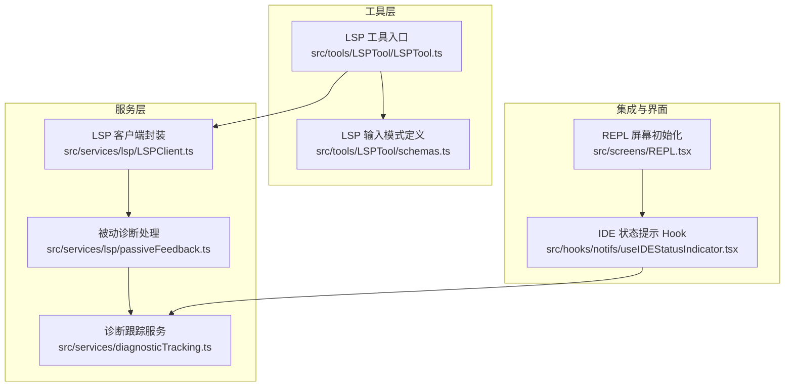
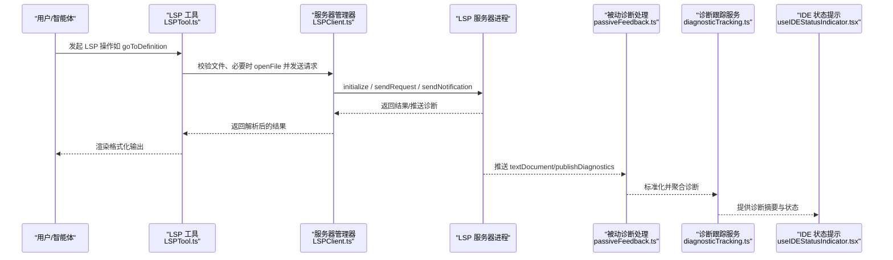
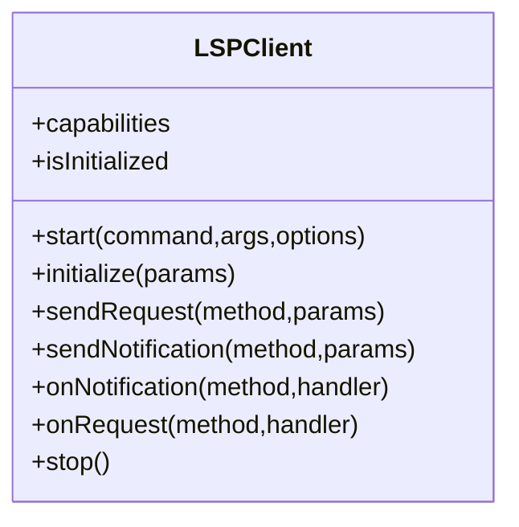
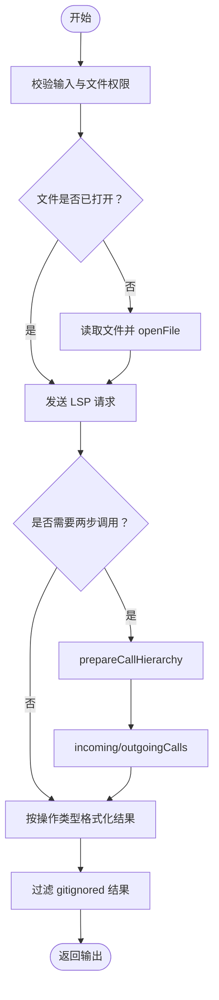
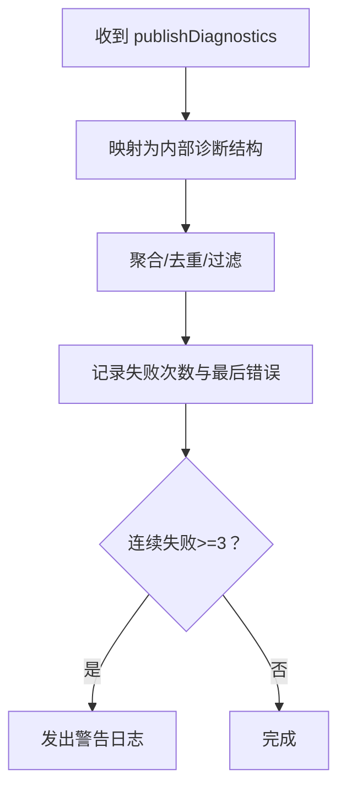
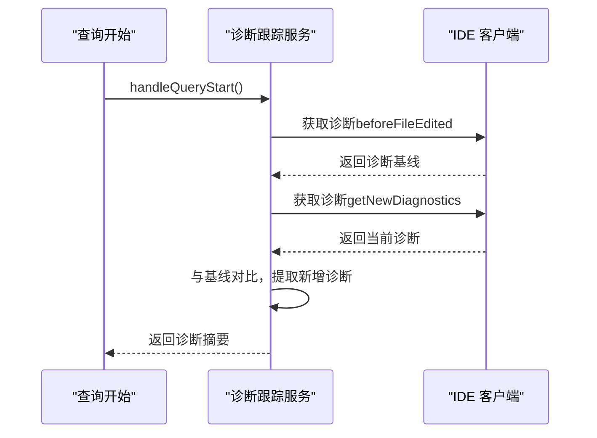
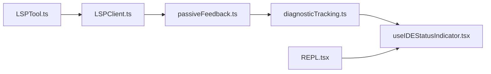

# 语言服务器集成

<cite>
**本文引用的文件**
- [LSPClient.ts](file://src/services/lsp/LSPClient.ts)
- [LSPTool.ts](file://src/tools/LSPTool/LSPTool.ts)
- [schemas.ts](file://src/tools/LSPTool/schemas.ts)
- [passiveFeedback.ts](file://src/services/lsp/passiveFeedback.ts)
- [diagnosticTracking.ts](file://src/services/diagnosticTracking.ts)
- [useIDEStatusIndicator.tsx](file://src/hooks/notifs/useIDEStatusIndicator.tsx)
- [REPL.tsx](file://src/screens/REPL.tsx)
</cite>

## 目录
1. [引言](#引言)
2. [项目结构](#项目结构)
3. [核心组件](#核心组件)
4. [架构总览](#架构总览)
5. [组件详解](#组件详解)
6. [依赖关系分析](#依赖关系分析)
7. [性能考量](#性能考量)
8. [故障排查指南](#故障排查指南)
9. [结论](#结论)
10. [附录](#附录)

## 引言
本技术文档聚焦 Claude Code 的语言服务器（Language Server Protocol，简称 LSP）集成体系，系统性阐述从服务器管理、客户端通信到诊断注册与被动反馈的完整链路。文档覆盖以下关键主题：
- LSP 客户端封装与生命周期：进程启动、JSON-RPC 连接、初始化握手、请求/通知收发、优雅关闭与崩溃处理。
- 服务器管理与工具调用：通过统一的 LSP 工具接口执行跳转定义、引用查找、悬停信息、符号浏览等操作。
- 被动反馈与诊断集成：订阅 LSP 诊断推送，进行格式化与聚合，结合 IDE 集成与状态提示。
- 配置与连接示例：如何配置服务器、建立连接、处理消息与错误。
- 扩展指南与优化策略：如何扩展支持新的 LSP 操作、自定义诊断与性能优化。

## 项目结构
围绕 LSP 的相关代码主要分布在如下位置：
- 服务层：LSP 客户端封装与被动诊断处理
- 工具层：面向用户的 LSP 智能体工具，统一输入输出与权限校验
- 诊断与 IDE 集成：诊断跟踪、IDE 状态提示与交互

**图表来源**
- [LSPClient.ts:1-449](file://src/services/lsp/LSPClient.ts#L1-L449)
- [LSPTool.ts:1-862](file://src/tools/LSPTool/LSPTool.ts#L1-L862)
- [schemas.ts:1-217](file://src/tools/LSPTool/schemas.ts#L1-L217)
- [passiveFeedback.ts:63-264](file://src/services/lsp/passiveFeedback.ts#L63-L264)
- [diagnosticTracking.ts:1-399](file://src/services/diagnosticTracking.ts#L1-L399)
- [useIDEStatusIndicator.tsx:36-155](file://src/hooks/notifs/useIDEStatusIndicator.tsx#L36-L155)
- [REPL.tsx:1709-1740](file://src/screens/REPL.tsx#L1709-L1740)

**章节来源**
- [LSPClient.ts:1-449](file://src/services/lsp/LSPClient.ts#L1-L449)
- [LSPTool.ts:1-862](file://src/tools/LSPTool/LSPTool.ts#L1-L862)
- [schemas.ts:1-217](file://src/tools/LSPTool/schemas.ts#L1-L217)
- [passiveFeedback.ts:63-264](file://src/services/lsp/passiveFeedback.ts#L63-L264)
- [diagnosticTracking.ts:1-399](file://src/services/diagnosticTracking.ts#L1-L399)
- [useIDEStatusIndicator.tsx:36-155](file://src/hooks/notifs/useIDEStatusIndicator.tsx#L36-L155)
- [REPL.tsx:1709-1740](file://src/screens/REPL.tsx#L1709-L1740)

## 核心组件
- LSP 客户端封装：负责子进程启动、stdio 流接入、JSON-RPC 连接、协议追踪、初始化握手、请求/通知发送、事件回调队列与优雅关闭。
- LSP 工具：面向用户与智能体的统一入口，提供输入校验、权限检查、文件打开保障、结果格式化与错误处理。
- 被动诊断处理：接收 LSP 诊断推送，进行标准化与聚合，记录连续失败并告警。
- 诊断跟踪服务：与 IDE 集成，确保文件在 IDE 中已打开，抓取基线与增量诊断，生成可读摘要。
- IDE 状态提示：根据连接状态与平台特性显示安装或连接提示，辅助用户完成 IDE 插件集成。

**章节来源**
- [LSPClient.ts:51-447](file://src/services/lsp/LSPClient.ts#L51-L447)
- [LSPTool.ts:127-422](file://src/tools/LSPTool/LSPTool.ts#L127-L422)
- [passiveFeedback.ts:63-264](file://src/services/lsp/passiveFeedback.ts#L63-L264)
- [diagnosticTracking.ts:30-397](file://src/services/diagnosticTracking.ts#L30-L397)
- [useIDEStatusIndicator.tsx:36-155](file://src/hooks/notifs/useIDEStatusIndicator.tsx#L36-L155)

## 架构总览
下图展示了从工具调用到 LSP 服务器，再到诊断反馈与 IDE 集成的整体流程。

**图表来源**
- [LSPTool.ts:224-414](file://src/tools/LSPTool/LSPTool.ts#L224-L414)
- [LSPClient.ts:256-335](file://src/services/lsp/LSPClient.ts#L256-L335)
- [passiveFeedback.ts:63-264](file://src/services/lsp/passiveFeedback.ts#L63-L264)
- [diagnosticTracking.ts:135-283](file://src/services/diagnosticTracking.ts#L135-L283)
- [useIDEStatusIndicator.tsx:36-155](file://src/hooks/notifs/useIDEStatusIndicator.tsx#L36-L155)

## 组件详解

### LSP 客户端封装（LSPClient）
- 进程与流管理：以子进程方式启动 LSP 服务器，等待 spawn 成功后再使用 stdout/stdin，避免异步错误导致未处理拒绝。
- JSON-RPC 连接：基于 vscode-jsonrpc 创建消息连接，注册 onError/onClose 处理器，启用协议追踪便于调试。
- 初始化握手：发送 initialize 请求并接收 capabilities，随后发送 initialized 通知。
- 请求/通知：提供 sendRequest/sendNotification 与 onNotification/onRequest 注册；对未就绪状态进行保护。
- 生命周期：stop 时先尝试 shutdown/exit，再清理连接与进程监听器，防止内存泄漏；区分“意外退出”与“主动停止”的错误日志。
- 崩溃与错误：捕获进程 error/exit 与连接错误，标记启动失败状态，触发外部 onCrash 回调。

**图表来源**
- [LSPClient.ts:21-41](file://src/services/lsp/LSPClient.ts#L21-L41)

**章节来源**
- [LSPClient.ts:51-447](file://src/services/lsp/LSPClient.ts#L51-L447)

### LSP 工具（LSPTool）
- 输入模式：通过判别联合模式定义支持 goToDefinition、findReferences、hover、documentSymbol、workspaceSymbol、goToImplementation、prepareCallHierarchy、incomingCalls、outgoingCalls。
- 权限与校验：校验文件存在性与类型，安全处理 UNC 路径，记录文件系统访问异常。
- 文件打开保障：若文件未在 LSP 中打开，读取内容后调用 openFile，限制最大文件大小。
- 结果处理：两阶段调用（如 incoming/outgoingCalls 先 prepare 再请求），过滤 gitignored 结果，按操作类型格式化输出。
- 错误处理：统一捕获并记录错误，返回用户可读的结果字符串。

**图表来源**
- [LSPTool.ts:155-414](file://src/tools/LSPTool/LSPTool.ts#L155-L414)
- [schemas.ts:8-191](file://src/tools/LSPTool/schemas.ts#L8-L191)

**章节来源**
- [LSPTool.ts:127-422](file://src/tools/LSPTool/LSPTool.ts#L127-L422)
- [schemas.ts:1-217](file://src/tools/LSPTool/schemas.ts#L1-L217)

### 被动诊断处理（Passive Feedback）
- 订阅 textDocument/publishDiagnostics 通知，将 LSP 诊断映射为内部统一结构，包含消息、严重级别、范围、来源与代码。
- 统计与告警：记录每个服务器的注册总数、成功数与错误；对处理器运行时失败进行累计并在连续失败达到阈值时发出警告。
- 容错：捕获处理器内部异常，避免中断通知循环。

**图表来源**
- [passiveFeedback.ts:63-264](file://src/services/lsp/passiveFeedback.ts#L63-L264)

**章节来源**
- [passiveFeedback.ts:63-264](file://src/services/lsp/passiveFeedback.ts#L63-L264)

### 诊断跟踪服务（Diagnostic Tracking）
- 初始化与重置：在查询开始时自动发现并绑定 IDE 客户端，支持重置状态。
- 基线采集：编辑前抓取 file:// 或 _claude_fs_right 的诊断作为基线，用于后续增量对比。
- 增量诊断：比较当前与基线差异，仅返回新增诊断；支持多 URI 协议与路径规范化。
- 输出摘要：将诊断格式化为人类可读字符串，带截断标记。

**图表来源**
- [diagnosticTracking.ts:135-283](file://src/services/diagnosticTracking.ts#L135-L283)

**章节来源**
- [diagnosticTracking.ts:30-397](file://src/services/diagnosticTracking.ts#L30-L397)

### IDE 集成与状态提示
- 自动初始化：在 REPL 屏幕中初始化 IDE 集成，触发 IDE 安装与连接流程。
- 状态提示：根据 IDE 连接状态、终端支持与平台特性显示安装失败或插件未连接提示，避免重复提示。

**章节来源**
- [REPL.tsx:1724-1730](file://src/screens/REPL.tsx#L1724-L1730)
- [useIDEStatusIndicator.tsx:36-155](file://src/hooks/notifs/useIDEStatusIndicator.tsx#L36-L155)

## 依赖关系分析
- LSPTool 依赖 LSP 客户端封装进行请求发送与文件打开保障。
- LSP 客户端封装与被动诊断处理共同消费 LSP 服务器的初始化与通知。
- 诊断跟踪服务通过 MCP/IDE RPC 获取诊断并进行增量对比。
- IDE 状态提示依赖诊断跟踪服务与 IDE 连接状态。

**图表来源**
- [LSPTool.ts:16-20](file://src/tools/LSPTool/LSPTool.ts#L16-L20)
- [LSPClient.ts:1-17](file://src/services/lsp/LSPClient.ts#L1-L17)
- [passiveFeedback.ts:63-264](file://src/services/lsp/passiveFeedback.ts#L63-L264)
- [diagnosticTracking.ts:3-8](file://src/services/diagnosticTracking.ts#L3-L8)
- [useIDEStatusIndicator.tsx:36-155](file://src/hooks/notifs/useIDEStatusIndicator.tsx#L36-L155)
- [REPL.tsx:1724-1730](file://src/screens/REPL.tsx#L1724-L1730)

**章节来源**
- [LSPTool.ts:16-20](file://src/tools/LSPTool/LSPTool.ts#L16-L20)
- [LSPClient.ts:1-17](file://src/services/lsp/LSPClient.ts#L1-L17)
- [passiveFeedback.ts:63-264](file://src/services/lsp/passiveFeedback.ts#L63-L264)
- [diagnosticTracking.ts:3-8](file://src/services/diagnosticTracking.ts#L3-L8)
- [useIDEStatusIndicator.tsx:36-155](file://src/hooks/notifs/useIDEStatusIndicator.tsx#L36-L155)
- [REPL.tsx:1724-1730](file://src/screens/REPL.tsx#L1724-L1730)

## 性能考量
- 文件大小限制：LSP 工具对单文件大小设置上限，避免大文件带来的 LSP 分析与传输开销。
- 批量忽略过滤：使用 git check-ignore 对位置结果进行批量过滤，减少无关文件的展示与处理。
- 连接复用与延迟初始化：LSP 客户端在连接就绪前对通知/请求处理器进行队列化，避免重复初始化成本。
- 诊断增量对比：仅返回新增诊断，降低消息体积与渲染压力。
- 进程与流清理：stop 时移除所有监听器并显式 kill 子进程，防止资源泄露。

[本节为通用指导，不直接分析具体文件]

## 故障排查指南
- 启动失败：检查 LSP 客户端的启动错误日志，确认命令是否存在、环境变量与工作目录是否正确。
- 连接错误：查看协议追踪日志与连接错误回调，定位服务器崩溃或网络问题。
- 初始化失败：确认 initialize 请求返回的 capabilities 是否可用，以及 initialized 通知是否成功发送。
- 请求失败：针对特定方法的 sendRequest 失败，检查参数格式与服务器能力支持。
- 诊断无更新：确认服务器是否推送 publishDiagnostics，被动诊断处理器是否注册成功，诊断跟踪服务是否正确归一化路径。
- IDE 未连接：通过 IDE 状态提示确认插件安装与连接状态，必要时重新触发安装流程。

**章节来源**
- [LSPClient.ts:144-167](file://src/services/lsp/LSPClient.ts#L144-L167)
- [LSPClient.ts:187-207](file://src/services/lsp/LSPClient.ts#L187-L207)
- [LSPClient.ts:278-286](file://src/services/lsp/LSPClient.ts#L278-L286)
- [LSPClient.ts:305-313](file://src/services/lsp/LSPClient.ts#L305-L313)
- [passiveFeedback.ts:249-264](file://src/services/lsp/passiveFeedback.ts#L249-L264)
- [diagnosticTracking.ts:135-182](file://src/services/diagnosticTracking.ts#L135-L182)
- [useIDEStatusIndicator.tsx:36-155](file://src/hooks/notifs/useIDEStatusIndicator.tsx#L36-L155)

## 结论
该 LSP 集成体系以“客户端封装 + 工具入口 + 被动诊断 + 诊断跟踪 + IDE 集成”为主线，实现了从服务器启动、初始化握手、请求/通知处理到诊断聚合与 IDE 反馈的闭环。通过严格的错误处理、生命周期管理与性能优化策略，系统在复杂场景下仍保持稳定与高效。建议在扩展新 LSP 操作或诊断源时，遵循现有模式进行输入校验、权限检查、结果格式化与错误上报。

[本节为总结性内容，不直接分析具体文件]

## 附录

### LSP 集成示例（步骤说明）
- 配置服务器：准备命令、参数与工作目录/环境变量，交由 LSP 客户端封装启动。
- 建立连接：等待 spawn 成功后创建 JSON-RPC 连接，注册错误与关闭处理器。
- 初始化：发送 initialize 请求并接收 capabilities，随后发送 initialized 通知。
- 发送请求：根据操作选择对应 LSP 方法（如 textDocument/definition），传入 URI 与位置。
- 处理通知：订阅 publishDiagnostics，进行标准化与聚合，必要时触发 IDE 提示。
- 关闭：先 shutdown/exit，再清理连接与进程监听器。

**章节来源**
- [LSPClient.ts:88-254](file://src/services/lsp/LSPClient.ts#L88-L254)
- [LSPClient.ts:256-335](file://src/services/lsp/LSPClient.ts#L256-L335)
- [LSPTool.ts:224-414](file://src/tools/LSPTool/LSPTool.ts#L224-L414)
- [passiveFeedback.ts:63-264](file://src/services/lsp/passiveFeedback.ts#L63-L264)

### 扩展指南（新增 LSP 操作）
- 在输入模式定义中添加新操作的 Zod 模式与类型守卫。
- 在工具入口中映射新操作到对应的 LSP 方法与参数。
- 如需两步调用，先发送 prepare 步骤，再发送第二步请求。
- 实现或复用格式化函数，确保输出对用户友好。
- 添加错误处理与日志记录，便于排障。

**章节来源**
- [schemas.ts:8-191](file://src/tools/LSPTool/schemas.ts#L8-L191)
- [LSPTool.ts:427-513](file://src/tools/LSPTool/LSPTool.ts#L427-L513)
- [LSPTool.ts:636-800](file://src/tools/LSPTool/LSPTool.ts#L636-L800)