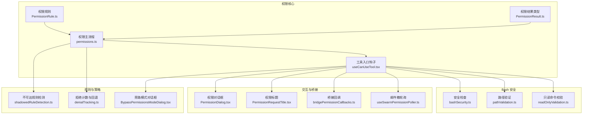
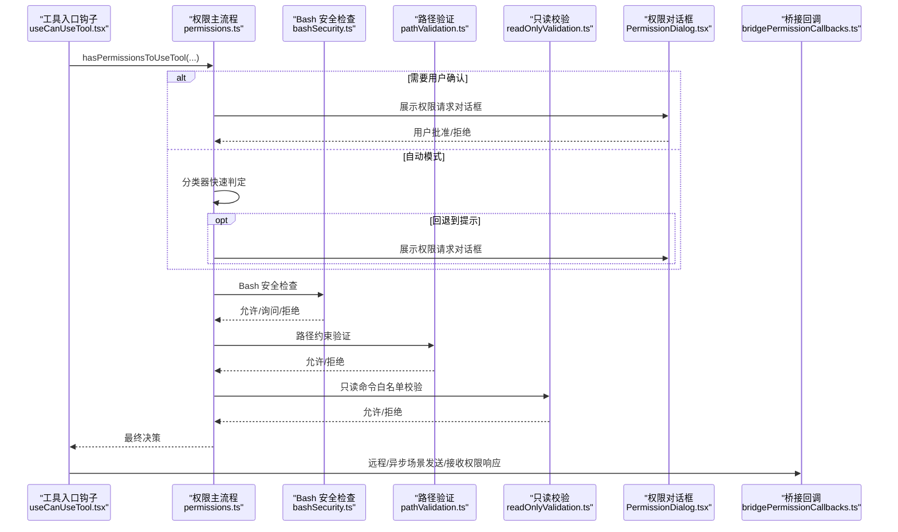
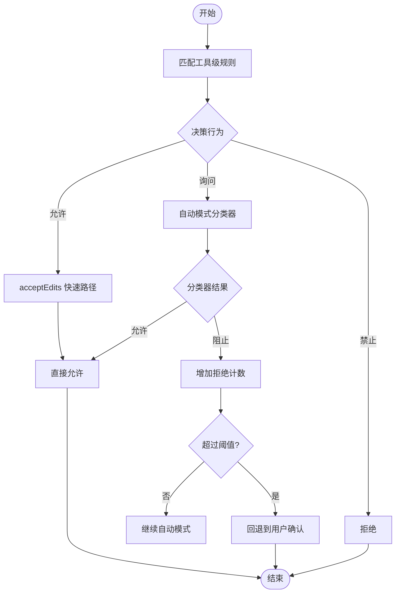
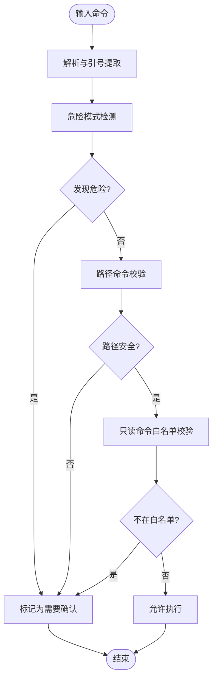
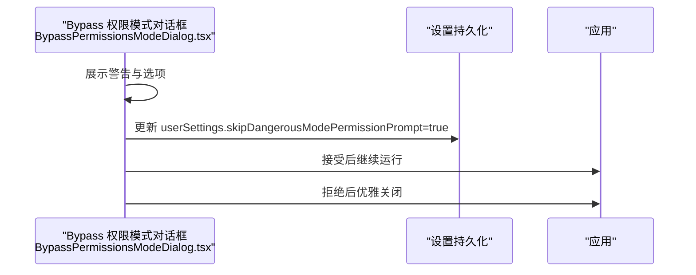
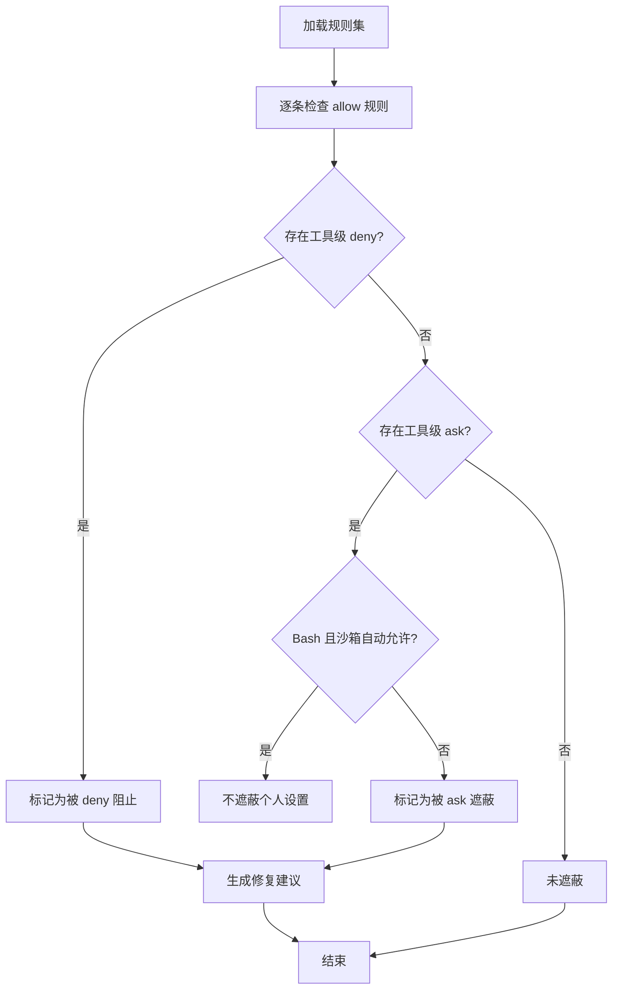
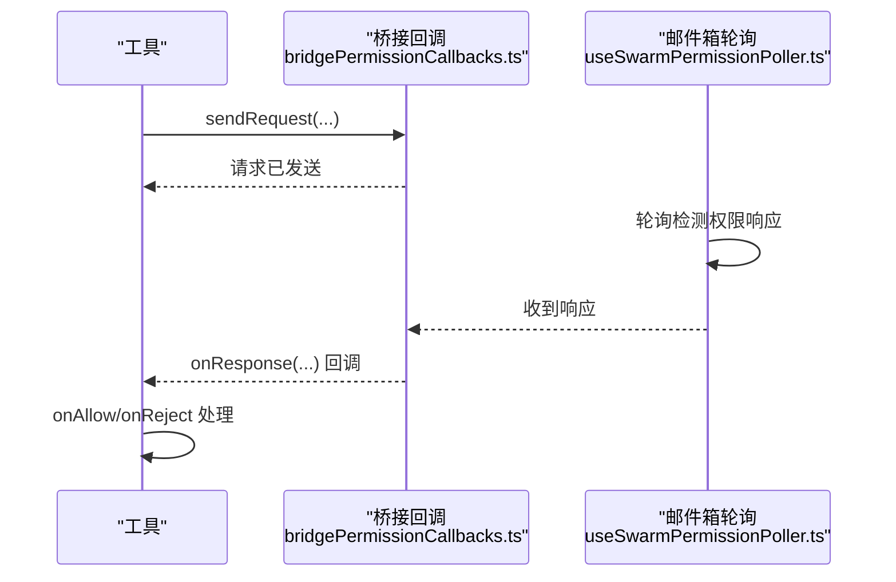
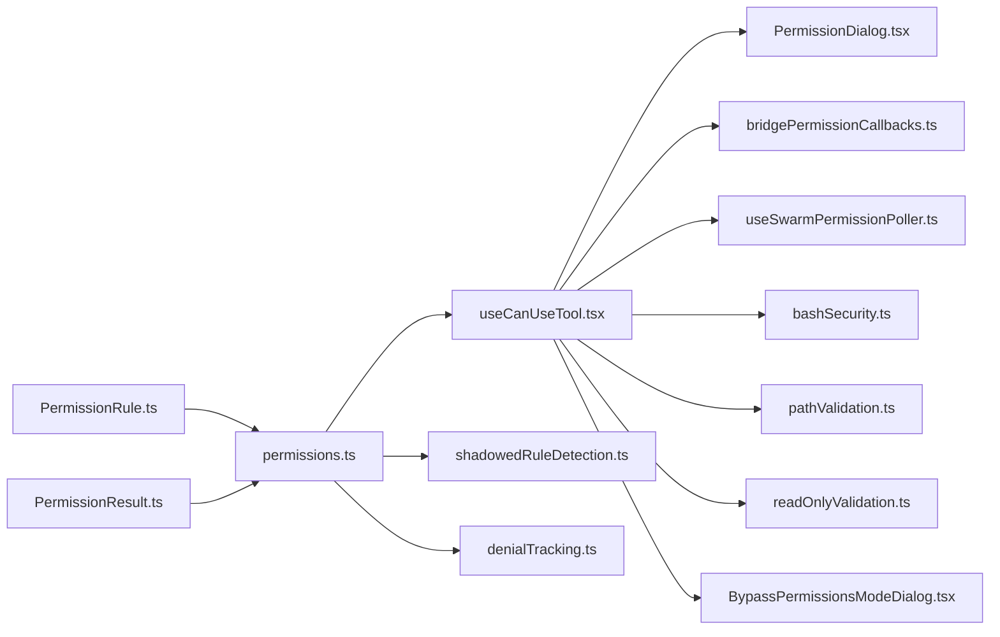

# 权限安全最佳实践

<cite>
**本文档引用的文件**
- [src/utils/permissions/permissions.ts](file://src/utils/permissions/permissions.ts)
- [src/hooks/useCanUseTool.tsx](file://src/hooks/useCanUseTool.tsx)
- [src/utils/permissions/shadowedRuleDetection.ts](file://src/utils/permissions/shadowedRuleDetection.ts)
- [src/utils/permissions/denialTracking.ts](file://src/utils/permissions/denialTracking.ts)
- [src/components/BypassPermissionsModeDialog.tsx](file://src/components/BypassPermissionsModeDialog.tsx)
- [src/tools/BashTool/bashSecurity.ts](file://src/tools/BashTool/bashSecurity.ts)
- [src/tools/BashTool/pathValidation.ts](file://src/tools/BashTool/pathValidation.ts)
- [src/tools/BashTool/readOnlyValidation.ts](file://src/tools/BashTool/readOnlyValidation.ts)
- [src/bridge/bridgePermissionCallbacks.ts](file://src/bridge/bridgePermissionCallbacks.ts)
- [src/hooks/useSwarmPermissionPoller.ts](file://src/hooks/useSwarmPermissionPoller.ts)
- [src/utils/permissions/PermissionRule.ts](file://src/utils/permissions/PermissionRule.ts)
- [src/types/permissions.ts](file://src/types/permissions.ts)
- [src/utils/permissions/PermissionResult.ts](file://src/utils/permissions/PermissionResult.ts)
- [src/components/permissions/PermissionDialog.tsx](file://src/components/permissions/PermissionDialog.tsx)
- [src/components/permissions/PermissionRequestTitle.tsx](file://src/components/permissions/PermissionRequestTitle.tsx)
</cite>

## 目录
1. [引言](#引言)
2. [项目结构](#项目结构)
3. [核心组件](#核心组件)
4. [架构总览](#架构总览)
5. [详细组件分析](#详细组件分析)
6. [依赖关系分析](#依赖关系分析)
7. [性能考虑](#性能考虑)
8. [故障排查指南](#故障排查指南)
9. [结论](#结论)
10. [附录](#附录)

## 引言
本文件面向 Claude Code 的权限与安全体系，系统化梳理其权限决策模型、威胁建模、危险模式检测、绕过防护、规则冲突规避、配置检查清单、合规指南、事件响应与测试方法。目标是帮助开发者与安全运营人员在不牺牲可用性的前提下，最大化降低越权与高危操作风险。

## 项目结构
权限与安全相关代码主要分布在以下模块：
- 权限决策与规则：工具级权限检查、规则解析与应用、自动模式分类器集成、拒绝次数跟踪
- 危险模式检测：Bash 安全检查（命令注入、危险变量、等号展开、heredoc 替换）、路径约束验证、只读命令白名单
- 交互与提示：权限请求对话框、标题组件、桥接回调与邮件箱轮询
- 规则冲突检测：不可达规则检测（遮蔽）与修复建议
- 紧急停用与旁路：Bypass 权限模式对话框与设置持久化

**图表来源**
- [src/utils/permissions/PermissionRule.ts:1-42](file://src/utils/permissions/PermissionRule.ts#L1-L42)
- [src/utils/permissions/PermissionResult.ts:1-35](file://src/utils/permissions/PermissionResult.ts#L1-L35)
- [src/utils/permissions/permissions.ts:1-800](file://src/utils/permissions/permissions.ts#L1-L800)
- [src/hooks/useCanUseTool.tsx:1-205](file://src/hooks/useCanUseTool.tsx#L1-L205)
- [src/tools/BashTool/bashSecurity.ts:1-800](file://src/tools/BashTool/bashSecurity.ts#L1-L800)
- [src/tools/BashTool/pathValidation.ts:819-845](file://src/tools/BashTool/pathValidation.ts#L819-L845)
- [src/tools/BashTool/readOnlyValidation.ts:1407-1440](file://src/tools/BashTool/readOnlyValidation.ts#L1407-L1440)
- [src/components/permissions/PermissionDialog.tsx:1-73](file://src/components/permissions/PermissionDialog.tsx#L1-L73)
- [src/components/permissions/PermissionRequestTitle.tsx:1-67](file://src/components/permissions/PermissionRequestTitle.tsx#L1-L67)
- [src/bridge/bridgePermissionCallbacks.ts:1-46](file://src/bridge/bridgePermissionCallbacks.ts#L1-L46)
- [src/hooks/useSwarmPermissionPoller.ts:118-160](file://src/hooks/useSwarmPermissionPoller.ts#L118-L160)
- [src/utils/permissions/shadowedRuleDetection.ts:1-236](file://src/utils/permissions/shadowedRuleDetection.ts#L1-L236)
- [src/utils/permissions/denialTracking.ts:1-47](file://src/utils/permissions/denialTracking.ts#L1-L47)
- [src/components/BypassPermissionsModeDialog.tsx:1-89](file://src/components/BypassPermissionsModeDialog.tsx#L1-L89)

**章节来源**
- [src/utils/permissions/permissions.ts:1-800](file://src/utils/permissions/permissions.ts#L1-L800)
- [src/hooks/useCanUseTool.tsx:1-205](file://src/hooks/useCanUseTool.tsx#L1-L205)

## 核心组件
- 权限规则与行为
  - 规则值包含工具名与可选内容，支持 allow/deny/ask 行为
  - 支持 MCP 服务器级规则匹配与通配符
- 权限决策流
  - 工具入口钩子统一调用权限主流程，按规则集评估并决定 allow/ask/deny
  - 自动模式（auto）下优先使用分类器快速判定，必要时回退到用户确认
- 危险模式检测
  - Bash 安全检查覆盖命令注入、危险变量、等号展开、heredoc 替换、Zsh 危险命令等
  - 路径验证确保路径类命令在受限目录内执行，剥离安全包装器后进行二次校验
  - 只读命令白名单通过正则严格限制参数，阻断重定向与命令替换
- 规则冲突检测
  - 检测“工具级 ask/deny”对“具体规则”的遮蔽，生成修复建议
- 紧急停用与旁路
  - Bypass 权限模式对话框用于高风险环境下的紧急停用，需用户明确接受风险并持久化设置

**章节来源**
- [src/utils/permissions/PermissionRule.ts:1-42](file://src/utils/permissions/PermissionRule.ts#L1-L42)
- [src/utils/permissions/permissions.ts:233-302](file://src/utils/permissions/permissions.ts#L233-L302)
- [src/hooks/useCanUseTool.tsx:27-190](file://src/hooks/useCanUseTool.tsx#L27-L190)
- [src/tools/BashTool/bashSecurity.ts:1-800](file://src/tools/BashTool/bashSecurity.ts#L1-L800)
- [src/tools/BashTool/pathValidation.ts:819-845](file://src/tools/BashTool/pathValidation.ts#L819-L845)
- [src/tools/BashTool/readOnlyValidation.ts:1407-1440](file://src/tools/BashTool/readOnlyValidation.ts#L1407-L1440)
- [src/utils/permissions/shadowedRuleDetection.ts:186-236](file://src/utils/permissions/shadowedRuleDetection.ts#L186-L236)
- [src/components/BypassPermissionsModeDialog.tsx:1-89](file://src/components/BypassPermissionsModeDialog.tsx#L1-L89)

## 架构总览
权限系统采用“规则驱动 + 多层安全网”的设计：
- 规则层：允许/询问/禁止规则，按来源聚合（用户、项目、策略、命令行、会话）
- 决策层：工具入口钩子触发权限主流程，结合自动模式分类器与拒绝计数
- 执行层：Bash 安全检查、路径约束、只读命令白名单三道防线
- 交互层：权限对话框、桥接回调、邮件箱轮询，支持远程与异步场景
- 策略层：不可达规则检测、拒绝阈值回退、旁路模式警示

**图表来源**
- [src/hooks/useCanUseTool.tsx:27-190](file://src/hooks/useCanUseTool.tsx#L27-L190)
- [src/utils/permissions/permissions.ts:473-800](file://src/utils/permissions/permissions.ts#L473-L800)
- [src/tools/BashTool/bashSecurity.ts:1-800](file://src/tools/BashTool/bashSecurity.ts#L1-L800)
- [src/tools/BashTool/pathValidation.ts:819-845](file://src/tools/BashTool/pathValidation.ts#L819-L845)
- [src/tools/BashTool/readOnlyValidation.ts:1407-1440](file://src/tools/BashTool/readOnlyValidation.ts#L1407-L1440)
- [src/components/permissions/PermissionDialog.tsx:1-73](file://src/components/permissions/PermissionDialog.tsx#L1-L73)
- [src/bridge/bridgePermissionCallbacks.ts:1-46](file://src/bridge/bridgePermissionCallbacks.ts#L1-L46)

## 详细组件分析

### 组件A：权限决策与自动模式
- 设计要点
  - 工具入口钩子统一收集上下文，调用权限主流程
  - 自动模式下优先走 acceptEdits 快速路径与安全工具白名单，再进入分类器
  - 拒绝计数达到阈值时回退到提示，防止误判导致的静默拒绝
- 关键流程
  - 工具级规则匹配（允许/禁止/询问）
  - 分类器判定（YOLO），记录成本与延迟指标
  - 拒绝计数更新与回退逻辑
- 安全影响
  - 降低人工负担的同时保持高风险动作的可见性
  - 对敏感文件路径与高危工具强制交互或严格分类器判定

**图表来源**
- [src/utils/permissions/permissions.ts:473-800](file://src/utils/permissions/permissions.ts#L473-L800)
- [src/utils/permissions/denialTracking.ts:1-47](file://src/utils/permissions/denialTracking.ts#L1-L47)

**章节来源**
- [src/hooks/useCanUseTool.tsx:27-190](file://src/hooks/useCanUseTool.tsx#L27-L190)
- [src/utils/permissions/permissions.ts:473-800](file://src/utils/permissions/permissions.ts#L473-L800)
- [src/utils/permissions/denialTracking.ts:1-47](file://src/utils/permissions/denialTracking.ts#L1-L47)

### 组件B：危险模式检测（Bash 安全）
- 设计要点
  - 多维度安全检查：命令片段完整性、危险元字符、命令替换、等号展开、heredoc 替换、Zsh 危险命令
  - 特殊处理：剥离安全包装器（timeout、nice 等）后再提取基础命令
  - 仅允许已知安全的只读命令，并通过正则严格限制参数
- 关键流程
  - 命令解析与引号提取
  - 危险模式检测与早期放行/拦截
  - 路径命令校验（cd/ls/find）与目录约束
  - 只读命令白名单构建与正则校验

**图表来源**
- [src/tools/BashTool/bashSecurity.ts:1-800](file://src/tools/BashTool/bashSecurity.ts#L1-L800)
- [src/tools/BashTool/pathValidation.ts:819-845](file://src/tools/BashTool/pathValidation.ts#L819-L845)
- [src/tools/BashTool/readOnlyValidation.ts:1407-1440](file://src/tools/BashTool/readOnlyValidation.ts#L1407-L1440)

**章节来源**
- [src/tools/BashTool/bashSecurity.ts:1-800](file://src/tools/BashTool/bashSecurity.ts#L1-L800)
- [src/tools/BashTool/pathValidation.ts:819-845](file://src/tools/BashTool/pathValidation.ts#L819-L845)
- [src/tools/BashTool/readOnlyValidation.ts:1407-1440](file://src/tools/BashTool/readOnlyValidation.ts#L1407-L1440)

### 组件C：权限绕过防护与紧急停用
- 设计要点
  - Bypass 权限模式对话框要求用户明确接受风险，并持久化设置以禁用危险权限提示
  - 提供安全审计：显示链接到官方安全文档
  - 退出策略：用户拒绝时执行优雅关闭
- 关键流程
  - 对话框展示与用户选择
  - 设置持久化与后续行为
  - 安全提示与外部文档链接

**图表来源**
- [src/components/BypassPermissionsModeDialog.tsx:1-89](file://src/components/BypassPermissionsModeDialog.tsx#L1-L89)

**章节来源**
- [src/components/BypassPermissionsModeDialog.tsx:1-89](file://src/components/BypassPermissionsModeDialog.tsx#L1-L89)

### 组件D：规则冲突检测与修复建议
- 设计要点
  - 检测工具级 deny/ask 对具体规则的遮蔽，生成不可达规则列表
  - 区分“完全阻止”（deny）与“总是提示”（ask）两类遮蔽
  - 提供修复建议：移除冲突规则或调整来源
- 关键流程
  - 收集 allow/ask/deny 规则
  - 判断遮蔽关系并生成不可达规则
  - 输出修复建议

**图表来源**
- [src/utils/permissions/shadowedRuleDetection.ts:186-236](file://src/utils/permissions/shadowedRuleDetection.ts#L186-L236)

**章节来源**
- [src/utils/permissions/shadowedRuleDetection.ts:1-236](file://src/utils/permissions/shadowedRuleDetection.ts#L1-L236)

### 组件E：远程与异步权限交互
- 设计要点
  - 桥接回调定义请求/响应协议，支持取消与响应处理
  - 邮件箱轮询处理跨通道权限响应，注册回调并在收到消息后执行
- 关键流程
  - 发送权限请求
  - 注册回调并等待响应
  - 处理批准/拒绝与反馈

**图表来源**
- [src/bridge/bridgePermissionCallbacks.ts:1-46](file://src/bridge/bridgePermissionCallbacks.ts#L1-L46)
- [src/hooks/useSwarmPermissionPoller.ts:118-160](file://src/hooks/useSwarmPermissionPoller.ts#L118-L160)

**章节来源**
- [src/bridge/bridgePermissionCallbacks.ts:1-46](file://src/bridge/bridgePermissionCallbacks.ts#L1-L46)
- [src/hooks/useSwarmPermissionPoller.ts:118-160](file://src/hooks/useSwarmPermissionPoller.ts#L118-L160)

## 依赖关系分析
- 权限主流程依赖规则与行为类型、分类器模块、拒绝计数模块
- 工具入口钩子串联权限主流程与 UI、桥接与邮件箱轮询
- Bash 安全模块独立于权限主流程，但其结果参与最终决策
- 不可达规则检测与拒绝计数作为策略辅助模块

**图表来源**
- [src/utils/permissions/PermissionRule.ts:1-42](file://src/utils/permissions/PermissionRule.ts#L1-L42)
- [src/utils/permissions/PermissionResult.ts:1-35](file://src/utils/permissions/PermissionResult.ts#L1-L35)
- [src/utils/permissions/permissions.ts:1-800](file://src/utils/permissions/permissions.ts#L1-L800)
- [src/hooks/useCanUseTool.tsx:1-205](file://src/hooks/useCanUseTool.tsx#L1-L205)
- [src/tools/BashTool/bashSecurity.ts:1-800](file://src/tools/BashTool/bashSecurity.ts#L1-L800)
- [src/tools/BashTool/pathValidation.ts:819-845](file://src/tools/BashTool/pathValidation.ts#L819-L845)
- [src/tools/BashTool/readOnlyValidation.ts:1407-1440](file://src/tools/BashTool/readOnlyValidation.ts#L1407-L1440)
- [src/components/permissions/PermissionDialog.tsx:1-73](file://src/components/permissions/PermissionDialog.tsx#L1-L73)
- [src/bridge/bridgePermissionCallbacks.ts:1-46](file://src/bridge/bridgePermissionCallbacks.ts#L1-L46)
- [src/hooks/useSwarmPermissionPoller.ts:118-160](file://src/hooks/useSwarmPermissionPoller.ts#L118-L160)
- [src/utils/permissions/shadowedRuleDetection.ts:1-236](file://src/utils/permissions/shadowedRuleDetection.ts#L1-L236)
- [src/utils/permissions/denialTracking.ts:1-47](file://src/utils/permissions/denialTracking.ts#L1-L47)
- [src/components/BypassPermissionsModeDialog.tsx:1-89](file://src/components/BypassPermissionsModeDialog.tsx#L1-L89)

**章节来源**
- [src/utils/permissions/permissions.ts:1-800](file://src/utils/permissions/permissions.ts#L1-L800)
- [src/hooks/useCanUseTool.tsx:1-205](file://src/hooks/useCanUseTool.tsx#L1-L205)

## 性能考虑
- 自动模式快路径
  - acceptEdits 快速路径与安全工具白名单减少分类器调用频率
  - 分类器成本与延迟指标记录，便于性能分析与优化
- 拒绝计数回退
  - 避免连续失败导致的静默拒绝，提高用户体验与安全性
- Bash 安全检查
  - 早期放行与严格白名单减少后续验证开销
  - 正则与树形分析结合，平衡准确性与性能

[本节为通用指导，无需特定文件引用]

## 故障排查指南
- 权限请求未弹出
  - 检查自动模式是否启用以及分类器可用性
  - 确认拒绝计数是否触发回退
- Bash 命令被错误拦截
  - 检查是否命中只读白名单或路径约束
  - 确认是否存在 heredoc 替换或等号展开等特殊模式
- 规则冲突导致“永远提示”
  - 使用不可达规则检测输出，移除遮蔽规则或调整来源
- 远程/异步权限无响应
  - 检查桥接回调与邮件箱轮询状态，确认请求 ID 是否匹配

**章节来源**
- [src/utils/permissions/permissions.ts:518-799](file://src/utils/permissions/permissions.ts#L518-L799)
- [src/utils/permissions/shadowedRuleDetection.ts:186-236](file://src/utils/permissions/shadowedRuleDetection.ts#L186-L236)
- [src/bridge/bridgePermissionCallbacks.ts:1-46](file://src/bridge/bridgePermissionCallbacks.ts#L1-L46)
- [src/hooks/useSwarmPermissionPoller.ts:118-160](file://src/hooks/useSwarmPermissionPoller.ts#L118-L160)

## 结论
Claude Code 的权限安全体系通过“规则驱动 + 多层安全网 + 自动模式 + 可视化策略”的组合，在保证开发效率的同时显著降低了高危操作风险。建议团队在日常使用中：
- 定期审查不可达规则，消除遮蔽
- 合理配置自动模式与拒绝阈值
- 在高风险环境谨慎启用旁路模式
- 将权限安全纳入变更评审与合规检查流程

[本节为总结，无需特定文件引用]

## 附录

### 权限安全配置检查清单
- 规则层面
  - 是否存在工具级 ask/deny 对具体规则的遮蔽？（使用不可达规则检测）
  - 是否存在过度宽泛的 Bash 允许规则？（建议改为更具体的前缀规则）
  - 是否正确区分个人设置与共享设置来源？
- 自动模式层面
  - 自动模式是否启用？是否合理设置拒绝阈值？
  - acceptEdits 快速路径与安全工具白名单是否覆盖常见安全操作？
- Bash 安全层面
  - heredoc 替换与等号展开是否被正确拦截？
  - 路径命令是否限制在受信目录？
  - 只读命令白名单是否足够严格？
- 交互与审计层面
  - 权限对话框是否正常显示？
  - 分类器调用成本与延迟是否在可接受范围？
  - 旁路模式是否仅在隔离环境中启用？

**章节来源**
- [src/utils/permissions/shadowedRuleDetection.ts:186-236](file://src/utils/permissions/shadowedRuleDetection.ts#L186-L236)
- [src/utils/permissions/permissions.ts:518-799](file://src/utils/permissions/permissions.ts#L518-L799)
- [src/tools/BashTool/bashSecurity.ts:1-800](file://src/tools/BashTool/bashSecurity.ts#L1-L800)
- [src/tools/BashTool/pathValidation.ts:819-845](file://src/tools/BashTool/pathValidation.ts#L819-L845)
- [src/tools/BashTool/readOnlyValidation.ts:1407-1440](file://src/tools/BashTool/readOnlyValidation.ts#L1407-L1440)
- [src/components/BypassPermissionsModeDialog.tsx:1-89](file://src/components/BypassPermissionsModeDialog.tsx#L1-L89)

### 合规性指南
- 企业策略
  - 使用策略设置（policySettings）集中管理关键权限规则
  - 项目设置（projectSettings）应最小化共享敏感规则
- 个人设置
  - 仅在本地设置（localSettings）存放非共享规则
  - 避免在命令行参数（cliArg）中传递敏感规则
- 审计与追溯
  - 记录权限决策来源与原因，便于审计
  - 对自动模式的分类器调用进行成本与延迟统计

**章节来源**
- [src/utils/permissions/permissions.ts:109-121](file://src/utils/permissions/permissions.ts#L109-L121)
- [src/utils/permissions/permissions.ts:473-800](file://src/utils/permissions/permissions.ts#L473-L800)

### 安全事件响应流程
- 发现异常
  - 检查权限对话框与自动模式日志
  - 核对分类器调用与拒绝计数
- 应急处置
  - 如需紧急停用，启用旁路模式对话框并记录
  - 临时收紧规则或切换到更严格的权限模式
- 复盘与改进
  - 分析不可达规则与历史拒绝趋势
  - 优化规则与白名单，减少误报与漏报

**章节来源**
- [src/components/BypassPermissionsModeDialog.tsx:1-89](file://src/components/BypassPermissionsModeDialog.tsx#L1-L89)
- [src/utils/permissions/denialTracking.ts:1-47](file://src/utils/permissions/denialTracking.ts#L1-L47)
- [src/utils/permissions/shadowedRuleDetection.ts:186-236](file://src/utils/permissions/shadowedRuleDetection.ts#L186-L236)

### 测试方法与漏洞扫描建议
- 单元测试
  - Bash 安全检查：覆盖命令注入、heredoc 替换、等号展开、Zsh 危险命令
  - 路径验证：覆盖 cd/ls/find 等路径命令与目录边界
  - 只读命令白名单：验证正则限制与参数过滤
- 集成测试
  - 自动模式分类器：模拟不同提示长度与工具调用，验证成本与延迟指标
  - 权限规则冲突：构造遮蔽场景，验证不可达规则检测输出
- 漏洞扫描
  - 代码静态分析：关注正则表达式、命令拼接与路径解析
  - 动态测试：使用模糊测试工具对 Bash 输入进行压力测试
  - 渗透测试：在隔离环境中验证旁路模式与权限绕过路径

**章节来源**
- [src/tools/BashTool/bashSecurity.ts:1-800](file://src/tools/BashTool/bashSecurity.ts#L1-L800)
- [src/tools/BashTool/pathValidation.ts:819-845](file://src/tools/BashTool/pathValidation.ts#L819-L845)
- [src/tools/BashTool/readOnlyValidation.ts:1407-1440](file://src/tools/BashTool/readOnlyValidation.ts#L1407-L1440)
- [src/utils/permissions/permissions.ts:688-800](file://src/utils/permissions/permissions.ts#L688-L800)
- [src/utils/permissions/shadowedRuleDetection.ts:186-236](file://src/utils/permissions/shadowedRuleDetection.ts#L186-L236)