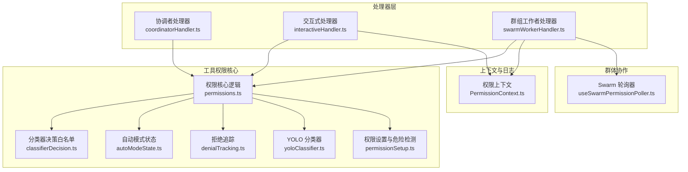
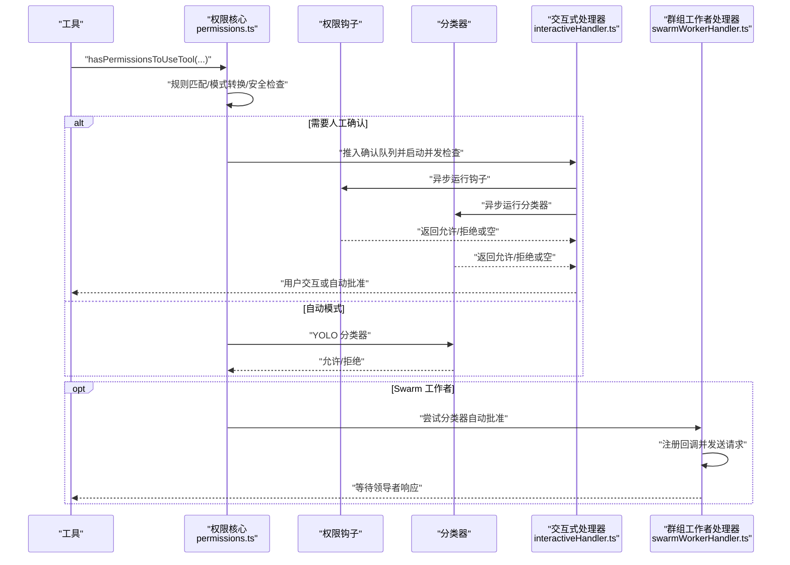
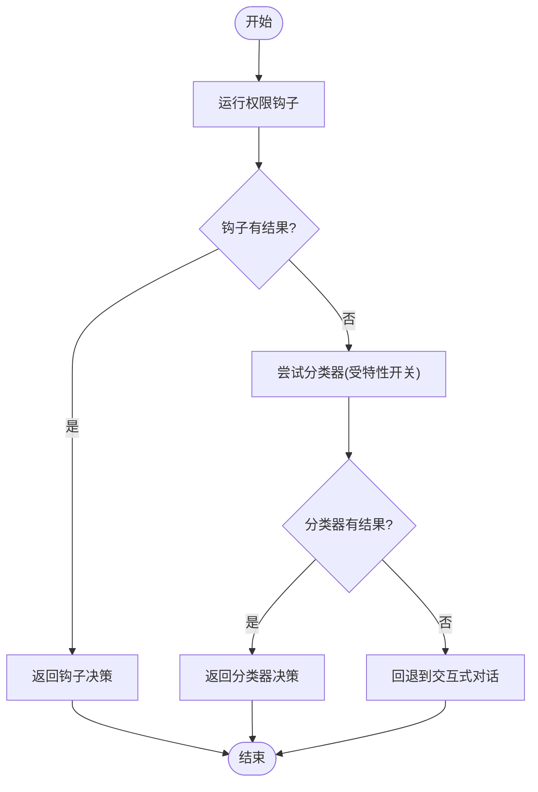
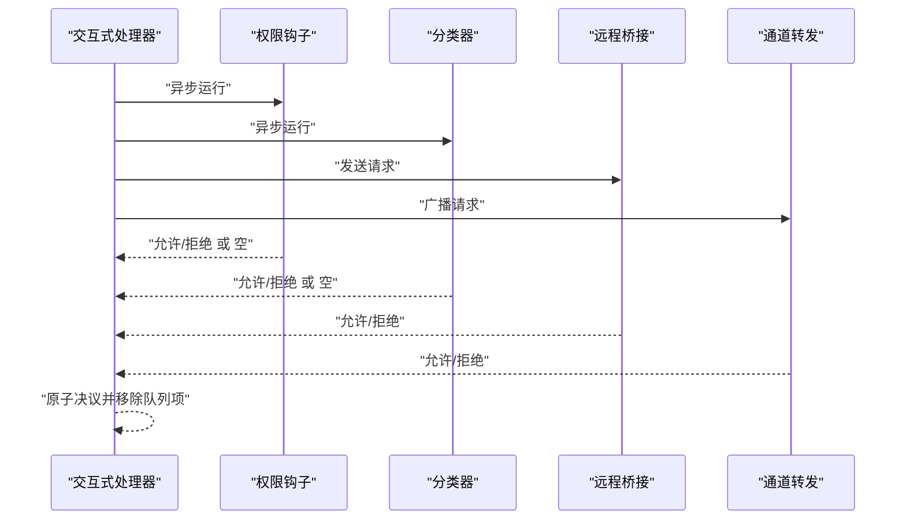
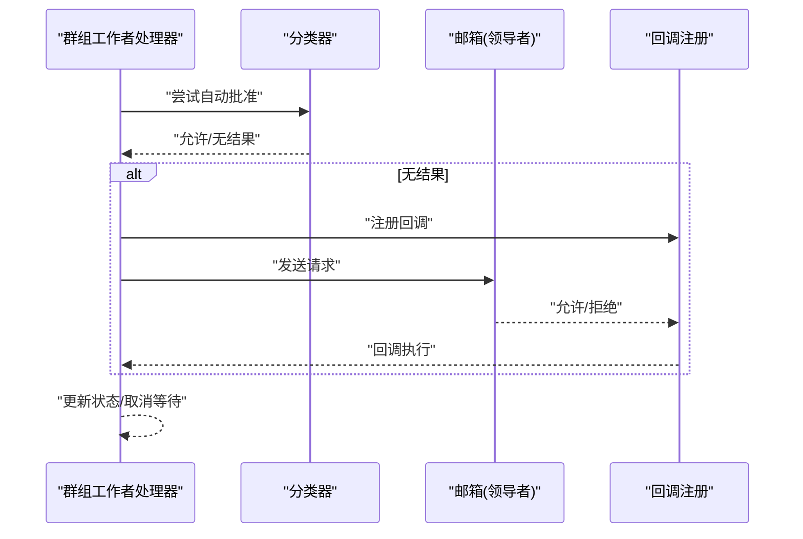
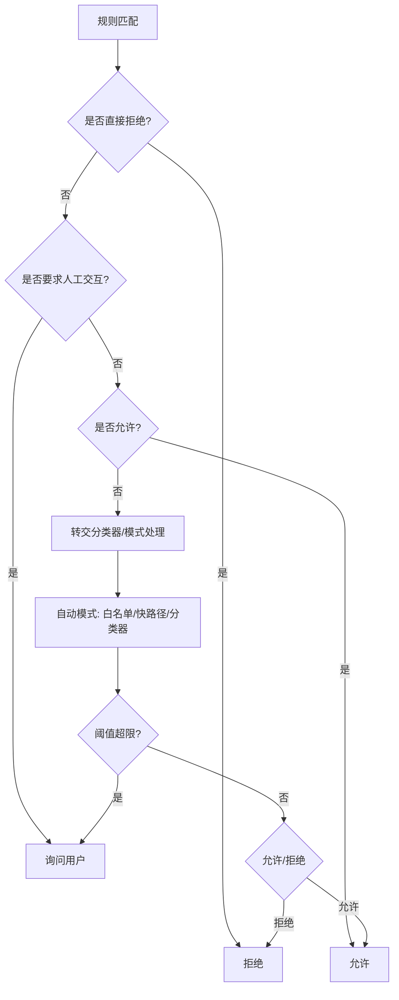
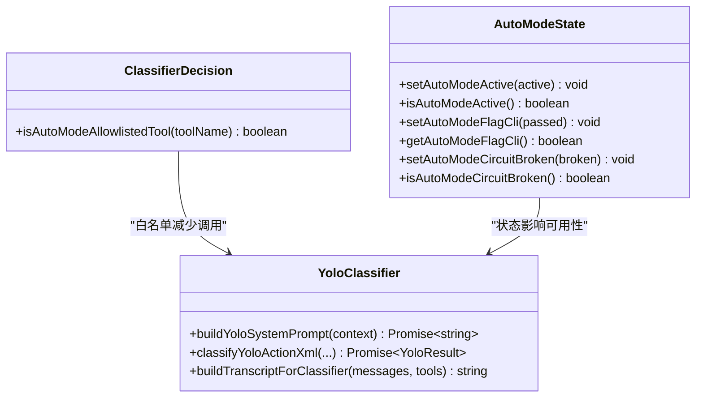
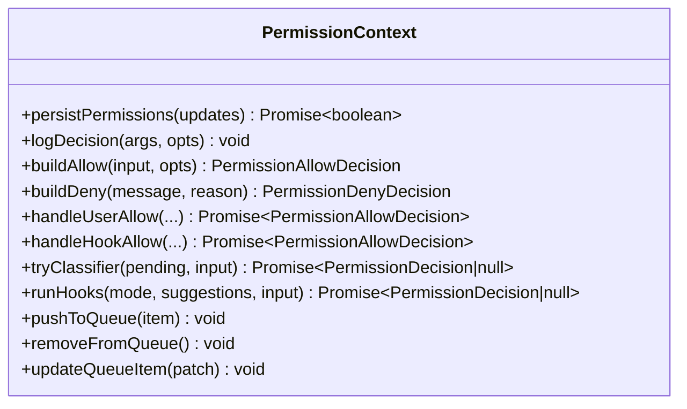
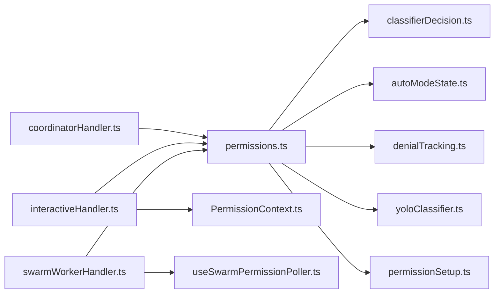

# 权限检查机制

<cite>
**本文档引用的文件**
- [coordinatorHandler.ts](file://src/hooks/toolPermission/handlers/coordinatorHandler.ts)
- [interactiveHandler.ts](file://src/hooks/toolPermission/handlers/interactiveHandler.ts)
- [swarmWorkerHandler.ts](file://src/hooks/toolPermission/handlers/swarmWorkerHandler.ts)
- [permissions.ts](file://src/utils/permissions/permissions.ts)
- [classifierDecision.ts](file://src/utils/permissions/classifierDecision.ts)
- [autoModeState.ts](file://src/utils/permissions/autoModeState.ts)
- [PermissionContext.ts](file://src/hooks/toolPermission/PermissionContext.ts)
- [denialTracking.ts](file://src/utils/permissions/denialTracking.ts)
- [yoloClassifier.ts](file://src/utils/permissions/yoloClassifier.ts)
- [permissionSetup.ts](file://src/utils/permissions/permissionSetup.ts)
- [useSwarmPermissionPoller.ts](file://src/hooks/useSwarmPermissionPoller.ts)
</cite>

## 目录
1. [简介](#简介)
2. [项目结构](#项目结构)
3. [核心组件](#核心组件)
4. [架构总览](#架构总览)
5. [详细组件分析](#详细组件分析)
6. [依赖关系分析](#依赖关系分析)
7. [性能考量](#性能考量)
8. [故障排查指南](#故障排查指南)
9. [结论](#结论)
10. [附录](#附录)

## 简介
本文件系统性阐述 Claude Code 的权限检查机制，覆盖从权限请求到最终决策的完整流程。重点解析三种权限处理器的工作原理：协调者处理器（coordinatorHandler）、交互式处理器（interactiveHandler）和群组工作者处理器（swarmWorkerHandler），并深入说明权限分类器的决策算法（包括危险模式检测、路径验证与命令语义分析）。同时介绍权限缓存机制与性能优化策略，并提供常见失败原因与调试方法，辅以流程图与决策树示例帮助理解。

## 项目结构
权限检查相关代码主要分布在以下模块：
- 处理器层：三种处理器分别负责不同运行环境下的权限流控制
- 工具权限核心：规则匹配、自动模式分类器、拒绝次数跟踪等
- 上下文与日志：统一的权限上下文封装与决策记录
- 群体协作：Swarm 模式下的请求转发与轮询处理

图表来源
- [coordinatorHandler.ts:1-67](file://src/hooks/toolPermission/handlers/coordinatorHandler.ts#L1-L67)
- [interactiveHandler.ts:1-538](file://src/hooks/toolPermission/handlers/interactiveHandler.ts#L1-L538)
- [swarmWorkerHandler.ts:1-161](file://src/hooks/toolPermission/handlers/swarmWorkerHandler.ts#L1-L161)
- [permissions.ts:1-1488](file://src/utils/permissions/permissions.ts#L1-L1488)
- [classifierDecision.ts:1-100](file://src/utils/permissions/classifierDecision.ts#L1-L100)
- [autoModeState.ts:1-41](file://src/utils/permissions/autoModeState.ts#L1-L41)
- [denialTracking.ts:1-47](file://src/utils/permissions/denialTracking.ts#L1-L47)
- [yoloClassifier.ts:1-1534](file://src/utils/permissions/yoloClassifier.ts#L1-L1534)
- [permissionSetup.ts:1-1534](file://src/utils/permissions/permissionSetup.ts#L1-L1534)
- [PermissionContext.ts:1-390](file://src/hooks/toolPermission/PermissionContext.ts#L1-L390)
- [useSwarmPermissionPoller.ts:256-330](file://src/hooks/useSwarmPermissionPoller.ts#L256-L330)

章节来源
- [coordinatorHandler.ts:1-67](file://src/hooks/toolPermission/handlers/coordinatorHandler.ts#L1-L67)
- [interactiveHandler.ts:1-538](file://src/hooks/toolPermission/handlers/interactiveHandler.ts#L1-L538)
- [swarmWorkerHandler.ts:1-161](file://src/hooks/toolPermission/handlers/swarmWorkerHandler.ts#L1-L161)
- [permissions.ts:1-1488](file://src/utils/permissions/permissions.ts#L1-L1488)

## 核心组件
- 协调者处理器（coordinatorHandler）
  - 在协调者工作节点上顺序执行权限钩子与分类器检查，若两者均无法即时决定则回退到交互式对话。
- 交互式处理器（interactiveHandler）
  - 主要代理（main-agent）的权限流，异步并发运行钩子与分类器，与用户交互竞速，支持远程桥接与通道转发。
- 群组工作者处理器（swarmWorkerHandler）
  - 在 Swarm 工作者节点上优先尝试分类器自动批准，随后通过邮箱向领导者转发请求并等待响应；若失败则回退本地处理。
- 权限核心（permissions.ts）
  - 规则驱动的权限判定主流程，涵盖规则匹配、模式转换（如 dontAsk/auto/plan）、安全检查与拒绝限制。
- 分类器决策（classifierDecision.ts）
  - 自动模式分类器的“安全工具”白名单，避免对只读/低风险工具进行昂贵的分类器调用。
- 自动模式状态（autoModeState.ts）
  - 维护自动模式的启用状态与电路断开标志，影响模式切换与分类器可用性。
- 拒绝追踪（denialTracking.ts）
  - 记录连续与累计拒绝次数，达到阈值后强制回退到人工确认。
- YOLO 分类器（yoloClassifier.ts）
  - 实现两阶段 XML 输出格式的自动模式分类器，支持快速与思考两种模式，具备缓存控制与错误诊断能力。
- 权限设置（permissionSetup.ts）
  - 危险规则检测与清理、自动模式入口保护、模式切换副作用等。
- 权限上下文（PermissionContext.ts）
  - 封装权限决策所需的上下文操作（持久化、日志、构建决策、队列管理等）。
- Swarm 轮询器（useSwarmPermissionPoller.ts）
  - 工作者节点轮询权限响应，处理回调注册、响应清理与异常日志。

章节来源
- [coordinatorHandler.ts:16-62](file://src/hooks/toolPermission/handlers/coordinatorHandler.ts#L16-L62)
- [interactiveHandler.ts:57-531](file://src/hooks/toolPermission/handlers/interactiveHandler.ts#L57-L531)
- [swarmWorkerHandler.ts:40-155](file://src/hooks/toolPermission/handlers/swarmWorkerHandler.ts#L40-L155)
- [permissions.ts:473-956](file://src/utils/permissions/permissions.ts#L473-L956)
- [classifierDecision.ts:56-98](file://src/utils/permissions/classifierDecision.ts#L56-L98)
- [autoModeState.ts:11-33](file://src/utils/permissions/autoModeState.ts#L11-L33)
- [denialTracking.ts:17-45](file://src/utils/permissions/denialTracking.ts#L17-L45)
- [yoloClassifier.ts:711-800](file://src/utils/permissions/yoloClassifier.ts#L711-L800)
- [permissionSetup.ts:505-553](file://src/utils/permissions/permissionSetup.ts#L505-L553)
- [PermissionContext.ts:96-347](file://src/hooks/toolPermission/PermissionContext.ts#L96-L347)
- [useSwarmPermissionPoller.ts:268-330](file://src/hooks/useSwarmPermissionPoller.ts#L268-L330)

## 架构总览
权限检查的整体流程如下：
- 输入工具与输入参数进入权限核心，按规则与模式进行判定。
- 若需要人工确认，交由交互式处理器展示对话框并并发运行钩子与分类器。
- 在 Swarm 环境中，工作者节点可先尝试分类器自动批准，再向领导者请求授权。
- 自动模式下，使用 YOLO 分类器进行安全评估，结合拒绝追踪与白名单优化性能。

图表来源
- [permissions.ts:473-956](file://src/utils/permissions/permissions.ts#L473-L956)
- [interactiveHandler.ts:57-531](file://src/hooks/toolPermission/handlers/interactiveHandler.ts#L57-L531)
- [swarmWorkerHandler.ts:40-155](file://src/hooks/toolPermission/handlers/swarmWorkerHandler.ts#L40-L155)
- [yoloClassifier.ts:711-800](file://src/utils/permissions/yoloClassifier.ts#L711-L800)

## 详细组件分析

### 协调者处理器（coordinatorHandler）
- 顺序执行：先运行权限钩子，再尝试分类器（受特性开关控制）。
- 若两者均未即时决定，则回退到交互式对话，确保用户可控。
- 异常时记录错误并回退，避免中断流程。

图表来源
- [coordinatorHandler.ts:26-62](file://src/hooks/toolPermission/handlers/coordinatorHandler.ts#L26-L62)

章节来源
- [coordinatorHandler.ts:16-62](file://src/hooks/toolPermission/handlers/coordinatorHandler.ts#L16-L62)

### 交互式处理器（interactiveHandler）
- 并发竞速：在用户交互前，异步运行钩子与分类器，优先者立即生效。
- 支持远程桥接与通道转发，多路响应通过原子决议避免重复处理。
- 用户交互事件会清除分类器指示，防止误判。
- 提供重新检查权限的能力，适配模式切换场景。

图表来源
- [interactiveHandler.ts:57-531](file://src/hooks/toolPermission/handlers/interactiveHandler.ts#L57-L531)

章节来源
- [interactiveHandler.ts:57-531](file://src/hooks/toolPermission/handlers/interactiveHandler.ts#L57-L531)

### 群组工作者处理器（swarmWorkerHandler）
- 优先尝试分类器自动批准（针对 Bash 命令）。
- 注册回调后通过邮箱向领导者发送请求，并显示等待指示。
- 若领导者响应允许，合并输入并应用权限更新；若拒绝则取消并中止。
- 中断信号触发时，保证不挂起并正确记录取消。

图表来源
- [swarmWorkerHandler.ts:40-155](file://src/hooks/toolPermission/handlers/swarmWorkerHandler.ts#L40-L155)
- [useSwarmPermissionPoller.ts:268-330](file://src/hooks/useSwarmPermissionPoller.ts#L268-L330)

章节来源
- [swarmWorkerHandler.ts:40-155](file://src/hooks/toolPermission/handlers/swarmWorkerHandler.ts#L40-L155)
- [useSwarmPermissionPoller.ts:268-330](file://src/hooks/useSwarmPermissionPoller.ts#L268-L330)

### 权限核心（permissions.ts）
- 规则匹配：按来源聚合 allow/deny/ask 规则，支持工具级与内容级规则。
- 模式转换：根据当前模式（default/dontAsk/auto/plan/bypassPermissions）调整行为。
- 安全检查：对敏感路径与命令进行免疫型提示（不可被 bypass）。
- 拒绝限制：当连续或累计拒绝超过阈值时，强制回退到人工确认。
- 自动模式：在 acceptEdits 快路径与安全工具白名单之外，调用 YOLO 分类器进行决策。

图表来源
- [permissions.ts:1158-1319](file://src/utils/permissions/permissions.ts#L1158-L1319)
- [permissions.ts:518-927](file://src/utils/permissions/permissions.ts#L518-L927)

章节来源
- [permissions.ts:1158-1319](file://src/utils/permissions/permissions.ts#L1158-L1319)
- [permissions.ts:518-927](file://src/utils/permissions/permissions.ts#L518-L927)

### 分类器决策与自动模式（classifierDecision.ts, autoModeState.ts, yoloClassifier.ts）
- 安全工具白名单：对只读/元数据类工具跳过分类器，显著降低调用成本。
- 自动模式状态：维护是否处于自动模式及电路断开状态，影响模式切换与可用性。
- YOLO 分类器：两阶段 XML 输出格式，支持 fast/thinking/both 模式；具备缓存控制、错误诊断与统计埋点。

图表来源
- [classifierDecision.ts:56-98](file://src/utils/permissions/classifierDecision.ts#L56-L98)
- [autoModeState.ts:11-33](file://src/utils/permissions/autoModeState.ts#L11-L33)
- [yoloClassifier.ts:484-540](file://src/utils/permissions/yoloClassifier.ts#L484-L540)

章节来源
- [classifierDecision.ts:56-98](file://src/utils/permissions/classifierDecision.ts#L56-L98)
- [autoModeState.ts:11-33](file://src/utils/permissions/autoModeState.ts#L11-L33)
- [yoloClassifier.ts:484-540](file://src/utils/permissions/yoloClassifier.ts#L484-L540)

### 权限上下文（PermissionContext.ts）
- 封装权限决策所需的操作：持久化权限更新、记录决策、构建允许/拒绝决策、管理队列。
- 提供 tryClassifier、runHooks 等便捷方法，统一处理分类器与钩子的结果。

图表来源
- [PermissionContext.ts:96-347](file://src/hooks/toolPermission/PermissionContext.ts#L96-L347)

章节来源
- [PermissionContext.ts:96-347](file://src/hooks/toolPermission/PermissionContext.ts#L96-L347)

### Swarm 轮询与响应处理（useSwarmPermissionPoller.ts）
- 仅在工作者节点激活，每 500ms 轮询一次。
- 对每个待处理请求检查响应，处理后清理响应文件，避免重复消费。
- 异常时记录调试信息，不影响其他请求。

章节来源
- [useSwarmPermissionPoller.ts:268-330](file://src/hooks/useSwarmPermissionPoller.ts#L268-L330)

## 依赖关系分析
- 处理器依赖权限核心进行规则与模式判断，再根据结果选择 UI 或分类器路径。
- 交互式处理器依赖权限上下文进行队列管理与决策构建。
- Swarm 工作者处理器依赖轮询器与邮箱通信，实现跨节点协作。
- 自动模式分类器依赖白名单与状态模块，避免对安全工具的不必要调用。

图表来源
- [coordinatorHandler.ts:1-67](file://src/hooks/toolPermission/handlers/coordinatorHandler.ts#L1-L67)
- [interactiveHandler.ts:1-538](file://src/hooks/toolPermission/handlers/interactiveHandler.ts#L1-L538)
- [swarmWorkerHandler.ts:1-161](file://src/hooks/toolPermission/handlers/swarmWorkerHandler.ts#L1-L161)
- [permissions.ts:1-1488](file://src/utils/permissions/permissions.ts#L1-L1488)
- [PermissionContext.ts:1-390](file://src/hooks/toolPermission/PermissionContext.ts#L1-L390)
- [useSwarmPermissionPoller.ts:256-330](file://src/hooks/useSwarmPermissionPoller.ts#L256-L330)
- [classifierDecision.ts:1-100](file://src/utils/permissions/classifierDecision.ts#L1-L100)
- [autoModeState.ts:1-41](file://src/utils/permissions/autoModeState.ts#L1-L41)
- [denialTracking.ts:1-47](file://src/utils/permissions/denialTracking.ts#L1-L47)
- [yoloClassifier.ts:1-1534](file://src/utils/permissions/yoloClassifier.ts#L1-L1534)
- [permissionSetup.ts:1-1534](file://src/utils/permissions/permissionSetup.ts#L1-L1534)

章节来源
- [permissions.ts:1-1488](file://src/utils/permissions/permissions.ts#L1-L1488)

## 性能考量
- 分类器调用优化
  - 安全工具白名单：对只读/元数据类工具跳过分类器，显著降低 API 调用与费用。
  - 两阶段分类器：fast 模式在允许时提前终止，thinking 模式仅在阻断时启用，减少令牌浪费。
  - 缓存控制：系统提示与 CLAUDE.md 前缀采用 cache_control，提升 prompt caching 效果。
- 拒绝限制与回退
  - 连续与累计拒绝阈值触发回退，避免频繁阻断导致用户体验下降。
- 并发与竞速
  - 交互式处理器并发运行钩子与分类器，缩短等待时间；原子决议避免重复处理。
- Swarm 轮询节流
  - 固定轮询间隔与去重处理，避免资源浪费与重复消费。

章节来源
- [classifierDecision.ts:56-98](file://src/utils/permissions/classifierDecision.ts#L56-L98)
- [yoloClassifier.ts:711-800](file://src/utils/permissions/yoloClassifier.ts#L711-L800)
- [denialTracking.ts:17-45](file://src/utils/permissions/denialTracking.ts#L17-L45)
- [interactiveHandler.ts:57-531](file://src/hooks/toolPermission/handlers/interactiveHandler.ts#L57-L531)
- [useSwarmPermissionPoller.ts:268-330](file://src/hooks/useSwarmPermissionPoller.ts#L268-L330)

## 故障排查指南
- 权限检查失败的常见原因
  - 规则层面：存在 deny 规则或 ask 规则覆盖；内容级 ask 规则优先于 bypass。
  - 模式层面：dontAsk 模式将 ask 转为 deny；auto/plan 模式可能因分类器不可用而回退。
  - 安全检查：对敏感路径（如 .git/.claude/.vscode）的提示不可绕过。
  - 拒绝限制：连续/累计拒绝超过阈值，强制回退到人工确认。
  - 分类器异常：API 错误、上下文过长、门控关闭（fail closed）等。
- 调试方法
  - 查看权限日志：使用权限上下文记录决策来源与原因。
  - 启用调试输出：查看分类器错误诊断与请求/响应转储。
  - 检查模式状态：确认当前模式与自动模式状态是否符合预期。
  - Swarm 响应：检查轮询器日志与响应清理情况。

章节来源
- [permissions.ts:518-927](file://src/utils/permissions/permissions.ts#L518-L927)
- [yoloClassifier.ts:213-250](file://src/utils/permissions/yoloClassifier.ts#L213-L250)
- [PermissionContext.ts:113-131](file://src/hooks/toolPermission/PermissionContext.ts#L113-L131)
- [useSwarmPermissionPoller.ts:312-315](file://src/hooks/useSwarmPermissionPoller.ts#L312-L315)

## 结论
Claude Code 的权限检查机制通过规则驱动与自动模式分类器相结合，在保障安全的前提下最大化自动化程度。三种处理器分别适配不同运行环境，配合并发检查、拒绝限制与缓存优化，实现了高效且可控的权限决策流程。Swarm 场景下的请求转发与轮询进一步增强了分布式协作能力。建议在生产环境中结合白名单与门控策略，合理配置模式与阈值，以获得最佳的安全与体验平衡。

## 附录
- 决策树示例（简化版）
  - 规则匹配 → 是否拒绝 → 是否需要人工交互 → 是否允许 → 自动模式分类器 → 拒绝限制 → 最终决策

章节来源
- [permissions.ts:1158-1319](file://src/utils/permissions/permissions.ts#L1158-L1319)