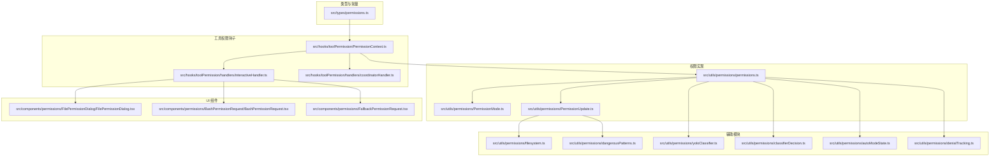
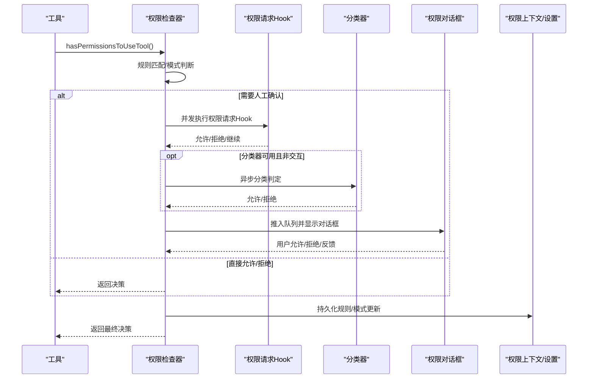
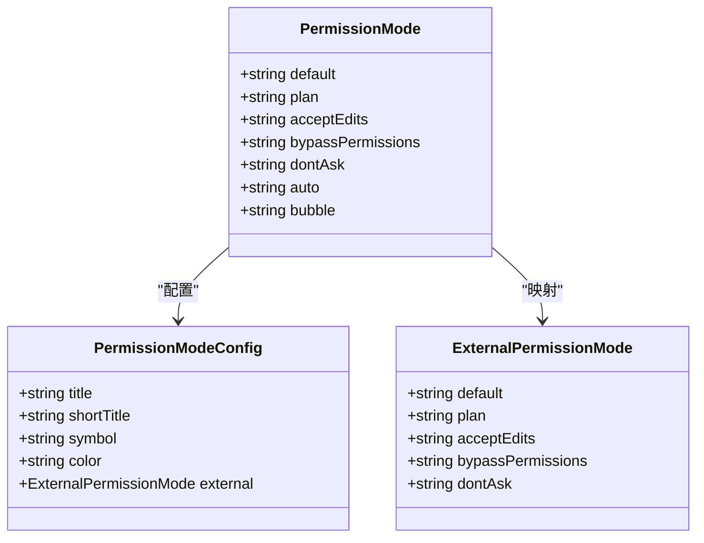
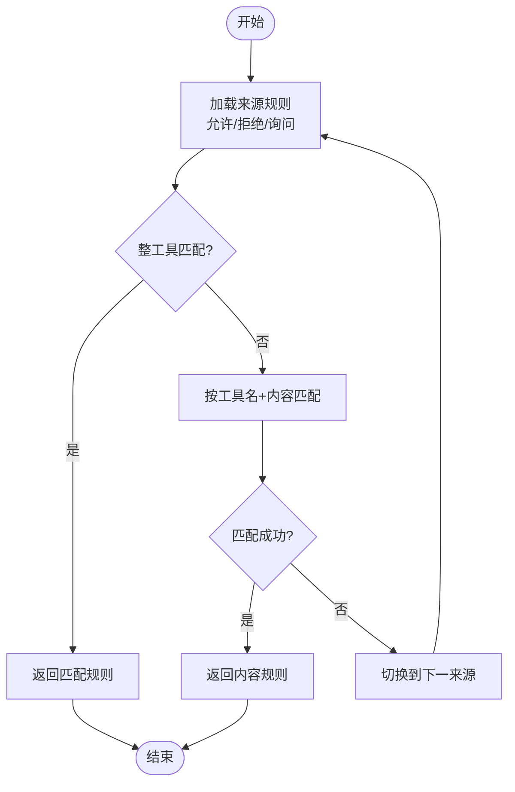
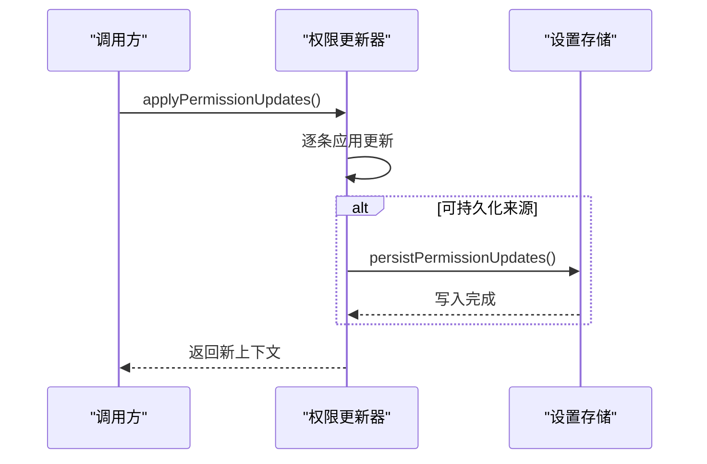
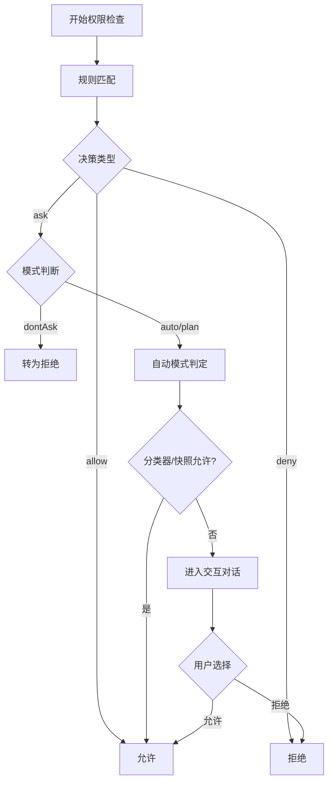
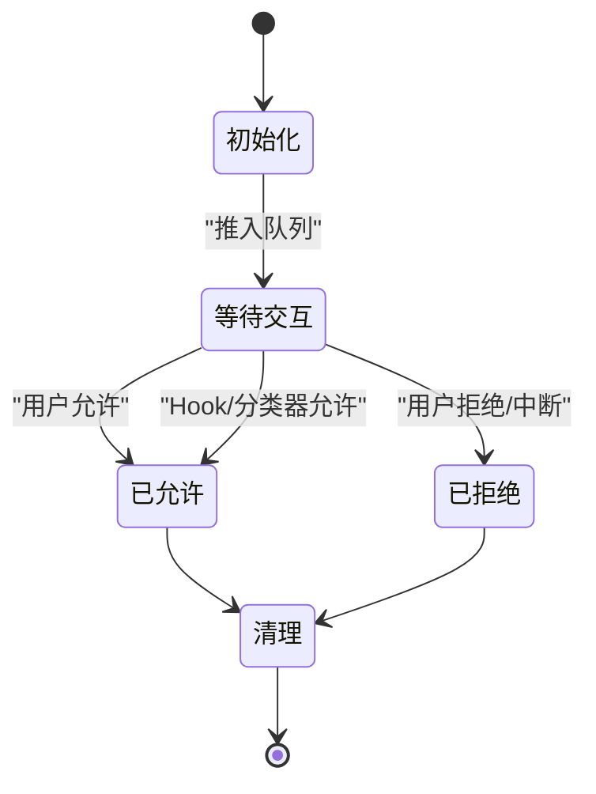
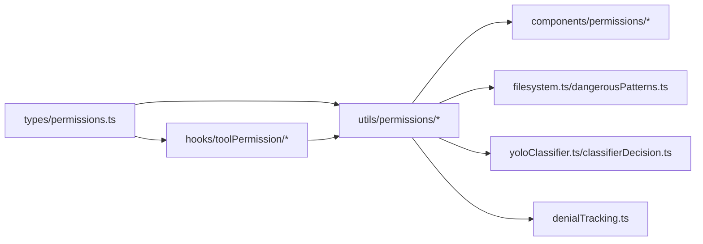

# 权限模型设计

<cite>
**本文档引用的文件**
- [src/types/permissions.ts](file://src/types/permissions.ts)
- [src/utils/permissions/permissions.ts](file://src/utils/permissions/permissions.ts)
- [src/utils/permissions/PermissionMode.ts](file://src/utils/permissions/PermissionMode.ts)
- [src/utils/permissions/PermissionUpdate.ts](file://src/utils/permissions/PermissionUpdate.ts)
- [src/hooks/toolPermission/PermissionContext.ts](file://src/hooks/toolPermission/PermissionContext.ts)
- [src/hooks/toolPermission/handlers/interactiveHandler.ts](file://src/hooks/toolPermission/handlers/interactiveHandler.ts)
- [src/hooks/toolPermission/handlers/coordinatorHandler.ts](file://src/hooks/toolPermission/handlers/coordinatorHandler.ts)
- [src/commands/permissions/permissions.tsx](file://src/commands/permissions/permissions.tsx)
- [src/components/permissions/FallbackPermissionRequest.tsx](file://src/components/permissions/FallbackPermissionRequest.tsx)
- [src/components/permissions/FilePermissionDialog/FilePermissionDialog.tsx](file://src/components/permissions/FilePermissionDialog/FilePermissionDialog.tsx)
- [src/components/permissions/BashPermissionRequest/BashPermissionRequest.tsx](file://src/components/permissions/BashPermissionRequest/BashPermissionRequest.tsx)
- [src/utils/permissions/filesystem.ts](file://src/utils/permissions/filesystem.ts)
- [src/utils/permissions/dangerousPatterns.ts](file://src/utils/permissions/dangerousPatterns.ts)
- [src/utils/permissions/yoloClassifier.ts](file://src/utils/permissions/yoloClassifier.ts)
- [src/utils/permissions/classifierDecision.ts](file://src/utils/permissions/classifierDecision.ts)
- [src/utils/permissions/autoModeState.ts](file://src/utils/permissions/autoModeState.ts)
- [src/utils/permissions/denialTracking.ts](file://src/utils/permissions/denialTracking.ts)
- [src/utils/permissions/permissionExplainer.ts](file://src/utils/permissions/permissionExplainer.ts)
- [src/utils/permissions/permissionRuleParser.ts](file://src/utils/permissions/permissionRuleParser.ts)
- [src/utils/permissions/permissionsLoader.ts](file://src/utils/permissions/permissionsLoader.ts)
</cite>

## 目录
1. [简介](#简介)
2. [项目结构](#项目结构)
3. [核心组件](#核心组件)
4. [架构总览](#架构总览)
5. [详细组件分析](#详细组件分析)
6. [依赖关系分析](#依赖关系分析)
7. [性能考量](#性能考量)
8. [故障排查指南](#故障排查指南)
9. [结论](#结论)
10. [附录](#附录)

## 简介
本文件面向 Claude Code 的权限模型设计，系统性阐述权限系统的核心理念、权限分类体系、权限层级结构、权限模式定义与行为差异、权限决策算法、权限上下文与状态生命周期，以及扩展与最佳实践。该权限模型覆盖文件系统权限、命令权限、工具权限等多个维度，并通过“规则 + 模式 + 分类器”的组合实现安全与可用性的平衡。

## 项目结构
权限相关代码主要分布在以下区域：
- 类型与常量：统一在类型层定义权限模式、行为、规则、更新与决策结构，避免循环依赖
- 工具权限钩子与上下文：封装权限检查、持久化、日志与交互流程
- 权限处理器：区分协调者分支与交互分支，分别采用“先本地后对话”或“并行竞速”的策略
- 规则与更新：支持按来源（用户/项目/会话等）维护允许/拒绝/询问规则，以及工作目录范围
- 自动模式与分类器：在 auto/plan 模式下以 AI 分类器替代人工确认，提升效率
- UI 组件：文件权限、Bash 权限、通用回退权限请求等对话框

**图表来源**
- [src/types/permissions.ts:1-443](file://src/types/permissions.ts#L1-L443)
- [src/hooks/toolPermission/PermissionContext.ts:1-390](file://src/hooks/toolPermission/PermissionContext.ts#L1-L390)
- [src/hooks/toolPermission/handlers/interactiveHandler.ts:1-538](file://src/hooks/toolPermission/handlers/interactiveHandler.ts#L1-L538)
- [src/hooks/toolPermission/handlers/coordinatorHandler.ts:1-67](file://src/hooks/toolPermission/handlers/coordinatorHandler.ts#L1-L67)
- [src/utils/permissions/permissions.ts:1-800](file://src/utils/permissions/permissions.ts#L1-L800)
- [src/utils/permissions/PermissionMode.ts:1-143](file://src/utils/permissions/PermissionMode.ts#L1-L143)
- [src/utils/permissions/PermissionUpdate.ts:1-391](file://src/utils/permissions/PermissionUpdate.ts#L1-L391)

**章节来源**
- [src/types/permissions.ts:1-443](file://src/types/permissions.ts#L1-L443)
- [src/utils/permissions/permissions.ts:1-800](file://src/utils/permissions/permissions.ts#L1-L800)

## 核心组件
- 权限模式与行为
  - 外部权限模式集合包含：默认(default)、计划(plan)、绕过权限(bypassPermissions)、不询问(dontAsk)、接受编辑(acceptEdits)
  - 内部权限模式在外部基础上增加自动(auto)与冒泡(bubble)，其中 auto 仅对特定用户类型开放
  - 行为分为：允许(allow)、拒绝(deny)、询问(ask)
- 权限规则与来源
  - 规则值包含工具名与可选内容；规则来源涵盖用户设置、项目设置、本地设置、标志位、策略、命令、会话等
  - 支持允许/拒绝/询问三类规则，按来源聚合存储
- 权限更新与持久化
  - 支持添加/替换/移除规则、设置模式、增删额外工作目录
  - 可持久化到用户/项目/本地设置，或仅会话内生效
- 权限决策与结果
  - 决策包含允许、询问、拒绝三类，以及可透传的 passthrough
  - 决策原因支持规则、模式、子命令结果、Hook、异步代理、沙箱覆盖、分类器、工作目录、安全检查等多种类型
- 权限上下文
  - 包含当前模式、额外工作目录映射、各来源的允许/拒绝/询问规则集、是否可用绕过模式、是否避免权限提示、是否等待自动化检查等

**章节来源**
- [src/types/permissions.ts:16-141](file://src/types/permissions.ts#L16-L141)
- [src/types/permissions.ts:151-325](file://src/types/permissions.ts#L151-L325)
- [src/types/permissions.ts:416-441](file://src/types/permissions.ts#L416-L441)

## 架构总览
权限系统采用“规则驱动 + 模式控制 + 分类器增强”的三层架构：
- 规则层：基于来源的规则匹配，决定工具使用是否直接允许/拒绝/进入交互
- 模式层：控制整体行为策略（默认/计划/绕过/不询问/自动），影响决策路径与自动化程度
- 分类器层：在自动/计划模式下，对高风险操作进行 AI 判定，减少人工干预

**图表来源**
- [src/utils/permissions/permissions.ts:473-800](file://src/utils/permissions/permissions.ts#L473-L800)
- [src/hooks/toolPermission/handlers/interactiveHandler.ts:57-531](file://src/hooks/toolPermission/handlers/interactiveHandler.ts#L57-L531)
- [src/hooks/toolPermission/handlers/coordinatorHandler.ts:26-62](file://src/hooks/toolPermission/handlers/coordinatorHandler.ts#L26-L62)
- [src/hooks/toolPermission/PermissionContext.ts:96-348](file://src/hooks/toolPermission/PermissionContext.ts#L96-L348)

## 详细组件分析

### 权限模式与行为
- 模式配置
  - 默认(default)：常规交互模式
  - 计划(plan)/绕过权限(bypassPermissions)/不询问(dontAsk)/接受编辑(acceptEdits)：分别对应不同安全策略
  - 自动(auto)：仅在特定用户类型启用，结合分类器实现非阻塞审批
- 模式转换与外部模式映射
  - 提供模式标题、符号、颜色与外部模式映射，便于 UI 展示与跨环境一致性
- 模式校验
  - 使用 Zod 懒加载 Schema 进行运行时校验，确保模式取值合法

**图表来源**
- [src/utils/permissions/PermissionMode.ts:42-91](file://src/utils/permissions/PermissionMode.ts#L42-L91)
- [src/types/permissions.ts:16-39](file://src/types/permissions.ts#L16-L39)

**章节来源**
- [src/utils/permissions/PermissionMode.ts:1-143](file://src/utils/permissions/PermissionMode.ts#L1-L143)
- [src/types/permissions.ts:16-39](file://src/types/permissions.ts#L16-L39)

### 权限规则与来源
- 规则结构
  - 规则值包含工具名与可选内容；规则来源涵盖用户/项目/本地/标志位/策略/命令/会话等
- 规则聚合
  - 允许/拒绝/询问规则按来源聚合，形成多级优先级与继承链
- 工具匹配
  - 支持整工具匹配与带内容的前缀/通配符匹配（如 Bash(prefix:*)）
  - 对 MCP 工具支持服务器级规则匹配（如 mcp__server1 或 mcp__server1__*）

**图表来源**
- [src/utils/permissions/permissions.ts:238-302](file://src/utils/permissions/permissions.ts#L238-L302)
- [src/utils/permissions/permissions.ts:354-390](file://src/utils/permissions/permissions.ts#L354-L390)

**章节来源**
- [src/types/permissions.ts:54-79](file://src/types/permissions.ts#L54-L79)
- [src/utils/permissions/permissions.ts:122-231](file://src/utils/permissions/permissions.ts#L122-L231)
- [src/utils/permissions/permissions.ts:238-302](file://src/utils/permissions/permissions.ts#L238-L302)

### 权限更新与持久化
- 更新类型
  - 添加/替换/移除规则、设置模式、增删额外工作目录
- 应用与持久化
  - 在内存中应用更新并返回新上下文；对可持久化来源写入设置
  - 支持批量更新与单条更新，保证幂等与去重
- 工作目录
  - 通过 AdditionalWorkingDirectory 映射记录来源，用于路径验证与解释

**图表来源**
- [src/utils/permissions/PermissionUpdate.ts:196-206](file://src/utils/permissions/PermissionUpdate.ts#L196-L206)
- [src/utils/permissions/PermissionUpdate.ts:349-353](file://src/utils/permissions/PermissionUpdate.ts#L349-L353)

**章节来源**
- [src/utils/permissions/PermissionUpdate.ts:1-391](file://src/utils/permissions/PermissionUpdate.ts#L1-L391)
- [src/types/permissions.ts:138-146](file://src/types/permissions.ts#L138-L146)

### 权限决策算法
- 决策阶段
  1) 规则匹配：按来源优先级查找允许/拒绝/询问规则
  2) 模式处理：根据模式转换 ask→deny（如 dontAsk）、或进入自动模式
  3) 自动模式：在 auto/plan 下尝试 acceptEdits 快速路径、安全工具白名单、YOLO 分类器
  4) 交互分支：并发执行 Hook 与分类器，用户在对话框中确认
- 冲突解决
  - 允许规则优先于拒绝规则；询问规则作为中间态，最终由用户或分类器决定
  - 安全检查（如敏感路径、危险模式）在自动模式下有特殊豁免策略
- 决策原因
  - 详细记录决策依据（规则、模式、Hook、分类器、工作目录、安全检查等），便于审计与解释

**图表来源**
- [src/utils/permissions/permissions.ts:473-800](file://src/utils/permissions/permissions.ts#L473-L800)
- [src/utils/permissions/permissions.ts:518-548](file://src/utils/permissions/permissions.ts#L518-L548)

**章节来源**
- [src/utils/permissions/permissions.ts:473-800](file://src/utils/permissions/permissions.ts#L473-L800)
- [src/types/permissions.ts:241-267](file://src/types/permissions.ts#L241-L267)

### 权限上下文与生命周期
- 上下文组成
  - 当前模式、额外工作目录映射、各来源规则集、是否可用绕过模式、是否避免权限提示、是否等待自动化检查、前置模式等
- 生命周期
  - 创建：在工具使用前构建，注入消息、工具、输入、上下文
  - 更新：根据用户反馈与 Hook 结果应用权限更新，必要时持久化
  - 销毁：对话框关闭或工具执行完成后清理状态与分类器指示器
- 并发与竞速
  - 交互分支中桥接远程响应、通道通知、Hook、分类器四路竞速，首个获胜者决定最终结果

**图表来源**
- [src/hooks/toolPermission/PermissionContext.ts:96-348](file://src/hooks/toolPermission/PermissionContext.ts#L96-L348)
- [src/hooks/toolPermission/handlers/interactiveHandler.ts:57-531](file://src/hooks/toolPermission/handlers/interactiveHandler.ts#L57-L531)

**章节来源**
- [src/hooks/toolPermission/PermissionContext.ts:1-390](file://src/hooks/toolPermission/PermissionContext.ts#L1-L390)
- [src/hooks/toolPermission/handlers/interactiveHandler.ts:1-538](file://src/hooks/toolPermission/handlers/interactiveHandler.ts#L1-L538)

### 权限模式详解与适用场景
- 默认模式(default)
  - 常规交互，所有需要确认的操作均弹窗
- 计划模式(plan)
  - 以暂停图标标识，强调审慎规划
- 绕过权限(bypassPermissions)
  - 高风险模式，仅在明确授权时启用
- 不询问(dontAsk)
  - 将 ask 转换为 deny，适合自动化脚本或严格合规场景
- 接受编辑(acceptEdits)
  - 文件编辑等安全操作的快速通道
- 自动模式(auto)
  - 结合分类器与快照规则，减少人工干预；对 PowerShell 等工具有特殊限制

**章节来源**
- [src/utils/permissions/PermissionMode.ts:44-91](file://src/utils/permissions/PermissionMode.ts#L44-L91)
- [src/utils/permissions/permissions.ts:518-591](file://src/utils/permissions/permissions.ts#L518-L591)

### 权限解释与可视化
- 风险等级与解释
  - 提供 LOW/MEDIUM/HIGH 风险等级与解释文本、推理依据与风险描述
- 规则解释
  - 将规则来源与规则内容转化为可读说明，帮助用户理解为何需要确认

**章节来源**
- [src/types/permissions.ts:403-411](file://src/types/permissions.ts#L403-L411)
- [src/utils/permissions/permissionExplainer.ts](file://src/utils/permissions/permissionExplainer.ts)

### UI 组件与交互
- 文件权限对话框
  - 面向文件系统读写操作，提供预览与选项
- Bash 权限请求
  - 针对潜在危险命令的分类器提示与自动批准指示
- 通用回退权限请求
  - 作为兜底对话框，适用于未专门适配的工具

**章节来源**
- [src/components/permissions/FilePermissionDialog/FilePermissionDialog.tsx](file://src/components/permissions/FilePermissionDialog/FilePermissionDialog.tsx)
- [src/components/permissions/BashPermissionRequest/BashPermissionRequest.tsx](file://src/components/permissions/BashPermissionRequest/BashPermissionRequest.tsx)
- [src/components/permissions/FallbackPermissionRequest.tsx](file://src/components/permissions/FallbackPermissionRequest.tsx)

## 依赖关系分析
- 类型层解耦
  - 所有类型与常量集中于 types/permissions.ts，避免实现层循环依赖
- 实现层分层
  - hooks/toolPermission 提供上下文与处理器，utils/permissions 实现核心算法，components 提供 UI
- 功能模块协作
  - filesystem 与 dangerousPatterns 用于路径与命令安全检查
  - yoloClassifier 与 classifierDecision 用于自动模式下的分类判定
  - denialTracking 用于自动模式的连续拒绝阈值控制

**图表来源**
- [src/types/permissions.ts:1-443](file://src/types/permissions.ts#L1-L443)
- [src/utils/permissions/permissions.ts:1-800](file://src/utils/permissions/permissions.ts#L1-L800)
- [src/hooks/toolPermission/PermissionContext.ts:1-390](file://src/hooks/toolPermission/PermissionContext.ts#L1-L390)

**章节来源**
- [src/types/permissions.ts:1-443](file://src/types/permissions.ts#L1-L443)
- [src/utils/permissions/permissions.ts:1-800](file://src/utils/permissions/permissions.ts#L1-L800)

## 性能考量
- 分类器优化
  - 自动模式优先使用 acceptEdits 快照与安全工具白名单跳过昂贵 API 调用
  - 分类器阶段化（fast/thinking）与缓存统计，降低重复成本
- 并发与竞速
  - 交互分支中多路竞速，缩短最长等待时间
- 拒绝追踪
  - 连续拒绝计数与阈值控制，避免频繁分类器调用

[本节为通用指导，无需具体文件分析]

## 故障排查指南
- 分类器不可用
  - 检查 TRANSCRIPT_CLASSIFIER 特性开关与网络状态；查看错误转储路径与用量统计
- 权限更新未生效
  - 确认更新目标来源是否可持久化；核对设置写入与上下文应用
- 自动模式误判
  - 检查规则来源与 deny 规则；确认是否命中安全工具白名单或 acceptEdits 快照
- 交互无响应
  - 查看队列状态与分类器指示器；确认 abort 信号与竞速结果

**章节来源**
- [src/utils/permissions/permissions.ts:688-800](file://src/utils/permissions/permissions.ts#L688-L800)
- [src/utils/permissions/PermissionUpdate.ts:222-342](file://src/utils/permissions/PermissionUpdate.ts#L222-L342)
- [src/hooks/toolPermission/handlers/interactiveHandler.ts:433-531](file://src/hooks/toolPermission/handlers/interactiveHandler.ts#L433-L531)

## 结论
该权限模型通过“规则 + 模式 + 分类器”的协同，实现了从细粒度规则到宏观策略再到智能自动化的多层次安全控制。其设计强调：
- 可解释性：详细的决策原因与规则来源
- 可扩展性：来源与行为的灵活组合、可插拔的 Hook 与分类器
- 可靠性：并发竞速、拒绝追踪、持久化与回退路径
- 可用性：自动模式与 UI 对话框的平衡

## 附录
- 最佳实践
  - 优先使用精确规则而非宽泛通配；定期审查与清理规则
  - 合理使用模式：开发环境可适度放宽，生产环境保持严格
  - 结合分类器与快照规则，减少人工干预但保留可控性
  - 为关键工具建立 deny 规则与最小权限原则
- 设计原则
  - 最小权限：仅授予完成任务所需的最小能力
  - 可审计：所有决策均有来源与理由记录
  - 可恢复：支持撤销与回滚，避免永久性风险
  - 可演进：特性开关与版本兼容，平滑引入新能力

[本节为通用指导，无需具体文件分析]