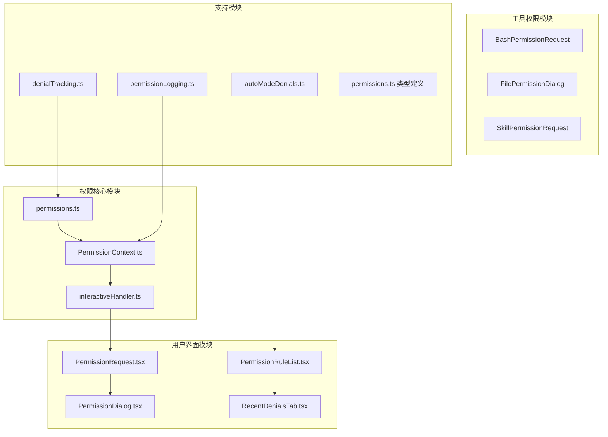
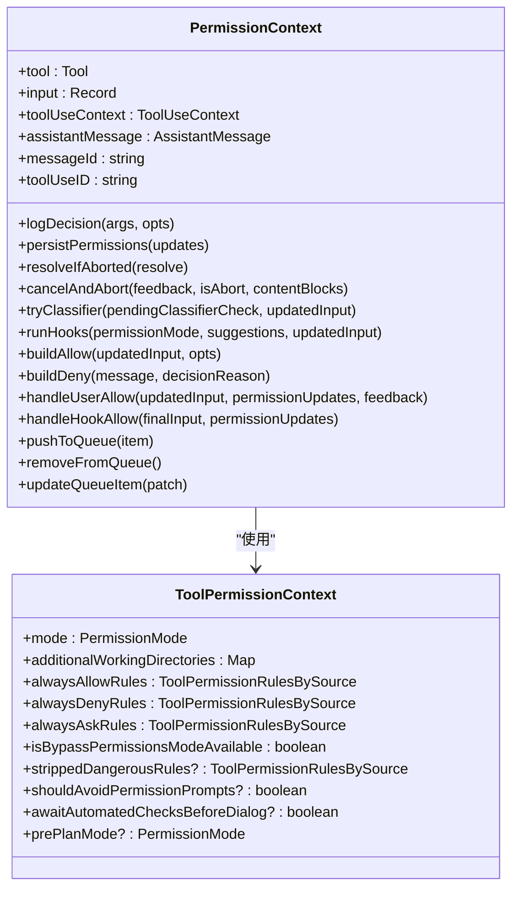
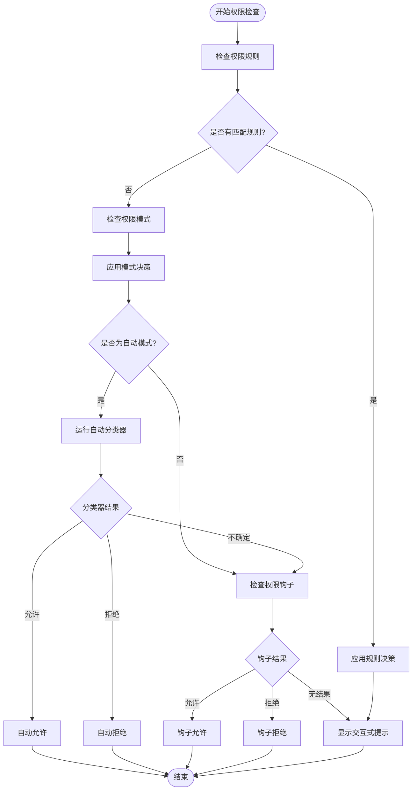
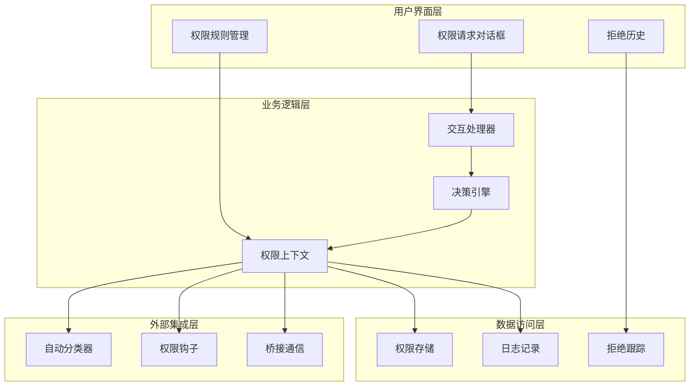
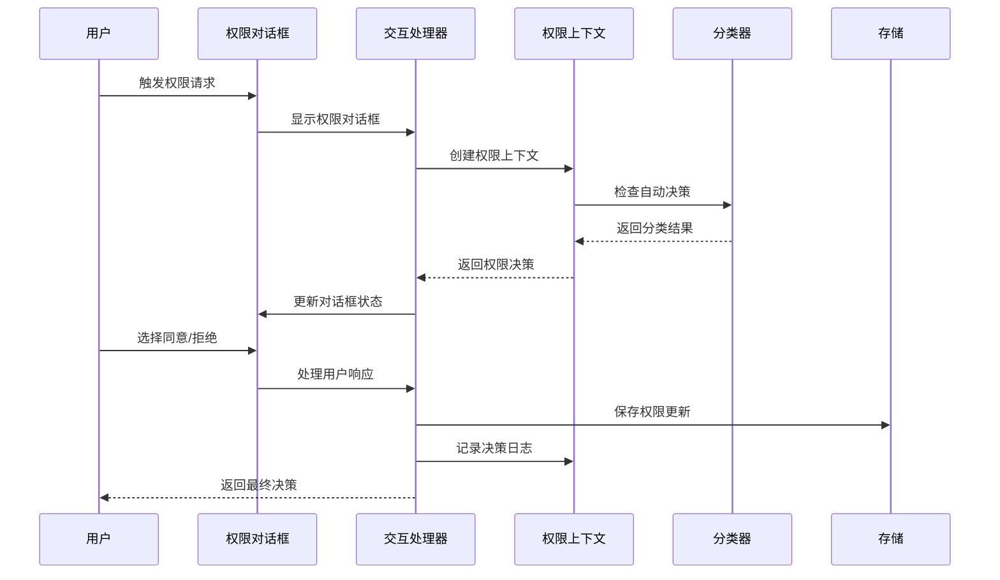
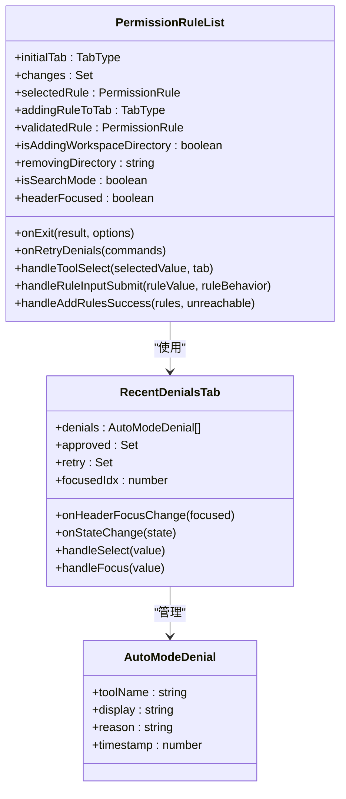
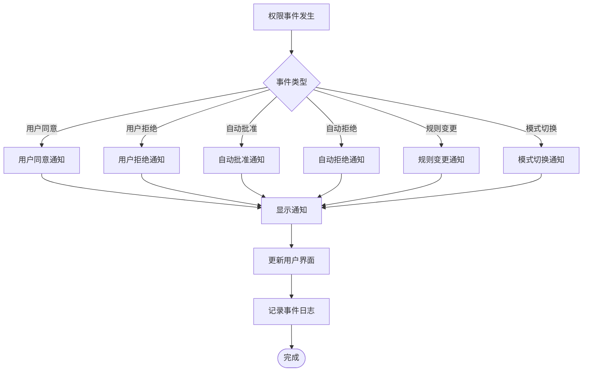
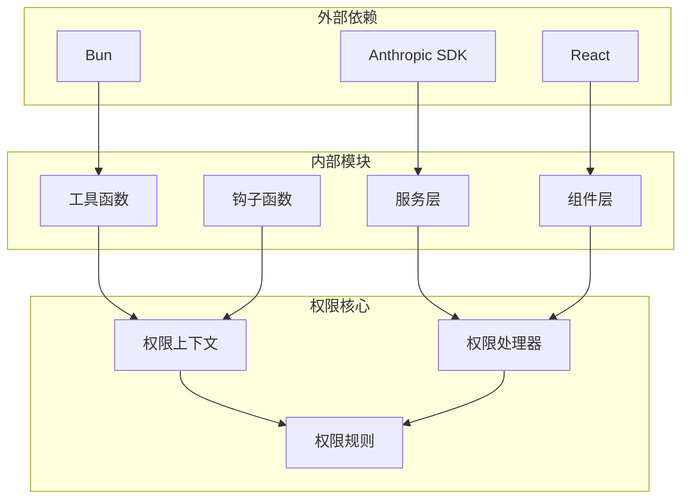
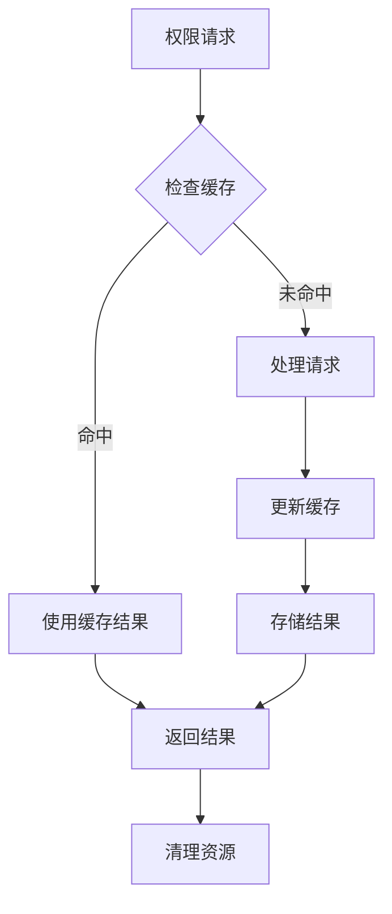

# 权限用户交互

<cite>
**本文档引用的文件**
- [PermissionContext.ts](file://src/hooks/toolPermission/PermissionContext.ts)
- [interactiveHandler.ts](file://src/hooks/toolPermission/handlers/interactiveHandler.ts)
- [permissions.ts](file://src/utils/permissions/permissions.ts)
- [PermissionRequest.tsx](file://src/components/permissions/PermissionRequest.tsx)
- [PermissionDialog.tsx](file://src/components/permissions/PermissionDialog.tsx)
- [PermissionRuleList.tsx](file://src/components/permissions/rules/PermissionRuleList.tsx)
- [RecentDenialsTab.tsx](file://src/components/permissions/rules/RecentDenialsTab.tsx)
- [autoModeDenials.ts](file://src/utils/autoModeDenials.ts)
- [permissionLogging.ts](file://src/hooks/toolPermission/permissionLogging.ts)
- [denialTracking.ts](file://src/utils/permissions/denialTracking.ts)
- [permissions.ts（类型定义）](file://src/types/permissions.ts)
- [useCanUseTool.tsx](file://src/hooks/useCanUseTool.tsx)
- [print.ts](file://src/cli/print.ts)
</cite>

## 目录
1. [简介](#简介)
2. [项目结构](#项目结构)
3. [核心组件](#核心组件)
4. [架构概览](#架构概览)
5. [详细组件分析](#详细组件分析)
6. [依赖关系分析](#依赖关系分析)
7. [性能考虑](#性能考虑)
8. [故障排除指南](#故障排除指南)
9. [结论](#结论)

## 简介

Claude Code 的权限用户交互系统是一个复杂的多层架构，旨在为用户提供安全、透明且可定制的权限管理体验。该系统通过智能的权限决策机制、丰富的用户界面组件和强大的后台管理系统，确保用户能够对 AI 工具的使用进行精确控制。

系统的核心特点包括：
- **多层权限控制**：从基础的允许/拒绝规则到高级的自动模式分类器
- **丰富的用户界面**：提供直观的权限请求对话框和规则管理界面
- **智能决策支持**：集成分类器和钩子机制，支持自动化权限决策
- **完整的审计跟踪**：记录所有权限决策和用户交互历史
- **灵活的配置选项**：支持多种权限模式和自定义规则

## 项目结构

权限用户交互系统的文件组织遵循清晰的模块化原则：

**图表来源**
- [PermissionContext.ts:1-390](file://src/hooks/toolPermission/PermissionContext.ts#L1-L390)
- [interactiveHandler.ts:1-538](file://src/hooks/toolPermission/handlers/interactiveHandler.ts#L1-L538)
- [permissions.ts:1-800](file://src/utils/permissions/permissions.ts#L1-L800)

**章节来源**
- [PermissionContext.ts:1-390](file://src/hooks/toolPermission/PermissionContext.ts#L1-L390)
- [interactiveHandler.ts:1-538](file://src/hooks/toolPermission/handlers/interactiveHandler.ts#L1-L538)
- [permissions.ts:1-800](file://src/utils/permissions/permissions.ts#L1-L800)

## 核心组件

### 权限上下文系统

权限上下文是整个权限系统的核心，负责管理工具权限检查的状态和行为。

**图表来源**
- [PermissionContext.ts:96-348](file://src/hooks/toolPermission/PermissionContext.ts#L96-L348)
- [permissions.ts（类型定义）:414-442](file://src/types/permissions.ts#L414-L442)

### 权限决策引擎

权限决策引擎负责处理各种权限场景，包括用户交互、自动决策和规则匹配。

**图表来源**
- [permissions.ts:473-800](file://src/utils/permissions/permissions.ts#L473-L800)
- [interactiveHandler.ts:57-538](file://src/hooks/toolPermission/handlers/interactiveHandler.ts#L57-L538)

**章节来源**
- [PermissionContext.ts:96-348](file://src/hooks/toolPermission/PermissionContext.ts#L96-L348)
- [permissions.ts:473-800](file://src/utils/permissions/permissions.ts#L473-L800)
- [permissions.ts（类型定义）:1-443](file://src/types/permissions.ts#L1-L443)

## 架构概览

权限用户交互系统采用分层架构设计，确保各组件之间的松耦合和高内聚。

**图表来源**
- [interactiveHandler.ts:57-538](file://src/hooks/toolPermission/handlers/interactiveHandler.ts#L57-L538)
- [permissionLogging.ts:1-240](file://src/hooks/toolPermission/permissionLogging.ts#L1-L240)
- [denialTracking.ts:1-45](file://src/utils/permissions/denialTracking.ts#L1-L45)

## 详细组件分析

### 权限请求对话框

权限请求对话框是用户与系统交互的主要界面，提供了直观的权限管理体验。

**图表来源**
- [PermissionRequest.tsx:146-216](file://src/components/permissions/PermissionRequest.tsx#L146-L216)
- [interactiveHandler.ts:57-538](file://src/hooks/toolPermission/handlers/interactiveHandler.ts#L57-L538)

### 权限规则管理系统

权限规则管理系统提供了灵活的规则配置和管理功能。

**图表来源**
- [PermissionRuleList.tsx:473-800](file://src/components/permissions/rules/PermissionRuleList.tsx#L473-L800)
- [RecentDenialsTab.tsx:19-208](file://src/components/permissions/rules/RecentDenialsTab.tsx#L19-L208)
- [autoModeDenials.ts:8-28](file://src/utils/autoModeDenials.ts#L8-L28)

### 权限通知系统

权限通知系统负责向用户传达权限相关的重要信息和状态变化。

**图表来源**
- [permissionLogging.ts:181-235](file://src/hooks/toolPermission/permissionLogging.ts#L181-L235)

**章节来源**
- [PermissionRequest.tsx:1-218](file://src/components/permissions/PermissionRequest.tsx#L1-L218)
- [PermissionDialog.tsx:1-73](file://src/components/permissions/PermissionDialog.tsx#L1-L73)
- [PermissionRuleList.tsx:1-800](file://src/components/permissions/rules/PermissionRuleList.tsx#L1-L800)
- [RecentDenialsTab.tsx:1-208](file://src/components/permissions/rules/RecentDenialsTab.tsx#L1-L208)
- [permissionLogging.ts:1-240](file://src/hooks/toolPermission/permissionLogging.ts#L1-L240)

## 依赖关系分析

权限用户交互系统具有清晰的依赖层次结构，确保模块间的职责分离和可维护性。

**图表来源**
- [PermissionContext.ts:1-10](file://src/hooks/toolPermission/PermissionContext.ts#L1-L10)
- [permissions.ts:1-51](file://src/utils/permissions/permissions.ts#L1-L51)

**章节来源**
- [PermissionContext.ts:1-10](file://src/hooks/toolPermission/PermissionContext.ts#L1-L10)
- [permissions.ts:1-51](file://src/utils/permissions/permissions.ts#L1-L51)

## 性能考虑

权限系统在设计时充分考虑了性能优化，特别是在处理大量权限请求和实时决策方面。

### 异步处理优化

系统采用异步处理机制来避免阻塞用户界面：

- **并发权限检查**：多个权限请求可以并行处理
- **延迟初始化**：权限对话框仅在需要时创建
- **缓存策略**：常用权限规则和决策结果会被缓存

### 内存管理

### 性能监控

系统内置了性能监控机制，用于跟踪权限处理的性能指标：

- **决策时间统计**：记录权限决策的处理时间
- **内存使用监控**：跟踪权限相关对象的内存占用
- **错误率统计**：监控权限处理过程中的错误情况

## 故障排除指南

### 常见问题诊断

#### 权限对话框不显示

**可能原因**：
- 权限检查被提前中断
- 用户界面状态异常
- 权限上下文配置错误

**解决步骤**：
1. 检查权限上下文的创建是否成功
2. 验证用户界面组件的渲染状态
3. 确认权限钩子没有阻止对话框显示

#### 自动分类器失败

**可能原因**：
- API 请求超时或网络连接问题
- 分类器模型不可用
- 输入参数格式不正确

**解决步骤**：
1. 检查网络连接状态
2. 验证分类器 API 的可用性
3. 确认输入数据的格式和内容

#### 权限规则不生效

**可能原因**：
- 规则语法错误
- 规则优先级冲突
- 规则存储位置不正确

**解决步骤**：
1. 验证规则的语法格式
2. 检查规则的优先级设置
3. 确认规则存储在正确的配置位置

**章节来源**
- [interactiveHandler.ts:53-538](file://src/hooks/toolPermission/handlers/interactiveHandler.ts#L53-L538)
- [permissionLogging.ts:178-235](file://src/hooks/toolPermission/permissionLogging.ts#L178-L235)

## 结论

Claude Code 的权限用户交互系统通过精心设计的架构和丰富的功能特性，为用户提供了强大而灵活的权限管理体验。系统的核心优势包括：

### 技术优势

- **模块化设计**：清晰的组件分离和职责划分
- **异步处理**：高效的并发权限处理能力
- **智能决策**：结合人工判断和机器学习的混合决策机制
- **完整审计**：全面的权限决策记录和追踪功能

### 用户体验优势

- **直观界面**：简洁明了的权限请求对话框
- **灵活配置**：支持多种权限模式和自定义规则
- **实时反馈**：及时的权限状态更新和通知
- **可追溯性**：完整的权限历史记录和审计日志

### 扩展性考虑

系统的设计充分考虑了未来的扩展需求，包括：
- 支持新的权限工具和场景
- 集成更多的自动化决策机制
- 提供更丰富的用户界面定制选项
- 增强与其他系统的集成能力

通过这些设计和技术实现，Claude Code 的权限用户交互系统为 AI 工具的安全使用提供了坚实的基础，同时保持了良好的用户体验和高度的可维护性。