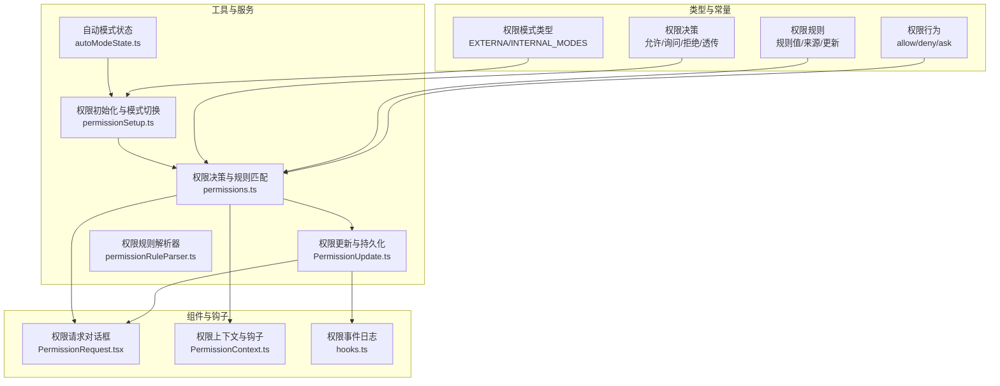
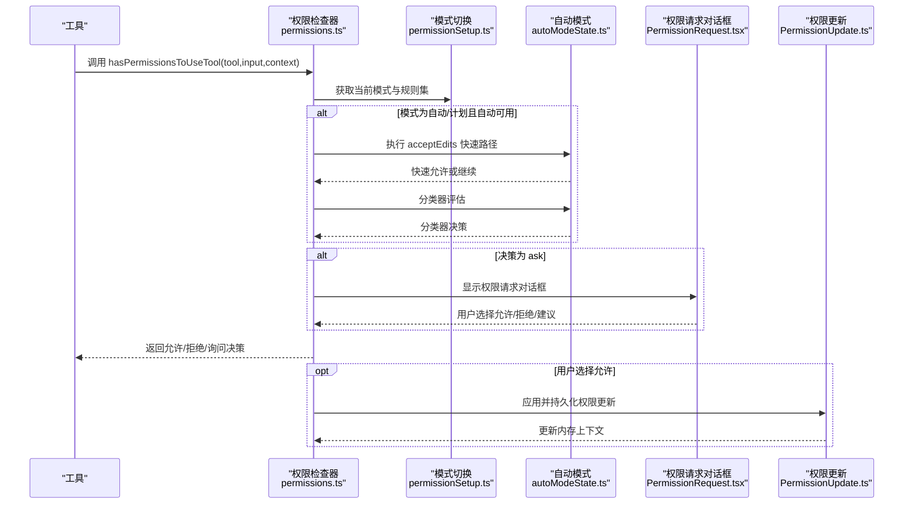
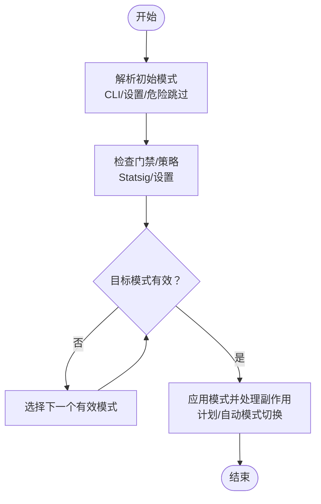
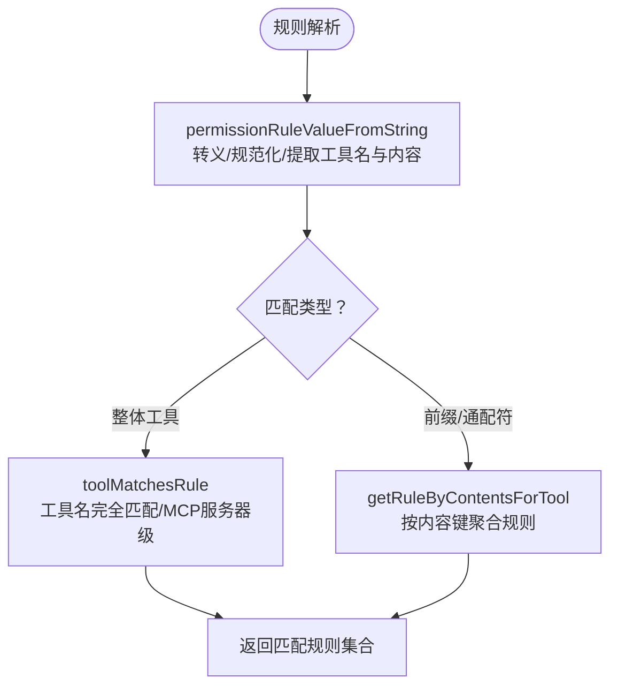
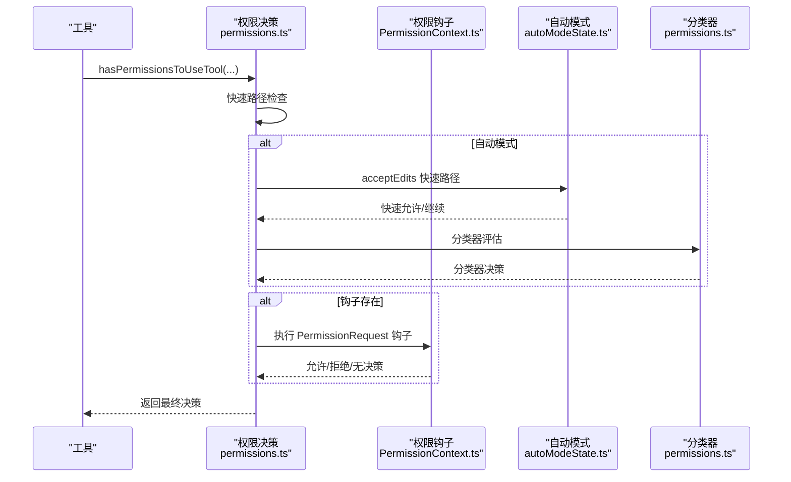
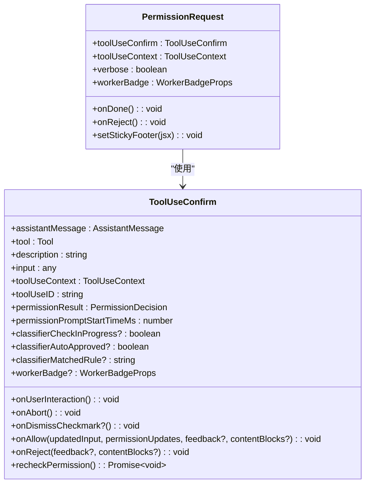
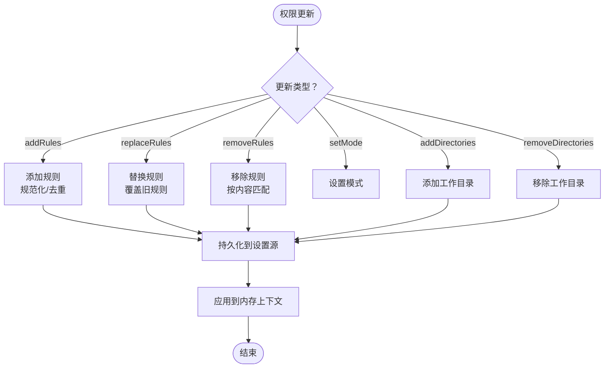
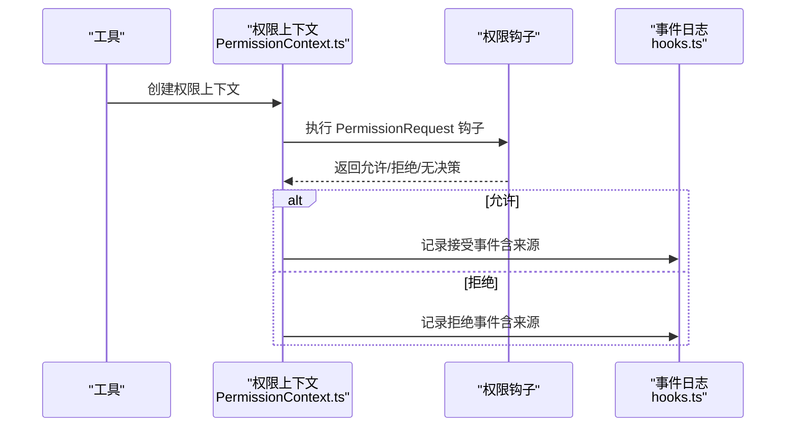
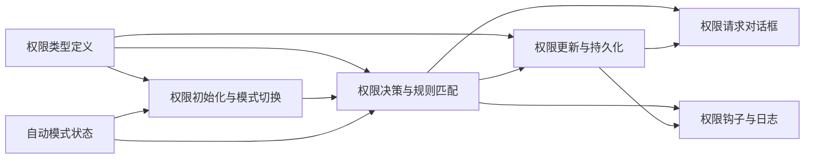

# 权限系统

<cite>
**本文档引用的文件**
- [权限类型定义](file://src/types/permissions.ts)
- [权限模式配置](file://src/utils/permissions/PermissionMode.ts)
- [权限初始化与模式切换](file://src/utils/permissions/permissionSetup.ts)
- [权限决策与规则匹配](file://src/utils/permissions/permissions.ts)
- [权限更新与持久化](file://src/utils/permissions/PermissionUpdate.ts)
- [权限规则解析器](file://src/utils/permissions/permissionRuleParser.ts)
- [权限请求对话框组件](file://src/components/permissions/PermissionRequest.tsx)
- [权限钩子与日志](file://src/hooks/toolPermission/PermissionContext.ts)
- [权限事件日志](file://src/components/permissions/hooks.ts)
- [自动模式状态管理](file://src/utils/permissions/autoModeState.ts)
</cite>

## 目录
1. [简介](#简介)
2. [项目结构](#项目结构)
3. [核心组件](#核心组件)
4. [架构总览](#架构总览)
5. [详细组件分析](#详细组件分析)
6. [依赖关系分析](#依赖关系分析)
7. [性能考虑](#性能考虑)
8. [故障排除指南](#故障排除指南)
9. [结论](#结论)

## 简介
本文件面向 Claude Code 的权限系统，提供从设计理念到实现细节的完整技术文档。内容涵盖权限模型、决策流程、用户交互、工具调用权限检查、规则配置与匹配算法、多种权限模式（默认、计划、绕过权限、自动等）的行为与适用场景、权限回调机制、权限历史记录与审计、最佳实践以及故障排除与安全建议。

## 项目结构
权限系统由以下层次构成：
- 类型与常量层：定义权限模式、行为、规则、决策结果等纯类型定义，避免循环依赖。
- 工具与服务层：负责权限决策、规则匹配、模式切换、自动模式、规则解析与持久化。
- 组件与钩子层：负责用户交互、权限请求对话框、权限钩子执行与日志记录。
- 配置与设置层：通过设置源（用户、项目、本地、会话、命令行）持久化权限配置。

**图表来源**
- [权限类型定义:16-38](file://src/types/permissions.ts#L16-L38)
- [权限初始化与模式切换:689-800](file://src/utils/permissions/permissionSetup.ts#L689-L800)
- [权限决策与规则匹配:473-800](file://src/utils/permissions/permissions.ts#L473-L800)
- [权限更新与持久化:55-206](file://src/utils/permissions/PermissionUpdate.ts#L55-L206)
- [权限规则解析器:93-152](file://src/utils/permissions/permissionRuleParser.ts#L93-L152)
- [权限请求对话框组件:47-82](file://src/components/permissions/PermissionRequest.tsx#L47-L82)
- [权限钩子与日志:96-348](file://src/hooks/toolPermission/PermissionContext.ts#L96-L348)
- [权限事件日志:31-95](file://src/components/permissions/hooks.ts#L31-L95)
- [自动模式状态管理:11-33](file://src/utils/permissions/autoModeState.ts#L11-L33)

**章节来源**
- [权限类型定义:16-38](file://src/types/permissions.ts#L16-L38)
- [权限初始化与模式切换:689-800](file://src/utils/permissions/permissionSetup.ts#L689-L800)
- [权限决策与规则匹配:473-800](file://src/utils/permissions/permissions.ts#L473-L800)
- [权限更新与持久化:55-206](file://src/utils/permissions/PermissionUpdate.ts#L55-L206)
- [权限规则解析器:93-152](file://src/utils/permissions/permissionRuleParser.ts#L93-L152)
- [权限请求对话框组件:47-82](file://src/components/permissions/PermissionRequest.tsx#L47-L82)
- [权限钩子与日志:96-348](file://src/hooks/toolPermission/PermissionContext.ts#L96-L348)
- [权限事件日志:31-95](file://src/components/permissions/hooks.ts#L31-L95)
- [自动模式状态管理:11-33](file://src/utils/permissions/autoModeState.ts#L11-L33)

## 核心组件
- 权限模式与行为
  - 外部模式：acceptEdits、bypassPermissions、default、dontAsk、plan
  - 内部模式：在外部模式基础上，按特性开关增加 auto、bubble
  - 行为：allow（允许）、deny（拒绝）、ask（询问）
- 权限规则
  - 规则值：工具名 + 可选内容（如 Bash(python -c "…")）
  - 规则来源：用户设置、项目设置、本地设置、会话、命令行参数、策略设置、标志位设置、命令
  - 规则行为：allow/deny/ask
- 权限决策
  - 允许：直接放行或带入参修改
  - 询问：弹出权限请求对话框，支持规则建议、元数据、内容块
  - 拒绝：给出原因与决策理由
  - 透传：用于某些场景的旁路处理
- 权限更新
  - 支持添加/替换/移除规则、设置模式、增删工作目录
  - 支持持久化到可编辑设置源（用户/项目/本地）

**章节来源**
- [权限类型定义:16-38](file://src/types/permissions.ts#L16-L38)
- [权限类型定义:44-79](file://src/types/permissions.ts#L44-L79)
- [权限类型定义:85-132](file://src/types/permissions.ts#L85-L132)
- [权限类型定义:152-266](file://src/types/permissions.ts#L152-L266)
- [权限类型定义:419-441](file://src/types/permissions.ts#L419-L441)
- [权限更新与持久化:55-206](file://src/utils/permissions/PermissionUpdate.ts#L55-L206)

## 架构总览
权限系统采用“类型驱动 + 规则匹配 + 模式控制 + 自动模式 + 用户交互”的分层架构。核心流程如下：
- 工具调用前，根据当前权限上下文与规则进行匹配，决定是否允许、询问或拒绝
- 在自动模式下，优先尝试快速路径（如 acceptEdits 快速允许），否则使用分类器评估
- 用户交互通过权限请求对话框完成，支持规则建议与反馈
- 权限更新通过统一的更新接口持久化到设置源，并即时应用到内存上下文

**图表来源**
- [权限决策与规则匹配:473-800](file://src/utils/permissions/permissions.ts#L473-L800)
- [权限初始化与模式切换:597-646](file://src/utils/permissions/permissionSetup.ts#L597-L646)
- [自动模式状态管理:11-33](file://src/utils/permissions/autoModeState.ts#L11-L33)
- [权限请求对话框组件:146-216](file://src/components/permissions/PermissionRequest.tsx#L146-L216)
- [权限更新与持久化:55-206](file://src/utils/permissions/PermissionUpdate.ts#L55-L206)

## 详细组件分析

### 权限模式与切换
- 模式定义与标题映射：default、plan、acceptEdits、bypassPermissions、dontAsk、auto（按特性开关）
- 初始模式解析：支持 CLI 参数、设置、危险跳过标志、组织策略门禁（Statsig）
- 模式切换副作用：处理计划模式进入/退出附件、自动模式激活/恢复危险规则、预模式保存等
- 远程环境限制：仅支持 acceptEdits、plan、default，其他模式会被忽略并记录事件

**图表来源**
- [权限模式配置:107-141](file://src/utils/permissions/PermissionMode.ts#L107-L141)
- [权限初始化与模式切换:689-800](file://src/utils/permissions/permissionSetup.ts#L689-L800)
- [权限初始化与模式切换:597-646](file://src/utils/permissions/permissionSetup.ts#L597-L646)

**章节来源**
- [权限模式配置:107-141](file://src/utils/permissions/PermissionMode.ts#L107-L141)
- [权限初始化与模式切换:689-800](file://src/utils/permissions/permissionSetup.ts#L689-L800)
- [权限初始化与模式切换:597-646](file://src/utils/permissions/permissionSetup.ts#L597-L646)

### 权限规则与匹配算法
- 规则解析：支持转义括号、规范化旧工具名、解析工具名与内容
- 匹配逻辑：
  - 整体工具匹配：仅当规则无内容时匹配工具整体（如 Bash）
  - MCP 工具匹配：支持服务器级规则与通配符（如 mcp__server1__*）
  - 前缀/通配符规则：如 Bash(python:*)、Bash(*) 等
- 规则来源聚合：用户设置、项目设置、本地设置、会话、命令行、命令、策略设置、标志位设置
- 危险规则检测：识别可能绕过分类器的规则（如 Bash(*)、PowerShell(*)、Agent(*) 等）

**图表来源**
- [权限规则解析器:93-152](file://src/utils/permissions/permissionRuleParser.ts#L93-L152)
- [权限决策与规则匹配:238-390](file://src/utils/permissions/permissions.ts#L238-L390)

**章节来源**
- [权限规则解析器:93-152](file://src/utils/permissions/permissionRuleParser.ts#L93-L152)
- [权限决策与规则匹配:238-390](file://src/utils/permissions/permissions.ts#L238-L390)

### 工具调用权限检查流程
- 快速路径：
  - dontAsk 模式：将 ask 转为 deny
  - acceptEdits 快速允许：对安全操作（如文件编辑）直接放行
  - 安全工具白名单：跳过分类器评估
- 自动模式：
  - 接受编辑快速路径
  - 安全工具白名单
  - 分类器评估（YOLO 分类器），记录成本与延迟指标
  - 记录连续拒绝统计，成功后清零
- 钩子与异步代理：
  - 对无法显示对话框的异步代理，先运行 PermissionRequest 钩子，再自动拒绝
- 沙箱与工作目录：
  - 沙箱覆盖与敏感路径安全检查
  - 工作目录扩展与来源追踪

**图表来源**
- [权限决策与规则匹配:473-800](file://src/utils/permissions/permissions.ts#L473-L800)
- [权限钩子与日志:216-263](file://src/hooks/toolPermission/PermissionContext.ts#L216-L263)
- [自动模式状态管理:11-33](file://src/utils/permissions/autoModeState.ts#L11-L33)

**章节来源**
- [权限决策与规则匹配:473-800](file://src/utils/permissions/permissions.ts#L473-L800)
- [权限钩子与日志:216-263](file://src/hooks/toolPermission/PermissionContext.ts#L216-L263)
- [自动模式状态管理:11-33](file://src/utils/permissions/autoModeState.ts#L11-L33)

### 权限请求对话框与用户交互
- 组件路由：根据工具类型选择对应权限请求组件（如 Bash、PowerShell、文件编辑、技能等）
- 交互能力：允许、拒绝、规则建议、内容块反馈、阻止自动关闭（用户交互中）
- 通知与提示：键盘快捷键、超时通知、粘性页脚（如退出计划模式时保持响应选项可见）
- 事件记录：展示权限请求、内部 Bash 工具调用、决策原因等事件

**图表来源**
- [权限请求对话框组件:103-127](file://src/components/permissions/PermissionRequest.tsx#L103-L127)
- [权限请求对话框组件:146-216](file://src/components/permissions/PermissionRequest.tsx#L146-L216)

**章节来源**
- [权限请求对话框组件:103-127](file://src/components/permissions/PermissionRequest.tsx#L103-L127)
- [权限请求对话框组件:146-216](file://src/components/permissions/PermissionRequest.tsx#L146-L216)

### 权限更新与持久化
- 更新类型：添加/替换/移除规则、设置模式、增删工作目录
- 应用策略：立即更新内存上下文；仅对可编辑设置源持久化到磁盘
- 规则去重与规范化：解析/序列化往返确保规则一致性
- 工作目录：以 Map 存储，按来源标记，支持绝对/相对路径转换

**图表来源**
- [权限更新与持久化:55-206](file://src/utils/permissions/PermissionUpdate.ts#L55-L206)
- [权限更新与持久化:222-353](file://src/utils/permissions/PermissionUpdate.ts#L222-L353)

**章节来源**
- [权限更新与持久化:55-206](file://src/utils/permissions/PermissionUpdate.ts#L55-L206)
- [权限更新与持久化:222-353](file://src/utils/permissions/PermissionUpdate.ts#L222-L353)

### 权限回调机制与审计
- 回调执行：PermissionRequest 钩子在工具调用前运行，可直接允许/拒绝或中断
- 决策记录：统一的日志函数记录决策来源（用户/钩子/模式/规则/分类器等）
- 事件上报：权限请求展示、内部 Bash 工具调用、自动模式决策、分类器使用情况等
- 事件详情：支持将决策原因序列化为字符串，便于审计与问题定位

**图表来源**
- [权限钩子与日志:216-263](file://src/hooks/toolPermission/PermissionContext.ts#L216-L263)
- [权限事件日志:31-95](file://src/components/permissions/hooks.ts#L31-L95)

**章节来源**
- [权限钩子与日志:216-263](file://src/hooks/toolPermission/PermissionContext.ts#L216-L263)
- [权限事件日志:31-95](file://src/components/permissions/hooks.ts#L31-L95)

## 依赖关系分析
- 类型层解耦：权限类型定义独立于实现，避免循环依赖
- 工具层依赖：权限决策依赖模式配置、规则解析、自动模式状态、沙箱与工作目录
- 组件层依赖：权限请求对话框依赖工具类型与权限上下文
- 设置层依赖：权限更新依赖设置源与持久化接口

**图表来源**
- [权限类型定义:16-38](file://src/types/permissions.ts#L16-L38)
- [权限初始化与模式切换:689-800](file://src/utils/permissions/permissionSetup.ts#L689-L800)
- [权限决策与规则匹配:473-800](file://src/utils/permissions/permissions.ts#L473-L800)
- [权限更新与持久化:55-206](file://src/utils/permissions/PermissionUpdate.ts#L55-L206)
- [权限请求对话框组件:146-216](file://src/components/permissions/PermissionRequest.tsx#L146-L216)
- [权限钩子与日志:96-348](file://src/hooks/toolPermission/PermissionContext.ts#L96-L348)
- [自动模式状态管理:11-33](file://src/utils/permissions/autoModeState.ts#L11-L33)

**章节来源**
- [权限类型定义:16-38](file://src/types/permissions.ts#L16-L38)
- [权限初始化与模式切换:689-800](file://src/utils/permissions/permissionSetup.ts#L689-L800)
- [权限决策与规则匹配:473-800](file://src/utils/permissions/permissions.ts#L473-L800)
- [权限更新与持久化:55-206](file://src/utils/permissions/PermissionUpdate.ts#L55-L206)
- [权限请求对话框组件:146-216](file://src/components/permissions/PermissionRequest.tsx#L146-L216)
- [权限钩子与日志:96-348](file://src/hooks/toolPermission/PermissionContext.ts#L96-L348)
- [自动模式状态管理:11-33](file://src/utils/permissions/autoModeState.ts#L11-L33)

## 性能考虑
- 快速路径优化：acceptEdits 快速允许与安全工具白名单减少分类器调用
- 分类器缓存与统计：记录输入/输出令牌、缓存读写、延迟与成本，便于分析开销占比
- 拒绝统计：连续拒绝计数与成功清零，避免频繁分类器调用
- 解析与匹配：规则解析与匹配采用规范化与映射，降低重复计算

[本节为通用指导，无需特定文件引用]

## 故障排除指南
- 无法进入自动模式
  - 检查门禁状态与缓存状态，确认自动模式是否被禁用
  - 查看模式切换日志与通知
- PowerShell 在自动模式下被阻断
  - 某些构建版本要求显式交互；检查构建特性开关
- 权限请求未出现
  - 异步代理场景：先运行钩子，若无决策则自动拒绝
  - 检查 shouldAvoidPermissionPrompts 标记
- 规则不生效
  - 检查规则内容是否正确转义括号
  - 确认规则来源与持久化是否成功
- 审计与诊断
  - 查看权限请求展示、内部 Bash 工具调用、自动模式决策等事件
  - 使用决策原因字符串定位具体规则或模式

**章节来源**
- [权限初始化与模式切换:689-800](file://src/utils/permissions/permissionSetup.ts#L689-L800)
- [权限决策与规则匹配:473-800](file://src/utils/permissions/permissions.ts#L473-L800)
- [权限钩子与日志:31-95](file://src/components/permissions/hooks.ts#L31-L95)

## 结论
Claude Code 的权限系统通过清晰的类型定义、严格的规则匹配、灵活的模式控制与自动模式、完善的用户交互与审计，实现了在安全性与可用性之间的平衡。遵循本文档的最佳实践与故障排除指南，可在不同环境中稳定部署并持续优化权限策略。