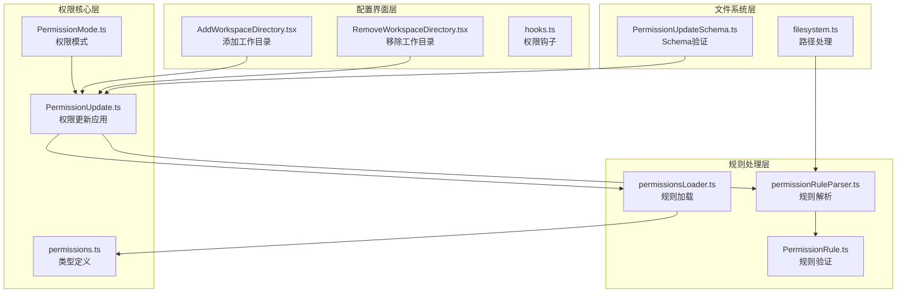
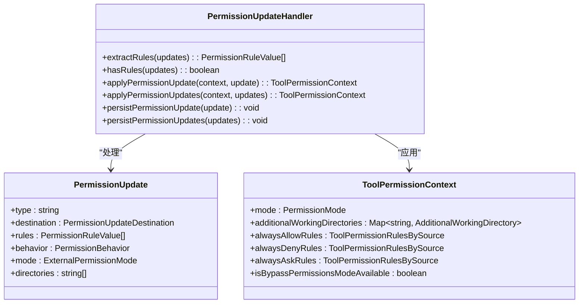
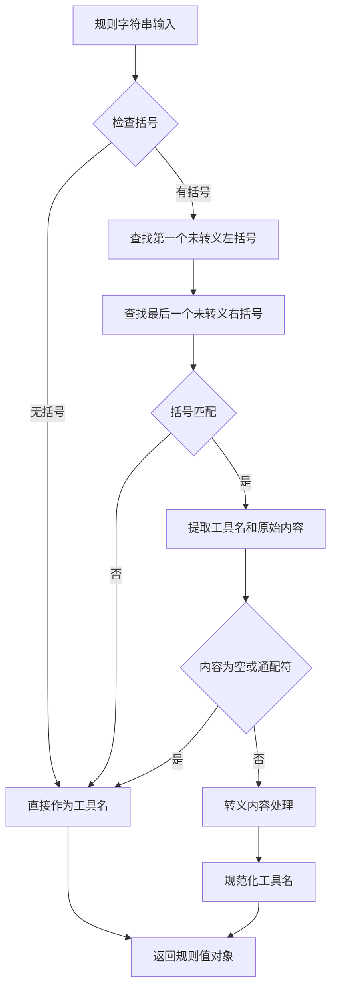
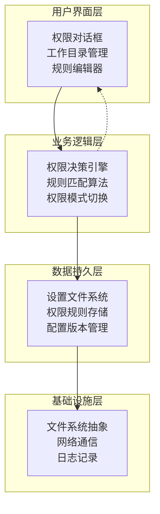
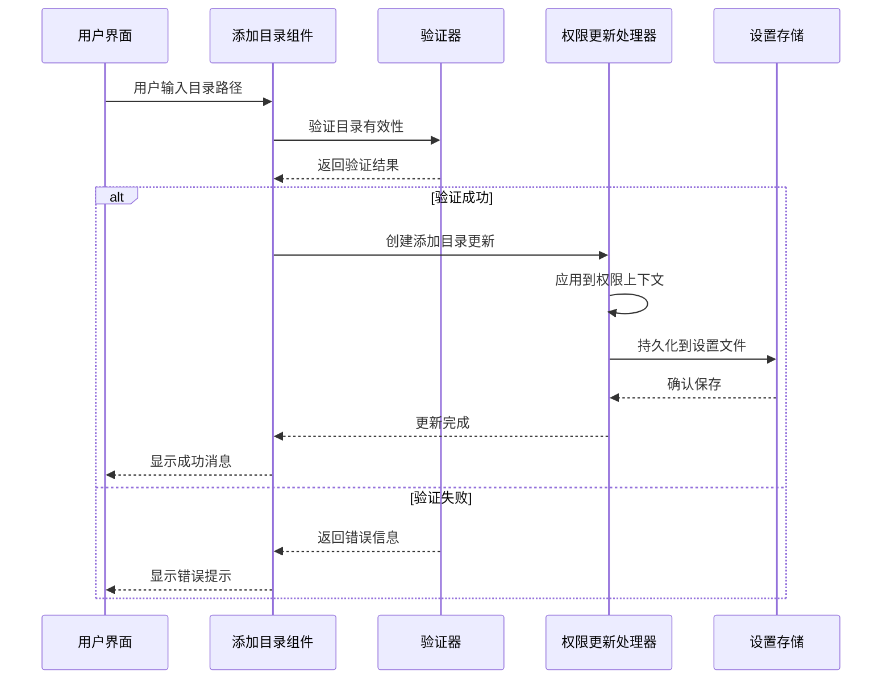
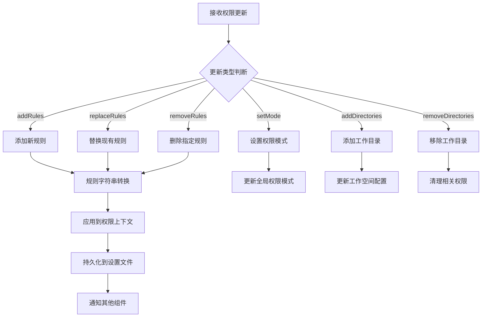
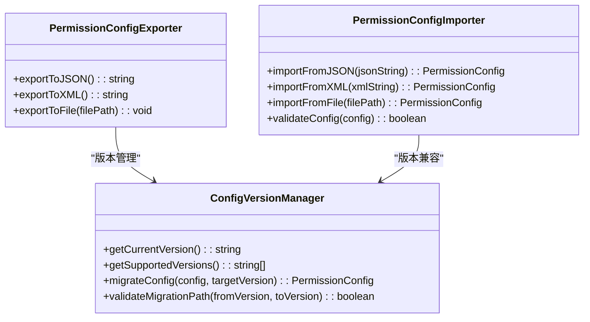
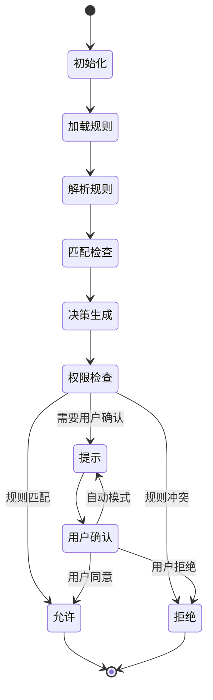
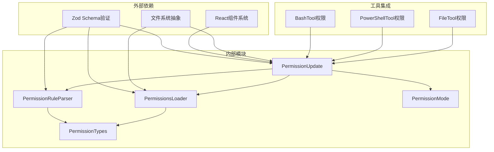

# 权限配置管理

<cite>
**本文档引用的文件**
- [PermissionUpdate.ts](file://src/utils/permissions/PermissionUpdate.ts)
- [permissions.ts](file://src/types/permissions.ts)
- [permissionRuleParser.ts](file://src/utils/permissions/permissionRuleParser.ts)
- [permissionsLoader.ts](file://src/utils/permissions/permissionsLoader.ts)
- [PermissionMode.ts](file://src/utils/permissions/PermissionMode.ts)
- [PermissionUpdateSchema.ts](file://src/utils/permissions/PermissionUpdateSchema.ts)
- [PermissionRule.ts](file://src/utils/permissions/PermissionRule.ts)
- [AddWorkspaceDirectory.tsx](file://src/components/permissions/rules/AddWorkspaceDirectory.tsx)
- [RemoveWorkspaceDirectory.tsx](file://src/components/permissions/rules/RemoveWorkspaceDirectory.tsx)
- [hooks.ts](file://src/components/permissions/hooks.ts)
- [filesystem.ts](file://src/utils/permissions/filesystem.ts)
</cite>

## 目录
1. [简介](#简介)
2. [项目结构](#项目结构)
3. [核心组件](#核心组件)
4. [架构概览](#架构概览)
5. [详细组件分析](#详细组件分析)
6. [依赖关系分析](#依赖关系分析)
7. [性能考虑](#性能考虑)
8. [故障排除指南](#故障排除指南)
9. [结论](#结论)
10. [附录](#附录)

## 简介

Claude Code 的权限配置管理系统是一个复杂而精细的安全框架，旨在为 AI 驱动的代码编辑器提供细粒度的权限控制。该系统通过多层权限规则、智能决策引擎和动态更新机制，确保用户在享受 AI 辅助编程便利的同时，能够完全掌控其代码环境的安全边界。

本系统的核心特性包括：
- **多维度权限控制**：支持工具级、内容级和目录级的精细化权限管理
- **动态权限更新**：实时生效的权限规则更新机制
- **智能工作空间管理**：基于目录白名单和黑名单的权限继承规则
- **安全优先的设计**：默认拒绝策略和最小权限原则
- **可审计的日志记录**：完整的权限决策追踪和分析能力

## 项目结构

权限配置管理系统的组织结构体现了清晰的关注点分离和模块化设计：

**图表来源**
- [PermissionUpdate.ts:1-391](file://src/utils/permissions/PermissionUpdate.ts#L1-L391)
- [permissions.ts:1-443](file://src/types/permissions.ts#L1-L443)
- [permissionRuleParser.ts:1-200](file://src/utils/permissions/permissionRuleParser.ts#L1-L200)

**章节来源**
- [PermissionUpdate.ts:1-391](file://src/utils/permissions/PermissionUpdate.ts#L1-L391)
- [permissions.ts:1-443](file://src/types/permissions.ts#L1-L443)

## 核心组件

### 权限更新处理器

权限更新处理器是整个系统的核心协调器，负责将权限变更应用到当前的权限上下文中。它支持多种更新类型，包括规则添加、替换、删除、模式设置和目录管理。

**图表来源**
- [PermissionUpdate.ts:55-206](file://src/utils/permissions/PermissionUpdate.ts#L55-L206)
- [permissions.ts:413-442](file://src/types/permissions.ts#L413-L442)

### 规则解析器

规则解析器负责将人类可读的权限规则字符串转换为机器可处理的数据结构，同时支持复杂的工具名称映射和内容转义处理。

**图表来源**
- [permissionRuleParser.ts:93-152](file://src/utils/permissions/permissionRuleParser.ts#L93-L152)

**章节来源**
- [PermissionUpdate.ts:55-206](file://src/utils/permissions/PermissionUpdate.ts#L55-L206)
- [permissionRuleParser.ts:93-152](file://src/utils/permissions/permissionRuleParser.ts#L93-L152)

## 架构概览

权限配置管理系统的整体架构采用分层设计，确保了高内聚、低耦合和良好的可扩展性：

系统的关键设计原则：
- **默认拒绝**：所有未明确允许的操作都会被拒绝
- **最小权限**：只授予完成任务所需的最低权限
- **透明度**：所有权限决策都有明确的记录和解释
- **可恢复性**：支持权限规则的撤销和回滚

## 详细组件分析

### 工作空间目录管理

工作空间目录管理是权限系统的重要组成部分，提供了灵活的目录白名单和黑名单机制：

**图表来源**
- [AddWorkspaceDirectory.tsx:158-211](file://src/components/permissions/rules/AddWorkspaceDirectory.tsx#L158-L211)
- [PermissionUpdate.ts:122-137](file://src/utils/permissions/PermissionUpdate.ts#L122-L137)

#### 目录验证机制

目录验证过程包含多个层次的安全检查：

1. **路径格式验证**：确保目录路径符合操作系统规范
2. **存在性检查**：确认目录确实存在于文件系统中
3. **访问权限检查**：验证用户对目标目录具有适当的访问权限
4. **安全性评估**：检查目录是否包含敏感文件或危险内容

#### 权限继承规则

工作空间目录支持层级化的权限继承：

- **根目录规则**：影响所有子目录的默认权限
- **子目录覆盖**：特定子目录可以覆盖父级规则
- **通配符支持**：使用 `/**` 模式匹配目录树
- **绝对路径处理**：支持跨盘符的绝对路径匹配

**章节来源**
- [AddWorkspaceDirectory.tsx:158-211](file://src/components/permissions/rules/AddWorkspaceDirectory.tsx#L158-L211)
- [RemoveWorkspaceDirectory.tsx:27-43](file://src/components/permissions/rules/RemoveWorkspaceDirectory.tsx#L27-L43)

### 权限规则动态更新

权限规则的动态更新机制确保了系统能够在运行时响应权限变化：

**图表来源**
- [PermissionUpdate.ts:55-206](file://src/utils/permissions/PermissionUpdate.ts#L55-L206)

#### 实时生效策略

系统采用渐进式的权限更新策略：

1. **即时应用**：更新立即反映在当前会话中
2. **持久化保存**：重要更新会被写入配置文件
3. **缓存同步**：相关缓存数据会被刷新
4. **状态广播**：其他组件会收到权限变化通知

**章节来源**
- [PermissionUpdate.ts:55-206](file://src/utils/permissions/PermissionUpdate.ts#L55-L206)

### 权限配置导入导出

权限配置的导入导出功能提供了灵活的配置管理能力：

**图表来源**
- [permissionsLoader.ts:229-296](file://src/utils/permissions/permissionsLoader.ts#L229-L296)

#### 版本管理与迁移

配置文件的版本管理确保了向后兼容性和平滑升级：

- **版本标识**：每个配置文件包含明确的版本信息
- **自动迁移**：支持跨版本的自动配置迁移
- **回滚机制**：提供配置变更的回滚能力
- **兼容性检查**：在迁移前进行完整的兼容性验证

**章节来源**
- [permissionsLoader.ts:229-296](file://src/utils/permissions/permissionsLoader.ts#L229-L296)

### 权限决策引擎

权限决策引擎是系统的核心，负责根据当前上下文和规则集做出最终的权限决策：

**图表来源**
- [permissions.ts:1299-1319](file://src/utils/permissions/permissions.ts#L1299-L1319)

## 依赖关系分析

权限配置管理系统的依赖关系体现了清晰的分层架构：

**图表来源**
- [PermissionUpdate.ts:1-391](file://src/utils/permissions/PermissionUpdate.ts#L1-L391)
- [permissionsLoader.ts:1-298](file://src/utils/permissions/permissionsLoader.ts#L1-L298)

**章节来源**
- [PermissionUpdate.ts:1-391](file://src/utils/permissions/PermissionUpdate.ts#L1-L391)
- [permissionsLoader.ts:1-298](file://src/utils/permissions/permissionsLoader.ts#L1-L298)

## 性能考虑

权限配置管理系统在设计时充分考虑了性能优化：

### 缓存策略
- **规则缓存**：已解析的权限规则会被缓存以避免重复解析
- **路径缓存**：文件系统路径查询结果会被缓存
- **决策缓存**：最近的权限决策会被缓存以提高响应速度

### 异步处理
- **批量操作**：支持批量权限更新操作以减少系统开销
- **延迟加载**：非关键的权限规则采用延迟加载策略
- **并发控制**：权限更新操作采用队列管理避免竞态条件

### 内存管理
- **弱引用**：大型数据结构使用弱引用来避免内存泄漏
- **垃圾回收**：定期清理不再使用的权限上下文
- **增量更新**：只更新发生变化的部分而不是整个权限树

## 故障排除指南

### 常见问题诊断

#### 权限规则不生效
1. **检查规则格式**：确保规则字符串符合 `工具名(内容)` 格式
2. **验证工具名称**：确认工具名称与实际工具注册名称一致
3. **检查作用域**：确认规则的作用域与当前权限上下文匹配

#### 目录权限异常
1. **路径验证**：检查目录路径是否正确且可访问
2. **权限继承**：确认子目录权限没有覆盖父级规则
3. **通配符匹配**：验证通配符模式是否按预期工作

#### 性能问题
1. **规则数量**：检查权限规则数量是否过多
2. **缓存状态**：确认缓存机制正常工作
3. **内存使用**：监控权限上下文的内存使用情况

**章节来源**
- [hooks.ts:31-95](file://src/components/permissions/hooks.ts#L31-L95)

## 结论

Claude Code 的权限配置管理系统展现了现代软件安全架构的最佳实践。通过精心设计的多层权限控制、智能的动态更新机制和完善的审计功能，该系统为用户提供了既安全又灵活的 AI 编程体验。

系统的主要优势包括：
- **细粒度控制**：支持从工具到内容级别的精确权限管理
- **实时响应**：权限变更能够即时生效并影响后续操作
- **安全可靠**：采用默认拒绝策略和全面的审计记录
- **易于管理**：提供直观的配置界面和强大的导入导出功能

未来的发展方向可能包括：
- 更智能的权限建议系统
- 增强的权限模板和预设配置
- 更丰富的权限决策分析报告
- 改进的权限规则性能优化

## 附录

### 权限配置最佳实践

#### 安全策略制定
1. **最小权限原则**：只授予完成任务所需的最低权限
2. **分层防护**：建立多层安全防线，避免单一故障点
3. **定期审查**：定期审查和清理过期的权限规则
4. **监控告警**：建立权限使用情况的监控和告警机制

#### 规则优化建议
1. **规则分类**：将权限规则按类型和用途进行分类管理
2. **命名规范**：建立统一的规则命名规范和约定
3. **版本控制**：对重要的权限规则变更进行版本控制
4. **测试验证**：在生产环境部署前进行充分的测试验证

#### 性能调优策略
1. **规则合并**：合并相似的权限规则以减少匹配开销
2. **索引优化**：为常用的权限查询建立索引
3. **缓存策略**：合理配置缓存大小和过期时间
4. **异步处理**：将耗时的权限检查操作异步化