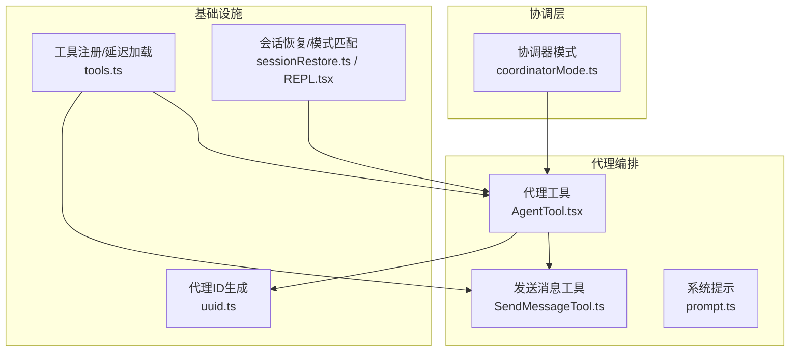
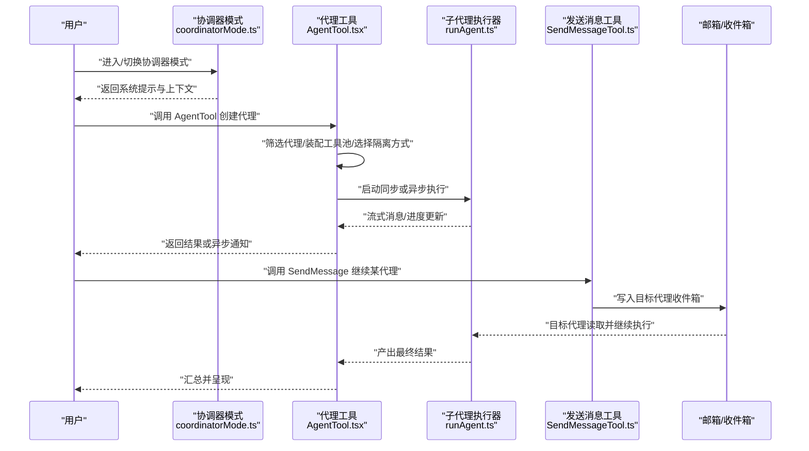
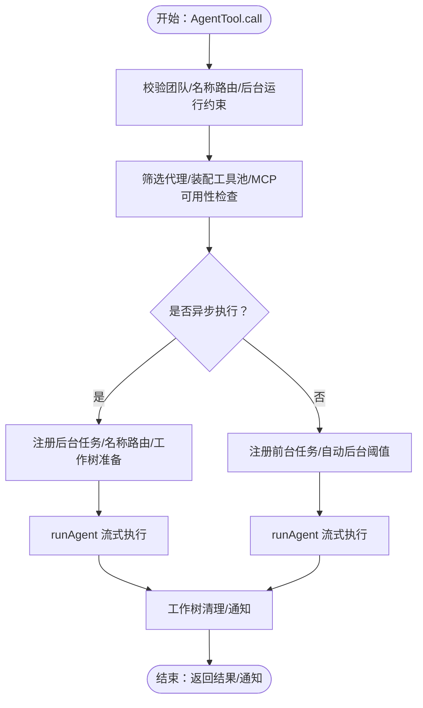
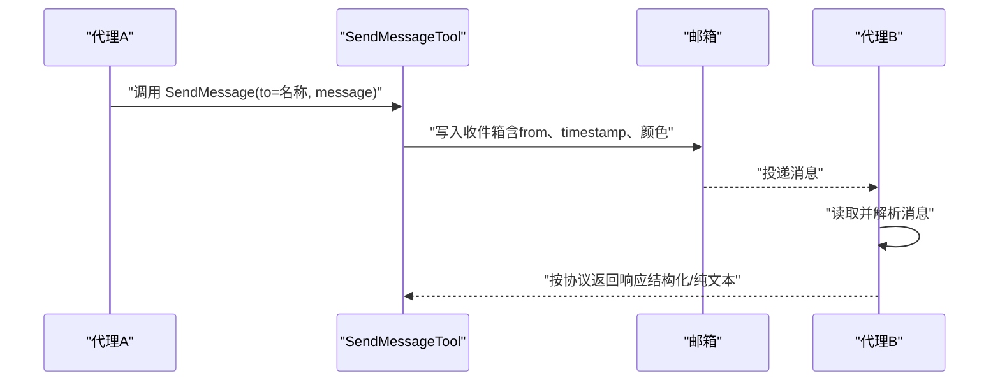
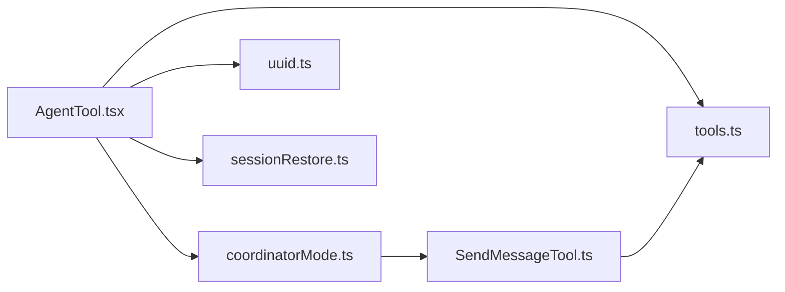

# 代理协调

<cite>
**本文引用的文件**
- [coordinatorMode.ts](file://src/coordinator/coordinatorMode.ts)
- [AgentTool.tsx](file://src/tools/AgentTool/AgentTool.tsx)
- [uuid.ts](file://src/utils/uuid.ts)
- [sessionRestore.ts](file://src/utils/sessionRestore.ts)
- [REPL.tsx](file://src/screens/REPL.tsx)
- [SendMessageTool.ts](file://src/tools/SendMessageTool/SendMessageTool.ts)
- [prompt.ts](file://src/tools/SendMessageTool/prompt.ts)
- [tools.ts](file://src/tools.ts)
</cite>

## 目录
1. [简介](#简介)
2. [项目结构](#项目结构)
3. [核心组件](#核心组件)
4. [架构总览](#架构总览)
5. [详细组件分析](#详细组件分析)
6. [依赖关系分析](#依赖关系分析)
7. [性能考量](#性能考量)
8. [故障排查指南](#故障排查指南)
9. [结论](#结论)
10. [附录](#附录)

## 简介
本文件面向 Claude Code 的“代理协调系统”，系统性阐述多代理协作的架构设计、编排机制与运行时行为。重点包括：
- 协调器（Coordinator）角色与系统提示词设计
- 代理的创建、生命周期管理、异步执行与后台化
- 代理间通信协议（消息传递、名称路由、邮箱机制）
- 资源隔离（工作树隔离）、权限与工具池装配
- 模式切换（普通/协调器模式）与会话恢复一致性
- 典型流程的序列图与算法流程图，帮助初学者理解，同时提供高级扩展细节

## 项目结构
与代理协调直接相关的关键模块：
- 协调器模式与系统提示：src/coordinator/coordinatorMode.ts
- 代理创建与编排入口：src/tools/AgentTool/AgentTool.tsx
- 代理标识与工作树隔离：src/utils/uuid.ts、src/utils/worktree.ts
- 会话恢复与模式匹配：src/utils/sessionRestore.ts、src/screens/REPL.tsx
- 代理间通信与消息投递：src/tools/SendMessageTool/SendMessageTool.ts、src/tools/SendMessageTool/prompt.ts
- 工具注册与延迟加载：src/tools.ts

图表来源
- [coordinatorMode.ts:111-371](file://src/coordinator/coordinatorMode.ts#L111-L371)
- [AgentTool.tsx:196-1387](file://src/tools/AgentTool/AgentTool.tsx#L196-L1387)
- [uuid.ts:1-27](file://src/utils/uuid.ts#L1-L27)
- [sessionRestore.ts:230-271](file://src/utils/sessionRestore.ts#L230-L271)
- [REPL.tsx:1742-1769](file://src/screens/REPL.tsx#L1742-L1769)
- [SendMessageTool.ts:268-315](file://src/tools/SendMessageTool/SendMessageTool.ts#L268-L315)
- [prompt.ts:36-49](file://src/tools/SendMessageTool/prompt.ts#L36-L49)
- [tools.ts:54-74](file://src/tools.ts#L54-L74)

章节来源
- [coordinatorMode.ts:1-371](file://src/coordinator/coordinatorMode.ts#L1-L371)
- [AgentTool.tsx:1-1399](file://src/tools/AgentTool/AgentTool.tsx#L1-L1399)
- [uuid.ts:1-27](file://src/utils/uuid.ts#L1-L27)
- [sessionRestore.ts:230-271](file://src/utils/sessionRestore.ts#L230-L271)
- [REPL.tsx:1742-1769](file://src/screens/REPL.tsx#L1742-L1769)
- [SendMessageTool.ts:268-315](file://src/tools/SendMessageTool/SendMessageTool.ts#L268-L315)
- [prompt.ts:36-49](file://src/tools/SendMessageTool/prompt.ts#L36-L49)
- [tools.ts:54-74](file://src/tools.ts#L54-L74)

## 核心组件
- 协调器模式与系统提示
  - 提供是否启用协调器模式的判定、用户上下文注入（工具集、MCP 服务器、草稿目录等），以及完整的系统提示词模板，定义协调器职责、工具使用规范、并发策略与失败处理。
- 代理工具（AgentTool）
  - 统一的代理创建入口，负责：
    - 代理类型选择与过滤（MCP 权限、权限规则）
    - 工具池装配（按代理权限模式独立构建）
    - 异步/同步执行分支、前台/后台切换、自动后台化
    - 工作树隔离、路径翻译提示、清理策略
    - 名称到代理ID的路由注册，支持后续 SendMessage 继续
- 代理ID与工作树
  - 代理ID生成策略（带前缀与标签），用于任务输出文件定位与跨进程稳定标识；工作树隔离确保文件系统操作互不干扰。
- 发送消息工具（SendMessage）
  - 实现代理间通信协议：通过邮箱写入目标代理的收件箱，支持结构化请求/响应（如关机请求、计划审批），并提供纯文本消息转发能力。
- 会话恢复与模式匹配
  - 在会话恢复时匹配/切换协调器/普通模式，刷新代理定义，保证 UI 与行为一致。

章节来源
- [coordinatorMode.ts:36-109](file://src/coordinator/coordinatorMode.ts#L36-L109)
- [AgentTool.tsx:239-1262](file://src/tools/AgentTool/AgentTool.tsx#L239-L1262)
- [uuid.ts:19-27](file://src/utils/uuid.ts#L19-L27)
- [SendMessageTool.ts:268-315](file://src/tools/SendMessageTool/SendMessageTool.ts#L268-L315)
- [prompt.ts:36-49](file://src/tools/SendMessageTool/prompt.ts#L36-L49)
- [sessionRestore.ts:251-271](file://src/utils/sessionRestore.ts#L251-L271)
- [REPL.tsx:1742-1769](file://src/screens/REPL.tsx#L1742-L1769)

## 架构总览
下图展示了从用户触发到代理执行、再到结果回传的端到端流程，突出协调器、代理工具、消息投递与会话恢复之间的交互。

图表来源
- [coordinatorMode.ts:111-371](file://src/coordinator/coordinatorMode.ts#L111-L371)
- [AgentTool.tsx:239-1262](file://src/tools/AgentTool/AgentTool.tsx#L239-L1262)
- [SendMessageTool.ts:268-315](file://src/tools/SendMessageTool/SendMessageTool.ts#L268-L315)

## 详细组件分析

### 协调器模式与系统提示
- 角色与职责
  - 协调器负责：引导用户目标、分配研究/实现/验证任务、合成信息、与代理沟通、并发调度、失败纠正与终止。
- 工具与能力
  - 支持通过 AgentTool 启动子代理、通过 SendMessage 继续已有代理、通过 TaskStopTool 停止代理。
  - 可访问标准工具、MCP 工具与项目技能。
- 任务工作流与并发策略
  - 研究（并行）、合成（串行）、实现（按文件区域串行/并行）、验证（独立验证）。
  - 失败处理：继续同一代理以携带错误上下文，或更换方案。
- 代理提示词编写原则
  - 必须自包含、明确文件/行号/变更点、给出“完成”定义、精确 Git 操作指令等。

章节来源
- [coordinatorMode.ts:111-371](file://src/coordinator/coordinatorMode.ts#L111-L371)

### 代理工具（AgentTool）：创建、编排与监控
- 输入参数与约束
  - 支持描述、提示词、子代理类型、模型覆盖、后台运行、团队名/名称路由、隔离模式（工作树/远程）、工作目录覆盖。
  - 对团队/名称路由与后台运行存在互斥与前置条件检查。
- 代理筛选与工具装配
  - 基于 MCP 连接状态与认证结果筛选代理；按代理权限模式独立装配工具池，避免父级限制影响子代理。
- 执行分支与生命周期
  - 同步：阻塞主循环，支持前台转后台自动机制；完成后发出 task_notification。
  - 异步：注册后台任务，支持名称路由；可选工作树清理；完成后异步通知。
- 隔离与路径翻译
  - 工作树隔离：在独立 Git 工作副本中执行，结束后根据变更决定保留/删除；fork 子代额外注入路径翻译提示。
- 输出与 UI
  - 返回“已完成/异步已启动”等结构化结果，包含 agentId、usage、output_file 等元数据，便于 UI 展示与后续继续。

图表来源
- [AgentTool.tsx:239-1262](file://src/tools/AgentTool/AgentTool.tsx#L239-L1262)

章节来源
- [AgentTool.tsx:239-1262](file://src/tools/AgentTool/AgentTool.tsx#L239-L1262)

### 代理ID生成与工作树隔离
- 代理ID
  - 采用带前缀的十六进制字符串，支持标签，便于与任务输出文件关联与跨进程识别。
- 工作树隔离
  - 为每个代理创建独立 Git 工作副本，必要时进行变更检测与清理，避免文件系统污染。

章节来源
- [uuid.ts:19-27](file://src/utils/uuid.ts#L19-L27)

### 代理间通信协议（SendMessage）
- 协议要点
  - 仅通过工具调用传递消息；代理间不互相可见对话历史。
  - 通过邮箱写入目标代理收件箱，支持纯文本消息与结构化请求/响应（如关机请求、计划审批）。
- 请求/响应模式
  - 发送方构造请求对象，写入收件箱；接收方解析后按约定返回响应，双方通过 request_id 关联。
- 名称路由
  - 支持通过名称而非 UUID 路由消息；AgentTool 在异步场景下注册名称→代理ID映射。

图表来源
- [SendMessageTool.ts:268-315](file://src/tools/SendMessageTool/SendMessageTool.ts#L268-L315)
- [prompt.ts:36-49](file://src/tools/SendMessageTool/prompt.ts#L36-L49)

章节来源
- [SendMessageTool.ts:268-315](file://src/tools/SendMessageTool/SendMessageTool.ts#L268-L315)
- [prompt.ts:36-49](file://src/tools/SendMessageTool/prompt.ts#L36-L49)

### 会话恢复与模式匹配
- 模式切换
  - 在恢复旧会话时，若当前模式与存储模式不一致，则动态切换环境变量，使 isCoordinatorMode 返回正确值。
- 代理定义刷新
  - 切换后重新派生代理定义，合并 CLI 提供的代理，保持 UI 与行为一致。
- UI 提示
  - 若发生模式切换，向用户显示提示信息。

章节来源
- [sessionRestore.ts:251-271](file://src/utils/sessionRestore.ts#L251-L271)
- [REPL.tsx:1742-1769](file://src/screens/REPL.tsx#L1742-L1769)

## 依赖关系分析
- AgentTool 依赖
  - 协调器模式判定与系统提示注入
  - 工具池装配与权限模式
  - MCP 服务器可用性检查
  - 工作树隔离与清理
  - 名称路由注册
- SendMessageTool 依赖
  - 工具注册与延迟加载（tools.ts）
  - 邮箱写入与读取（内部机制）
- 协调器模式
  - 注入用户上下文（工具、MCP、草稿目录）

图表来源
- [AgentTool.tsx:196-1387](file://src/tools/AgentTool/AgentTool.tsx#L196-L1387)
- [coordinatorMode.ts:1-371](file://src/coordinator/coordinatorMode.ts#L1-L371)
- [tools.ts:54-74](file://src/tools.ts#L54-L74)
- [uuid.ts:1-27](file://src/utils/uuid.ts#L1-L27)
- [sessionRestore.ts:230-271](file://src/utils/sessionRestore.ts#L230-L271)
- [SendMessageTool.ts:268-315](file://src/tools/SendMessageTool/SendMessageTool.ts#L268-L315)

章节来源
- [AgentTool.tsx:196-1387](file://src/tools/AgentTool/AgentTool.tsx#L196-L1387)
- [coordinatorMode.ts:1-371](file://src/coordinator/coordinatorMode.ts#L1-L371)
- [tools.ts:54-74](file://src/tools.ts#L54-L74)

## 性能考量
- 并发与资源
  - 研究阶段尽量并行；实现阶段按文件区域串行，避免竞态；验证阶段可与不同区域实现并行。
- 异步与后台化
  - 自动后台化阈值与前台转后台机制减少主线程阻塞；后台任务支持统一通知与进度汇总。
- 工作树隔离
  - 仅在需要时创建工作树，结束后基于变更检测决定清理，降低磁盘占用与 IO 开销。
- 工具池与缓存
  - 子代理独立装配工具池，避免父级限制影响其工具可用性；fork 子代复用父级系统提示前缀以提升缓存命中。

## 故障排查指南
- 代理无法启动
  - 检查 MCP 服务器连接与认证状态，确认所需服务器已连接且具备工具；必要时等待连接完成再重试。
- 代理被意外终止
  - 查看后台通知与部分结果；必要时通过 SendMessage 继续同一代理以携带错误上下文。
- 模式不一致导致行为异常
  - 恢复会话时若出现模式不一致，系统会自动切换并刷新代理定义；留意 UI 提示信息。
- 名称路由无效
  - 确认 AgentTool 是否在异步场景下注册了名称→代理ID映射；SendMessage 的 to 参数应使用名称而非 UUID。

章节来源
- [AgentTool.tsx:370-410](file://src/tools/AgentTool/AgentTool.tsx#L370-L410)
- [sessionRestore.ts:251-271](file://src/utils/sessionRestore.ts#L251-L271)
- [REPL.tsx:1742-1769](file://src/screens/REPL.tsx#L1742-L1769)
- [SendMessageTool.ts:268-315](file://src/tools/SendMessageTool/SendMessageTool.ts#L268-L315)

## 结论
Claude Code 的代理协调系统通过“协调器模式 + 代理工具 + 代理间通信 + 会话恢复”的组合，实现了高并发、可扩展、可观测的多代理协作框架。其关键优势在于：
- 明确的角色分工与系统提示词，确保协调器聚焦于任务合成与推进
- 统一的代理创建与生命周期管理，支持同步/异步、前台/后台、工作树隔离
- 清晰的代理间通信协议，保障消息可达与结构化交互
- 模式切换与会话恢复的一致性，维持用户体验连续性

## 附录
- 代码示例路径（不含具体代码内容）
  - 协调器系统提示词与工作流：[coordinatorMode.ts:111-371](file://src/coordinator/coordinatorMode.ts#L111-L371)
  - 代理创建与执行主流程：[AgentTool.tsx:239-1262](file://src/tools/AgentTool/AgentTool.tsx#L239-L1262)
  - 代理ID生成策略：[uuid.ts:19-27](file://src/utils/uuid.ts#L19-L27)
  - 会话恢复与模式匹配：[sessionRestore.ts:251-271](file://src/utils/sessionRestore.ts#L251-L271)、[REPL.tsx:1742-1769](file://src/screens/REPL.tsx#L1742-L1769)
  - 代理间通信协议与请求/响应：[SendMessageTool.ts:268-315](file://src/tools/SendMessageTool/SendMessageTool.ts#L268-L315)、[prompt.ts:36-49](file://src/tools/SendMessageTool/prompt.ts#L36-L49)
  - 工具注册与延迟加载：[tools.ts:54-74](file://src/tools.ts#L54-L74)