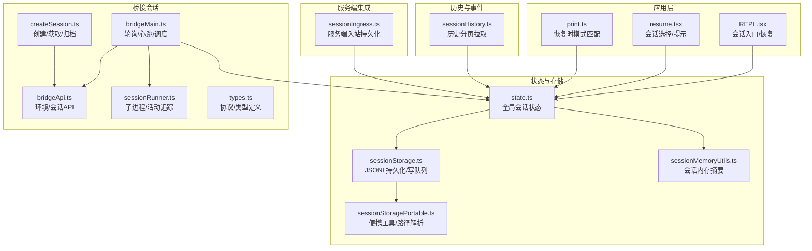
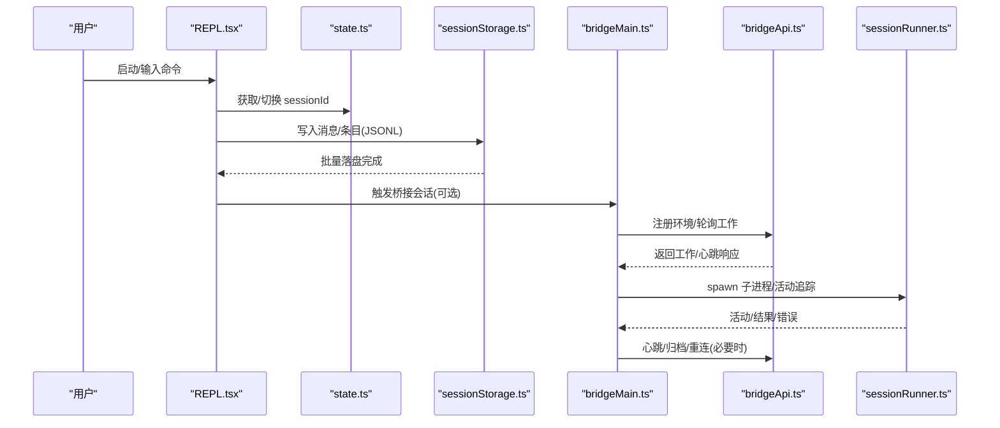
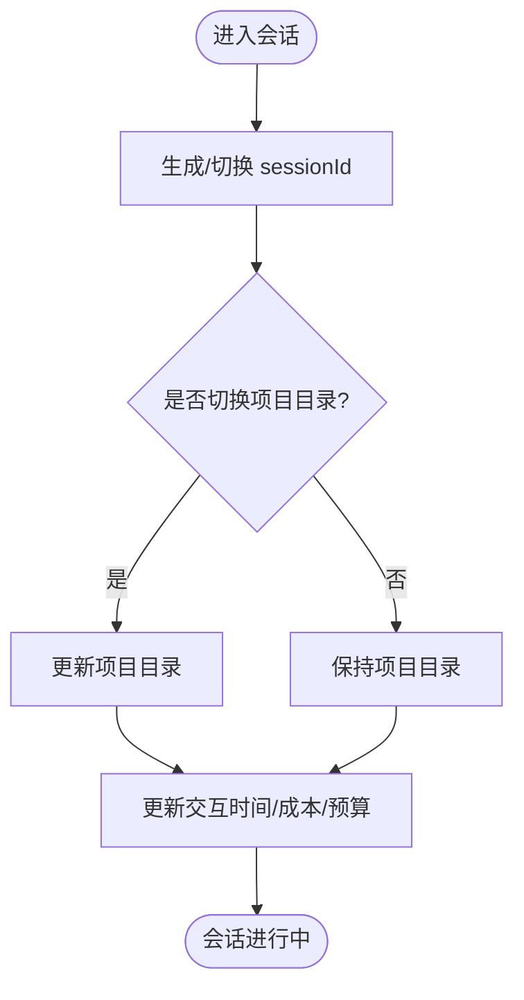
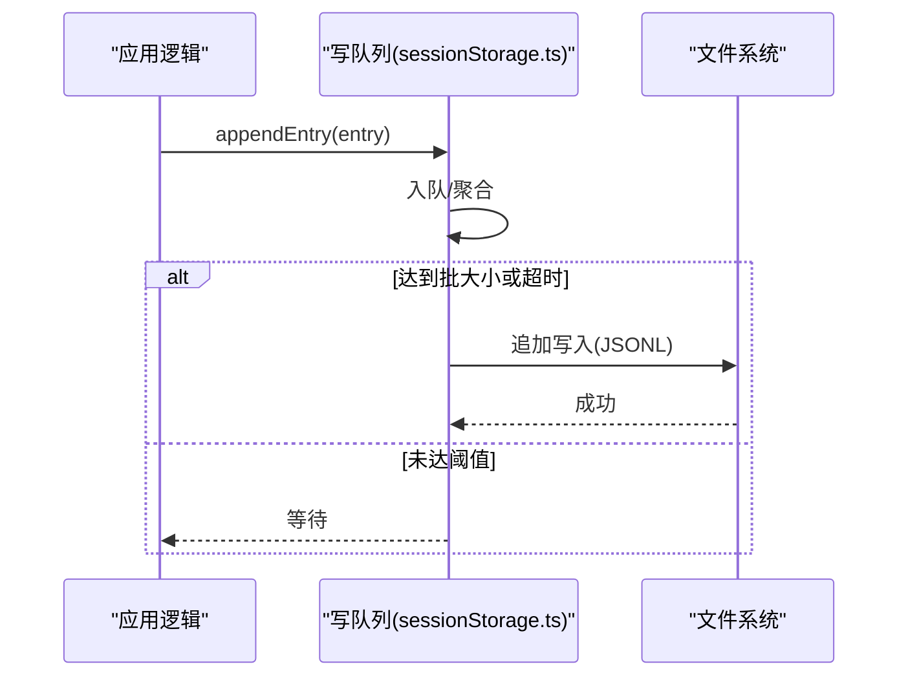
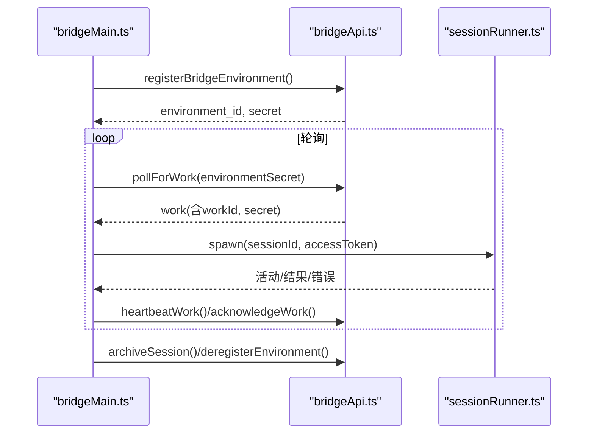
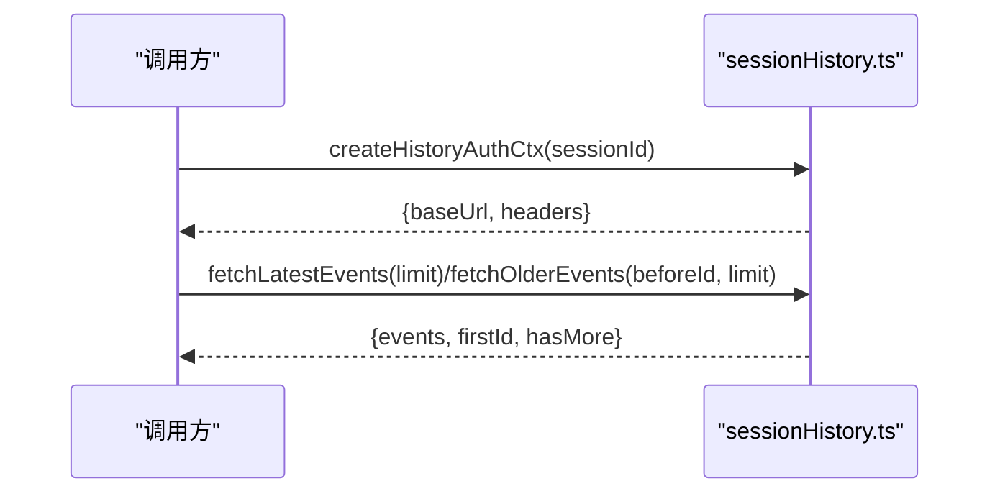
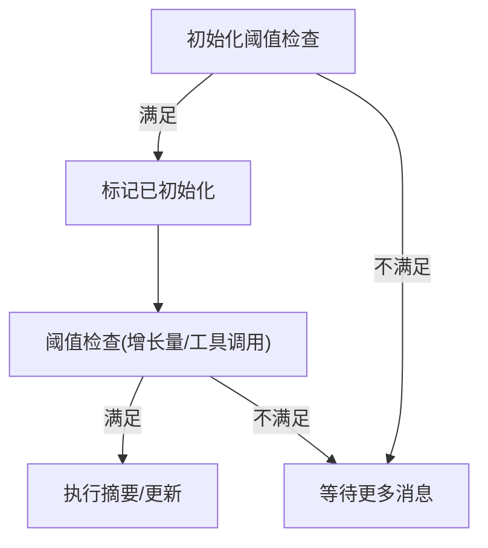
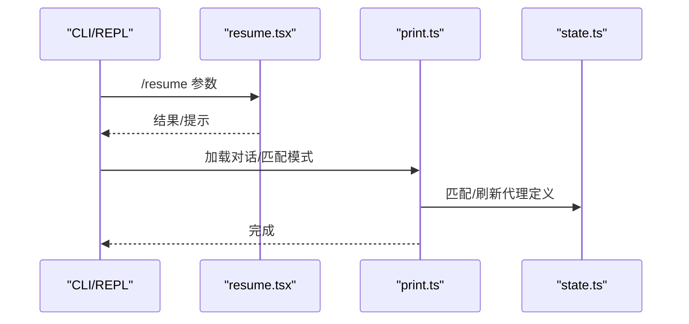
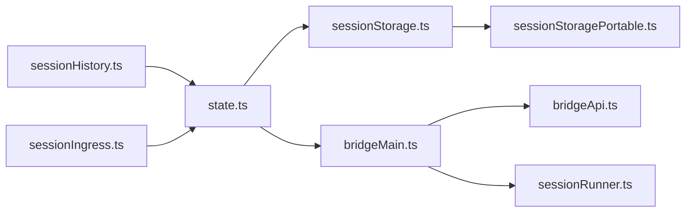

# 会话管理

<cite>
**本文档引用的文件**
- [sessionStorage.ts](file://src/utils/sessionStorage.ts)
- [sessionStoragePortable.ts](file://src/utils/sessionStoragePortable.ts)
- [state.ts](file://src/bootstrap/state.ts)
- [sessionRunner.ts](file://src/bridge/sessionRunner.ts)
- [bridgeApi.ts](file://src/bridge/bridgeApi.ts)
- [bridgeMain.ts](file://src/bridge/bridgeMain.ts)
- [createSession.ts](file://src/bridge/createSession.ts)
- [sessionHistory.ts](file://src/assistant/sessionHistory.ts)
- [sessionIngress.ts](file://src/services/api/sessionIngress.ts)
- [sessionMemoryUtils.ts](file://src/services/SessionMemory/sessionMemoryUtils.ts)
- [types.ts](file://src/bridge/types.ts)
- [REPL.tsx](file://src/screens/REPL.tsx)
- [resume.tsx](file://src/commands/resume/resume.tsx)
- [print.ts](file://src/cli/print.ts)
</cite>

## 目录
1. [简介](#简介)
2. [项目结构](#项目结构)
3. [核心组件](#核心组件)
4. [架构总览](#架构总览)
5. [详细组件分析](#详细组件分析)
6. [依赖关系分析](#依赖关系分析)
7. [性能考量](#性能考量)
8. [故障排查指南](#故障排查指南)
9. [结论](#结论)
10. [附录](#附录)

## 简介
本文件系统性阐述 Claude Code 的会话管理系统，围绕会话生命周期管理、状态持久化与恢复机制展开，覆盖以下主题：
- 会话状态的数据结构与内存模型
- 本地 JSONL 持久化与并发写入控制
- 远程桥接会话（Bridge）的创建、心跳与归档
- 历史事件拉取与跨设备同步思路
- 会话内存摘要与上下文压缩
- 会话切换、恢复与异常恢复流程
- 面向初学者的概念讲解与面向高级用户的扩展细节

## 项目结构
与会话管理直接相关的核心模块分布如下：
- 会话状态与全局状态：bootstrap/state.ts
- 会话持久化与读写：utils/sessionStorage.ts、utils/sessionStoragePortable.ts
- 会话内存摘要：services/SessionMemory/sessionMemoryUtils.ts
- 桥接会话：bridge/bridgeApi.ts、bridge/bridgeMain.ts、bridge/sessionRunner.ts、bridge/types.ts、bridge/createSession.ts
- 历史与事件：assistant/sessionHistory.ts
- 会话入口与恢复：screens/REPL.tsx、commands/resume/resume.tsx、cli/print.ts
- 会话入站持久化（服务端）：services/api/sessionIngress.ts

**图表来源**
- [REPL.tsx:1894-1910](file://src/screens/REPL.tsx#L1894-L1910)
- [resume.tsx:22-80](file://src/commands/resume/resume.tsx#L22-L80)
- [print.ts:4912-4943](file://src/cli/print.ts#L4912-L4943)
- [state.ts:431-498](file://src/bootstrap/state.ts#L431-L498)
- [sessionStorage.ts:200-225](file://src/utils/sessionStorage.ts#L200-L225)
- [sessionStoragePortable.ts:382-410](file://src/utils/sessionStoragePortable.ts#L382-L410)
- [sessionMemoryUtils.ts:1-209](file://src/services/SessionMemory/sessionMemoryUtils.ts#L1-L209)
- [bridgeApi.ts:141-197](file://src/bridge/bridgeApi.ts#L141-L197)
- [bridgeMain.ts:141-152](file://src/bridge/bridgeMain.ts#L141-L152)
- [sessionRunner.ts:248-251](file://src/bridge/sessionRunner.ts#L248-L251)
- [createSession.ts:34-54](file://src/bridge/createSession.ts#L34-L54)
- [sessionHistory.ts:31-43](file://src/assistant/sessionHistory.ts#L31-L43)
- [sessionIngress.ts:77-142](file://src/services/api/sessionIngress.ts#L77-L142)

**章节来源**
- [state.ts:431-498](file://src/bootstrap/state.ts#L431-L498)
- [sessionStorage.ts:200-225](file://src/utils/sessionStorage.ts#L200-L225)
- [sessionStoragePortable.ts:382-410](file://src/utils/sessionStoragePortable.ts#L382-L410)
- [sessionMemoryUtils.ts:1-209](file://src/services/SessionMemory/sessionMemoryUtils.ts#L1-L209)
- [bridgeApi.ts:141-197](file://src/bridge/bridgeApi.ts#L141-L197)
- [bridgeMain.ts:141-152](file://src/bridge/bridgeMain.ts#L141-L152)
- [sessionRunner.ts:248-251](file://src/bridge/sessionRunner.ts#L248-L251)
- [createSession.ts:34-54](file://src/bridge/createSession.ts#L34-L54)
- [sessionHistory.ts:31-43](file://src/assistant/sessionHistory.ts#L31-L43)
- [sessionIngress.ts:77-142](file://src/services/api/sessionIngress.ts#L77-L142)
- [REPL.tsx:1894-1910](file://src/screens/REPL.tsx#L1894-L1910)
- [resume.tsx:22-80](file://src/commands/resume/resume.tsx#L22-L80)
- [print.ts:4912-4943](file://src/cli/print.ts#L4912-L4943)

## 核心组件
- 全局会话状态（state.ts）
  - 提供 sessionId、parentSessionId、工作目录、交互时间、成本统计等会话级指标
  - 提供 switchSession、regenerateSessionId 等切换与再生接口
- 本地会话持久化（sessionStorage.ts）
  - JSONL 文件按条目追加，支持写队列批处理与权限掩码
  - 提供会话文件路径解析、子代理与远程代理元数据存储
- 便携式工具（sessionStoragePortable.ts）
  - 轻量读取、首句提取、路径解析等不依赖内部依赖的通用能力
- 桥接会话（bridgeApi.ts、bridgeMain.ts、sessionRunner.ts）
  - 环境注册、工作轮询、心跳、权限响应、会话归档
  - 子进程会话运行、活动追踪、令牌刷新、超时与清理
- 历史与事件（sessionHistory.ts）
  - 通过 OAuth 凭据与组织 UUID 拉取会话事件分页
- 会话内存摘要（sessionMemoryUtils.ts）
  - 会话记忆阈值、初始化标记、等待提取、内容读取与配置
- 会话入口与恢复（REPL.tsx、resume.tsx、print.ts）
  - 会话入口、恢复时模式匹配与成本状态恢复

**章节来源**
- [state.ts:431-498](file://src/bootstrap/state.ts#L431-L498)
- [sessionStorage.ts:634-691](file://src/utils/sessionStorage.ts#L634-L691)
- [sessionStoragePortable.ts:1-200](file://src/utils/sessionStoragePortable.ts#L1-L200)
- [bridgeApi.ts:141-197](file://src/bridge/bridgeApi.ts#L141-L197)
- [bridgeMain.ts:141-152](file://src/bridge/bridgeMain.ts#L141-L152)
- [sessionRunner.ts:248-251](file://src/bridge/sessionRunner.ts#L248-L251)
- [sessionHistory.ts:31-43](file://src/assistant/sessionHistory.ts#L31-L43)
- [sessionMemoryUtils.ts:1-209](file://src/services/SessionMemory/sessionMemoryUtils.ts#L1-L209)
- [REPL.tsx:1894-1910](file://src/screens/REPL.tsx#L1894-L1910)
- [resume.tsx:22-80](file://src/commands/resume/resume.tsx#L22-L80)
- [print.ts:4912-4943](file://src/cli/print.ts#L4912-L4943)

## 架构总览
下图展示了从用户操作到会话持久化与桥接会话管理的整体流程：

**图表来源**
- [REPL.tsx:1894-1910](file://src/screens/REPL.tsx#L1894-L1910)
- [state.ts:431-498](file://src/bootstrap/state.ts#L431-L498)
- [sessionStorage.ts:634-691](file://src/utils/sessionStorage.ts#L634-L691)
- [bridgeMain.ts:141-152](file://src/bridge/bridgeMain.ts#L141-L152)
- [bridgeApi.ts:141-197](file://src/bridge/bridgeApi.ts#L141-L197)
- [sessionRunner.ts:248-251](file://src/bridge/sessionRunner.ts#L248-L251)

## 详细组件分析

### 组件A：会话状态与生命周期（state.ts）
- 关键职责
  - 生成与切换 sessionId，支持父会话 lineage 记录
  - 维护交互时间、成本、工具耗时、转数预算等指标
  - 提供会话项目目录与原始工作目录的稳定锚点
- 生命周期要点
  - 切换会话时原子更新 sessionId 与项目目录，避免漂移
  - 重新生成会话 ID 时清理计划 slug 缓存，确保 Map 不膨胀
- 数据结构
  - 以单一不可变对象保存会话状态，提供只增不减的计数器与时间戳

**图表来源**
- [state.ts:431-498](file://src/bootstrap/state.ts#L431-L498)

**章节来源**
- [state.ts:431-498](file://src/bootstrap/state.ts#L431-L498)

### 组件B：本地会话持久化（sessionStorage.ts）
- 关键职责
  - 将消息与事件以 JSONL 形式追加到磁盘，支持写队列批处理与权限掩码
  - 解析会话文件路径，支持跨工作树与项目目录定位
  - 支持子代理与远程代理元数据的侧车文件存储
- 写入流程
  - 写队列聚合小批量，超过阈值后一次性写入，减少系统调用
  - 首次用户/助手消息出现前，条目暂存在内存队列，待文件物化后再落盘
- 并发与一致性
  - 使用文件级写队列与批处理，避免频繁打开/关闭文件
  - 通过权限掩码与目录创建保证可写性

**图表来源**
- [sessionStorage.ts:634-691](file://src/utils/sessionStorage.ts#L634-L691)

**章节来源**
- [sessionStorage.ts:634-691](file://src/utils/sessionStorage.ts#L634-L691)
- [sessionStorage.ts:200-225](file://src/utils/sessionStorage.ts#L200-L225)
- [sessionStorage.ts:247-258](file://src/utils/sessionStorage.ts#L247-L258)

### 组件C：桥接会话（bridgeMain.ts、bridgeApi.ts、sessionRunner.ts）
- 关键职责
  - 环境注册与工作轮询，心跳保活，权限响应转发
  - 子进程会话管理：活动追踪、stderr 捕获、令牌刷新、超时与清理
  - 会话归档与重连（针对 v2 JWT 过期场景）
- 协议与类型
  - 定义工作项、会话句柄、活动类型、权限响应事件等协议
- 错误与恢复
  - 401/403 触发重连；超时/中断区分处理；失败日志汇总

**图表来源**
- [bridgeMain.ts:141-152](file://src/bridge/bridgeMain.ts#L141-L152)
- [bridgeApi.ts:141-197](file://src/bridge/bridgeApi.ts#L141-L197)
- [sessionRunner.ts:248-251](file://src/bridge/sessionRunner.ts#L248-L251)

**章节来源**
- [bridgeMain.ts:141-152](file://src/bridge/bridgeMain.ts#L141-L152)
- [bridgeApi.ts:141-197](file://src/bridge/bridgeApi.ts#L141-L197)
- [sessionRunner.ts:248-251](file://src/bridge/sessionRunner.ts#L248-L251)
- [types.ts:178-190](file://src/bridge/types.ts#L178-L190)

### 组件D：历史与事件（sessionHistory.ts）
- 关键职责
  - 通过 OAuth 令牌与组织 UUID 拉取会话事件分页
  - 支持“最新”与“更旧”的分页参数，返回事件列表与游标
- 应用场景
  - 用于会话预览、分享、回放与跨设备同步的基础数据源

**图表来源**
- [sessionHistory.ts:31-43](file://src/assistant/sessionHistory.ts#L31-L43)
- [sessionHistory.ts:73-87](file://src/assistant/sessionHistory.ts#L73-L87)

**章节来源**
- [sessionHistory.ts:31-43](file://src/assistant/sessionHistory.ts#L31-L43)
- [sessionHistory.ts:73-87](file://src/assistant/sessionHistory.ts#L73-L87)

### 组件E：会话内存摘要（sessionMemoryUtils.ts）
- 关键职责
  - 控制会话记忆初始化与更新阈值（基于上下文窗口令牌数）
  - 等待正在进行的提取、记录最后摘要消息 ID、读取内存内容
- 设计要点
  - 与自动压缩使用一致的令牌计数口径，保证行为一致性
  - 提供配置注入与重置，便于测试与动态调整

**图表来源**
- [sessionMemoryUtils.ts:173-189](file://src/services/SessionMemory/sessionMemoryUtils.ts#L173-L189)

**章节来源**
- [sessionMemoryUtils.ts:1-209](file://src/services/SessionMemory/sessionMemoryUtils.ts#L1-L209)

### 组件F：会话入口与恢复（REPL.tsx、resume.tsx、print.ts）
- 关键职责
  - 在 REPL 中保存/恢复会话模式（如协调者模式），并恢复目标会话的成本状态
  - 恢复命令显示帮助信息与多匹配提示
  - 恢复时根据会话模式匹配刷新代理定义

**图表来源**
- [REPL.tsx:1894-1910](file://src/screens/REPL.tsx#L1894-L1910)
- [resume.tsx:22-80](file://src/commands/resume/resume.tsx#L22-L80)
- [print.ts:4912-4943](file://src/cli/print.ts#L4912-L4943)

**章节来源**
- [REPL.tsx:1894-1910](file://src/screens/REPL.tsx#L1894-L1910)
- [resume.tsx:22-80](file://src/commands/resume/resume.tsx#L22-L80)
- [print.ts:4912-4943](file://src/cli/print.ts#L4912-L4943)

## 依赖关系分析
- 组件耦合
  - state.ts 作为全局状态根，被 sessionStorage.ts、bridgeMain.ts、REPL.tsx 等广泛依赖
  - sessionStorage.ts 依赖 portable 工具与 fs 实现，提供稳定的路径解析与轻量读取
  - bridgeMain.ts 依赖 bridgeApi.ts 与 sessionRunner.ts，形成“调度-执行-上报”的闭环
- 外部依赖
  - HTTP 客户端（axios）用于桥接 API 与历史拉取
  - 子进程 spawn 与 stdout/stderr 流解析用于桥接会话执行
- 循环依赖规避
  - 通过便携工具模块（sessionStoragePortable.ts）与条件导入降低循环风险

**图表来源**
- [state.ts:431-498](file://src/bootstrap/state.ts#L431-L498)
- [sessionStorage.ts:200-225](file://src/utils/sessionStorage.ts#L200-L225)
- [sessionStoragePortable.ts:382-410](file://src/utils/sessionStoragePortable.ts#L382-L410)
- [bridgeMain.ts:141-152](file://src/bridge/bridgeMain.ts#L141-L152)
- [bridgeApi.ts:141-197](file://src/bridge/bridgeApi.ts#L141-L197)
- [sessionRunner.ts:248-251](file://src/bridge/sessionRunner.ts#L248-L251)
- [sessionHistory.ts:31-43](file://src/assistant/sessionHistory.ts#L31-L43)
- [sessionIngress.ts:77-142](file://src/services/api/sessionIngress.ts#L77-L142)

**章节来源**
- [state.ts:431-498](file://src/bootstrap/state.ts#L431-L498)
- [sessionStorage.ts:200-225](file://src/utils/sessionStorage.ts#L200-L225)
- [sessionStoragePortable.ts:382-410](file://src/utils/sessionStoragePortable.ts#L382-L410)
- [bridgeMain.ts:141-152](file://src/bridge/bridgeMain.ts#L141-L152)
- [bridgeApi.ts:141-197](file://src/bridge/bridgeApi.ts#L141-L197)
- [sessionRunner.ts:248-251](file://src/bridge/sessionRunner.ts#L248-L251)
- [sessionHistory.ts:31-43](file://src/assistant/sessionHistory.ts#L31-L43)
- [sessionIngress.ts:77-142](file://src/services/api/sessionIngress.ts#L77-L142)

## 性能考量
- 写入批量化
  - 写队列在达到阈值或超时时批量写入，显著降低系统调用次数
- 轻量读取
  - 便携工具提供头部/尾部缓冲读取，避免大文件全量加载
- 令牌计数一致性
  - 会话内存摘要与自动压缩使用相同的令牌计数口径，减少重复计算
- 资源清理
  - 子进程会话结束时清理定时器、工作树与会话映射，防止资源泄漏

[本节为通用指导，无需特定文件引用]

## 故障排查指南
- 桥接会话 401/403
  - 触发令牌刷新与重试；若失败抛出致命错误，需重新登录或检查权限
- 会话归档与重连
  - v2 JWT 过期时通过 reconnectSession 触发服务器重新派发；心跳失败时记录并上报
- JSONL 写入失败
  - 自动创建目录并重试；若仍失败，检查权限掩码与磁盘空间
- 历史拉取失败
  - 检查 OAuth 令牌与组织 UUID；确认网络与超时设置

**章节来源**
- [bridgeApi.ts:454-500](file://src/bridge/bridgeApi.ts#L454-L500)
- [bridgeMain.ts:202-270](file://src/bridge/bridgeMain.ts#L202-L270)
- [sessionStorage.ts:634-691](file://src/utils/sessionStorage.ts#L634-L691)
- [sessionHistory.ts:31-43](file://src/assistant/sessionHistory.ts#L31-L43)

## 结论
Claude Code 的会话管理以“全局状态 + 本地 JSONL + 桥接会话 + 历史事件”为核心，实现了：
- 明确的生命周期与状态切换
- 高效的本地持久化与并发写入
- 可靠的桥接会话调度与恢复
- 可扩展的会话内存摘要与上下文压缩
- 清晰的入口与恢复流程

该体系既满足初学者理解会话基本概念，也为高级用户提供了扩展与定制的空间。

[本节为总结，无需特定文件引用]

## 附录
- 会话状态字段参考
  - sessionId、parentSessionId、项目目录、交互时间、成本与工具耗时、预算与转数
- 关键流程路径
  - 会话切换：[state.ts:468-479](file://src/bootstrap/state.ts#L468-L479)
  - 写入批处理：[sessionStorage.ts:634-691](file://src/utils/sessionStorage.ts#L634-L691)
  - 桥接轮询与心跳：[bridgeMain.ts:600-746](file://src/bridge/bridgeMain.ts#L600-L746)
  - 历史分页拉取：[sessionHistory.ts:73-87](file://src/assistant/sessionHistory.ts#L73-L87)
  - 会话内存摘要阈值：[sessionMemoryUtils.ts:173-189](file://src/services/SessionMemory/sessionMemoryUtils.ts#L173-L189)

[本节为补充说明，无需特定文件引用]