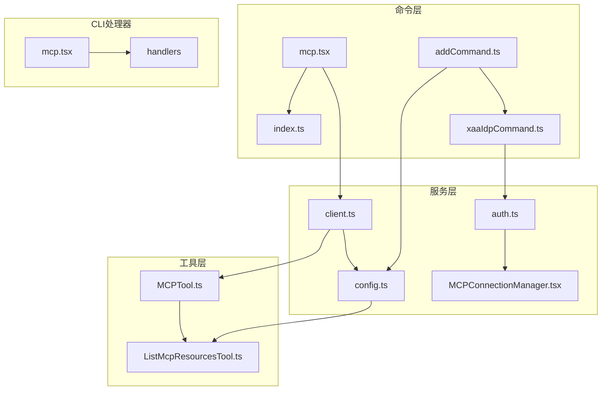
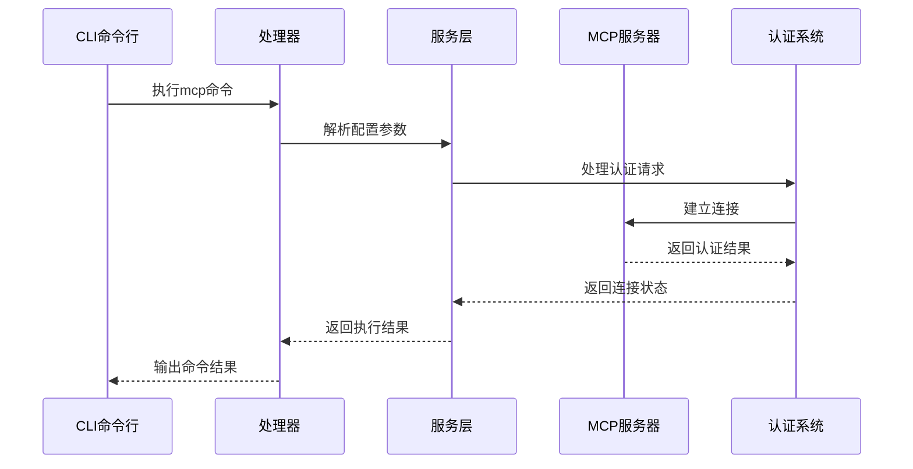
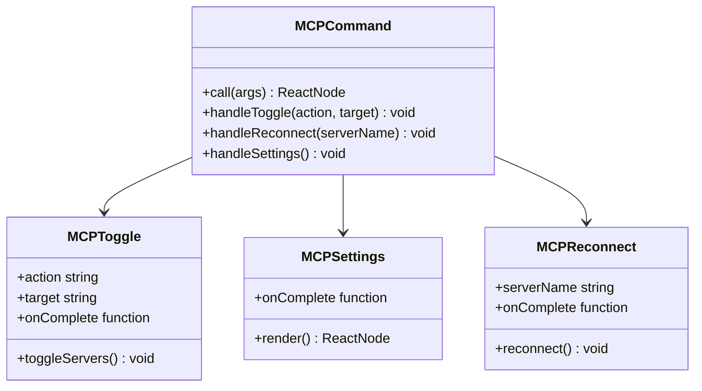
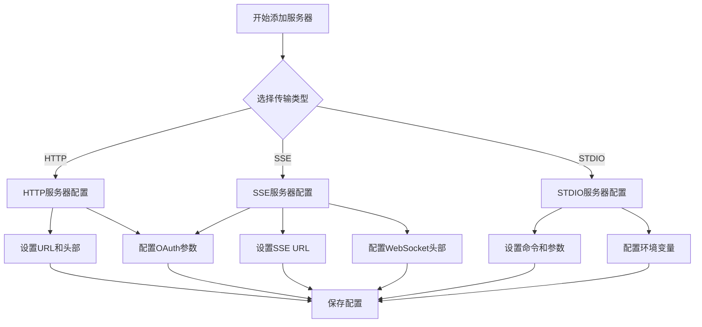
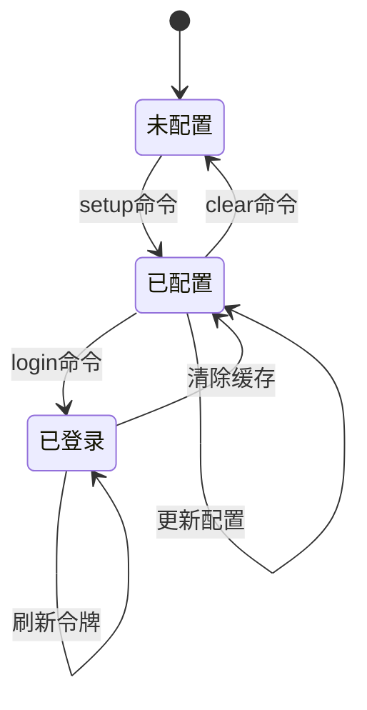
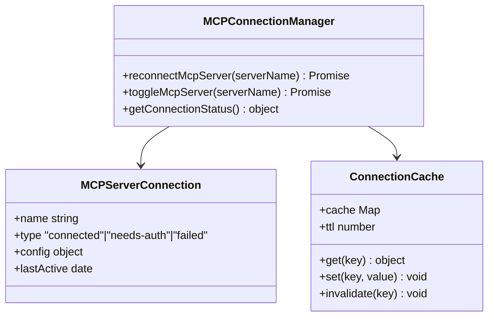
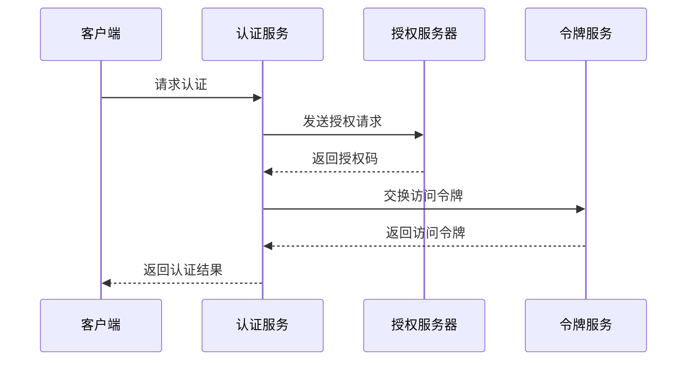
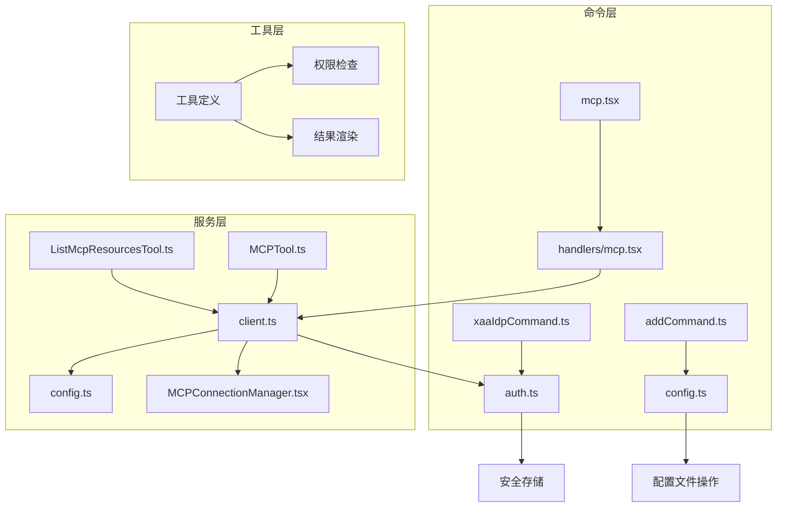

# MCP 命令

<cite>
**本文档引用的文件**
- [mcp.tsx](file://src/commands/mcp/mcp.tsx)
- [index.ts](file://src/commands/mcp/index.ts)
- [addCommand.ts](file://src/commands/mcp/addCommand.ts)
- [xaaIdpCommand.ts](file://src/commands/mcp/xaaIdpCommand.ts)
- [mcp.tsx](file://src/cli/handlers/mcp.tsx)
- [client.ts](file://src/services/mcp/client.ts)
- [config.ts](file://src/services/mcp/config.ts)
- [auth.ts](file://src/services/mcp/auth.ts)
- [MCPConnectionManager.tsx](file://src/services/mcp/MCPConnectionManager.tsx)
- [MCPTool.ts](file://src/tools/MCPTool/MCPTool.ts)
- [ListMcpResourcesTool.ts](file://src/tools/ListMcpResourcesTool/ListMcpResourcesTool.ts)
</cite>

## 目录
1. [简介](#简介)
2. [项目结构](#项目结构)
3. [核心组件](#核心组件)
4. [架构概览](#架构概览)
5. [详细组件分析](#详细组件分析)
6. [依赖关系分析](#依赖关系分析)
7. [性能考虑](#性能考虑)
8. [故障排除指南](#故障排除指南)
9. [结论](#结论)

## 简介

MCP（Model Context Protocol）命令是 Claude Code 中用于管理 MCP 服务器集成的核心功能模块。该系统提供了完整的 MCP 服务器生命周期管理，包括服务器发现、连接建立、认证处理、资源管理和工具调用等功能。

MCP 协议是一个开放标准，允许 AI 模型与各种上下文服务进行交互。在 Claude Code 中，MCP 集成使得用户能够连接到外部工具和服务，扩展 AI 的能力边界。

## 项目结构

MCP 命令系统主要分布在以下目录结构中：

**图表来源**
- [mcp.tsx:1-87](file://src/commands/mcp/mcp.tsx#L1-L87)
- [client.ts:1-800](file://src/services/mcp/client.ts#L1-L800)
- [config.ts:1-800](file://src/services/mcp/config.ts#L1-L800)

**章节来源**
- [mcp.tsx:1-87](file://src/commands/mcp/mcp.tsx#L1-L87)
- [index.ts:1-12](file://src/commands/mcp/index.ts#L1-L12)

## 核心组件

### 命令入口点

MCP 命令通过统一的入口点进行管理，支持多种操作模式：

- **基础管理**: `/mcp` 命令重定向到插件设置界面
- **启用/禁用**: 支持批量或单个服务器的启停控制
- **重新连接**: 提供服务器重新连接功能
- **配置查看**: 显示服务器详细配置信息

### 服务器配置管理

系统支持三种传输类型的 MCP 服务器配置：

1. **HTTP 服务器**: 通过 HTTP 接口连接
2. **SSE 服务器**: 通过 Server-Sent Events 实时通信
3. **STDIO 服务器**: 通过标准输入输出进程通信

### 认证与安全

MCP 系统实现了多层次的安全认证机制：

- **OAuth 2.0 支持**: 完整的 OAuth 流程处理
- **XAA (SEP-990)**: 跨应用访问协议支持
- **客户端凭据管理**: 安全存储和轮换机制
- **令牌刷新**: 自动化的令牌续期处理

**章节来源**
- [addCommand.ts:1-283](file://src/commands/mcp/addCommand.ts#L1-L283)
- [auth.ts:1-800](file://src/services/mcp/auth.ts#L1-L800)

## 架构概览

MCP 命令系统的整体架构采用分层设计，确保了良好的可维护性和扩展性：

**图表来源**
- [mcp.tsx:1-364](file://src/cli/handlers/mcp.tsx#L1-L364)
- [client.ts:1-800](file://src/services/mcp/client.ts#L1-L800)

## 详细组件分析

### 命令管理组件

#### 主要功能特性

MCP 命令管理组件提供了完整的服务器生命周期管理：

**图表来源**
- [mcp.tsx:12-84](file://src/commands/mcp/mcp.tsx#L12-L84)

#### 参数处理逻辑

命令参数解析遵循严格的规则：

1. **无参数**: 重定向到插件设置界面
2. **no-redirect**: 绕过重定向直接显示设置
3. **reconnect**: 触发服务器重新连接
4. **enable/disable**: 控制服务器启停状态

**章节来源**
- [mcp.tsx:63-84](file://src/commands/mcp/mcp.tsx#L63-L84)

### 添加服务器命令

#### 支持的传输类型

系统支持多种传输协议的 MCP 服务器添加：

**图表来源**
- [addCommand.ts:33-280](file://src/commands/mcp/addCommand.ts#L33-L280)

#### 配置验证机制

添加服务器时的验证流程：

1. **名称验证**: 确保服务器名称符合命名规范
2. **类型检查**: 验证传输类型的有效性
3. **URL 格式**: 对 HTTP/SSE 服务器验证 URL 格式
4. **策略检查**: 应用企业策略限制
5. **重复检查**: 防止重复添加相同配置

**章节来源**
- [addCommand.ts:81-280](file://src/commands/mcp/addCommand.ts#L81-L280)

### XAA (SEP-990) 认证管理

#### IdP 连接管理

XAA 协议提供了跨应用访问的能力，通过统一的身份提供商管理：

**图表来源**
- [xaaIdpCommand.ts:24-266](file://src/commands/mcp/xaaIdpCommand.ts#L24-L266)

#### 认证流程

XAA 认证的完整流程包括：

1. **IdP 设置**: 配置身份提供商信息
2. **令牌获取**: 通过浏览器登录获取 id_token
3. **令牌交换**: 将 id_token 与 AS 令牌交换
4. **缓存管理**: 安全存储和管理访问令牌

**章节来源**
- [xaaIdpCommand.ts:149-266](file://src/commands/mcp/xaaIdpCommand.ts#L149-L266)

### 服务器连接管理

#### 连接状态管理

MCP 服务器连接采用智能缓存和重连机制：

**图表来源**
- [MCPConnectionManager.tsx:1-74](file://src/services/mcp/MCPConnectionManager.tsx#L1-L74)

#### 连接超时和重试

系统实现了智能的连接超时和重试机制：

- **连接超时**: 默认 30 秒连接超时
- **请求超时**: 默认 60 秒请求超时
- **重试策略**: 指数退避重试
- **并发控制**: 可配置的连接批次大小

**章节来源**
- [client.ts:456-561](file://src/services/mcp/client.ts#L456-L561)

### 认证服务

#### OAuth 流程实现

MCP 认证服务提供了完整的 OAuth 2.0 实现：

**图表来源**
- [auth.ts:256-311](file://src/services/mcp/auth.ts#L256-L311)

#### 令牌管理

令牌管理系统包括：

- **令牌存储**: 安全存储访问令牌和刷新令牌
- **自动刷新**: 智能令牌刷新机制
- **错误处理**: 完善的认证错误处理
- **清理机制**: 定期清理过期令牌

**章节来源**
- [auth.ts:618-634](file://src/services/mcp/auth.ts#L618-L634)

## 依赖关系分析

### 组件间依赖

MCP 命令系统各组件间的依赖关系如下：

**图表来源**
- [mcp.tsx:1-364](file://src/cli/handlers/mcp.tsx#L1-L364)
- [client.ts:1-800](file://src/services/mcp/client.ts#L1-L800)

### 外部依赖

系统依赖的关键外部组件：

- **@modelcontextprotocol/sdk**: MCP 协议 SDK
- **Commander.js**: 命令行参数解析
- **Zod**: 数据验证
- **Axios**: HTTP 请求处理
- **WS**: WebSocket 支持

**章节来源**
- [client.ts:1-50](file://src/services/mcp/client.ts#L1-L50)

## 性能考虑

### 连接池管理

系统实现了高效的连接池管理机制：

- **连接复用**: 同一服务器的多个请求共享连接
- **内存优化**: 使用 LRU 缓存减少内存占用
- **并发控制**: 限制同时连接的服务器数量
- **资源清理**: 及时释放不再使用的连接

### 缓存策略

多层缓存机制提升系统性能：

1. **配置缓存**: 缓存服务器配置避免重复读取
2. **连接缓存**: 缓存活跃连接减少建立时间
3. **资源缓存**: 缓存服务器资源列表
4. **认证缓存**: 缓存认证状态

### 异步处理

系统采用异步非阻塞的处理方式：

- **批量操作**: 支持并发处理多个服务器
- **进度反馈**: 实时显示操作进度
- **错误隔离**: 单个服务器失败不影响整体操作
- **资源回收**: 及时回收异步操作产生的资源

## 故障排除指南

### 常见问题诊断

#### 连接问题

**问题**: 无法连接到 MCP 服务器
**解决方案**:
1. 检查服务器 URL 和端口
2. 验证网络连接状态
3. 确认防火墙设置
4. 查看服务器日志

#### 认证问题

**问题**: 认证失败或令牌过期
**解决方案**:
1. 重新运行认证流程
2. 检查客户端凭据
3. 验证 OAuth 配置
4. 清理认证缓存

#### 性能问题

**问题**: 响应缓慢或超时
**解决方案**:
1. 检查服务器负载
2. 调整超时参数
3. 优化网络配置
4. 减少并发连接数

### 日志分析

系统提供了详细的日志记录功能：

- **调试日志**: 详细的连接和认证过程记录
- **错误日志**: 错误原因和解决建议
- **性能日志**: 连接时间和响应时间统计
- **审计日志**: 用户操作和系统事件记录

**章节来源**
- [mcp.tsx:26-39](file://src/cli/handlers/mcp.tsx#L26-L39)

### 最佳实践

#### 服务器配置最佳实践

1. **命名规范**: 使用有意义的服务器名称
2. **安全配置**: 启用必要的安全措施
3. **监控设置**: 配置适当的健康检查
4. **备份策略**: 定期备份服务器配置

#### 运维建议

1. **定期维护**: 定期检查服务器连接状态
2. **性能监控**: 监控连接延迟和成功率
3. **容量规划**: 根据使用情况调整资源配置
4. **故障预案**: 制定应急响应计划

## 结论

MCP 命令系统为 Claude Code 提供了强大而灵活的 MCP 服务器管理能力。通过模块化的设计和完善的错误处理机制，系统能够稳定地管理各种类型的 MCP 服务器连接。

主要优势包括：

- **完整的生命周期管理**: 从添加到删除的全流程支持
- **多协议支持**: HTTP、SSE、STDIO 等多种传输协议
- **安全可靠**: 完善的认证和安全机制
- **高性能**: 智能缓存和连接池管理
- **易于使用**: 直观的命令行接口和图形界面

未来的发展方向包括：

- **更多传输协议支持**
- **增强的监控和诊断功能**
- **改进的性能优化**
- **更好的用户体验**