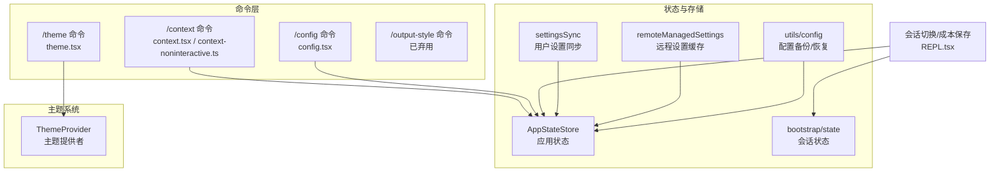
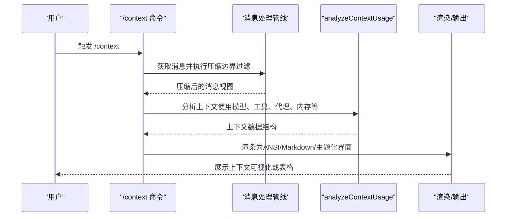
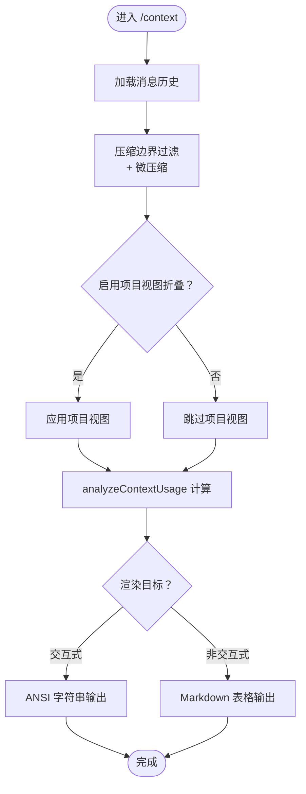
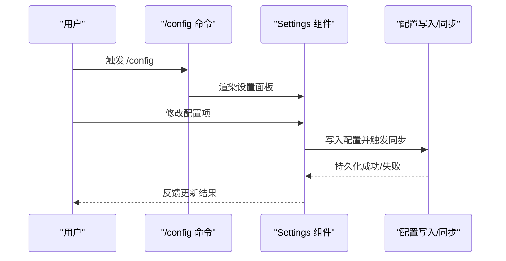
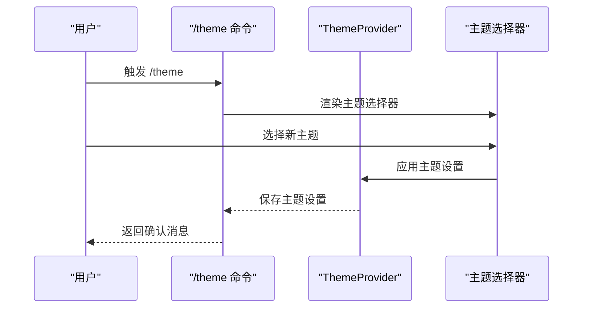
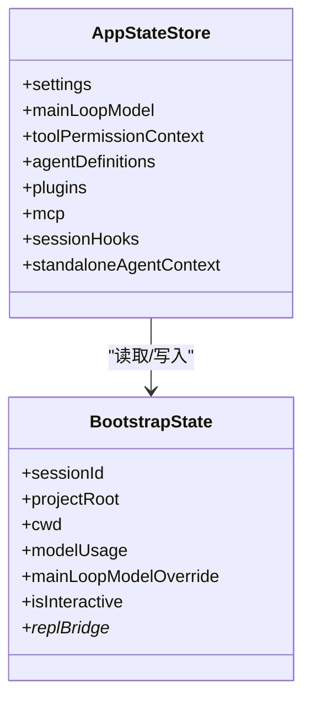
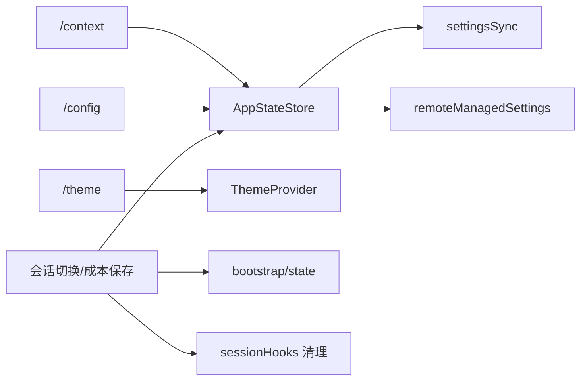

# 上下文管理命令

<cite>
**本文档引用的文件**
- [src/commands/context/index.ts](file://src/commands/context/index.ts)
- [src/commands/context/context.tsx](file://src/commands/context/context.tsx)
- [src/commands/context/context-noninteractive.ts](file://src/commands/context/context-noninteractive.ts)
- [src/commands/config/index.ts](file://src/commands/config/index.ts)
- [src/commands/config/config.tsx](file://src/commands/config/config.tsx)
- [src/commands/theme/index.ts](file://src/commands/theme/index.ts)
- [src/commands/theme/theme.tsx](file://src/commands/theme/theme.tsx)
- [src/commands/output-style/index.ts](file://src/commands/output-style/index.ts)
- [src/state/AppStateStore.ts](file://src/state/AppStateStore.ts)
- [src/bootstrap/state.ts](file://src/bootstrap/state.ts)
- [src/services/settingsSync/index.ts](file://src/services/settingsSync/index.ts)
- [src/services/remoteManagedSettings/index.ts](file://src/services/remoteManagedSettings/index.ts)
- [src/utils/config.ts](file://src/utils/config.ts)
- [src/utils/hooks/sessionHooks.ts](file://src/utils/hooks/sessionHooks.ts)
- [src/screens/REPL.tsx](file://src/screens/REPL.tsx)
- [src/components/design-system/ThemeProvider.tsx](file://src/components/design-system/ThemeProvider.tsx)
</cite>

## 目录
1. [简介](#简介)
2. [项目结构](#项目结构)
3. [核心组件](#核心组件)
4. [架构总览](#架构总览)
5. [详细组件分析](#详细组件分析)
6. [依赖关系分析](#依赖关系分析)
7. [性能考量](#性能考量)
8. [故障排查指南](#故障排查指南)
9. [结论](#结论)
10. [附录](#附录)

## 简介
本文件系统性梳理与“上下文管理”相关的一组内置命令，涵盖上下文可视化与分析、配置面板、主题切换、输出样式（已弃用）等能力，并深入解析上下文状态管理与配置持久化的实现机制。文档同时提供个性化配置与团队协作的最佳实践，以及配置迁移与备份恢复的操作指南。

## 项目结构
围绕上下文管理的相关模块主要分布在以下位置：
- 命令定义：commands/context、commands/config、commands/theme、commands/output-style
- 上下文分析与渲染：commands/context/context.tsx、commands/context/context-noninteractive.ts
- 应用状态与会话：state/AppStateStore.ts、bootstrap/state.ts
- 配置同步与持久化：services/settingsSync、services/remoteManagedSettings、utils/config
- 主题系统：components/design-system/ThemeProvider.tsx
- 会话切换与成本保存：screens/REPL.tsx
- 会话钩子清理：utils/hooks/sessionHooks.ts

图表来源
- [src/commands/context/context.tsx:18-77](file://src/commands/context/context.tsx#L18-L77)
- [src/commands/context/context-noninteractive.ts:34-88](file://src/commands/context/context-noninteractive.ts#L34-L88)
- [src/commands/config/config.tsx:4-6](file://src/commands/config/config.tsx#L4-L6)
- [src/commands/theme/theme.tsx:54-56](file://src/commands/theme/theme.tsx#L54-L56)
- [src/state/AppStateStore.ts:89-571](file://src/state/AppStateStore.ts#L89-L571)
- [src/bootstrap/state.ts:45-257](file://src/bootstrap/state.ts#L45-L257)
- [src/services/settingsSync/index.ts:42-421](file://src/services/settingsSync/index.ts#L42-L421)
- [src/services/remoteManagedSettings/index.ts:367-408](file://src/services/remoteManagedSettings/index.ts#L367-L408)
- [src/utils/config.ts:1249-1431](file://src/utils/config.ts#L1249-L1431)
- [src/screens/REPL.tsx:1805-1838](file://src/screens/REPL.tsx#L1805-L1838)

章节来源
- [src/commands/context/index.ts:4-24](file://src/commands/context/index.ts#L4-L24)
- [src/commands/config/index.ts:3-9](file://src/commands/config/index.ts#L3-L9)
- [src/commands/theme/index.ts:3-8](file://src/commands/theme/index.ts#L3-L8)
- [src/commands/output-style/index.ts:3-9](file://src/commands/output-style/index.ts#L3-L9)

## 核心组件
- 上下文命令族
  - /context：在交互式界面中以彩色网格可视化当前上下文使用情况；在非交互模式下以文本表格形式展示上下文统计。
  - /context（非交互）：内部共享的数据采集路径，供 SDK 控制请求调用，返回 Markdown 表格格式的上下文摘要。
- 配置命令
  - /config：打开设置面板，默认定位到“配置”标签页，支持用户修改各类运行参数与行为开关。
- 主题命令
  - /theme：打开主题选择器，即时预览并应用新主题，支持自动检测系统主题。
- 输出样式命令
  - /output-style：已标记为弃用，建议通过 /config 修改输出样式。

章节来源
- [src/commands/context/index.ts:4-24](file://src/commands/context/index.ts#L4-L24)
- [src/commands/context/context.tsx:30-63](file://src/commands/context/context.tsx#L30-L63)
- [src/commands/context/context-noninteractive.ts:79-88](file://src/commands/context/context-noninteractive.ts#L79-L88)
- [src/commands/config/index.ts:3-9](file://src/commands/config/index.ts#L3-L9)
- [src/commands/config/config.tsx:4-6](file://src/commands/config/config.tsx#L4-L6)
- [src/commands/theme/index.ts:3-8](file://src/commands/theme/index.ts#L3-L8)
- [src/commands/theme/theme.tsx:54-56](file://src/commands/theme/theme.tsx#L54-L56)
- [src/commands/output-style/index.ts:3-9](file://src/commands/output-style/index.ts#L3-L9)

## 架构总览
上下文管理命令围绕“消息压缩—上下文分析—结果渲染/输出”的流程展开，同时与应用状态、会话状态、设置同步和主题系统紧密耦合。

图表来源
- [src/commands/context/context.tsx:18-77](file://src/commands/context/context.tsx#L18-L77)
- [src/commands/context/context-noninteractive.ts:34-88](file://src/commands/context/context-noninteractive.ts#L34-L88)

## 详细组件分析

### 组件A：上下文命令（/context）
- 交互式可视化
  - 在交互式终端中，将消息经微压缩后传入上下文分析器，生成可渲染的上下文数据，再转为 ANSI 字符串输出，形成彩色网格可视化。
  - 支持项目视图折叠（feature 开关）与终端宽度自适应。
- 非交互式文本输出
  - 提供共享的数据采集函数，返回 Markdown 表格，包含模型、令牌总量、各分类占比、MCP 工具、系统工具、自定义代理、内存文件、技能、消息拆解等信息。
  - 可选显示上下文折叠策略状态与错误统计。

图表来源
- [src/commands/context/context.tsx:18-77](file://src/commands/context/context.tsx#L18-L77)
- [src/commands/context/context-noninteractive.ts:34-88](file://src/commands/context/context-noninteractive.ts#L34-L88)

章节来源
- [src/commands/context/index.ts:4-24](file://src/commands/context/index.ts#L4-L24)
- [src/commands/context/context.tsx:30-63](file://src/commands/context/context.tsx#L30-L63)
- [src/commands/context/context-noninteractive.ts:34-88](file://src/commands/context/context-noninteractive.ts#L34-L88)

### 组件B：配置命令（/config）
- 打开设置面板，定位到“配置”标签页，允许用户调整运行参数、代理设置、权限模式、桥接选项等。
- 设置变更通过全局配置写入与同步服务持久化，支持本地与远程同步。

图表来源
- [src/commands/config/config.tsx:4-6](file://src/commands/config/config.tsx#L4-L6)
- [src/commands/config/index.ts:3-9](file://src/commands/config/index.ts#L3-L9)

章节来源
- [src/commands/config/index.ts:3-9](file://src/commands/config/index.ts#L3-L9)
- [src/commands/config/config.tsx:4-6](file://src/commands/config/config.tsx#L4-L6)

### 组件C：主题命令（/theme）
- 打开主题选择器，支持即时预览与保存，主题设置由全局配置持久化。
- 主题提供者负责解析系统主题（如 auto），并在 UI 中生效。

图表来源
- [src/commands/theme/theme.tsx:54-56](file://src/commands/theme/theme.tsx#L54-L56)
- [src/components/design-system/ThemeProvider.tsx:43-59](file://src/components/design-system/ThemeProvider.tsx#L43-L59)

章节来源
- [src/commands/theme/index.ts:3-8](file://src/commands/theme/index.ts#L3-L8)
- [src/commands/theme/theme.tsx:54-56](file://src/commands/theme/theme.tsx#L54-L56)
- [src/components/design-system/ThemeProvider.tsx:34-59](file://src/components/design-system/ThemeProvider.tsx#L34-L59)

### 组件D：输出样式命令（/output-style，已弃用）
- 该命令已标记为弃用，建议通过 /config 修改输出样式。
- 保留该命令仅用于兼容性目的。

章节来源
- [src/commands/output-style/index.ts:3-9](file://src/commands/output-style/index.ts#L3-L9)

### 组件E：上下文状态管理与会话切换
- 应用状态（AppStateStore）
  - 包含 settings、mainLoopModel、toolPermissionContext、agentDefinitions、plugins、mcp、sessionHooks 等字段，支撑上下文分析所需的输入。
- 会话状态（bootstrap/state）
  - 管理会话 ID、项目根目录、工作目录、成本统计、令牌预算、远程连接状态等，影响上下文计算与输出。
- 会话切换与成本保存
  - 在会话切换时，先保存当前会话成本，再恢复目标会话的成本，确保计费不丢失。

图表来源
- [src/state/AppStateStore.ts:89-571](file://src/state/AppStateStore.ts#L89-L571)
- [src/bootstrap/state.ts:45-257](file://src/bootstrap/state.ts#L45-L257)

章节来源
- [src/state/AppStateStore.ts:89-571](file://src/state/AppStateStore.ts#L89-L571)
- [src/bootstrap/state.ts:45-257](file://src/bootstrap/state.ts#L45-L257)
- [src/utils/hooks/sessionHooks.ts:437-447](file://src/utils/hooks/sessionHooks.ts#L437-L447)
- [src/screens/REPL.tsx:1805-1838](file://src/screens/REPL.tsx#L1805-L1838)

## 依赖关系分析
- 命令到状态
  - /context 依赖应用状态中的工具权限上下文、代理定义、消息历史等。
  - /config 与 /theme 依赖全局配置与主题提供者。
- 同步与持久化
  - settingsSync 负责用户设置与记忆的上传/下载，remoteManagedSettings 负责远程设置缓存与文件落盘。
- 会话生命周期
  - 会话切换时清理会话钩子，避免残留状态影响后续会话。

图表来源
- [src/commands/context/context.tsx:30-63](file://src/commands/context/context.tsx#L30-L63)
- [src/commands/config/config.tsx:4-6](file://src/commands/config/config.tsx#L4-L6)
- [src/commands/theme/theme.tsx:54-56](file://src/commands/theme/theme.tsx#L54-L56)
- [src/services/settingsSync/index.ts:42-421](file://src/services/settingsSync/index.ts#L42-L421)
- [src/services/remoteManagedSettings/index.ts:367-408](file://src/services/remoteManagedSettings/index.ts#L367-L408)
- [src/utils/hooks/sessionHooks.ts:437-447](file://src/utils/hooks/sessionHooks.ts#L437-L447)
- [src/screens/REPL.tsx:1805-1838](file://src/screens/REPL.tsx#L1805-L1838)

章节来源
- [src/services/settingsSync/index.ts:42-421](file://src/services/settingsSync/index.ts#L42-L421)
- [src/services/remoteManagedSettings/index.ts:367-408](file://src/services/remoteManagedSettings/index.ts#L367-L408)
- [src/utils/hooks/sessionHooks.ts:437-447](file://src/utils/hooks/sessionHooks.ts#L437-L447)

## 性能考量
- 上下文分析前的消息压缩
  - 先进行压缩边界过滤与微压缩，减少分析与渲染的计算量，提升交互响应速度。
- 终端宽度感知
  - 交互式上下文可视化根据终端宽度动态适配布局，避免不必要的重排。
- 主题切换与渲染
  - 主题选择器支持预览与即时应用，减少不必要的 UI 重绘与配置写入次数。

## 故障排查指南
- 上下文命令无输出或显示异常
  - 检查是否处于非交互模式（/context 的非交互变体仅在非交互会话中可用）。
  - 确认消息历史是否存在，必要时先执行压缩或清理无效消息。
- 主题未生效或恢复默认
  - 确认主题设置已保存至全局配置；若使用“自动”主题，检查系统主题检测逻辑。
- 配置不同步或丢失
  - 检查 settingsSync 是否启用且具备 OAuth 权限；查看 remoteManagedSettings 缓存是否被清除。
- 会话切换后状态异常
  - 确认会话钩子已被清理；检查会话成本保存/恢复流程是否正确执行。

章节来源
- [src/commands/context/index.ts:12-24](file://src/commands/context/index.ts#L12-L24)
- [src/components/design-system/ThemeProvider.tsx:43-59](file://src/components/design-system/ThemeProvider.tsx#L43-L59)
- [src/services/settingsSync/index.ts:60-90](file://src/services/settingsSync/index.ts#L60-L90)
- [src/services/remoteManagedSettings/index.ts:391-408](file://src/services/remoteManagedSettings/index.ts#L391-L408)
- [src/utils/hooks/sessionHooks.ts:437-447](file://src/utils/hooks/sessionHooks.ts#L437-L447)

## 结论
上下文管理命令通过“消息压缩—上下文分析—结果渲染”的链路，为用户提供直观的上下文洞察；配合配置面板与主题系统，实现从行为到外观的全链路个性化。借助设置同步与远程缓存机制，用户可在多设备间保持一致体验。遵循本文最佳实践与故障排查建议，可有效提升开发效率与协作质量。

## 附录

### 最佳实践：个性化配置
- 使用 /config 定期校准模型、工具权限与代理设置，确保上下文分析准确反映当前工作流。
- 利用 /theme 选择适合的界面主题，结合“自动”模式随系统主题变化。
- 对于输出样式，优先通过 /config 进行统一管理，避免使用已弃用的 /output-style。

章节来源
- [src/commands/config/index.ts:3-9](file://src/commands/config/index.ts#L3-L9)
- [src/commands/theme/index.ts:3-8](file://src/commands/theme/index.ts#L3-L8)
- [src/commands/output-style/index.ts:3-9](file://src/commands/output-style/index.ts#L3-L9)

### 团队协作：配置同步与备份
- 用户设置与记忆可通过 settingsSync 自动上传/下载，确保跨设备一致性。
- remoteManagedSettings 提供远程设置缓存与文件落盘，便于离线场景下的快速恢复。
- utils/config 实现配置文件的自动备份与恢复，建议定期检查备份目录，防止频繁写入导致磁盘占用。

章节来源
- [src/services/settingsSync/index.ts:42-421](file://src/services/settingsSync/index.ts#L42-L421)
- [src/services/remoteManagedSettings/index.ts:367-408](file://src/services/remoteManagedSettings/index.ts#L367-L408)
- [src/utils/config.ts:1249-1431](file://src/utils/config.ts#L1249-L1431)

### 配置迁移与备份恢复操作指南
- 备份策略
  - 配置文件会在写入时按时间戳生成备份副本，避免频繁写入造成过多备份。
  - 支持在新旧备份目录之间查找最近一次备份，优先使用带时间戳的新格式。
- 恢复步骤
  - 若需手动恢复，请从备份目录选择最近一次备份文件，将其复制回原配置文件位置。
  - 恢复后重启应用，确认配置已正确加载。

章节来源
- [src/utils/config.ts:1249-1431](file://src/utils/config.ts#L1249-L1431)