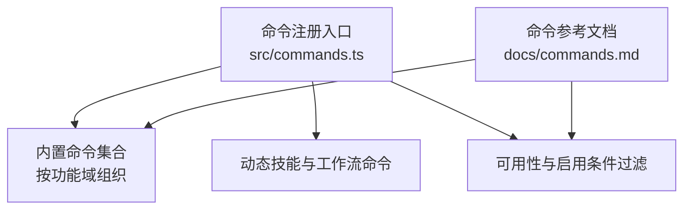
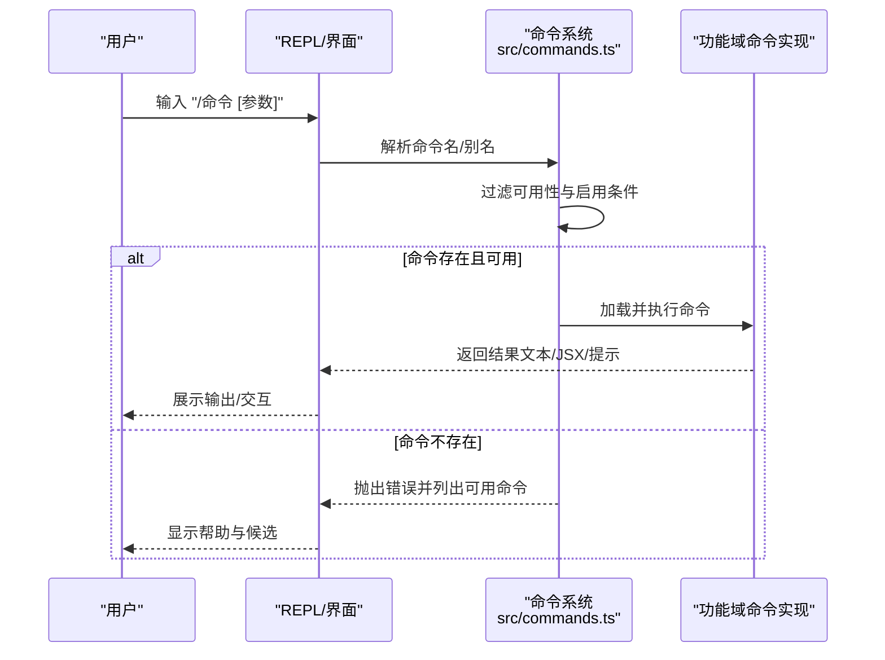
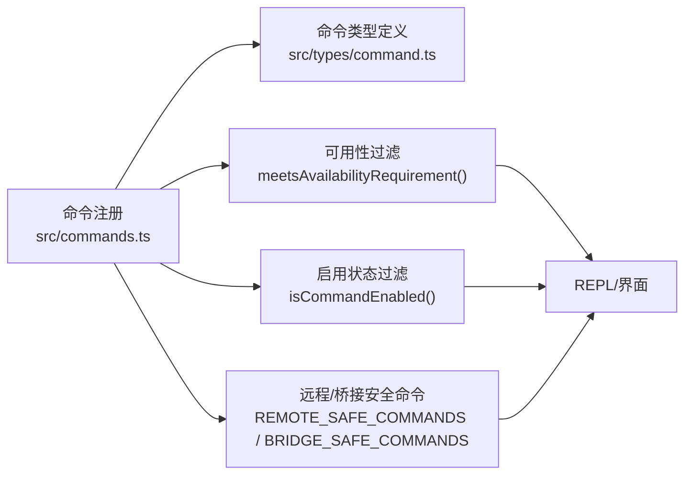

# 内置命令参考

<cite>
**本文引用的文件**
- [src/commands.ts](file://src/commands.ts)
- [docs/commands.md](file://docs/commands.md)
- [src/commands/init.ts](file://src/commands/init.ts)
- [src/commands/help/index.ts](file://src/commands/help/index.ts)
- [src/commands/review.ts](file://src/commands/review.ts)
- [src/commands/commit.ts](file://src/commands/commit.ts)
- [src/commands/context/index.ts](file://src/commands/context/index.ts)
- [src/commands/config/config.tsx](file://src/commands/config/config.tsx)
- [src/commands/session/index.ts](file://src/commands/session/index.ts)
- [src/commands/status/index.ts](file://src/commands/status/index.ts)
- [src/commands/mcp/index.ts](file://src/commands/mcp/index.ts)
- [src/commands/doctor/index.ts](file://src/commands/doctor/index.ts)
</cite>

## 目录
1. [简介](#简介)
2. [项目结构](#项目结构)
3. [核心组件](#核心组件)
4. [架构总览](#架构总览)
5. [详细组件分析](#详细组件分析)
6. [依赖分析](#依赖分析)
7. [性能考虑](#性能考虑)
8. [故障排查指南](#故障排查指南)
9. [结论](#结论)
10. [附录](#附录)

## 简介
本参考文档系统梳理 Claude Code 的内置命令，按功能域分组呈现命令清单，并对每个命令的用途、语法、参数、可用性条件与权限要求进行说明；同时给出快捷方式、别名与组合使用建议，以及面向不同经验水平用户的最佳实践。所有信息均基于仓库中的命令注册与实现源码整理而成。

## 项目结构
命令系统的核心由以下部分组成：
- 命令注册与聚合：集中导出与过滤可用命令、动态技能与工作流命令
- 功能域命令：按领域划分的命令实现（如 Git/版本控制、代码质量、会话与上下文、配置与设置、MCP/插件、认证、任务与代理、诊断与状态、安装与设置、IDE/桌面集成、远程与环境、杂项等）
- 文档索引：官方命令参考文档，汇总命令分类与简要描述

**图表来源**
- [src/commands.ts:259-519](file://src/commands.ts#L259-L519)
- [docs/commands.md:1-212](file://docs/commands.md#L1-L212)

**章节来源**
- [src/commands.ts:259-519](file://src/commands.ts#L259-L519)
- [docs/commands.md:1-212](file://docs/commands.md#L1-L212)

## 核心组件
- 命令注册与聚合
  - 统一从各功能域目录导入命令，构建全局命令数组
  - 支持特性开关与内部命令的条件加载
  - 提供命令名称与别名的去重集合
- 可用性与启用条件
  - 按“可用性”（如订阅者/控制台/第三方服务）与“启用状态”过滤命令
  - 远程模式与桥接模式下的安全命令白名单
- 动态技能与工作流
  - 技能目录、插件技能、捆绑技能与工作流命令统一纳入命令集
- 命令检索与格式化
  - 支持按名称或别名查找命令
  - 在 UI 中格式化命令描述，标注来源（内置/插件/工作流/捆绑）

**章节来源**
- [src/commands.ts:259-519](file://src/commands.ts#L259-L519)
- [src/commands.ts:611-688](file://src/commands.ts#L611-L688)
- [src/commands.ts:690-721](file://src/commands.ts#L690-L721)
- [src/commands.ts:730-756](file://src/commands.ts#L730-L756)

## 架构总览
命令系统在运行时根据当前环境与特性标志动态组装命令集，并在渲染前进行可用性与启用状态过滤。命令类型分为三类：提示型（发送给模型）、本地文本型（仅本地执行返回文本）、本地 JSX 型（渲染 UI 组件）。部分命令支持非交互式运行（如上下文查看）。

**图表来源**
- [src/commands.ts:478-519](file://src/commands.ts#L478-L519)
- [src/commands.ts:690-721](file://src/commands.ts#L690-L721)

## 详细组件分析

### 命令类型与定义模式
- 类型
  - 提示型（PromptCommand）：向模型发送格式化提示，可注入工具
  - 本地文本型（LocalCommand）：在进程内执行，返回纯文本
  - 本地 JSX 型（LocalJSXCommand）：在进程内执行，返回 React JSX
- 定义要点
  - 必填字段：type、name、description、source
  - 可选字段：progressMessage、allowedTools、aliases、isEnabled、immediate、supportsNonInteractive、isHidden、argumentHint、load 等
  - 动态提示：通过 getPromptForCommand(args, context) 生成

**章节来源**
- [docs/commands.md:11-33](file://docs/commands.md#L11-L33)
- [src/commands.ts:208-223](file://src/commands.ts#L208-L223)

### Git 与版本控制
- /commit
  - 用途：基于当前变更生成提交
  - 语法：/commit
  - 参数：无
  - 权限与工具：允许调用 git 工具；受工具权限与安全协议约束
  - 快捷方式/别名：无
  - 组合使用：先 /diff 查看变更，再 /commit 生成提交
  - 最佳实践：遵循仓库提交规范；避免提交敏感信息
- /commit-push-pr
  - 用途：一键提交、推送并创建 PR
  - 语法：/commit-push-pr
  - 参数：无
  - 权限与工具：需要 Git 与远程仓库访问
  - 快捷方式/别名：无
  - 组合使用：/commit 后自动推送到远端并创建 PR
- /branch
  - 用途：创建或切换分支
  - 语法：/branch
  - 参数：分支名
  - 权限与工具：Git 工具
  - 快捷方式/别名：无
  - 组合使用：/branch feature/new-idea -> /diff -> /commit
- /diff
  - 用途：查看文件变更（暂存/未暂存/对比引用）
  - 语法：/diff
  - 参数：无
  - 权限与工具：Git 工具
  - 快捷方式/别名：无
  - 组合使用：/diff -> /review -> /commit
- /pr_comments
  - 用途：查看与处理 PR 评审意见
  - 语法：/pr_comments
  - 参数：无
  - 权限与工具：需要 GH CLI 或相应凭据
  - 快捷方式/别名：无
  - 组合使用：/pr_comments -> 处理意见 -> /diff -> /commit
- /rewind
  - 用途：回退到先前状态
  - 语法：/rewind
  - 参数：无
  - 权限与工具：Git 工具
  - 快捷方式/别名：无
  - 组合使用：/rewind -> /diff -> /commit

**章节来源**
- [src/commands/commit.ts:57-90](file://src/commands/commit.ts#L57-L90)
- [docs/commands.md:37-47](file://docs/commands.md#L37-L47)

### 代码质量
- /review
  - 用途：对暂存/未暂存变更进行 AI 代码审查
  - 语法：/review
  - 参数：无
  - 权限与工具：需要 GH CLI 或相应凭据
  - 快捷方式/别名：无
  - 组合使用：/diff -> /review -> 修改 -> /commit
- /security-review
  - 用途：安全导向的代码审查
  - 语法：/security-review
  - 参数：无
  - 权限与工具：需要 GH CLI 或相应凭据
  - 快捷方式/别名：无
  - 组合使用：/diff -> /security-review -> 修复 -> /commit
- /advisor
  - 用途：获取架构或设计建议
  - 语法：/advisor
  - 参数：无
  - 权限与工具：无需外部工具
  - 快捷方式/别名：无
  - 组合使用：/advisor -> 结合建议 -> 设计/重构 -> /commit
- /bughunter
  - 用途：发现潜在问题
  - 语法：/bughunter
  - 参数：无
  - 权限与工具：无需外部工具
  - 快捷方式/别名：无
  - 组合使用：/bughunter -> 修复 -> /commit

**章节来源**
- [src/commands/review.ts:33-54](file://src/commands/review.ts#L33-L54)
- [docs/commands.md:48-56](file://docs/commands.md#L48-L56)

### 会话与上下文
- /compact
  - 用途：压缩对话上下文以容纳更多历史
  - 语法：/compact
  - 参数：无
  - 权限与工具：无需外部工具
  - 快捷方式/别名：无
  - 组合使用：长时间会话中定期 /compact
- /context
  - 用途：可视化当前上下文使用情况（彩色网格）
  - 语法：/context
  - 参数：无
  - 权限与工具：无需外部工具
  - 快捷方式/别名：无
  - 组合使用：/context -> 调整上下文 -> /review
- /context（非交互式）
  - 用途：显示当前上下文使用情况（非交互式会话）
  - 语法：/context
  - 参数：无
  - 权限与工具：仅在非交互式会话中可用
  - 快捷方式/别名：无
- /resume
  - 用途：恢复之前的对话会话
  - 语法：/resume
  - 参数：无
  - 权限与工具：无需外部工具
  - 快捷方式/别名：无
- /session
  - 用途：显示远程会话 URL 与二维码
  - 语法：/session 或 /remote
  - 参数：无
  - 权限与工具：仅在远程模式下可用
  - 别名：remote
  - 组合使用：/session -> 打开移动端/网页客户端
- /share
  - 用途：通过链接分享会话
  - 语法：/share
  - 参数：无
  - 权限与工具：无需外部工具
  - 快捷方式/别名：无
- /export
  - 用途：导出会话到文件
  - 语法：/export
  - 参数：无
  - 权限与工具：无需外部工具
  - 快捷方式/别名：无
- /summary
  - 用途：生成当前会话摘要
  - 语法：/summary
  - 参数：无
  - 权限与工具：无需外部工具
  - 快捷方式/别名：无
- /clear
  - 用途：清空对话历史
  - 语法：/clear
  - 参数：无
  - 权限与工具：无需外部工具
  - 快捷方式/别名：无

**章节来源**
- [src/commands/context/index.ts:4-24](file://src/commands/context/index.ts#L4-L24)
- [src/commands/session/index.ts:4-14](file://src/commands/session/index.ts#L4-L14)
- [docs/commands.md:57-69](file://docs/commands.md#L57-L69)

### 配置与设置
- /config
  - 用途：查看或修改 Claude Code 设置
  - 语法：/config
  - 参数：无
  - 权限与工具：无需外部工具
  - 快捷方式/别名：无
  - 组合使用：/config -> 切换主题/输出风格 -> /review
- /permissions
  - 用途：管理工具权限规则
  - 语法：/permissions
  - 参数：无
  - 权限与工具：无需外部工具
  - 快捷方式/别名：无
- /theme
  - 用途：切换终端颜色主题
  - 语法：/theme
  - 参数：无
  - 权限与工具：无需外部工具
  - 快捷方式/别名：无
- /output-style
  - 用途：切换输出格式风格
  - 语法：/output-style
  - 参数：无
  - 权限与工具：无需外部工具
  - 快捷方式/别名：无
- /color
  - 用途：切换颜色输出
  - 语法：/color
  - 参数：无
  - 权限与工具：无需外部工具
  - 快捷方式/别名：无
- /keybindings
  - 用途：查看或自定义快捷键
  - 语法：/keybindings
  - 参数：无
  - 权限与工具：无需外部工具
  - 快捷方式/别名：无
- /vim
  - 用途：切换 Vim 输入模式
  - 语法：/vim
  - 参数：无
  - 权限与工具：无需外部工具
  - 快捷方式/别名：无
- /effort
  - 用途：调整响应努力级别
  - 语法：/effort
  - 参数：无
  - 权限与工具：无需外部工具
  - 快捷方式/别名：无
- /model
  - 用途：切换活动模型
  - 语法：/model
  - 参数：无
  - 权限与工具：无需外部工具
  - 快捷方式/别名：无
- /privacy-settings
  - 用途：管理隐私与数据设置
  - 语法：/privacy-settings
  - 参数：无
  - 权限与工具：无需外部工具
  - 快捷方式/别名：无
- /fast
  - 用途：切换快速模式（更短响应）
  - 语法：/fast
  - 参数：无
  - 权限与工具：无需外部工具
  - 快捷方式/别名：无
- /brief
  - 用途：切换简洁输出模式
  - 语法：/brief
  - 参数：无
  - 权限与工具：无需外部工具
  - 快捷方式/别名：无

**章节来源**
- [src/commands/config/config.tsx:4-6](file://src/commands/config/config.tsx#L4-L6)
- [docs/commands.md:70-86](file://docs/commands.md#L70-L86)

### 记忆与知识
- /memory
  - 用途：管理持久化记忆（CLAUDE.md 文件）
  - 语法：/memory
  - 参数：无
  - 权限与工具：无需外部工具
  - 快捷方式/别名：无
- /add-dir
  - 用途：将目录添加到项目上下文中
  - 语法：/add-dir
  - 参数：目录路径
  - 权限与工具：无需外部工具
  - 快捷方式/别名：无
- /files
  - 用途：列出当前上下文中的文件
  - 语法：/files
  - 参数：无
  - 权限与工具：无需外部工具
  - 快捷方式/别名：无

**章节来源**
- [docs/commands.md:87-94](file://docs/commands.md#L87-L94)

### MCP 与插件
- /mcp
  - 用途：管理 MCP 服务器连接
  - 语法：/mcp [enable|disable [server-name]]
  - 参数：enable/disable 与可选服务器名
  - 权限与工具：无需外部工具
  - 快捷方式/别名：无
  - 组合使用：/mcp enable server-a -> /mcp disable server-b
- /plugin
  - 用途：安装、移除或管理插件
  - 语法：/plugin
  - 参数：无
  - 权限与工具：无需外部工具
  - 快捷方式/别名：无
- /reload-plugins
  - 用途：重新加载所有已安装插件
  - 语法：/reload-plugins
  - 参数：无
  - 权限与工具：无需外部工具
  - 快捷方式/别名：无
- /skills
  - 用途：查看与管理技能
  - 语法：/skills
  - 参数：无
  - 权限与工具：无需外部工具
  - 快捷方式/别名：无

**章节来源**
- [src/commands/mcp/index.ts:3-10](file://src/commands/mcp/index.ts#L3-L10)
- [docs/commands.md:95-103](file://docs/commands.md#L95-L103)

### 认证
- /login
  - 用途：使用 Anthropic 凭据登录
  - 语法：/login
  - 参数：无
  - 权限与工具：无需外部工具
  - 快捷方式/别名：无
- /logout
  - 用途：登出
  - 语法：/logout
  - 参数：无
  - 权限与工具：无需外部工具
  - 快捷方式/别名：无
- /oauth-refresh
  - 用途：刷新 OAuth 令牌
  - 语法：/oauth-refresh
  - 参数：无
  - 权限与工具：无需外部工具
  - 快捷方式/别名：无

**章节来源**
- [docs/commands.md:104-111](file://docs/commands.md#L104-L111)

### 任务与代理
- /tasks
  - 用途：管理后台任务
  - 语法：/tasks
  - 参数：无
  - 权限与工具：无需外部工具
  - 快捷方式/别名：无
- /agents
  - 用途：管理子代理
  - 语法：/agents
  - 参数：无
  - 权限与工具：无需外部工具
  - 快捷方式/别名：无
- /ultraplan
  - 用途：生成详细执行计划
  - 语法：/ultraplan
  - 参数：无
  - 权限与工具：无需外部工具
  - 快捷方式/别名：无
- /plan
  - 用途：进入规划模式
  - 语法：/plan
  - 参数：无
  - 权限与工具：无需外部工具
  - 快捷方式/别名：无

**章节来源**
- [docs/commands.md:112-120](file://docs/commands.md#L112-L120)

### 诊断与状态
- /doctor
  - 用途：运行环境诊断
  - 语法：/doctor
  - 参数：无
  - 权限与工具：可通过环境变量禁用
  - 快捷方式/别名：无
- /status
  - 用途：显示系统与会话状态
  - 语法：/status
  - 参数：无
  - 权限与工具：无需外部工具
  - 快捷方式/别名：无
- /stats
  - 用途：显示会话统计
  - 语法：/stats
  - 参数：无
  - 权限与工具：无需外部工具
  - 快捷方式/别名：无
- /cost
  - 用途：显示令牌用量与估算费用
  - 语法：/cost
  - 参数：无
  - 权限与工具：无需外部工具
  - 快捷方式/别名：无
- /version
  - 用途：显示 Claude Code 版本
  - 语法：/version
  - 参数：无
  - 权限与工具：无需外部工具
  - 快捷方式/别名：无
- /usage
  - 用途：显示详细 API 使用情况
  - 语法：/usage
  - 参数：无
  - 权限与工具：无需外部工具
  - 快捷方式/别名：无
- /extra-usage
  - 用途：显示扩展使用详情
  - 语法：/extra-usage
  - 参数：无
  - 权限与工具：无需外部工具
  - 快捷方式/别名：无
- /rate-limit-options
  - 用途：查看速率限制配置
  - 语法：/rate-limit-options
  - 参数：无
  - 权限与工具：无需外部工具
  - 快捷方式/别名：无

**章节来源**
- [src/commands/doctor/index.ts:4-10](file://src/commands/doctor/index.ts#L4-L10)
- [src/commands/status/index.ts:3-10](file://src/commands/status/index.ts#L3-L10)
- [docs/commands.md:121-133](file://docs/commands.md#L121-L133)

### 安装与设置
- /install
  - 用途：安装或更新 Claude Code
  - 语法：/install
  - 参数：无
  - 权限与工具：无需外部工具
  - 快捷方式/别名：无
- /upgrade
  - 用途：升级到最新版本
  - 语法：/upgrade
  - 参数：无
  - 权限与工具：无需外部工具
  - 快捷方式/别名：无
- /init
  - 用途：初始化项目（创建 CLAUDE.md）
  - 语法：/init
  - 参数：无
  - 权限与工具：无需外部工具
  - 快捷方式/别名：无
  - 组合使用：/init -> 选择项目/个人 CLAUDE.md -> 生成技能与钩子
- /init-verifiers
  - 用途：设置验证器钩子
  - 语法：/init-verifiers
  - 参数：无
  - 权限与工具：无需外部工具
  - 快捷方式/别名：无
- /onboarding
  - 用途：运行首次设置向导
  - 语法：/onboarding
  - 参数：无
  - 权限与工具：无需外部工具
  - 快捷方式/别名：无
- /terminalSetup
  - 用途：配置终端集成
  - 语法：/terminalSetup
  - 参数：无
  - 权限与工具：无需外部工具
  - 快捷方式/别名：无

**章节来源**
- [src/commands/init.ts:226-254](file://src/commands/init.ts#L226-L254)
- [docs/commands.md:134-144](file://docs/commands.md#L134-L144)

### IDE 与桌面集成
- /bridge
  - 用途：管理 IDE 桥接连接
  - 语法：/bridge
  - 参数：无
  - 权限与工具：无需外部工具
  - 快捷方式/别名：无
- /bridge-kick
  - 用途：强制重启 IDE 桥接
  - 语法：/bridge-kick
  - 参数：无
  - 权限与工具：无需外部工具
  - 快捷方式/别名：无
- /ide
  - 用途：在 IDE 中打开
  - 语法：/ide
  - 参数：无
  - 权限与工具：无需外部工具
  - 快捷方式/别名：无
- /desktop
  - 用途：移交到桌面应用
  - 语法：/desktop
  - 参数：无
  - 权限与工具：无需外部工具
  - 快捷方式/别名：无
- /mobile
  - 用途：移交到移动应用
  - 语法：/mobile
  - 参数：无
  - 权限与工具：无需外部工具
  - 快捷方式/别名：无
- /teleport
  - 用途：将会话传输到另一台设备
  - 语法：/teleport
  - 参数：无
  - 权限与工具：无需外部工具
  - 快捷方式/别名：无

**章节来源**
- [docs/commands.md:145-155](file://docs/commands.md#L145-L155)

### 远程与环境
- /remote-env
  - 用途：配置远程环境
  - 语法：/remote-env
  - 参数：无
  - 权限与工具：无需外部工具
  - 快捷方式/别名：无
- /remote-setup
  - 用途：设置远程会话
  - 语法：/remote-setup
  - 参数：无
  - 权限与工具：无需外部工具
  - 快捷方式/别名：无
- /env
  - 用途：查看环境变量
  - 语法：/env
  - 参数：无
  - 权限与工具：无需外部工具
  - 快捷方式/别名：无
- /sandbox-toggle
  - 用途：切换沙箱模式
  - 语法：/sandbox-toggle
  - 参数：无
  - 权限与工具：无需外部工具
  - 快捷方式/别名：无

**章节来源**
- [docs/commands.md:156-164](file://docs/commands.md#L156-L164)

### 杂项
- /help
  - 用途：显示帮助与可用命令
  - 语法：/help
  - 参数：无
  - 权限与工具：无需外部工具
  - 快捷方式/别名：无
- /exit
  - 用途：退出 Claude Code
  - 语法：/exit
  - 参数：无
  - 权限与工具：无需外部工具
  - 快捷方式/别名：无
- /copy
  - 用途：复制内容到剪贴板
  - 语法：/copy
  - 参数：无
  - 权限与工具：无需外部工具
  - 快捷方式/别名：无
- /feedback
  - 用途：向 Anthropic 发送反馈
  - 语法：/feedback
  - 参数：无
  - 权限与工具：无需外部工具
  - 快捷方式/别名：无
- /release-notes
  - 用途：查看发布说明
  - 语法：/release-notes
  - 参数：无
  - 权限与工具：无需外部工具
  - 快捷方式/别名：无
- /rename
  - 用途：重命名当前会话
  - 语法：/rename
  - 参数：无
  - 权限与工具：无需外部工具
  - 快捷方式/别名：无
- /tag
  - 用途：为当前会话打标签
  - 语法：/tag
  - 参数：无
  - 权限与工具：无需外部工具
  - 快捷方式/别名：无
- /insights
  - 用途：生成代码库洞察报告
  - 语法：/insights
  - 参数：无
  - 权限与工具：无需外部工具
  - 快捷方式/别名：无
- /stickers
  - 用途：彩蛋 — 贴纸
  - 语法：/stickers
  - 参数：无
  - 权限与工具：无需外部工具
  - 快捷方式/别名：无
- /good-claude
  - 用途：彩蛋 — 表扬 Claude
  - 语法：/good-claude
  - 参数：无
  - 权限与工具：无需外部工具
  - 快捷方式/别名：无
- /voice
  - 用途：切换语音输入模式
  - 语法：/voice
  - 参数：无
  - 权限与工具：无需外部工具
  - 快捷方式/别名：无
- /chrome
  - 用途：Chrome 扩展集成
  - 语法：/chrome
  - 参数：无
  - 权限与工具：无需外部工具
  - 快捷方式/别名：无
- /issue
  - 用途：提交 GitHub 问题
  - 语法：/issue
  - 参数：无
  - 权限与工具：无需外部工具
  - 快捷方式/别名：无
- /statusline
  - 用途：自定义状态栏
  - 语法：/statusline
  - 参数：无
  - 权限与工具：无需外部工具
  - 快捷方式/别名：无
- /thinkback
  - 用途：回放 Claude 的思考过程
  - 语法：/thinkback
  - 参数：无
  - 权限与工具：无需外部工具
  - 快捷方式/别名：无
- /thinkback-play
  - 用途：动画化思考回放
  - 语法：/thinkback-play
  - 参数：无
  - 权限与工具：无需外部工具
  - 快捷方式/别名：无
- /passes
  - 用途：多轮执行
  - 语法：/passes
  - 参数：无
  - 权限与工具：无需外部工具
  - 快捷方式/别名：无
- /x402
  - 用途：x402 支付协议集成
  - 语法：/x402
  - 参数：无
  - 权限与工具：无需外部工具
  - 快捷方式/别名：无

**章节来源**
- [src/commands/help/index.ts:3-8](file://src/commands/help/index.ts#L3-L8)
- [docs/commands.md:165-187](file://docs/commands.md#L165-L187)

### 内部/调试命令
- /ant-trace
  - 用途：Anthropic 内部追踪
  - 语法：/ant-trace
  - 参数：无
  - 权限与工具：无需外部工具
  - 快捷方式/别名：无
- /autofix-pr
  - 用途：自动修复 PR 问题
  - 语法：/autofix-pr
  - 参数：无
  - 权限与工具：无需外部工具
  - 快捷方式/别名：无
- /backfill-sessions
  - 用途：回填会话数据
  - 语法：/backfill-sessions
  - 参数：无
  - 权限与工具：无需外部工具
  - 快捷方式/别名：无
- /break-cache
  - 用途：使缓存失效
  - 语法：/break-cache
  - 参数：无
  - 权限与工具：无需外部工具
  - 快捷方式/别名：无
- /btw
  - 用途：闲聊插曲
  - 语法：/btw
  - 参数：无
  - 权限与工具：无需外部工具
  - 快捷方式/别名：无
- /ctx_viz
  - 用途：上下文可视化（调试）
  - 语法：/ctx_viz
  - 参数：无
  - 权限与工具：无需外部工具
  - 快捷方式/别名：无
- /debug-tool-call
  - 用途：调试特定工具调用
  - 语法：/debug-tool-call
  - 参数：无
  - 权限与工具：无需外部工具
  - 快捷方式/别名：无
- /heapdump
  - 用途：转储堆内存用于分析
  - 语法：/heapdump
  - 参数：无
  - 权限与工具：无需外部工具
  - 快捷方式/别名：无
- /hooks
  - 用途：管理钩子脚本
  - 语法：/hooks
  - 参数：无
  - 权限与工具：无需外部工具
  - 快捷方式/别名：无
- /mock-limits
  - 用途：模拟速率限制用于测试
  - 语法：/mock-limits
  - 参数：无
  - 权限与工具：无需外部工具
  - 快捷方式/别名：无
- /perf-issue
  - 用途：报告性能问题
  - 语法：/perf-issue
  - 参数：无
  - 权限与工具：无需外部工具
  - 快捷方式/别名：无
- /reset-limits
  - 用途：重置速率限制计数器
  - 语法：/reset-limits
  - 参数：无
  - 权限与工具：无需外部工具
  - 快捷方式/别名：无

**章节来源**
- [docs/commands.md:188-204](file://docs/commands.md#L188-L204)

## 依赖分析
命令系统通过集中注册与动态加载实现模块解耦，命令类型与可用性条件在运行时决定是否暴露给用户。远程模式与桥接模式下有独立的安全命令白名单，确保远程执行的安全边界。

**图表来源**
- [src/commands.ts:419-445](file://src/commands.ts#L419-L445)
- [src/commands.ts:611-688](file://src/commands.ts#L611-L688)
- [src/commands.ts:653-678](file://src/commands.ts#L653-L678)

**章节来源**
- [src/commands.ts:419-445](file://src/commands.ts#L419-L445)
- [src/commands.ts:611-688](file://src/commands.ts#L611-L688)
- [src/commands.ts:653-678](file://src/commands.ts#L653-L678)

## 性能考虑
- 命令加载与缓存
  - 命令加载采用记忆化缓存，减少重复 I/O 与动态导入成本
  - 清理缓存时需同步清理技能与插件相关缓存，避免陈旧命令列表
- 动态技能插入
  - 动态技能在基础命令后插入，避免重复并保持顺序稳定
- 远程模式预过滤
  - 在主界面渲染前对命令进行远程安全过滤，减少不必要的初始化

**章节来源**
- [src/commands.ts:451-471](file://src/commands.ts#L451-L471)
- [src/commands.ts:525-541](file://src/commands.ts#L525-L541)
- [src/commands.ts:686-688](file://src/commands.ts#L686-L688)

## 故障排查指南
- 命令不可用或被隐藏
  - 检查命令的可用性条件（订阅者/控制台/第三方服务）与启用状态
  - 确认当前特性标志是否满足命令加载条件
- 远程/桥接不可用
  - 确认命令类型是否在安全白名单中（prompt 命令默认安全；local-jsx 命令不被允许；local 命令需显式列入）
- 命令找不到
  - 使用 /help 查看可用命令列表，确认大小写与别名
- 权限不足
  - 对于需要外部工具的命令（如 Git），检查工具权限与环境配置

**章节来源**
- [src/commands.ts:419-445](file://src/commands.ts#L419-L445)
- [src/commands.ts:674-678](file://src/commands.ts#L674-L678)
- [src/commands.ts:690-721](file://src/commands.ts#L690-L721)

## 结论
本参考文档基于仓库源码对内置命令进行了系统化梳理，覆盖了命令类型、功能域、可用性条件与权限要求，并提供了组合使用建议与最佳实践。建议用户在日常使用中优先掌握与自身工作流契合的基础命令，逐步探索高级功能与动态技能，以提升开发效率与协作质量。

## 附录
- 命令参考索引：见官方命令参考文档
- 探索命令源码：使用“探索指南”定位具体命令实现文件

**章节来源**
- [docs/commands.md:207-212](file://docs/commands.md#L207-L212)