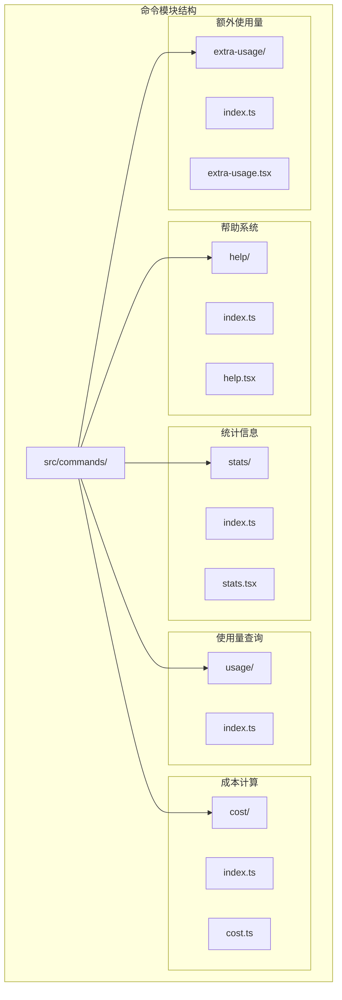
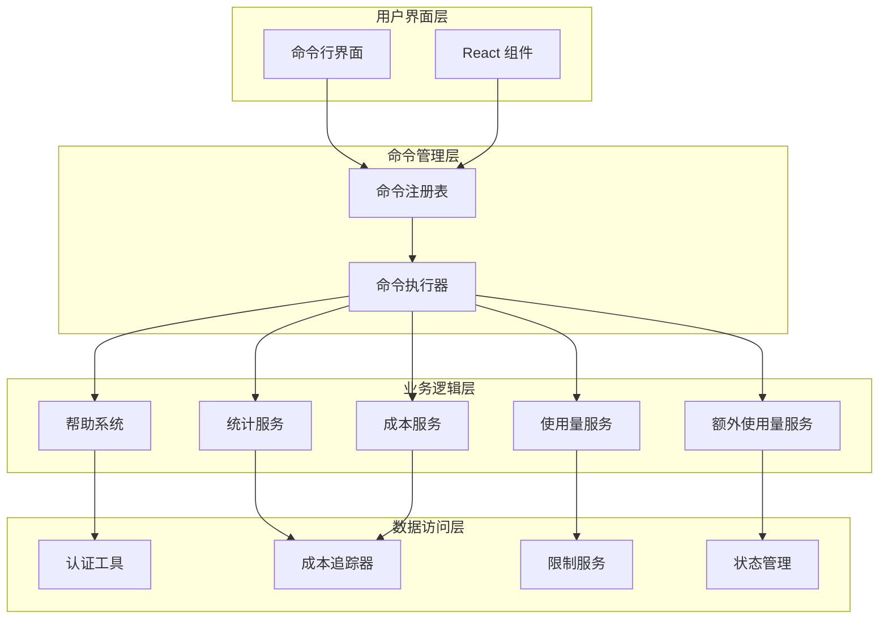
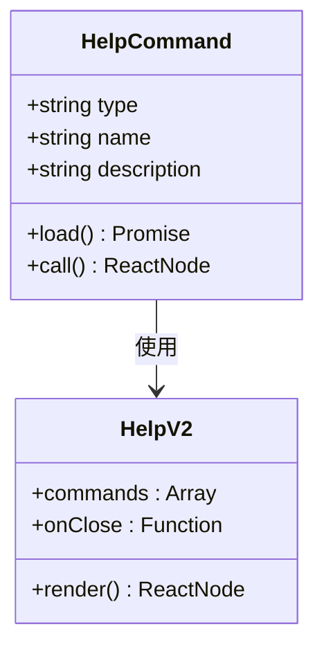
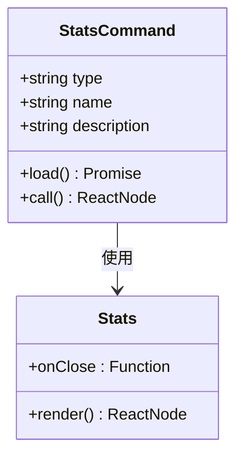
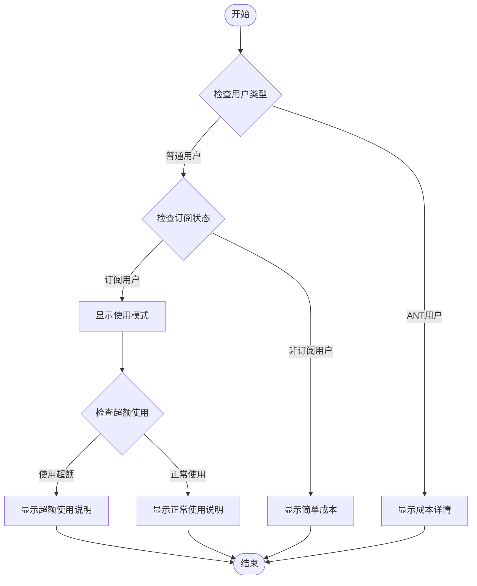
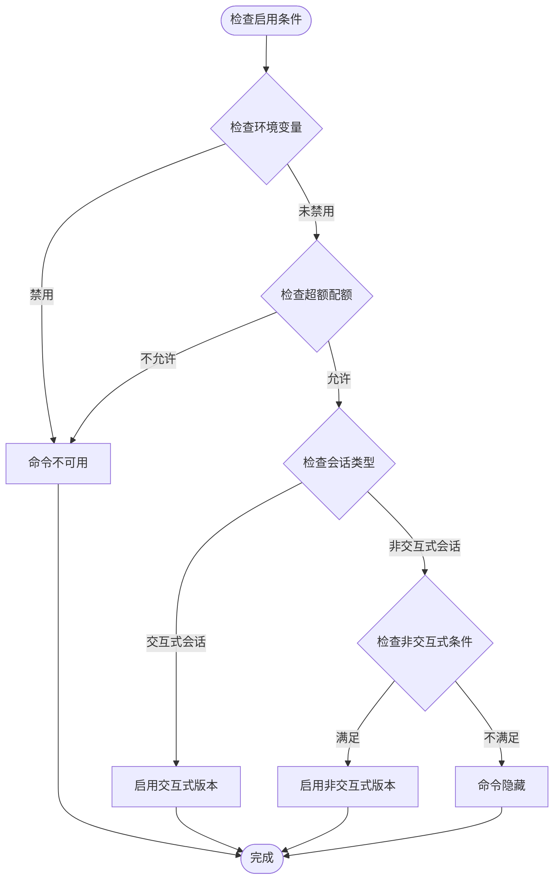
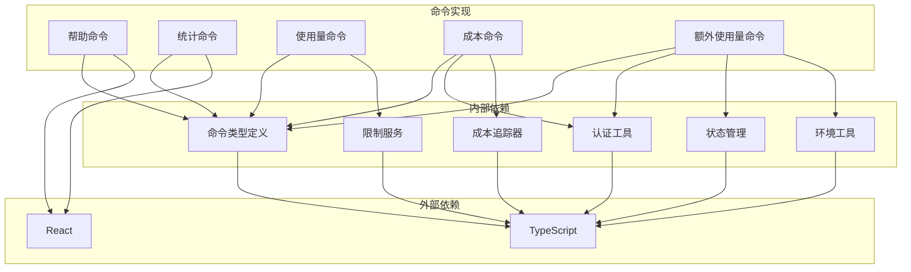

# 实用工具命令

<cite>
**本文档引用的文件**
- [src/commands/help/index.ts](file://src/commands/help/index.ts)
- [src/commands/help/help.tsx](file://src/commands/help/help.tsx)
- [src/commands/stats/index.ts](file://src/commands/stats/index.ts)
- [src/commands/stats/stats.tsx](file://src/commands/stats/stats.tsx)
- [src/commands/usage/index.ts](file://src/commands/usage/index.ts)
- [src/commands/cost/index.ts](file://src/commands/cost/index.ts)
- [src/commands/cost/cost.ts](file://src/commands/cost/cost.ts)
- [src/commands/extra-usage/index.ts](file://src/commands/extra-usage/index.ts)
- [src/commands/extra-usage/extra-usage.tsx](file://src/commands/extra-usage/extra-usage.tsx)
- [src/components/HelpV2/HelpV2.tsx](file://src/components/HelpV2/HelpV2.tsx)
- [src/components/Stats.tsx](file://src/components/Stats.tsx)
- [src/cost-tracker.ts](file://src/cost-tracker.ts)
- [src/services/claudeAiLimits.ts](file://src/services/claudeAiLimits.ts)
- [src/utils/auth.ts](file://src/utils/auth.ts)
- [src/bootstrap/state.ts](file://src/bootstrap/state.ts)
- [src/utils/envUtils.ts](file://src/utils/envUtils.ts)
</cite>

## 目录
1. [简介](#简介)
2. [项目结构](#项目结构)
3. [核心组件](#核心组件)
4. [架构概览](#架构概览)
5. [详细组件分析](#详细组件分析)
6. [依赖关系分析](#依赖关系分析)
7. [性能考虑](#性能考虑)
8. [故障排除指南](#故障排除指南)
9. [结论](#结论)

## 简介

实用工具命令模块提供了辅助功能和信息查询相关的内置命令，包括帮助系统、统计信息、使用量查询、成本计算等实用工具。这些命令旨在提升用户的工作效率，提供实时的系统状态信息和使用情况统计。

本模块采用模块化设计，每个命令都是独立的功能单元，通过统一的命令接口进行管理和调用。所有命令都支持延迟加载机制，以优化启动性能。

## 项目结构

实用工具命令模块位于 `src/commands/` 目录下，按照功能分类组织：

**图表来源**
- [src/commands/help/index.ts:1-13](file://src/commands/help/index.ts#L1-L13)
- [src/commands/stats/index.ts:1-13](file://src/commands/stats/index.ts#L1-L13)
- [src/commands/usage/index.ts:1-12](file://src/commands/usage/index.ts#L1-L12)
- [src/commands/cost/index.ts:1-26](file://src/commands/cost/index.ts#L1-L26)
- [src/commands/extra-usage/index.ts:1-34](file://src/commands/extra-usage/index.ts#L1-L34)

**章节来源**
- [src/commands/help/index.ts:1-13](file://src/commands/help/index.ts#L1-L13)
- [src/commands/stats/index.ts:1-13](file://src/commands/stats/index.ts#L1-L13)
- [src/commands/usage/index.ts:1-12](file://src/commands/usage/index.ts#L1-L12)
- [src/commands/cost/index.ts:1-26](file://src/commands/cost/index.ts#L1-L26)
- [src/commands/extra-usage/index.ts:1-34](file://src/commands/extra-usage/index.ts#L1-L34)

## 核心组件

实用工具命令模块包含以下核心组件：

### 命令接口定义
所有命令都遵循统一的接口规范，支持本地JavaScript执行和React JSX渲染两种模式。

### 延迟加载机制
采用动态导入的方式，只有在命令被调用时才加载对应的实现文件，有效减少启动时间。

### 权限控制
部分命令根据用户权限和订阅状态进行条件性启用或隐藏。

**章节来源**
- [src/commands/help/index.ts:1-13](file://src/commands/help/index.ts#L1-L13)
- [src/commands/stats/index.ts:1-13](file://src/commands/stats/index.ts#L1-L13)
- [src/commands/usage/index.ts:1-12](file://src/commands/usage/index.ts#L1-L12)
- [src/commands/cost/index.ts:1-26](file://src/commands/cost/index.ts#L1-L26)
- [src/commands/extra-usage/index.ts:1-34](file://src/commands/extra-usage/index.ts#L1-L34)

## 架构概览

实用工具命令模块采用分层架构设计，确保功能的模块化和可维护性：

**图表来源**
- [src/commands/help/help.tsx:1-13](file://src/commands/help/help.tsx#L1-L13)
- [src/commands/stats/stats.tsx:1-9](file://src/commands/stats/stats.tsx#L1-L9)
- [src/commands/cost/cost.ts:1-27](file://src/commands/cost/cost.ts#L1-L27)
- [src/commands/extra-usage/extra-usage.tsx:1-19](file://src/commands/extra-usage/extra-usage.tsx#L1-L19)

## 详细组件分析

### 帮助系统命令

帮助系统命令提供完整的命令列表和使用说明，支持交互式查询。

#### 命令定义

**图表来源**
- [src/commands/help/index.ts:3-8](file://src/commands/help/index.ts#L3-L8)
- [src/commands/help/help.tsx:1-13](file://src/commands/help/help.tsx#L1-L13)
- [src/components/HelpV2/HelpV2.tsx](file://src/components/HelpV2/HelpV2.tsx)

#### 输出格式
- **交互式界面**：显示命令分类和详细说明
- **过滤功能**：支持按关键字搜索命令
- **快捷键支持**：提供键盘导航和操作提示

**章节来源**
- [src/commands/help/index.ts:1-13](file://src/commands/help/index.ts#L1-L13)
- [src/commands/help/help.tsx:1-13](file://src/commands/help/help.tsx#L1-L13)

### 统计信息命令

统计信息命令展示用户的使用统计数据和活动情况。

#### 命令定义

**图表来源**
- [src/commands/stats/index.ts:3-8](file://src/commands/stats/index.ts#L3-L8)
- [src/commands/stats/stats.tsx:1-9](file://src/commands/stats/stats.tsx#L1-L9)
- [src/components/Stats.tsx](file://src/components/Stats.tsx)

#### 数据来源和更新频率
- **实时数据**：从成本追踪器获取当前会话数据
- **历史数据**：存储在本地缓存中，定期更新
- **刷新策略**：每次命令调用时重新获取最新数据

**章节来源**
- [src/commands/stats/index.ts:1-13](file://src/commands/stats/index.ts#L1-L13)
- [src/commands/stats/stats.tsx:1-9](file://src/commands/stats/stats.tsx#L1-L9)

### 使用量查询命令

使用量查询命令显示当前计划的使用限制和剩余配额。

#### 命令特性
- **平台特定**：仅在特定平台可用
- **实时查询**：直接从服务端获取最新限制信息
- **简洁输出**：提供清晰的使用量状态说明

**章节来源**
- [src/commands/usage/index.ts:1-12](file://src/commands/usage/index.ts#L1-L12)

### 成本计算命令

成本计算命令显示当前会话的总成本和持续时间。

#### 智能权限控制

**图表来源**
- [src/commands/cost/index.ts:8-18](file://src/commands/cost/index.ts#L8-L18)
- [src/commands/cost/cost.ts:6-24](file://src/commands/cost/cost.ts#L6-L24)

#### 输出格式
- **订阅用户**：显示当前使用的计费模式（订阅或超额）
- **ANT用户**：显示详细的成本分解
- **非订阅用户**：显示总成本信息

**章节来源**
- [src/commands/cost/index.ts:1-26](file://src/commands/cost/index.ts#L1-L26)
- [src/commands/cost/cost.ts:1-27](file://src/commands/cost/cost.ts#L1-L27)

### 额外使用量命令

额外使用量命令允许用户在达到使用限制时继续工作。

#### 智能启用逻辑

**图表来源**
- [src/commands/extra-usage/index.ts:6-11](file://src/commands/extra-usage/index.ts#L6-L11)
- [src/commands/extra-usage/index.ts:13-19](file://src/commands/extra-usage/index.ts#L13-L19)
- [src/commands/extra-usage/index.ts:21-31](file://src/commands/extra-usage/index.ts#L21-L31)

#### 功能特性
- **条件启用**：根据环境配置和权限自动启用
- **登录集成**：支持临时登录以获取超额使用权限
- **会话适配**：区分交互式和非交互式会话的不同行为

**章节来源**
- [src/commands/extra-usage/index.ts:1-34](file://src/commands/extra-usage/index.ts#L1-L34)
- [src/commands/extra-usage/extra-usage.tsx:1-19](file://src/commands/extra-usage/extra-usage.tsx#L1-L19)

## 依赖关系分析

实用工具命令模块的依赖关系如下：

**图表来源**
- [src/commands/help/help.tsx:1-13](file://src/commands/help/help.tsx#L1-L13)
- [src/commands/stats/stats.tsx:1-9](file://src/commands/stats/stats.tsx#L1-L9)
- [src/commands/cost/cost.ts:1-27](file://src/commands/cost/cost.ts#L1-L27)
- [src/commands/extra-usage/extra-usage.tsx:1-19](file://src/commands/extra-usage/extra-usage.tsx#L1-L19)

**章节来源**
- [src/commands/help/help.tsx:1-13](file://src/commands/help/help.tsx#L1-L13)
- [src/commands/stats/stats.tsx:1-9](file://src/commands/stats/stats.tsx#L1-L9)
- [src/commands/cost/cost.ts:1-27](file://src/commands/cost/cost.ts#L1-L27)
- [src/commands/extra-usage/extra-usage.tsx:1-19](file://src/commands/extra-usage/extra-usage.tsx#L1-L19)

## 性能考虑

### 启动性能优化
- **延迟加载**：所有命令实现都采用动态导入，只在需要时加载
- **模块分离**：每个命令都是独立模块，避免不必要的依赖加载
- **按需渲染**：React组件只在命令执行时渲染

### 运行时性能
- **缓存策略**：统计信息和使用量数据采用本地缓存
- **异步处理**：网络请求和数据获取采用异步方式
- **内存管理**：及时清理不再使用的组件和数据

### 资源管理应用场景
1. **开发效率监控**：通过统计命令监控开发者的使用模式
2. **成本控制**：使用成本命令跟踪和控制AI工具使用成本
3. **配额管理**：通过使用量命令管理API调用配额
4. **异常检测**：帮助系统快速定位和解决使用问题

## 故障排除指南

### 常见问题及解决方案

#### 命令无法加载
**症状**：命令显示但无法执行
**原因**：模块加载失败或依赖缺失
**解决方案**：
1. 检查网络连接和包依赖
2. 清理缓存后重新加载
3. 验证命令文件完整性

#### 权限不足
**症状**：某些命令显示为灰色或不可用
**原因**：用户权限或订阅状态不满足要求
**解决方案**：
1. 检查用户账户状态
2. 验证订阅权限
3. 联系管理员获取相应权限

#### 数据显示异常
**症状**：统计信息或成本数据显示不正确
**原因**：数据同步延迟或缓存问题
**解决方案**：
1. 手动刷新数据
2. 清理本地缓存
3. 检查服务器状态

**章节来源**
- [src/commands/cost/cost.ts:6-24](file://src/commands/cost/cost.ts#L6-L24)
- [src/commands/extra-usage/extra-usage.tsx:6-16](file://src/commands/extra-usage/extra-usage.tsx#L6-L16)

## 结论

实用工具命令模块为用户提供了一套完整的辅助功能和信息查询工具。通过模块化的架构设计和智能的权限控制机制，这些命令能够有效地提升用户的工作效率和系统使用体验。

主要优势包括：
- **模块化设计**：每个命令都是独立的功能单元
- **智能权限控制**：根据用户状态动态调整功能可用性
- **性能优化**：采用延迟加载和缓存策略
- **用户体验**：提供直观的交互界面和清晰的输出格式

未来可以考虑的功能扩展：
- 更丰富的统计分析功能
- 自定义报告生成
- 集成更多第三方工具和服务
- 增强的数据可视化能力