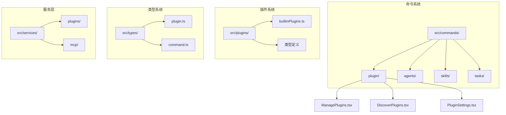
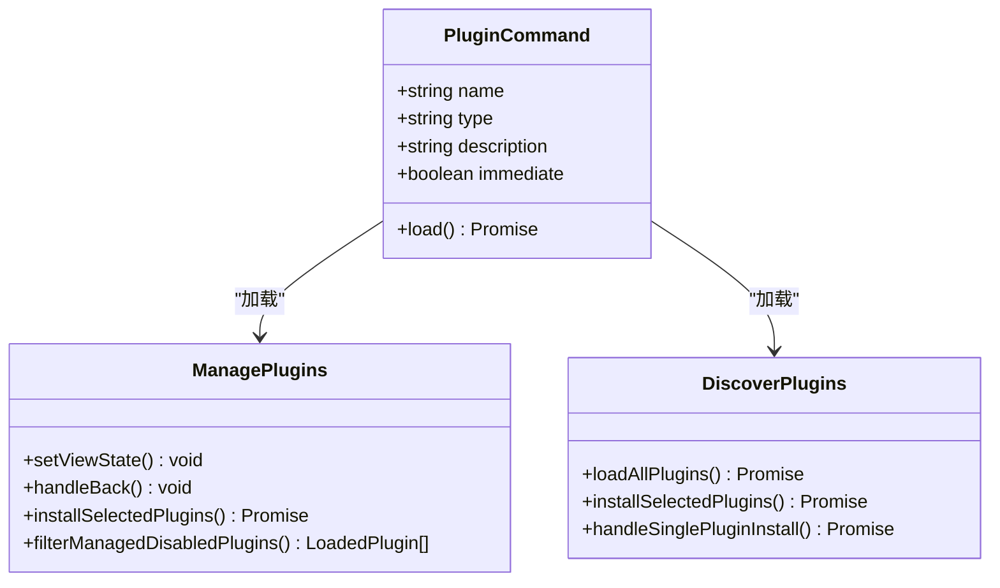
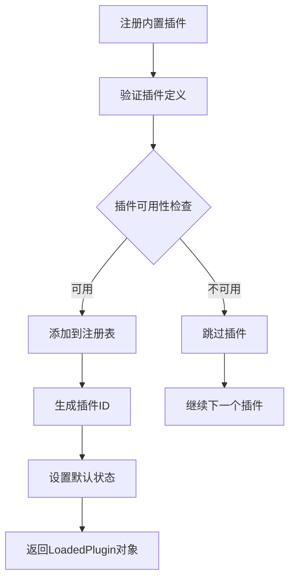
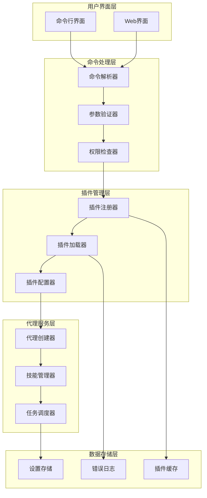
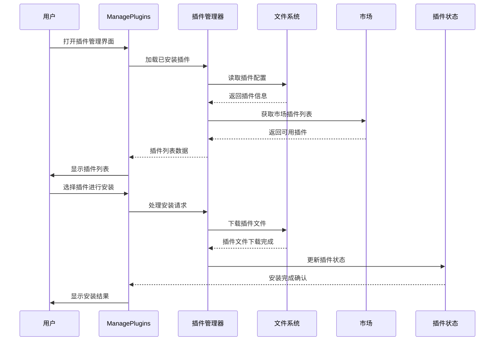
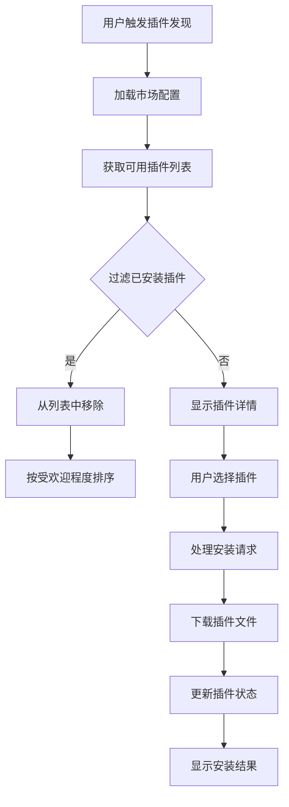
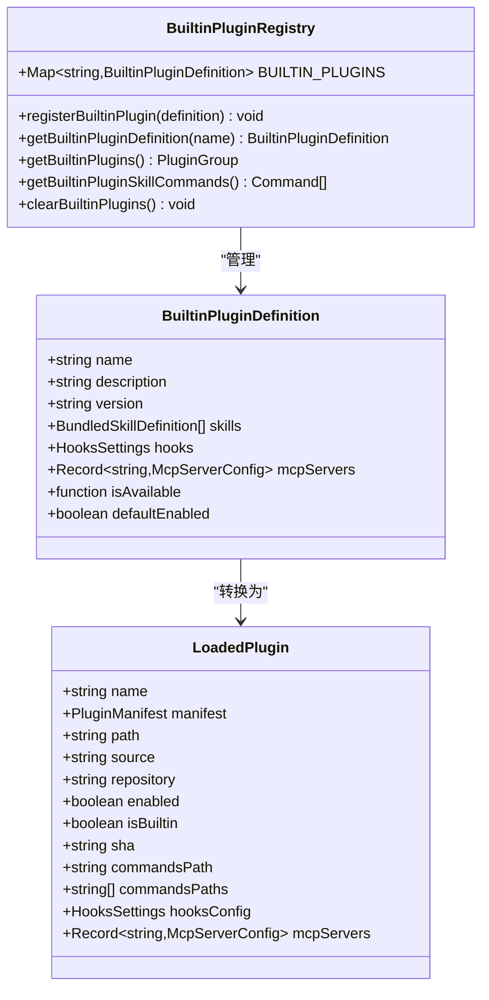
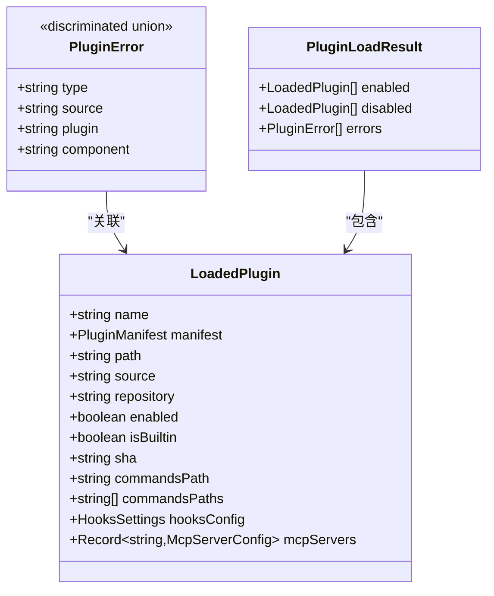
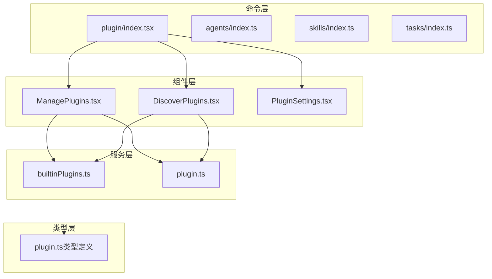
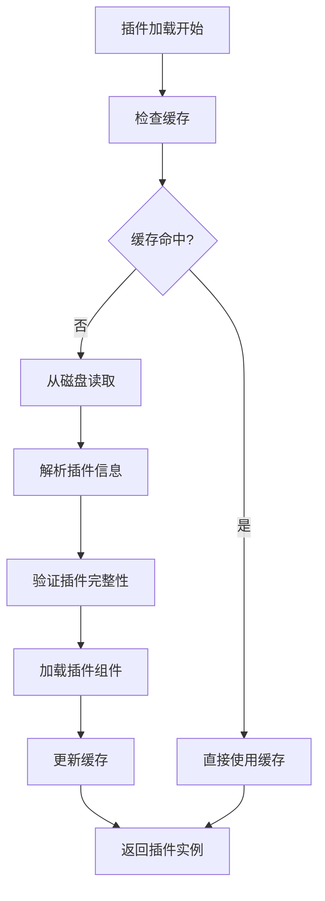

# 插件和代理命令

<cite>
**本文档引用的文件**
- [src/commands/plugin/index.tsx](file://src/commands/plugin/index.tsx)
- [src/commands/plugin/plugin.tsx](file://src/commands/plugin/plugin.tsx)
- [src/commands/plugin/ManagePlugins.tsx](file://src/commands/plugin/ManagePlugins.tsx)
- [src/commands/plugin/DiscoverPlugins.tsx](file://src/commands/plugin/DiscoverPlugins.tsx)
- [src/plugins/builtinPlugins.ts](file://src/plugins/builtinPlugins.ts)
- [src/types/plugin.ts](file://src/types/plugin.ts)
- [src/commands/agents/index.ts](file://src/commands/agents/index.ts)
- [src/commands/skills/index.ts](file://src/commands/skills/index.ts)
- [src/commands/tasks/index.ts](file://src/commands/tasks/index.ts)
</cite>

## 目录
1. [简介](#简介)
2. [项目结构](#项目结构)
3. [核心组件](#核心组件)
4. [架构概览](#架构概览)
5. [详细组件分析](#详细组件分析)
6. [依赖关系分析](#依赖关系分析)
7. [性能考虑](#性能考虑)
8. [故障排除指南](#故障排除指南)
9. [结论](#结论)

## 简介

本文档详细介绍了Claude Code中的插件和代理命令系统，这是一个基于扩展系统的智能代理平台，提供了完整的插件管理、代理创建、技能配置和任务调度功能。该系统支持本地CLI环境和Web应用两种运行模式，通过统一的命令接口提供丰富的扩展能力。

系统的核心特性包括：
- **插件管理系统**：支持插件的发现、安装、配置和管理
- **代理创建工具**：提供智能代理的创建和配置功能
- **技能配置框架**：支持技能的加载、管理和使用
- **任务调度系统**：提供后台任务的管理和执行
- **MCP集成**：支持模型控制协议的服务集成

## 项目结构

插件和代理命令系统主要分布在以下目录结构中：

**图表来源**
- [src/commands/plugin/index.tsx:1-13](file://src/commands/plugin/index.tsx#L1-L13)
- [src/commands/plugin/ManagePlugins.tsx:1-800](file://src/commands/plugin/ManagePlugins.tsx#L1-L800)
- [src/commands/plugin/DiscoverPlugins.tsx:1-781](file://src/commands/plugin/DiscoverPlugins.tsx#L1-L781)

**章节来源**
- [src/commands/plugin/index.tsx:1-13](file://src/commands/plugin/index.tsx#L1-L13)
- [src/commands/plugin/plugin.tsx:1-9](file://src/commands/plugin/plugin.tsx#L1-L9)

## 核心组件

### 插件管理命令

插件管理是整个系统的核心功能，通过`/plugin`命令提供完整的插件生命周期管理：

**图表来源**
- [src/commands/plugin/index.tsx:1-13](file://src/commands/plugin/index.tsx#L1-L13)
- [src/commands/plugin/ManagePlugins.tsx:397-800](file://src/commands/plugin/ManagePlugins.tsx#L397-L800)
- [src/commands/plugin/DiscoverPlugins.tsx:48-225](file://src/commands/plugin/DiscoverPlugins.tsx#L48-L225)

### 内置插件注册器

系统提供了强大的内置插件注册机制，支持插件的动态加载和管理：

**图表来源**
- [src/plugins/builtinPlugins.ts:25-102](file://src/plugins/builtinPlugins.ts#L25-L102)

**章节来源**
- [src/plugins/builtinPlugins.ts:1-161](file://src/plugins/builtinPlugins.ts#L1-L161)

## 架构概览

插件和代理命令系统采用模块化架构设计，通过统一的命令接口和插件注册机制实现松耦合的扩展系统：

**图表来源**
- [src/commands/plugin/ManagePlugins.tsx:1-800](file://src/commands/plugin/ManagePlugins.tsx#L1-L800)
- [src/plugins/builtinPlugins.ts:1-161](file://src/plugins/builtinPlugins.ts#L1-L161)

## 详细组件分析

### 插件管理组件

#### ManagePlugins 组件

ManagePlugins 是插件管理的核心组件，提供了完整的插件管理功能：

**图表来源**
- [src/commands/plugin/ManagePlugins.tsx:397-800](file://src/commands/plugin/ManagePlugins.tsx#L397-L800)
- [src/commands/plugin/DiscoverPlugins.tsx:227-277](file://src/commands/plugin/DiscoverPlugins.tsx#L227-L277)

#### DiscoverPlugins 组件

DiscoverPlugins 提供了插件发现和安装功能：

**图表来源**
- [src/commands/plugin/DiscoverPlugins.tsx:122-225](file://src/commands/plugin/DiscoverPlugins.tsx#L122-L225)

**章节来源**
- [src/commands/plugin/ManagePlugins.tsx:1-800](file://src/commands/plugin/ManagePlugins.tsx#L1-L800)
- [src/commands/plugin/DiscoverPlugins.tsx:1-781](file://src/commands/plugin/DiscoverPlugins.tsx#L1-L781)

### 内置插件系统

#### BuiltinPlugins 注册器

内置插件系统提供了强大的插件注册和管理功能：

**图表来源**
- [src/plugins/builtinPlugins.ts:21-161](file://src/plugins/builtinPlugins.ts#L21-L161)

**章节来源**
- [src/plugins/builtinPlugins.ts:1-161](file://src/plugins/builtinPlugins.ts#L1-L161)

### 类型系统

#### 插件类型定义

系统提供了完整的类型定义来确保类型安全：

**图表来源**
- [src/types/plugin.ts:101-289](file://src/types/plugin.ts#L101-L289)

**章节来源**
- [src/types/plugin.ts:1-365](file://src/types/plugin.ts#L1-L365)

## 依赖关系分析

### 组件间依赖

**图表来源**
- [src/commands/plugin/index.tsx:1-13](file://src/commands/plugin/index.tsx#L1-L13)
- [src/commands/plugin/ManagePlugins.tsx:1-800](file://src/commands/plugin/ManagePlugins.tsx#L1-L800)
- [src/commands/plugin/DiscoverPlugins.tsx:1-781](file://src/commands/plugin/DiscoverPlugins.tsx#L1-L781)
- [src/plugins/builtinPlugins.ts:1-161](file://src/plugins/builtinPlugins.ts#L1-L161)

### 外部依赖

系统依赖于多个外部库和服务：

| 依赖项 | 版本 | 用途 |
|--------|------|------|
| react | 最新版本 | 用户界面渲染 |
| figures | 最新版本 | 图标和符号 |
| fs/promises | Node.js内置 | 文件系统操作 |
| path | Node.js内置 | 路径处理 |
| axios | 最新版本 | HTTP请求 |

**章节来源**
- [src/commands/plugin/ManagePlugins.tsx:1-800](file://src/commands/plugin/ManagePlugins.tsx#L1-L800)
- [src/commands/plugin/DiscoverPlugins.tsx:1-781](file://src/commands/plugin/DiscoverPlugins.tsx#L1-L781)

## 性能考虑

### 插件加载优化

系统采用了多种优化策略来提升插件加载性能：

1. **异步加载**：插件通过异步方式加载，避免阻塞主界面
2. **缓存机制**：插件元数据和配置信息会被缓存以减少重复加载
3. **分页显示**：大量插件时采用分页显示，提升用户体验
4. **懒加载**：插件详情和配置界面采用懒加载策略

### 内存管理

**图表来源**
- [src/plugins/builtinPlugins.ts:57-102](file://src/plugins/builtinPlugins.ts#L57-L102)

## 故障排除指南

### 常见问题及解决方案

#### 插件安装失败

**问题描述**：插件安装过程中出现错误

**可能原因**：
1. 网络连接问题
2. 权限不足
3. 插件文件损坏
4. 兼容性问题

**解决步骤**：
1. 检查网络连接是否正常
2. 确认有足够的磁盘空间
3. 重新启动应用程序
4. 清除插件缓存后重试

#### 插件加载错误

**问题描述**：插件安装成功但无法加载

**诊断方法**：
1. 查看错误日志获取详细信息
2. 验证插件兼容性
3. 检查依赖项是否满足

**解决方法**：
1. 更新到最新版本
2. 安装缺失的依赖项
3. 联系插件开发者

#### 插件冲突

**问题描述**：多个插件同时使用导致冲突

**预防措施**：
1. 在安装前检查插件依赖关系
2. 避免安装功能重复的插件
3. 定期清理不再使用的插件

**章节来源**
- [src/types/plugin.ts:295-363](file://src/types/plugin.ts#L295-L363)

## 结论

插件和代理命令系统是一个功能完整、架构清晰的扩展平台。通过模块化的组件设计和完善的类型系统，该系统为用户提供了一个强大而灵活的插件管理解决方案。

系统的主要优势包括：
- **易用性**：通过直观的命令界面提供完整的插件管理功能
- **可扩展性**：支持内置插件和第三方插件的统一管理
- **可靠性**：完善的错误处理和故障恢复机制
- **性能**：优化的加载策略和缓存机制

未来的发展方向包括：
- 增强插件间的协作能力
- 改进插件开发工具链
- 扩展MCP协议支持
- 优化多用户环境下的插件管理

该系统为构建智能代理和自动化工作流提供了坚实的基础，能够满足从个人开发者到企业用户的各种需求。