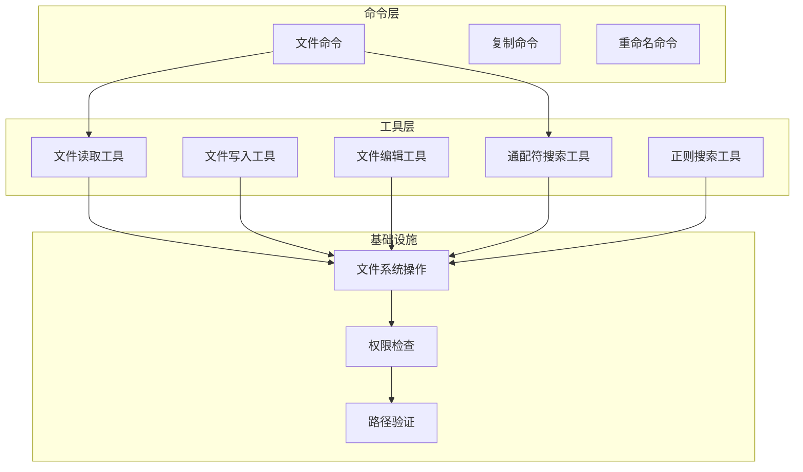
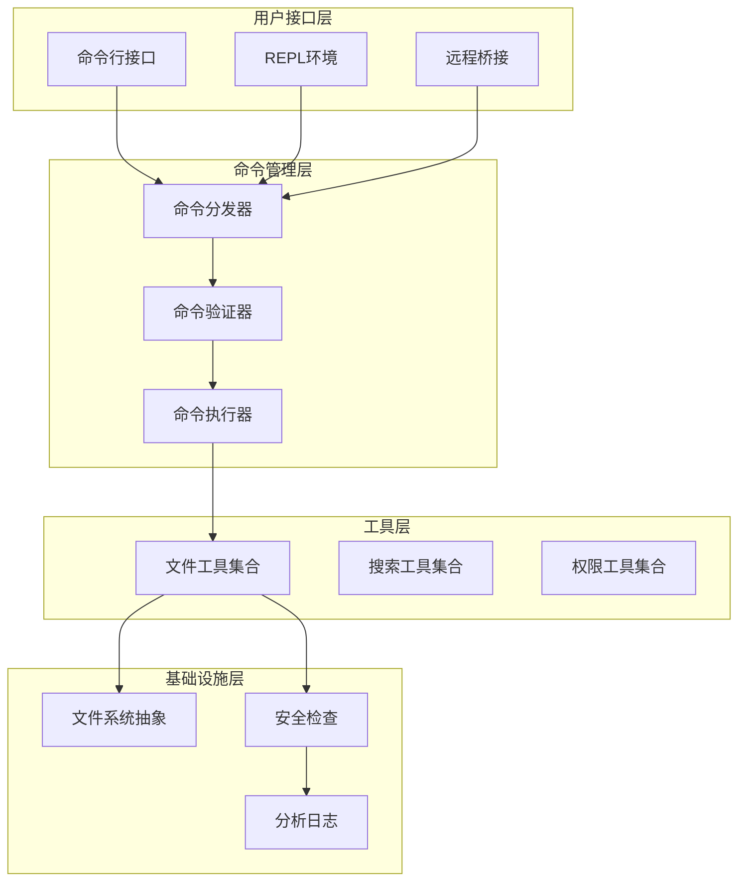
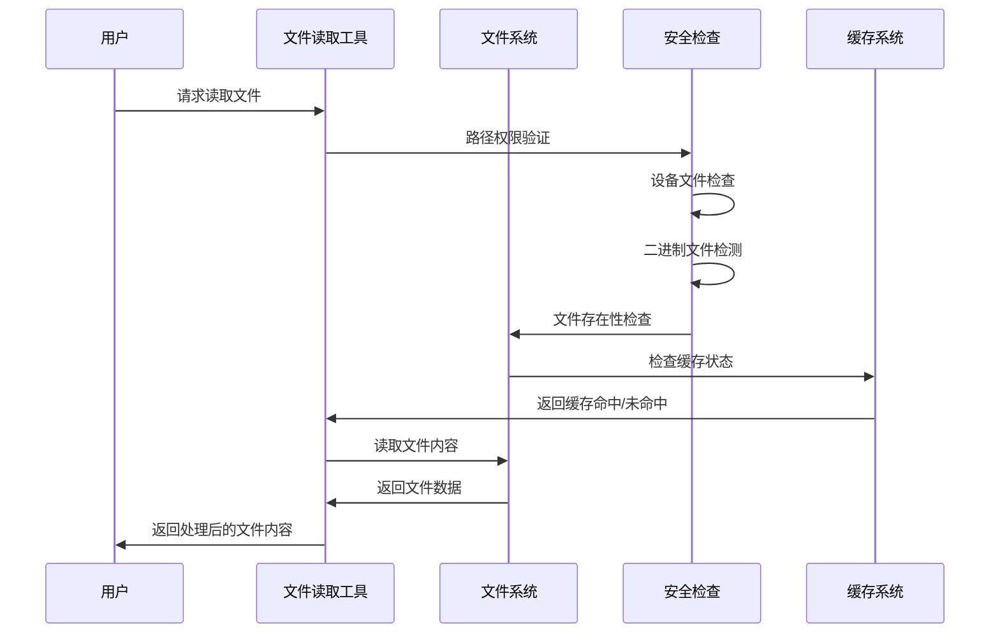
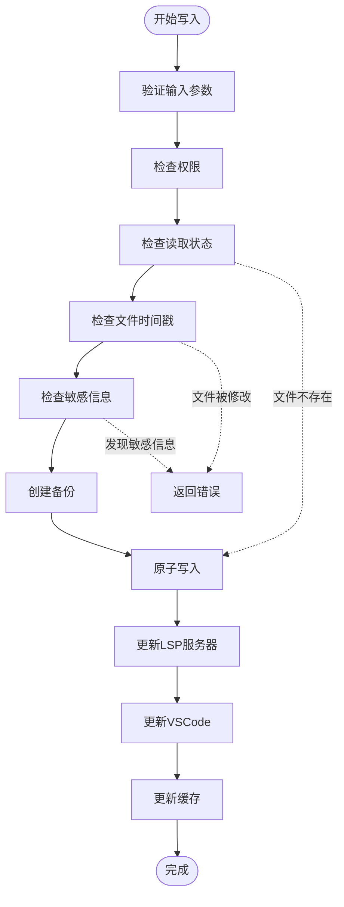
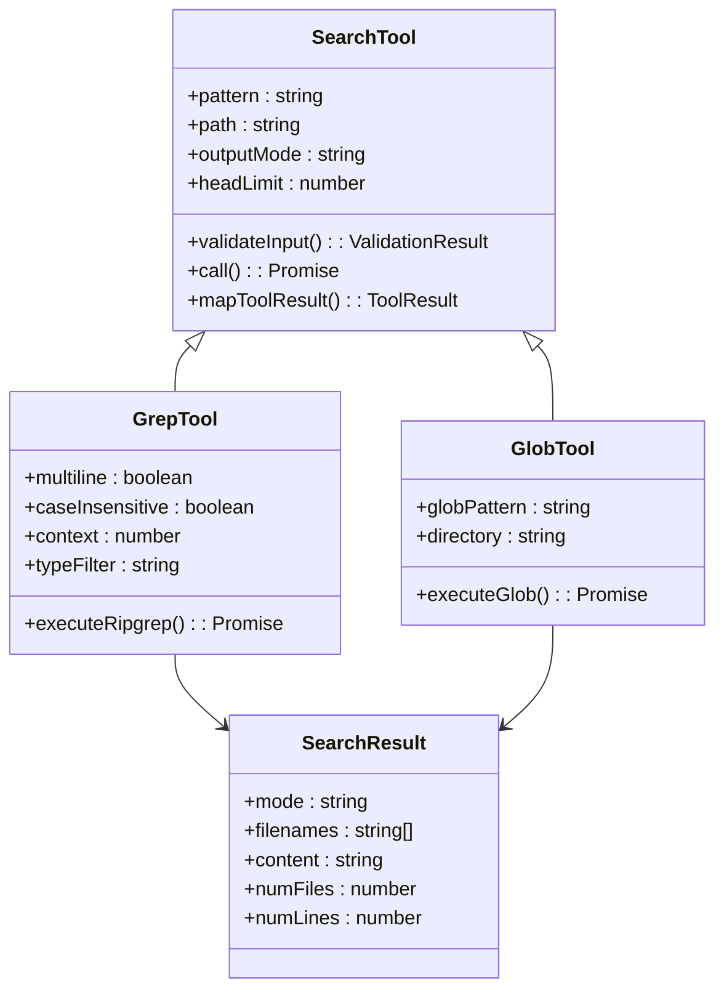
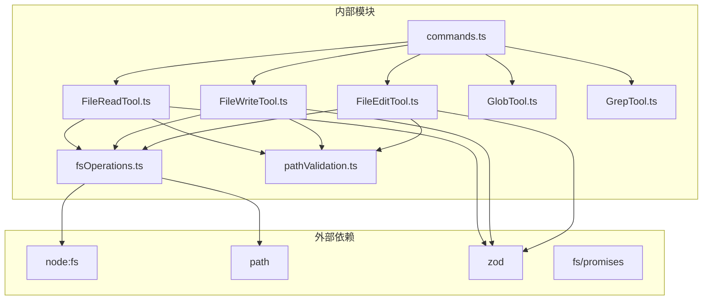

# 文件操作命令

<cite>
**本文档引用的文件**
- [src/commands/files/index.ts](file://src/commands/files/index.ts)
- [src/commands/files/files.ts](file://src/commands/files/files.ts)
- [src/tools/FileReadTool/FileReadTool.ts](file://src/tools/FileReadTool/FileReadTool.ts)
- [src/tools/FileWriteTool/FileWriteTool.ts](file://src/tools/FileWriteTool/FileWriteTool.ts)
- [src/tools/FileEditTool/FileEditTool.ts](file://src/tools/FileEditTool/FileEditTool.ts)
- [src/tools/GlobTool/GlobTool.ts](file://src/tools/GlobTool/GlobTool.ts)
- [src/tools/GrepTool/GrepTool.ts](file://src/tools/GrepTool/GrepTool.ts)
- [src/tools/BashTool/pathValidation.ts](file://src/tools/BashTool/pathValidation.ts)
- [src/tools/BashTool/readOnlyValidation.ts](file://src/tools/BashTool/readOnlyValidation.ts)
- [src/utils/fsOperations.ts](file://src/utils/fsOperations.ts)
- [src/utils/permissions/pathValidation.ts](file://src/utils/permissions/pathValidation.ts)
- [src/commands.ts](file://src/commands.ts)
</cite>

## 目录
1. [简介](#简介)
2. [项目结构](#项目结构)
3. [核心组件](#核心组件)
4. [架构概览](#架构概览)
5. [详细组件分析](#详细组件分析)
6. [依赖关系分析](#依赖关系分析)
7. [性能考虑](#性能考虑)
8. [故障排除指南](#故障排除指南)
9. [结论](#结论)

## 简介

本文档全面介绍了 Claude Code 中的文件操作命令系统，涵盖所有内置的文件相关命令。该系统提供了从基础文件读取到高级搜索和批量操作的完整功能集，支持多种文件类型（文本、图像、PDF、笔记本等），并具备强大的权限控制和安全机制。

系统的核心功能包括：
- 文件读取：支持文本、图像、PDF、Jupyter 笔记本等多种格式
- 文件写入：安全的文件创建和修改操作
- 文件编辑：精确的字符串替换和批量编辑
- 搜索功能：基于正则表达式的全文搜索和通配符匹配
- 路径管理：灵活的路径解析和权限验证

## 项目结构

文件操作命令系统采用模块化设计，主要分布在以下目录中：

**图表来源**
- [src/commands.ts:259-348](file://src/commands.ts#L259-L348)
- [src/tools/FileReadTool/FileReadTool.ts:1-100](file://src/tools/FileReadTool/FileReadTool.ts#L1-L100)
- [src/tools/FileWriteTool/FileWriteTool.ts:1-50](file://src/tools/FileWriteTool/FileWriteTool.ts#L1-L50)
- [src/tools/FileEditTool/FileEditTool.ts:1-50](file://src/tools/FileEditTool/FileEditTool.ts#L1-L50)

**章节来源**
- [src/commands.ts:259-348](file://src/commands.ts#L259-L348)
- [src/commands/files/index.ts:1-15](file://src/commands/files/index.ts#L1-L15)

## 核心组件

### 文件列表命令 (files)

文件列表命令是系统中最简单的文件操作命令，用于显示当前上下文中跟踪的所有文件。

**命令特性：**
- 类型：本地命令 (local)
- 描述：列出当前上下文中所有文件
- 权限：仅限特定用户类型 (USER_TYPE === 'ant')
- 支持非交互式执行

**使用场景：**
- 快速查看当前工作区中的文件状态
- 调试文件上下文问题
- 获取文件清单用于其他操作

**章节来源**
- [src/commands/files/index.ts:1-15](file://src/commands/files/index.ts#L1-L15)
- [src/commands/files/files.ts:1-22](file://src/commands/files/files.ts#L1-L22)

### 文件读取工具 (FileReadTool)

文件读取工具提供了强大的多格式文件读取能力，支持多种文件类型和安全机制。

**核心功能：**
- 多格式支持：文本、图像、PDF、Jupyter 笔记本
- 安全防护：设备文件阻断、二进制文件检测、UNC 路径安全
- 性能优化：内容去重、令牌限制、分页读取
- 错误处理：智能文件名建议、相似文件查找

**技术特性：**
- 支持 PDF 页面范围读取（最多 50 页）
- 图像自动尺寸调整和格式转换
- 笔记本文件的单元格提取和处理
- 内容去重机制减少重复传输

**章节来源**
- [src/tools/FileReadTool/FileReadTool.ts:1-200](file://src/tools/FileReadTool/FileReadTool.ts#L1-L200)
- [src/tools/FileReadTool/FileReadTool.ts:496-651](file://src/tools/FileReadTool/FileReadTool.ts#L496-L651)

### 文件写入工具 (FileWriteTool)

文件写入工具实现了安全的文件创建和修改操作，确保数据一致性和完整性。

**安全机制：**
- 读取后写入验证：防止并发修改冲突
- 团队内存文件保护：防止敏感信息泄露
- 路径权限检查：基于规则的访问控制
- UNC 路径安全：Windows 网络路径防护

**功能特性：**
- 原子性写入：确保文件完整性
- 差异计算：生成详细的变更记录
- LSP 集成：通知语言服务器文件变化
- VSCode 同步：更新文件差异视图

**章节来源**
- [src/tools/FileWriteTool/FileWriteTool.ts:1-100](file://src/tools/FileWriteTool/FileWriteTool.ts#L1-L100)
- [src/tools/FileWriteTool/FileWriteTool.ts:223-417](file://src/tools/FileWriteTool/FileWriteTool.ts#L223-L417)

### 文件编辑工具 (FileEditTool)

文件编辑工具提供了精确的字符串替换功能，支持单次和批量编辑操作。

**编辑模式：**
- 单次替换：精确匹配并替换第一个出现的字符串
- 批量替换：替换所有匹配的字符串实例
- 引号风格保持：维护原始文件的引号风格

**安全验证：**
- 文件存在性检查
- 字符串匹配验证
- 多次匹配警告
- 设置文件特殊验证

**章节来源**
- [src/tools/FileEditTool/FileEditTool.ts:1-100](file://src/tools/FileEditTool/FileEditTool.ts#L1-L100)
- [src/tools/FileEditTool/FileEditTool.ts:137-362](file://src/tools/FileEditTool/FileEditTool.ts#L137-L362)

### 通配符搜索工具 (GlobTool)

通配符搜索工具提供了高效的文件名模式匹配功能。

**搜索特性：**
- 支持标准通配符：*, ?, []
- 目录遍历：递归搜索子目录
- 结果限制：默认最多 100 个结果
- 路径相对化：节省令牌空间

**权限控制：**
- 目录存在性验证
- 路径权限检查
- UNC 路径安全处理

**章节来源**
- [src/tools/GlobTool/GlobTool.ts:1-100](file://src/tools/GlobTool/GlobTool.ts#L1-L100)
- [src/tools/GlobTool/GlobTool.ts:154-176](file://src/tools/GlobTool/GlobTool.ts#L154-L176)

### 正则搜索工具 (GrepTool)

正则搜索工具基于 ripgrep 实现了高性能的全文搜索功能。

**搜索能力：**
- 正则表达式支持
- 多输出模式：内容、文件列表、计数
- 上下文显示：前后行数控制
- 文件类型过滤：针对特定编程语言

**性能优化：**
- 结果限制：默认 250 行，可设置上限
- 排序策略：按最后修改时间排序
- 路径相对化：减少输出大小
- VCS 目录排除：避免版本控制元数据干扰

**章节来源**
- [src/tools/GrepTool/GrepTool.ts:1-100](file://src/tools/GrepTool/GrepTool.ts#L1-L100)
- [src/tools/GrepTool/GrepTool.ts:310-380](file://src/tools/GrepTool/GrepTool.ts#L310-L380)

## 架构概览

文件操作命令系统采用分层架构设计，确保功能模块之间的清晰分离和高内聚低耦合。

**图表来源**
- [src/commands.ts:478-519](file://src/commands.ts#L478-L519)
- [src/tools/BashTool/pathValidation.ts:552-589](file://src/tools/BashTool/pathValidation.ts#L552-L589)

**章节来源**
- [src/commands.ts:478-519](file://src/commands.ts#L478-L519)

## 详细组件分析

### 文件读取流程

文件读取操作涉及多个安全检查和优化步骤：

**图表来源**
- [src/tools/FileReadTool/FileReadTool.ts:398-495](file://src/tools/FileReadTool/FileReadTool.ts#L398-L495)
- [src/tools/FileReadTool/FileReadTool.ts:594-651](file://src/tools/FileReadTool/FileReadTool.ts#L594-L651)

### 文件写入流程

文件写入操作确保数据一致性和安全性：

**图表来源**
- [src/tools/FileWriteTool/FileWriteTool.ts:153-222](file://src/tools/FileWriteTool/FileWriteTool.ts#L153-L222)
- [src/tools/FileWriteTool/FileWriteTool.ts:223-417](file://src/tools/FileWriteTool/FileWriteTool.ts#L223-L417)

### 搜索功能实现

搜索功能根据不同的需求提供多种实现方式：

**图表来源**
- [src/tools/GrepTool/GrepTool.ts:160-310](file://src/tools/GrepTool/GrepTool.ts#L160-L310)
- [src/tools/GlobTool/GlobTool.ts:57-154](file://src/tools/GlobTool/GlobTool.ts#L57-L154)

**章节来源**
- [src/tools/GrepTool/GrepTool.ts:160-310](file://src/tools/GrepTool/GrepTool.ts#L160-L310)
- [src/tools/GlobTool/GlobTool.ts:57-154](file://src/tools/GlobTool/GlobTool.ts#L57-L154)

## 依赖关系分析

文件操作命令系统的依赖关系体现了清晰的分层架构：

**图表来源**
- [src/commands.ts:1-50](file://src/commands.ts#L1-L50)
- [src/utils/fsOperations.ts:1-50](file://src/utils/fsOperations.ts#L1-L50)

**章节来源**
- [src/commands.ts:1-50](file://src/commands.ts#L1-L50)
- [src/utils/fsOperations.ts:1-50](file://src/utils/fsOperations.ts#L1-L50)

## 性能考虑

文件操作命令系统在设计时充分考虑了性能优化：

### 缓存策略
- **文件读取去重**：相同范围的重复读取直接返回缓存
- **技能目录发现**：后台异步加载，不影响主流程
- **结果限制**：默认 250 行限制，避免大量数据传输

### I/O 优化
- **路径相对化**：减少输出大小，节省令牌
- **批量操作**：Promise.allSettled 处理多个文件操作
- **延迟加载**：技能和插件按需加载

### 内存管理
- **流式处理**：大文件分块读取
- **弱引用缓存**：自动垃圾回收
- **超时控制**：防止长时间阻塞

## 故障排除指南

### 常见错误及解决方案

**文件不存在错误**
- 症状：提示文件不存在，提供相似文件建议
- 解决方案：检查文件路径拼写，使用 `files` 命令查看可用文件

**权限不足错误**
- 症状：拒绝访问特定目录或文件
- 解决方案：检查权限配置，使用允许规则覆盖

**文件过大错误**
- 症状：超过最大可编辑文件大小限制
- 解决方案：使用搜索工具定位目标，分批处理

**并发修改错误**
- 症状：文件在读取后被修改
- 解决方案：重新读取文件，然后进行写入操作

### 调试技巧

**启用详细日志**
- 使用调试模式查看完整的执行流程
- 检查权限验证过程
- 监控文件系统调用

**性能监控**
- 关注搜索结果数量
- 监控文件读取大小
- 检查缓存命中率

**章节来源**
- [src/tools/FileReadTool/FileReadTool.ts:609-650](file://src/tools/FileReadTool/FileReadTool.ts#L609-L650)
- [src/tools/FileWriteTool/FileWriteTool.ts:198-222](file://src/tools/FileWriteTool/FileWriteTool.ts#L198-L222)
- [src/tools/FileEditTool/FileEditTool.ts:275-312](file://src/tools/FileEditTool/FileEditTool.ts#L275-L312)

## 结论

Claude Code 的文件操作命令系统展现了现代开发工具的先进设计理念。通过模块化架构、强大的安全机制和性能优化，系统为开发者提供了高效、可靠的文件操作体验。

**主要优势：**
- **安全性优先**：多层次的安全检查和权限控制
- **性能优化**：智能缓存、流式处理和结果限制
- **功能丰富**：支持多种文件格式和操作模式
- **易于使用**：直观的命令接口和智能错误处理

**未来发展方向：**
- 进一步优化大文件处理性能
- 扩展更多文件格式支持
- 增强协作功能
- 提供更丰富的可视化界面

该系统为构建复杂文件操作场景提供了坚实的基础，无论是个人开发者还是团队协作都能从中受益。