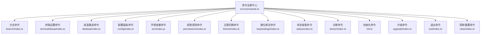
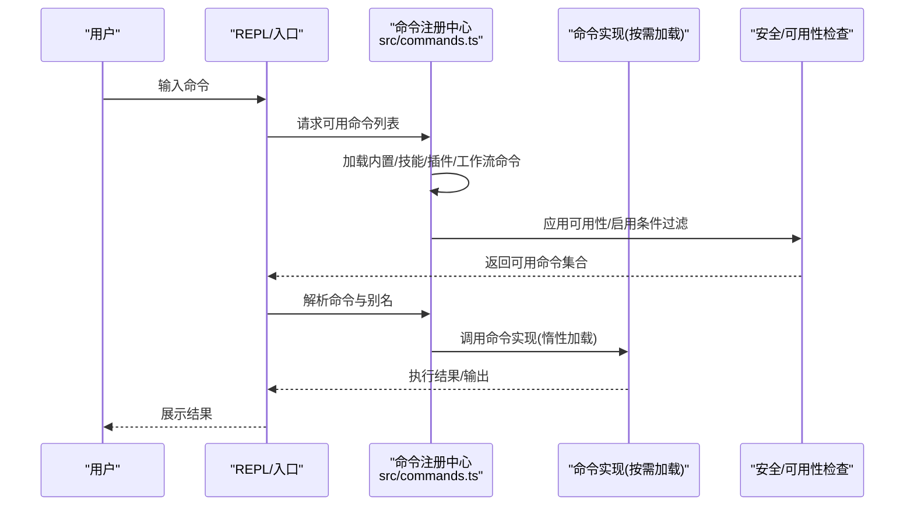
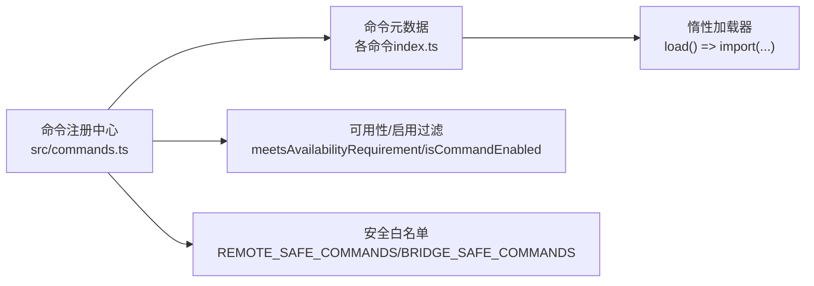

# 系统命令

<cite>
**本文引用的文件**
- [src/commands.ts](file://src/commands.ts)
- [docs/commands.md](file://docs/commands.md)
- [src/commands/branch/index.ts](file://src/commands/branch/index.ts)
- [src/commands/terminalSetup/index.ts](file://src/commands/terminalSetup/index.ts)
- [src/commands/desktop/index.ts](file://src/commands/desktop/index.ts)
- [src/commands/config/index.ts](file://src/commands/config/index.ts)
- [src/commands/env/index.js](file://src/commands/env/index.js)
- [src/commands/permissions/index.ts](file://src/commands/permissions/index.ts)
- [src/commands/theme/index.ts](file://src/commands/theme/index.ts)
- [src/commands/keybindings/index.ts](file://src/commands/keybindings/index.ts)
- [src/commands/status/index.ts](file://src/commands/status/index.ts)
- [src/commands/doctor/index.ts](file://src/commands/doctor/index.ts)
- [src/commands/init.ts](file://src/commands/init.ts)
- [src/commands/upgrade/index.ts](file://src/commands/upgrade/index.ts)
- [src/commands/exit/index.ts](file://src/commands/exit/index.ts)
- [src/commands/clear/index.ts](file://src/commands/clear/index.ts)
</cite>

## 目录
1. [简介](#简介)
2. [项目结构](#项目结构)
3. [核心组件](#核心组件)
4. [架构总览](#架构总览)
5. [详细组件分析](#详细组件分析)
6. [依赖关系分析](#依赖关系分析)
7. [性能考量](#性能考量)
8. [故障排除指南](#故障排除指南)
9. [结论](#结论)
10. [附录](#附录)

## 简介
本章节面向系统管理与环境配置相关的内置命令，聚焦于分支管理、进程控制、终端设置、桌面集成等能力。文档将按命令类型与功能域组织，逐项说明命令用途、参数与选项、执行效果、系统兼容性与权限要求，并提供配置优化与故障排除的实际案例。

## 项目结构
命令系统由统一注册入口集中导出，内置命令在注册表中声明其元数据（名称、别名、可用性、是否立即执行、加载方式等），并通过惰性加载减少启动开销。命令分类覆盖系统管理、环境配置、终端与桌面集成、诊断与状态、安装与升级、会话清理等场景。

图表来源
- [src/commands.ts:259-348](file://src/commands.ts#L259-L348)
- [src/commands/branch/index.ts:4-12](file://src/commands/branch/index.ts#L4-L12)
- [src/commands/terminalSetup/index.ts:12-21](file://src/commands/terminalSetup/index.ts#L12-L21)
- [src/commands/desktop/index.ts:13-24](file://src/commands/desktop/index.ts#L13-L24)
- [src/commands/config/index.ts:3-9](file://src/commands/config/index.ts#L3-L9)
- [src/commands/env/index.js:1-4](file://src/commands/env/index.js#L1-L4)
- [src/commands/permissions/index.ts:3-9](file://src/commands/permissions/index.ts#L3-L9)
- [src/commands/theme/index.ts:3-8](file://src/commands/theme/index.ts#L3-L8)
- [src/commands/keybindings/index.ts:4-11](file://src/commands/keybindings/index.ts#L4-L11)
- [src/commands/status/index.ts:3-10](file://src/commands/status/index.ts#L3-L10)
- [src/commands/doctor/index.ts:4-10](file://src/commands/doctor/index.ts#L4-L10)
- [src/commands/init.ts:226-254](file://src/commands/init.ts#L226-L254)
- [src/commands/upgrade/index.ts:5-14](file://src/commands/upgrade/index.ts#L5-L14)
- [src/commands/exit/index.ts:3-10](file://src/commands/exit/index.ts#L3-L10)
- [src/commands/clear/index.ts:10-17](file://src/commands/clear/index.ts#L10-L17)

章节来源
- [src/commands.ts:259-348](file://src/commands.ts#L259-L348)
- [docs/commands.md:1-212](file://docs/commands.md#L1-L212)

## 核心组件
- 命令注册与发现：通过集中注册表聚合所有命令，支持动态技能、插件与工作流命令注入；提供可用性过滤与启用状态检查。
- 惰性加载：命令定义仅包含元信息与加载函数，实际实现按需导入，降低启动时内存与I/O压力。
- 远程/桥接安全白名单：区分本地JSX、提示型（可模型调用）、本地文本型三类命令的安全策略，确保移动端/远程模式下的安全可控。
- 可见性与平台限制：部分命令根据平台或订阅等级进行隐藏或禁用，避免无效交互。

章节来源
- [src/commands.ts:478-519](file://src/commands.ts#L478-L519)
- [src/commands.ts:621-688](file://src/commands.ts#L621-L688)
- [src/commands.ts:690-721](file://src/commands.ts#L690-L721)

## 架构总览
命令系统采用“声明式注册 + 惰性加载 + 安全白名单”的架构，命令在运行期被发现、过滤与执行。下图展示命令注册、可用性检查与执行路径：

图表来源
- [src/commands.ts:478-519](file://src/commands.ts#L478-L519)
- [src/commands.ts:690-721](file://src/commands.ts#L690-L721)

## 详细组件分析

### 分支管理：/branch
- 类型：本地JSX命令
- 别名：在特定特性开关开启时为“fork”（若独立的/fork命令不存在）
- 参数与选项：无显式参数；通过对话流程选择分支点
- 执行效果：在当前会话处创建一个分支，便于并行探索不同方案
- 兼容性与权限：无特殊权限要求；别名行为受特性开关影响
- 使用建议：结合会话快照使用，便于回溯与对比

章节来源
- [src/commands/branch/index.ts:4-12](file://src/commands/branch/index.ts#L4-L12)

### 终端设置：/terminal-setup
- 类型：本地JSX命令
- 描述：针对不同终端启用/安装换行键绑定与视觉提示；对原生支持CSI u协议的终端自动隐藏
- 参数与选项：无
- 执行效果：根据当前终端类型安装或启用快捷键绑定，改善输入体验
- 兼容性与权限：仅在识别到受支持的终端时可见；无需额外权限
- 使用建议：首次进入新终端时运行，提升交互效率

章节来源
- [src/commands/terminalSetup/index.ts:12-21](file://src/commands/terminalSetup/index.ts#L12-L21)

### 桌面集成：/desktop
- 类型：本地JSX命令
- 别名：app
- 描述：在支持的平台上继续当前会话于Claude Desktop
- 参数与选项：无
- 执行效果：将当前会话迁移至桌面应用，获得更丰富的界面与能力
- 兼容性与权限：仅在macOS或Windows x64上可见；需要Claude AI订阅
- 使用建议：在桌面环境工作时使用，避免重复在CLI中进行复杂操作

章节来源
- [src/commands/desktop/index.ts:13-24](file://src/commands/desktop/index.ts#L13-L24)

### 配置管理：/config
- 类型：本地JSX命令
- 别名：settings
- 描述：打开配置面板，统一管理各项设置
- 参数与选项：无
- 执行效果：以图形化界面展示与编辑配置项
- 兼容性与权限：无特殊权限要求
- 使用建议：优先通过此命令调整常用设置，避免直接修改底层配置文件

章节来源
- [src/commands/config/index.ts:3-9](file://src/commands/config/index.ts#L3-L9)

### 环境变量：/env
- 类型：占位/存根命令
- 当前状态：默认禁用且隐藏
- 描述：预留用于查看/管理环境变量的接口
- 参数与选项：无
- 执行效果：暂不可用
- 兼容性与权限：无
- 使用建议：关注后续版本更新

章节来源
- [src/commands/env/index.js:1-4](file://src/commands/env/index.js#L1-L4)

### 权限规则：/permissions
- 类型：本地JSX命令
- 别名：allowed-tools
- 描述：管理允许与拒绝工具的权限规则
- 参数与选项：无
- 执行效果：以可视化界面管理工具访问控制
- 兼容性与权限：无
- 使用建议：在团队协作或受限环境中谨慎放权

章节来源
- [src/commands/permissions/index.ts:3-9](file://src/commands/permissions/index.ts#L3-L9)

### 主题切换：/theme
- 类型：本地JSX命令
- 描述：切换终端主题
- 参数与选项：无
- 执行效果：即时切换配色方案
- 兼容性与权限：无
- 使用建议：根据屏幕亮度与个人偏好调整

章节来源
- [src/commands/theme/index.ts:3-8](file://src/commands/theme/index.ts#L3-L8)

### 键位绑定：/keybindings
- 类型：本地命令（非交互）
- 描述：打开或创建键位绑定配置文件
- 启用条件：取决于键位自定义功能是否启用
- 支持非交互：否
- 执行效果：生成或打开用户自定义键位映射文件
- 兼容性与权限：无
- 使用建议：在需要深度定制输入习惯时启用

章节来源
- [src/commands/keybindings/index.ts:4-11](file://src/commands/keybindings/index.ts#L4-L11)

### 状态查看：/status
- 类型：本地JSX命令
- 描述：显示版本、模型、账户、API连通性与工具状态
- 参数与选项：无
- 执行效果：汇总系统健康度与会话状态
- 兼容性与权限：无
- 使用建议：定期检查以确认服务可用性

章节来源
- [src/commands/status/index.ts:3-10](file://src/commands/status/index.ts#L3-L10)

### 诊断：/doctor
- 类型：本地JSX命令
- 描述：诊断并验证安装与设置
- 启用条件：可通过环境变量禁用
- 执行效果：检测常见问题并给出修复建议
- 兼容性与权限：无
- 使用建议：遇到异常时优先运行

章节来源
- [src/commands/doctor/index.ts:4-10](file://src/commands/doctor/index.ts#L4-L10)

### 初始化：/init
- 类型：提示型命令（可模型调用）
- 描述：初始化CLAUDE.md与可选技能/钩子；新版提供交互式引导
- 参数与选项：无显式参数；通过多阶段对话收集用户偏好
- 执行效果：生成项目级与个人级指导文件，建议技能与钩子配置
- 兼容性与权限：无硬性权限要求；新版模式下有特性开关与环境变量控制
- 使用建议：首次接入新仓库时运行，持续迭代完善

章节来源
- [src/commands/init.ts:226-254](file://src/commands/init.ts#L226-L254)

### 升级：/upgrade
- 类型：本地JSX命令
- 描述：升级到更高限额与更多Opus额度
- 启用条件：未禁用且非企业订阅
- 执行效果：引导前往升级页面
- 兼容性与权限：需要Claude AI订阅
- 使用建议：在额度紧张或需要更强模型时使用

章节来源
- [src/commands/upgrade/index.ts:5-14](file://src/commands/upgrade/index.ts#L5-L14)

### 退出：/exit
- 类型：本地JSX命令
- 别名：quit
- 描述：退出REPL
- 执行效果：结束当前会话
- 兼容性与权限：无
- 使用建议：在完成工作后优雅退出

章节来源
- [src/commands/exit/index.ts:3-10](file://src/commands/exit/index.ts#L3-L10)

### 清理：/clear
- 类型：本地命令
- 别名：reset, new
- 描述：清空会话历史并释放上下文空间
- 执行效果：新建干净会话
- 兼容性与权限：无
- 使用建议：上下文过长导致响应变慢时使用

章节来源
- [src/commands/clear/index.ts:10-17](file://src/commands/clear/index.ts#L10-L17)

## 依赖关系分析
- 命令注册中心依赖各命令模块的元数据定义与惰性加载器
- 平台与订阅能力通过可用性字段与启用条件控制命令可见性
- 安全白名单区分命令类型，确保远程/移动端安全

图表来源
- [src/commands.ts:419-445](file://src/commands.ts#L419-L445)
- [src/commands.ts:621-688](file://src/commands.ts#L621-L688)

章节来源
- [src/commands.ts:419-445](file://src/commands.ts#L419-L445)
- [src/commands.ts:621-688](file://src/commands.ts#L621-L688)

## 性能考量
- 惰性加载：命令定义仅包含元信息与加载函数，避免一次性加载全部实现，显著降低启动时间与内存占用。
- 缓存与去重：命令列表与技能缓存采用记忆化，动态技能插入时进行去重处理，避免重复渲染与计算。
- 远程安全：仅允许安全命令在远程/桥接通道执行，减少潜在阻塞与资源消耗。

章节来源
- [src/commands.ts:451-471](file://src/commands.ts#L451-L471)
- [src/commands.ts:525-541](file://src/commands.ts#L525-L541)
- [src/commands.ts:621-688](file://src/commands.ts#L621-L688)

## 故障排除指南
- 命令不可见或被隐藏
  - 检查平台与订阅等级是否满足可用性要求（如桌面命令仅在macOS/Win x64可见，升级命令需非企业订阅）。
  - 查看特性开关与环境变量是否禁用了相关命令（如诊断命令可通过环境变量禁用）。
- 键位绑定无法生效
  - 确认键位自定义功能已启用；必要时重新生成配置文件。
- 终端快捷键不生效
  - 确认当前终端是否原生支持CSI u协议；否则按提示安装/启用相应快捷键绑定。
- 会话上下文过长导致卡顿
  - 使用清理命令释放上下文空间，或使用压缩/摘要类命令减少上下文体积。
- 诊断失败或网络异常
  - 运行诊断命令收集系统状态；根据提示检查代理、证书与网络连通性。

章节来源
- [src/commands/desktop/index.ts:13-24](file://src/commands/desktop/index.ts#L13-L24)
- [src/commands/upgrade/index.ts:5-14](file://src/commands/upgrade/index.ts#L5-L14)
- [src/commands/doctor/index.ts:4-10](file://src/commands/doctor/index.ts#L4-L10)
- [src/commands/keybindings/index.ts:4-11](file://src/commands/keybindings/index.ts#L4-L11)
- [src/commands/terminalSetup/index.ts:12-21](file://src/commands/terminalSetup/index.ts#L12-L21)
- [src/commands/clear/index.ts:10-17](file://src/commands/clear/index.ts#L10-L17)

## 结论
系统命令围绕“声明式注册、惰性加载、安全白名单”三大支柱构建，既保证了灵活性与扩展性，又兼顾了安全性与性能。对于系统管理与环境配置，推荐优先使用配置面板、主题切换、键位绑定、终端设置与诊断命令，配合分支与清理命令形成高效的工作流。

## 附录
- 命令参考总览可参阅官方文档索引，按功能域快速定位具体命令与实现位置。

章节来源
- [docs/commands.md:1-212](file://docs/commands.md#L1-L212)