# 命令发现系统

<cite>
**本文档引用的文件**
- [commands.ts](file://src/commands.ts)
- [command 类型定义](file://src/types/command.ts)
- [技能加载器](file://src/skills/loadSkillsDir.ts)
- [插件命令加载器](file://src/utils/plugins/loadPluginCommands.ts)
- [内置插件注册器](file://src/plugins/builtinPlugins.ts)
- [捆绑技能管理器](file://src/skills/bundledSkills.ts)
- [MCP 技能构建器](file://src/skills/mcpSkillBuilders.ts)
- [插件加载器](file://src/utils/plugins/pluginLoader.ts)
- [认证工具](file://src/utils/auth.ts)
- [启动状态管理](file://src/bootstrap/state.ts)
- [初始化命令](file://src/commands/init.ts)
- [命令移动到插件适配器](file://src/commands/createMovedToPluginCommand.ts)
</cite>

## 目录
1. [简介](#简介)
2. [项目结构](#项目结构)
3. [核心组件](#核心组件)
4. [架构概览](#架构概览)
5. [详细组件分析](#详细组件分析)
6. [依赖关系分析](#依赖关系分析)
7. [性能考虑](#性能考虑)
8. [故障排除指南](#故障排除指南)
9. [结论](#结论)

## 简介

命令发现系统是 Claude Code 的核心功能之一，负责动态发现、加载和管理各种类型的命令。该系统支持静态命令注册、动态技能加载、插件命令发现等多种机制，为用户提供了灵活且可扩展的命令执行环境。

系统的主要特点包括：
- **多源命令聚合**：从内置命令、技能目录、插件、工作流等多个来源收集命令
- **智能缓存策略**：使用 memoization 和条件缓存优化性能
- **权限和可用性过滤**：基于用户认证状态和环境配置进行命令过滤
- **动态技能集成**：支持运行时发现和加载新的技能命令
- **插件生态支持**：完整的插件系统，支持第三方扩展

## 项目结构

命令发现系统主要分布在以下模块中：

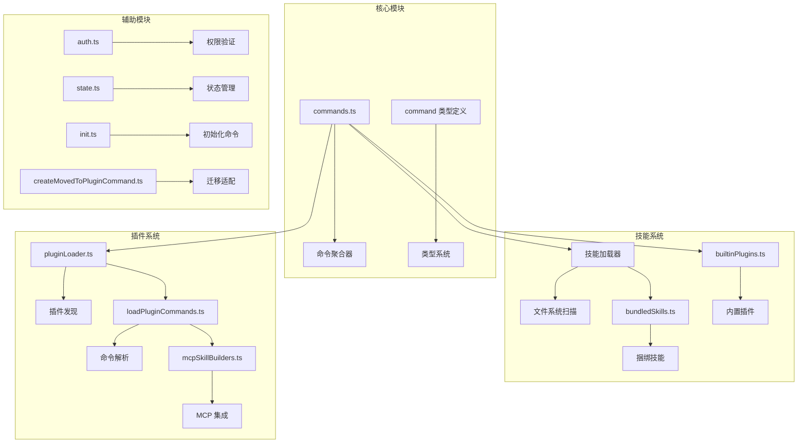

**图表来源**
- [commands.ts:1-759](file://src/commands.ts#L1-L759)
- [技能加载器:1-1088](file://src/skills/loadSkillsDir.ts#L1-L1088)
- [插件命令加载器:1-948](file://src/utils/plugins/loadPluginCommands.ts#L1-L948)

**章节来源**
- [commands.ts:1-759](file://src/commands.ts#L1-L759)
- [command 类型定义:1-218](file://src/types/command.ts#L1-L218)

## 核心组件

### 命令聚合器 (COMMANDS)

命令聚合器是整个系统的核心，负责收集和管理所有可用的命令。它使用 memoization 来缓存结果，避免重复计算。

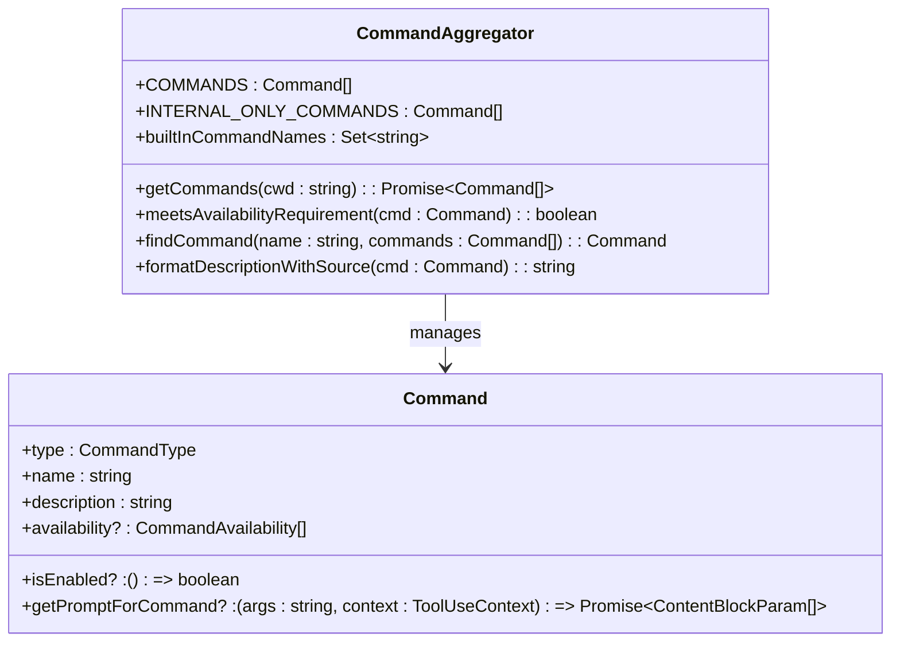

**图表来源**
- [commands.ts:259-520](file://src/commands.ts#L259-L520)
- [command 类型定义:205-206](file://src/types/command.ts#L205-L206)

### 技能加载系统

技能加载系统支持从多个位置加载技能命令，包括用户技能目录、项目技能目录、插件技能等。

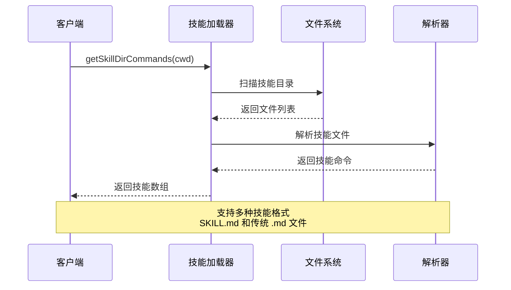

**图表来源**
- [技能加载器:638-800](file://src/skills/loadSkillsDir.ts#L638-L800)
- [插件命令加载器:169-213](file://src/utils/plugins/loadPluginCommands.ts#L169-L213)

**章节来源**
- [commands.ts:355-400](file://src/commands.ts#L355-L400)
- [技能加载器:1-1088](file://src/skills/loadSkillsDir.ts#L1-L1088)

## 架构概览

命令发现系统采用分层架构设计，确保了良好的模块分离和可扩展性：

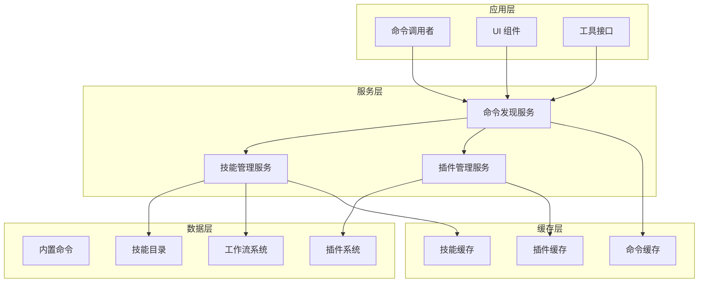

**图表来源**
- [commands.ts:451-471](file://src/commands.ts#L451-L471)
- [技能加载器:638-714](file://src/skills/loadSkillsDir.ts#L638-L714)

## 详细组件分析

### 命令发现流程

命令发现的核心流程如下：

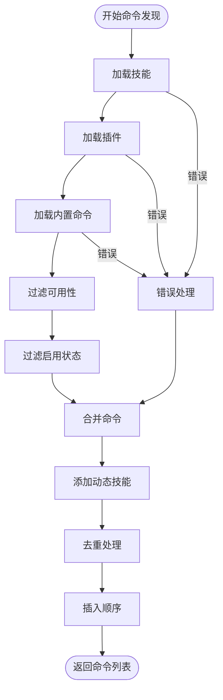

**图表来源**
- [commands.ts:478-519](file://src/commands.ts#L478-L519)

### 缓存策略

系统实现了多层次的缓存策略来优化性能：

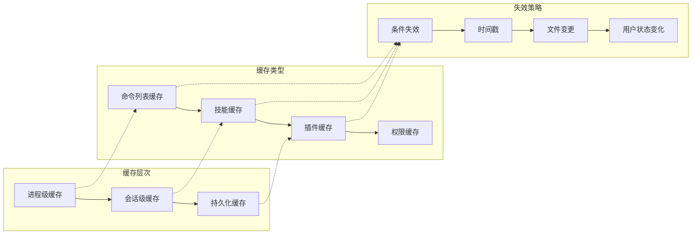

**图表来源**
- [commands.ts:525-541](file://src/commands.ts#L525-L541)
- [技能加载器:638-675](file://src/skills/loadSkillsDir.ts#L638-L675)

### 权限和可用性过滤

系统支持多层权限控制和可用性检查：

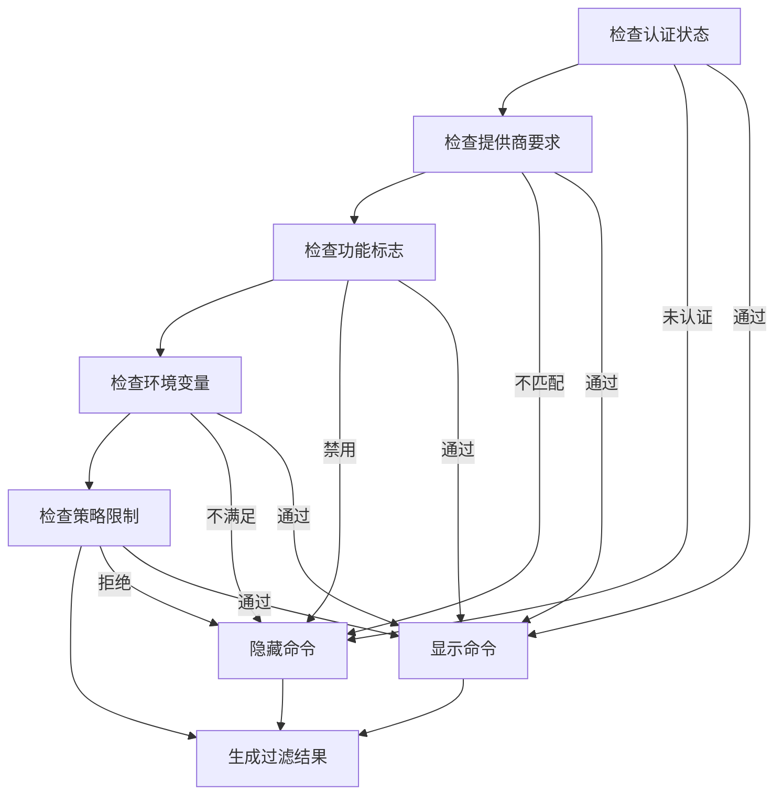

**图表来源**
- [commands.ts:419-445](file://src/commands.ts#L419-L445)
- [认证工具:1-800](file://src/utils/auth.ts#L1-L800)

**章节来源**
- [commands.ts:419-445](file://src/commands.ts#L419-L445)
- [认证工具:1-800](file://src/utils/auth.ts#L1-L800)

### 插件系统集成

插件系统提供了强大的扩展能力：

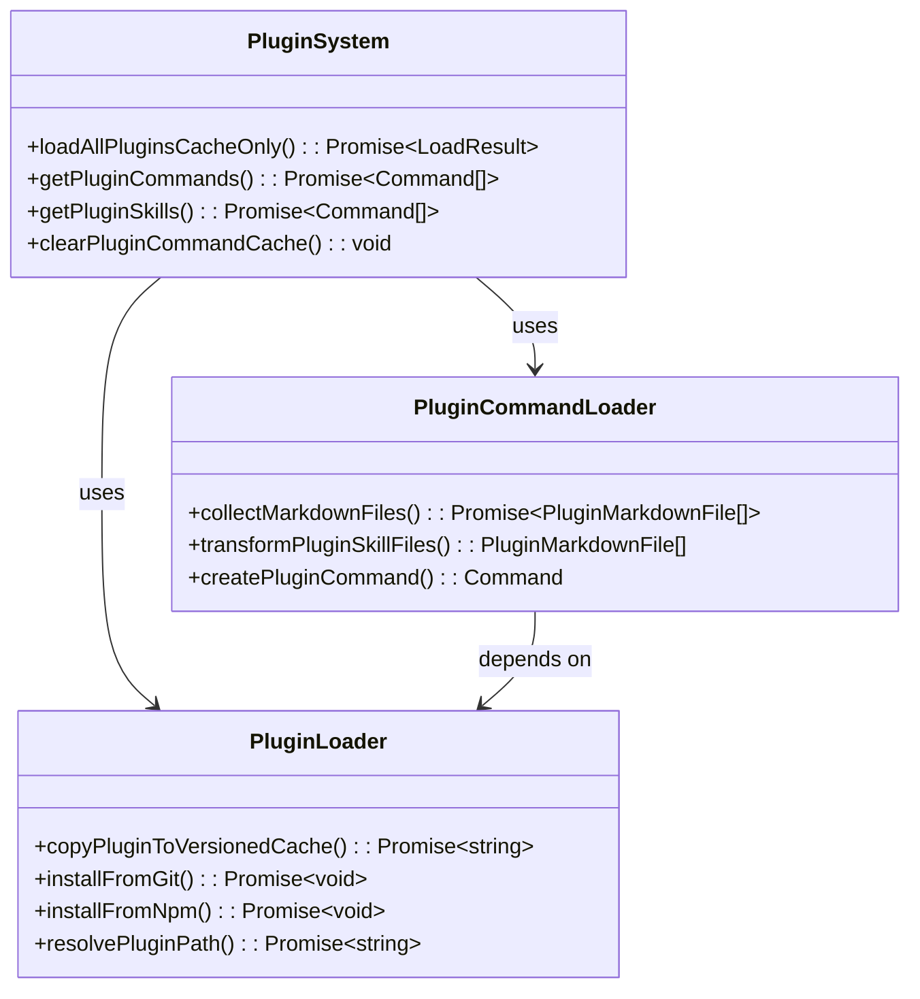

**图表来源**
- [插件命令加载器:414-677](file://src/utils/plugins/loadPluginCommands.ts#L414-L677)
- [插件加载器:365-465](file://src/utils/plugins/pluginLoader.ts#L365-L465)

**章节来源**
- [插件命令加载器:1-948](file://src/utils/plugins/loadPluginCommands.ts#L1-L948)
- [插件加载器:1-3304](file://src/utils/plugins/pluginLoader.ts#L1-L3304)

### 动态技能发现

系统支持运行时发现和加载新的技能：

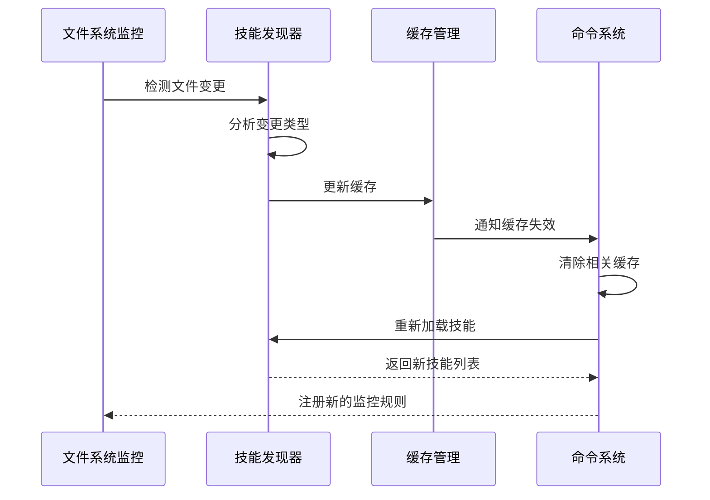

**图表来源**
- [技能加载器:787-796](file://src/skills/loadSkillsDir.ts#L787-L796)

**章节来源**
- [技能加载器:787-796](file://src/skills/loadSkillsDir.ts#L787-L796)

## 依赖关系分析

命令发现系统的依赖关系图：

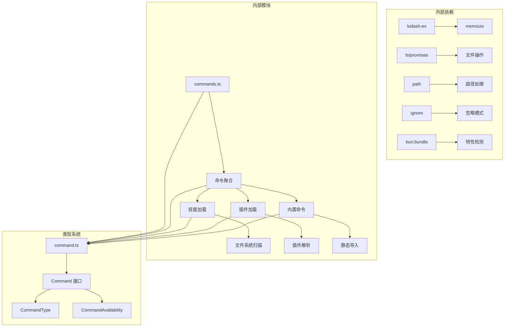

**图表来源**
- [commands.ts:1-759](file://src/commands.ts#L1-L759)
- [command 类型定义:1-218](file://src/types/command.ts#L1-L218)

**章节来源**
- [commands.ts:1-759](file://src/commands.ts#L1-L759)
- [command 类型定义:1-218](file://src/types/command.ts#L1-L218)

## 性能考虑

### 缓存优化

系统采用了多层缓存策略来提升性能：

1. **命令列表缓存**：使用 `memoize` 缓存整个命令列表
2. **技能缓存**：针对不同来源的技能分别缓存
3. **插件缓存**：缓存插件元数据和已解析的命令
4. **权限缓存**：缓存认证状态和权限检查结果

### 异步加载

系统大量使用异步加载来避免阻塞主线程：

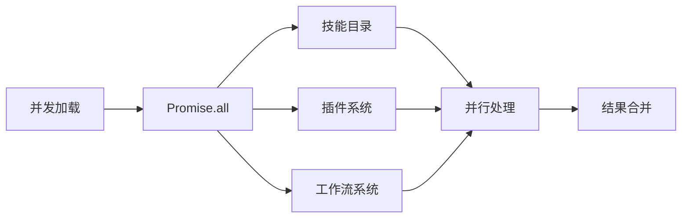

**图表来源**
- [commands.ts:456-460](file://src/commands.ts#L456-L460)

### 内存管理

系统实现了智能的内存管理策略：

1. **懒加载**：命令在实际使用时才加载
2. **缓存清理**：定期清理过期缓存
3. **资源释放**：及时释放不再使用的资源

## 故障排除指南

### 常见问题及解决方案

#### 命令加载失败

**症状**：命令无法加载或显示为空

**可能原因**：
1. 文件权限问题
2. 路径解析错误
3. 缓存损坏

**解决步骤**：
1. 检查文件权限
2. 清理缓存：`clearCommandsCache()`
3. 重启应用

#### 插件加载错误

**症状**：插件命令不可用或报错

**解决方法**：
1. 检查插件安装状态
2. 查看插件日志
3. 重新安装插件

#### 权限问题

**症状**：某些命令被隐藏或无法执行

**排查步骤**：
1. 检查用户认证状态
2. 验证提供商配置
3. 检查功能标志设置

**章节来源**
- [commands.ts:536-541](file://src/commands.ts#L536-L541)

## 结论

命令发现系统通过精心设计的架构和多层优化策略，为用户提供了高效、灵活且可扩展的命令执行环境。系统的主要优势包括：

1. **模块化设计**：清晰的模块分离便于维护和扩展
2. **性能优化**：多层缓存和异步加载确保响应速度
3. **安全性**：完善的权限控制和可用性过滤
4. **可扩展性**：支持多种扩展机制（技能、插件、工作流）
5. **可靠性**：健壮的错误处理和恢复机制

对于初学者，建议从理解命令聚合器和技能加载系统开始；对于高级用户，可以深入研究插件系统和缓存策略的实现细节。系统的设计充分考虑了未来扩展的需求，为持续的功能增强奠定了坚实的基础。