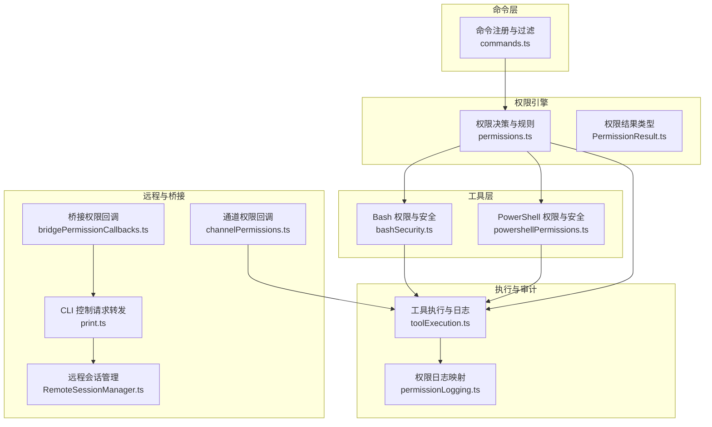
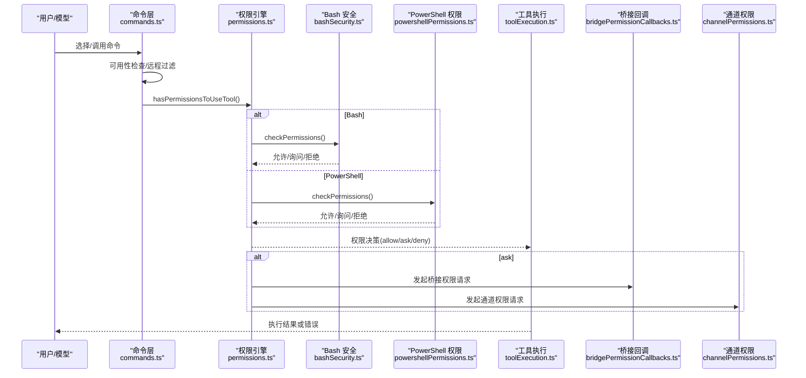
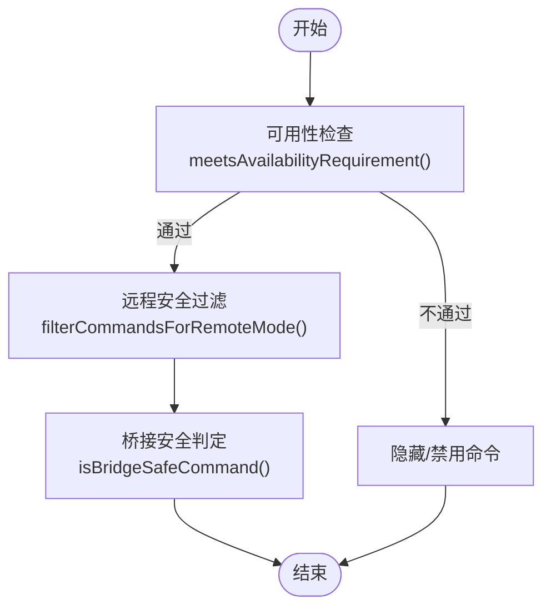
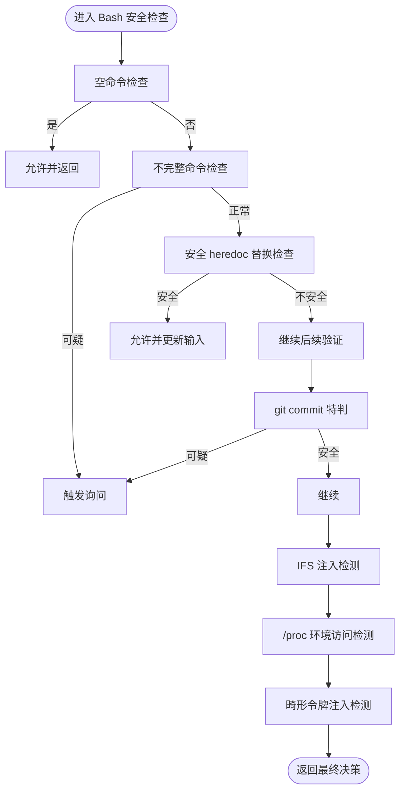
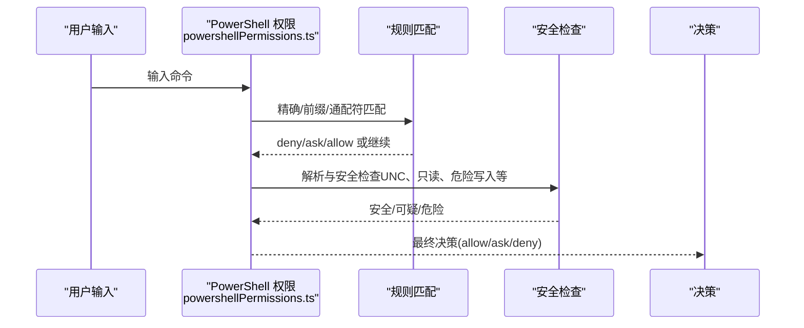
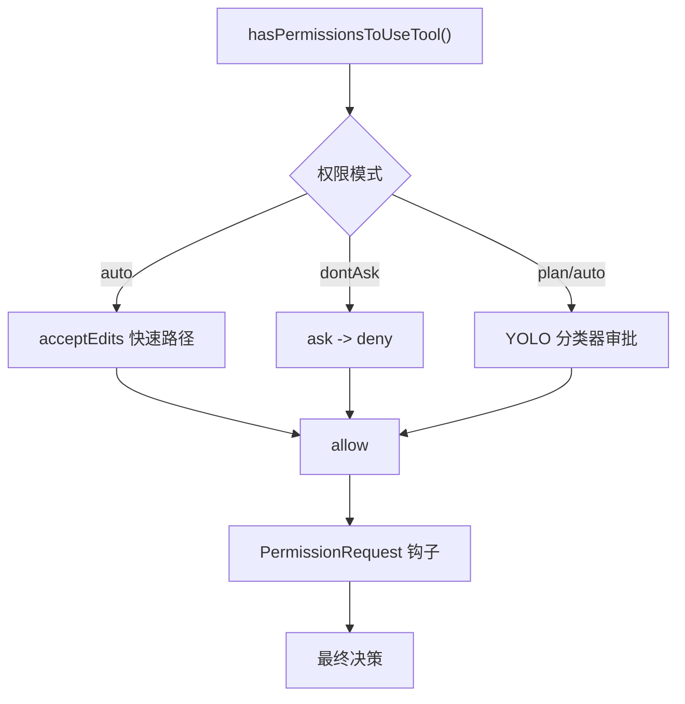
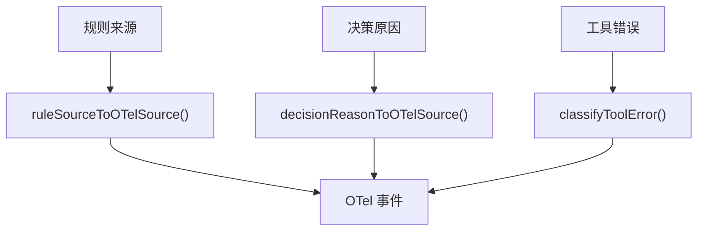
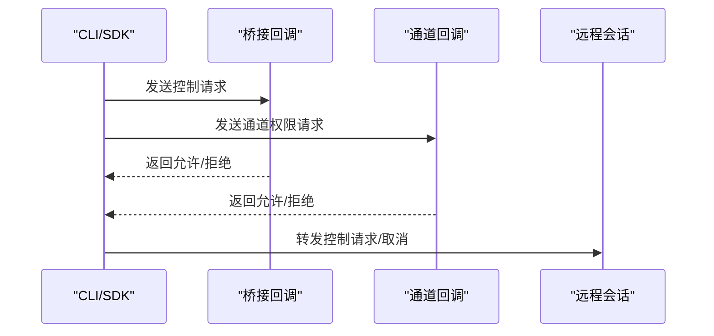
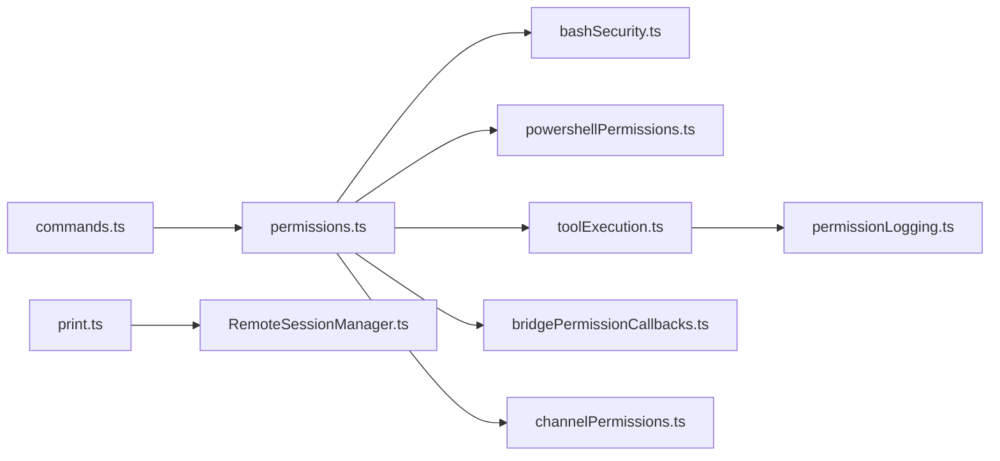

# 命令安全与权限

<cite>
**本文档引用的文件**
- [commands.ts](file://src/commands.ts)
- [bashSecurity.ts](file://src/tools/BashTool/bashSecurity.ts)
- [powershellPermissions.ts](file://src/tools/PowerShellTool/powershellPermissions.ts)
- [permissions.ts](file://src/utils/permissions/permissions.ts)
- [PermissionResult.ts](file://src/utils/permissions/PermissionResult.ts)
- [toolExecution.ts](file://src/services/tools/toolExecution.ts)
- [bridgePermissionCallbacks.ts](file://src/bridge/bridgePermissionCallbacks.ts)
- [channelPermissions.ts](file://src/services/mcp/channelPermissions.ts)
- [print.ts](file://src/cli/print.ts)
- [security-review.ts](file://src/commands/security-review.ts)
- [permissionSetup.ts](file://src/utils/permissions/permissionSetup.ts)
- [RemoteSessionManager.ts](file://src/remote/RemoteSessionManager.ts)
</cite>

## 目录
1. [简介](#简介)
2. [项目结构](#项目结构)
3. [核心组件](#核心组件)
4. [架构总览](#架构总览)
5. [详细组件分析](#详细组件分析)
6. [依赖关系分析](#依赖关系分析)
7. [性能考虑](#性能考虑)
8. [故障排除指南](#故障排除指南)
9. [结论](#结论)
10. [附录](#附录)

## 简介
本文件系统性阐述命令安全与权限体系，覆盖命令可用性检查、执行权限、远程安全控制、命令过滤机制、权限验证流程、日志与审计、最佳实践与安全配置建议。文档面向初学者与高级用户，既提供基础概念，也给出可操作的安全加固与合规指导。

## 项目结构
围绕命令安全与权限的关键模块分布如下：
- 命令层：命令注册、可用性过滤、远程/桥接安全命令白名单
- 工具层：Bash/PowerShell 权限检查与安全校验
- 权限引擎：规则匹配、决策生成、自动模式分类器、钩子集成
- 远程与桥接：跨端权限回调、通道权限、CLI 控制请求转发
- 审计与日志：权限决策来源映射、遥测事件、错误分类

**图表来源**
- [commands.ts:621-688](file://src/commands.ts#L621-L688)
- [bashSecurity.ts:1-120](file://src/tools/BashTool/bashSecurity.ts#L1-L120)
- [powershellPermissions.ts:1-120](file://src/tools/PowerShellTool/powershellPermissions.ts#L1-L120)
- [permissions.ts:1-120](file://src/utils/permissions/permissions.ts#L1-L120)
- [toolExecution.ts:173-250](file://src/services/tools/toolExecution.ts#L173-L250)
- [bridgePermissionCallbacks.ts:1-46](file://src/bridge/bridgePermissionCallbacks.ts#L1-L46)
- [channelPermissions.ts:1-60](file://src/services/mcp/channelPermissions.ts#L1-L60)
- [print.ts:3983-4014](file://src/cli/print.ts#L3983-L4014)
- [RemoteSessionManager.ts:1-48](file://src/remote/RemoteSessionManager.ts#L1-L48)

**章节来源**
- [commands.ts:621-688](file://src/commands.ts#L621-L688)
- [bashSecurity.ts:1-120](file://src/tools/BashTool/bashSecurity.ts#L1-L120)
- [powershellPermissions.ts:1-120](file://src/tools/PowerShellTool/powershellPermissions.ts#L1-L120)
- [permissions.ts:1-120](file://src/utils/permissions/permissions.ts#L1-L120)
- [toolExecution.ts:173-250](file://src/services/tools/toolExecution.ts#L173-L250)
- [bridgePermissionCallbacks.ts:1-46](file://src/bridge/bridgePermissionCallbacks.ts#L1-L46)
- [channelPermissions.ts:1-60](file://src/services/mcp/channelPermissions.ts#L1-L60)
- [print.ts:3983-4014](file://src/cli/print.ts#L3983-L4014)
- [RemoteSessionManager.ts:1-48](file://src/remote/RemoteSessionManager.ts#L1-L48)

## 核心组件
- 命令可用性与远程安全
  - 命令可用性检查：按认证/提供商要求过滤命令集合
  - 远程安全命令集：仅允许影响本地状态的命令在远程模式下使用
  - 桥接安全命令集：允许从移动端/网页端安全执行的本地命令白名单
- 工具权限与安全校验
  - Bash：多层正则与AST结合的安全检查，防御注入、危险元字符、环境变量读取等
  - PowerShell：规则匹配（精确/前缀/通配）、只读/安全输出命令识别、UNC路径阻断
- 权限决策引擎
  - 规则来源：用户设置、项目设置、会话、命令行参数等
  - 决策模式：自动（auto）、不询问（dontAsk）、计划（plan）等
  - 分类器：基于转录的自动审批/拒绝
- 执行与审计
  - 工具执行流程：输入校验、权限检查、钩子、执行、结果处理、遥测
  - 日志与审计：权限来源映射到 OTel 源标签，错误分类，统计计数

**章节来源**
- [commands.ts:419-445](file://src/commands.ts#L419-L445)
- [commands.ts:621-688](file://src/commands.ts#L621-L688)
- [bashSecurity.ts:1017-1067](file://src/tools/BashTool/bashSecurity.ts#L1017-L1067)
- [powershellPermissions.ts:639-757](file://src/tools/PowerShellTool/powershellPermissions.ts#L639-L757)
- [permissions.ts:473-520](file://src/utils/permissions/permissions.ts#L473-L520)
- [toolExecution.ts:173-250](file://src/services/tools/toolExecution.ts#L173-L250)

## 架构总览
命令安全与权限的整体流程如下：

**图表来源**
- [commands.ts:419-445](file://src/commands.ts#L419-L445)
- [permissions.ts:473-520](file://src/utils/permissions/permissions.ts#L473-L520)
- [bashSecurity.ts:1-120](file://src/tools/BashTool/bashSecurity.ts#L1-L120)
- [powershellPermissions.ts:639-757](file://src/tools/PowerShellTool/powershellPermissions.ts#L639-L757)
- [toolExecution.ts:599-752](file://src/services/tools/toolExecution.ts#L599-L752)
- [bridgePermissionCallbacks.ts:10-27](file://src/bridge/bridgePermissionCallbacks.ts#L10-L27)
- [channelPermissions.ts:196-226](file://src/services/mcp/channelPermissions.ts#L196-L226)

## 详细组件分析

### 命令可用性与远程/桥接安全
- 可用性检查：根据订阅状态、第三方服务、第一方基地址等条件筛选命令
- 远程安全命令：仅允许无本地副作用的命令（如主题切换、帮助、清屏等）
- 桥接安全命令：允许从移动端/网页端执行的本地命令白名单（如摘要、文件列表等）

**图表来源**
- [commands.ts:419-445](file://src/commands.ts#L419-L445)
- [commands.ts:621-688](file://src/commands.ts#L621-L688)

**章节来源**
- [commands.ts:419-445](file://src/commands.ts#L419-L445)
- [commands.ts:621-688](file://src/commands.ts#L621-L688)

### Bash 命令安全与权限
- 多层安全检查：空命令、不完整命令、heredoc 替换、git commit 特判、jq 安全、IFS 注入、/proc 环境读取、畸形令牌注入等
- 防御注入策略：检测命令替换、参数扩展、Zsh 等价展开、危险变量使用等
- 安全硬核：对可疑 heredoc 替换进行严格解析与剥离，确保剩余文本仍需通过全部验证

**图表来源**
- [bashSecurity.ts:233-286](file://src/tools/BashTool/bashSecurity.ts#L233-L286)
- [bashSecurity.ts:585-610](file://src/tools/BashTool/bashSecurity.ts#L585-L610)
- [bashSecurity.ts:612-740](file://src/tools/BashTool/bashSecurity.ts#L612-L740)
- [bashSecurity.ts:1017-1067](file://src/tools/BashTool/bashSecurity.ts#L1017-L1067)
- [bashSecurity.ts:1082-1085](file://src/tools/BashTool/bashSecurity.ts#L1082-L1085)

**章节来源**
- [bashSecurity.ts:233-286](file://src/tools/BashTool/bashSecurity.ts#L233-L286)
- [bashSecurity.ts:585-610](file://src/tools/BashTool/bashSecurity.ts#L585-L610)
- [bashSecurity.ts:612-740](file://src/tools/BashTool/bashSecurity.ts#L612-L740)
- [bashSecurity.ts:1017-1067](file://src/tools/BashTool/bashSecurity.ts#L1017-L1067)
- [bashSecurity.ts:1082-1085](file://src/tools/BashTool/bashSecurity.ts#L1082-L1085)

### PowerShell 命令权限与安全
- 规则匹配：精确匹配、前缀匹配、通配符匹配；大小写不敏感；别名与规范命令名统一
- 子命令级检查：管道与控制流中的每个命令独立评估，安全输出命令（如 Out-Null）特殊处理
- 安全约束：UNC 路径阻断、只读命令识别、危险写入命令阻断、归一化空白分隔
- 自动模式限制：在某些构建中，PowerShell 在自动模式下需要交互确认

**图表来源**
- [powershellPermissions.ts:385-430](file://src/tools/PowerShellTool/powershellPermissions.ts#L385-L430)
- [powershellPermissions.ts:435-514](file://src/tools/PowerShellTool/powershellPermissions.ts#L435-L514)
- [powershellPermissions.ts:639-757](file://src/tools/PowerShellTool/powershellPermissions.ts#L639-L757)

**章节来源**
- [powershellPermissions.ts:385-430](file://src/tools/PowerShellTool/powershellPermissions.ts#L385-L430)
- [powershellPermissions.ts:435-514](file://src/tools/PowerShellTool/powershellPermissions.ts#L435-L514)
- [powershellPermissions.ts:639-757](file://src/tools/PowerShellTool/powershellPermissions.ts#L639-L757)

### 权限验证流程与自动模式
- 决策入口：hasPermissionsToUseTool() 统一入口，支持自动模式（auto）、不询问（dontAsk）、计划（plan）
- 自动模式优化：acceptEdits 快速路径、安全工具白名单跳过分类器、YOLO 分类器审批
- 钩子与提示：PermissionRequest 钩子、分类器不可用回退、不要求提示场景的处理
- 模式转换：dontAsk 模式将 ask 转为 deny

**图表来源**
- [permissions.ts:473-520](file://src/utils/permissions/permissions.ts#L473-L520)
- [permissions.ts:518-591](file://src/utils/permissions/permissions.ts#L518-L591)
- [permissions.ts:658-686](file://src/utils/permissions/permissions.ts#L658-L686)

**章节来源**
- [permissions.ts:473-520](file://src/utils/permissions/permissions.ts#L473-L520)
- [permissions.ts:518-591](file://src/utils/permissions/permissions.ts#L518-L591)
- [permissions.ts:658-686](file://src/utils/permissions/permissions.ts#L658-L686)

### 日志记录与审计
- 规则来源映射：将规则来源（会话、用户设置、项目设置、命令行参数等）映射到 OTel 源标签
- 决策原因映射：根据决策原因类型（规则、hook、模式、分类器等）映射到 OTel 源
- 错误分类：对工具执行错误进行分类，便于遥测与诊断
- 权限日志：权限决策与来源的详细记录，支持审计追踪

**图表来源**
- [toolExecution.ts:173-250](file://src/services/tools/toolExecution.ts#L173-L250)

**章节来源**
- [toolExecution.ts:173-250](file://src/services/tools/toolExecution.ts#L173-L250)

### 远程与桥接安全控制
- 桥接权限回调：定义请求/响应结构，支持取消与响应监听
- 通道权限回调：在 Telegram/iMessage/Discord 等渠道发起权限提示，与本地 UI 竞速
- CLI 控制请求转发：将控制请求转发至桥接句柄，支持取消与响应
- 远程会话管理：区分 SDK 消息与控制消息，简化远程权限响应结构

**图表来源**
- [bridgePermissionCallbacks.ts:10-27](file://src/bridge/bridgePermissionCallbacks.ts#L10-L27)
- [channelPermissions.ts:196-226](file://src/services/mcp/channelPermissions.ts#L196-L226)
- [print.ts:3983-4014](file://src/cli/print.ts#L3983-L4014)
- [RemoteSessionManager.ts:36-48](file://src/remote/RemoteSessionManager.ts#L36-L48)

**章节来源**
- [bridgePermissionCallbacks.ts:10-27](file://src/bridge/bridgePermissionCallbacks.ts#L10-L27)
- [channelPermissions.ts:196-226](file://src/services/mcp/channelPermissions.ts#L196-L226)
- [print.ts:3983-4014](file://src/cli/print.ts#L3983-L4014)
- [RemoteSessionManager.ts:36-48](file://src/remote/RemoteSessionManager.ts#L36-L48)

### 命令安全最佳实践与合规建议
- 权限最小化原则
  - 使用精确规则而非通配符；避免过度授权
  - 仅在必要时启用自动模式，PowerShell 在某些构建中默认需要交互
- 安全配置建议
  - 启用 deny/ask 规则以阻断高危命令
  - 对 UNC 路径、/proc 环境读取、IFS 注入等高危模式保持严格阻断
  - 使用远程安全命令集与桥接安全命令白名单
- 合规与审计
  - 记录权限来源与决策原因，确保可追溯
  - 对自动模式下的分类器使用进行成本与延迟监控
  - 定期审查权限规则，移除过宽规则

**章节来源**
- [permissionSetup.ts:417-450](file://src/utils/permissions/permissionSetup.ts#L417-L450)
- [bashSecurity.ts:1017-1067](file://src/tools/BashTool/bashSecurity.ts#L1017-L1067)
- [powershellPermissions.ts:717-723](file://src/tools/PowerShellTool/powershellPermissions.ts#L717-L723)
- [toolExecution.ts:725-793](file://src/services/tools/toolExecution.ts#L725-L793)

## 依赖关系分析
- 命令层依赖权限引擎进行可用性与权限决策
- 工具层（Bash/PowerShell）依赖规则匹配与安全检查模块
- 权限引擎依赖分类器、钩子、设置源等模块
- 执行层负责输入校验、权限决策、遥测与错误分类
- 远程与桥接模块提供跨端权限回调与控制请求转发

**图表来源**
- [commands.ts:419-445](file://src/commands.ts#L419-L445)
- [permissions.ts:473-520](file://src/utils/permissions/permissions.ts#L473-L520)
- [toolExecution.ts:599-752](file://src/services/tools/toolExecution.ts#L599-L752)
- [bridgePermissionCallbacks.ts:10-27](file://src/bridge/bridgePermissionCallbacks.ts#L10-L27)
- [channelPermissions.ts:196-226](file://src/services/mcp/channelPermissions.ts#L196-L226)
- [print.ts:3983-4014](file://src/cli/print.ts#L3983-L4014)
- [RemoteSessionManager.ts:36-48](file://src/remote/RemoteSessionManager.ts#L36-L48)

**章节来源**
- [commands.ts:419-445](file://src/commands.ts#L419-L445)
- [permissions.ts:473-520](file://src/utils/permissions/permissions.ts#L473-L520)
- [toolExecution.ts:599-752](file://src/services/tools/toolExecution.ts#L599-L752)
- [bridgePermissionCallbacks.ts:10-27](file://src/bridge/bridgePermissionCallbacks.ts#L10-L27)
- [channelPermissions.ts:196-226](file://src/services/mcp/channelPermissions.ts#L196-L226)
- [print.ts:3983-4014](file://src/cli/print.ts#L3983-L4014)
- [RemoteSessionManager.ts:36-48](file://src/remote/RemoteSessionManager.ts#L36-L48)

## 性能考虑
- 规则匹配与解析：优先使用精确匹配减少解析开销；对 Bash/PowerShell 的解析失败路径提供降级处理
- 自动模式优化：acceptEdits 快速路径与安全工具白名单减少分类器调用
- 并行化：在 Bash 中预启动分类器检查，与前置钩子、分类器、权限对话框并行
- 遥测与日志：对分类器调用进行成本与延迟统计，避免过度遥测造成性能负担

[本节为通用指导，无需特定文件引用]

## 故障排除指南
- 权限被拒
  - 检查是否存在 deny/ask 规则；查看决策原因类型（规则、hook、模式、分类器等）
  - 在 dontAsk 模式下，ask 将被转换为 deny
- 自动模式未生效
  - 确认当前工具是否在自动模式下允许；某些工具（如 PowerShell）在特定构建中需要交互
- 远程/桥接权限未弹窗
  - 检查桥接回调与通道回调是否正确注册；确认 CLI 控制请求转发逻辑
- 工具执行错误
  - 查看错误分类（如文件系统错误码、已知错误类型），结合遥测事件定位问题

**章节来源**
- [permissions.ts:503-517](file://src/utils/permissions/permissions.ts#L503-L517)
- [permissions.ts:560-591](file://src/utils/permissions/permissions.ts#L560-L591)
- [toolExecution.ts:140-171](file://src/services/tools/toolExecution.ts#L140-L171)
- [print.ts:3983-4014](file://src/cli/print.ts#L3983-L4014)

## 结论
该系统通过“命令可用性检查 + 工具级安全校验 + 权限引擎 + 跨端回调 + 审计日志”的多层防护，实现了从命令入口到执行完成的全链路安全控制。遵循权限最小化原则、合理配置规则与自动模式、强化远程与桥接安全，可显著降低命令执行风险并满足合规要求。

[本节为总结性内容，无需特定文件引用]

## 附录
- 命令安全审查工具：提供安全审查技能，限定允许工具集合，结合 Git 工具链进行变更分析

**章节来源**
- [security-review.ts:198-243](file://src/commands/security-review.ts#L198-L243)