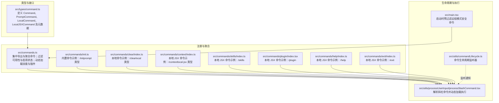
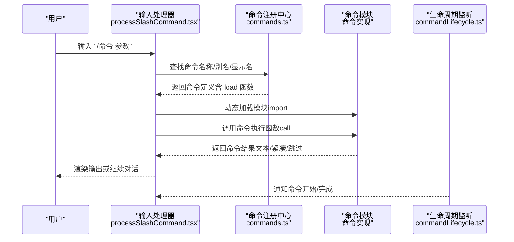
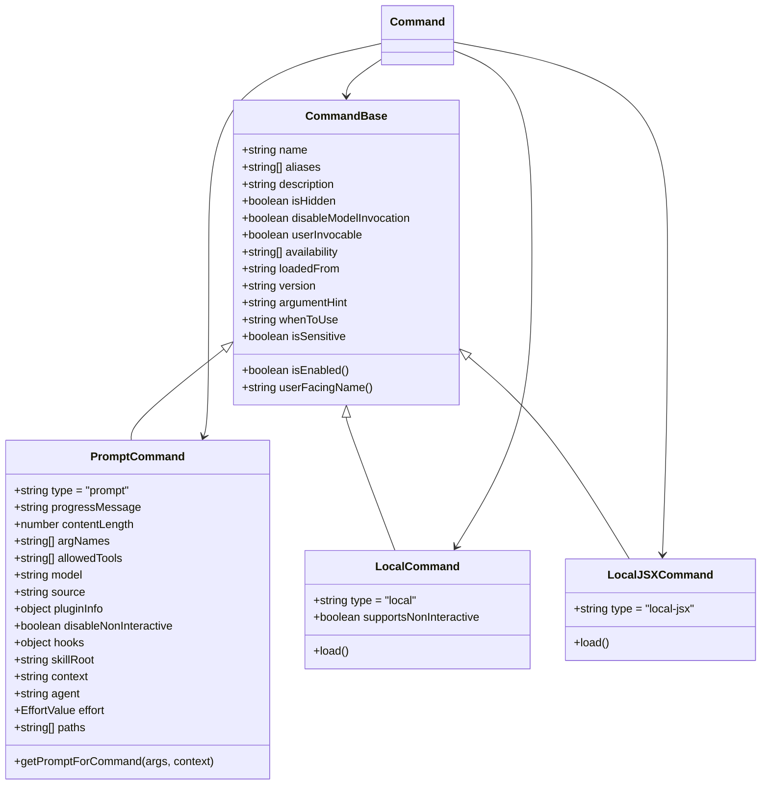
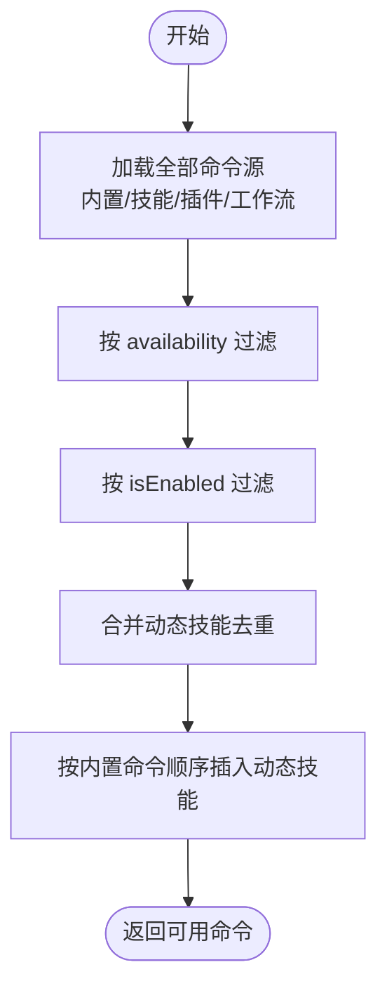
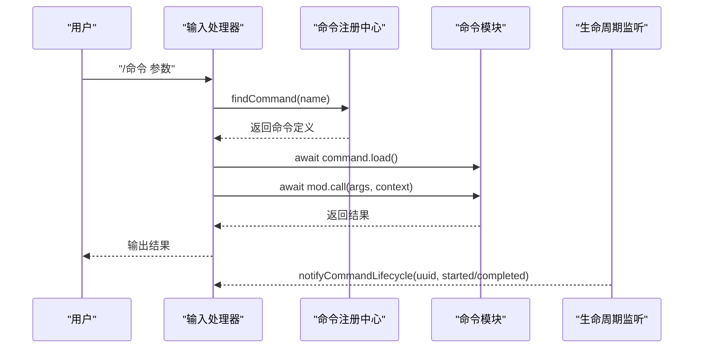
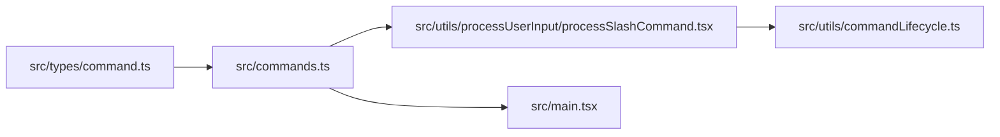

# 命令定义与注册

<cite>
**本文引用的文件**
- [src/types/command.ts](file://src/types/command.ts)
- [src/commands.ts](file://src/commands.ts)
- [src/commands/init.ts](file://src/commands/init.ts)
- [src/commands/clear/index.ts](file://src/commands/clear/index.ts)
- [src/commands/context/index.ts](file://src/commands/context/index.ts)
- [src/commands/skills/index.ts](file://src/commands/skills/index.ts)
- [src/commands/plugin/index.tsx](file://src/commands/plugin/index.tsx)
- [src/commands/help/index.ts](file://src/commands/help/index.ts)
- [src/commands/exit/index.ts](file://src/commands/exit/index.ts)
- [src/utils/commandLifecycle.ts](file://src/utils/commandLifecycle.ts)
- [src/utils/processUserInput/processSlashCommand.tsx](file://src/utils/processUserInput/processSlashCommand.tsx)
- [src/main.tsx](file://src/main.tsx)
</cite>

## 目录
1. [引言](#引言)
2. [项目结构](#项目结构)
3. [核心组件](#核心组件)
4. [架构总览](#架构总览)
5. [详细组件分析](#详细组件分析)
6. [依赖关系分析](#依赖关系分析)
7. [性能考量](#性能考量)
8. [故障排查指南](#故障排查指南)
9. [结论](#结论)
10. [附录](#附录)

## 引言
本篇文档围绕“命令定义与注册”主题，系统阐述命令类型系统、接口规范、注册流程与生命周期，覆盖从命令声明、导入、注册到可用性检查的全链路。同时给出命令类型（prompt、local、local-jsx）的差异与适用场景，参数与元数据的定义与校验思路，以及如何创建自定义命令的最佳实践。文档面向初学者提供基础概念，面向高级用户给出扩展与定制细节。

## 项目结构
命令系统的核心由三部分构成：
- 类型与接口：统一定义命令的结构、类型与元数据
- 注册与聚合：集中声明、按需加载、过滤与合并命令来源
- 生命周期与执行：命令可用性检查、动态加载、调用与结果处理

图表来源
- [src/types/command.ts:1-218](file://src/types/command.ts#L1-L218)
- [src/commands.ts:1-759](file://src/commands.ts#L1-L759)
- [src/commands/init.ts:1-259](file://src/commands/init.ts#L1-L259)
- [src/commands/clear/index.ts:1-22](file://src/commands/clear/index.ts#L1-L22)
- [src/commands/context/index.ts:1-27](file://src/commands/context/index.ts#L1-L27)
- [src/commands/skills/index.ts:1-13](file://src/commands/skills/index.ts#L1-L13)
- [src/commands/plugin/index.tsx:1-13](file://src/commands/plugin/index.tsx#L1-L13)
- [src/commands/help/index.ts:1-13](file://src/commands/help/index.ts#L1-L13)
- [src/commands/exit/index.ts:1-15](file://src/commands/exit/index.ts#L1-L15)
- [src/utils/commandLifecycle.ts:1-23](file://src/utils/commandLifecycle.ts#L1-L23)
- [src/utils/processUserInput/processSlashCommand.tsx](file://src/utils/processUserInput/processSlashCommand.tsx)
- [src/main.tsx:1-200](file://src/main.tsx#L1-L200)

章节来源
- [src/types/command.ts:1-218](file://src/types/command.ts#L1-L218)
- [src/commands.ts:1-759](file://src/commands.ts#L1-L759)
- [src/commands/init.ts:1-259](file://src/commands/init.ts#L1-L259)
- [src/commands/clear/index.ts:1-22](file://src/commands/clear/index.ts#L1-L22)
- [src/commands/context/index.ts:1-27](file://src/commands/context/index.ts#L1-L27)
- [src/commands/skills/index.ts:1-13](file://src/commands/skills/index.ts#L1-L13)
- [src/commands/plugin/index.tsx:1-13](file://src/commands/plugin/index.tsx#L1-L13)
- [src/commands/help/index.ts:1-13](file://src/commands/help/index.ts#L1-L13)
- [src/commands/exit/index.ts:1-15](file://src/commands/exit/index.ts#L1-L15)
- [src/utils/commandLifecycle.ts:1-23](file://src/utils/commandLifecycle.ts#L1-L23)
- [src/utils/processUserInput/processSlashCommand.tsx](file://src/utils/processUserInput/processSlashCommand.tsx)
- [src/main.tsx:1-200](file://src/main.tsx#L1-L200)

## 核心组件
- 命令类型系统
  - PromptCommand：面向模型可调用的“技能”，通过 getPromptForCommand 动态生成提示内容
  - LocalCommand：本地命令，支持非交互式执行，延迟加载模块
  - LocalJSXCommand：本地 JSX 命令，延迟加载渲染组件，用于终端 UI 交互
- 命令元数据与接口
  - CommandBase：统一的元数据字段（名称、别名、描述、可用性、启用条件、来源等）
  - 命令可用性与启用控制：availability（认证/提供商维度）、isEnabled（特性开关/环境变量等）
- 命令注册与聚合
  - 统一导出与聚合：集中导入各命令模块，按需动态加载技能与插件
  - 过滤策略：按 availability 与 isEnabled 过滤，支持动态技能插入
- 命令生命周期与执行
  - 斜杠命令解析与动态加载：根据命令名查找并加载模块，执行后处理返回结果
  - 生命周期监听：可订阅命令开始与完成事件

章节来源
- [src/types/command.ts:16-218](file://src/types/command.ts#L16-L218)
- [src/commands.ts:208-759](file://src/commands.ts#L208-L759)
- [src/utils/processUserInput/processSlashCommand.tsx](file://src/utils/processUserInput/processSlashCommand.tsx)
- [src/utils/commandLifecycle.ts:1-23](file://src/utils/commandLifecycle.ts#L1-L23)

## 架构总览
命令系统以“类型定义—注册聚合—执行调度—生命周期监听”为主线，形成清晰的分层与职责边界：

图表来源
- [src/utils/processUserInput/processSlashCommand.tsx](file://src/utils/processUserInput/processSlashCommand.tsx)
- [src/commands.ts:478-721](file://src/commands.ts#L478-L721)
- [src/utils/commandLifecycle.ts:1-23](file://src/utils/commandLifecycle.ts#L1-L23)

章节来源
- [src/commands.ts:478-721](file://src/commands.ts#L478-L721)
- [src/utils/processUserInput/processSlashCommand.tsx](file://src/utils/processUserInput/processSlashCommand.tsx)
- [src/utils/commandLifecycle.ts:1-23](file://src/utils/commandLifecycle.ts#L1-L23)

## 详细组件分析

### 命令类型系统与接口规范
- PromptCommand
  - 用途：模型可调用的“技能”，通过 getPromptForCommand(args, context) 生成内容块
  - 关键字段：type='prompt'、progressMessage、contentLength、allowedTools、model、source、hooks、skillRoot、context/agent、paths 等
- LocalCommand
  - 用途：本地执行命令，支持非交互式；延迟加载 call 实现
  - 关键字段：type='local'、supportsNonInteractive、load()
- LocalJSXCommand
  - 用途：渲染终端 UI 的命令；延迟加载 call 实现
  - 关键字段：type='local-jsx'、load()

图表来源
- [src/types/command.ts:16-218](file://src/types/command.ts#L16-L218)

章节来源
- [src/types/command.ts:16-218](file://src/types/command.ts#L16-L218)

### 命令注册与可用性检查
- 集中注册
  - commands.ts 导入所有命令模块，使用 memoize 缓存构建命令列表
  - 支持动态技能（技能目录、插件技能、内置插件技能）与工作流命令的聚合
- 可用性过滤
  - meetsAvailabilityRequirement：基于 availability 与当前认证/提供商状态过滤
  - isCommandEnabled：基于 isEnabled 判定是否启用
- 动态技能插入
  - 在基础命令之后，按名称去重插入动态技能，并保持相对顺序

图表来源
- [src/commands.ts:451-519](file://src/commands.ts#L451-L519)
- [src/commands.ts:419-445](file://src/commands.ts#L419-L445)
- [src/commands.ts:259-348](file://src/commands.ts#L259-L348)

章节来源
- [src/commands.ts:451-519](file://src/commands.ts#L451-L519)
- [src/commands.ts:419-445](file://src/commands.ts#L419-L445)
- [src/commands.ts:259-348](file://src/commands.ts#L259-L348)

### 命令生命周期与执行
- 命令生命周期监听
  - setCommandLifecycleListener：设置监听回调
  - notifyCommandLifecycle：在命令开始/完成后触发通知
- 斜杠命令执行流程
  - 解析输入，查找命令，动态加载模块，调用执行函数，处理返回结果（跳过/文本/紧凑）

图表来源
- [src/utils/processUserInput/processSlashCommand.tsx](file://src/utils/processUserInput/processSlashCommand.tsx)
- [src/utils/commandLifecycle.ts:1-23](file://src/utils/commandLifecycle.ts#L1-L23)
- [src/commands.ts:690-721](file://src/commands.ts#L690-L721)

章节来源
- [src/utils/processUserInput/processSlashCommand.tsx](file://src/utils/processUserInput/processSlashCommand.tsx)
- [src/utils/commandLifecycle.ts:1-23](file://src/utils/commandLifecycle.ts#L1-L23)
- [src/commands.ts:690-721](file://src/commands.ts#L690-L721)

### 典型命令示例与最佳实践

#### Prompt 命令：/init
- 定义要点
  - type='prompt'，描述与进度提示，source='builtin'
  - getPromptForCommand 动态返回提示内容（支持新旧两版逻辑）
- 最佳实践
  - 将复杂提示延迟到 getPromptForCommand 中按需生成，避免启动时开销
  - 使用 progressMessage 提升用户感知

章节来源
- [src/commands/init.ts:226-254](file://src/commands/init.ts#L226-L254)
- [src/types/command.ts:25-57](file://src/types/command.ts#L25-L57)

#### Local 命令：/clear
- 定义要点
  - type='local'，supportsNonInteractive=false（非交互式能力视具体实现而定）
  - load 按需懒加载实现，减少启动时间
- 最佳实践
  - 将耗时实现拆分为独立模块并通过 load 延迟加载
  - 明确命令的交互语义（是否允许非交互式）

章节来源
- [src/commands/clear/index.ts:10-17](file://src/commands/clear/index.ts#L10-L17)
- [src/types/command.ts:74-78](file://src/types/command.ts#L74-L78)

#### LocalJSX 命令：/context、/skills、/plugin、/help、/exit
- 定义要点
  - type='local-jsx'，通过 load 延迟加载渲染组件
  - 可设置 isHidden、isEnabled 控制可见性与启用状态
  - /plugin 设置 immediate=true 以快速响应
- 最佳实践
  - UI 命令优先采用 LocalJSX，便于与终端 UI 交互
  - 对于需要立即执行的命令（如退出、切换主题）设置 immediate

章节来源
- [src/commands/context/index.ts:4-24](file://src/commands/context/index.ts#L4-L24)
- [src/commands/skills/index.ts:3-8](file://src/commands/skills/index.ts#L3-L8)
- [src/commands/plugin/index.tsx:2-9](file://src/commands/plugin/index.tsx#L2-L9)
- [src/commands/help/index.ts:3-8](file://src/commands/help/index.ts#L3-L8)
- [src/commands/exit/index.ts:3-10](file://src/commands/exit/index.ts#L3-L10)
- [src/types/command.ts:144-152](file://src/types/command.ts#L144-L152)

### 命令可用性与远程/桥接安全
- 可用性过滤
  - availability 支持 'claude-ai'、'console' 等，结合认证状态决定是否展示
- 远程/桥接安全
  - REMOTE_SAFE_COMMANDS：仅允许在远程模式下执行的本地命令集合
  - BRIDGE_SAFE_COMMANDS：通过桥接（移动端/网页）安全执行的本地命令集合
  - isBridgeSafeCommand：综合判断命令类型与白名单

章节来源
- [src/commands.ts:419-445](file://src/commands.ts#L419-L445)
- [src/commands.ts:621-678](file://src/commands.ts#L621-L678)
- [src/main.tsx:88](file://src/main.tsx#L88)

## 依赖关系分析
- 命令类型依赖
  - CommandBase 作为统一基类，被三种命令类型继承
- 注册中心依赖
  - commands.ts 依赖各命令模块与技能/插件加载器，负责聚合与过滤
- 执行路径依赖
  - 输入处理器依赖命令注册中心进行查找与加载
- 生命周期依赖
  - 命令执行过程中可通知生命周期监听器

图表来源
- [src/types/command.ts:16-218](file://src/types/command.ts#L16-L218)
- [src/commands.ts:1-759](file://src/commands.ts#L1-L759)
- [src/utils/processUserInput/processSlashCommand.tsx](file://src/utils/processUserInput/processSlashCommand.tsx)
- [src/utils/commandLifecycle.ts:1-23](file://src/utils/commandLifecycle.ts#L1-L23)
- [src/main.tsx:1-200](file://src/main.tsx#L1-L200)

章节来源
- [src/types/command.ts:16-218](file://src/types/command.ts#L16-L218)
- [src/commands.ts:1-759](file://src/commands.ts#L1-L759)
- [src/utils/processUserInput/processSlashCommand.tsx](file://src/utils/processUserInput/processSlashCommand.tsx)
- [src/utils/commandLifecycle.ts:1-23](file://src/utils/commandLifecycle.ts#L1-L23)
- [src/main.tsx:1-200](file://src/main.tsx#L1-L200)

## 性能考量
- 懒加载与缓存
  - 命令与技能均采用动态 import 与 memoize 缓存，降低启动与运行时开销
- 远程模式预过滤
  - 启动阶段对命令进行预过滤，避免在远程模式下出现本地命令
- 复杂命令延迟初始化
  - 如 /insights 使用延迟 shim，仅在实际调用时加载

章节来源
- [src/commands.ts:259-348](file://src/commands.ts#L259-L348)
- [src/commands.ts:451-471](file://src/commands.ts#L451-L471)
- [src/commands.ts:189-202](file://src/commands.ts#L189-L202)
- [src/main.tsx:88](file://src/main.tsx#L88)

## 故障排查指南
- 命令找不到
  - 使用 getCommand 或 findCommand 定位命令，若不存在会抛出错误并列出可用命令
- 命令不可见
  - 检查 availability 与 isEnabled 是否限制了当前用户或环境
  - 确认 isHidden 是否导致被隐藏
- 执行无响应
  - 检查命令是否正确实现 load 并返回包含 call 的模块
  - 确认命令类型与预期一致（prompt/local/local-jsx）
- 远程/桥接不可用
  - 确认命令是否在 REMOTE_SAFE_COMMANDS 或 BRIDGE_SAFE_COMMANDS 白名单内
  - 检查 isBridgeSafeCommand 判定逻辑

章节来源
- [src/commands.ts:690-721](file://src/commands.ts#L690-L721)
- [src/commands.ts:419-445](file://src/commands.ts#L419-L445)
- [src/commands.ts:621-678](file://src/commands.ts#L621-L678)

## 结论
命令系统通过统一的类型定义、灵活的注册与聚合机制、严格的可用性与启用控制，以及完善的生命周期与执行流程，实现了从声明到可用的完整闭环。对于初学者，建议从 LocalJSX 命令入手体验 UI 交互；对于高级用户，可通过 PromptCommand 构建模型可调用的技能，或通过 LocalCommand 实现本地功能的延迟加载与优化。配合动态技能与插件生态，命令系统具备良好的扩展性与可维护性。

## 附录

### 命令类型与字段速览
- CommandBase
  - name、aliases、description、isHidden、disableModelInvocation、userInvocable、availability、isEnabled、loadedFrom、version、argumentHint、whenToUse、isSensitive、userFacingName
- PromptCommand
  - type='prompt'、progressMessage、contentLength、argNames、allowedTools、model、source、pluginInfo、disableNonInteractive、hooks、skillRoot、context、agent、effort、paths、getPromptForCommand
- LocalCommand
  - type='local'、supportsNonInteractive、load
- LocalJSXCommand
  - type='local-jsx'、load

章节来源
- [src/types/command.ts:16-218](file://src/types/command.ts#L16-L218)