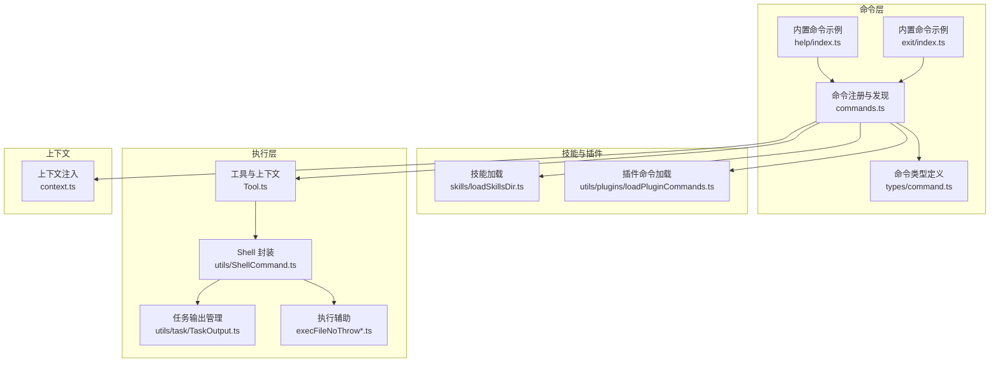
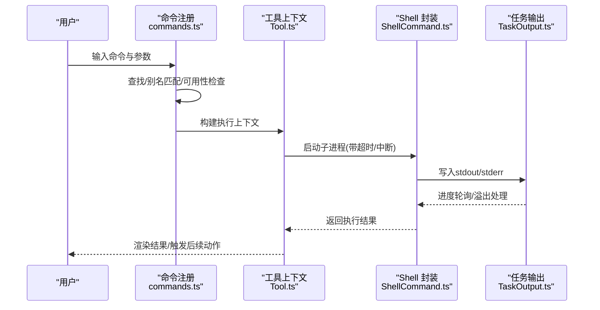
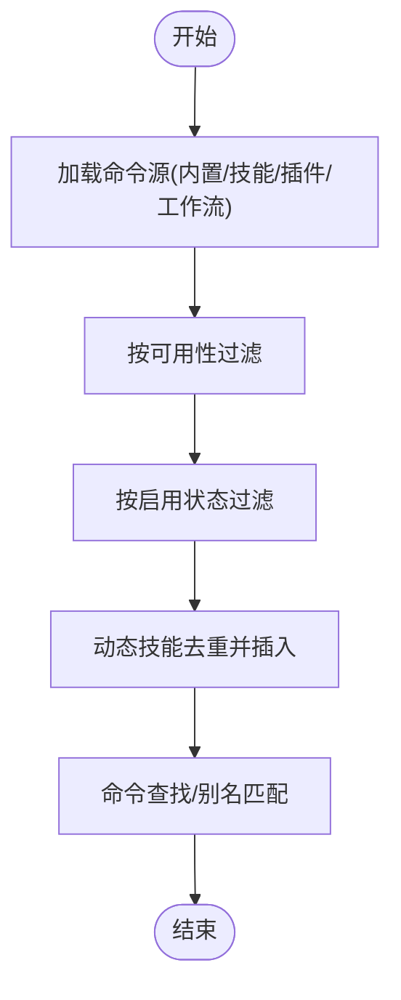
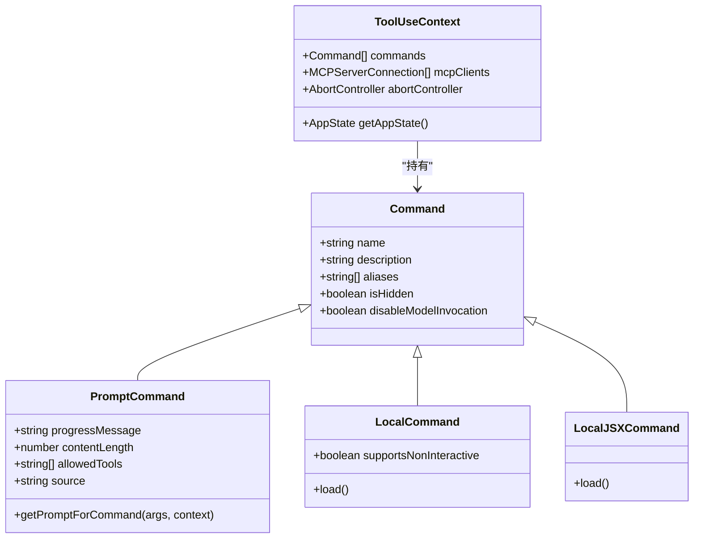
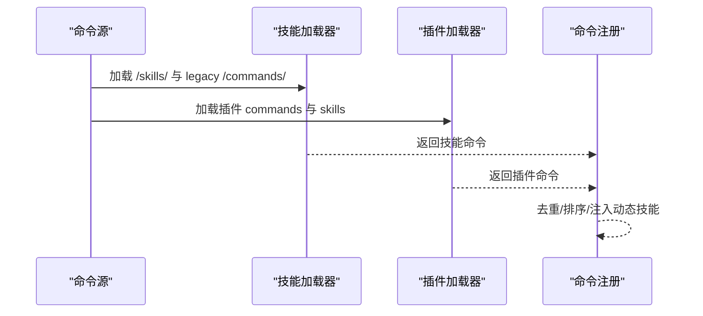
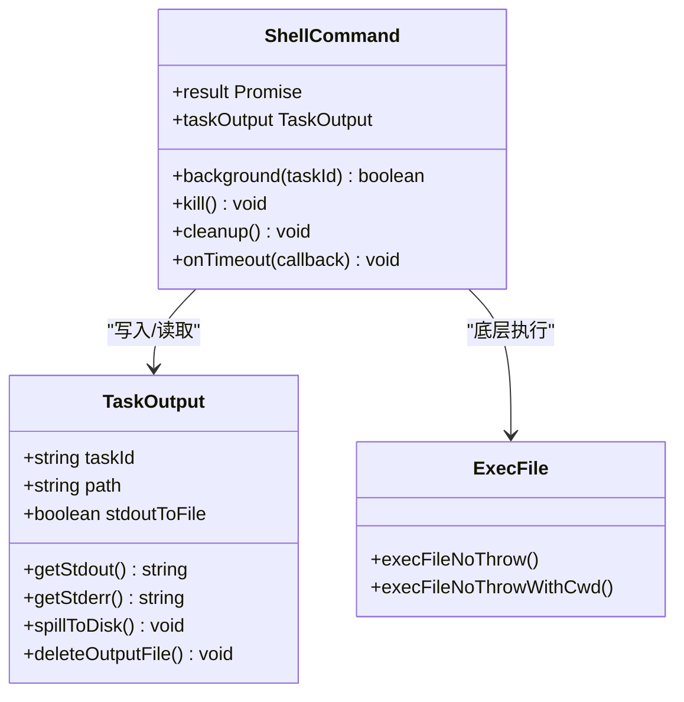
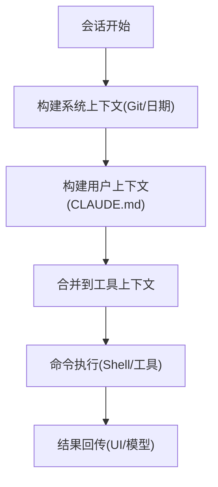
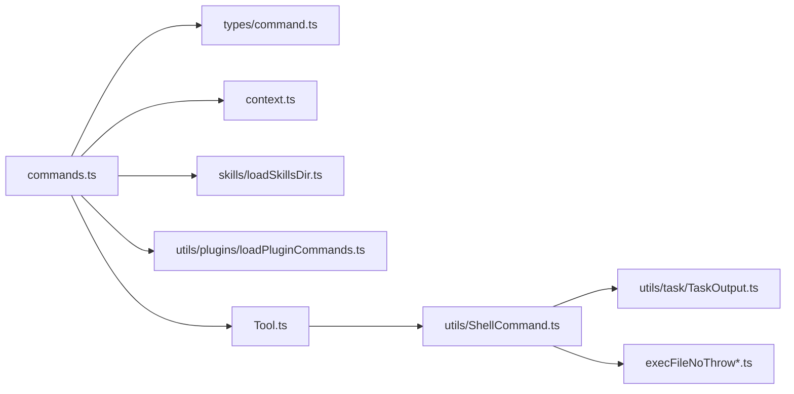

# 命令执行引擎

<cite>
**本文档引用的文件**
- [src/commands.ts](file://src/commands.ts)
- [src/types/command.ts](file://src/types/command.ts)
- [src/skills/loadSkillsDir.ts](file://src/skills/loadSkillsDir.ts)
- [src/utils/plugins/loadPluginCommands.ts](file://src/utils/plugins/loadPluginCommands.ts)
- [src/Tool.ts](file://src/Tool.ts)
- [src/utils/ShellCommand.ts](file://src/utils/ShellCommand.ts)
- [src/utils/task/TaskOutput.ts](file://src/utils/task/TaskOutput.ts)
- [src/utils/execFileNoThrow.ts](file://src/utils/execFileNoThrow.ts)
- [src/utils/execFileNoThrowPortable.ts](file://src/utils/execFileNoThrowPortable.ts)
- [src/context.ts](file://src/context.ts)
- [src/commands/help/index.ts](file://src/commands/help/index.ts)
- [src/commands/exit/index.ts](file://src/commands/exit/index.ts)
- [src/commands/init.ts](file://src/commands/init.ts)
- [src/commands/init-verifiers.ts](file://src/commands/init-verifiers.ts)
</cite>

## 目录
1. [简介](#简介)
2. [项目结构](#项目结构)
3. [核心组件](#核心组件)
4. [架构总览](#架构总览)
5. [详细组件分析](#详细组件分析)
6. [依赖关系分析](#依赖关系分析)
7. [性能考量](#性能考量)
8. [故障排除指南](#故障排除指南)
9. [结论](#结论)
10. [附录](#附录)

## 简介
本文件系统性阐述命令执行引擎的设计与实现，覆盖命令解析、参数处理、执行流程、命令发现（查找、别名匹配、动态加载）、异步执行与超时控制、错误处理、以及命令执行上下文的构建与传递。文档同时面向初学者与高级用户：初学者可从“核心组件”和“架构总览”建立整体认知；高级用户可参考“性能考量”“故障排除指南”和“附录”的最佳实践与调试技巧。

## 项目结构
命令执行引擎围绕以下关键模块组织：
- 命令注册与发现：集中于命令清单、可用性过滤、动态技能注入与插件命令加载
- 命令类型与上下文：定义命令接口、上下文结构与工具使用上下文
- 执行后端：Shell 命令封装、输出收集与进度轮询、超时与中断处理
- 技能与插件：从目录、插件、MCP 等来源动态加载技能与命令
- 上下文注入：系统状态、用户环境、CLAUDE.md 等上下文注入

图表来源
- [src/commands.ts:257-519](file://src/commands.ts#L257-L519)
- [src/types/command.ts:1-218](file://src/types/command.ts#L1-L218)
- [src/skills/loadSkillsDir.ts:638-800](file://src/skills/loadSkillsDir.ts#L638-L800)
- [src/utils/plugins/loadPluginCommands.ts:414-677](file://src/utils/plugins/loadPluginCommands.ts#L414-L677)
- [src/Tool.ts:158-300](file://src/Tool.ts#L158-L300)
- [src/utils/ShellCommand.ts:106-382](file://src/utils/ShellCommand.ts#L106-L382)
- [src/utils/task/TaskOutput.ts:32-164](file://src/utils/task/TaskOutput.ts#L32-L164)
- [src/context.ts:116-189](file://src/context.ts#L116-L189)

章节来源
- [src/commands.ts:257-519](file://src/commands.ts#L257-L519)
- [src/types/command.ts:1-218](file://src/types/command.ts#L1-L218)
- [src/skills/loadSkillsDir.ts:638-800](file://src/skills/loadSkillsDir.ts#L638-L800)
- [src/utils/plugins/loadPluginCommands.ts:414-677](file://src/utils/plugins/loadPluginCommands.ts#L414-L677)
- [src/Tool.ts:158-300](file://src/Tool.ts#L158-L300)
- [src/utils/ShellCommand.ts:106-382](file://src/utils/ShellCommand.ts#L106-L382)
- [src/utils/task/TaskOutput.ts:32-164](file://src/utils/task/TaskOutput.ts#L32-L164)
- [src/context.ts:116-189](file://src/context.ts#L116-L189)

## 核心组件
- 命令注册与发现
  - 集中导出命令列表，支持条件启用、可用性过滤、动态技能插入与缓存清理
  - 提供命令查找、别名匹配、描述格式化等工具函数
- 命令类型与上下文
  - 定义命令基类、提示型命令、本地命令、本地 JSX 命令及其上下文
  - 工具使用上下文承载消息、权限、MCP 连接、会话信息等
- 执行后端
  - ShellCommand 封装子进程，支持超时、自动后台化、大小监控、输出持久化
  - TaskOutput 统一 stdout/stderr 管理，支持内存缓冲与磁盘溢出
- 技能与插件
  - 技能目录扫描、Frontmatter 解析、路径过滤、重复去重
  - 插件命令加载、命名空间拼接、变量替换、元数据覆盖
- 上下文注入
  - 系统上下文（Git 状态、日期等）与用户上下文（CLAUDE.md 内容）缓存注入

章节来源
- [src/commands.ts:419-519](file://src/commands.ts#L419-L519)
- [src/types/command.ts:16-218](file://src/types/command.ts#L16-L218)
- [src/Tool.ts:158-300](file://src/Tool.ts#L158-L300)
- [src/utils/ShellCommand.ts:106-382](file://src/utils/ShellCommand.ts#L106-L382)
- [src/utils/task/TaskOutput.ts:32-164](file://src/utils/task/TaskOutput.ts#L32-L164)
- [src/skills/loadSkillsDir.ts:638-800](file://src/skills/loadSkillsDir.ts#L638-L800)
- [src/utils/plugins/loadPluginCommands.ts:414-677](file://src/utils/plugins/loadPluginCommands.ts#L414-L677)
- [src/context.ts:116-189](file://src/context.ts#L116-L189)

## 架构总览
命令执行引擎采用“命令注册—上下文构建—动态加载—执行后端—结果回传”的流水线式设计。命令通过统一入口注册，按可用性与启用状态筛选；技能与插件在运行期动态加载并注入；执行阶段由 ShellCommand 负责子进程生命周期、超时与输出管理；最终通过工具上下文将结果与进度反馈给 UI 或模型。

图表来源
- [src/commands.ts:690-721](file://src/commands.ts#L690-L721)
- [src/Tool.ts:158-300](file://src/Tool.ts#L158-L300)
- [src/utils/ShellCommand.ts:106-382](file://src/utils/ShellCommand.ts#L106-L382)
- [src/utils/task/TaskOutput.ts:32-164](file://src/utils/task/TaskOutput.ts#L32-L164)

## 详细组件分析

### 命令注册与发现机制
- 命令清单与缓存
  - 使用记忆化缓存加载所有命令源（内置、技能、插件、工作流），避免重复 I/O
  - 支持按工作目录缓存，动态技能按需刷新
- 可用性与启用过滤
  - 按认证/提供商要求过滤（如 Claude.ai 订阅者、Console 直连）
  - 结合功能开关与环境变量进行启用判断
- 动态技能注入
  - 在现有命令列表中插入动态技能，保持顺序与去重
- 命令查找与别名匹配
  - 支持精确名称、显示名称与别名匹配
  - 提供描述格式化，标注来源（插件、内置、捆绑）

图表来源
- [src/commands.ts:419-519](file://src/commands.ts#L419-L519)
- [src/commands.ts:690-721](file://src/commands.ts#L690-L721)

章节来源
- [src/commands.ts:419-519](file://src/commands.ts#L419-L519)
- [src/commands.ts:690-721](file://src/commands.ts#L690-L721)

### 命令类型与上下文
- 命令类型
  - Prompt 命令：生成提示文本，支持工具白名单、effort、路径过滤等
  - Local 命令：延迟加载，返回文本或紧凑结果
  - Local JSX 命令：延迟加载 UI 组件，用于 REPL 环境
- 工具使用上下文
  - 包含命令集合、MCP 客户端、消息、权限规则、主题、IDE 状态等
  - 支持设置工具 JSX、通知、系统消息追加、文件历史与归属追踪等

图表来源
- [src/types/command.ts:16-218](file://src/types/command.ts#L16-L218)
- [src/Tool.ts:158-300](file://src/Tool.ts#L158-L300)

章节来源
- [src/types/command.ts:16-218](file://src/types/command.ts#L16-L218)
- [src/Tool.ts:158-300](file://src/Tool.ts#L158-L300)

### 技能与插件动态加载
- 技能加载
  - 从策略、用户、项目、附加目录与遗留 commands 目录加载
  - Frontmatter 解析、路径过滤、重复去重、条件技能延迟激活
- 插件命令加载
  - 支持默认 commands 目录、自定义路径、内联内容
  - 命名空间拼接（plugin:namespace:name）、变量替换、元数据覆盖

图表来源
- [src/skills/loadSkillsDir.ts:638-800](file://src/skills/loadSkillsDir.ts#L638-L800)
- [src/utils/plugins/loadPluginCommands.ts:414-677](file://src/utils/plugins/loadPluginCommands.ts#L414-L677)
- [src/commands.ts:451-471](file://src/commands.ts#L451-L471)

章节来源
- [src/skills/loadSkillsDir.ts:638-800](file://src/skills/loadSkillsDir.ts#L638-L800)
- [src/utils/plugins/loadPluginCommands.ts:414-677](file://src/utils/plugins/loadPluginCommands.ts#L414-L677)
- [src/commands.ts:451-471](file://src/commands.ts#L451-L471)

### 执行后端：Shell 命令封装与输出管理
- ShellCommand
  - 子进程封装，支持超时回调、自动后台化、大小监控、清理监听器
  - 文件模式（bash）与管道模式（hooks）分别处理 stdout/stderr
- TaskOutput
  - 统一 stdout/stderr 数据源，内存缓冲与磁盘溢出切换
  - 文件模式下通过共享轮询器提取进度，管道模式实时更新最近行
- 执行辅助
  - execFileNoThrow 与 execFileNoThrowPortable 提供跨平台同步/异步执行与错误保留

图表来源
- [src/utils/ShellCommand.ts:106-382](file://src/utils/ShellCommand.ts#L106-L382)
- [src/utils/task/TaskOutput.ts:32-164](file://src/utils/task/TaskOutput.ts#L32-L164)
- [src/utils/execFileNoThrow.ts:86-131](file://src/utils/execFileNoThrow.ts#L86-L131)
- [src/utils/execFileNoThrowPortable.ts:48-89](file://src/utils/execFileNoThrowPortable.ts#L48-L89)

章节来源
- [src/utils/ShellCommand.ts:106-382](file://src/utils/ShellCommand.ts#L106-L382)
- [src/utils/task/TaskOutput.ts:32-164](file://src/utils/task/TaskOutput.ts#L32-L164)
- [src/utils/execFileNoThrow.ts:86-131](file://src/utils/execFileNoThrow.ts#L86-L131)
- [src/utils/execFileNoThrowPortable.ts:48-89](file://src/utils/execFileNoThrowPortable.ts#L48-L89)

### 命令执行上下文构建与传递
- 上下文注入
  - 系统上下文：Git 状态、日期、可选缓存破坏注入
  - 用户上下文：CLAUDE.md 内容、日期、可配置禁用策略
- 工具上下文
  - 消息、权限规则、MCP 客户端、主题、IDE 状态、会话标识等
  - 支持设置工具 JSX、通知、系统消息、文件历史与归属追踪

图表来源
- [src/context.ts:116-189](file://src/context.ts#L116-L189)
- [src/Tool.ts:158-300](file://src/Tool.ts#L158-L300)

章节来源
- [src/context.ts:116-189](file://src/context.ts#L116-L189)
- [src/Tool.ts:158-300](file://src/Tool.ts#L158-L300)

### 典型命令示例与参数处理
- 内置命令示例
  - help：本地 JSX 命令，延迟加载帮助界面
  - exit：本地 JSX 命令，支持立即执行
- 参数处理
  - Prompt 命令支持参数名、参数提示、工具白名单、effort 等
  - 技能与插件命令通过 Frontmatter 解析参数、路径过滤、模型选择等

章节来源
- [src/commands/help/index.ts:1-13](file://src/commands/help/index.ts#L1-L13)
- [src/commands/exit/index.ts:1-15](file://src/commands/exit/index.ts#L1-L15)
- [src/types/command.ts:25-57](file://src/types/command.ts#L25-L57)
- [src/skills/loadSkillsDir.ts:185-265](file://src/skills/loadSkillsDir.ts#L185-L265)
- [src/utils/plugins/loadPluginCommands.ts:218-412](file://src/utils/plugins/loadPluginCommands.ts#L218-L412)

## 依赖关系分析
- 命令层依赖类型定义与上下文，通过工具上下文传递执行环境
- 执行层依赖 Shell 封装与任务输出管理，后者负责跨模式的输出一致性
- 技能与插件层通过统一接口注入命令，保证与内置命令一致的生命周期
- 上下文层为执行提供系统与用户信息，影响命令可用性与行为

图表来源
- [src/commands.ts:257-519](file://src/commands.ts#L257-L519)
- [src/types/command.ts:1-218](file://src/types/command.ts#L1-L218)
- [src/context.ts:116-189](file://src/context.ts#L116-L189)
- [src/skills/loadSkillsDir.ts:638-800](file://src/skills/loadSkillsDir.ts#L638-L800)
- [src/utils/plugins/loadPluginCommands.ts:414-677](file://src/utils/plugins/loadPluginCommands.ts#L414-L677)
- [src/Tool.ts:158-300](file://src/Tool.ts#L158-L300)
- [src/utils/ShellCommand.ts:106-382](file://src/utils/ShellCommand.ts#L106-L382)
- [src/utils/task/TaskOutput.ts:32-164](file://src/utils/task/TaskOutput.ts#L32-L164)
- [src/utils/execFileNoThrow.ts:86-131](file://src/utils/execFileNoThrow.ts#L86-L131)

章节来源
- [src/commands.ts:257-519](file://src/commands.ts#L257-L519)
- [src/types/command.ts:1-218](file://src/types/command.ts#L1-L218)
- [src/context.ts:116-189](file://src/context.ts#L116-L189)
- [src/skills/loadSkillsDir.ts:638-800](file://src/skills/loadSkillsDir.ts#L638-L800)
- [src/utils/plugins/loadPluginCommands.ts:414-677](file://src/utils/plugins/loadPluginCommands.ts#L414-L677)
- [src/Tool.ts:158-300](file://src/Tool.ts#L158-L300)
- [src/utils/ShellCommand.ts:106-382](file://src/utils/ShellCommand.ts#L106-L382)
- [src/utils/task/TaskOutput.ts:32-164](file://src/utils/task/TaskOutput.ts#L32-L164)
- [src/utils/execFileNoThrow.ts:86-131](file://src/utils/execFileNoThrow.ts#L86-L131)

## 性能考量
- 缓存策略
  - 命令加载与技能索引使用记忆化缓存，显著降低重复 I/O
  - 上下文注入按会话缓存，减少频繁文件系统访问
- 输出管理
  - TaskOutput 在内存不足时自动溢出至磁盘，避免内存峰值
  - 文件模式通过轮询提取进度，管道模式实时更新最近行
- 并发与超时
  - ShellCommand 支持超时回调与自动后台化，防止阻塞 UI
  - 大输出文件自动截断并指向磁盘路径，避免传输开销
- 资源限制
  - 输出大小监控与信号量控制，防止磁盘被大输出填满

章节来源
- [src/commands.ts:451-471](file://src/commands.ts#L451-L471)
- [src/utils/task/TaskOutput.ts:256-326](file://src/utils/task/TaskOutput.ts#L256-L326)
- [src/utils/ShellCommand.ts:239-261](file://src/utils/ShellCommand.ts#L239-L261)

## 故障排除指南
- 命令未找到
  - 使用命令查找函数确认名称/别名是否正确
  - 检查命令可用性与启用状态，必要时刷新缓存
- 执行超时或卡死
  - 检查自动后台化策略与超时阈值
  - 观察输出文件大小，必要时手动清理或增大阈值
- 输出过大导致内存压力
  - 确认 TaskOutput 是否已溢出至磁盘
  - 检查轮询器是否正常工作，确保进度能及时获取
- 权限与安全
  - 核对工具权限上下文与钩子规则
  - 对敏感命令启用模型调用禁用或用户触发模式

章节来源
- [src/commands.ts:690-721](file://src/commands.ts#L690-L721)
- [src/utils/ShellCommand.ts:135-141](file://src/utils/ShellCommand.ts#L135-L141)
- [src/utils/task/TaskOutput.ts:256-326](file://src/utils/task/TaskOutput.ts#L256-L326)
- [src/Tool.ts:123-148](file://src/Tool.ts#L123-L148)

## 结论
命令执行引擎以清晰的分层设计实现了从命令注册、上下文构建、动态加载到执行与结果回传的全链路能力。通过缓存、输出管理与超时控制，系统在复杂场景下仍能保持稳定与高性能。建议在生产环境中结合日志与诊断工具，持续监控命令执行路径与资源占用，以获得最佳体验。

## 附录
- 初学者入门
  - 了解命令类型与上下文结构，从 help/exit 等简单命令入手
  - 关注 Frontmatter 的参数与工具白名单配置
- 高级用户优化
  - 合理设置超时与自动后台化策略，平衡响应与吞吐
  - 使用磁盘溢出与进度轮询提升长输出命令的可观测性
  - 通过上下文注入与权限规则实现细粒度的安全控制