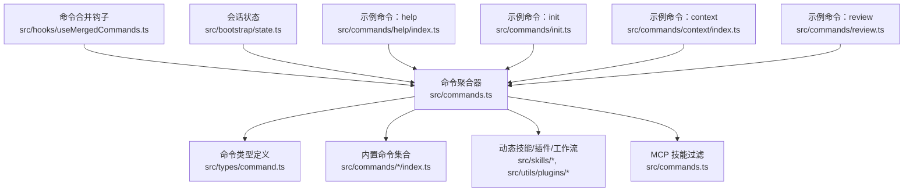
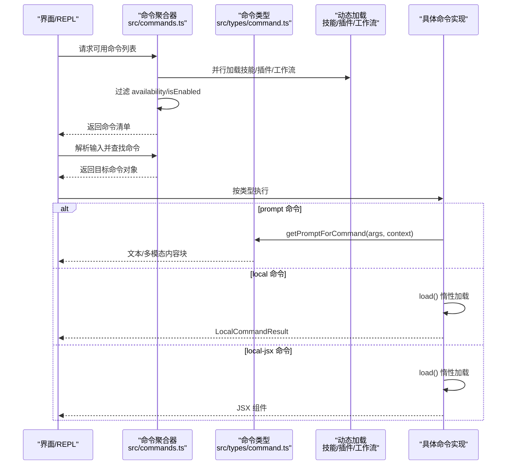
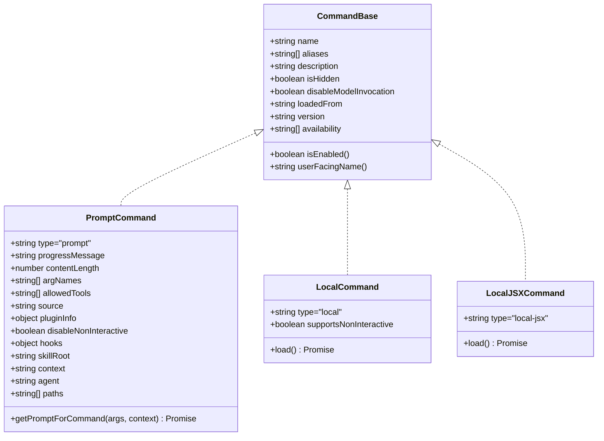
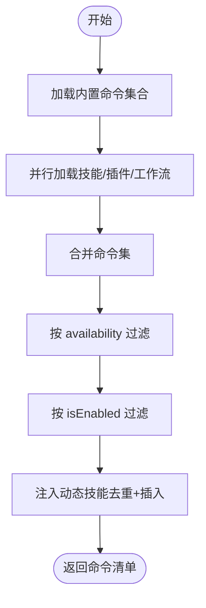
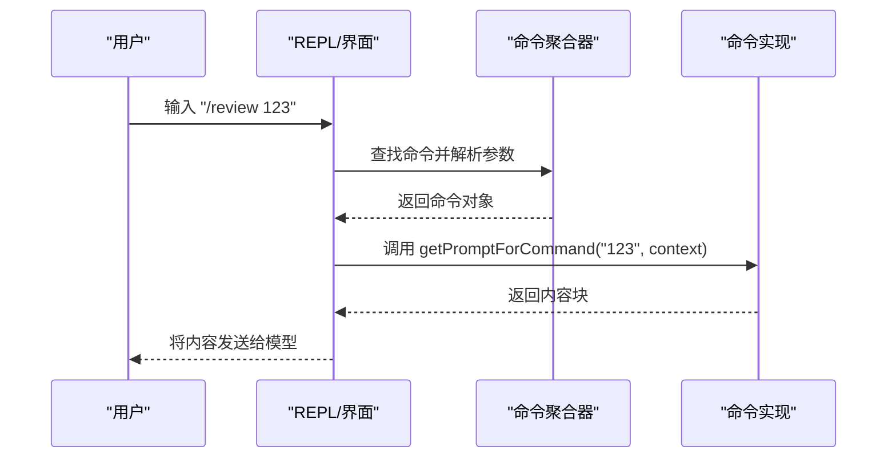
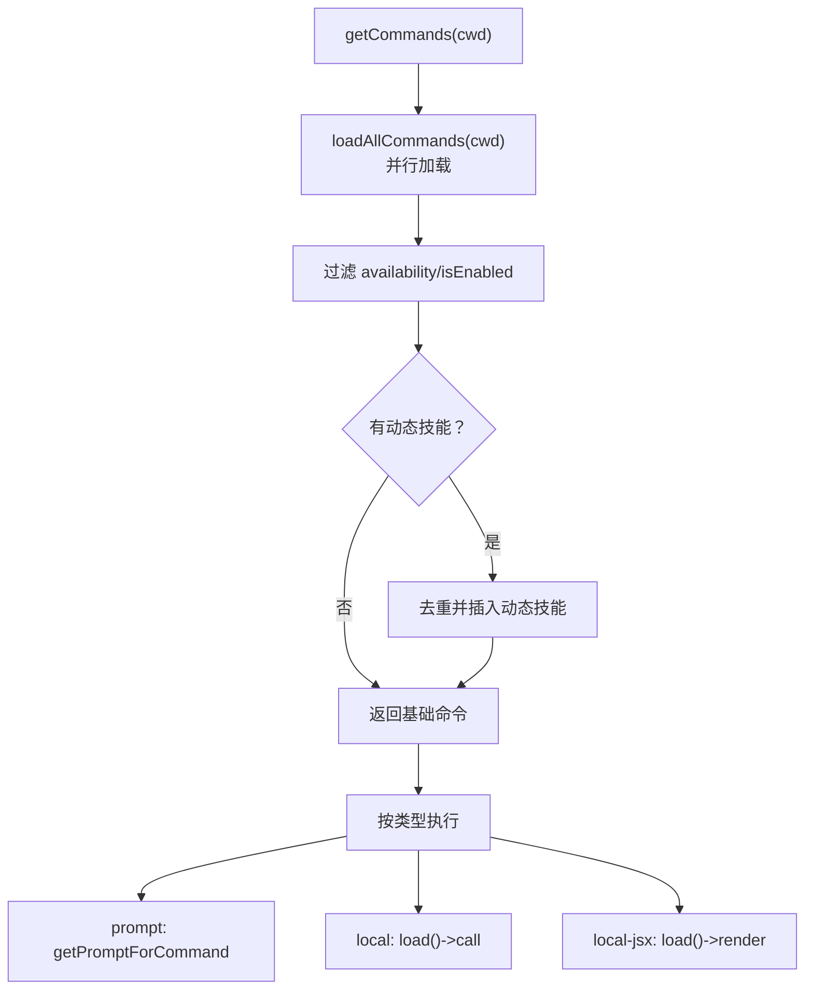
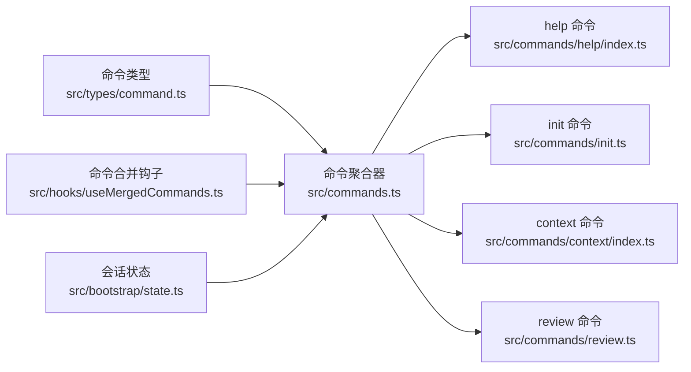

# 命令系统

<cite>
**本文引用的文件**
- [src/commands.ts](file://src/commands.ts)
- [src/types/command.ts](file://src/types/command.ts)
- [src/hooks/useMergedCommands.ts](file://src/hooks/useMergedCommands.ts)
- [src/bootstrap/state.ts](file://src/bootstrap/state.ts)
- [src/commands/help/index.ts](file://src/commands/help/index.ts)
- [src/commands/init.ts](file://src/commands/init.ts)
- [src/commands/context/index.ts](file://src/commands/context/index.ts)
- [src/commands/review.ts](file://src/commands/review.ts)
</cite>

## 目录
1. [引言](#引言)
2. [项目结构](#项目结构)
3. [核心组件](#核心组件)
4. [架构总览](#架构总览)
5. [详细组件分析](#详细组件分析)
6. [依赖关系分析](#依赖关系分析)
7. [性能考量](#性能考量)
8. [故障排查指南](#故障排查指南)
9. [结论](#结论)
10. [附录](#附录)

## 引言
本文件系统性梳理 Claude Code 的命令系统，围绕“命令的定义、注册与执行”展开，重点解释 slash 命令（prompt 类型）的工作原理与参数解析流程，阐明命令生命周期中的发现、参数校验、权限检查与执行顺序，并对比命令与工具（Tools）的异同。文末提供面向初学者的概念入门与面向高级用户的扩展实践，辅以可定位到源码的路径指引，帮助读者快速上手与深度定制。

## 项目结构
命令系统的核心由以下模块构成：
- 命令类型与契约：统一的 Command 接口与子类型（prompt/local/local-jsx），定义命令元数据、可用性与执行签名。
- 命令聚合与发现：集中导出所有内置命令，动态加载技能、插件与工作流命令，按可用性与启用状态过滤。
- 命令生命周期：从命令发现、可用性与启用检查、动态技能注入，到最终执行与结果呈现。
- 命令与工具的关系：命令是用户可见的入口，工具是模型或本地执行的原子能力；命令可调用工具，二者在运行时协同。

图表来源
- [src/commands.ts:257-519](file://src/commands.ts#L257-L519)
- [src/types/command.ts:175-217](file://src/types/command.ts#L175-L217)
- [src/hooks/useMergedCommands.ts:5-15](file://src/hooks/useMergedCommands.ts#L5-L15)
- [src/bootstrap/state.ts:260-426](file://src/bootstrap/state.ts#L260-L426)
- [src/commands/help/index.ts:3-10](file://src/commands/help/index.ts#L3-L10)
- [src/commands/init.ts:226-256](file://src/commands/init.ts#L226-L256)
- [src/commands/context/index.ts:4-24](file://src/commands/context/index.ts#L4-L24)
- [src/commands/review.ts:33-54](file://src/commands/review.ts#L33-L54)

章节来源
- [src/commands.ts:257-519](file://src/commands.ts#L257-L519)
- [src/types/command.ts:175-217](file://src/types/command.ts#L175-L217)

## 核心组件
- 命令类型与接口
  - CommandBase：命令通用元数据（名称、别名、描述、可用性、启用条件、来源等）
  - PromptCommand：面向模型的“技能型”命令，通过 getPromptForCommand(args, context) 生成提示内容
  - LocalCommand：本地命令，支持非交互式执行，通过 load() 惰性加载实现
  - LocalJSXCommand：本地 JSX 命令，惰性加载 UI 组件，用于终端内渲染
- 命令聚合与过滤
  - 内置命令集合与条件导入（特性开关）
  - 动态加载技能、插件与工作流命令
  - 可用性过滤（按订阅/提供商环境）、启用状态过滤、动态技能去重与插入
- 命令生命周期
  - 发现：加载内置、技能、插件、工作流命令
  - 过滤：按 availability/isEnabled 与动态技能策略过滤
  - 执行：根据类型选择执行路径（prompt 展开为文本，local 调用 load 后的 call，local-jsx 渲染 UI）
  - 结果呈现：根据 LocalCommandResult 或 JSX 返回值决定显示方式

章节来源
- [src/types/command.ts:16-217](file://src/types/command.ts#L16-L217)
- [src/commands.ts:257-519](file://src/commands.ts#L257-L519)

## 架构总览
下图展示了命令系统的关键交互：命令聚合器负责发现与过滤，类型定义约束命令行为，动态技能与插件增强命令集，最终由 REPL/界面层触发执行。

图表来源
- [src/commands.ts:478-519](file://src/commands.ts#L478-L519)
- [src/types/command.ts:53-56](file://src/types/command.ts#L53-L56)
- [src/types/command.ts:62-72](file://src/types/command.ts#L62-L72)
- [src/types/command.ts:131-142](file://src/types/command.ts#L131-L142)

## 详细组件分析

### 命令类型与数据模型
- CommandBase：统一承载命令元信息，如 name、aliases、description、availability、isEnabled、loadedFrom、kind 等
- PromptCommand：面向模型的“技能”，通过 getPromptForCommand(args, context) 产出内容块，常用于 /review、/init 等
- LocalCommand：本地命令，支持非交互式执行，通过 load() 返回 call(args, context) 实现
- LocalJSXCommand：本地 JSX 命令，通过 load() 返回 call(onDone, context, args) 实现 UI 渲染与结果回调

图表来源
- [src/types/command.ts:175-217](file://src/types/command.ts#L175-L217)
- [src/types/command.ts:25-57](file://src/types/command.ts#L25-L57)
- [src/types/command.ts:74-78](file://src/types/command.ts#L74-L78)
- [src/types/command.ts:144-152](file://src/types/command.ts#L144-L152)

章节来源
- [src/types/command.ts:16-217](file://src/types/command.ts#L16-L217)

### 命令发现与聚合
- 内置命令集合：通过集中导出与条件导入（特性开关）组织命令，避免无用模块进入构建
- 动态命令源：技能目录、插件技能、工作流命令，均通过异步加载并在同一数组中合并
- 过滤策略：
  - availability：按订阅/提供商环境筛选（如 claude.ai 订阅者、Console 直连用户）
  - isEnabled：按功能开关/环境变量控制是否启用
  - 动态技能：去重后插入到插件技能之后、内置命令之前
- 缓存与性能：对加载过程进行 memoize，减少重复 I/O 与动态导入成本

图表来源
- [src/commands.ts:451-519](file://src/commands.ts#L451-L519)
- [src/commands.ts:419-445](file://src/commands.ts#L419-L445)
- [src/commands.ts:485-518](file://src/commands.ts#L485-L518)

章节来源
- [src/commands.ts:451-519](file://src/commands.ts#L451-L519)
- [src/commands.ts:419-445](file://src/commands.ts#L419-L445)

### slash 命令的工作原理与参数解析
- 触发与解析：REPL/界面层接收用户输入，解析命令名与参数，调用 findCommand/getCommand 获取目标命令
- 参数传递：args 字符串传入命令实现；prompt 命令通过 getPromptForCommand(args, context) 生成内容块
- 示例：/review 命令将 PR 编号作为参数拼接进提示词；/init 在不同特性开关下切换提示模板
- 结果处理：prompt 命令返回内容块供模型消费；local 命令返回 LocalCommandResult；local-jsx 命令返回 JSX 组件

图表来源
- [src/commands.ts:690-721](file://src/commands.ts#L690-L721)
- [src/commands/review.ts:40-42](file://src/commands/review.ts#L40-L42)

章节来源
- [src/commands.ts:690-721](file://src/commands.ts#L690-L721)
- [src/commands/review.ts:33-54](file://src/commands/review.ts#L33-L54)

### 命令生命周期详解
- 命令发现：getCommands(cwd) 并行加载内置、技能、插件、工作流命令
- 权限与可用性：meetsAvailabilityRequirement 按订阅/提供商环境过滤；isCommandEnabled 按功能开关过滤
- 动态技能注入：动态技能去重后插入到合适位置，保证插件优先、内置次之
- 执行与结果：
  - prompt：生成内容块，供模型使用
  - local：惰性加载后执行，返回文本或紧凑化结果
  - local-jsx：惰性加载后渲染 UI，支持 onDone 回调与消息注入

图表来源
- [src/commands.ts:478-519](file://src/commands.ts#L478-L519)
- [src/commands.ts:451-471](file://src/commands.ts#L451-L471)
- [src/commands.ts:588-610](file://src/commands.ts#L588-L610)

章节来源
- [src/commands.ts:478-519](file://src/commands.ts#L478-L519)
- [src/commands.ts:588-610](file://src/commands.ts#L588-L610)

### 命令与工具的区别与联系
- 区别
  - 命令（Command）：面向用户/模型的入口，强调“做什么”与“何时做”
  - 工具（Tool）：面向执行的原子能力，强调“如何做”
- 联系
  - 命令可调用工具完成具体任务；命令类型中的 allowedTools、hooks 等字段体现与工具的协作
  - 命令与工具共同构成“技能索引”，供模型选择与调用

章节来源
- [src/types/command.ts:30-31](file://src/types/command.ts#L30-L31)
- [src/types/command.ts:38-41](file://src/types/command.ts#L38-L41)

### 创建自定义命令
- 定义命令对象：遵循 CommandBase/PromptCommand/LocalCommand/LocalJSXCommand 中任一类型
- 注册命令：
  - 将命令对象导出到命令聚合器中（如在 src/commands.ts 的 COMMANDS 数组中加入）
  - 若需动态加载，确保 load() 返回对应模块的 call 函数
- 参数处理：
  - 对于 prompt 命令，在 getPromptForCommand(args, context) 中解析并拼装提示
  - 对于 local 命令，在 call(args, context) 中解析参数并执行
- 错误处理：
  - 使用 try/catch 包裹异步逻辑
  - 对于 UI 命令，通过 onDone 回调传递错误信息或跳过消息
- 示例参考：
  - /help：local-jsx 命令，惰性加载 UI
  - /init：prompt 命令，按特性开关切换提示模板
  - /context：同时提供交互式与非交互式两个命令变体
  - /review：prompt 命令，将参数注入提示词

章节来源
- [src/commands/help/index.ts:3-10](file://src/commands/help/index.ts#L3-L10)
- [src/commands/init.ts:226-256](file://src/commands/init.ts#L226-L256)
- [src/commands/context/index.ts:4-24](file://src/commands/context/index.ts#L4-L24)
- [src/commands/review.ts:33-54](file://src/commands/review.ts#L33-L54)

## 依赖关系分析
- 命令聚合器依赖命令类型定义与动态加载模块
- 命令合并钩子在前端层将 MCP 提供的命令与内置命令去重合并
- 会话状态影响部分命令的可用性（如非交互式会话下的特殊命令）

图表来源
- [src/commands.ts:257-519](file://src/commands.ts#L257-L519)
- [src/hooks/useMergedCommands.ts:5-15](file://src/hooks/useMergedCommands.ts#L5-L15)
- [src/bootstrap/state.ts:260-426](file://src/bootstrap/state.ts#L260-L426)
- [src/commands/help/index.ts:3-10](file://src/commands/help/index.ts#L3-L10)
- [src/commands/init.ts:226-256](file://src/commands/init.ts#L226-L256)
- [src/commands/context/index.ts:4-24](file://src/commands/context/index.ts#L4-L24)
- [src/commands/review.ts:33-54](file://src/commands/review.ts#L33-L54)

章节来源
- [src/commands.ts:257-519](file://src/commands.ts#L257-L519)
- [src/hooks/useMergedCommands.ts:5-15](file://src/hooks/useMergedCommands.ts#L5-L15)
- [src/bootstrap/state.ts:260-426](file://src/bootstrap/state.ts#L260-L426)

## 性能考量
- 惰性加载：命令与 UI 组件通过 load() 惰性加载，降低启动时内存占用
- 并行加载：动态命令源采用 Promise.all 并行加载，缩短等待时间
- 缓存策略：对命令聚合与技能加载进行 memoize，避免重复 I/O 与动态导入
- 远程安全：REMOTE_SAFE_COMMANDS 与 BRIDGE_SAFE_COMMANDS 显式白名单，避免远程桥接场景中的不安全命令

章节来源
- [src/commands.ts:525-541](file://src/commands.ts#L525-L541)
- [src/commands.ts:621-688](file://src/commands.ts#L621-L688)

## 故障排查指南
- 命令未出现
  - 检查 availability 是否满足当前环境（如 claude.ai 订阅者/Console 用户）
  - 检查 isEnabled 是否被功能开关禁用
  - 确认命令未被动态技能去重覆盖
- 命令执行失败
  - 对于 prompt 命令：确认 getPromptForCommand 正确解析参数并返回内容块
  - 对于 local 命令：确认 load() 返回的 call 正常执行且返回 LocalCommandResult
  - 对于 local-jsx 命令：确认 load() 返回的 call 正常渲染并调用 onDone
- 远程/桥接不可用
  - 确认命令在 BRIDGE_SAFE_COMMANDS 或类型为 prompt
  - 非本地 UI 命令（local-jsx）默认禁止

章节来源
- [src/commands.ts:419-445](file://src/commands.ts#L419-L445)
- [src/commands.ts:674-678](file://src/commands.ts#L674-L678)

## 结论
命令系统以统一的类型契约与灵活的聚合机制为核心，结合动态加载与缓存策略，实现了高效、可扩展的命令生态。slash 命令通过 prompt 型命令将用户意图转化为模型可理解的内容，而本地命令与 JSX 命令则分别满足非交互式与交互式场景的需求。通过 availability/isEnabled 与动态技能注入，系统在功能开关与运行时上下文中保持高度灵活性。对于扩展者而言，遵循类型约定、正确解析参数、妥善处理错误与结果呈现，即可快速创建高质量的自定义命令。

## 附录
- 常用命令示例参考路径
  - [help 命令定义:3-10](file://src/commands/help/index.ts#L3-L10)
  - [init 命令定义:226-256](file://src/commands/init.ts#L226-L256)
  - [context 命令定义（交互式/非交互式）:4-24](file://src/commands/context/index.ts#L4-L24)
  - [review 命令定义:33-54](file://src/commands/review.ts#L33-L54)
- 命令类型与接口参考路径
  - [命令类型定义:16-217](file://src/types/command.ts#L16-L217)
- 命令聚合与过滤参考路径
  - [命令聚合与过滤:478-519](file://src/commands.ts#L478-519)
  - [可用性过滤:419-445](file://src/commands.ts#L419-445)
  - [动态技能注入:485-518](file://src/commands.ts#L485-518)
- 命令合并钩子参考路径
  - [命令合并钩子:5-15](file://src/hooks/useMergedCommands.ts#L5-15)
- 会话状态参考路径
  - [会话状态初始化:260-426](file://src/bootstrap/state.ts#L260-426)