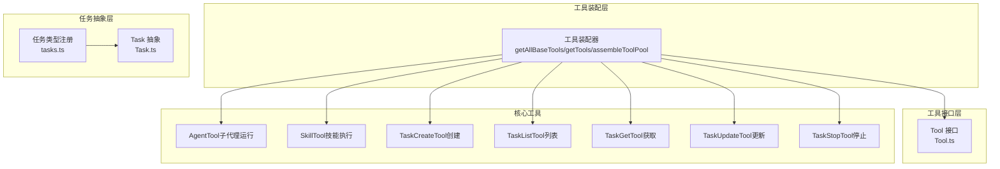
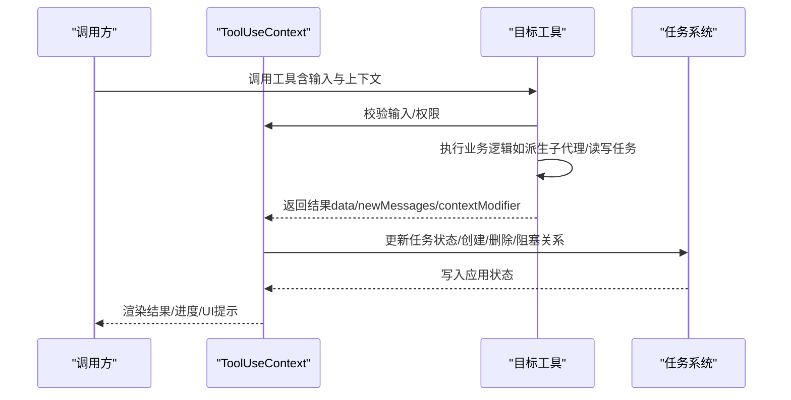
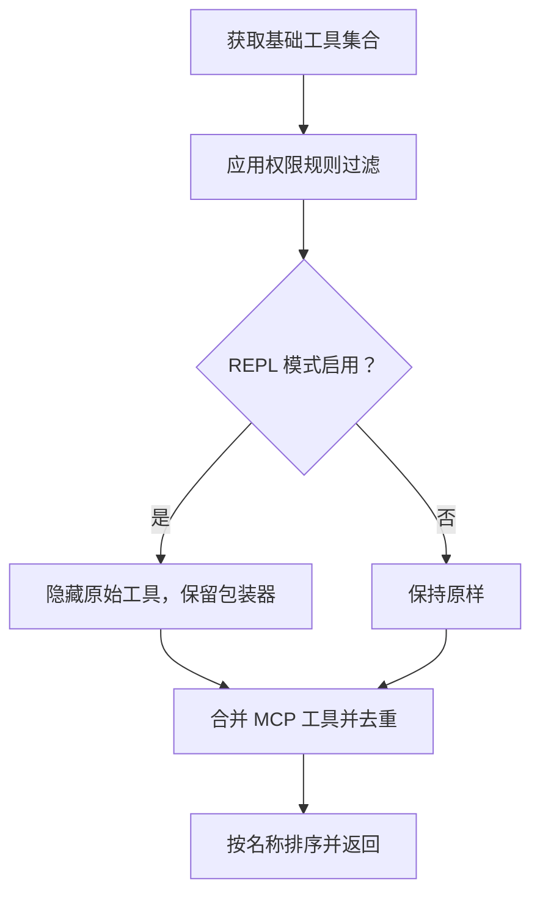

# 代理与任务管理工具

<cite>
**本文引用的文件**
- [src/tools.ts](file://src/tools.ts)
- [src/Tool.ts](file://src/Tool.ts)
- [src/tasks.ts](file://src/tasks.ts)
- [src/Task.ts](file://src/Task.ts)
- [src/tools/AgentTool/SkillTool.ts](file://src/tools/SkillTool/SkillTool.ts)
- [src/tools/AgentTool/TaskCreateTool.ts](file://src/tools/TaskCreateTool/TaskCreateTool.ts)
- [src/tools/AgentTool/TaskListTool.ts](file://src/tools/TaskListTool/TaskListTool.ts)
- [src/tools/AgentTool/TaskGetTool.ts](file://src/tools/TaskGetTool/TaskGetTool.ts)
- [src/tools/AgentTool/TaskStopTool.ts](file://src/tools/TaskStopTool/TaskStopTool.ts)
- [src/tools/AgentTool/TaskUpdateTool.ts](file://src/tools/TaskUpdateTool/TaskUpdateTool.ts)
</cite>

## 目录
1. [简介](#简介)
2. [项目结构](#项目结构)
3. [核心组件](#核心组件)
4. [架构总览](#架构总览)
5. [详细组件分析](#详细组件分析)
6. [依赖关系分析](#依赖关系分析)
7. [性能考量](#性能考量)
8. [故障排查指南](#故障排查指南)
9. [结论](#结论)
10. [附录](#附录)

## 简介
本文件为“代理与任务管理工具”的权威参考文档，覆盖以下工具与能力：
- 智能代理管理：AgentTool（通过子代理运行技能与工作流）
- 技能执行：SkillTool（按名称调用内置/外部技能，支持内联与派生子代理两种执行路径）
- 任务生命周期：TaskCreateTool（创建）、TaskListTool（列出）、TaskGetTool（查询）、TaskUpdateTool（更新）、TaskStopTool（停止）

文档从系统架构、数据流、处理逻辑、集成点、错误处理与性能特征等方面进行深入解析，并提供参数配置、状态管理、错误处理说明与最佳实践建议，帮助读者在复杂工作流中实现多代理协作与自动化任务编排。

## 项目结构
该模块位于 src/tools 下，围绕 Tool 接口与 Task 抽象构建，工具清单由工具装配器统一生成，任务类型由 Task 抽象定义并由具体任务实现承载。

图表来源
- [src/tools.ts](file://src/tools.ts)
- [src/Tool.ts](file://src/Tool.ts)
- [src/tasks.ts](file://src/tasks.ts)
- [src/Task.ts](file://src/Task.ts)

章节来源
- [src/tools.ts](file://src/tools.ts)
- [src/Tool.ts](file://src/Tool.ts)
- [src/tasks.ts](file://src/tasks.ts)
- [src/Task.ts](file://src/Task.ts)

## 核心组件
- 工具接口与装配
  - Tool 接口定义了工具的输入输出模式、权限校验、并发安全、描述与渲染等契约；工具装配器负责根据环境与权限规则生成可用工具集，并合并 MCP 工具。
- 任务抽象与类型
  - Task 抽象定义任务类型、状态、生命周期字段与任务 ID 生成策略；任务类型注册器集中管理可加载的任务实现。

章节来源
- [src/Tool.ts](file://src/Tool.ts)
- [src/Task.ts](file://src/Task.ts)
- [src/tasks.ts](file://src/tasks.ts)

## 架构总览
工具与任务的交互遵循如下流程：工具在 ToolUseContext 中被调用，可能产生新消息、进度事件或上下文修改；任务通过任务上下文在应用状态中被创建、更新与终止。

图表来源
- [src/Tool.ts](file://src/Tool.ts)
- [src/Task.ts](file://src/Task.ts)

## 详细组件分析

### AgentTool（智能代理管理）
- 角色定位
  - 作为“代理运行器”，在隔离的子代理上下文中执行技能或工作流，具备独立的令牌预算与消息历史。
- 关键行为
  - fork 子代理执行：准备上下文消息与代理定义，逐条推进消息流，向父消息注入技能进度。
  - 权限与分类：记录调用事件、插件信息、发现来源等遥测；支持自动分类器输入。
  - UI 与进度：通过进度回调渲染技能执行过程，支持透明包装器模式。
- 并发与安全
  - 默认非并发安全，避免共享状态冲突；fork 模式下隔离上下文。
- 参数与输入
  - 输入为技能命令名与可选参数；输出包含成功标志、命令名、执行状态、子代理 ID 与结果文本。
- 错误处理
  - 验证失败返回明确错误码；权限拒绝时提供建议规则；异常时清理 invokedSkills 状态。
- 最佳实践
  - 对高开销技能采用 fork 模式；合理设置模型与努力度；利用活动描述提升 UI 可视化。

章节来源
- [src/tools/SkillTool/SkillTool.ts](file://src/tools/SkillTool/SkillTool.ts)

### SkillTool（技能执行）
- 功能特性
  - 支持本地/外部（MCP）技能；可选择内联执行或 fork 子代理执行；远程规范技能（Ant 实验性）直接注入内容。
  - 自动记录技能使用、插件来源与发现来源；对仅使用安全属性的技能自动放行。
- 生命周期
  - 输入校验：检查技能名格式、存在性、是否允许模型调用、是否为提示型技能。
  - 权限决策：基于规则匹配（精确/前缀）与自动放行策略决定放行、询问或拒绝。
  - 执行路径：内联时扩展为完整提示并返回新消息；fork 时启动子代理并回传结果。
- 输出与映射
  - 内联：返回 allowedTools、model 等元信息；fork：返回 agentId 与结果文本。
- UI 与进度
  - 提供工具使用消息、进度消息与错误/拒绝消息的自定义渲染。

章节来源
- [src/tools/SkillTool/SkillTool.ts](file://src/tools/SkillTool/SkillTool.ts)

### TaskCreateTool（任务创建）
- 功能特性
  - 在当前任务列表中创建新任务，支持附加元数据与活动表单；创建后触发任务创建钩子，若出现阻断错误则回滚删除任务。
- 输入输出
  - 输入：主题、描述、活动表单、元数据；输出：任务 ID 与主题。
- UI 行为
  - 使用工具结果块映射为人类可读文本；自动展开任务视图。
- 最佳实践
  - 利用元数据组织任务分组与过滤；为长耗时任务提供 activeForm 提升可观测性。

章节来源
- [src/tools/TaskCreateTool/TaskCreateTool.ts](file://src/tools/TaskCreateTool/TaskCreateTool.ts)

### TaskListTool（任务列表）
- 功能特性
  - 列出当前任务列表，过滤内部任务；计算阻塞关系（排除已完成任务）。
- 输入输出
  - 输入为空对象；输出为任务数组（含 id、subject、status、owner、blockedBy）。
- UI 行为
  - 结果映射为多行文本，包含任务编号、状态、所有者与阻塞信息。

章节来源
- [src/tools/TaskListTool/TaskListTool.ts](file://src/tools/TaskListTool/TaskListTool.ts)

### TaskGetTool（任务获取）
- 功能特性
  - 根据任务 ID 获取任务详情；未找到时返回空任务。
- 输入输出
  - 输入：taskId；输出：任务详情或空。
- UI 行为
  - 结果映射为简洁文本，包含状态、描述及阻塞/被阻塞关系。

章节来源
- [src/tools/TaskGetTool/TaskGetTool.ts](file://src/tools/TaskGetTool/TaskGetTool.ts)

### TaskUpdateTool（任务更新）
- 功能特性
  - 支持更新主题、描述、活动表单、所有者、元数据与状态；支持添加阻塞/被阻塞关系；状态为 deleted 时删除任务。
  - 完成态变更时触发完成钩子；所有权变更时通过邮箱盒通知队友；在主线程且满足条件时提供验证提醒。
- 输入输出
  - 输入：taskId 与可选字段；输出：成功标志、更新字段、状态变更或错误信息。
- UI 行为
  - 成功时返回更新摘要与提醒；失败时返回非致命错误以便模型继续处理。

章节来源
- [src/tools/TaskUpdateTool/TaskUpdateTool.ts](file://src/tools/TaskUpdateTool/TaskUpdateTool.ts)

### TaskStopTool（任务停止）
- 功能特性
  - 停止指定 ID 的后台任务；兼容旧版 KillShell 名称；仅对运行中任务有效。
- 输入输出
  - 输入：task_id 或已废弃的 shell_id；输出：停止结果与命令描述。
- 错误处理
  - 缺少参数、任务不存在或任务非运行中均返回明确错误码。

章节来源
- [src/tools/TaskStopTool/TaskStopTool.ts](file://src/tools/TaskStopTool/TaskStopTool.ts)

## 依赖关系分析
工具装配器负责：
- 组合基础工具与 MCP 工具，去重并保持内置工具前缀连续以稳定提示缓存；
- 应用权限规则过滤工具；
- 在 REPL 模式下隐藏原始工具，仅保留包装器；
- 过滤禁用工具与只读工具。

图表来源
- [src/tools.ts](file://src/tools.ts)

章节来源
- [src/tools.ts](file://src/tools.ts)

## 性能考量
- 工具并发与安全
  - 多数工具默认非并发安全，避免共享状态竞争；fork 模式用于高开销场景。
- 任务持久化与 IO
  - 任务文件存储与磁盘输出路径管理；大结果按阈值落盘以减少内存占用。
- 权限与遥测
  - 权限规则匹配与自动放行策略降低交互延迟；遥测字段用于评估使用效果与风险。
- UI 与渲染
  - 进度消息与结果映射减少重复渲染；活动描述与标签提升用户感知。

## 故障排查指南
- 技能执行
  - 未知技能：检查命令是否存在且未禁用模型调用；确认是否为提示型命令。
  - 权限拒绝：查看 deny/allow 规则匹配；必要时使用建议规则快速放行。
  - 远程规范技能：确保已在会话中发现并正确命名。
- 任务操作
  - 创建失败：检查阻断钩子返回的错误信息并修正前置条件。
  - 更新失败：确认任务存在、状态合法、无阻断钩子；关注元数据键的删除语义。
  - 停止失败：确认任务 ID 正确且任务处于运行中。
- 工具装配
  - 工具缺失：检查功能开关与权限规则；确认 REPL 模式下的可见性限制。

章节来源
- [src/tools/SkillTool/SkillTool.ts](file://src/tools/SkillTool/SkillTool.ts)
- [src/tools/TaskCreateTool/TaskCreateTool.ts](file://src/tools/TaskCreateTool/TaskCreateTool.ts)
- [src/tools/TaskUpdateTool/TaskUpdateTool.ts](file://src/tools/TaskUpdateTool/TaskUpdateTool.ts)
- [src/tools/TaskStopTool/TaskStopTool.ts](file://src/tools/TaskStopTool/TaskStopTool.ts)
- [src/tools.ts](file://src/tools.ts)

## 结论
本参考文档系统性梳理了代理与任务管理工具的架构与实现要点，明确了工具接口契约、任务生命周期与工具间协作机制。通过合理的参数配置、状态管理与错误处理策略，可在复杂工作流中实现多代理协同与自动化任务编排。建议在生产环境中结合权限规则、遥测指标与 UI 反馈持续优化工具链路与用户体验。

## 附录
- 使用案例建议
  - 复杂工作流：以 SkillTool 作为入口，fork 子代理执行长任务；通过 TaskCreateTool/TaskUpdateTool/TaskListTool/TaskGetTool/TaskStopTool 管理任务全生命周期。
  - 多代理协作：利用 AgentTool 启动不同角色代理，通过 TaskUpdateTool 的阻塞关系与邮箱盒通知实现任务流转与可见性。
  - 自动化任务：结合钩子与元数据，实现任务创建/完成后的自动化动作与验证提醒。
- 最佳实践
  - 任务调度：为长耗时任务提供 activeForm；使用元数据进行分组与过滤；合理设置 owner 与阻塞关系。
  - 代理配置：为高开销技能启用 fork 模式；控制模型与努力度；记录插件与发现来源。
  - 性能优化：避免不必要的并发；对大结果落盘；精简权限规则匹配；利用提示缓存稳定性。