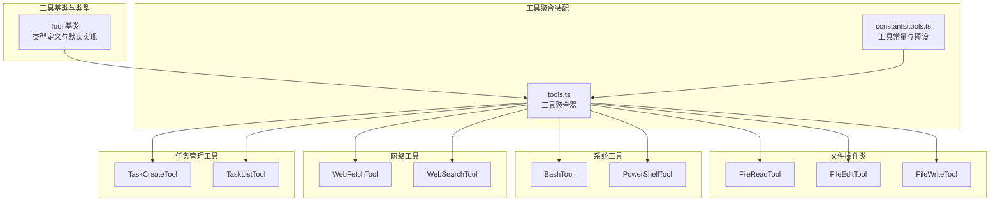
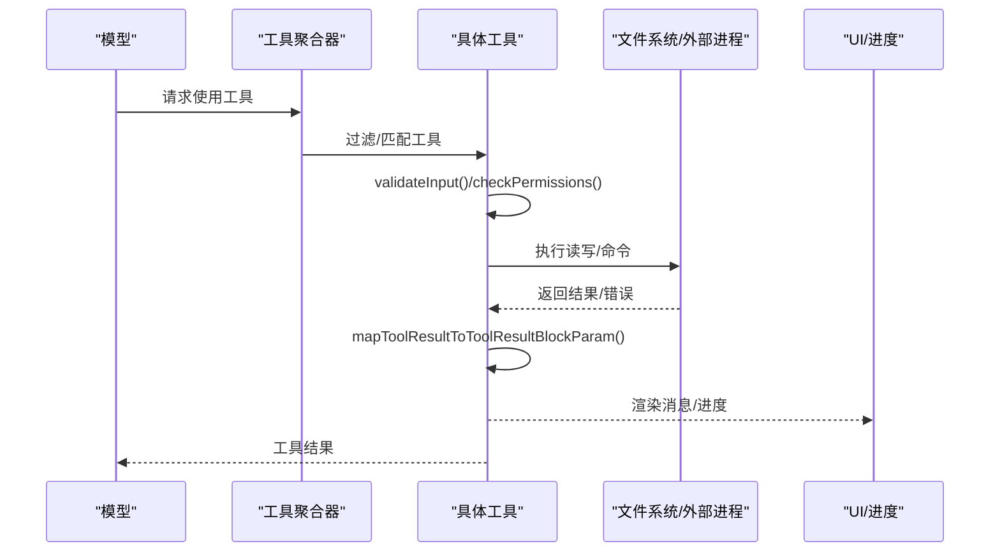
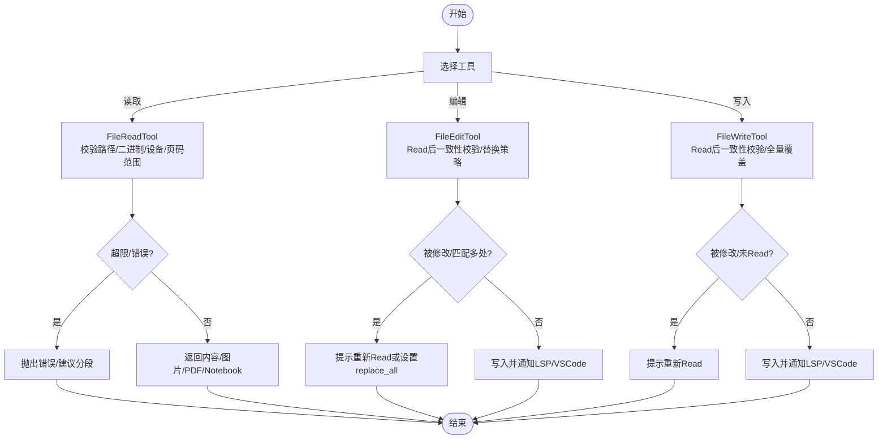
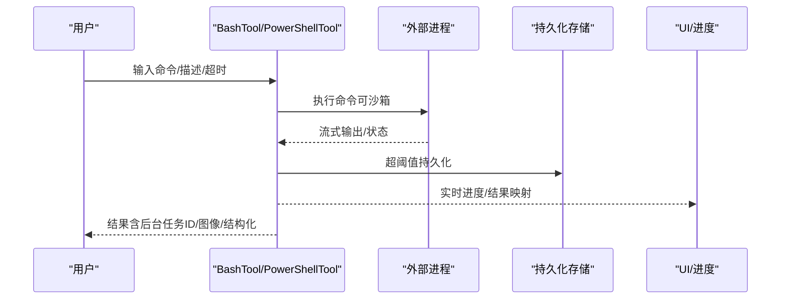
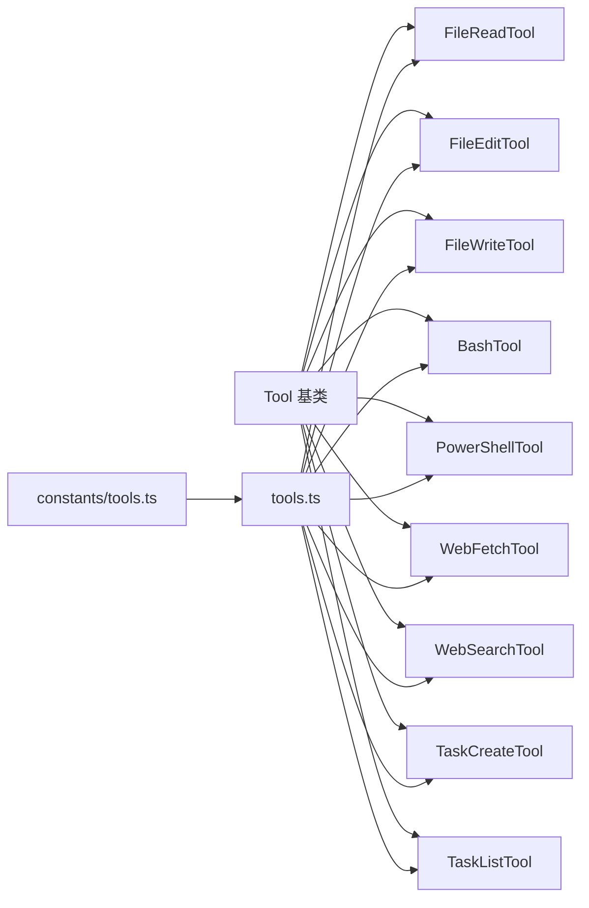

# 内置工具参考

<cite>
**本文引用的文件**
- [工具基类与类型定义](file://src/Tool.ts)
- [工具聚合装配器](file://src/tools.ts)
- [内置工具常量与预设](file://src/constants/tools.ts)
- [文件读取工具 FileReadTool](file://src/tools/FileReadTool/FileReadTool.ts)
- [文件编辑工具 FileEditTool](file://src/tools/FileEditTool/FileEditTool.ts)
- [文件写入工具 FileWriteTool](file://src/tools/FileWriteTool/FileWriteTool.ts)
- [Bash 工具 BashTool](file://src/tools/BashTool/BashTool.tsx)
- [PowerShell 工具 PowerShellTool](file://src/tools/PowerShellTool/PowerShellTool.tsx)
- [网页抓取工具 WebFetchTool](file://src/tools/WebFetchTool/WebFetchTool.ts)
- [网页搜索工具 WebSearchTool](file://src/tools/WebSearchTool/WebSearchTool.ts)
- [任务创建工具 TaskCreateTool](file://src/tools/TaskCreateTool/TaskCreateTool.ts)
- [任务列表工具 TaskListTool](file://src/tools/TaskListTool/TaskListTool.ts)
</cite>

## 目录
1. [简介](#简介)
2. [项目结构](#项目结构)
3. [核心组件](#核心组件)
4. [架构总览](#架构总览)
5. [详细组件分析](#详细组件分析)
6. [依赖关系分析](#依赖关系分析)
7. [性能考量](#性能考量)
8. [故障排查指南](#故障排查指南)
9. [结论](#结论)
10. [附录](#附录)

## 简介
本参考文档面向 Claude Code 的内置工具体系，系统梳理文件操作类（FileReadTool、FileEditTool、FileWriteTool）、系统工具（BashTool、PowerShellTool）、网络工具（WebFetchTool、WebSearchTool）、任务管理工具（TaskCreateTool、TaskListTool）等的接口、行为、权限与限制，并提供参数说明、返回值格式、典型用法与最佳实践。文档兼顾初学者概览与高级用户的深度技术细节，帮助快速理解与安全高效地使用这些工具。

## 项目结构
内置工具由统一的工具基类与类型系统抽象，通过工具聚合器集中装配，结合权限上下文进行过滤与呈现。不同工具模块位于 src/tools 下，按功能分层组织；工具聚合器负责根据运行环境、特性开关与权限规则生成最终可用工具集。

图表来源
- [工具基类与类型定义:362-695](file://src/Tool.ts#L362-L695)
- [工具聚合装配器:193-251](file://src/tools.ts#L193-L251)
- [内置工具常量与预设:36-114](file://src/constants/tools.ts#L36-L114)

章节来源
- [工具基类与类型定义:1-795](file://src/Tool.ts#L1-L795)
- [工具聚合装配器:1-391](file://src/tools.ts#L1-L391)
- [内置工具常量与预设:1-114](file://src/constants/tools.ts#L1-L114)

## 核心组件
- 工具基类与类型系统：统一的工具接口、输入输出模式、权限校验、并发安全、只读/破坏性标记、进度与渲染钩子等。
- 工具聚合器：按环境特性、权限规则与 REPL 模式组装可用工具集合，支持内置与 MCP 工具合并。
- 工具常量与预设：定义工具名称、允许/禁止清单、搜索提示、工作树/计划模式等工具能力边界。

章节来源
- [工具基类与类型定义:362-695](file://src/Tool.ts#L362-L695)
- [工具聚合装配器:271-367](file://src/tools.ts#L271-L367)
- [内置工具常量与预设:36-114](file://src/constants/tools.ts#L36-L114)

## 架构总览
工具调用链路从“模型请求”到“权限校验/输入校验/执行/结果映射”，贯穿 UI 渲染、进度回调与错误处理。Bash/PowerShell 工具支持后台任务与输出持久化，文件工具具备读写一致性与历史备份能力。

图表来源
- [工具基类与类型定义:379-560](file://src/Tool.ts#L379-L560)
- [Bash 工具 BashTool:624-800](file://src/tools/BashTool/BashTool.tsx#L624-L800)
- [PowerShell 工具 PowerShellTool:437-662](file://src/tools/PowerShellTool/PowerShellTool.tsx#L437-L662)

## 详细组件分析

### 文件操作类

#### FileReadTool（文件读取）
- 功能要点
  - 支持文本、图片、PDF、Jupyter Notebook 多媒体读取与部分提取。
  - 路径展开、UNC 安全检查、二进制扩展过滤、设备文件阻断。
  - 令牌数与大小限制校验，超限抛出专用错误。
  - 内容去重：同一范围且未变更的文件直接返回“未变化”占位，避免重复缓存。
  - 技能发现：基于路径触发技能目录发现与激活。
- 参数
  - file_path: 绝对路径或相对路径（内部展开）
  - offset: 起始行号（用于大文件分段）
  - limit: 读取行数
  - pages: PDF 页码范围（如 "1-5", "3"）
- 返回值
  - 文本：包含内容、起止行与总行数
  - 图片：base64 与尺寸信息
  - Notebook：cells 数组
  - PDF：元数据或页面拆分产物
  - 未变更：占位消息
- 权限与限制
  - 仅只读；受文件系统读取权限规则约束
  - 受最大令牌数与最大文件大小限制
  - 设备文件与特定二进制扩展被阻断
- 最佳实践
  - 大文件优先使用 offset/limit 分段读取
  - PDF 使用 pages 指定范围，避免一次性读取过多
  - 避免读取设备文件与敏感二进制文件

章节来源
- [文件读取工具 FileReadTool:227-335](file://src/tools/FileReadTool/FileReadTool.ts#L227-L335)
- [文件读取工具 FileReadTool:418-495](file://src/tools/FileReadTool/FileReadTool.ts#L418-L495)
- [文件读取工具 FileReadTool:496-718](file://src/tools/FileReadTool/FileReadTool.ts#L496-L718)

#### FileEditTool（文件编辑）
- 功能要点
  - 在 Read 后进行原子写入，确保一致性与可回滚
  - 读取状态校验：若文件自上次读取后被修改，拒绝覆盖
  - 替换策略：支持 replace_all 控制全部替换
  - 技能发现与激活：基于路径触发
  - LSP 通知：变更与保存事件同步至语言服务器
  - VSCode 差异视图通知
- 参数
  - file_path: 目标文件绝对路径
  - old_string/new_string: 查找与替换内容
  - replace_all: 是否全部替换
- 返回值
  - 结构化补丁、原始内容、是否用户修改、Git Diff（可选）
- 权限与限制
  - 仅写入；受文件系统写入权限规则约束
  - 不支持 Jupyter Notebook（需使用 NotebookEditTool）
  - 超大文件拒绝编辑
- 最佳实践
  - 先 Read 再 Edit，避免并发修改导致失败
  - 使用更精确的 old_string 缩小匹配范围，必要时设置 replace_all
  - 注意换行风格与引号风格保留

章节来源
- [文件编辑工具 FileEditTool:137-362](file://src/tools/FileEditTool/FileEditTool.ts#L137-L362)
- [文件编辑工具 FileEditTool:387-595](file://src/tools/FileEditTool/FileEditTool.ts#L387-L595)

#### FileWriteTool（文件写入）
- 功能要点
  - 全量内容覆盖写入，保留显式换行风格
  - 读取状态校验：若文件自上次读取后被修改，拒绝覆盖
  - 技能发现与激活：基于路径触发
  - LSP 通知与 VSCode 差异视图
  - Git Diff 计算（可选）
- 参数
  - file_path: 目标文件绝对路径
  - content: 新内容
- 返回值
  - 类型：create/update；文件路径、内容、结构化补丁、原始内容、Git Diff（可选）
- 权限与限制
  - 仅写入；受文件系统写入权限规则约束
  - 必须先 Read，否则拒绝写入
- 最佳实践
  - 明确换行风格，避免跨平台差异
  - 大文件建议先分块生成再一次性写入

章节来源
- [文件写入工具 FileWriteTool:153-222](file://src/tools/FileWriteTool/FileWriteTool.ts#L153-L222)
- [文件写入工具 FileWriteTool:223-434](file://src/tools/FileWriteTool/FileWriteTool.ts#L223-L434)

#### 文件操作工具对比与流程

图表来源
- [文件读取工具 FileReadTool:418-495](file://src/tools/FileReadTool/FileReadTool.ts#L418-L495)
- [文件编辑工具 FileEditTool:137-362](file://src/tools/FileEditTool/FileEditTool.ts#L137-L362)
- [文件写入工具 FileWriteTool:153-222](file://src/tools/FileWriteTool/FileWriteTool.ts#L153-L222)

### 系统工具

#### BashTool（Shell 命令）
- 功能要点
  - 解析命令以识别搜索/读取/列表类命令，支持 UI 折叠显示
  - 自动后台任务：长耗时命令自动后台运行，支持用户手动后台
  - 输出截断与持久化：超过阈值自动落盘并提供预览
  - 结构化内容与图像输出：支持将 stdout 作为图像块发送
  - 沙箱策略：根据平台与策略决定是否启用沙箱
  - 交互式提示：支持权限对话与 sed 预览模拟写入
- 参数
  - command: 待执行命令
  - timeout: 超时毫秒数（受最大超时限制）
  - description: 命令描述（用于 UI 展示）
  - run_in_background: 是否后台运行
  - dangerouslyDisableSandbox: 是否禁用沙箱（谨慎使用）
- 返回值
  - stdout/stderr、中断标志、是否图像输出、后台任务 ID、结构化内容、持久化路径与大小
- 权限与限制
  - 读取/只读判定：基于命令语义与安全规则
  - 禁止长时间阻塞：检测 sleep 等阻塞命令并引导后台或 Monitor 工具
  - 平台沙箱策略：POSIX 平台默认沙箱，Windows 受企业策略影响
- 最佳实践
  - 大输出命令使用 run_in_background 或分段处理
  - 需要精确 sed 写入时，先预览再批准，避免绕过权限检查

章节来源
- [Bash 工具 BashTool:227-264](file://src/tools/BashTool/BashTool.tsx#L227-L264)
- [Bash 工具 BashTool:279-296](file://src/tools/BashTool/BashTool.tsx#L279-L296)
- [Bash 工具 BashTool:420-623](file://src/tools/BashTool/BashTool.tsx#L420-L623)
- [Bash 工具 BashTool:624-800](file://src/tools/BashTool/BashTool.tsx#L624-L800)

#### PowerShellTool（Windows PowerShell 命令）
- 功能要点
  - 与 BashTool 类似的后台任务、输出持久化、图像输出与结构化内容支持
  - PowerShell 特有的搜索/读取命令识别与只读判定
  - Windows 平台沙箱策略：原生 Windows 不支持沙箱，企业策略可能强制沙箱
  - 交互式提示：支持权限对话与 Claude Code Hints 提示
- 参数
  - command: PowerShell 命令
  - timeout/description/run_in_background/dangerouslyDisableSandbox: 同 BashTool
- 返回值
  - stdout/stderr、中断标志、图像标志、后台任务 ID、持久化路径与大小
- 权限与限制
  - 读取/只读判定：基于同步安全启发与 AST 解析
  - Windows 沙箱策略：企业策略强制沙箱且不支持时拒绝执行
- 最佳实践
  - 避免长时间阻塞命令；必要时后台运行
  - 注意 Windows 平台沙箱限制，遵循企业安全策略

章节来源
- [PowerShell 工具 PowerShellTool:228-244](file://src/tools/PowerShellTool/PowerShellTool.tsx#L228-L244)
- [PowerShell 工具 PowerShellTool:245-258](file://src/tools/PowerShellTool/PowerShellTool.tsx#L245-L258)
- [PowerShell 工具 PowerShellTool:272-436](file://src/tools/PowerShellTool/PowerShellTool.tsx#L272-L436)
- [PowerShell 工具 PowerShellTool:437-662](file://src/tools/PowerShellTool/PowerShellTool.tsx#L437-L662)

#### 系统工具对比与序列

图表来源
- [Bash 工具 BashTool:624-800](file://src/tools/BashTool/BashTool.tsx#L624-L800)
- [PowerShell 工具 PowerShellTool:437-662](file://src/tools/PowerShellTool/PowerShellTool.tsx#L437-L662)

### 网络工具

#### WebFetchTool（网页抓取）
- 功能要点
  - 抓取指定 URL 的网页内容，支持解析与结构化输出
  - 与工具系统集成，参与权限与输入校验
- 参数
  - url: 目标网页地址
  - timeout: 超时毫秒数
- 返回值
  - 页面内容摘要或结构化数据（依据实现）
- 权限与限制
  - 受网络访问与目标站点限制
  - 建议配合代理/认证服务使用
- 最佳实践
  - 对于需要登录或动态渲染的页面，考虑使用浏览器工具或 MCP 服务

章节来源
- [网页抓取工具 WebFetchTool:1-200](file://src/tools/WebFetchTool/WebFetchTool.ts#L1-L200)

#### WebSearchTool（网页搜索）
- 功能要点
  - 执行网络搜索，返回结果摘要与链接
  - 与工具系统集成，参与权限与输入校验
- 参数
  - query: 搜索关键词
  - num_results: 返回结果数量
  - timeout: 超时毫秒数
- 返回值
  - 搜索结果列表（标题、摘要、链接等）
- 权限与限制
  - 受网络访问与搜索引擎限制
- 最佳实践
  - 使用明确关键词，必要时限定时间范围或站点

章节来源
- [网页搜索工具 WebSearchTool:1-200](file://src/tools/WebSearchTool/WebSearchTool.ts#L1-L200)

### 任务管理工具

#### TaskCreateTool（创建任务）
- 功能要点
  - 创建后台任务，返回任务 ID 与输出路径
  - 支持描述与超时控制
- 参数
  - description: 任务描述
  - timeout: 超时毫秒数
- 返回值
  - 任务 ID、输出路径、状态
- 权限与限制
  - 受任务调度与资源配额限制
- 最佳实践
  - 将耗时操作转为任务，保持对话响应性

章节来源
- [任务创建工具 TaskCreateTool:1-200](file://src/tools/TaskCreateTool/TaskCreateTool.ts#L1-L200)

#### TaskListTool（列出任务）
- 功能要点
  - 列举当前会话中的任务，支持筛选与状态查询
- 参数
  - filter: 过滤条件（如状态、描述关键字）
- 返回值
  - 任务列表（ID、描述、状态、输出路径等）
- 权限与限制
  - 仅可见当前会话的任务
- 最佳实践
  - 定期清理已完成任务，避免资源占用

章节来源
- [任务列表工具 TaskListTool:1-200](file://src/tools/TaskListTool/TaskListTool.ts#L1-L200)

## 依赖关系分析

图表来源
- [工具基类与类型定义:362-695](file://src/Tool.ts#L362-L695)
- [工具聚合装配器:193-251](file://src/tools.ts#L193-L251)
- [内置工具常量与预设:36-114](file://src/constants/tools.ts#L36-L114)

章节来源
- [工具聚合装配器:193-251](file://src/tools.ts#L193-L251)
- [内置工具常量与预设:36-114](file://src/constants/tools.ts#L36-L114)

## 性能考量
- 文件读取
  - 大文件分段(offset/limit)与 PDF 页范围限制，避免一次性加载造成内存压力
  - 读取去重机制减少重复传输与缓存浪费
- 文件写入/编辑
  - 原子写入与一致性校验，避免并发写入冲突
  - LSP/VSCode 通知减少二次扫描成本
- Shell 工具
  - 输出阈值持久化与图像压缩，降低带宽与渲染开销
  - 自动后台任务提升交互响应性
- 任务管理
  - 任务列表与状态查询应合理筛选，避免遍历大量历史任务

## 故障排查指南
- 文件读取
  - “文件不存在/类似文件”：检查路径是否正确，尝试相对路径展开或在 CWD 下查找
  - “超出最大令牌数/文件过大”：使用 offset/limit 或 pages 分段读取
  - “设备文件/二进制扩展”：避免读取 /dev/*、/proc/* 与二进制文件
- 文件编辑/写入
  - “文件已被修改”：先重新 Read，确认内容未被外部修改
  - “未先 Read”：先调用 FileReadTool 获取最新状态
  - “Jupyter Notebook”：改用 NotebookEditTool
- Bash/PowerShell
  - “长时间阻塞命令”：使用 run_in_background 或切换到 Monitor 工具
  - “Windows 沙箱策略拒绝”：检查企业策略，或在支持平台使用沙箱
  - “输出过大”：查看持久化路径并在后续用 FileReadTool 读取
- 网络工具
  - “无法访问/超时”：检查网络连通性、代理与目标站点限制
- 任务管理
  - “任务未完成/找不到”：确认任务 ID 与当前会话，定期清理已完成任务

章节来源
- [文件读取工具 FileReadTool:418-495](file://src/tools/FileReadTool/FileReadTool.ts#L418-L495)
- [文件编辑工具 FileEditTool:137-362](file://src/tools/FileEditTool/FileEditTool.ts#L137-L362)
- [文件写入工具 FileWriteTool:153-222](file://src/tools/FileWriteTool/FileWriteTool.ts#L153-L222)
- [Bash 工具 BashTool:524-538](file://src/tools/BashTool/BashTool.tsx#L524-L538)
- [PowerShell 工具 PowerShellTool:352-374](file://src/tools/PowerShellTool/PowerShellTool.tsx#L352-L374)

## 结论
内置工具体系以统一的工具基类为核心，围绕权限、并发安全、只读/破坏性、输入校验与结果映射构建了稳定可靠的执行框架。文件操作类强调一致性与安全性，系统工具关注后台任务与输出优化，网络与任务工具则提供扩展与自动化能力。通过合理的参数设计与最佳实践，可在保证安全的前提下高效完成复杂任务。

## 附录

### 工具清单与能力边界
- 文件操作类：FileReadTool（只读）、FileEditTool（写入）、FileWriteTool（写入）
- 系统工具：BashTool（POSIX/WSL）、PowerShellTool（Windows）
- 网络工具：WebFetchTool、WebSearchTool
- 任务管理：TaskCreateTool、TaskListTool
- 工具常量与预设：工具名称、允许/禁止清单、搜索提示、工作树/计划模式等

章节来源
- [内置工具常量与预设:36-114](file://src/constants/tools.ts#L36-L114)
- [工具聚合装配器:193-251](file://src/tools.ts#L193-L251)