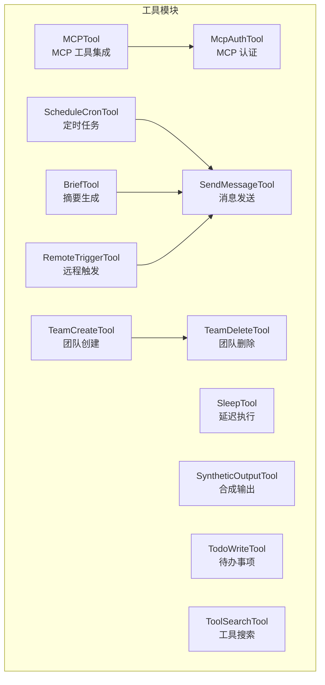
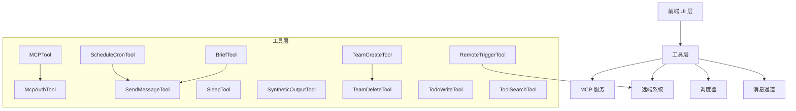
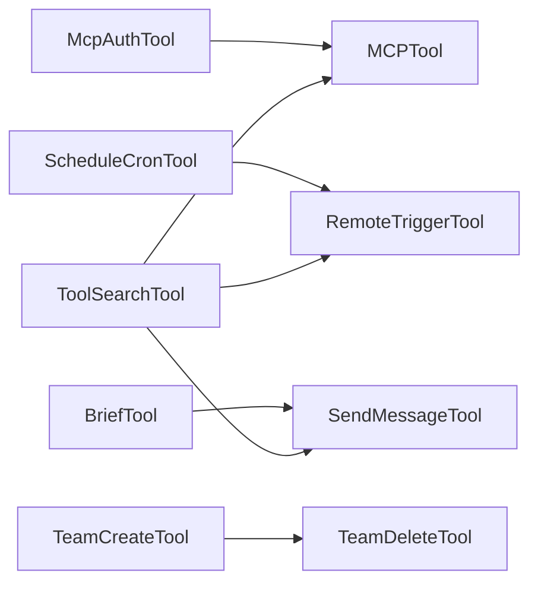

# 实用工具与支持工具

<cite>
**本文引用的文件**
- [BriefTool.ts](file://src/tools/BriefTool/BriefTool.ts)
- [UI.tsx](file://src/tools/BriefTool/UI.tsx)
- [prompt.ts](file://src/tools/BriefTool/prompt.ts)
- [upload.ts](file://src/tools/BriefTool/upload.ts)
- [MCPTool.ts](file://src/tools/MCPTool/MCPTool.ts)
- [UI.tsx](file://src/tools/MCPTool/UI.tsx)
- [classifyForCollapse.ts](file://src/tools/MCPTool/classifyForCollapse.ts)
- [prompt.ts](file://src/tools/MCPTool/prompt.ts)
- [McpAuthTool.ts](file://src/tools/McpAuthTool/McpAuthTool.ts)
- [RemoteTriggerTool.ts](file://src/tools/RemoteTriggerTool/RemoteTriggerTool.ts)
- [UI.tsx](file://src/tools/RemoteTriggerTool/UI.tsx)
- [prompt.ts](file://src/tools/RemoteTriggerTool/prompt.ts)
- [CronCreateTool.ts](file://src/tools/ScheduleCronTool/CronCreateTool.ts)
- [CronDeleteTool.ts](file://src/tools/ScheduleCronTool/CronDeleteTool.ts)
- [CronListTool.ts](file://src/tools/ScheduleCronTool/CronListTool.ts)
- [UI.tsx](file://src/tools/ScheduleCronTool/UI.tsx)
- [prompt.ts](file://src/tools/ScheduleCronTool/prompt.ts)
- [SendMessageTool.ts](file://src/tools/SendMessageTool/SendMessageTool.ts)
- [UI.tsx](file://src/tools/SendMessageTool/UI.tsx)
- [constants.ts](file://src/tools/SendMessageTool/constants.ts)
- [prompt.ts](file://src/tools/SendMessageTool/prompt.ts)
- [SleepTool/prompt.ts](file://src/tools/SleepTool/prompt.ts)
- [SyntheticOutputTool.ts](file://src/tools/SyntheticOutputTool/SyntheticOutputTool.ts)
- [TeamCreateTool.ts](file://src/tools/TeamCreateTool/TeamCreateTool.ts)
- [TeamDeleteTool.ts](file://src/tools/TeamDeleteTool/TeamDeleteTool.ts)
- [TodoWriteTool.ts](file://src/tools/TodoWriteTool/TodoWriteTool.ts)
- [ToolSearchTool.ts](file://src/tools/ToolSearchTool/ToolSearchTool.ts)
</cite>

## 目录
1. [简介](#简介)
2. [项目结构](#项目结构)
3. [核心组件](#核心组件)
4. [架构总览](#架构总览)
5. [详细组件分析](#详细组件分析)
6. [依赖关系分析](#依赖关系分析)
7. [性能考量](#性能考量)
8. [故障排除指南](#故障排除指南)
9. [结论](#结论)
10. [附录](#附录)

## 简介
本文件为实用工具与支持工具的参考文档，覆盖以下工具：BriefTool（摘要生成）、MCPTool（MCP 工具集成）、McpAuthTool（MCP 认证）、RemoteTriggerTool（远程触发）、ScheduleCronTool（定时任务）、SendMessageTool（消息发送）、SleepTool（延迟执行）、SyntheticOutputTool（合成输出）、TeamCreateTool（团队创建）、TeamDeleteTool（团队删除）、TodoWriteTool（待办事项）、ToolSearchTool（工具搜索）。内容包括功能特性、适用场景、参数说明、使用示例、集成指南、权限与限制、安全考虑、最佳实践与故障排除。

## 项目结构
这些工具位于 src/tools 目录下，按功能模块划分，每个工具通常包含实现文件与 UI 文件（若存在），以及提示词与上传处理等辅助模块。例如：
- 摘要生成：BriefTool
- MCP 集成：MCPTool
- MCP 认证：McpAuthTool
- 远程触发：RemoteTriggerTool
- 定时任务：ScheduleCronTool（含创建、删除、列出）
- 消息发送：SendMessageTool
- 延迟执行：SleepTool
- 合成输出：SyntheticOutputTool
- 团队管理：TeamCreateTool、TeamDeleteTool
- 待办事项：TodoWriteTool
- 工具搜索：ToolSearchTool

## 核心组件
- BriefTool：基于输入内容生成摘要，支持附件上传与提示词定制。
- MCPTool：封装 MCP 资源访问与调用流程，提供 UI 与分类折叠逻辑。
- McpAuthTool：负责 MCP 服务器授权与认证流程。
- RemoteTriggerTool：触发远端操作或事件。
- ScheduleCronTool：提供定时任务的创建、删除、查询能力。
- SendMessageTool：向指定通道或用户发送消息。
- SleepTool：延时执行，用于流程编排。
- SyntheticOutputTool：生成合成输出结果。
- TeamCreateTool / TeamDeleteTool：团队生命周期管理。
- TodoWriteTool：写入或更新待办事项。
- ToolSearchTool：检索可用工具集合并返回匹配项。

章节来源
- [BriefTool.ts:1-200](file://src/tools/BriefTool/BriefTool.ts#L1-L200)
- [MCPTool.ts:1-200](file://src/tools/MCPTool/MCPTool.ts#L1-L200)
- [McpAuthTool.ts:1-200](file://src/tools/McpAuthTool/McpAuthTool.ts#L1-L200)
- [RemoteTriggerTool.ts:1-200](file://src/tools/RemoteTriggerTool/RemoteTriggerTool.ts#L1-L200)
- [CronCreateTool.ts:1-200](file://src/tools/ScheduleCronTool/CronCreateTool.ts#L1-L200)
- [CronDeleteTool.ts:1-200](file://src/tools/ScheduleCronTool/CronDeleteTool.ts#L1-L200)
- [CronListTool.ts:1-200](file://src/tools/ScheduleCronTool/CronListTool.ts#L1-L200)
- [SendMessageTool.ts:1-200](file://src/tools/SendMessageTool/SendMessageTool.ts#L1-L200)
- [SleepTool/prompt.ts:1-200](file://src/tools/SleepTool/prompt.ts#L1-L200)
- [SyntheticOutputTool.ts:1-200](file://src/tools/SyntheticOutputTool/SyntheticOutputTool.ts#L1-L200)
- [TeamCreateTool.ts:1-200](file://src/tools/TeamCreateTool/TeamCreateTool.ts#L1-L200)
- [TeamDeleteTool.ts:1-200](file://src/tools/TeamDeleteTool/TeamDeleteTool.ts#L1-L200)
- [TodoWriteTool.ts:1-200](file://src/tools/TodoWriteTool/TodoWriteTool.ts#L1-L200)
- [ToolSearchTool.ts:1-200](file://src/tools/ToolSearchTool/ToolSearchTool.ts#L1-L200)

## 架构总览
各工具遵循统一的工具接口与调用模式，通过提示词驱动与可选 UI 组件增强交互体验。MCPTool 依赖 McpAuthTool 完成认证；ScheduleCronTool 与 SendMessageTool 可作为工作流节点协同；RemoteTriggerTool 提供外部触发入口；BriefTool 与 SendMessageTool 可组合用于信息汇总与通知。

图表来源
- [MCPTool.ts:1-200](file://src/tools/MCPTool/MCPTool.ts#L1-L200)
- [McpAuthTool.ts:1-200](file://src/tools/McpAuthTool/McpAuthTool.ts#L1-L200)
- [SendMessageTool.ts:1-200](file://src/tools/SendMessageTool/SendMessageTool.ts#L1-L200)
- [ScheduleCronTool/CronCreateTool.ts:1-200](file://src/tools/ScheduleCronTool/CronCreateTool.ts#L1-L200)
- [RemoteTriggerTool.ts:1-200](file://src/tools/RemoteTriggerTool/RemoteTriggerTool.ts#L1-L200)
- [BriefTool.ts:1-200](file://src/tools/BriefTool/BriefTool.ts#L1-L200)
- [SyntheticOutputTool.ts:1-200](file://src/tools/SyntheticOutputTool/SyntheticOutputTool.ts#L1-L200)
- [TeamCreateTool.ts:1-200](file://src/tools/TeamCreateTool/TeamCreateTool.ts#L1-L200)
- [TeamDeleteTool.ts:1-200](file://src/tools/TeamDeleteTool/TeamDeleteTool.ts#L1-L200)
- [TodoWriteTool.ts:1-200](file://src/tools/TodoWriteTool/TodoWriteTool.ts#L1-L200)
- [ToolSearchTool.ts:1-200](file://src/tools/ToolSearchTool/ToolSearchTool.ts#L1-L200)

## 详细组件分析

### BriefTool（摘要生成）
- 功能概述：从输入文本或附件中提取关键信息并生成摘要，支持上传与提示词定制。
- 适用场景：会议纪要、文档提炼、知识归档、快速审阅。
- 关键文件与职责：
  - [BriefTool.ts:1-200](file://src/tools/BriefTool/BriefTool.ts#L1-L200)：工具主实现
  - [UI.tsx](file://src/tools/BriefTool/UI.tsx)：摘要界面与交互
  - [prompt.ts](file://src/tools/BriefTool/prompt.ts)：摘要提示词模板
  - [upload.ts](file://src/tools/BriefTool/upload.ts)：附件上传处理
- 参数说明（示例性描述）
  - 输入：文本内容、附件列表、目标语言、摘要长度偏好
  - 输出：摘要文本、关联附件元数据
- 使用示例（步骤化）
  1) 在 UI 中选择文件或粘贴文本
  2) 调整摘要长度与风格偏好
  3) 点击“生成摘要”，查看结果并导出
- 集成指南
  - 通过工具注册机制接入会话或工作流
  - 结合 SendMessageTool 将摘要推送到消息通道
- 权限与限制
  - 上传附件需符合大小与类型限制
  - 摘要生成受模型上下文长度与配额约束
- 安全考虑
  - 上传前进行敏感信息扫描与脱敏
  - 仅在可信网络环境下处理机密文档
- 最佳实践
  - 对长文档分段处理以提升准确性
  - 使用明确的提示词模板确保一致性
- 故障排除
  - 若摘要为空：检查输入是否过短或被过滤
  - 若上传失败：确认文件格式与大小限制

章节来源
- [BriefTool.ts:1-200](file://src/tools/BriefTool/BriefTool.ts#L1-L200)
- [UI.tsx:1-200](file://src/tools/BriefTool/UI.tsx#L1-L200)
- [prompt.ts:1-200](file://src/tools/BriefTool/prompt.ts#L1-L200)
- [upload.ts:1-200](file://src/tools/BriefTool/upload.ts#L1-L200)

### MCPTool（MCP 工具集成）
- 功能概述：封装 MCP 资源读取、分类与调用流程，提供 UI 与提示词支持。
- 适用场景：跨服务资源发现与调用、统一接口访问。
- 关键文件与职责：
  - [MCPTool.ts:1-200](file://src/tools/MCPTool/MCPTool.ts#L1-L200)：工具主实现
  - [UI.tsx](file://src/tools/MCPTool/UI.tsx)：资源浏览与选择界面
  - [classifyForCollapse.ts](file://src/tools/MCPTool/classifyForCollapse.ts)：资源分类与折叠逻辑
  - [prompt.ts](file://src/tools/MCPTool/prompt.ts)：调用提示词模板
- 参数说明（示例性描述）
  - 输入：MCP 服务器标识、资源类型、过滤条件
  - 输出：资源清单、调用结果
- 使用示例（步骤化）
  1) 在 UI 中选择 MCP 服务器
  2) 浏览资源并筛选类型
  3) 选择目标资源并执行调用
- 集成指南
  - 先通过 McpAuthTool 完成认证
  - 在工作流中串联多个 MCP 调用
- 权限与限制
  - 需具备对应资源的访问权限
  - 受 MCP 服务器策略与速率限制约束
- 安全考虑
  - 仅在受信环境中访问敏感资源
  - 传输过程启用加密
- 最佳实践
  - 缓存常用资源列表以减少重复请求
  - 使用分类折叠提升大清单的可读性
- 故障排除
  - 若无法连接：检查服务器地址与网络连通性
  - 若无结果：确认资源类型与过滤条件

章节来源
- [MCPTool.ts:1-200](file://src/tools/MCPTool/MCPTool.ts#L1-L200)
- [UI.tsx:1-200](file://src/tools/MCPTool/UI.tsx#L1-L200)
- [classifyForCollapse.ts:1-200](file://src/tools/MCPTool/classifyForCollapse.ts#L1-L200)
- [prompt.ts:1-200](file://src/tools/MCPTool/prompt.ts#L1-L200)

### McpAuthTool（MCP 认证）
- 功能概述：完成 MCP 服务器的授权与认证，为后续 MCPTool 调用提供凭据。
- 适用场景：首次接入 MCP 服务器、刷新令牌、切换环境。
- 关键文件与职责：
  - [McpAuthTool.ts:1-200](file://src/tools/McpAuthTool/McpAuthTool.ts#L1-L200)：认证主流程
- 参数说明（示例性描述）
  - 输入：服务器地址、客户端凭据、回调地址
  - 输出：访问令牌、刷新令牌、有效期
- 使用示例（步骤化）
  1) 打开认证对话框
  2) 登录并授权
  3) 保存凭据并返回成功状态
- 集成指南
  - 在 MCPTool 调用前先执行认证
  - 将令牌持久化到安全存储
- 权限与限制
  - 需具备管理员或开发者权限
  - 令牌有效期有限，需定期刷新
- 安全考虑
  - 令牌不落盘或最小化存储时间
  - 使用 HTTPS 传输
- 最佳实践
  - 自动检测过期并触发刷新
  - 多服务器场景下维护独立凭据
- 故障排除
  - 若认证失败：检查服务器可达性与凭据正确性
  - 若令牌无效：尝试重新授权

章节来源
- [McpAuthTool.ts:1-200](file://src/tools/McpAuthTool/McpAuthTool.ts#L1-L200)

### RemoteTriggerTool（远程触发）
- 功能概述：触发远端系统中的特定事件或操作，常用于自动化编排。
- 适用场景：CI/CD 触发、监控告警响应、外部系统联动。
- 关键文件与职责：
  - [RemoteTriggerTool.ts:1-200](file://src/tools/RemoteTriggerTool/RemoteTriggerTool.ts#L1-L200)：触发逻辑
  - [UI.tsx](file://src/tools/RemoteTriggerTool/UI.tsx)：触发界面
  - [prompt.ts](file://src/tools/RemoteTriggerTool/prompt.ts)：触发提示词
- 参数说明（示例性描述）
  - 输入：远端服务地址、事件类型、参数映射
  - 输出：触发状态、响应体
- 使用示例（步骤化）
  1) 在 UI 中选择事件类型与参数
  2) 确认后执行触发
  3) 查看远端日志与回执
- 集成指南
  - 与 ScheduleCronTool 协作实现定时触发
  - 与 SendMessageTool 发送通知
- 权限与限制
  - 需远端系统开放相应接口
  - 受远端速率与并发限制
- 安全考虑
  - 严格校验参数与来源
  - 使用签名或令牌保护接口
- 最佳实践
  - 记录每次触发的上下文与回执
  - 设置超时与重试策略
- 故障排除
  - 若无响应：检查远端服务状态与网络
  - 若参数错误：核对事件类型与必填字段

章节来源
- [RemoteTriggerTool.ts:1-200](file://src/tools/RemoteTriggerTool/RemoteTriggerTool.ts#L1-L200)
- [UI.tsx:1-200](file://src/tools/RemoteTriggerTool/UI.tsx#L1-L200)
- [prompt.ts:1-200](file://src/tools/RemoteTriggerTool/prompt.ts#L1-L200)

### ScheduleCronTool（定时任务）
- 功能概述：提供定时任务的创建、删除、查询能力，支持与消息发送等工具协作。
- 适用场景：周期性备份、报表生成、健康检查。
- 关键文件与职责：
  - [CronCreateTool.ts:1-200](file://src/tools/ScheduleCronTool/CronCreateTool.ts#L1-L200)：创建任务
  - [CronDeleteTool.ts:1-200](file://src/tools/ScheduleCronTool/CronDeleteTool.ts#L1-L200)：删除任务
  - [CronListTool.ts:1-200](file://src/tools/ScheduleCronTool/CronListTool.ts#L1-L200)：列出任务
  - [UI.tsx](file://src/tools/ScheduleCronTool/UI.tsx)：任务管理界面
  - [prompt.ts](file://src/tools/ScheduleCronTool/prompt.ts)：任务提示词
- 参数说明（示例性描述）
  - 创建：表达式、目标工具、参数、描述
  - 删除：任务 ID
  - 列表：过滤条件（如状态、名称）
- 使用示例（步骤化）
  1) 在 UI 中输入 Cron 表达式与目标工具
  2) 保存并确认创建
  3) 定期查看任务状态与历史
- 集成指南
  - 与 SendMessageTool 推送执行结果
  - 与 RemoteTriggerTool 触发外部动作
- 权限与限制
  - 需具备任务管理权限
  - 受系统最大并发与资源限制
- 安全考虑
  - 限制高风险工具的自动执行
  - 审计每次任务的触发与结果
- 最佳实践
  - 使用稳定的 Cron 表达式与时区
  - 为关键任务设置告警与回滚
- 故障排除
  - 若未执行：检查表达式与系统负载
  - 若结果异常：查看任务日志与工具输出

章节来源
- [CronCreateTool.ts:1-200](file://src/tools/ScheduleCronTool/CronCreateTool.ts#L1-L200)
- [CronDeleteTool.ts:1-200](file://src/tools/ScheduleCronTool/CronDeleteTool.ts#L1-L200)
- [CronListTool.ts:1-200](file://src/tools/ScheduleCronTool/CronListTool.ts#L1-L200)
- [UI.tsx:1-200](file://src/tools/ScheduleCronTool/UI.tsx#L1-L200)
- [prompt.ts:1-200](file://src/tools/ScheduleCronTool/prompt.ts#L1-L200)

### SendMessageTool（消息发送）
- 功能概述：向指定通道或用户发送消息，支持多种消息类型与样式。
- 适用场景：通知、报告、告警、进度反馈。
- 关键文件与职责：
  - [SendMessageTool.ts:1-200](file://src/tools/SendMessageTool/SendMessageTool.ts#L1-L200)：发送逻辑
  - [UI.tsx](file://src/tools/SendMessageTool/UI.tsx)：消息编辑与发送界面
  - [constants.ts](file://src/tools/SendMessageTool/constants.ts)：消息常量与默认值
  - [prompt.ts](file://src/tools/SendMessageTool/prompt.ts)：消息提示词
- 参数说明（示例性描述）
  - 输入：接收方、消息内容、样式、附件
  - 输出：发送状态、消息 ID
- 使用示例（步骤化）
  1) 在 UI 中选择接收方与消息模板
  2) 编辑内容并插入附件
  3) 点击发送并跟踪状态
- 集成指南
  - 与 BriefTool 的摘要结果结合
  - 与 ScheduleCronTool 的周期性报告结合
- 权限与限制
  - 需具备消息发送权限
  - 受通道容量与频率限制
- 安全考虑
  - 过滤敏感信息与链接
  - 仅向授权用户发送
- 最佳实践
  - 使用模板化消息提升一致性
  - 为重要消息设置确认与回执
- 故障排除
  - 若发送失败：检查接收方有效性与通道状态
  - 若内容被拒：调整格式或长度

章节来源
- [SendMessageTool.ts:1-200](file://src/tools/SendMessageTool/SendMessageTool.ts#L1-L200)
- [UI.tsx:1-200](file://src/tools/SendMessageTool/UI.tsx#L1-L200)
- [constants.ts:1-200](file://src/tools/SendMessageTool/constants.ts#L1-L200)
- [prompt.ts:1-200](file://src/tools/SendMessageTool/prompt.ts#L1-L200)

### SleepTool（延迟执行）
- 功能概述：在工具链中插入延迟，用于控制执行节奏或等待外部状态变化。
- 适用场景：重试退避、等待资源就绪、流程节拍控制。
- 关键文件与职责：
  - [prompt.ts:1-200](file://src/tools/SleepTool/prompt.ts#L1-L200)：延迟提示词与参数定义
- 参数说明（示例性描述）
  - 输入：延迟时长（秒/毫秒）、原因说明
  - 输出：延迟完成信号
- 使用示例（步骤化）
  1) 在工作流中插入延迟节点
  2) 设置合理的延迟时长
  3) 观察后续步骤的执行时机
- 集成指南
  - 与 ScheduleCronTool 的重试策略结合
  - 与 RemoteTriggerTool 的幂等性设计结合
- 权限与限制
  - 无特殊权限要求
  - 受系统最大延迟与资源限制
- 安全考虑
  - 避免无限延迟导致阻塞
  - 明确超时与中断机制
- 最佳实践
  - 使用指数退避策略
  - 记录延迟原因与耗时
- 故障排除
  - 若提前结束：检查中断信号
  - 若超时：调整时长并增加重试

章节来源
- [SleepTool/prompt.ts:1-200](file://src/tools/SleepTool/prompt.ts#L1-L200)

### SyntheticOutputTool（合成输出）
- 功能概述：生成结构化或非结构化的合成输出，便于测试与演示。
- 适用场景：原型验证、数据模拟、测试用例生成。
- 关键文件与职责：
  - [SyntheticOutputTool.ts:1-200](file://src/tools/SyntheticOutputTool/SyntheticOutputTool.ts#L1-L200)：输出生成逻辑
- 参数说明（示例性描述）
  - 输入：输出类型、模板、占位符
  - 输出：合成数据或文本
- 使用示例（步骤化）
  1) 选择输出类型与模板
  2) 填充占位符并生成
  3) 导入到下游工具进行消费
- 集成指南
  - 与 TeamCreateTool 的初始化数据结合
  - 与 TodoWriteTool 的测试任务结合
- 权限与限制
  - 无特殊权限要求
  - 受生成复杂度与资源限制
- 安全考虑
  - 避免生成真实敏感数据
  - 仅用于测试环境
- 最佳实践
  - 使用可配置模板提升复用性
  - 为输出添加版本与注释
- 故障排除
  - 若生成失败：检查模板语法
  - 若格式错误：校验占位符映射

章节来源
- [SyntheticOutputTool.ts:1-200](file://src/tools/SyntheticOutputTool/SyntheticOutputTool.ts#L1-L200)

### TeamCreateTool（团队创建）
- 功能概述：创建新团队，初始化成员与权限。
- 适用场景：项目启动、临时工作组、实验团队。
- 关键文件与职责：
  - [TeamCreateTool.ts:1-200](file://src/tools/TeamCreateTool/TeamCreateTool.ts#L1-L200)：创建逻辑
- 参数说明（示例性描述）
  - 输入：团队名称、成员列表、权限策略
  - 输出：团队 ID、初始状态
- 使用示例（步骤化）
  1) 在 UI 中填写团队信息
  2) 指定初始成员与角色
  3) 确认创建并分配资源
- 集成指南
  - 与 SyntheticOutputTool 生成初始成员数据
  - 与 TeamDeleteTool 的清理流程结合
- 权限与限制
  - 需具备团队管理权限
  - 受组织配额与策略限制
- 安全考虑
  - 严格控制初始权限
  - 审计成员变更
- 最佳实践
  - 使用标准化命名与描述
  - 为团队设置生命周期策略
- 故障排除
  - 若创建失败：检查名称唯一性与成员有效性
  - 若权限异常：核对策略与默认角色

章节来源
- [TeamCreateTool.ts:1-200](file://src/tools/TeamCreateTool/TeamCreateTool.ts#L1-L200)

### TeamDeleteTool（团队删除）
- 功能概述：删除团队并回收资源，支持批量清理。
- 适用场景：项目结项、团队解散、资源回收。
- 关键文件与职责：
  - [TeamDeleteTool.ts:1-200](file://src/tools/TeamDeleteTool/TeamDeleteTool.ts#L1-L200)：删除逻辑
- 参数说明（示例性描述）
  - 输入：团队 ID、确认选项、清理范围
  - 输出：删除状态、回收清单
- 使用示例（步骤化）
  1) 选择目标团队并确认删除
  2) 选择清理范围（成员、资源、数据）
  3) 执行删除并核对回收结果
- 集成指南
  - 与 TeamCreateTool 的生命周期闭环
  - 与 ScheduleCronTool 的定期清理结合
- 权限与限制
  - 需具备删除权限
  - 受审计与保留策略限制
- 安全考虑
  - 删除前进行二次确认
  - 确保不可恢复数据的备份策略
- 最佳实践
  - 分步删除与验证
  - 记录删除原因与影响面
- 故障排除
  - 若删除失败：检查依赖与锁定状态
  - 若残留资源：手动清理并上报

章节来源
- [TeamDeleteTool.ts:1-200](file://src/tools/TeamDeleteTool/TeamDeleteTool.ts#L1-L200)

### TodoWriteTool（待办事项）
- 功能概述：写入或更新待办事项，支持优先级与截止日期。
- 适用场景：任务分配、进度跟踪、个人与团队计划。
- 关键文件与职责：
  - [TodoWriteTool.ts:1-200](file://src/tools/TodoWriteTool/TodoWriteTool.ts#L1-L200)：写入逻辑
- 参数说明（示例性描述）
  - 输入：标题、描述、优先级、截止时间、所属人
  - 输出：任务 ID、状态
- 使用示例（步骤化）
  1) 在 UI 中创建任务并设置属性
  2) 指派给相关人员
  3) 跟踪状态与完成情况
- 集成指南
  - 与 SyntheticOutputTool 生成测试任务
  - 与 ScheduleCronTool 的周期性检查结合
- 权限与限制
  - 需具备任务创建与修改权限
  - 受个人/团队配额限制
- 安全考虑
  - 限制敏感任务的可见范围
  - 审计关键字段变更
- 最佳实践
  - 使用清晰的任务标题与描述
  - 设置合理的截止时间与提醒
- 故障排除
  - 若创建失败：检查必填字段与权限
  - 若指派失败：确认用户存在与权限

章节来源
- [TodoWriteTool.ts:1-200](file://src/tools/TodoWriteTool/TodoWriteTool.ts#L1-L200)

### ToolSearchTool（工具搜索）
- 功能概述：根据关键词或类别搜索可用工具，并返回匹配集合。
- 适用场景：工具发现、工作流编排、能力评估。
- 关键文件与职责：
  - [ToolSearchTool.ts:1-200](file://src/tools/ToolSearchTool/ToolSearchTool.ts#L1-L200)：搜索逻辑
- 参数说明（示例性描述）
  - 输入：关键词、类别、过滤条件
  - 输出：工具清单、评分与元信息
- 使用示例（步骤化）
  1) 在 UI 中输入关键词
  2) 应用类别与过滤条件
  3) 选择合适工具并加入工作流
- 集成指南
  - 与 ScheduleCronTool 的工具选择结合
  - 与 McpAuthTool 的可用工具集合结合
- 权限与限制
  - 受当前用户可见工具集限制
  - 受搜索性能与缓存策略限制
- 安全考虑
  - 仅返回可访问工具
  - 避免泄露内部工具细节
- 最佳实践
  - 使用多关键词与布尔查询
  - 结合评分与最近使用记录
- 故障排除
  - 若无结果：扩大关键词或放宽过滤
  - 若响应慢：启用缓存与分页

章节来源
- [ToolSearchTool.ts:1-200](file://src/tools/ToolSearchTool/ToolSearchTool.ts#L1-L200)

## 依赖关系分析
- 认证依赖：MCPTool 依赖 McpAuthTool 完成凭据获取与刷新。
- 触发依赖：RemoteTriggerTool 依赖远端系统接口，可能与 ScheduleCronTool 协作。
- 输出依赖：BriefTool 与 SendMessageTool 组合用于信息汇总与通知。
- 生命周期依赖：TeamCreateTool 与 TeamDeleteTool 形成闭环。
- 搜索依赖：ToolSearchTool 为其他工具提供发现能力。

图表来源
- [McpAuthTool.ts:1-200](file://src/tools/McpAuthTool/McpAuthTool.ts#L1-L200)
- [MCPTool.ts:1-200](file://src/tools/MCPTool/MCPTool.ts#L1-L200)
- [RemoteTriggerTool.ts:1-200](file://src/tools/RemoteTriggerTool/RemoteTriggerTool.ts#L1-L200)
- [ScheduleCronTool/CronCreateTool.ts:1-200](file://src/tools/ScheduleCronTool/CronCreateTool.ts#L1-L200)
- [BriefTool.ts:1-200](file://src/tools/BriefTool/BriefTool.ts#L1-L200)
- [SendMessageTool.ts:1-200](file://src/tools/SendMessageTool/SendMessageTool.ts#L1-L200)
- [TeamCreateTool.ts:1-200](file://src/tools/TeamCreateTool/TeamCreateTool.ts#L1-L200)
- [TeamDeleteTool.ts:1-200](file://src/tools/TeamDeleteTool/TeamDeleteTool.ts#L1-L200)
- [ToolSearchTool.ts:1-200](file://src/tools/ToolSearchTool/ToolSearchTool.ts#L1-L200)

## 性能考量
- I/O 优化：合理分页与缓存，避免一次性加载大量资源。
- 并发控制：限制同时触发的任务数量，防止资源争用。
- 超时与重试：为远端调用设置合理超时与指数退避。
- 资源隔离：为高开销工具（如摘要生成）设置配额与节流。
- 日志与追踪：记录关键指标（耗时、成功率、错误码）以便优化。

## 故障排除指南
- 认证问题：检查服务器可达性、凭据有效期与权限范围。
- 连接失败：核对网络、代理与防火墙设置。
- 权限不足：确认用户角色与策略配置。
- 超时与重试：调整超时阈值并实现幂等设计。
- 数据异常：校验输入格式、长度与编码。
- 审计与回溯：启用日志与审计，定位问题根因。

章节来源
- [McpAuthTool.ts:1-200](file://src/tools/McpAuthTool/McpAuthTool.ts#L1-L200)
- [MCPTool.ts:1-200](file://src/tools/MCPTool/MCPTool.ts#L1-L200)
- [RemoteTriggerTool.ts:1-200](file://src/tools/RemoteTriggerTool/RemoteTriggerTool.ts#L1-L200)
- [ScheduleCronTool/CronCreateTool.ts:1-200](file://src/tools/ScheduleCronTool/CronCreateTool.ts#L1-L200)
- [SendMessageTool.ts:1-200](file://src/tools/SendMessageTool/SendMessageTool.ts#L1-L200)
- [BriefTool.ts:1-200](file://src/tools/BriefTool/BriefTool.ts#L1-L200)
- [TeamCreateTool.ts:1-200](file://src/tools/TeamCreateTool/TeamCreateTool.ts#L1-L200)
- [TeamDeleteTool.ts:1-200](file://src/tools/TeamDeleteTool/TeamDeleteTool.ts#L1-L200)
- [ToolSearchTool.ts:1-200](file://src/tools/ToolSearchTool/ToolSearchTool.ts#L1-L200)

## 结论
上述工具覆盖了摘要生成、MCP 集成、认证、远程触发、定时任务、消息发送、延迟执行、合成输出、团队管理、待办事项与工具搜索等核心能力。通过统一的接口与提示词体系，这些工具可在不同场景下灵活组合，形成高效、可扩展的工作流解决方案。建议在生产环境中重视权限控制、安全审计与性能优化，并建立完善的故障排除与回滚机制。

## 附录
- 快速索引：各工具的实现文件与 UI 文件路径已在“章节来源”中标注，便于进一步查阅。
- 版本与兼容性：请关注工具的提示词与参数版本变化，必要时进行迁移与适配。