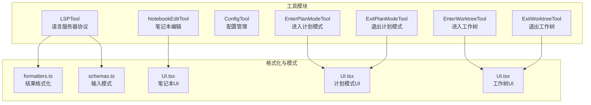
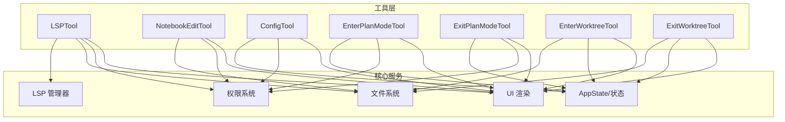
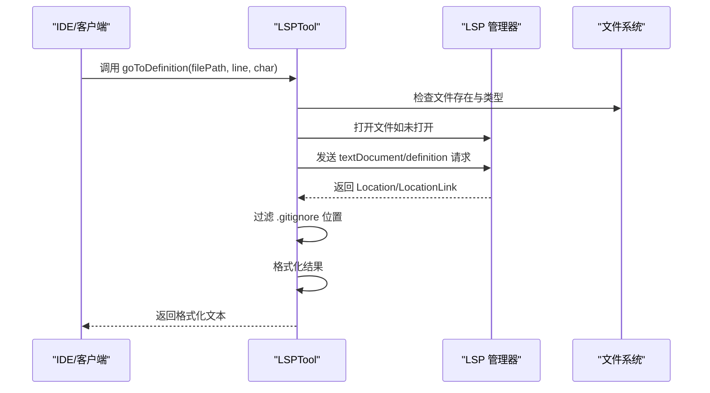
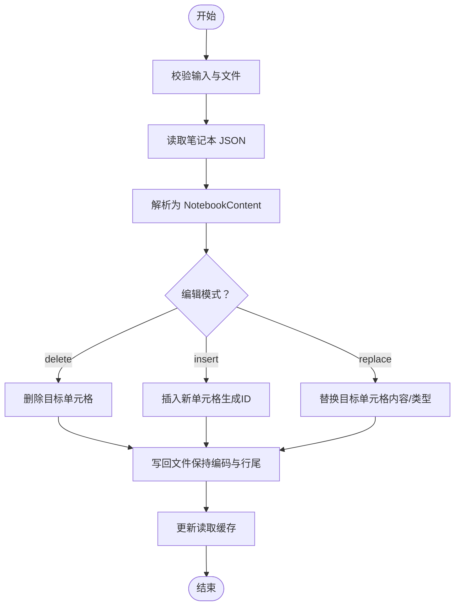
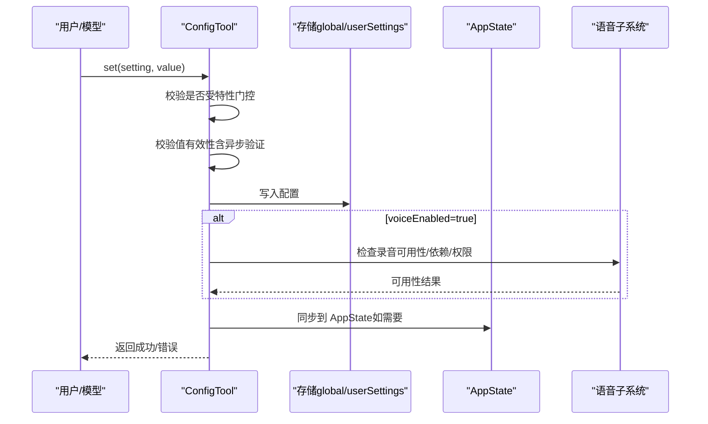
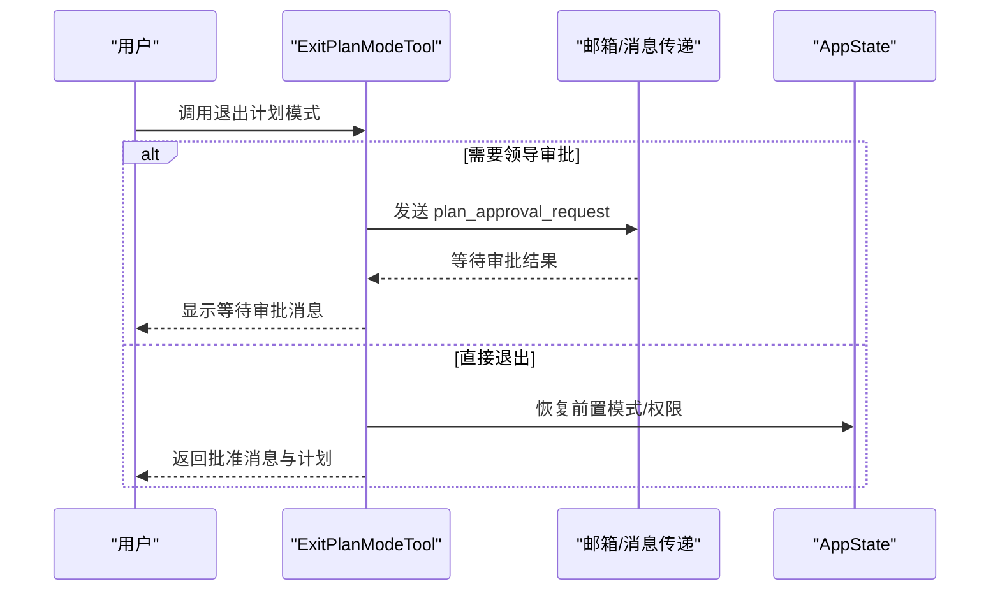
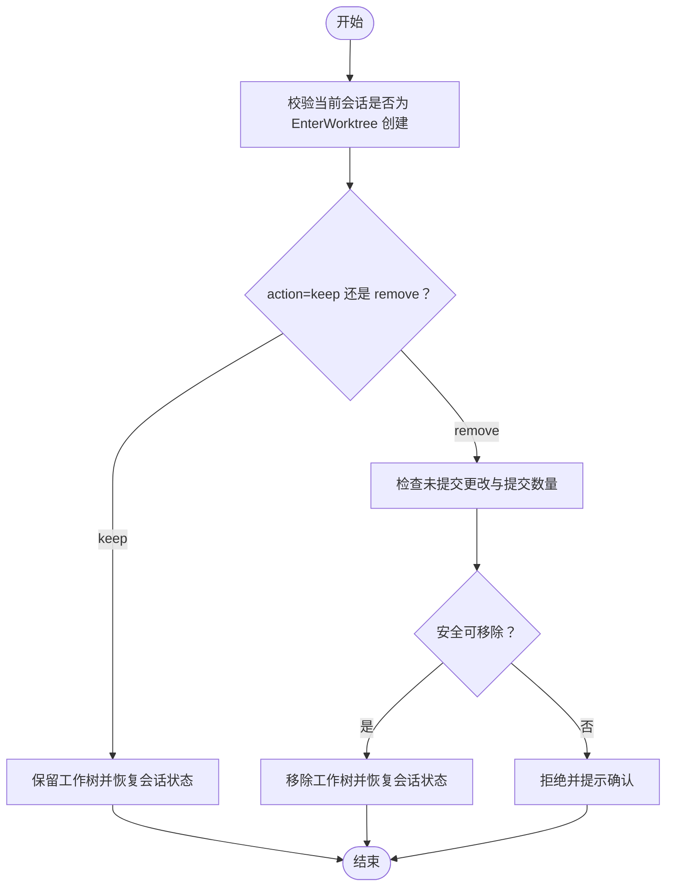
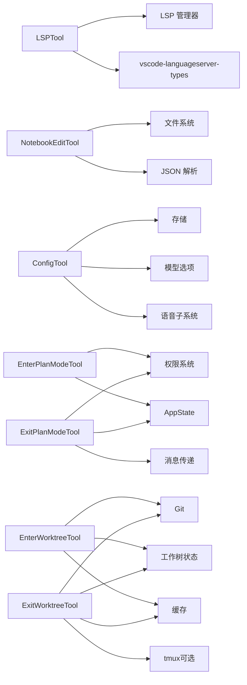

# 开发辅助工具

<cite>
**本文档引用的文件**
- [LSPTool.ts](file://src/tools/LSPTool/LSPTool.ts)
- [formatters.ts](file://src/tools/LSPTool/formatters.ts)
- [schemas.ts](file://src/tools/LSPTool/schemas.ts)
- [NotebookEditTool.ts](file://src/tools/NotebookEditTool/NotebookEditTool.ts)
- [UI.tsx](file://src/tools/NotebookEditTool/UI.tsx)
- [ConfigTool.ts](file://src/tools/ConfigTool/ConfigTool.ts)
- [supportedSettings.ts](file://src/tools/ConfigTool/supportedSettings.ts)
- [EnterPlanModeTool.ts](file://src/tools/EnterPlanModeTool/EnterPlanModeTool.ts)
- [UI.tsx](file://src/tools/EnterPlanModeTool/UI.tsx)
- [ExitPlanModeV2Tool.ts](file://src/tools/ExitPlanModeTool/ExitPlanModeV2Tool.ts)
- [UI.tsx](file://src/tools/ExitPlanModeTool/UI.tsx)
- [EnterWorktreeTool.ts](file://src/tools/EnterWorktreeTool/EnterWorktreeTool.ts)
- [UI.tsx](file://src/tools/EnterWorktreeTool/UI.tsx)
- [ExitWorktreeTool.ts](file://src/tools/ExitWorktreeTool/ExitWorktreeTool.ts)
- [UI.tsx](file://src/tools/ExitWorktreeTool/UI.tsx)
</cite>

## 目录
1. [简介](#简介)
2. [项目结构](#项目结构)
3. [核心组件](#核心组件)
4. [架构总览](#架构总览)
5. [详细组件分析](#详细组件分析)
6. [依赖关系分析](#依赖关系分析)
7. [性能考虑](#性能考虑)
8. [故障排除指南](#故障排除指南)
9. [结论](#结论)
10. [附录](#附录)

## 简介
本文件为开发辅助工具的参考文档，覆盖以下工具：LSPTool（语言服务器协议）、NotebookEditTool（笔记本编辑）、ConfigTool（配置管理）、EnterPlanModeTool（进入计划模式）、ExitPlanModeTool（退出计划模式）、EnterWorktreeTool（进入工作树）和ExitWorktreeTool（退出工作树）。内容涵盖功能特性、IDE 集成机制、代码分析能力、开发环境配置、参数说明、配置选项、使用示例、与主流 IDE 的集成方式、代码补全与诊断功能、典型开发场景（重构、配置管理、模式切换），以及各工具的最佳实践建议。

## 项目结构
这些工具均位于 src/tools 下，采用“按工具分目录”的组织方式，每个工具包含：
- 工具实现文件（.ts）
- 输入输出模式定义（schemas.ts 或输入/输出 schema）
- 结果格式化器（formatters.ts，适用于 LSPTool）
- UI 渲染与消息（UI.tsx）

**图表来源**
- [LSPTool.ts:1-862](file://src/tools/LSPTool/LSPTool.ts#L1-L862)
- [formatters.ts:1-594](file://src/tools/LSPTool/formatters.ts#L1-L594)
- [schemas.ts:1-217](file://src/tools/LSPTool/schemas.ts#L1-L217)
- [NotebookEditTool.ts:1-492](file://src/tools/NotebookEditTool/NotebookEditTool.ts#L1-L492)
- [UI.tsx:1-94](file://src/tools/NotebookEditTool/UI.tsx#L1-L94)
- [EnterPlanModeTool.ts:1-128](file://src/tools/EnterPlanModeTool/EnterPlanModeTool.ts#L1-L128)
- [UI.tsx:1-34](file://src/tools/EnterPlanModeTool/UI.tsx#L1-L34)
- [ExitPlanModeV2Tool.ts:1-495](file://src/tools/ExitPlanModeTool/ExitPlanModeV2Tool.ts#L1-L495)
- [UI.tsx:1-83](file://src/tools/ExitPlanModeTool/UI.tsx#L1-L83)
- [EnterWorktreeTool.ts:1-129](file://src/tools/EnterWorktreeTool/EnterWorktreeTool.ts#L1-L129)
- [UI.tsx:1-21](file://src/tools/EnterWorktreeTool/UI.tsx#L1-L21)
- [ExitWorktreeTool.ts:1-331](file://src/tools/ExitWorktreeTool/ExitWorktreeTool.ts#L1-L331)
- [UI.tsx:1-26](file://src/tools/ExitWorktreeTool/UI.tsx#L1-L26)

**章节来源**
- [LSPTool.ts:1-862](file://src/tools/LSPTool/LSPTool.ts#L1-L862)
- [NotebookEditTool.ts:1-492](file://src/tools/NotebookEditTool/NotebookEditTool.ts#L1-L492)
- [ConfigTool.ts:1-469](file://src/tools/ConfigTool/ConfigTool.ts#L1-L469)
- [EnterPlanModeTool.ts:1-128](file://src/tools/EnterPlanModeTool/EnterPlanModeTool.ts#L1-L128)
- [ExitPlanModeV2Tool.ts:1-495](file://src/tools/ExitPlanModeTool/ExitPlanModeV2Tool.ts#L1-L495)
- [EnterWorktreeTool.ts:1-129](file://src/tools/EnterWorktreeTool/EnterWorktreeTool.ts#L1-L129)
- [ExitWorktreeTool.ts:1-331](file://src/tools/ExitWorktreeTool/ExitWorktreeTool.ts#L1-L331)

## 核心组件
- LSPTool：封装 LSP 操作（跳转定义、查找引用、悬停信息、文档符号、工作区符号、实现跳转、调用层次等），统一格式化输出，过滤 .gitignore 文件，支持大文件限制与并发安全。
- NotebookEditTool：对 .ipynb 笔记本进行读写编辑（替换、插入、删除单元格），严格校验输入路径与单元格 ID，确保读写一致性与缓存同步。
- ConfigTool：集中式配置管理，支持全局与用户设置两类存储源，动态选项与异步校验，即时同步到 AppState 以驱动 UI 实时更新。
- Enter/ExitPlanModeTool：在“探索与设计”阶段之间切换，进入计划模式后禁止某些操作，退出时可提交给团队领导审批或直接恢复权限上下文。
- Enter/ExitWorktreeTool：在 Git 工作树之间切换，进入时创建隔离工作树并变更会话上下文；退出时可保留或移除工作树并恢复原始工作目录。

**章节来源**
- [LSPTool.ts:127-422](file://src/tools/LSPTool/LSPTool.ts#L127-L422)
- [NotebookEditTool.ts:90-490](file://src/tools/NotebookEditTool/NotebookEditTool.ts#L90-L490)
- [ConfigTool.ts:67-434](file://src/tools/ConfigTool/ConfigTool.ts#L67-L434)
- [EnterPlanModeTool.ts:36-126](file://src/tools/EnterPlanModeTool/EnterPlanModeTool.ts#L36-L126)
- [ExitPlanModeV2Tool.ts:147-493](file://src/tools/ExitPlanModeTool/ExitPlanModeV2Tool.ts#L147-L493)
- [EnterWorktreeTool.ts:52-127](file://src/tools/EnterWorktreeTool/EnterWorktreeTool.ts#L52-L127)
- [ExitWorktreeTool.ts:148-329](file://src/tools/ExitWorktreeTool/ExitWorktreeTool.ts#L148-L329)

## 架构总览
下图展示工具层与核心服务之间的交互关系，包括 LSP 管理器、文件系统、权限与状态管理、UI 渲染等。

**图表来源**
- [LSPTool.ts:224-414](file://src/tools/LSPTool/LSPTool.ts#L224-L414)
- [NotebookEditTool.ts:295-489](file://src/tools/NotebookEditTool/NotebookEditTool.ts#L295-L489)
- [ConfigTool.ts:111-411](file://src/tools/ConfigTool/ConfigTool.ts#L111-L411)
- [EnterPlanModeTool.ts:77-102](file://src/tools/EnterPlanModeTool/EnterPlanModeTool.ts#L77-L102)
- [ExitPlanModeV2Tool.ts:243-418](file://src/tools/ExitPlanModeTool/ExitPlanModeV2Tool.ts#L243-L418)
- [EnterWorktreeTool.ts:77-119](file://src/tools/EnterWorktreeTool/EnterWorktreeTool.ts#L77-L119)
- [ExitWorktreeTool.ts:227-321](file://src/tools/ExitWorktreeTool/ExitWorktreeTool.ts#L227-L321)

## 详细组件分析

### LSPTool（语言服务器协议）
- 功能特性
  - 支持的操作：goToDefinition、findReferences、hover、documentSymbol、workspaceSymbol、goToImplementation、prepareCallHierarchy、incomingCalls、outgoingCalls。
  - 自动打开文件到 LSP 服务器，避免重复 I/O；对超大文件（默认 ≤10MB）进行保护。
  - 过滤 .gitignore 排除的文件位置，减少无关结果。
  - 统一格式化输出，支持多种结果计数统计（结果数量、文件数量）。
- 参数说明
  - operation：操作类型枚举。
  - filePath：目标文件路径（绝对或相对）。
  - line、character：基于 1 的行列坐标。
- 输出说明
  - operation、result（格式化后的文本）、filePath、resultCount、fileCount。
- 使用示例
  - 在某文件第 10 行第 5 列查询“定义”，返回“在文件:10:5”的定位信息。
  - 查询“引用”，返回跨文件引用列表及每文件的引用行号。
- 与 IDE 集成
  - 通过 LSP 管理器与语言服务器通信；在 VS Code 等环境中由 LSP 客户端驱动。
  - 支持调用层次（incomingCalls/outgoingCalls）需先 prepareCallHierarchy。
- 最佳实践
  - 先确保文件已打开到 LSP 服务器，再发起请求。
  - 对于 workspaceSymbol，空查询返回全部符号，注意性能与结果过滤。
  - 大型项目中优先使用精确位置查询，避免全库扫描。

**图表来源**
- [LSPTool.ts:224-394](file://src/tools/LSPTool/LSPTool.ts#L224-L394)
- [formatters.ts:127-169](file://src/tools/LSPTool/formatters.ts#L127-L169)

**章节来源**
- [LSPTool.ts:59-125](file://src/tools/LSPTool/LSPTool.ts#L59-L125)
- [LSPTool.ts:224-414](file://src/tools/LSPTool/LSPTool.ts#L224-L414)
- [formatters.ts:127-592](file://src/tools/LSPTool/formatters.ts#L127-L592)
- [schemas.ts:8-191](file://src/tools/LSPTool/schemas.ts#L8-L191)

### NotebookEditTool（笔记本编辑）
- 功能特性
  - 替换、插入、删除指定单元格；支持 code/markdown 类型；自动生成新单元格 ID（nbformat ≥ 4.5）。
  - 严格的读前写检查：必须先读取文件，且修改时间一致才允许写入，防止外部变更导致的数据丢失。
  - 写回时保持缩进与行尾风格，更新缓存以避免重复读取。
- 参数说明
  - notebook_path：.ipynb 绝对路径。
  - cell_id：目标单元格 ID 或索引（cell-N 格式）。
  - new_source：新单元格内容。
  - cell_type：code/markdown（插入时必填）。
  - edit_mode：replace/insert/delete。
- 输出说明
  - new_source、cell_id、cell_type、language、edit_mode、error、notebook_path、original_file、updated_file。
- 使用示例
  - 在笔记本中插入一个 markdown 单元格，内容为“说明文字”，cell_type 为 markdown。
  - 删除索引为 3 的单元格。
- 最佳实践
  - 插入新单元格时明确指定 cell_type。
  - 修改 code 单元格后会清空执行计数与输出，避免陈旧状态误导。
  - 始终先读取再写入，确保与最新版本一致。

**图表来源**
- [NotebookEditTool.ts:295-489](file://src/tools/NotebookEditTool/NotebookEditTool.ts#L295-L489)

**章节来源**
- [NotebookEditTool.ts:30-86](file://src/tools/NotebookEditTool/NotebookEditTool.ts#L30-L86)
- [NotebookEditTool.ts:176-294](file://src/tools/NotebookEditTool/NotebookEditTool.ts#L176-L294)
- [NotebookEditTool.ts:295-489](file://src/tools/NotebookEditTool/NotebookEditTool.ts#L295-L489)
- [UI.tsx:16-92](file://src/tools/NotebookEditTool/UI.tsx#L16-L92)

### ConfigTool（配置管理）
- 功能特性
  - 支持 get/set 操作；未知设置键返回错误；布尔值字符串自动转换。
  - 支持运行时特性门控（如 voiceEnabled），必要时进行依赖检查与权限请求。
  - 同步到 AppState 以即时影响 UI（如 verbose、mainLoopModel、thinkingEnabled）。
- 支持的设置（节选）
  - theme、editorMode、verbose、preferredNotifChannel、autoCompactEnabled、autoMemoryEnabled、autoDreamEnabled、fileCheckpointingEnabled、showTurnDuration、terminalProgressBarEnabled、todoFeatureEnabled、model、alwaysThinkingEnabled、permissions.defaultMode、language、teammateMode、classifierPermissionsEnabled（条件）、voiceEnabled（条件）、remoteControlAtStartup（条件）、taskCompleteNotifEnabled、inputNeededNotifEnabled、agentPushNotifEnabled（条件）。
- 参数说明
  - setting：设置键。
  - value：新值（省略则为 get）。
- 输出说明
  - success、operation（get/set）、setting、value/previousValue/newValue、error。
- 使用示例
  - 设置主题为“dark”。
  - 获取当前模型名称。
- 最佳实践
  - 使用 getOptions 获取有效选项，避免非法值。
  - 对 model 等字段写入前进行 validateOnWrite 校验。
  - voiceEnabled 需要登录与麦克风权限，并满足平台依赖要求。

**图表来源**
- [ConfigTool.ts:111-411](file://src/tools/ConfigTool/ConfigTool.ts#L111-L411)
- [supportedSettings.ts:29-186](file://src/tools/ConfigTool/supportedSettings.ts#L29-L186)

**章节来源**
- [ConfigTool.ts:36-66](file://src/tools/ConfigTool/ConfigTool.ts#L36-L66)
- [ConfigTool.ts:111-411](file://src/tools/ConfigTool/ConfigTool.ts#L111-L411)
- [supportedSettings.ts:12-213](file://src/tools/ConfigTool/supportedSettings.ts#L12-L213)

### EnterPlanModeTool（进入计划模式）
- 功能特性
  - 将权限模式切换为“plan”，进入只读探索与设计阶段；支持通道限制（如 KAIROS Channels）禁用入口。
  - 更新权限上下文，准备分类器激活副作用。
- 参数说明
  - 无参数。
- 输出说明
  - message：确认进入计划模式的消息。
- 使用示例
  - 在复杂任务前请求进入计划模式，开始探索与设计。
- 最佳实践
  - 不要在代理上下文中使用该工具。
  - 计划模式下仅探索，不写文件。

**章节来源**
- [EnterPlanModeTool.ts:21-35](file://src/tools/EnterPlanModeTool/EnterPlanModeTool.ts#L21-L35)
- [EnterPlanModeTool.ts:77-102](file://src/tools/EnterPlanModeTool/EnterPlanModeTool.ts#L77-L102)
- [UI.tsx:9-32](file://src/tools/EnterPlanModeTool/UI.tsx#L9-L32)

### ExitPlanModeTool（退出计划模式）
- 功能特性
  - 从计划模式退出，支持本地批准与团队领导审批两种路径；根据前置模式恢复权限上下文；可附加自动模式出口附件。
  - 支持编辑后的计划回显，便于本地 CLI 提取。
- 参数说明
  - allowedPrompts：语义权限请求（用于提示类工具）。
  - plan/planFilePath：SDK 注入的计划内容与路径（内部 schema 扩展）。
- 输出说明
  - plan、isAgent、filePath、hasTaskTool、planWasEdited、awaitingLeaderApproval、requestId。
- 使用示例
  - 用户批准计划后，工具返回保存路径与计划正文，提示开始编码。
- 最佳实践
  - 团队模式下，计划必须经领导审批；本地模式下可直接退出。
  - 若计划被用户编辑过，工具会标注“已编辑”。

**图表来源**
- [ExitPlanModeV2Tool.ts:243-418](file://src/tools/ExitPlanModeTool/ExitPlanModeV2Tool.ts#L243-L418)

**章节来源**
- [ExitPlanModeV2Tool.ts:77-91](file://src/tools/ExitPlanModeTool/ExitPlanModeV2Tool.ts#L77-L91)
- [ExitPlanModeV2Tool.ts:195-220](file://src/tools/ExitPlanModeTool/ExitPlanModeV2Tool.ts#L195-L220)
- [ExitPlanModeV2Tool.ts:243-418](file://src/tools/ExitPlanModeTool/ExitPlanModeV2Tool.ts#L243-L418)
- [UI.tsx:14-82](file://src/tools/ExitPlanModeTool/UI.tsx#L14-L82)

### EnterWorktreeTool（进入工作树）
- 功能特性
  - 创建并切换到隔离的工作树，记录会话状态；变更 CWD 与原始工作目录；清理系统提示缓存与计划目录缓存。
- 参数说明
  - name：工作树名称（可选，未提供则生成计划名）。
- 输出说明
  - worktreePath、worktreeBranch、message。
- 使用示例
  - 创建名为“feature-login”的工作树并切换到其中。
- 最佳实践
  - 当前会话未处于工作树时方可进入；进入后所有后续操作都在工作树内进行。

**章节来源**
- [EnterWorktreeTool.ts:23-50](file://src/tools/EnterWorktreeTool/EnterWorktreeTool.ts#L23-L50)
- [EnterWorktreeTool.ts:77-119](file://src/tools/EnterWorktreeTool/EnterWorktreeTool.ts#L77-L119)
- [UI.tsx:7-20](file://src/tools/EnterWorktreeTool/UI.tsx#L7-L20)

### ExitWorktreeTool（退出工作树）
- 功能特性
  - 退出当前工作树会话，支持“保留”或“移除”两种动作；对未提交更改进行安全校验；恢复原始工作目录与项目根；清理缓存与钩子快照。
- 参数说明
  - action：keep/remove。
  - discard_changes：当 action=remove 且存在未提交更改时必须为 true。
- 输出说明
  - action、originalCwd、worktreePath、worktreeBranch、tmuxSessionName、discardedFiles、discardedCommits、message。
- 使用示例
  - 移除工作树并丢弃未提交的更改与提交记录。
- 最佳实践
  - 在移除前确认更改情况，必要时先提交或暂存；保留工作树时注意分支与 tmux 会话状态。

**图表来源**
- [ExitWorktreeTool.ts:174-224](file://src/tools/ExitWorktreeTool/ExitWorktreeTool.ts#L174-L224)
- [ExitWorktreeTool.ts:227-321](file://src/tools/ExitWorktreeTool/ExitWorktreeTool.ts#L227-L321)

**章节来源**
- [ExitWorktreeTool.ts:30-60](file://src/tools/ExitWorktreeTool/ExitWorktreeTool.ts#L30-L60)
- [ExitWorktreeTool.ts:174-224](file://src/tools/ExitWorktreeTool/ExitWorktreeTool.ts#L174-L224)
- [ExitWorktreeTool.ts:227-321](file://src/tools/ExitWorktreeTool/ExitWorktreeTool.ts#L227-L321)
- [UI.tsx:7-25](file://src/tools/ExitWorktreeTool/UI.tsx#L7-L25)

## 依赖关系分析
- 工具间耦合
  - LSPTool 依赖 LSP 管理器与文件系统，具备并发安全与只读特性。
  - NotebookEditTool 依赖文件系统与读写缓存，强调一致性与幂等。
  - ConfigTool 依赖存储与 AppState 同步，具备运行时特性门控。
  - 计划模式工具与权限系统、AppState 密切关联。
  - 工作树工具与 Git 工作树、会话状态、缓存系统交互。
- 外部依赖
  - LSPTool 依赖 LSP 服务器与 vscode-languageserver-types。
  - NotebookEditTool 依赖 .ipynb 解析与文件元数据读取。
  - ConfigTool 依赖模型选项与语音子系统（条件启用）。
  - 工作树工具依赖 git 命令与 tmux（可选）。

**图表来源**
- [LSPTool.ts:1-52](file://src/tools/LSPTool/LSPTool.ts#L1-L52)
- [NotebookEditTool.ts:1-28](file://src/tools/NotebookEditTool/NotebookEditTool.ts#L1-L28)
- [ConfigTool.ts:1-34](file://src/tools/ConfigTool/ConfigTool.ts#L1-L34)
- [EnterPlanModeTool.ts:1-19](file://src/tools/EnterPlanModeTool/EnterPlanModeTool.ts#L1-L19)
- [ExitPlanModeV2Tool.ts:1-49](file://src/tools/ExitPlanModeTool/ExitPlanModeV2Tool.ts#L1-L49)
- [EnterWorktreeTool.ts:1-18](file://src/tools/EnterWorktreeTool/EnterWorktreeTool.ts#L1-L18)
- [ExitWorktreeTool.ts:1-28](file://src/tools/ExitWorktreeTool/ExitWorktreeTool.ts#L1-L28)

**章节来源**
- [LSPTool.ts:1-52](file://src/tools/LSPTool/LSPTool.ts#L1-L52)
- [NotebookEditTool.ts:1-28](file://src/tools/NotebookEditTool/NotebookEditTool.ts#L1-L28)
- [ConfigTool.ts:1-34](file://src/tools/ConfigTool/ConfigTool.ts#L1-L34)
- [EnterPlanModeTool.ts:1-19](file://src/tools/EnterPlanModeTool/EnterPlanModeTool.ts#L1-L19)
- [ExitPlanModeV2Tool.ts:1-49](file://src/tools/ExitPlanModeTool/ExitPlanModeV2Tool.ts#L1-L49)
- [EnterWorktreeTool.ts:1-18](file://src/tools/EnterWorktreeTool/EnterWorktreeTool.ts#L1-L18)
- [ExitWorktreeTool.ts:1-28](file://src/tools/ExitWorktreeTool/ExitWorktreeTool.ts#L1-L28)

## 性能考虑
- LSPTool
  - 大文件限制（默认 10MB）避免 LSP 服务器压力；仅在未打开时读取文件以减少 I/O。
  - 过滤 .gitignore 位置减少无效结果；统一格式化避免重复解析。
- NotebookEditTool
  - 一次性读取文件元数据（编码、行尾），写回时保持原样，减少多次 IO。
  - 读写缓存与修改时间戳匹配，避免重复读取。
- ConfigTool
  - 动态选项与异步校验延迟到写入阶段，减少不必要的计算。
  - AppState 同步仅在必要字段上进行，降低 UI 抖动。
- 工作树工具
  - 进入/退出时清理缓存与系统提示，避免陈旧信息影响后续分析。

[本节为通用指导，无需特定文件引用]

## 故障排除指南
- LSPTool
  - “无 LSP 服务器可用”：检查文件类型是否受支持；等待初始化完成。
  - “文件过大”：超过 10MB 限制将被拒绝分析。
  - “URI/位置为空”：LSP 服务器返回异常数据，工具会记录调试日志。
- NotebookEditTool
  - “文件未读取”：先调用读取工具，再进行写入。
  - “文件已被外部修改”：重新读取后再写入。
  - “单元格不存在”：检查 cell_id 或 cell-N 索引格式。
- ConfigTool
  - “未知设置”：确认设置键是否在支持列表中。
  - “值无效”：使用 getOptions 获取合法选项；模型校验失败时检查可用模型列表。
  - “语音不可用”：检查登录状态、麦克风权限与平台依赖。
- 工作树工具
  - “非当前会话创建的工作树”：仅对 EnterWorktree 创建的工作树生效。
  - “移除前需确认”：存在未提交更改或提交记录时必须显式确认 discard_changes。

**章节来源**
- [LSPTool.ts:230-297](file://src/tools/LSPTool/LSPTool.ts#L230-L297)
- [LSPTool.ts:556-611](file://src/tools/LSPTool/LSPTool.ts#L556-L611)
- [NotebookEditTool.ts:221-238](file://src/tools/NotebookEditTool/NotebookEditTool.ts#L221-L238)
- [NotebookEditTool.ts:268-291](file://src/tools/NotebookEditTool/NotebookEditTool.ts#L268-L291)
- [ConfigTool.ts:126-130](file://src/tools/ConfigTool/ConfigTool.ts#L126-L130)
- [ConfigTool.ts:204-214](file://src/tools/ConfigTool/ConfigTool.ts#L204-L214)
- [ExitWorktreeTool.ts:190-221](file://src/tools/ExitWorktreeTool/ExitWorktreeTool.ts#L190-L221)

## 结论
上述工具围绕“代码智能、笔记本编辑、配置管理、计划模式、工作树隔离”构建了完整的开发辅助体系。通过严格的输入校验、权限控制与状态同步，确保在不同 IDE 与终端环境下稳定运行。结合本文的参数说明、使用示例与最佳实践，开发者可在重构、配置管理与模式切换等场景中显著提升效率与质量。

[本节为总结，无需特定文件引用]

## 附录
- 常用命令与场景
  - LSP 查询：在任意文件位置查询定义、引用、悬停信息与符号大纲。
  - 笔记本编辑：插入/替换/删除单元格，保持编码与行尾风格一致。
  - 配置管理：统一读取/设置主题、模型、权限模式与通知渠道。
  - 计划模式：进入只读探索与设计阶段，完成后提交审批或直接恢复权限。
  - 工作树：在隔离工作树中进行实验性开发，随时保留或移除。

[本节为概览，无需特定文件引用]